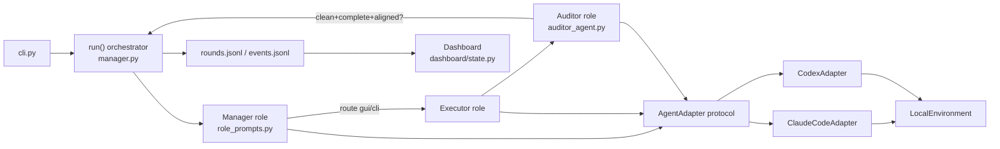
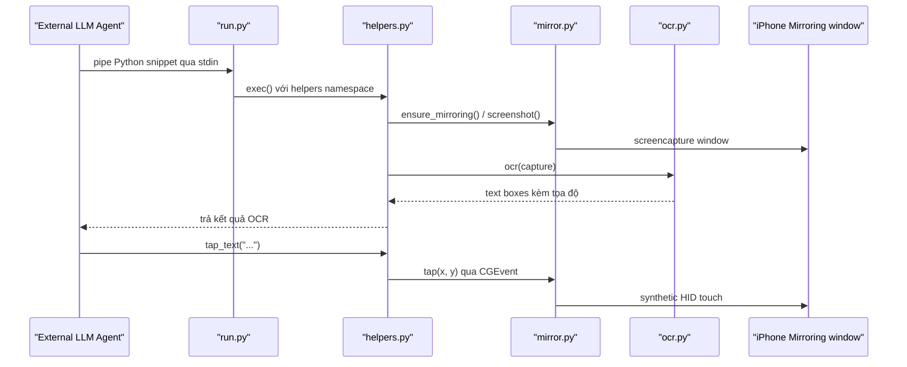
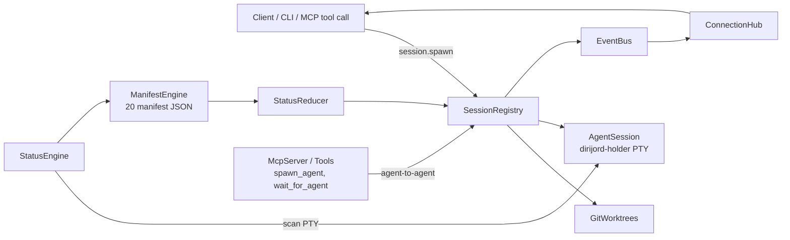

# Weekly Agentic AI Scan — 2026-08-09

**Phạm vi:** Repo GitHub mới publish hoặc active trong khoảng 2026-08-02 → 2026-08-09, có kiến trúc agentic đáng học.

## Tóm tắt (3 điểm chính)

- Tuần này là một tuần **mỏng** về launch mới: query `created:>7d stars:>200` trên GitHub Search chỉ trả về 9 kết quả thô, và chỉ 3 repo sống sót qua bộ lọc loại trừ (awesome-list, tutorial, fork-only, thiếu `/src` hoặc `/docs`, <500 LOC) một cách sạch sẽ.
- Cả 3 repo sống sót đều thuộc nhóm **"agent orchestration harness"** — không phải agent framework kiểu LangChain/CrewAI mới, mà là lớp điều phối bọc quanh các coding-agent CLI đã có sẵn (Claude Code, Codex) để giải quyết vấn đề context-drift, physical-device control, và multi-session parallelism.
- Điểm chung đáng chú ý: cả `LongHorizon-Harness` và `diri` đều dùng **agent-as-black-box** — chúng không tự gọi model, mà điều phối tiến trình CLI của agent khác qua subprocess/PTY, cho thấy một pattern kiến trúc mới nổi: "orchestrator of orchestrators."

## Mục lục

1. [AMAP-ML/LongHorizon-Harness](#1-amap-mllonghorizon-harness)
2. [ShawnPana/phone-harness](#2-shawnpanaphone-harness)
3. [cristicretu/diri](#3-cristicretudiri)
4. [Ghi chú phương pháp & repo bị loại](#ghi-chú-phương-pháp--repo-bị-loại)

---

## 1. AMAP-ML/LongHorizon-Harness

🔗 https://github.com/AMAP-ML/LongHorizon-Harness

### §1 — Quick Context

Harness Manager–Executor–Auditor chống context-drift cho agent chạy computer-use dài giờ, wrap Claude Code/Codex CLI.
**Tech stack:** Python ≥3.10, package `lh-harness` (Hatchling), deps runtime tối giản (`packaging`, `tomli`) vì logic AI được ủy quyền hoàn toàn cho CLI backend (`claude`, `codex`) chạy subprocess; GUI computer-use qua MCP plugin (`codex-computer-use`, `open-computer-use`).
**Repo health:** 420 sao, 49 fork, tạo 2026-08-04. CI (`.github/workflows/release.yml`) **chỉ build/publish PyPI, không có job test/lint** — không tìm thấy thư mục `tests/`.

### §2 — Architecture Deep-Dive

**A. Component inventory**
- `run()` orchestrator (`src/lh_harness/manager.py`) — vòng lặp async Manage→Execute→Audit, giữ `_GateContext`.
- Manager role (`src/lh_harness/role_prompts.py`, `build_role_manager_prompt`) — lập kế hoạch, sinh route `gui/cli/done/blocked/ask`.
- Executor role (`role_prompts.py` + `_executor_binding()` trong `manager.py`) — thực thi 1 subtask/round với context sạch hoàn toàn.
- Auditor (`src/lh_harness/auditor_agent.py`) — parse output tự do thành `AuditReport` có control-header 3 dòng.
- `AgentAdapter` protocol (`src/lh_harness/adapters/base.py`) — điểm swap backend, 1 method `run_episode()`.
- `ClaudeCodeAdapter`/`CodexAdapter` (`adapters/claude_code.py`, `adapters/codex.py`) — shell ra CLI thật, áp deny-list tool/path theo role.
- `LocalEnvironment` (`environment/local.py`) — exec/screenshot/upload không sandbox, cô lập bằng process-group.
- Dashboard (`dashboard/state.py`, `server.py`, `gate.py`) — web UI theo dõi + gate human-in-the-loop.

**B. Control flow — Hierarchical supervisor-workers + verification gate.** Happy path: (1) Manager chạy 1 episode CLI, sinh kế hoạch + route; (2) Executor route GUI/CLI chạy episode riêng, context hoàn toàn mới; (3) Auditor chạy episode độc lập, audit output của Executor, output bắt buộc theo control-header `Status/Integrity/Contract audit`; (4) round được ghi vào `rounds.jsonl`; (5) human gate (nếu có dashboard) có thể `continue`/`stop`; (6) Manager **không được tự nhận DONE** — chỉ được chấp nhận nếu audit report mới nhất đồng thời `complete`+`clean`+`aligned`.

**C. State & data flow.** Message giữa role là văn bản tự nhiên, harness chỉ ép cấu trúc ở control-header bằng regex. State lưu file-based (`.lh-harness/runs/<id>/role_management/{rounds.jsonl, events.jsonl}`), không DB. Điểm kiến trúc trung tâm: **context window = fresh-per-episode + verified-state carryover** — mỗi Executor bắt đầu 0 lịch sử, chỉ nhận `task_state`/`task_contract` do Manager duy trì (dùng deterministic truncation head+tail, không tóm tắt bằng LLM khác).

**D. Tool/capability integration.** Không đăng ký tool trong harness — mỗi role CLI tự có tool-loop riêng. Sandbox thực sự duy nhất: Claude adapter áp `--disallowedTools` deny-list theo role, và với Auditor còn diff snapshot workspace trước/sau, fail-closed nếu không xác minh được workspace bất biến — nhưng cả 2 adapter đều tắt approval gốc của agent (`--dangerously-skip-permissions` / `--dangerously-bypass-approvals-and-sandbox`).

**F. Model orchestration.** Fallback chain per-role (`gui_executor→executor→global`...) cho phép mỗi trong 6 role chọn backend/model riêng; benchmark dùng Qwen 3.7-Plus qua Claude Code CLI — chứng tỏ model-agnostic thật sự.

**G. Observability & eval.** Log JSONL + artifact per-round, không OpenTelemetry. Benchmark WeaveBench (50%→80%), OSWorld 2.0 (3x), Terminal-Bench 2.1 (69.7%→77.2%) được tính từ `eval/` — nhưng dùng **bản `cua_harness` đóng băng riêng**, README tự thừa nhận có thể lệch với `src/lh_harness/` hiện tại.

### §3 — Architecture Diagram

### §4 — Verdict

**Novel:** completion invariant enforced ở code (Manager không thể tự chứng nhận DONE), Auditor read-only bị enforce bằng workspace-diff thay vì chỉ prompt, context carryover dùng deterministic truncation thay vì RAG/summarize-LLM. **Red flags:** không có test suite; cả 2 adapter tắt hẳn safety rail gốc của agent nên toàn bộ an toàn dựa vào harness tự viết; benchmark dùng snapshot đóng băng nên số liệu có thể không phản ánh `main` hiện tại; chỉ 1 committer công khai dù paper có 8 tác giả. **Đào sâu thêm:** cơ chế `claude_permissions.py` (deny-list chi tiết), cách Terminal-Bench 2.1 thực sự được đo (không có thư mục `eval/` tương ứng).

---

## 2. ShawnPana/phone-harness

🔗 https://github.com/ShawnPana/phone-harness

### §1 — Quick Context

Cho phép coding agent (Claude Code/Codex) điều khiển iPhone thật qua macOS iPhone Mirroring — không cần jailbreak/Xcode.
**Tech stack:** Python ≥3.10, `pyobjc` (Quartz/Vision/AppKit/ApplicationServices), không dùng LLM SDK nào trong code (agent bên ngoài tự quyết định).
**Repo health:** 318 sao, tạo 2026-08-07 (~2 ngày tuổi), 13 commit cùng ngày. **Không có `.github/` (không CI) và không có `tests/`** — xác nhận 404 cả hai.

### §2 — Architecture Deep-Dive

**A. Component inventory**
- `mirror` (`src/phone_harness/mirror.py`) — tìm window, capture màn hình qua `screencapture`, và mọi HID primitive (`tap`, `drag`, `type_text` bằng keycode thô vì iOS bỏ qua unicode payload).
- `ocr` (`src/phone_harness/ocr.py`) — chạy `Vision.VNRecognizeTextRequest`, trả về text-box tọa độ màn hình, được code comment gọi thẳng là "element tree" thay thế accessibility tree.
- `helpers` (`src/phone_harness/helpers.py`) — API công khai cho agent: `screenshot()`, `ocr()`, `tap_text()`, `scroll_until()`; đồng thời chứa guard kết nối.
- `run` (`src/phone_harness/run.py`) — entry CLI, đọc code Python từ stdin và `exec()` với namespace của `helpers`.
- `admin` (`src/phone_harness/admin.py`) — `--doctor`, checklist tuần tự permission→capture→OCR.
- `agent_helpers` (`agent-workspace/agent_helpers.py`) — file agent có thể tự sửa lúc runtime, được `helpers._load_agent_helpers()` nạp động vào namespace.

**B. Control flow — "Skill as syscall layer".** Repo không chứa vòng lặp ReAct/LLM nào (đã xác minh: không file nào import LLM SDK). Agent bên ngoài tự làm see→think→act; repo này chỉ là backend perception+actuation. Happy path: (1) agent gọi `phone-harness` qua stdin-piped script; (2) `ensure_mirroring()` kiểm tra không bị chặn bởi màn hình "iPhone in Use"; (3) `screenshot()` chụp window qua `screencapture -l <id>` (fallback region-capture); (4) `ocr()` chạy Vision, trả `{text,x,y,confidence}`; (5) agent/`tap_text()` chọn target và gửi `CGEvent` tap/type ở tầng HID; (6) `wait_stable()` so sánh MD5 frame liên tiếp để xác nhận UI đã ổn định trước khi lặp lại.

**C. State & data flow.** Hoàn toàn stateless/daemonless — mỗi lần gọi `run.py` là process mới, tự dựng lại state từ macOS API (`CGWindowListCopyWindowInfo`); chỉ file tạm `window.png` bị ghi đè mỗi lần capture. Không context-window management vì không hội thoại nào được giữ trong repo.

**D. Tool/capability integration.** Không có function-calling schema trong repo — agent ngoài tự viết code Python gọi `helpers`. `SKILL.md` là "hợp đồng" ngôn ngữ tự nhiên. Guard thật sự bằng code (không chỉ prompt): `ensure_mirroring()` từ chối auto-connect qua màn hình chặn, `activate()` không bao giờ tự mở app. Nhưng các ranh giới "không gửi tin nhắn/mua hàng khi chưa hỏi" chỉ nằm trong `SKILL.md` — **không có code-level block** khi agent tap vào nút "Send"/"Buy" thật.

**F. Model orchestration.** Không xác định từ code — không model nào được gọi trong repo; hoàn toàn phụ thuộc agent runtime bên ngoài (Claude Code/Codex nêu tên trong README/`install.md`).

**G. Observability & eval.** Chỉ có `admin.py --doctor` (checklist tuần tự, không phải eval). Không logging module, không test suite.

### §3 — Architecture Diagram

### §4 — Verdict

**Novel:** điều khiển iPhone thật bằng LLM mà zero jailbreak/Xcode — coi window mirroring như video stream thuần túy, dùng Vision framework làm "element tree" thay accessibility API vốn không thấy được bên trong video. Connection-guard là ranh giới an toàn hiếm hoi được enforce bằng code chứ không chỉ prompt. **Red flags:** cực kỳ non trẻ (2 ngày tuổi, không CI/test), macOS-only/1 phiên/1 điện thoại, an toàn hành vi (không mua hàng/gửi tin) hoàn toàn dựa vào `SKILL.md` chứ code không chặn. **Đào sâu thêm:** nội dung `__init__.py` không fetch được; liệu 2 PR đang mở có thêm test/CI không.

---

## 3. cristicretu/diri

🔗 https://github.com/cristicretu/diri

### §1 — Quick Context

Orchestrator macOS native cho nhiều coding-agent CLI (Claude Code, Codex, Cursor, Gemini...) chạy song song qua git worktree/remote host, có daemon bền vững qua restart.
**Tech stack:** Swift (daemon `dirijord` + CLI `dirijor`, dùng `SwiftTerm`, `sqlite3`) + Rust/GPUI (desktop app, `alacritty_terminal`) + Rust engine port đang WIP cho Linux/Windows.
**Repo health:** 229 sao, có CI đầy đủ (`ci.yml`, `codeql.yml`, `dependency-review.yml`), 5 XCTest target thật (`Tests/`), có `GOVERNANCE.md`/`SECURITY.md` — mức trưởng thành process bất thường cho repo 5 ngày tuổi.

### §2 — Architecture Deep-Dive

**A. Component inventory**
- `Daemon` (`Sources/DirijorDaemonKit/Daemon.swift`) — boot/wire mọi service con.
- `SessionRegistry` actor (`.../SessionRegistry.swift`) — "nguồn sự thật" của session: spawn/resume/kill/restore từ disk.
- `StatusEngine` actor (`.../StatusEngine.swift`) — quét PTY screen theo nhịp thích ứng (200ms active/1s background).
- `ManifestEngine` (`Sources/DirijorDetection/Engine.swift`) — load 20 manifest JSON/backend, đánh giá rule theo priority.
- `StatusReducer` (`.../Reducer.swift`) — state machine thuần, chống nhấp nháy trạng thái bằng đếm xác nhận lặp lại.
- `ConnectionHub` (`.../ConnectionHub.swift`) — Unix socket/TCP, kênh NDJSON + binary frame.
- `McpServer`/`Tools` (`Sources/DirijorMCP/McpServer.swift`, `Tools.swift`) — MCP server với 16 tool (`spawn_agent`, `wait_for_agent`...) cho agent-to-agent orchestration.
- `GitWorktrees` (`Sources/DirijorGit/GitWorktreesImpl.swift`) — shell `git worktree` thật.
- Agent manifest (`Sources/DirijorCore/Resources/manifests/*.json`, 20 file) — adapter khai báo cho từng CLI backend.

**B. Control flow — Daemon dài hạn giám sát per-session actor, event-driven kèm polling PTY định kỳ.** Happy path: (1) `dirijord` boot, `restoreFromDisk()` tái kết nối holder process còn sống từ lần chạy trước; (2) client gửi `session.spawn`, `SessionRegistry` tạo git worktree hoặc resolve remote host, khởi PTY qua `dirijord-holder`; (3) `StatusEngine` quét screen PTY theo nhịp thích ứng; (4) `ManifestEngine` chạy rule ưu tiên (vd. Claude Code có rule `permission-proceed` match `"do you want to proceed?"`); (5) `StatusReducer` gộp tín hiệu thành trạng thái xác nhận (`working/needsInput/exited`...); (6) `SessionRegistry` publish event qua `EventBus`/`ConnectionHub` tới mọi client và persist state.

**C. State & data flow.** Persistent thật sự (đã verify): `restoreFromDisk()` đọc JSON `state.json`, tái gắn vào holder process qua socket riêng từng session — cho phép **hot-swap daemon binary** mà session không bị mất. Message format là NDJSON qua Unix socket (+ TCP tùy chọn cho remote, có token auth), kênh binary riêng cho terminal I/O.

**D. Tool/capability integration.** diri **là MCP server** (không phải client) — `McpServer.swift` triển khai stdio JSON-RPC, khi `initialize` còn tiêm sẵn hướng dẫn hành vi vào context của agent gọi vào ("Use them proactively whenever..."). Đây là cơ chế agent-to-agent orchestration thật: agent con dùng chính MCP tool để spawn/điều khiển agent anh em khác qua daemon.

**F. Model orchestration.** Không gọi model trực tiếp — orchestration là ở tầng CLI backend, mỗi backend là 1 manifest JSON khai báo binary/flags/detection rule, không phải code riêng. Thêm backend mới = viết manifest, không sửa code (README + `PORT.md` xác nhận rule-count đồng nhất giữa Swift/Rust engine).

**G. Observability & eval.** `DaemonLog.swift` ghi log từng bước boot để debug hang/crash; `SessionLogStorage.swift` lưu output PTY per-session. Không có framework eval chất lượng model — quan sát chỉ ở tầng vận hành.

### §3 — Architecture Diagram

### §4 — Verdict

**Novel:** daemon bền vững + tái gắn holder process sau restart là kỹ thuật thật (không chỉ marketing), hot-swap binary mà session sống; status detection dùng manifest JSON priority-rule + anti-flicker thay vì "process còn sống hay không"; MCP server tự tiêm hướng dẫn hành vi cho agent-to-agent orchestration là thiết kế cụ thể, verify được trong code. **Red flags:** chỉ macOS hiện tại (Rust engine cross-platform còn WIP, Windows/Linux "chưa test kỹ" theo `PORT.md`); `SECURITY-MODEL.md` tự nhận không sandbox — agent chạy full quyền user; detection dựa regex/text nên dễ vỡ khi CLI backend đổi UI. **Đào sâu thêm:** nội dung chi tiết các Rust crate GPUI chưa fetch được; cách dùng `sqlite3` thực tế trong `DirijorDaemonKit` chưa xác minh.

---

## Ghi chú phương pháp & repo bị loại

- **Nguồn dữ liệu:** GitHub Search API công khai (`search/repositories`, không cần auth) qua `created:>2026-08-02 stars:>200`, mở rộng `pushed:>2026-08-02 stars:>500` khi cần — GitHub MCP tool trong phiên này bị giới hạn phạm vi chỉ tới repo `undertheseanlp/underthesea` nên không dùng được để tìm repo khác; không có `gh` CLI trong môi trường.
- **Query `pushed:>7d stars:>500`** chỉ trả về các megaproject lâu đời (langchain, dify, gemini-cli...) có commit thường xuyên, không phải launch mới — không đưa vào báo cáo.
- **criptogus/HermesOffice** (420 sao, fork của GenOffice) được deep-dive nhưng **loại khỏi báo cáo cuối**: chính tài liệu của maintainer (`CONTRIBUTING.md`, `ROADMAP.md`) xác nhận engine/app-shell "follow upstream" — tức phần kỹ thuật ấn tượng nhất (docx patch engine byte-level) không phải nguyên bản của fork này; đáng chú ý hơn, "Hermes Agent" — thứ đặt tên cho dự án — hoàn toàn không nằm trong repo mà là gateway ngoài gọi qua HTTP loopback. Vi phạm tinh thần tiêu chí loại trừ fork.
- Các repo bị loại ở vòng lọc sơ bộ: `mikiarlo3/awesome-growth-hacking-skills` (awesome-list), `robonuggets/gauntlet-loop` (prompt template đóng gói thành 1 `SKILL.md`, không phải codebase), `eternityspring/shuohao-skills` (không có `src/`/`docs/`), `Binaryify/open-kimi-ppt-skill` (tác giả đã xóa sạch nội dung vì lý do bản quyền), `yuhuangerdi/InduSecAgent` (tên có "Agent" nhưng thực chất là hệ anomaly-detection công nghiệp bằng GNN, không phải LLM-agent orchestration).
- `open-multi-agent/open-multi-agent` và `GetBindu/Bindu` được WebSearch phát hiện là có hoạt động tuần này nhưng là dự án đã vài tháng tuổi (không phải "mới tạo tuần này") và số liệu sao/ngày không verify được qua API (bị chặn 403 trong môi trường này) — không đưa vào deep-dive, chỉ ghi nhận làm tham khảo.
