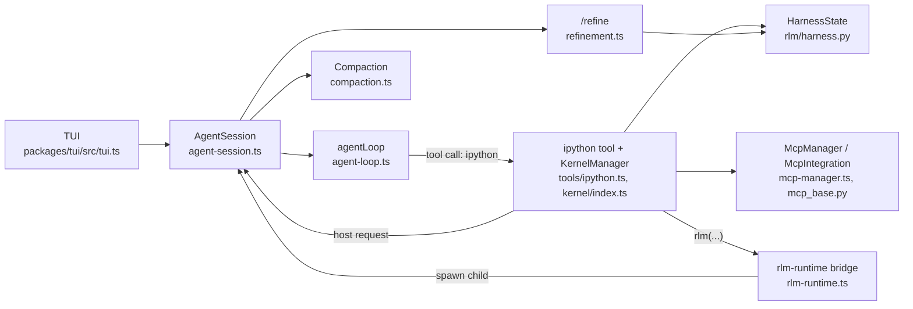
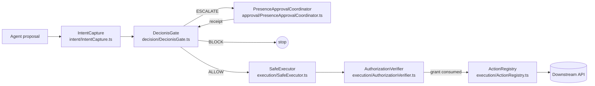
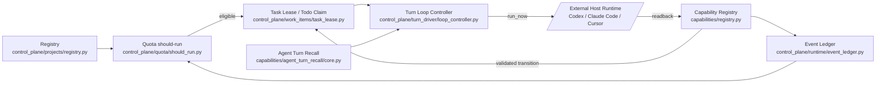
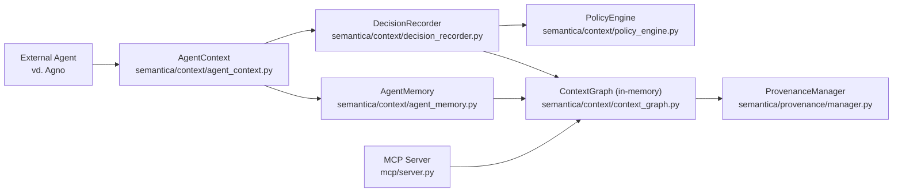

# Weekly Agentic AI Scan — 2026-08-15

**Nguồn dữ liệu**: GitHub search/trending trong cửa sổ 7 ngày (08/08–15/08/2026), filter theo stars/created/pushed, loại bỏ awesome-list/tutorial/wrapper mỏng. Chọn 4 repo có evidence rõ nhất về kiến trúc từ việc clone và đọc trực tiếp source code (không suy đoán).

## Executive Summary

- **`prime-agent`** (PrimeIntellect-ai, ~16k sao) từ bỏ mô hình "nhiều tool JSON rời rạc" và thay bằng **một REPL Python bền vững** làm bề mặt tool duy nhất — gọi subagent, MCP, memory đều biến thành lời gọi hàm Python trong kernel, một hướng đi khác hẳn ReAct/JSON-tool phổ biến.
- **`agent-safe-pipeline`** (decionis, 390 sao) là một authorization-gate độc lập tách bạch "agent đề xuất" khỏi "ai được quyết định", dùng canonical-hash binding + fail-closed nghiêm ngặt để chống kiểu tấn công "approve A, thực thi B" — đáng chú ý về mặt guardrail engineering dù repo còn rất non.
- **`loopx`** (huangruiteng, 4.7k sao) và **`semantica`** (semantica-agi, 7.6k sao) đại diện hai hạ tầng "phía sau" agent: một cái quản trị vòng lặp/quota compute dài hạn (không chạy model), một cái biến quyết định của agent thành đồ thị nhân quả có thể audit — nhưng cả hai đều có khoảng cách giữa tên gọi marketing ("state kernel", "Graph-Native") và thực tế implementation (in-memory dict/adjacency-list, single-maintainer).

## Mục lục

- [PrimeIntellect-ai/prime-agent](#prime-agent)
- [decionis/agent-safe-pipeline](#agent-safe-pipeline)
- [huangruiteng/loopx](#loopx)
- [semantica-agi/semantica](#semantica)

---

## [PrimeIntellect-ai/prime-agent](https://github.com/PrimeIntellect-ai/prime-agent)

### §1 Quick Context

Prime Agent là coding/research agent mã nguồn mở dùng mô hình Recursive Language Model (RLM) trong một persistent IPython REPL thay vì bộ tool JSON rời rạc. Stack: TypeScript/Node ≥22 (monorepo npm workspaces: `agent`, `ai`, `coding-agent`, `tui`) + `prime-agent-runtime` Python (`ipykernel`, `nest-asyncio`), build trên fork của `pi` (earendil-works). Repo health: ~16.000 stars, ~1.700 forks, push mới nhất hôm nay (15/08/2026), CI + Build-Binaries workflow đều passing, có `vitest` test suite theo package.

### §2 Architecture Deep-Dive

**A. Component inventory**
- `agentLoop` (`packages/agent/src/agent-loop.ts`) — vòng lặp lõi: stream LLM, thực thi tool call, xử lý steering/follow-up.
- `AgentSession` (`packages/coding-agent/src/core/agent-session.ts`, ~11.000 dòng) — orchestrator phiên: provider calls, tools, compaction, goals, vòng đời subagent con.
- IPython `ipython` tool + `KernelManager` (`packages/coding-agent/src/core/tools/ipython.ts`, `packages/coding-agent/src/core/kernel/index.ts`) — kernel Python bền vững, tool built-in duy nhất mà model gọi mặc định.
- `HarnessState` (`prime-agent-runtime/src/rlm/harness.py`) — kho lưu prompt notes/memory/skill/subagent-spec (Continual Harness).
- `rlm-runtime` bridge (`packages/coding-agent/src/core/rlm-runtime.ts`) — quản lý `RlmSpawnHandle`, đăng ký subagent con.
- `Compaction` (`packages/coding-agent/src/core/compaction/compaction.ts`) — tóm tắt context dài.
- `McpManager` (`packages/coding-agent/src/core/mcp/mcp-manager.ts`) + `McpIntegration` (`prime-agent-runtime/src/rlm/mcp_base.py`) — cầu nối MCP.
- `Refinement` (`packages/coding-agent/src/core/refinement/refinement.ts`) — lệnh `/refine` ghi lại self-improvement.
- TUI (`packages/tui/src/tui.ts`).

**B. Control flow**: không phải planner-executor cổ điển mà là **"code-execution ReAct loop với recursive sub-agent spawning"** (repo tự gọi là RLM loop).
1. `AgentSession` nhận prompt, đẩy vào `agentLoop`.
2. Model stream trả lời text hoặc gọi tool `ipython` với code Python.
3. `KernelManager` chạy code trong kernel persistent; các "typed host request" (vd `rlm.run`, `agent_message.send`, `goal`, `compact`) gọi ngược vào `AgentSession`.
4. Trong Python, model có thể gọi `rlm(...)` để spawn `AgentSession` con chạy loop độc lập, bất đồng bộ, không chờ kết quả.
5. `ToolResultMessage` được nối vào context, loop tiếp tục đến khi dừng (steering/follow-up có thể chen vào).
6. State ghi vào session JSONL; `Compaction` tự kích hoạt khi context lớn.

**C. State & data flow**: `AgentMessage[]` (typed schema, role user/assistant/toolResult/custom) được convert sang `Message[]` chỉ tại biên gọi LLM (`convertToLlm`). Lưu trữ: session JSONL + artifacts, riêng harness dùng `harness_state.json`. Context management là **compaction tự động** (tóm tắt phần cũ, giữ tin nhắn gần + kernel state), không phải RAG cổ điển.

**D. Tool/capability**: cơ chế chính không phải nhiều JSON tool mà là **một native function-calling tool `ipython`** nhận code Python để exec trực tiếp trong kernel — MCP cũng lộ ra dưới dạng hàm Python async (`McpIntegration` auto-discover tool từ MCP server rồi bind thành method) thay vì tool-call JSON riêng. Validate qua `validateToolArguments` (`agent-loop.ts`); README cảnh báo rõ đây **không phải sandbox bảo mật**.

**E. Memory**: ngắn hạn = cửa sổ hội thoại + compaction; dài hạn = `HarnessState` (kind `memory`/`prompt`/`skill`/`subagent`), truy xuất qua `overview()` chèn vào system prompt, có versioning nhưng không có retrieval vector-based.

**F. Model orchestration**: "self-improving" **không phải fine-tune trọng số** mà là self-improvement ở tầng harness: lệnh `/refine` (`refinement.ts`) đọc trajectory, gọi `harness.upsert(...)` để thêm/sửa prompt-note/memory/skill/subagent-spec, ghi `RefinementEvent` để rollback, không bao giờ sửa system prompt gốc. Subagent con có thể nhận model khác cha (`normalizeRequestedRlmSubagentModel`); tool call thực thi song song hoặc tuần tự (`executeToolCallsParallel/Sequential`).

**G. Observability & eval**: `scripts/session-transcripts.ts`, `scripts/tool-stats.ts`, `scripts/cost.ts` phục vụ telemetry; `scripts/bench-attach-bytes.mjs`, `scripts/bench-daemon-startup.mjs`, `scripts/boot-bench.mjs` chỉ benchmark **hạ tầng** (thời gian khởi động daemon, kích thước payload attach), không phải eval chất lượng model kiểu SWE-bench — không tìm thấy eval harness/replay nào trong repo này.

**H. Extension points**: `packages/coding-agent/src/core/extensions/` (loader/runner/wrapper) cho custom provider/tool; ví dụ thực tế trong `package.json` workspaces (`custom-provider-anthropic`, `custom-provider-gitlab-duo`, `sandbox`); người dùng cũng viết Python skill (`SKILL.md` + package) cài vào kernel, hoặc MCP server tùy chỉnh qua `settings-manager.ts`.

### §3 Architecture Diagram

### §4 Verdict

Điểm đáng học nhất: thay "nhiều tool JSON" bằng **một REPL Python bền vững** làm bề mặt duy nhất cho model, biến gọi tool/subagent/memory thành lời gọi hàm (`rlm(...)`, `agent_message.send`) — một cách tiếp cận khác hẳn ReAct/JSON-tool phổ biến. Cơ chế "self-improving" thực chất là **quản trị harness state có versioning/rollback**, không phải RL/fine-tune, nên tên gọi hơi gây hiểu lầm nếu đọc lướt. Red flag: README tự thừa nhận kernel **không phải sandbox bảo mật** — model-generated Python chạy với quyền OS đầy đủ. Đáng đào sâu thêm: cơ chế `DAEMON_PROTOCOL_VERSION`/capability-gating giữa client-daemon, và liệu "RLM-1" (nhắc tới trong TODO code) là model riêng đang phát triển hay chỉ là concept.

---

## [decionis/agent-safe-pipeline](https://github.com/decionis/agent-safe-pipeline)

### §1 Quick Context

Một authorization boundary độc lập đứng giữa AI agent và API thực thi, tách "agent đề xuất hành động" khỏi "ai được quyết định cho phép". Tech stack: TypeScript (Node.js ≥20), pnpm workspace monorepo, Zod cho schema validation, `jose` (EdDSA JWT) cho fixture authority, Vitest + coverage, ví dụ tích hợp `@modelcontextprotocol/sdk`. Dịch vụ quyết định "Decionis" và dịch vụ xác thực người "Presence" là external SaaS, không nằm trong repo. Repo health: 390 sao, 3 fork; số contributor không xác định. Commit gần nhất "Fix CodeQL findings and add repository guardrails (#3)" ngày 14/08/2026. Có CI thật: `.github/workflows/ContinuousIntegration.yml`, `discovery.yml`, cùng `pnpm verify` (lint/audit/typecheck/test/build).

### §2 Architecture Deep-Dive

**A. Component inventory**
- `IntentCapture` (`packages/pipeline/src/intent/IntentCapture.ts`) — hợp nhất agent proposal (action/target/parameters) với trusted context riêng, gán UUID/timestamp, chặn key `__proto__`, sinh `CapturedIntent` bất biến.
- `CanonicalIntentHasher` (`packages/pipeline/src/intent/CanonicalIntentHasher.ts`) — canonical JSON sorted-key, bound depth/entries/bytes, hash SHA-256 làm binding chống tamper.
- `DecionisGate` (`packages/pipeline/src/decision/DecionisGate.ts`) — client gọi authority API ngoài (`/v1/authority/enforce-and-bind`), fail-closed khi timeout/oversize/hash-mismatch, trả ALLOW/ESCALATE/BLOCK.
- `PresenceApprovalCoordinator` (`packages/pipeline/src/approval/PresenceApprovalCoordinator.ts`) — khi ESCALATE, trình bày action/target/hash cho người duyệt, gửi receipt lại cho `DecionisGate` re-evaluate.
- `AuthorizationVerifier`/`DecionisGrantVerifier` (`packages/pipeline/src/execution/AuthorizationVerifier.ts`) — verify + consume execution token qua `/v1/execution/consume-token`, đối chiếu hash/decision/dossier.
- `ReplayStore` (`packages/pipeline/src/execution/ReplayStore.ts`) — single-winner claim theo grant ID chống replay (mặc định in-memory Map).
- `ActionRegistry` (`packages/pipeline/src/execution/ActionRegistry.ts`) — allowlist handler đã "sealed", Zod-validate parameters trước khi execute.
- `SafeExecutor` (`packages/pipeline/src/execution/SafeExecutor.ts`) — orchestrator cuối cùng nối decision → verify → execute.
- `ShadowPipeline` (`packages/pipeline/src/shadow/ShadowPipeline.ts`) — chạy song song production execution với một "hypothetical" decision, gắn nhãn SHADOW, không cấp quyền thực thi.

**B. Control flow** — không phải ReAct loop hay planner-executor cho reasoning; đây là một **linear authorization state machine / policy-gate pipeline** đặt sau agent. Happy path:
1. Agent (ngoài repo) tạo proposal `{action, target, parameters}`.
2. `IntentCapture.capture()` gộp với trusted context do runtime cấp (tenant/actor/credentials — KHÔNG lấy từ agent), canonical-hash, trả `CapturedIntent`.
3. `DecionisGate.evaluate()` gửi intent hash tới authority, nhận verdict.
4. Nếu ESCALATE: `PresenceApprovalCoordinator` xin duyệt người, lấy receipt, gọi lại `DecionisGate.evaluate()` re-verdict.
5. Nếu ALLOW: `SafeExecutor.run()` gọi `AuthorizationVerifier.verifyAndConsume()` tiêu thụ grant atomically (chống replay).
6. `SafeExecutor` gọi `ActionRegistry.execute()` — handler đã đăng ký sẵn chạy với parameters đã validate, trả kết quả xuống downstream API.

**C. State & data flow** — message format là typed schema Zod (`ExecutionIntentSchema`, `CapturedIntent` deep-frozen), không phải free-text/dict. State lưu trữ tối thiểu: chỉ `ReplayStore` (in-memory, thay thế được) giữ grant ID đã dùng; không DB/queue nào khác. Context management: intent TTL tối đa 5 phút (clamp 1–300s), hết hạn phải capture lại từ đầu — không "nén" context, chỉ discard-and-recapture.

**D. Tool/capability integration** — `ActionRegistry` là allowlist tường minh: mỗi action `.register()` trước với `parametersSchema` Zod, registry `.seal()` trước khi dùng nên agent không tự thêm handler runtime. Ví dụ `examples/mcp-tool-gate/src/Index.ts` dùng `@modelcontextprotocol/sdk` — model gọi tool `delete_customer` qua MCP (native function-calling), handler bên trong gọi `IntentCapture`→`SafeExecutor` thay vì thực thi trực tiếp. Sandboxing: parameters Zod-parse hai lần (validate trước decision, execute trước khi chạy handler); key `__proto__`/`constructor`/`prototype` bị chặn ở cả `IntentCapture` và `CanonicalIntentHasher`.

**E. Memory architecture** — không áp dụng, bỏ qua.

**F. Model orchestration** — không xác định từ code: repo không định nghĩa LLM nào (model nằm phía agent, ngoài repo). Vai trò "orchestrate" duy nhất là giữa 2 external service Decionis/Presence, gọi HTTP với timeout clamp 1–15s, fail-closed khi lỗi/timeout/oversized-response — không có fallback model hay batching.

**G. Observability & eval** — không có OpenTelemetry/Langfuse. Audit dựa trên `decisionId`/`dossierId`/`reasonCodes` gắn mỗi quyết định (`docs/decision-dossiers.md`); `ShadowPipeline` đóng vai trò eval-hook kiểu chạy song song so sánh production result với hypothetical decision mà không enforce.

**H. Extension points** — implement interface `DecisionAuthority` để cắm authority khác; implement `AuthorizationVerifier` để cắm grant verifier khác; thay `ReplayStore` (interface `claim()`) bằng Redis/DB; đăng ký action mới qua `ActionRegistry.register()`; `IntentCapture` nhận `clock`/`createId`/`ttlSeconds` tùy biến qua constructor cho test.

### §3 Architecture Diagram

### §4 Verdict

Điểm đáng học cụ thể: fail-closed nghiêm ngặt (mọi lỗi/timeout/hash-mismatch → BLOCK) và canonical-JSON hashing để bind chính xác parameters giữa lúc người duyệt xem và lúc executor chạy — chống kiểu tấn công "approve A, thực thi B" mà nhiều agent framework khác bỏ sót; interface `DecisionAuthority`/`AuthorizationVerifier`/`ActionRegistry` tách 3 vai trò (đề xuất/quyết định/thực thi) rất rõ ràng.

Red flags: 390 sao nhưng lịch sử chỉ ~8 commit/PR #3 và repo vừa "verified" hôm qua — tỷ lệ sao/tuổi bất thường, nghi ngờ star bị inflate; giá trị thực phụ thuộc Decionis/Presence — hai service SaaS độc quyền không mã nguồn mở kèm theo, chưa publish npm package chính thức.

Câu hỏi mở: độ trưởng thành thật của authority API (chỉ có client-side schema, không có server reference); contributor count thật là bao nhiêu; sealed `ActionRegistry` có đủ chống compromised trusted-host như threat model tự nêu không.

---

## [huangruiteng/loopx](https://github.com/huangruiteng/loopx)

### §1 Quick Context

LoopX là một "state kernel" cục bộ, không phải agent framework — nó quản trị vòng lặp dài hạn của các AI agent (Codex, Claude Code, Cursor) mà không thực thi mô hình. Stack: Python 3.11+, chỉ dùng standard library (không phụ thuộc framework/model SDK nào), CLI-first, state lưu dạng Markdown/JSON local (`.loopx/`). Repo health: 4.7k sao, 410 forks, 4.380 commits, commit gần nhất 14/08/2026, lịch sử công khai bắt đầu 31/05/2026 (gần như một người sáng lập, `huangruiteng`), có CI (`python-tests.yml`, `full-public-smokes.yml`) và 291 file test (~2.575 hàm test).

### §2 Architecture Deep-Dive

**A. Component inventory**
- `Registry` (`loopx/control_plane/projects/registry.py`) — sổ đăng ký các goal/project, adapter, nguồn thẩm quyền.
- `Quota "should-run" allocator` (`loopx/control_plane/quota/should_run.py`) — chính là "quota-allocation state kernel" mà repo tự pitch, quyết định goal nào được cấp turn.
- `Turn Loop Controller` (`loopx/control_plane/turn_driver/loop_controller.py`) — hàm pure quyết định `run_now | wait | user_action_required | repair | replan | terminal`.
- `Task Lease / Todo Claim` (`loopx/control_plane/work_items/task_lease.py`) — cơ chế khóa/claim cho các peer agent làm việc song song.
- `Decision Scope / User Gate` (`loopx/control_plane/todos/decision_scope.py`) — máy trạng thái todo và điểm chờ phê duyệt con người.
- `Capability Registry` (`loopx/capabilities/registry.py`, `catalog.py`) — đăng ký "tool" (capability) với `origin`, `visibility`, `provider_id`.
- `Reward Memory` (`loopx/capabilities/reward_memory/architecture.py`) — kiến trúc bộ nhớ điển hình hóa.
- `Agent Turn Recall` (`loopx/capabilities/agent_turn_recall/core.py`) — hook truy hồi bộ nhớ trước mỗi turn.
- `Event Ledger` (`loopx/control_plane/runtime/event_ledger.py`) — log append-only cho quan sát/audit.

**B. Control flow** — đây không phải ReAct loop hay planner-executor cổ điển, mà là một **external supervisor state machine / effect-interpreter** bọc quanh một agent runtime bên ngoài (README gọi rõ: "Control Plane As Effect Interpreter"). Happy path:
1. `quota should-run` đọc registry + goal state để quyết định goal có đủ điều kiện chạy.
2. `todo claim` khóa một todo qua `task_lease`.
3. `Turn Loop Controller` tính disposition thuần túy từ receipt đã validate + quyết định quota (không thực thi gì).
4. Host runtime bên ngoài (Codex/Claude Code/Cursor) thực thi đúng một turn có giới hạn — nằm ngoài LoopX.
5. `todo update` ghi evidence; Capability chuẩn hóa/validate readback từ Provider và đề xuất transition.
6. `quota spend-slot` chỉ commit sau writeback hợp lệ; Event Ledger append event.

**C. State & data flow** — trạng thái lưu local-first dạng file Markdown (goal state) + JSON (registry, run history) dưới `.loopx/`, không dùng DB. Message giữa các layer là dict/Mapping có `schema_version` tường minh (vd `loopx_turn_envelope_v0`) và được xác thực bằng hash chữ ký (`action_signature.source_hash == envelope_hash`), không phải JSON tự do. Quản lý context bằng hàm nén "public-safe" (`public_safe_compact_text`) loại bỏ dữ liệu riêng tư trước khi chiếu ra dashboard.

**D. Tool/capability integration** — "Tool" ở đây là Capability, đăng ký kèm `origin` (builtin/extension), `visibility`, `provider_id`. LoopX **không** gọi model hay function-calling trực tiếp — nó là kernel trạng thái mà agent runtime ngoài đọc/ghi qua CLI hoặc hook/MCP adapter (`docs/reference/protocols/host-integration-surface-v0.md`). Validation là kernel accept/reject transition đề xuất, không phải sandbox thực thi code.

**E. Memory architecture** — Reward Memory định nghĩa 5 lớp bộ nhớ điển hình: `run_bound_reward`, `hard_policy`, `soft_preference`, `procedural_experience`, `working_context`, mỗi lớp có quy tắc durability/supersession/revocation riêng, lưu dạng append-only overlay. Truy hồi qua `agent_turn_recall/core.py`: hook `run_reward_memory_automatic_recall_hook` nén 3 outcome gần nhất + todo đang chọn thành gói recall trước khi turn bắt đầu. Tính năng này là "experimental, default-off".

**F. Model orchestration** — không xác định model cụ thể vì LoopX chủ trương provider-neutral, không host/gọi model. `docs/quota-allocation.md` định nghĩa "compute quota" là tỷ lệ duty-cycle (0–1.0) mỗi goal được cấp — đây là lịch trình cấp turn cho agent runtime ngoài, không phải routing giữa nhiều model.

**G. Observability & eval** — `event_ledger.py` ghi 5 lớp event (accounting, decision, evidence, state, work) append-only; `loopx/control_plane/testing/decision_replay.py` cung cấp "public safe decision replay" để replay quyết định quota tất định phục vụ test/qualification; có thêm `canary_harness.py` cho canary run.

**H. Extension points** — `loopx/extensions/` (package trong wheel) cho phép cắm provider mới hoặc implement capability có sẵn qua manifest (`origin: extension`, `provider_id`); `packages/<id>` cho phân phối độc lập. Ví dụ thật: `loopx/extensions/lark`, `openviking_periodic_report`.

### §3 Architecture Diagram

### §4 Verdict

Điểm đáng học nhất: LoopX từ chối trở thành thêm một agent framework — nó tách bạch triệt để "ai suy nghĩ" (host runtime ngoài) khỏi "ai giữ trạng thái/quyền chi tiêu compute" (kernel), với typed transition có hash chữ ký thay vì JSON tự do, và bộ nhớ 5-lớp có luật supersession/revocation rõ ràng thay vì "vector store chung chung". Red flag: gần như một người viết (~2,5 tháng, 4.380 commit), rất nhiều module trùng lặp ý tưởng nhỏ lẻ (dấu hiệu code sinh bởi agent), tài liệu dài hơn code thực thi giá trị. Câu hỏi đáng đào sâu: reward memory và host-integration/MCP adapter có thực sự chạy production hay vẫn "default-off/experimental"?

---

## [semantica-agi/semantica](https://github.com/semantica-agi/semantica)

### §1 Quick Context

Infra "graph-native" cho context và quyết định của AI agent, tách biệt khỏi LLM/vector-store để ghi log quyết định có thể audit. Tech stack: Python 3.8+, LiteLLM/OpenAI/Groq/HuggingFace cho LLM, backend graph tùy chọn (Neo4j, FalkorDB, Apache AGE, Oxigraph...), FAISS/Qdrant/Weaviate cho vector, MCP server riêng. Repo health: 7.585 sao, 789 fork, 65 issue mở, tạo 2025-06-25, push gần nhất 2026-08-14 (rất tích cực). CI đầy đủ: `ci.yml`, `codeql.yml`, `security-scan.yml`, `benchmark.yml`, `release.yml`; 242 file test.

### §2 Architecture Deep-Dive

**A. Component inventory**
- `ContextGraph` (`semantica/context/context_graph.py`) — graph store thuần Python trong bộ nhớ (`self.nodes`, `self.edges`, `self._adjacency`), quản lý node/edge + BFS traversal.
- `AgentContext` (`semantica/context/agent_context.py`) — facade cấp cao: `store()/retrieve()/record_decision()`, bọc `AgentMemory` + `ContextRetriever` + `DecisionRecorder`.
- `AgentMemory` (`semantica/context/agent_memory.py`) — bộ nhớ phân tầng: `short_term_memory: List[MemoryItem]` (giới hạn 10 item/2000 token) + ghi qua vector store cho long-term.
- `DecisionRecorder`/`CausalChainAnalyzer`/`PolicyEngine` (`semantica/context/decision_recorder.py`, `causal_analyzer.py`, `policy_engine.py`) — tầng quyết định + governance.
- `ReteEngine`/`DatalogReasoner` (`semantica/reasoning/rete_engine.py`, `datalog_reasoner.py`) — suy luận tất định, không cần LLM.
- `ProvenanceManager` (`semantica/provenance/manager.py`) — lineage W3C PROV-O, backend `InMemoryStorage`/`SQLiteStorage`.
- MCP server + tool registry (`mcp/server.py`, `mcp/tools/graph.py`) — expose thao tác graph qua JSON-RPC.
- `PluginRegistry`/`method_registry` (`semantica/core/plugin_registry.py`, mỗi module có `registry.py`) — điểm mở rộng.

**B. Control flow**: đây không phải ReAct loop — Semantica là hạ tầng nằm dưới agent bên ngoài (vd Agno). Happy path là "context/decision pipeline":
1. Agent ngoài gọi `AgentContext.store()`.
2. `AgentMemory` ghi short-term buffer + vector store, cập nhật `ContextGraph` nếu có entity.
3. Khi có quyết định quan trọng, gọi `record_decision()` → `DecisionRecorder` tạo node quyết định + cạnh nhân quả (`CAUSED`/`INFLUENCED`/`PRECEDENT_FOR`) trong `ContextGraph`.
4. Truy vấn tiền lệ qua `find_similar_decisions()`/`trace_decision_chain()`.
5. `PolicyEngine.check_decision_rules()` gate tuân thủ.
6. `ProvenanceManager`/`RDFExporter` xuất audit trail.

**C. State & data flow**: message giữa component là dataclass Python (`MemoryItem`, `Decision`, `ContextNode/ContextEdge`), không phải typed schema kiểu Pydantic (trừ JSON-Schema cho MCP tools trong `mcp/schemas.py`). Về "Graph-Native Infrastructure": xác nhận từ code — mặc định `ContextGraph` chỉ là dict + adjacency-list Python thuần, **không** phải graph DB thật; graph DB thật (Neo4j/FalkorDB/Apache AGE/Neptune qua `semantica/graph_store/`) chỉ dùng khi người dùng chủ động swap backend. Context management: short-term FIFO theo token budget + long-term vector, retrieval hybrid vector+graph traversal (`hybrid_alpha`), có snapshot bi-temporal (`state_at()`).

**D. Tool/capability integration**: hai lớp riêng biệt. (1) Semantica tự expose tool cho LLM host qua MCP server — JSON-RPC `tools/list`/`tools/call`, dispatch bằng dict tra cứu `_TOOL_INDEX`, mỗi handler chỉ bọc try/except, không sandbox. (2) Gọi LLM nội bộ (trích xuất entity...) dùng prompt + JSON parsing thủ công (`LLMExtraction`), không phải native function-calling. Đăng ký custom ingestor/extractor qua `method_registry.register(task, name, fn)` lặp lại ở ~15 module.

**E. Memory architecture**: bằng chứng rõ nhất của repo. Short-term = list bị prune theo count (10) và token (~2000, ước lượng 1 token≈4 ký tự) trong `_prune_short_term_memory`; long-term = vector store ghi qua `_store_memory_vector`. Retrieval fallback về keyword word-overlap (`_keyword_search`) nếu vector store rỗng/lỗi. Không thấy cơ chế tóm tắt (summarization) bằng LLM khi nén — chỉ eviction FIFO thuần túy, có thể mất context quan trọng âm thầm.

**F. Model orchestration**: không có phân vai planner/executor cố định; 4 provider wrapper (LiteLLM/OpenAI/Groq/HuggingFace) có thể cắm vào từng call-site độc lập. Không thấy fallback/ensemble giữa nhiều model ở tầng LLM. Song song hóa (`set_parallelism(4)`) là ở tầng pipeline ingest, không phải model.

**G. Observability & eval**: `ProvenanceManager` + `integrity.py` (`compute_checksum/verify_checksum`) là cơ chế chính đứng sau tuyên bố "accountable AI". Thư mục `semantica/evals/` gần như trống (chỉ `__init__.py`) — không có eval/replay harness thực sự. Logging là custom (`utils/logging.py`), không tích hợp OpenTelemetry/Langfuse.

**H. Extension points**: `PluginRegistry.register_plugin()` cho plugin toàn pipeline, và pattern `method_registry.register(category, name, fn)` lặp lại trong từng module con — được tài liệu hóa rõ trong `docs/architecture.md`.

### §3 Architecture Diagram

### §4 Verdict

Điểm đáng học: biến quyết định của agent thành node đồ thị có cạnh nhân quả tường minh (`CAUSED`/`INFLUENCED`/`PRECEDENT_FOR`) và xuất PROV-O — cách tiếp cận compliance nghiêm túc hơn hầu hết framework agent chỉ log text. Red flag: tên gọi "Graph-Native Infrastructure" gây hiểu nhầm — mặc định chỉ là dict/adjacency-list Python, không phải graph DB; `semantica/evals/` gần trống dù quảng cáo "accountable AI"; `ReteEngine` được chính maintainer ghi chú là "intentionally simple", chưa nên tin cho compliance gate thật; memory eviction không có summarization, dễ mất ngữ cảnh âm thầm. Câu hỏi mở: repo tạo mới ~14 tháng nhưng đã 7,6k sao — cần xác minh mức độ dùng thực tế production; số lượng module (240+ file) rất lớn, cần kiểm tra độ chín từng backend trước khi triển khai.

---

*Báo cáo được tạo tự động từ việc clone và đọc trực tiếp source code của từng repo (không dựa vào README/marketing đơn thuần). Mọi component trong §2.A đều có file path evidence thực tế; diagram §3 chỉ dùng component đã có evidence.*
