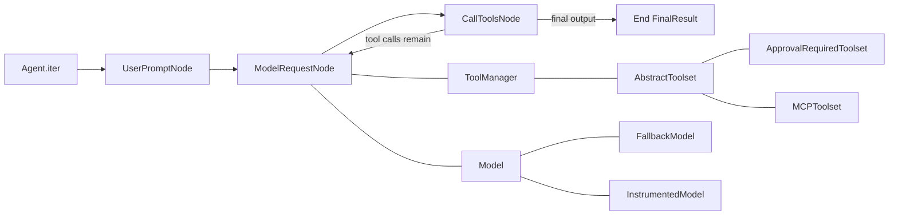
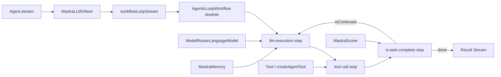
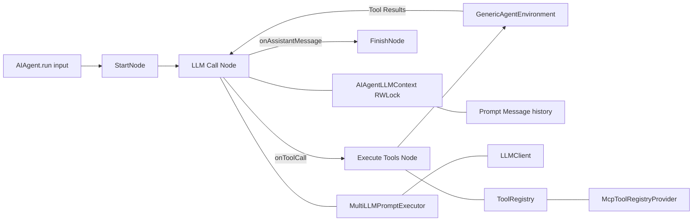
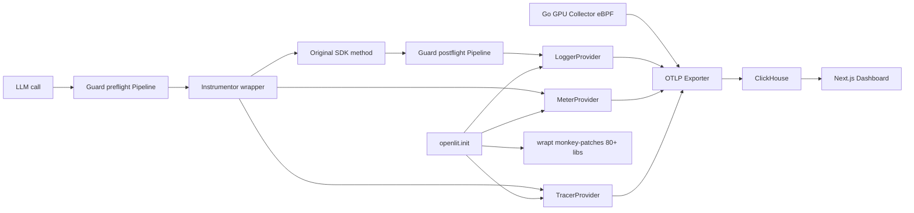

# Agentic AI Weekly Scan — 2026-05-25

## Executive Summary

- **TypeScript vs Python execution models đang phân kỳ rõ rệt**: mastra-ai implement ReAct loop như event-sourced `dowhile` Workflow (durability first-class), trong khi pydantic-ai dùng `pydantic_graph` 3-node cyclic state machine (type-safety first-class) — cả hai đều đúng nhưng tradeoff khác nhau hoàn toàn.
- **JetBrains/koog là outlier đáng chú ý nhất tuần này**: Kotlin Multiplatform, typed directed-graph runtime nơi ReAct chỉ là *một possible graph topology*, không phải built-in assumption — checkpoint/rollback với custom undo actions cho tool side-effects là feature production-grade hiếm gặp.
- **openlit/openlit đang trở thành reference implementation cho production LLM observability**: 80+ provider auto-patches qua `wrapt`, 3 OTel signal pipelines song song, guardrails pipeline tích hợp, Go GPU collector với eBPF CUDA tracing — đây là infra layer mà các frameworks khác đều đang thiếu hoặc outsource.

## Table of Contents

- [1. pydantic/pydantic-ai](#1-pydanticpydantic-ai) — type-safe ReAct, graph-as-execution-engine
- [2. mastra-ai/mastra](#2-mastra-aimastra) — TypeScript, agentic loop là dowhile workflow
- [3. JetBrains/koog](#3-jetbrainskoog) — Kotlin Multiplatform, typed directed-graph agent runtime
- [4. openlit/openlit](#4-openlitorpenlit) — OpenTelemetry-native LLM observability platform

---

## 1. pydantic/pydantic-ai

**Repo:** https://github.com/pydantic/pydantic-ai | Pushed: 2026-05-25

### §1 — Quick Context

**One-line pitch:** Framework Python type-safe cho agentic AI, dùng Pydantic typing system để validate toàn bộ agent I/O, tool schemas và message format.

**Tech stack:** Python, Pydantic v2, `pydantic_graph` (peer library), anyio, OpenTelemetry/Logfire; hỗ trợ OpenAI/Anthropic/Google/Bedrock/Groq/Ollama và ~10 providers khác. Optional: Temporal/DBOS/Prefect cho durable execution.

**Repo health:** 17,270 stars, nhiều contributors, CI enforce 100% coverage, pushed hôm nay. Monorepo với core package `pydantic_ai_slim`.

---

### §2 — Architecture Deep-Dive

#### A. Component Inventory

- `Agent` (`pydantic_ai_slim/pydantic_ai/agent/__init__.py`) — entry point, host `AgentRun` lifecycle
- `_agent_graph.py` — execution engine: 3 graph nodes (`UserPromptNode`, `ModelRequestNode`, `CallToolsNode`) chạy trên `pydantic_graph` runtime
- `messages.py` — toàn bộ wire format dưới dạng discriminated union Pydantic dataclasses (`ModelRequest`, `ModelResponse`, và các `*Part` subtypes)
- `tool_manager.py` — `ToolManager`: aggregate toolsets, dispatch parallel tool calls qua `anyio.create_task_group`
- `toolsets/abstract.py` — `AbstractToolset` ABC: composable container với `get_tools()` + `call_tool()`
- `models/__init__.py` — `Model` ABC với 15+ concrete implementations
- `models/fallback.py` — `FallbackModel`: chain sequential với error/response predicates
- `models/instrumented.py` — `InstrumentedModel`: `WrapperModel` subclass thêm OTel spans
- `_history_processor.py` — `HistoryProcessor` hook: custom compression/summarization callable
- `durable_exec/temporal/` — Temporal workflow integration (mỗi run step = Temporal activity)
- `toolsets/approval_required.py` — `ApprovalRequiredToolset`: HITL gate cho tool execution
- `mcp.py` — `MCPToolset`: stdio/SSE/HTTP transports

#### B. Control Flow — Graph-based ReAct Loop

Pattern: **ReAct-style 3-node cyclic state machine** trên `pydantic_graph`.

1. `Agent.iter()` khởi tạo graph, tạo `GraphAgentState` (core state = `message_history: list[ModelMessage]`).
2. `UserPromptNode`: khởi tạo conversation, evaluate dynamic system prompts.
3. `ModelRequestNode`: gọi `ToolManager.for_run_step()` lấy tool definitions, gọi model qua capability hooks, append response vào state.
4. `CallToolsNode`: scan `ModelResponse.parts` cho `ToolCallPart` → execute song song qua `anyio.create_task_group`, append results.
5. Nếu còn tool calls → loop về `ModelRequestNode`. Nếu final output → `End[FinalResult]`.

`End strategy` cấu hình được: `'early'` (return ngay khi có output), `'exhaustive'` (finish all tool calls trước), `'graceful'` (finish current batch).

#### C. State & Data Flow

- **Message format:** toàn bộ typed Pydantic dataclasses — không có raw dict trong hot path. `ModelRequest.parts: Sequence[SystemPromptPart | UserPromptPart | ToolReturnPart | RetryPromptPart]`; `ModelResponse.parts: Sequence[TextPart | ThinkingPart | ToolCallPart | NativeToolCallPart | CompactionPart]`.
- **State storage:** in-memory `GraphAgentState.message_history`. Serializable via `ModelMessagesTypeAdapter = TypeAdapter(list[ModelMessage])`. Persist cross-run bằng pass `message_history=` vào `agent.run()`.
- **Context window:** `HistoryProcessor` callable hook chạy trước mỗi model request; `CompactionPart` đánh dấu compression points trong history.

#### D. Tool / Capability Integration

3-layer system:

- **Layer 1 `Tool`**: wrap Python function, auto-generate JSON schema qua `inspect.signature()` + docstring parsing (Google/Numpy/Sphinx).
- **Layer 2 `AbstractToolset`**: composable container — built-in decorators: `FilteredToolset`, `PrefixedToolset`, `RenamedToolset`, `ApprovalRequiredToolset`, `DeferredToolset` (HITL external tools).
- **Layer 3 `ToolManager`**: per-step orchestrator, route `call_tool()` dispatches, handle `sequential=True` overrides, track retry budget.

Capability middleware: `AgentCapability` Protocol với ~8 optional hooks (`before_model_request`, `wrap_tool_execute`, `after_tool_validate`, ...) — user plug-in bất kỳ behavior mà không subclass Agent.

#### E. Memory Architecture

- Short-term: `GraphAgentState.message_history` (in-memory, serializable).
- Compression: `HistoryProcessor` callable + `CompactionPart` marker trong history.
- Mid-run injection: `RunContext.enqueue(*content, priority='asap'|'when_idle')` — inject messages vào conversation tại runtime.
- Long-term: `MemoryTool` (native provider-managed tool, e.g., OpenAI memory API); hoặc caller tự persist message history.

#### F. Model Orchestration

- `FallbackModel` (`models/fallback.py`): chain sequential; `fallback_on` nhận exception types, callables, hoặc `ModelResponse→bool` predicates — auto-detected bởi first-arg type annotation.
- `ConcurrencyLimitedModel`: `anyio.CapacityLimiter` với `max_queued` overflow protection.
- Multi-agent: không có built-in orchestrator — agents gọi agents qua tool delegation. `conversation_id` shared để unified tracing.

#### G. Observability & Eval

- OTel: `InstrumentedModel` emit spans `invoke_agent → chat → execute_tool`. GenAI semconv v3+ attributes. Cost tracking qua `genai-prices` package (`operation.cost` histogram).
- Testing: `TestModel` (deterministic, schema-seeded), `FunctionModel`, global `ALLOW_MODEL_REQUESTS=False` flag.
- Eval: không có built-in eval harness trong core; Logfire là recommended backend.

#### H. Extension Points

Custom model: subclass `Model` (3 abstract methods). Custom toolset: subclass `AbstractToolset` (2 methods). Durable execution: Temporal/DBOS/Prefect trong `durable_exec/`. MCP: `MCPToolset` hỗ trợ FastMCP in-process server.

---

### §3 — Architecture Diagram

---

### §4 — Verdict

**Điểm novel:** `_agent_graph.py` implement ReAct loop như *explicit* 3-node `pydantic_graph` — không phải while loop ẩn trong SDK. `End strategy` (`early`/`exhaustive`/`graceful`) là design choice tinh tế: phần lớn frameworks không expose điều này. `ApprovalRequiredToolset` và `DeferredToolset` tích hợp HITL native vào toolset hierarchy mà không break tool interface.

**Red flags:** Không có built-in multi-agent topology — graph chỉ là 3 nodes cố định, không tùy biến được topology nếu muốn planner-executor hay hierarchical. `HistoryProcessor` là powerful nhưng untyped callable (no Protocol, no type checking).

**Open questions:** `pydantic_graph` có suspend/resume semantics riêng — cần đọc để hiểu interaction với Temporal durable exec. `genai-prices` update cadence ra sao?

---

## 2. mastra-ai/mastra

**Repo:** https://github.com/mastra-ai/mastra | Pushed: 2026-05-25

### §1 — Quick Context

**One-line pitch:** TypeScript agent framework từ team Gatsby — agentic loop implement như `dowhile` Workflow, cho phép agent runs inherit đầy đủ durability và observability của workflow engine.

**Tech stack:** TypeScript, AI SDK v4/v5 (Vercel), Hono (HTTP server), Zod schemas, OpenTelemetry (Proxy-based), anyio-equivalent qua Promise.all. Optional: Inngest, Temporal, Netlify, models.dev, Mastra gateway.

**Repo health:** 24,269 stars, pushed hôm nay, team Gatsby credibility, CI có. Monorepo với 15+ packages.

---

### §2 — Architecture Deep-Dive

#### A. Component Inventory

- `Mastra` class (`packages/core/src/mastra/index.ts`) — root orchestrator, registry cho agents/workflows/tools
- `Agent` (`packages/core/src/agent/agent.ts`) + `AgentLegacyHandler` (`agent/agent-legacy.ts`)
- `MastraLLMVNext` (`packages/core/src/llm/model/model.loop.ts`) — AI SDK v5, loop-based (new path)
- `MastraLLMV1` (`packages/core/src/llm/model/model.ts`) — AI SDK v4 (legacy path)
- `ModelRouterLanguageModel` (`packages/core/src/llm/model/router.ts`) — route `"provider/model"` strings tới gateways
- `Workflow` (`packages/core/src/workflows/workflow.ts`) + `Step` (`workflows/step.ts`)
- `DefaultExecutionEngine` (`packages/core/src/workflows/default.ts`) — sequential in-process
- `EventedExecutionEngine` (`packages/core/src/workflows/evented/execution-engine.ts`) — pub/sub durable
- `WorkflowEventProcessor` (`packages/core/src/workflows/evented/workflow-event-processor/index.ts`) — event dispatcher
- `createAgenticLoopWorkflow` (`packages/core/src/loop/workflows/agentic-loop/index.ts`) — ReAct loop như `dowhile`
- `LLMExecutionStep` (`packages/core/src/loop/workflows/agentic-execution/llm-execution-step.ts`)
- `ToolCallStep` (`packages/core/src/loop/workflows/agentic-execution/tool-call-step.ts`)
- `MastraMemory` abstract (`packages/core/src/memory/memory.ts`) + `Memory` concrete (`packages/memory/src/index.ts`)
- `Tool` + `createTool()` (`packages/core/src/tools/tool.ts`) — Zod-typed I/O
- `MCPServerBase` abstract (`packages/core/src/mcp/index.ts`)
- `MastraScorer` (`packages/core/src/evals/base.ts`) — pipeline-based eval
- OTel Proxy factories (`packages/core/src/observability/context.ts`) — `wrapMastra()`, `wrapAgent()`, `wrapWorkflow()`
- `A2AAgent` (`packages/core/src/a2a/a2a-agent.ts`) — JSON-RPC 2.0 A2A client

#### B. Control Flow — Event-sourced Graph + ReAct-as-Workflow

**Agentic loop (v2 path — new):**

1. `Agent.stream()` → `MastraLLMVNext.stream()` → `loop()` → `workflowLoopStream()`.
2. `createAgenticLoopWorkflow` tạo `dowhile` Workflow với inner `agenticExecutionWorkflow`.
3. `agenticExecutionWorkflow` có các steps: `signal-drain-step → llm-execution-step → tool-call-step(s) → is-task-complete-step → background-task-check-step`.
4. `dowhile(isContinued && !maxSteps)` lặp cho đến khi `finishReason === 'stop'`.

**EventedWorkflow execution:**

1. `run.start()` publish event `{type: 'workflow.start', runId}`.
2. `WorkflowEventProcessor.handle()` dispatch tới `processWorkflowStepRun()`.
3. Serial steps → `StepExecutor.execute()`; parallel steps → `processWorkflowParallel()` → `Promise.all(pubsub.publish × N)`.
4. Mỗi step completion publish event → next step dispatch (event-driven, không synchronous call stack).
5. Suspend: snapshot state trước suspension → re-publish on resume.

#### C. State & Data Flow

- **Message format:** `MastraMessageV1` (`{id, role, content, threadId, resourceId, type}`) cho storage. Nhiều AI SDK wire formats (V4/V5/V6) với explicit conversion utilities (`aiV4CoreMessageToV1PromptMessage`, v.v.).
- **Workflow state:** `WorkflowState` per `runId` — `{status, stepExecutionPath, steps: Record<stepId, StepResult>}` persisted tới `storage.domains.workflows`. Hỗ trợ time-travel (re-execute từ any prior snapshot).
- **Context window:** `MemoryProcessor.process(messages[]) → messages[]` pipeline chạy trước mỗi LLM call. Working memory inject vào system prompt như XML tags (`<working_memory>...</working_memory>`).

#### D. Tool / Capability Integration

- `createTool({id, inputSchema, outputSchema, execute})` — Zod-typed I/O, context phân biệt agent vs workflow origin.
- Tool resolution chain: static config → dynamic resolver function → workspace-injected → browser tools → sub-agent delegation tools.
- HITL: `requireApproval` trên Tool → suspend workflow → wait for approval → resume.
- MCP: `MCPServerBase` expose bất kỳ registered agent/workflow/tool qua 4 transports (stdio, SSE, Hono SSE, HTTP).
- Agent-as-tool: `createAgentTool()` wraps `AIAgent` như `Tool` instance.

#### E. Memory Architecture

3 layers độc lập:

- **Conversation memory:** thread-scoped, last N messages từ storage (default `lastMessages: 10`).
- **Working memory:** structured state trong system prompt — Markdown XML tags hoặc Zod schema; scope `thread` (per-conversation) hoặc `resource` (cross-thread user profile).
- **Observational memory:** observer agent extract observations async → reflector agent compress khi store grows too large. Async buffering với `bufferTokens` + `bufferActivation: 'idle' | 'provider-change'`.
- Semantic recall: embed query → vector index → top-K similar messages + configurable surrounding context window.

#### F. Model Orchestration

- `ModelRouterLanguageModel` route `"provider/model"` strings tới gateways (Netlify, Mastra, models.dev) hoặc custom URLs. `provider-registry.json` list 60+ providers.
- Fallback: `AgentConfig.model` nhận array → iterate chain với error logging: "Exhausted all fallback models."
- Multi-agent network: `createNetworkLoop()` build workflow với dedicated routing agent → select sub-agent/workflow/tool → invoke → check `isTaskComplete` scorer → loop.
- Dual-stack LLM API: `MastraLLMV1` (AI SDK v4) và `MastraLLMVNext` (AI SDK v5) coexist; `isLanguageModelV3` type guard bridge.

#### G. Observability & Eval

- OTel: JavaScript Proxy factories `wrapMastra()`, `wrapAgent()`, `wrapWorkflow()` intercept calls non-intrusively — zero instrumentation code trong application. W3C carrier injection cho distributed tracing across tool boundaries.
- `MastraScorer`: pipeline `preprocess → analyze → generateScore → generateReason`; gắn vào agents, dùng cho network `isTaskComplete`, hoặc registered globally.
- Score storage: `storage.domains.scores` via `MastraCompositeStore`.

#### H. Extension Points

Custom `ExecutionEngine` abstract — swap default pub/sub cho Inngest, Temporal. 18 storage domains, mỗi domain independently replaceable. `MemoryProcessor` pipeline. 5 lifecycle hooks per LLM call. Custom gateways qua `registerCustomGateways()`.

---

### §3 — Architecture Diagram

---

### §4 — Verdict

**Điểm novel:** **Agentic loop implement như explicit `dowhile` Workflow** — không phải SDK magic. Agent runs tự động inherit suspend/resume, state persistence, observability của workflow engine. Hai execution engines coexist (Default sequential / Evented pub/sub) với cùng Workflow DSL — user chọn durability tradeoff mà không đổi code application. Observability qua JS Proxy là non-intrusive đến mức framework code không cần biết OTel tồn tại.

**Red flags:** Dual LLM stack (V1/V5) với message format conversion chain (V4/V5/V6 bridges) là potential source of subtle bugs. EventedExecutionEngine backend — không rõ pub/sub implementation khi deploy standalone (không phải Inngest). Observational memory (2 internal agents) có implicit latency + cost khi active.

**Open questions:** EventedWorkflow pub/sub backend cụ thể là gì khi chạy local? `createNetworkLoop()` routing agent có thể bị vòng lặp vô hạn nếu `isTaskComplete` scorer không converge?

---

## 3. JetBrains/koog

**Repo:** https://github.com/JetBrains/koog | Pushed: 2026-05-22

### §1 — Quick Context

**One-line pitch:** Kotlin Multiplatform agent framework từ JetBrains — execution model là typed directed-graph nơi ReAct chỉ là một possible topology, fault-tolerance first-class qua checkpoint/rollback.

**Tech stack:** Kotlin Multiplatform (JVM + Native + JS), kotlinx.serialization, kotlinx.coroutines, Ktor, OpenTelemetry (JVM only); OpenAI/Anthropic/Google/DeepSeek/Ollama/OpenRouter/Bedrock.

**Repo health:** 4,228 stars (launched 2025-05-01, tăng ổn định), JetBrains-backed, CI có. Monorepo Gradle với ~25 subprojects.

---

### §2 — Architecture Deep-Dive

#### A. Component Inventory

- `AIAgent<I,O>` interface + factory (`agents/agents-core/src/commonMain/kotlin/ai/koog/agents/core/agent/AIAgent.kt`)
- `GraphAIAgent<I,O>` — graph-execution implementation (`agent/GraphAIAgent.kt`)
- `FunctionalAIAgent<I,O>` — coroutine lambda execution (`agent/FunctionalAIAgent.kt`)
- `AIAgentGraphStrategy` — graph executor: node traversal + edge resolution (`agent/entity/AIAgentGraphStrategy.kt`)
- `AIAgentFunctionalStrategy` — plain coroutine lambda strategy (`agent/AIAgentFunctionalStrategy.kt`)
- `AIAgentNodeBase` / `AIAgentNode` / `StartNode` / `FinishNode` (`agent/entity/AIAgentNode.kt`)
- `AIAgentEdge<InOut,OutIn>` — typed conditional edge (`agent/entity/AIAgentEdge.kt`)
- `AIAgentSubgraph` + `ToolSelectionStrategy` sealed interface (`agent/entity/AIAgentSubgraph.kt`)
- `AIAgentState` + `AIAgentStateManager` (coroutine Mutex) (`agent/entity/AIAgentState.kt`)
- `AIAgentStorage` — typed KV store (Mutex-protected) (`agent/entity/AIAgentStorage.kt`)
- `AIAgentLLMContext` — Prompt + model + tools, guarded bởi `RWLock` (`agent/context/AIAgentLLMContext.kt`)
- `AIAgentLLMWriteSession` / `AIAgentLLMReadSession` (`agent/session/`)
- `AIAgentEnvironment` interface (`environment/AIAgentEnvironment.kt`)
- `GenericAgentEnvironment` — `supervisorScope` parallel tool execution (`environment/GenericAgentEnvironment.kt`)
- `AIAgentPipeline` abstract — ~15 interception points (`feature/AIAgentPipeline.kt`)
- `AIAgentFeature` / `AIAgentGraphFeature` interfaces (`feature/AIAgentFeature.kt`)
- `Tool<TArgs,TResult>` abstract + `ToolRegistry` (`agents-tools/src/commonMain/kotlin/ai/koog/agents/core/tools/Tool.kt`, `ToolRegistry.kt`)
- `PromptExecutor` interface (`prompt/prompt-executor/prompt-executor-model/src/commonMain/.../PromptExecutor.kt`)
- `MultiLLMPromptExecutor` — provider routing (`prompt-executor-llms/.../MultiLLMPromptExecutor.kt`)
- `AgentMemory` feature (`agents-features-memory/src/.../feature/AgentMemory.kt`)
- `OpenTelemetry` feature (`agents-features-opentelemetry/src/jvmMain/.../feature/OpenTelemetry.kt`)
- `AgentCheckpoint` feature (`agents-features-snapshot/`)
- `McpToolRegistryProvider` (`agents-mcp/src/commonMain/.../mcp/McpToolRegistryProvider.kt`)
- DSL builders: `AIAgentGraphStrategyBuilder`, `AIAgentSubgraphBuilder`, edge/node extensions (`dsl/builder/`, `dsl/extension/`)
- `HistoryCompressionStrategy` (`dsl/extension/HistoryCompressionStrategies.kt`)
- A2A protocol modules (`a2a/` — v0.3.0)

#### B. Control Flow — Typed Directed-Graph Traversal

Pattern: **Typed directed-graph với first-match edge resolution** — ReAct là emergent pattern, không built-in.

1. User định nghĩa `strategy { }` DSL: khai báo nodes (`val nodeA by node<In,Out> { ... }`) và typed edges (`edge(nodeA forwardTo nodeB onToolCall { true })`).
2. `AIAgentGraphStrategy.execute()` bắt đầu từ `StartNode<TInput>`.
3. Tại mỗi node, execute suspending lambda `suspend AIAgentGraphContextBase.(TInput) → TOutput`.
4. Resolve outgoing `AIAgentEdge` theo `forwardOutput` predicate — **first-match wins**. Advance tới `toNode`.
5. Lặp cho đến `FinishNode` (no outgoing edges; thêm edge vào FinishNode throw `IllegalStateException`).

**Built-in `singleRunStrategy()`** construct graph: `Start → LLMCall → (onToolCall → ExecuteTool → SendResult → LLMCall loop) | (onAssistantMessage → Finish)` — đây chính là ReAct pattern, nhưng chỉ là *một* possible topology.

**Parallel execution:** `parallel()` trong DSL dùng `supervisorScope` — concurrent nodes với explicit merge logic. Checkpoints disallowed trong parallel blocks (safety constraint).

**Stuck detection:** `AIAgentSubgraph` throw `StuckNodeException` khi không có edge nào resolve — không silent hang.

#### C. State & Data Flow

- **Message format:** `Message` sealed interface — `System`, `User`, `Assistant`, `Tool.Call` (lazy JSON parse), `Tool.Result`. `ResponseMetaInfo` carry `totalTokens`, `inputTokens`, `outputTokens`.
- **Prompt as accumulating history:** `AIAgentLLMContext` wrap `Prompt` (immutable list of `Message`) sau `RWLock`. `writeSession { }` acquire write lock → mutate; `readSession { }` acquire read lock.
- **Per-run KV storage:** `AIAgentStorage` — typed `Map<StorageKey<T>, Any?>` (Mutex-protected), scoped to one agent run. Dùng trong planner example để track node state qua các nodes.

#### D. Tool / Capability Integration

- 3 approaches: annotation-based (`@Tool @LLMDescription` trên `ToolSet` class, Kotlin reflection → JSON schema); class-based (`SimpleTool` / `Tool<TArgs,TResult>` subclass); MCP (`McpToolRegistryProvider.fromTransport()`).
- Execution: LLM response `Message.Tool.Call` → edge `onToolCall { true }` fires → `nodeExecuteTool` → `GenericAgentEnvironment.executeTools()` trong `supervisorScope` (parallel, isolated failures).
- `DirectToolCallsEnabler`: interface token prevent calling tools outside environment context — explicit safety boundary.
- `TerminationTool`: built-in tool signal agent to stop.
- `ToolSelectionStrategy.AutoSelectForTask`: gọi LLM structured output để filter relevant tools trước khi enter subgraph — intelligent tool scoping.

#### E. Memory Architecture

- **Fact-based model:** `Fact` (SingleFact / MultipleFacts), `Concept`, `Subject`, `MemoryScope` (AGENT/FEATURE/PRODUCT/CROSS_PRODUCT).
- **Backends:** `LocalFileMemoryProvider` (plain hoặc AES-256-GCM encrypted via `Encryption` interface), `NoMemory`, custom.
- **Integration:** `nodeLoadFacts` append facts vào prompt as System messages; `nodeSaveFacts` call LLM to extract facts from history → persist.
- **History compression:** `HistoryCompressionStrategy` — `WholeHistory`, `FromLastNMessages`, `Chunked`, `FromTimestamp`. `preserveMemory: Boolean` giữ memory messages ngoài compression window.
- Vector search không có trong core; RAG là separate module (`rag/`).

#### F. Model Orchestration

- `MultiLLMPromptExecutor`: dispatch theo `model.provider` enum → registered `LLMClient`. Fallback qua `FallbackPromptExecutorSettings`.
- **Mid-conversation model switching:** `changeModel(newModel)` trong `writeSession {}` → next `requestLLM()` dùng new model trên cùng accumulated `Prompt`. Không loss history.
- Prompt caching: `prompt-executor-cached/` wrapper cache responses by (prompt hash, model, tools hash).

#### G. Observability & Eval

- OTel (JVM): `OpenTelemetry` feature với OTLP exporter. **5 span types:** `CreateAgentSpan`, `InvokeAgentSpan`, `NodeExecuteSpan`, `InferenceSpan`, `ExecuteToolSpan`. GenAI semconv + koog-specific (`koog.agent.strategy.name`, `koog.node.name`). Common platform: stub (compiles everywhere, real impl JVM-only).
- `EventHandler` feature: 15 interception points (agent/strategy/node/LLM streaming/tool), lighter-weight alternative to OTel.
- `AgentCheckpoint`: per-node checkpoints, full rollback (position + history + custom undo actions cho tool side-effects) hoặc message-history-only. `enableAutomaticPersistence = true`.
- Fault tolerance: `maxAgentIterations` limit + `StuckNodeException` + supervisor-scope tool isolation + `reportProblem()` on environment.

#### H. Extension Points

Custom strategy graph (bất kỳ topology). Custom `AIAgentGraphFeature` register callbacks vào `AIAgentPipeline`. Custom `LLMClient` (5 methods). Custom `AgentMemoryProvider`. Agent-as-Tool qua `createAgentTool()`. A2A v0.3.0 cross-agent protocol. Spring Boot / Ktor integrations.

---

### §3 — Architecture Diagram

---

### §4 — Verdict

**Điểm novel:** **Typed edge predicates** (`onToolCall`, `onAssistantMessage`, `onCondition`) tạo explicit, type-safe, statically-verifiable control flow thay vì ẩn trong SDK. Mid-conversation model switching mà không loss history là feature production-grade hiếm gặp. `ToolSelectionStrategy.AutoSelectForTask` (LLM tự filter tools per subgraph) là approach sáng tạo cho large tool registries (100+ tools). `AgentCheckpoint` với custom undo actions cho tool side-effects là fault-tolerance design chưa thấy ở framework nào khác.

**Red flags:** OTel chỉ có real implementation trên JVM — other Kotlin Multiplatform targets chỉ có stub. Graph execution first-match edge semantics: edge ordering tạo implicit priority — cần careful DSL design. Không có vector memory trong core.

**Open questions:** First-match edge resolution — có explicit ordering guarantee không hay là implementation-dependent? `prompt-executor-cached/` invalidation strategy khi prompt history thay đổi?

---

## 4. openlit/openlit

**Repo:** https://github.com/openlit/openlit | Pushed: 2026-05-22

### §1 — Quick Context

**One-line pitch:** OpenTelemetry-native LLM observability platform — auto-instrument 80+ providers qua `wrapt` monkey-patching, guardrails pipeline, eval, GPU monitoring với eBPF CUDA tracing.

**Tech stack:** Python SDK (`wrapt`, OpenTelemetry Python SDK), Next.js 14 dashboard (TypeScript, Tailwind, Monaco), ClickHouse 24.4.1 (telemetry store), SQLite/Prisma (metadata), Go GPU collector với eBPF.

**Repo health:** 2,465 stars, active community, pushed 2026-05-22. Docker Compose single-command deploy.

---

### §2 — Architecture Deep-Dive

#### A. Component Inventory

- Public API / init (`sdk/python/src/openlit/__init__.py`) — `init()`, `trace()`, `start_trace()`, `agent_context()`, `eval()`, guards re-export
- `OpenlitConfig` singleton (`sdk/python/src/openlit/_config.py`) — runtime config
- Instrumentor registry (`sdk/python/src/openlit/_instrumentors.py`) — `MODULE_NAME_MAP`, `INSTRUMENTOR_MAP`, 80+ instrumentors
- Pricing helpers (`sdk/python/src/openlit/__helpers.py`) — cost calculation: chat/embeddings/images/audio
- OTel tracing setup (`sdk/python/src/openlit/otel/tracing.py`) — `TracerProvider`, `BatchSpanProcessor`/`SimpleSpanProcessor`, OTLP/console exporters
- OTel metrics setup (`sdk/python/src/openlit/otel/metrics.py`) — 19 instruments (12 histograms + 7+ counters)
- OTel events setup (`sdk/python/src/openlit/otel/events.py`) — `SDKLoggerProvider` cho discrete events
- Semantic conventions (`sdk/python/src/openlit/semcov/__init__.py`) — toàn bộ attribute key constants
- GPU instrumentor (`sdk/python/src/openlit/instrumentation/gpu/__init__.py`) — pynvml (NVIDIA), amdsmi (AMD)
- LLM provider instrumentors (`sdk/python/src/openlit/instrumentation/{openai,anthropic,bedrock,...}/__init__.py`) — per-provider wrapt monkey-patches
- Framework instrumentors (`sdk/python/src/openlit/instrumentation/{langchain,crewai,pydantic_ai,openai_agents,mcp,...}/__init__.py`)
- Guard base (`sdk/python/src/openlit/guard/_base.py`) — `Guard` ABC, `GuardResult`, `GuardAction`, `GuardPhase`
- Guard pipeline (`sdk/python/src/openlit/guard/_pipeline.py`) — `Pipeline`: sequential, deny short-circuit, redaction chain
- Guard auto-integration (`sdk/python/src/openlit/guard/_integration.py`) — wrapt wraps 16+ provider methods
- PII guard (`sdk/python/src/openlit/guard/pii.py`) — ~25 regex patterns, local-only
- Prompt injection guard (`sdk/python/src/openlit/guard/prompt_injection.py`) — weighted regex (5 categories), optional ML callable
- Sensitive topic guard (`sdk/python/src/openlit/guard/sensitive_topic.py`) — 6 built-in categories, formula scoring
- Offline evals (`sdk/python/src/openlit/evals/offline.py`) — `run_eval()`, `run_eval_batch()` concurrent
- CLI (`sdk/python/src/openlit/cli/main.py`) — zero-code instrumentation via `os.execl()` bootstrap
- Next.js 14 dashboard (`src/client/`) — 20 route groups (requests, agents, evaluations, prompt-hub, vault, rule-engine, fleet-hub, openground, ...)
- ClickHouse migrations (`src/client/src/clickhouse/migrations/`) — 27 TypeScript migration files
- Prisma schema (`src/client/prisma/schema.prisma`) — SQLite cho users/orgs/API keys/DB configs
- Go GPU collector (`opentelemetry-gpu-collector/`) — NVIDIA NVML + AMD sysfs + Intel DRM + optional eBPF CUDA kernel tracing
- OpAMP server (`src/opamp-server/`) — WebSocket remote config distributor `:4320`

#### B. Instrumentation Architecture (Control Flow)

openlit không có "control flow" theo nghĩa agent framework — đây là **observability layer với 3 OTel signal pipelines song song**:

1. `openlit.init(otlp_endpoint=..., guards=[...])` gọi `setup_tracing()`, `setup_meter()`, `setup_events()` — 3 parallel pipelines.
2. `_instrumentors.py` check available libraries; với mỗi library có, gọi `Instrumentor.instrument()`.
3. Mỗi instrumentor dùng `wrapt.wrap_function_wrapper(module, method, wrapper_fn)` để monkey-patch.
4. Wrapper function: đo latency, thu thập token counts, tính cost (từ `pricing.json`), tạo OTel span với GenAI attributes, emit histograms.
5. Guard pipeline chạy song song: **preflight** (input validation) → original SDK call → **postflight** (output validation).

#### C. Instrumentation Coverage

- **LLM providers (50+):** OpenAI (chat/embeddings/images/audio/responses/realtime/batch/fine-tuning), Anthropic (messages/stream), AWS Bedrock (converse/converse_stream), Google VertexAI/AI Studio, Azure AI Inference, Cohere, Mistral, Groq, Ollama, vLLM, LiteLLM, Together, và 30+ khác.
- **Agent frameworks:** LangChain (callback injection), LlamaIndex, CrewAI, Pydantic AI, OpenAI Agents SDK, Claude Agent SDK, LangGraph, Haystack, Agno, SmolAgents, AG2, Google ADK, Mem0, Browser-Use, và ~10 khác.
- **MCP:** `ClientSession` patching với cross-client-server context propagation.
- **Vector DBs:** ChromaDB, Pinecone, Qdrant, Milvus, Astra, PostgreSQL.
- **GPU:** NVIDIA (pynvml), AMD (amdsmi), Intel (sysfs/DRM) — 11 observable gauges.

#### D. OTel Integration — 3 Signal Pipelines

- **Traces:** `TracerProvider` → `BatchSpanProcessor` → OTLP gRPC `:4317` / HTTP `:4318` hoặc console.
- **Metrics (19 instruments):** `genai.client.token.usage`, `genai.client.operation.duration`, `genai.server.ttft`, `genai.server.tbt`, `genai.cost` (USD histogram), `db.client.operation.duration`, `mcp.client.operation.duration`, `mcp.tool.calls`, `genai.agent.invocations`, `guard.requests`, và nhiều hơn.
- **Events (logs):** `SDKLoggerProvider` → OTel log records cho guard evaluations (per-guard name/action/score/classification/latency).
- Auto-detection: `setup_*()` detect và reuse existing providers — non-destructive integration.

#### E. Cost & Latency Tracking

- Pricing: fetch từ `assets/pricing.json` (hoặc custom path/URL). Structure: `{"chat": {"gpt-4o": {"promptPrice": 0.0005, "completionPrice": 0.0015}}, "embeddings": {...}, ...}`.
- Formula: `(prompt_tokens/1000) * promptPrice + (completion_tokens/1000) * completionPrice`.
- Recorded as: span attribute `gen_ai.usage.cost` (float USD) **và** histogram `genai.cost` (distribution).
- Latency: `genai.server.ttft` + `genai.server.tbt` histograms cho streaming; `genai.client.operation.duration` cho total operation time.
- Custom pricing: `/manage-models` dashboard → `openlit_provider_models` ClickHouse table.

#### F. Guardrails Pipeline

Call chain: `preflight guard wrap → instrumentor OTel wrap → original SDK method → postflight guard wrap`.

`Pipeline`: sequential execution, **deny short-circuits** (first deny stops evaluation), redactions chain (each guard receives previously-redacted text), severity ordering (allow < warn < redact < deny — worst wins).

Guard types: PII (25 regex patterns, `action="redact"` → `[REDACTED:label]`, fully local), PromptInjection (weighted regex 5 categories, optional ML `classifier` callable), SensitiveTopic (6 categories, formula `min(1.0, len(detected)*0.3 + 0.4)`), TopicRestriction (allow/deny list + `classifier` callable), Moderation, Schema, Custom.

Limitation: postflight guards **skip streaming responses**.

#### G. Eval

- Offline: `POST /api/evaluation/offline`, 11 built-in eval types (hallucination, bias, toxicity, safety...). Batch eval: concurrent `max_concurrent=5`.
- Online: Rule Engine (`create-rule-engine-migration.ts`) — conditional rules (AND/OR groups) → auto-evaluate matching traces.
- Storage: `openlit_evaluation` ClickHouse table với `span_id` linking eval results to originating trace span.

#### H. Extension Points

Custom instrumentor (add entry vào registry). Custom pricing JSON (path hoặc URL). Custom span/metric attributes. Custom guard với `classifier` callable. Manual tracing: `@openlit.trace` decorator, `openlit.start_trace()` context manager. CLI zero-code: `openlit-instrument python app.py`. OpAMP fleet management: remote config push tới OTel Collectors qua WebSocket.

---

### §3 — Architecture Diagram

---

### §4 — Verdict

**Điểm novel:** **3 OTel signal pipelines song song** (traces + metrics + events) với pricing calculation tích hợp là production-ready design — hầu hết tools chỉ dùng traces. Go GPU collector với eBPF CUDA kernel tracing (không chỉ NVML polling) là differentiator thực sự với competitors. Guard pipeline (preflight + postflight với deny short-circuit, redaction chaining, severity ordering) clean hơn rất nhiều so với ad-hoc implementations. CLI zero-code instrumentation qua `os.execl()` bootstrap là pragmatic cho legacy codebases.

**Red flags:** `pricing.json` fetch từ raw GitHub URL tại `init()` time — failure mode khi network không available? Postflight guards skip streaming — gap đáng kể trong production LLM apps. `wrapt` monkey-patching có compatibility risks khi SDK providers thay đổi internal API (đã xảy ra nhiều lần với OpenAI SDK).

**Open questions:** `openlit_otel_traces` ClickHouse schema — có indexes cho agent workflow topology queries (trace → spans → tool calls) không? Rule Engine online eval — overhead per-trace khi rule matching?

---

*Generated: 2026-05-25 | Sources verified via GitHub API*
