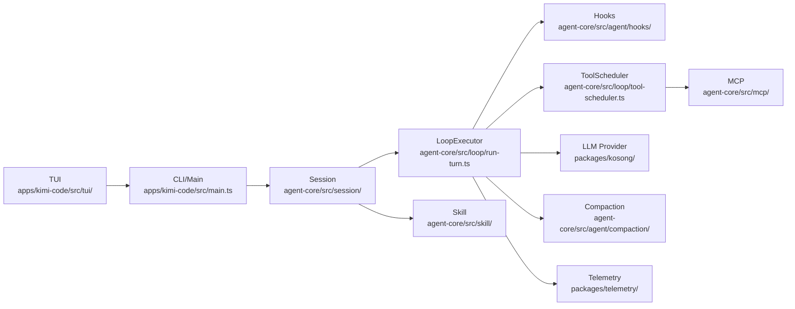
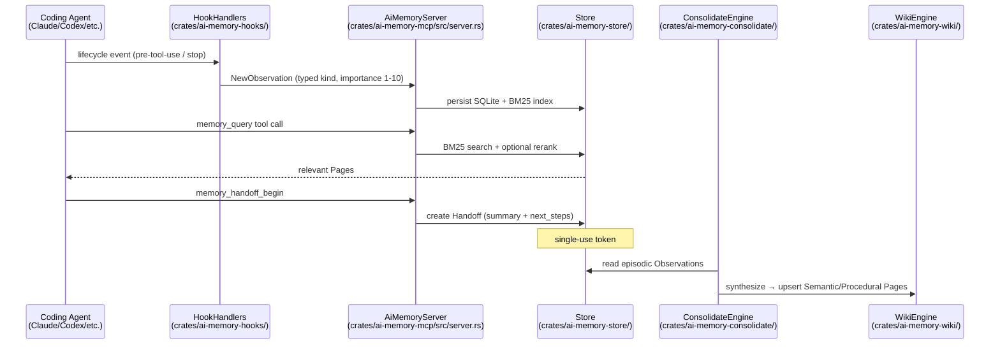
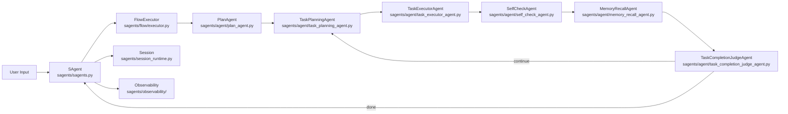
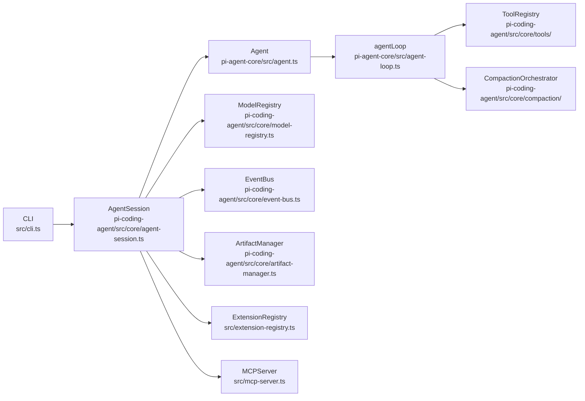

# Weekly Agentic AI Scan — 2026-05-26

## Executive Summary

- **Tuần đáng chú ý**: 2 repos hoàn toàn mới từ thực thể production (MoonshotAI/kimi-code, akitaonrails/ai-memory) xuất hiện cùng tuần, cả hai đều ship single-binary, MCP-native, và có production-quality CI ngay từ ngày đầu.
- **Pattern kiến trúc nổi bật**: (1) stateless loop + session orchestrator trong kimi-code; (2) 4-tier wiki memory không cần vector DB trong ai-memory; (3) flow graph với 12+ specialized agents chuyên biệt trong Sage — mỗi cái giải quyết một limitation khác nhau của ReAct loop đơn thuần.
- **Production signal**: 3/4 repos có explicit token budget management, context compaction module riêng, và telemetry/observability tách biệt — báo hiệu sự trưởng thành của engineering mindset trong agentic systems.

---

## Table of Contents

- [1. MoonshotAI/kimi-code](#1-moonshotaikimi-code) — Coding agent terminal-native từ Moonshot AI
- [2. akitaonrails/ai-memory](#2-akitaonrailsai-memory) — Long-term memory layer 4-tier, git-versioned
- [3. ZHangZHengEric/Sage](#3-zhangzhengeric-sage) — Multi-agent flow platform với 12+ specialized agents
- [4. open-gsd/gsd-pi](#4-open-gsdgsd-pi) — Local-first coding agent với git worktree isolation

---

## 1. MoonshotAI/kimi-code

> https://github.com/MoonshotAI/kimi-code — tạo 2026-05-22

### §1 — Quick Context

Coding agent terminal-native từ Moonshot AI — single binary, subagents song song, MCP-native từ ngày đầu ra mắt.

- **Stack**: TypeScript (pnpm monorepo, ESModule), Node.js ≥24.15.0, TypeScript 6.0.2, vitest, `kosong` provider abstraction cho LLM
- **Health**: 568★, 35 forks, created 2026-05-22, pushed 2026-05-26; CI: vitest + oxlint + changeset; tests tại `apps/kimi-code/test/` và `packages/agent-core/test/`

### §2 — Architecture Deep-Dive

**A. Component inventory**

| Component | Path | Vai trò |
|-----------|------|---------|
| `CLI/Main` | `apps/kimi-code/src/main.ts` | Entry point, option validation, mode dispatch |
| `TUI` | `apps/kimi-code/src/tui/` | Terminal UI rendering |
| `Session` | `packages/agent-core/src/session/index.ts` | Multi-agent lifecycle, agent registry, parent-child hierarchy |
| `LoopExecutor` | `packages/agent-core/src/loop/run-turn.ts` | Stateless per-turn execution, max 1000 steps |
| `ToolScheduler` | `packages/agent-core/src/loop/tool-scheduler.ts` | Parallel/sequential tool dispatch |
| `Hooks` | `packages/agent-core/src/agent/hooks/` | `BeforeStepHook`/`AfterStepHook` lifecycle interception |
| `Compaction` | `packages/agent-core/src/agent/compaction/` | Context window management |
| `Plan` | `packages/agent-core/src/agent/plan/` | Planning module |
| `Skill` | `packages/agent-core/src/skill/` | Pluggable skill system (`.agents/skills/`) |
| `MCP` | `packages/agent-core/src/mcp/` | MCP server integration với "AI-native config" |
| `LLM Provider` | `packages/kosong/` | Provider abstraction (multi-model backend) |
| `Telemetry` | `packages/telemetry/` | Observability, event dispatch |

**B. Control flow — Stateless Loop + Session Orchestrator**

Pattern: **Planner-executor với stateless turn loop** — mỗi turn là pure function, Session giữ state bên ngoài.

1. `main.ts` khởi tạo Commander.js CLI → dispatch sang shell runner hoặc prompt runner dựa trên UI mode
2. `Session.createMain()` tạo primary agent, load skills, refresh built-in tools sau skill init
3. `runTurn()` nhận turn ID, abort signals, LLM instance → validate preconditions, bắt đầu step loop
4. `executeLoopStep()` gửi messages + tools tới LLM qua `kosong` provider → nhận streaming response
5. Tool calls → `ToolScheduler` dispatch parallel hoặc sequential → results trả về làm observations; `Hooks` fire at each boundary
6. Loop tiếp tục đến `stop` signal hoặc max 1000 steps; subagents (`coder`/`explore`/`plan`) chạy trong Session hierarchy với circular dependency prevention

**C. State & data flow**

- Message format: typed TypeScript schemas (`LLMChatParams`, `LLMChatResponse`, `ToolCall`, `ToolExecution`)
- State: in-memory session + explicit `Compaction` module cho long-running context
- Context strategy: không xác định được compaction algorithm cụ thể từ code (summarize hay sliding window chưa rõ)

**D. Tool integration**

- `ExecutableTool` interface typed
- Invocation: native function-calling qua `kosong` abstraction
- MCP: `packages/agent-core/src/mcp/` — conversational server setup, không cần YAML config

**E. Memory**

- Short-term: per-session messages trong `Session` state
- Long-term: không xác định từ code — không có persistent store module rõ ràng
- Compaction: `packages/agent-core/src/agent/compaction/`

**F. Model orchestration**

- `kosong` — provider abstraction hỗ trợ multiple models; subagents có thể dùng khác nhau nhưng không xác định allocation từ code

**G. Observability**

- `packages/telemetry/` + `packages/agent-core/src/telemetry.ts`
- `createLoopEventDispatcher` — event stream từ mọi loop step
- Pre-publish gate: `typecheck && lint && sherif && test && build`

**H. Extension points**

- Skill system: thả file vào `.agents/skills/`
- Hooks: custom `BeforeStepHook`/`AfterStepHook`
- MCP servers: thêm qua conversational config

### §3 — Architecture Diagram

### §4 — Verdict

**Điểm novel**: (1) `runTurn()` thiết kế stateless thuần — session orchestration tách rời execution, dễ replay/test từng turn; (2) **AI-native MCP config** — add server bằng conversation thay vì YAML, UX breakthrough nhỏ nhưng có ý nghĩa; (3) Subagent hierarchy với circular dependency prevention là pattern ít repo nào implement đúng.

**Red flags**: Node.js ≥24.15.0 rất aggressive (stable tháng 5/2026); TypeScript 6.0.2 beta-quality; `kosong` package thiếu public docs.

**Open questions**: Compaction strategy cụ thể là gì? Subagents share context hay isolate hoàn toàn? `kosong` hỗ trợ streaming cho non-OpenAI providers không?

---

## 2. akitaonrails/ai-memory

> https://github.com/akitaonrails/ai-memory — tạo 2026-05-21

### §1 — Quick Context

Long-term memory layer cho coding agents — 4-tier wiki git-versioned, không cần vector DB, cross-vendor handoff qua single-use token.

- **Stack**: Rust (Edition 2024, min 1.95), tokio (async), SQLite + Refinery migrations, `rmcp` (MCP HTTP transport), `git2` (vendored libgit2), optional Anthropic/OpenAI/Gemini
- **Health**: 240★, 16 forks, created 2026-05-21; CI: `.github/workflows/`, `evals/` harness, `deny.toml`, `.gitleaks.toml`; `#[forbid(unsafe_code)]`, Clippy pedantic

### §2 — Architecture Deep-Dive

**A. Component inventory**

| Component | Path | Vai trò |
|-----------|------|---------|
| `AiMemoryServer` | `crates/ai-memory-mcp/src/server.rs` | MCP tool router, 10 tools |
| `HookHandlers` | `crates/ai-memory-hooks/` | Lifecycle hook listeners (session-start/stop/tool-use) |
| `Observation` | `crates/ai-memory-core/src/observation.rs` | Typed event capture (9 kinds, importance 1–10) |
| `Page` + `Tier` | `crates/ai-memory-core/src/page.rs` | 4-tier wiki pages với versioning + SHA-256 hash |
| `Handoff` | `crates/ai-memory-core/src/handoff.rs` | Cross-agent context transfer (single-use token) |
| `ActiveProject` | `crates/ai-memory-core/src/active_project.rs` | `Arc<RwLock<Option<(WorkspaceId, ProjectId)>>>` — MCP context resolver |
| `Store` | `crates/ai-memory-store/` | SQLite persistence + BM25 full-text search index |
| `WikiEngine` | `crates/ai-memory-wiki/` | Markdown wiki compiler + git versioning |
| `ConsolidateEngine` | `crates/ai-memory-consolidate/` | Episodic → Semantic/Procedural synthesis |
| `LLMProvider` | `crates/ai-memory-llm/` | Optional Anthropic/OpenAI/Gemini integration |
| `WebServer` | `crates/ai-memory-web/` | Read-only HTML UI (localhost-only) |

**B. Control flow — Event-driven passive observation capture**

Pattern: **Event-driven** — không interrupt agent loop, capture passively qua hooks.

1. Lifecycle hook fires (session-start, pre-tool-use, post-tool-use, stop) → `HookHandlers` intercepts → `NewObservation` tạo với typed kind + importance score 1–10
2. `Store` persists to SQLite, updates BM25 FTS index
3. Agent gọi `memory_query` MCP tool → `AiMemoryServer` routes → BM25 search (+ optional embedding rerank nếu embedder available)
4. `ConsolidateEngine` (triggered manually hoặc periodically) reads episodic observations → LLM/rule-based synthesis → upserts `Page` với tier Semantic hoặc Procedural vào `WikiEngine`
5. Cross-agent handoff: `memory_handoff_begin` tạo `Handoff` object (summary + open questions + next steps) → agent mới gọi `memory_handoff_accept` → handoff consumed (single-use, prevents stale re-read)

**C. State & data flow**

- Message format: typed Rust structs (`NewObservation`, `Observation`, `NewPage`, `Page`, `Handoff`) — không dùng free-form strings
- Storage: SQLite (primary) + git-versioned `wiki/` markdown + `raw/` immutable session archives
- Context strategy: pull-based, agent gọi `memory_briefing` on-demand thay vì window-based

**D. Tool integration**

- 10 MCP tools qua `rmcp` HTTP transport
- Graceful degradation: embedder failure → BM25-only search
- `memory_install_self_routing` — auto-setup routing snippets trong agent config

**E. Memory architecture**

- **Working** (current session): last N observations + active files
- **Episodic** (per-session): session summaries với concept tags
- **Semantic** (distilled facts): wiki pages về architecture/decisions
- **Procedural** (patterns): extracted từ episodic clusters
- Versioning: supersession chain — old `Page` rows reference newer versions, không bao giờ delete
- SHA-256 body hash mỗi version để detect changes

**F. Model orchestration**

- LLM optional — rule-based synthesis là default fallback
- Nếu có LLM: consolidation chạy Anthropic/OpenAI/Gemini; embedding optional (Voyage/OpenAI/Gemini) cho semantic reranking

**G. Observability**

- `logs/` rotating traces; SQLite indexes double as audit trail
- `evals/` harness cho eval replay
- `.gitleaks.toml` secret scanning; `deny.toml` dependency auditing

**H. Extension points**

- Custom sanitizers inject vào `AiMemoryServer`
- Custom LLM provider qua `ai-memory-llm` crate interface
- Custom embedding provider

### §3 — Architecture Diagram

### §4 — Verdict

**Điểm novel**: (1) **Git-versioned wiki, không vector DB** — inspired by Karpathy's "compile not retrieve"; supersession chain cho version history là thiết kế tư duy rõ; (2) **4-tier memory model** với typed `ObservationKind` (9 variants) thay vì free-form logging; (3) **Single-use Handoff token** — consumed khi accept, tránh stale context giữa agents khác vendor; (4) Rust `#[forbid(unsafe_code)]` + Clippy pedantic = production-quality từ ngày đầu.

**Red flags**: v0.1.3 còn rất non; trigger logic của `ConsolidateEngine` không rõ từ code (khi nào auto-consolidate?); BM25-only thiếu semantic similarity.

**Open questions**: Consolidation latency và scheduling strategy? Wiki conflict resolution khi nhiều agents concurrent write? Handoff token có expiry TTL config không?

---

## 3. ZHangZHengEric/Sage

> https://github.com/ZHangZHengEric/Sage — updated 2026-05-26

### §1 — Quick Context

Production multi-agent platform Python với 12+ specialized agents chuyên biệt, flow graph executor, và enterprise deployment.

- **Stack**: Python ≥3.10, Pydantic ≥2.5, FastAPI, Gradio, OpenAI SDK, MCP ≥1.9.2, fastmcp, loguru, Prometheus; Vue.js cho web UI
- **Health**: 1264★, 98 forks, updated 2026-05-26, v1.1.0; CI: `.github/workflows/`, pytest; MIT

### §2 — Architecture Deep-Dive

**A. Component inventory**

| Component | Path | Vai trò |
|-----------|------|---------|
| `SAgent` | `sagents/sagents.py` | Main orchestrator, 3 execution modes |
| `AgentBase` | `sagents/agent/agent_base.py` | Base class ~2000 LOC: streaming LLM, tool dispatch, cache_control |
| `PlanAgent` | `sagents/agent/plan_agent.py` | Planning loop với tool whitelist, blocks destructive ops |
| `TaskPlanningAgent` | `sagents/agent/task_planning_agent.py` | In-execution per-turn re-planning (10-turn context, 4000 token budget) |
| `TaskExecutorAgent` | `sagents/agent/task_executor_agent.py` | Core task execution |
| `SelfCheckAgent` | `sagents/agent/self_check_agent.py` | Post-execution validation: paths, workspace boundary, syntax |
| `MemoryRecallAgent` | `sagents/agent/memory_recall_agent.py` | LLM-generated query → `search_memory` tool |
| `ToolSuggestionAgent` | `sagents/agent/tool_suggestion_agent.py` | Dynamic tool recommendation |
| `TaskCompletionJudgeAgent` | `sagents/agent/task_completion_judge_agent.py` | Signals done/continue |
| `FlowExecutor` | `sagents/flow/executor.py` | Recursive async node execution |
| `Session` + `SessionManager` | `sagents/session_runtime.py` | SQLite workspace registry, disk persistence |
| `Observability` | `sagents/observability/` | Prometheus metrics, token tracking |

**B. Control flow — Multi-agent Flow Graph**

Pattern: **Hierarchical (Supervisor → Workers)** với flow graph executor.

1. Task arrives → `SAgent.run_stream()` chọn mode: `simple` (sequential), `multi` (orchestrated), `fibre` (parallel-capable)
2. **Multi mode**: `PlanAgent` chạy planning loop — research/clarification/plan generation; tool whitelist block destructive ops như file creation và code exec
3. Plan approved → `TaskPlanningAgent` generates per-turn execution steps (compress 10-turn context vào 4000 token budget)
4. `TaskExecutorAgent` execute → `SelfCheckAgent` validate: absolute paths, workspace boundary, syntax cho `.py/.json/.yaml/.js`
5. `MemoryRecallAgent` generate search query qua LLM → `search_memory` tool → inject relevant context
6. `TaskCompletionJudgeAgent` quyết định continue hay done; loop có max iterations

**C. State & data flow**

- Message format: `MessageChunk` typed schema, Pydantic models
- State: `Session` persisted to disk; `SessionManager` SQLite workspace registry
- Token budget: `_build_planning_history()` compress sang 4000 tokens; `prepare_unified_system_messages()` implement Anthropic `cache_control` multi-breakpoint

**D. Tool integration**

- Per-agent tool whitelist filtering (PlanAgent blocks destructive tools explicitly)
- `_handle_tool_calls()` + `_execute_tool()` trong `AgentBase` với JSON validation + `ast.literal_eval` safe fallback
- `_redact_hidden_tools_from_chunk()` — 3-tier hidden tool redaction từ streaming: name match → ID tracking → greedy continuation
- MCP servers qua `mcp>=1.9.2` + `fastmcp`

**E. Memory**

- `MemoryRecallAgent` — session-scoped file memory với LLM query generation
- `sagents/retrieve_engine/` — retrieval engine (strategy không xác định từ tên file)
- `session_context.audit_status['all_plannings']` — plan history accumulation

**F. Model orchestration**

- OpenAI SDK compatible (OpenAI, DeepSeek, Kimi, etc.)
- `reasoning_effort` support cho OpenAI o3-mini/GPT-5.2
- `AgentBase` max 8 retries với exponential backoff (2/4/8s)

**G. Observability**

- `sagents/observability/` — Prometheus: message latency, first-token timing, message sequences
- `loguru` structured logging; `session_context.audit_status` in-session audit trail

**H. Extension points**

- Custom agent: extend `AgentBase`, override `run_stream()`
- `inject_user_message()` — real-time guidance injection mid-execution
- `_build_default_flow()` — customizable flow graph node topology

### §3 — Architecture Diagram

### §4 — Verdict

**Điểm novel**: (1) **`SelfCheckAgent`** validate syntax + workspace boundary enforcement là safety layer hiếm thấy trong open-source agents; (2) **`_redact_hidden_tools_from_chunk()`** với 3-tier priority giải quyết tool leakage trong streaming — production concern thực sự ít ai xử lý; (3) **`prepare_unified_system_messages()`** explicit implement Anthropic `cache_control` multi-breakpoint optimization trong application layer.

**Red flags**: `AgentBase` ~2000 lines là god class; retrieve engine strategy không rõ từ code; "fibre mode" parallel promise nhưng implementation depth chưa verify được.

**Open questions**: `sagents/retrieve_engine/` dùng vector hay BM25 hay hybrid? Fibre mode có safe state isolation giữa parallel branches không? `inject_user_message()` có preempt current tool call không?

---

## 4. open-gsd/gsd-pi

> https://github.com/open-gsd/gsd-pi — tạo 2026-05-22

### §1 — Quick Context

Local-first coding agent với git worktree isolation, steering injection mid-loop, và multi-model orchestration từ ngày đầu.

- **Stack**: TypeScript (Node.js ≥22), Rust (native engine binaries), `@anthropic-ai/sdk`, `@anthropic-ai/claude-agent-sdk@0.2.83`, `@modelcontextprotocol/sdk`; npm workspaces monorepo
- **Health**: 205★, 20 forks, created 2026-05-22; tests: unit/integration/e2e/smoke/live-regression/browser; MIT

### §2 — Architecture Deep-Dive

**A. Component inventory**

| Component | Path | Vai trò |
|-----------|------|---------|
| `CLI` | `src/cli.ts` | Multi-mode dispatcher: TUI/print/RPC/MCP/headless |
| `AgentSession` | `packages/pi-coding-agent/src/core/agent-session.ts` | ~2500 LOC: agent state, tool registry, compaction, branching |
| `Agent` | `packages/pi-agent-core/src/agent.ts` | Claude Agent SDK wrapper, steering/follow-up queue |
| `agentLoop` | `packages/pi-agent-core/src/agent-loop.ts` | Core loop: tool execution, schema overload protection |
| `ToolRegistry` | `packages/pi-coding-agent/src/core/tools/` | Tool activation per session |
| `CompactionOrchestrator` | `packages/pi-coding-agent/src/core/compaction/` | Context compaction trigger + resume |
| `ModelRegistry` | `packages/pi-coding-agent/src/core/model-registry.ts` | Multi-provider model resolution, Ctrl+P cycling |
| `EventBus` | `packages/pi-coding-agent/src/core/event-bus.ts` | Async event queue cho state consistency |
| `ArtifactManager` | `packages/pi-coding-agent/src/core/artifact-manager.ts` | Plans, summaries, validation reports |
| `RetryHandler` | `packages/pi-coding-agent/src/core/retry-handler.ts` | Retry logic delegation |
| `ExtensionRegistry` | `src/extension-registry.ts` | Dynamic post-compilation provider registration |
| `MCPServer` | `src/mcp-server.ts` | MCP server exposed to external tools |
| `NativeEngine` | `packages/native/` | Platform-specific Rust binaries (Darwin/Linux/Windows) |

**B. Control flow — Event-driven với Steering Injection**

Pattern: **Event-driven** với real-time mid-loop interruption capability.

1. `src/cli.ts` lazy-load `pi-coding-agent` → bootstrap: RTK init, auth + settings, `ModelRegistry`, onboarding wizard, extension loading concurrent với session manager setup (~50–200ms savings)
2. `AgentSession` init: load `ToolRegistry`, extensions, `CompactionOrchestrator`, model config
3. `Agent.prompt()` enqueues message → `agentLoop()` emits initial events → enters `runLoop()`
4. `runLoop()` processes tool calls (sequential/parallel), track consecutive validation failures; **schema overload protection**: 3 consecutive turns với ALL tool calls failing → auto-stop
5. `Agent.steer()` inject priority messages mid-loop; `followUp()` defer processing — không interrupt current tool call
6. Context nears limit → `CompactionOrchestrator` triggers → `agentLoopContinue()` resumes từ compacted state
7. Worktree CLI (`src/worktree-cli.ts`): isolated git worktrees cho parallel independent work streams

**C. State & data flow**

- Typed TypeScript interfaces; events qua `EventBus` async queue
- `ArtifactManager` stores plans/summaries/validation reports
- Session branching: fork từ other projects; per-directory storage; auto legacy migration

**D. Tool integration**

- `ToolRegistry` với activation/deactivation per session
- `beforeToolCall`/`afterToolCall` callbacks trên `Agent`
- `MCPServer` exposed cho external consumers
- `ExtensionRegistry`: dynamic registration post-compilation

**E. Memory**

- `packages/pi-coding-agent/src/core/resources/extensions/memory/` — memory extension
- `CompactionOrchestrator` — explicit compaction trigger
- Session persistence + branching (storage backend không xác định từ code)

**F. Model orchestration**

- `ModelRegistry` + `model-discovery.ts` + `models-resolver.ts` — provider pattern matching
- Anthropic SDK primary; Google Gemini + Mistral supported
- `claude-agent-sdk@0.2.83` wraps Anthropic's managed loop
- Thinking levels configurable; `token-audit.ts` dedicated token tracking

**G. Observability**

- `packages/pi-agent-core/src/token-audit.ts` — token tracking
- `src/startup-timings.ts` — startup performance measurement
- `EventBus` typed events; test suite: unit/integration/e2e/smoke/live-regression/browser

**H. Extension points**

- `ExtensionRegistry`: dynamic post-compilation registration
- `packages/cloud-mcp-gateway/` — cloud MCP gateway (docs chưa có)
- VS Code extension, web UI, Studio app, Google Search extension

### §3 — Architecture Diagram

### §4 — Verdict

**Điểm novel**: (1) **`steer()` mid-loop injection** với priority queue — real-time guidance mà không block current execution, ít repo nào implement đúng; (2) **Schema overload protection** — 3 consecutive all-fail turns → auto-stop, ngăn infinite retry không phải bằng timeout mà bằng signal detection; (3) **Git worktree isolation** built-in cho parallel streams; (4) `claude-agent-sdk@0.2.83` = early adopter Anthropic's managed loop ngay tuần đầu ra.

**Red flags**: `AgentSession` ~2500 lines là god class pattern giống Sage; `cloud-mcp-gateway` chưa có public docs; native Rust engine build process không rõ.

**Open questions**: `CompactionOrchestrator` dùng summarize hay truncate? Steering queue có preempt mid-tool-call không? Worktree sessions share memory extension state không?
