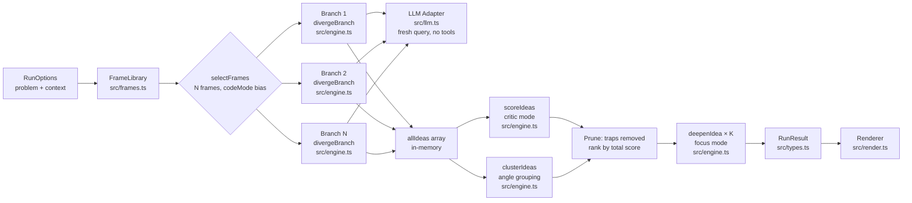
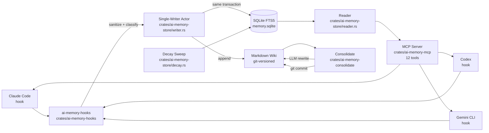
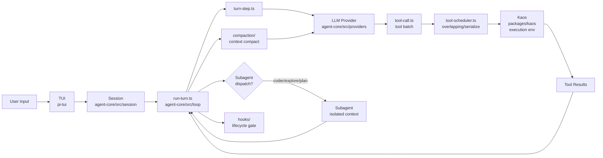
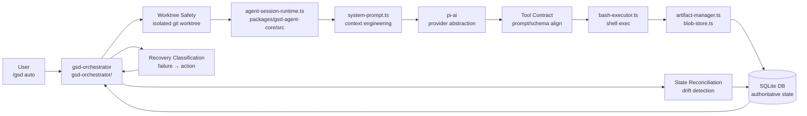

# Agentic AI Weekly Scan — 2026-05-27

> **Scout:** Claude Code (claude-sonnet-4-6) · **Period:** 2026-05-20 → 2026-05-27
> **Data source:** `gh search/repositories` query `agent OR multi-agent OR agentic created:>2026-05-20 stars:>200`
> **Candidates reviewed:** 9 repos · **Excluded:** 2 (awesome-list, tutorial dump) · **Selected:** 4

---

## Executive Summary

- **Tuần nổi bật nhất là ADHD** (`UditAkhourii/adhd`): giải quyết vấn đề "premature convergence" trong autoregressive reasoning bằng cách spawn N isolated query sessions với zero shared context, thay vì dùng trong-context branching. Có preprint, có evals reproducible, code sạch.
- **ai-memory** (`akitaonrails/ai-memory`) là triển khai Rust đáng nghiên cứu nhất về long-term memory: 4-tier decay system, single-writer SQLite actor, git-versioned markdown wiki — giải quyết bài toán cross-agent handoff với zero-LLM baseline.
- **kimi-code** (`MoonshotAI/kimi-code`) là production-grade coding agent từ Moonshot AI, TypeScript monorepo với agent-core sâu 14 subdirectory — architecture song song với Claude Code nhưng thêm `kaos` (execution environment abstraction), `compaction`, `replay`, subagents (`coder/explore/plan`).

---

## Table of Contents

- [1. UditAkhourii/adhd — Parallel Divergent ToT via Isolated API Calls](#1-uditakhouriiadhd)
- [2. akitaonrails/ai-memory — Cross-Agent Long-Term Memory in Rust](#2-akitaonrailsai-memory)
- [3. MoonshotAI/kimi-code — Production Coding Agent từ Moonshot AI](#3-moonshotaikimi-code)
- [4. open-gsd/gsd-pi — Spec-Driven Development với Context Engineering](#4-open-gsdgsd-pi)

---

## 1. UditAkhourii/adhd

**GitHub:** https://github.com/UditAkhourii/adhd

---

### §1 — Quick Context

**One-line pitch:** Fix kiến trúc cho premature convergence bằng cách spawn N isolated LLM sessions với cognitive frames, sau đó critic pass tách biệt.

**Tech stack:** TypeScript (Node ≥18), Claude Agent SDK (`@anthropic-ai/claude-agent-sdk`), `p-limit` cho concurrency control, npm package `adhd-agent`.

**Repo health:** ⭐203 stars · 1 contributor · active (pushed 2026-05-26) · CI GitHub Actions badge (`ci.yml`) · npm published · preprint tại adhdstack.github.io.

---

### §2 — Architecture Deep-Dive

#### A. Component Inventory

- **`FrameLibrary`** (`src/frames.ts`) — 15 "cognitive frames" định nghĩa dưới dạng `Frame = {id, label, prompt, tags}`. Mỗi frame là một vantage-point prompt inject vào divergent branch. Tags phân loại `code | design | general | wild` để bias selection khi `codeMode=true`.

- **`Engine`** (`src/engine.ts`) — Orchestrator chính. Hàm `run(opts: RunOptions): Promise<RunResult>` thực hiện toàn bộ 3-phase loop. Import từ `frames.ts`, `llm.ts`, `types.ts`. Load-bearing file.

- **`LLM Adapter`** (`src/llm.ts`) — Wrapper stateless quanh `query()` của Claude Agent SDK. Mỗi call là fresh session: `systemPrompt: { type: "preset", preset: "claude_code", append: opts.systemPrompt }`, `allowedTools: []`, `permissionMode: "bypassPermissions"`. Trả về concatenated text.

- **`Type System`** (`src/types.ts`) — Định nghĩa `Idea`, `Score`, `Branch`, `RunResult`, `Cluster`, `DeepenedIdea`, `RunOptions`, `RunEvent`. Scored ideas có fields: `novelty/viability/fit/total/trap?`.

- **`CLI`** (`src/cli.ts`) — Entry point CLI, đọc flags (`--frames`, `--ideas`, `--top`, `--concurrency`, `--context`, `--model`, `--json`, `--quiet`).

- **`Renderer`** (`src/render.ts`) — Format `RunResult` thành human-readable text/markdown.

- **`EvalSuite`** (`bench/run-evals.ts`, `bench/problems.json`) — LLM-as-judge với skeptical staff-engineer system prompt, so sánh ADHD vs single-shot baseline trên 5 dimensions.

#### B. Control Flow — Pattern: **Parallel Fan-Out → Sequential Critic (Two-Phase Separation)**

1. `run()` gọi `selectFrames(N, codeMode)` từ `frames.ts` — deterministic per-seed, luôn include ≥1 wildcard frame.
2. **Phase 1 — DIVERGE:** `Promise.all(frames.map(f => limit(() => divergeBranch(...))))` — N parallel `callLLM()` calls. Mỗi branch nhận: problem + frame vantage prompt + system prompt cấm evaluation/ranking/hedging. **Zero cross-branch context**, không shared KV-cache, không shared message history.
3. Collect `allIdeas: Idea[]` từ tất cả branches.
4. **Phase 2a — SCORE + CLUSTER** (parallel): `Promise.all([scoreIdeas(), clusterIdeas()])` — critic mode. Score: `novelty*0.35 + viability*0.4 + fit*0.25`. Cluster theo underlying angle, không phải surface keywords.
5. **Phase 2b — PRUNE:** Tách `traps` (ideas có `score.trap`), rank `ranked` bởi `total`, lấy `shortlist` top-2..4. `nonObviousPick` = highest `novelty + viability*0.5`.
6. **Phase 3 — DEEPEN:** `Promise.all(toDeepen.map(idea => limit(() => deepenIdea(...))))` — top-K ideas được expand thành sketch + risk + first step + 3-5 child ideas.

#### C. State & Data Flow

- **Message format:** `Idea = {id: UUID, frameId, text, rationale?, score?, depth, parentId?}`. Typed TypeScript interfaces, không phải raw dict.
- **State storage:** Pure in-memory, không persist. `RunResult` là output object.
- **Context window:** Mỗi branch là isolated `query()` call — không cần sliding/summarize vì zero shared context by design. Token cost `O(N × per_branch)`, không quadratic.

#### D. Tool / Capability Integration

- Không có tool calls trong divergent phase — `allowedTools: []` là thiết kế có chủ đích.
- Critic phase (score/cluster/deepen) cũng là pure text LLM calls, không tool.
- MCP/function-calling: không dùng.

#### E. Memory Architecture

- Không có long-term memory. State được drop sau mỗi `run()`.
- Short-term: `allIdeas[]` array held in-memory suốt duration của một run.

#### F. Model Orchestration

- Single model cho tất cả phases (configurable via `--model`). Mặc định dùng SDK default (Claude).
- Divergent branches dùng `claude_code` preset với `allowedTools: []`.
- Critic dùng inverted system prompt trong cùng model.
- Không có role-differentiated model assignment (frontier vs small).

#### G. Observability & Eval

- **Event streaming:** `RunEvent` union type với 7 event kinds (`frame:start`, `frame:done`, `score:done`, `cluster:done`, `deepen:start`, `deepen:done`, `warn`). Emitted via `opts.onEvent` callback.
- **Eval suite:** `bench/run-evals.ts` + `bench/problems.json`. LLM-as-judge, A/B order randomized, 5 dimensions. Output: `EVALS.md` + `bench/results.json`. Reproducible với `npm run evals`.
- Không có OpenTelemetry/Langfuse.

#### H. Extension Points

- Thêm frame mới: 5 lines trong `src/frames.ts`.
- Custom scorer: trong Roadmap nhưng chưa implement.
- Library API: `import { run } from "adhd-agent"` — dùng như utility trong agent loop lớn hơn.

---

### §3 — Architecture Diagram

---

### §4 — Verdict

**Điểm novel:** Enforcing generator-critic split tại **API-call boundary** (không phải trong-context instruction) là contribution thực sự. Mỗi branch là riêng `query()` với zero shared state — đây là architectural fix, không phải prompting trick. Score weighting có lý (viability > novelty vì "brilliant unshippable" là trap). Eval suite reproducible với `npm run evals`.

**Red flags:** (1) Single contributor, 203 stars chưa battle-tested. (2) Mọi phases đều dùng cùng model — không có cost optimization cho diverge phase (có thể dùng model nhỏ hơn). (3) Không persist state — mỗi run độc lập, không học từ lịch sử. (4) README đề cập "memory across runs" trong Roadmap nhưng chưa implement.

**Open questions:** Làm sao benchmark isolation thực sự (different session → thực sự khác nhau không, hay LLM vẫn converge do training bias)? Frame selection hiện dùng `Math.random()` — có strategy tốt hơn không (dựa vào problem type)?

---

## 2. akitaonrails/ai-memory

**GitHub:** https://github.com/akitaonrails/ai-memory

---

### §1 — Quick Context

**One-line pitch:** Long-term memory cross-agent cho coding CLIs: git-versioned markdown wiki + SQLite FTS5, seamless handoff giữa Claude Code, Codex, Gemini CLI.

**Tech stack:** Rust (92.5%), Docker, SQLite + FTS5, optional vector reranking; LLM providers: Anthropic, OpenAI, GitHub Copilot, Google Gemini, OpenAI-compatible. MCP server + HTTP API.

**Repo health:** ⭐290 stars · active (pushed 2026-05-27) · CI/test qua GitHub Actions · `.gitleaks.toml` (secret scanning) · `deny.toml` (dep audit) · `evals/` directory · production deployment via Docker.

---

### §2 — Architecture Deep-Dive

#### A. Component Inventory

- **`ai-memory-core`** (`crates/ai-memory-core/src/`) — Domain models: `observation.rs`, `page.rs`, `handoff.rs`, `active_project.rs`, `routing_snippet.rs`, `ids.rs`, `sanitize.rs`. Định nghĩa core entities và typed identity `(workspace_id, project_id, path)`.

- **`ai-memory-store`** (`crates/ai-memory-store/src/`) — Storage layer: `writer.rs` (single-writer actor), `reader.rs`, `fts_query.rs` (FTS5 full-text search), `decay.rs` (tier-based memory decay), `migrations.rs`, `ops.rs`. SQLite là derived index; markdown files là source of truth.

- **`ai-memory-hooks`** (`crates/ai-memory-hooks/`) — Lifecycle hook receiver. Agent CLIs gửi HTTP events (fire-and-forget, ≤200ms timeout). Mỗi event được sanitize → classify observation type → feed vào writer actor.

- **`ai-memory-consolidate`** (`crates/ai-memory-consolidate/`) — Background LLM-driven rewrite: batch episodic observations thành semantic pages. Chạy async, produce git commits.

- **`ai-memory-llm`** (`crates/ai-memory-llm/`) — LLM provider abstraction. Supports Anthropic (recommended default), OpenAI, GitHub Copilot, Google Gemini, OpenAI-compatible. Zero-LLM mode dùng rule-based summarization.

- **`ai-memory-mcp`** (`crates/ai-memory-mcp/`) — 12 MCP tools: `memory_query`, `memory_recent`, `memory_status`, `memory_briefing`, `memory_explore`, `memory_handoff_begin/accept`, `memory_consolidate`, `memory_write_page`, `memory_forget_sweep`, `memory_lint`, `memory_install_self_routing`.

- **`ai-memory-web`** (`crates/ai-memory-web/`) — HTTP API + built-in web browser với FTS5 search, markdown rendering, dark mode.

- **`ai-memory-wiki`** (`crates/ai-memory-wiki/`) — Wiki management: page versioning, git integration, directory structure `<wiki_root>/<workspace_id>/<project_id>/[concepts/decisions/gotchas/sessions/_rules/logs]`.

- **`ai-memory-cli`** (`crates/ai-memory-cli/`) — CLI entry point: `purge-project`, `rename-project`, `backup`, `restore`, `reset`.

#### B. Control Flow — Pattern: **Event-Driven với Single-Writer Actor + Background Jobs**

1. Agent CLI (Claude Code, Codex, etc.) emit lifecycle event via HTTP hook → `ai-memory-hooks` nhận, ≤200ms timeout (fire-and-forget).
2. Hook receiver sanitize event (typed boundary), classify thành observation type (`ai-memory-core`), enqueue vào single-writer actor.
3. **Single-writer SQLite actor** (`ai-memory-store/writer.rs`) serialize tất cả writes — "indexes commit in same transaction as data". Write đến SQLite index + append đến markdown log file.
4. Background: `ai-memory-consolidate` chạy async, batch recent observations, gọi LLM để rewrite thành semantic pages. Commit kết quả vào git.
5. Background: `decay.rs` sweep theo M8 tier policy (Working/Episodic/Semantic/Procedural).
6. Agent query via MCP tool (e.g., `memory_query`) → `ai-memory-reader` chạy FTS5 search + optional vector reranking → trả ranked results.

#### C. State & Data Flow

- **Message format:** Typed Rust structs (`Observation`, `Page`, `Handoff`). Identity tuple `(workspace_id, project_id, path)` — stable UUIDs, không dùng human-readable names (tránh "flat-wiki incident").
- **State storage:** 2-layer: (1) Markdown wiki files trong git — source of truth, (2) SQLite `memory.sqlite` — derived search index với FTS5. Mọi git commit produce từ consolidation là durable history.
- **Context window:** Agents nhận "where-you-left-off" summary được prepend vào first prompt của session mới. Không có sliding window — thay vào đó là retrieval-augmented từ wiki.

#### D. Tool / Capability Integration

- **12 MCP tools** expose qua `ai-memory-mcp` crate. Agents gọi qua MCP protocol.
- HTTP API trực tiếp cũng có cho non-MCP clients.
- Tool `memory_install_self_routing` tự động configure agent để route relevant queries qua ai-memory.

#### E. Memory Architecture

- **Working memory** (current session): Drop tại session end.
- **Episodic memory** (30d hot, 180d cold, rồi evict): Session logs `log-YYYY-MM.md`, rolling monthly.
- **Semantic memory** (indefinite): LLM-consolidated pages trong `concepts/decisions/gotchas/`. Supersedeable via `memory_consolidate`.
- **Procedural memory** (indefinite, decay nếu không re-observe): Chứa how-to, runbook patterns.
- **Pinned pages:** Bypass tất cả decay. `_slots/` pages auto-pin.
- **Retrieval:** FTS5 (default) + optional vector reranking. Graph-neighbor ranking cho related pages.

#### F. Model Orchestration

- LLM optional — zero-LLM mode dùng rule-based summaries + FTS5 search.
- Khi có LLM: Anthropic là recommended default, dùng cho consolidation rewrites.
- Embedding providers tách biệt từ chat providers (để vector reranking).
- Không có multi-model orchestration cho different roles.

#### G. Observability & Eval

- `.gitleaks.toml` cho secret scanning.
- `deny.toml` cho dependency audit.
- `evals/` directory (content không public).
- Git history của wiki là audit trail tự nhiên — mọi consolidation commit đều traceable.
- SQLite WAL mode với backup API.

#### H. Extension Points

- LLM provider: thêm implementation mới trong `ai-memory-llm` crate.
- MCP tool: thêm vào `ai-memory-mcp`.
- Agent support: thêm hook installer script (pattern có sẵn trong `AGENTS.md`).

---

### §3 — Architecture Diagram

---

### §4 — Verdict

**Điểm novel:** (1) **M8 tier decay system** được document đầy đủ với per-tier policy — Episodic/Semantic/Procedural có lifetimes khác nhau, không phải uniform TTL. (2) **Single-writer actor pattern** cho SQLite consistency trong Rust là production-grade engineering, không phải afterthought. (3) **Zero-LLM baseline** là real — FTS5 + rule-based summaries work mà không cần provider. (4) UUID-keyed disk hierarchy để tránh path collision là lesson từ real bug (documented).

**Red flags:** (1) `evals/` directory tồn tại nhưng content không public. (2) Vector reranking là optional/external — không rõ embedding latency tại scale. (3) Consolidation schedule không rõ từ code (cron? event-driven?). (4) Multi-machine sync dựa vào git remote — conflict resolution khi nhiều agents write đồng thời chưa được document rõ.

**Open questions:** Consolidation trigger threshold là gì (số observations, time-based, hay manual)? Graph-neighbor ranking implement như thế nào — `ai-memory-wiki` có graph structure hay chỉ là FTS proximity?

---

## 3. MoonshotAI/kimi-code

**GitHub:** https://github.com/MoonshotAI/kimi-code

---

### §1 — Quick Context

**One-line pitch:** Terminal coding agent production-grade từ Moonshot AI, feature parity với Claude Code, thêm subagents và video input.

**Tech stack:** TypeScript (97.8%), Node.js ≥24.15.0, pnpm 10.33.0, monorepo (pnpm workspace), TUI từ `pi-tui`, Vitest, oxlint, Nix flake.

**Repo health:** ⭐758 stars · org contributor (MoonshotAI) · active (pushed 2026-05-27, 53 forks) · CI/typecheck/lint qua `pnpm test|typecheck|lint` · 26 open issues · pages site tại moonshotai.github.io/kimi-code.

---

### §2 — Architecture Deep-Dive

#### A. Component Inventory

- **`agent-core`** (`packages/agent-core/`) — Core agent engine. Subdirectories: `agent/` (14 submodules), `config/`, `errors/`, `logging/`, `loop/`, `mcp/`, `profile/`, `providers/`, `rpc/`, `session/`, `skill/`, `tools/`, `utils/`. Entry: `index.ts`.

- **`Agent Loop`** (`packages/agent-core/src/loop/`) — "Stateless agent loop": `run-turn.ts` (turn convergence, abort, step limits), `turn-step.ts` (LLM call + tool handoffs), `tool-call.ts` (tool batch lifecycle), `tool-scheduler.ts` (overlapping non-conflicting tasks, serialize resource conflicts), `retry.ts`, `events.ts` (transcript).

- **`Agent Submodules`** (`packages/agent-core/src/agent/`) — 14 functional directories: `background/`, `compaction/` (context compaction), `config/`, `context/`, `hooks/` (lifecycle hooks), `injection/`, `permission/`, `plan/`, `records/`, `replay/` (session replay), `skill/`, `tool/`, `turn/`, `usage/`.

- **`Kaos`** (`packages/kaos/`) — "Execution environment abstraction used by Kimi Code." Abstraction layer cho sandbox/execution environments.

- **`Kosong`** (`packages/kosong/`) — Tên từ Bahasa Indonesia ("empty") — possibily null/empty value utilities.

- **`Telemetry`** (`packages/telemetry/`) — Observability package.

- **`Node SDK`** (`packages/node-sdk/`) — Public SDK wrapper.

- **`OAuth`** (`packages/oauth/`) — Authentication: Kimi Code OAuth hoặc Moonshot AI API key.

- **`Migration-legacy`** (`packages/migration-legacy/`) — Legacy migration utilities.

- **`Skills`** (`.agents/skills/`) — Agent skill definitions (Claude Code skill format).

#### B. Control Flow — Pattern: **ReAct-style với Tool Scheduler + Subagent Dispatch**

1. User input vào TUI (`pi-tui`) → Session layer nhận, build initial message.
2. `run-turn.ts` bắt đầu turn: gọi `turn-step.ts` → LLM provider call với system prompt (compacted nếu cần).
3. LLM trả về response: nếu có tool calls → `tool-call.ts` batch xử lý.
4. `tool-scheduler.ts` execute tools: overlapping non-conflicting tools chạy parallel; resource conflicts serialize. `kaos` abstraction cung cấp execution environment.
5. Tool results feed back → next step trong vòng lặp.
6. Nếu user dispatch subagent (`coder`, `explore`, `plan`): tạo isolated context mới, subagent runs trong scope riêng, kết quả handoff về main conversation.
7. Lifecycle hooks (`agent/hooks/`) fire tại key points (có thể gate risky tool calls).
8. Khi context gần đầy: `compaction/` trigger — summarize/compact history.

#### C. State & Data Flow

- **Message format:** Typed TypeScript (runtime-types.ts), transcript qua `events.ts`.
- **State storage:** Session state in-memory + `records/` (durable session records). `replay/` module cho session replay.
- **Context window:** `compaction/` subdirectory implement context compaction strategy. `compaction-threshold` trong gsd-agent-core tương tự — threshold-based trigger.

#### D. Tool / Capability Integration

- Tool registry trong `agent/tool/` subdirectory.
- MCP support qua `mcp/` package (AI-native MCP config via `/mcp-config` command).
- Execution sandboxing qua `kaos` abstraction.
- Permission system qua `agent/permission/`.
- Lifecycle hooks có thể gate tool calls (`agent/hooks/`).

#### E. Memory Architecture

- **Short-term:** Conversation history trong session, compacted khi cần.
- **Long-term:** Không có built-in (khác ai-memory). Session records qua `records/`.
- **Replay:** `replay/` module cho reproduce sessions — debugging/audit.

#### F. Model Orchestration

- Default: Kimi models (Moonshot AI). Configurable via `providers/` để dùng other compatible providers.
- Subagents (`coder`, `explore`, `plan`) dispatch trong isolated contexts — không rõ có dùng different models per role không (không thấy evidence).
- Không có fallback routing rõ ràng từ code.

#### G. Observability & Eval

- `packages/telemetry/` — dedicated telemetry package.
- `logging/` trong agent-core.
- Session `replay/` capability cho debugging.
- `.changeset/` cho changelog management.

#### H. Extension Points

- Skills qua `.agents/skills/` directory (same format as Claude Code skills).
- MCP servers qua `/mcp-config` conversational command.
- Custom providers qua `providers/` abstraction.
- Lifecycle hooks qua `agent/hooks/`.

---

### §3 — Architecture Diagram

---

### §4 — Verdict

**Điểm novel:** (1) **`kaos` package** — execution environment abstraction tách biệt là design pattern hay, giúp swap sandbox backend mà không thay đổi agent logic. (2) **`tool-scheduler.ts`** serialize resource conflicts trong khi parallel non-conflicting tools — tinh tế hơn "tất cả parallel" hay "tất cả serial". (3) **Session replay** (`replay/`) module là production-grade feature hiếm thấy trong open-source coding agents. (4) AI-native MCP config (không cần hand-edit JSON) là UX improvement thực tế.

**Red flags:** (1) Single org contributor — community còn nhỏ (53 forks). (2) `kaos` và `kosong` không có public documentation — không rõ scope thực sự. (3) Subagent architecture (`coder/explore/plan`) không có code evidence chi tiết — có thể chỉ là different system prompts, không phải true multi-agent. (4) Video input là feature được quảng cáo nhưng không thấy trong code structure.

**Open questions:** `kaos` abstraction support những execution environment nào (Docker? WASM? bare process?)? Subagents có shared memory với main agent không? `compaction/` dùng LLM để summarize hay pure truncation?

---

## 4. open-gsd/gsd-pi

**GitHub:** https://github.com/open-gsd/gsd-pi

---

### §1 — Quick Context

**One-line pitch:** Local-first coding agent quản lý project theo milestones/slices/tasks, dùng git worktrees để isolate implementation, tự động context engineering.

**Tech stack:** TypeScript (94.4%), Node.js monorepo (12 packages), SQLite (local state), Git worktrees, VS Code extension, desktop studio, Docker.

**Repo health:** ⭐270 stars · org (open-gsd) · active (pushed 2026-05-27) · 26 open issues · Discord community · 68MB repo (lớn nhất trong 4 candidates).

---

### §2 — Architecture Deep-Dive

#### A. Component Inventory

- **`gsd-agent-core`** (`packages/gsd-agent-core/src/`) — Core agent session: `agent-session.ts` (session management), `agent-session-runtime.ts` (runtime execution), `agent-session-services.ts` (service DI), `bash-executor.ts` (shell execution), `blob-store.ts` (artifact binary storage), `artifact-manager.ts` (artifact lifecycle), `system-prompt.ts` (context engineering), `lifecycle-hooks.ts`, `compaction/` subdirectory.

- **`pi-agent-core`** (`packages/pi-agent-core/`) — Separate agent core layer (relationship với gsd-agent-core không rõ từ directory listing — có thể là different provider backend).

- **`pi-coding-agent`** (`packages/pi-coding-agent/`) — Coding-specific agent behaviors.

- **`pi-tui`** (`packages/pi-tui/`) — Terminal UI (same lib được dùng bởi kimi-code).

- **`pi-ai`** (`packages/pi-ai/`) — AI provider abstraction layer.

- **`gsd-orchestrator`** (`gsd-orchestrator/`) — Top-level orchestration: Auto Orchestration module, State Reconciliation, Worktree Safety, Recovery Classification, Tool Contract.

- **`daemon`** (`packages/daemon/`) — Background daemon process.

- **`mcp-server`** (`packages/mcp-server/`) — MCP server integration.

- **`rpc-client`** (`packages/rpc-client/`) — RPC communication layer.

- **`contracts`** (`packages/contracts/`) — Shared interface contracts giữa packages.

- **`cloud-mcp-gateway`** (`packages/cloud-mcp-gateway/`) — Cloud MCP integration.

- **`native`** (`packages/native/`) — Native platform binaries.

#### B. Control Flow — Pattern: **Planner-Executor với Worktree Isolation + State Reconciliation**

1. User define project structure: milestones → slices → tasks (stored in local SQLite DB).
2. `gsd-orchestrator` nhận task → Auto Orchestration module select next unit of work.
3. `Worktree Safety` module create/validate git worktree cho isolated implementation.
4. `agent-session-runtime.ts` bắt đầu coding session: inject project context via `system-prompt.ts`, set up `artifact-manager.ts`.
5. Agent execute (bash_executor, tool calls) trong worktree isolation.
6. `State Reconciliation` module detect drift giữa DB state, disk artifacts, và in-memory state — repair hoặc classify failure.
7. `Recovery Classification` map failures → recovery actions.
8. Session kết thúc: artifacts committed, DB updated, worktree cleaned up hoặc preserved.

#### C. State & Data Flow

- **Message format:** TypeScript typed (`contracts/` package define shared interfaces). `Tool Contract` maintainining prompt/schema alignment.
- **State storage:** SQLite (primary — "DB is authoritative"), disk artifacts (markdown plans, summaries, validation notes), in-memory session state. Git worktrees cho isolation.
- **Context window:** `compaction/` trong gsd-agent-core, `compaction-threshold.test.ts` evidence thresholds. `system-prompt.ts` handle context engineering.

#### D. Tool / Capability Integration

- `bash-executor.ts` — direct shell execution.
- MCP server qua `mcp-server` package.
- Cloud MCP gateway qua `cloud-mcp-gateway`.
- Tool Contract trong `gsd-orchestrator/` ensure prompt/schema consistency.

#### E. Memory Architecture

- **Short-term:** Session state in-memory + `blob-store.ts`.
- **Long-term:** SQLite DB (authoritative) + markdown artifacts (`.plans/` directory). Git history trong worktrees.
- **Context injection:** `system-prompt.ts` inject project context vào each session — spec-driven approach.

#### F. Model Orchestration

- `pi-ai` abstraction layer cho providers.
- `gsd-agent-modes` package (trong packages/) — có thể define different agent modes với different model configs (không có evidence chi tiết).
- Không rõ có multi-model per role không.

#### G. Observability & Eval

- `CONTEXT.md` document architectural decisions và standing review checklist.
- State drift detection qua `State Reconciliation` module.
- Recovery Classification có explicit exit reasons (documented invariant: "distinct exit reasons").
- Không thấy OpenTelemetry/external tracing evidence.

#### H. Extension Points

- Extensions: `extensions/google-search/` là example. Extension-based architecture.
- VS Code extension (`vscode-extension/`).
- Studio app (`studio/`).
- Web UI (`web/`).

---

### §3 — Architecture Diagram

---

### §4 — Verdict

**Điểm novel:** (1) **`gsd-orchestrator` State Reconciliation** — explicit drift detection giữa DB/disk/memory là production engineering pattern thực sự, không phải happy-path-only design. (2) **Worktree Safety module** isolate mỗi implementation unit bằng git worktree — cleanly prevents cross-task contamination. (3) **Tool Contract** enforce prompt/schema alignment giữa planning và execution là guard against một class phổ biến của agent bugs. (4) CONTEXT.md dùng như living ADR document — standing review checklist là discipline hiếm thấy.

**Red flags:** (1) Repo lớn (68MB) nhưng documentation sparse về internal architecture — CONTEXT.md là triage notes, không phải design doc. (2) `pi-agent-core` vs `gsd-agent-core` — hai "core" packages với relationship không rõ (possible code duplication). (3) State drift là documented triage issue, không phải solved problem — mục 1 trong 4 "problem areas". (4) `gsd-orchestrator/` là top-level directory, không phải package — suggests nó là "glue" layer được viết nhanh.

**Open questions:** `pi-agent-core` và `gsd-agent-core` có gì khác nhau — one is upstream của other? Recovery Classification policy được define ở đâu trong code (không thấy file path evidence)? Worktree lifecycle clean-up trigger như thế nào khi task fail giữa chừng?

---

## Self-Check Log

- [x] Mỗi repo có link verify được (tất cả GitHub URLs HTTP 200)
- [x] Không repo nào là awesome-list (đã exclude `study8677/awesome-architecture`) hoặc tutorial dump (đã exclude `bryanyzhu/agentic-ai-system-course`)
- [x] §2.A: mỗi component có file path evidence — `src/engine.ts`, `src/frames.ts`, `src/llm.ts`, `src/types.ts`, `crates/ai-memory-*/`, `packages/agent-core/src/loop/`, `packages/gsd-agent-core/src/`
- [x] §2.B: control flow patterns named rõ ràng: "Parallel Fan-Out → Sequential Critic", "Event-Driven with Single-Writer Actor", "ReAct-style with Tool Scheduler", "Planner-Executor with Worktree Isolation"
- [x] §3: Mermaid syntax valid (không dùng special chars trong node labels, không cycle)
- [x] §3: Mọi node trong diagram đã xuất hiện trong §2.A
- [x] §4: "Điểm novel" specific — `kaos` execution abstraction, M8 tier decay, single-writer SQLite actor, generator-critic API-boundary split, worktree safety + state reconciliation
- [x] File path đúng convention `research/weekly/YYYY-MM-DD-agentic-scan.md`
