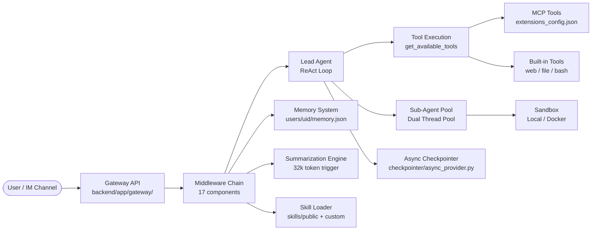
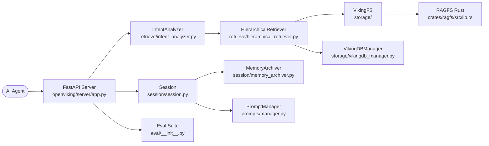
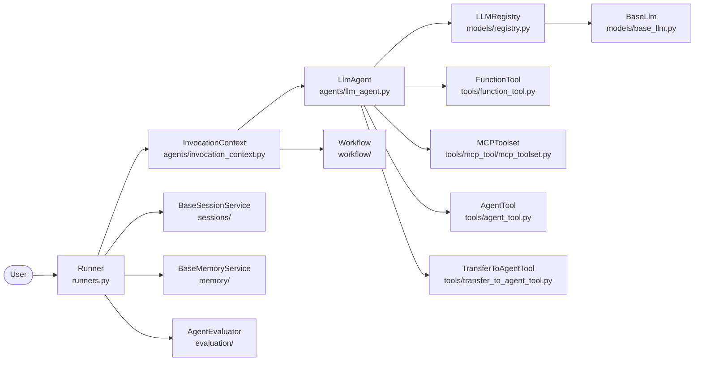
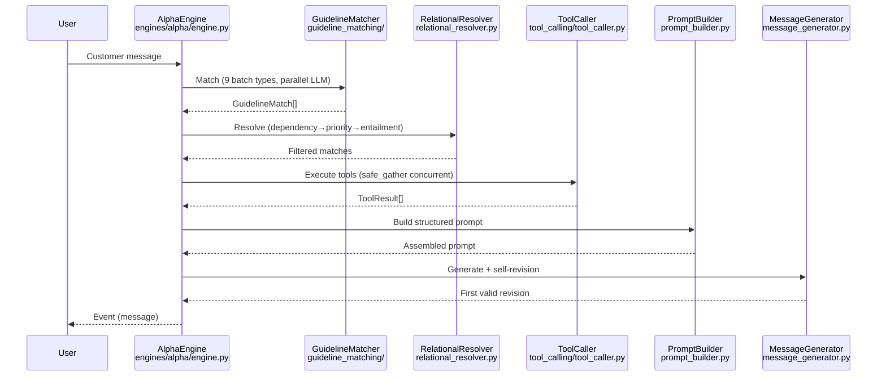

# Agentic AI Weekly Scan — 2026-05-28

## Executive Summary

- **Hai kiến trúc đối lập nổi bật tuần này:** `deer-flow` theo hướng orchestration-heavy (17-middleware pipeline, sub-agent pool), trong khi `parlant` theo hướng constraint-first — LLM chỉ được gọi **sau cùng**, sau khi toàn bộ guideline matching, relationship resolution, và tool execution đã hoàn thành.
- **OpenViking giới thiệu paradigm mới:** Thay vì flat vector store, đây là "context database" với virtual filesystem `viking://`, L0/L1/L2 content tier, và hotness-based cold archival — một dạng lifecycle management cho agent memory thực sự.
- **Google ADK 2.0 hoàn tất migration:** Từ workflow agents (`SequentialAgent`, `ParallelAgent`) sang graph API thuần (`Workflow` + `Node` + `Edge`); mọi thứ đều là `AsyncGenerator[Event, None]`, stateless runner + stateful session là core contract.

---

## Table of Contents

1. [bytedance/deer-flow](#1-bytedancedeer-flow) — SuperAgent harness đa agent với LangGraph và 17-middleware pipeline
2. [volcengine/OpenViking](#2-volcengineopenviking) — Context database cho AI agents với virtual filesystem `viking://`
3. [google/adk-python](#3-googleadk-python) — Google Agent Development Kit 2.0 — code-first, graph-based
4. [emcie-co/parlant](#4-emcie-coparlant) — Interaction control harness — constraint-first LLM orchestration

---

## 1. bytedance/deer-flow

**Link:** https://github.com/bytedance/deer-flow  
**Pushed:** 2026-05-28

### §1 — Quick Context

**Pitch:** Hệ thống SuperAgent mã nguồn mở điều phối nhiều agent con, sandbox cô lập, và persistent memory để thực hiện các tác vụ long-horizon như research, coding, và content creation.

**Tech stack:** Python 3.12+ / TypeScript, LangGraph, LangChain, FastAPI, SQLite/PostgreSQL, Next.js 16, Docker; 15+ LLM providers (OpenAI, Anthropic, Gemini, DeepSeek, Kimi, Ollama…).

**Repo health:** 69,800 stars, 9,400 forks, 569 open issues. CI với GitHub Actions, pytest suite, Playwright e2e, `Blockbuster` blocking-IO gate, pre-commit hooks. Python ≥3.12 required.

---

### §2 — Architecture Deep-Dive

#### A. Component Inventory

| Component | File Path | Vai trò |
|-----------|-----------|---------|
| `Lead Agent` | `backend/packages/harness/deerflow/` | LangGraph graph node chính, vòng lặp ReAct tool-use |
| `Middleware Chain (17)` | `backend/packages/harness/deerflow/` | Pipeline cross-cutting: memory, summarization, token tracking, loop detection, guardrails, sandbox audit |
| `Sandbox` (abstract + impls) | `backend/packages/harness/deerflow/` | Abstract interface; Local (LRU 256, virtual path mapping) và Docker/Apple Container |
| `Memory System` | `backend/packages/harness/deerflow/` | Per-user JSON tại `.deer-flow/users/{uid}/memory.json`, LLM-based fact extraction |
| `Summarization Engine` | `backend/packages/harness/deerflow/` | Token-triggered context compression (32k token threshold), giữ 10 messages gần nhất |
| `Gateway API` | `backend/app/gateway/` | FastAPI routes, LangGraph bridge, custom auth (`langgraph_auth.py`) |
| `IM Channel Adapters` | `backend/app/channels/` | Feishu, Slack, Telegram, DingTalk, WeChat, WeCom, Discord; message bus pub/sub |
| `Skill Loader` | `skills/public/`, `skills/custom/` | Markdown-based capability definitions, LRU cached với mtime invalidation |
| `MCP Tool Integration` | `extensions_config.json` (hot-reload) | Lazy-initialized, OAuth-capable, mtime-watched |
| `DeerFlowClient` (embedded) | `backend/packages/harness/deerflow/` | In-process client không cần FastAPI — dùng cho testing/scripting |
| `Async Checkpointer` | `backend/packages/harness/deerflow/runtime/checkpointer/async_provider.py` | Custom LangGraph checkpointer |

#### B. Control Flow — Hierarchical Planner-Executor với ReAct Inner Loop + Middleware Pipeline

1. User/IM channel gửi message → **Gateway API** nhận, Nginx rewrite `/api/langgraph/*` → native routes.
2. **Middleware Chain** (17 components, ordered) chạy pre-check — `ClarificationMiddleware` có thể abort sớm bằng `Command(goto=END)`.
3. **Lead Agent** (LangGraph ReAct): think → pick tool → execute → observe → loop đến final response.
4. Nếu cần sub-task: Lead Agent gọi `task` tool → sub-agent được spawn trong dual thread pool (max 3 concurrent, timeout 900s).
5. Sub-agent chạy với isolated thread context, kết quả trả về Lead Agent.
6. Response streaming qua SSE; `TokenUsageMiddleware` track mọi call.

**Pattern:** Hierarchical Planner-Executor với ReAct inner loop và event-driven IM dispatch.

#### C. State & Data Flow

- **Message format:** LangChain `BaseMessage` subclasses (HumanMessage, AIMessage, ToolMessage).
- **State model:** `ThreadState` extends `AgentState` — sandbox reference, artifact registry, tracked image list.
- **Persistence:** Custom async checkpointer + SQLite (default) hoặc PostgreSQL; `.deer-flow/users/{uid}/threads/{thread_id}/`.
- **Summarization:** Trigger tại 32k tokens, giữ 10 messages; skill files inject tối đa 25k tokens.

#### D. Tool / Capability Integration

- **Assembly order:** config tools → MCP tools (lazy-init, mtime-cached) → built-ins (`web_search`, `ls`, `read_file`, `write_file`, `bash`) → subagent `task` tool.
- **Loop detection:** warn tại 3 lần gọi giống nhau, hard limit tại 5; per-tool frequency limit 50.
- **MCP auth:** Custom interceptors, OAuth token flows; hot-reload qua mtime.
- **Deferred tool loading:** MCP tools không load vào context cho đến runtime — giảm context size.

#### E. Memory Architecture

- **Short-term:** LangGraph state, summarization khi quá 32k tokens.
- **Long-term:** Per-user JSON, LLM extract facts (confidence ≥ 0.7, categories: preference/knowledge/context/behavior/goal). Debounced 30s background thread. Top 15 facts inject vào system prompt qua `<memory>` tags (2,000 token limit). Max 100 facts/user.

#### F. Model Orchestration

- Single model factory (`create_chat_model()`) — reflection-based, đọc từ `config.yaml`.
- Extended thinking: Anthropic `budget_tokens` (min 1,024), DeepSeek/Qwen reasoning toggles.
- Sub-agents inherit hoặc override model độc lập.
- Config hot-reload: model params apply ngay trên turn tiếp theo; infra changes (DB, checkpointer) cần restart.

#### G. Observability & Eval

- LangSmith tracing + Langfuse; annotate runs với `session_id`, `user_id`.
- `TokenUsageMiddleware` track input/output/total tokens per call, hiển thị trên UI.
- Circuit breaker: 5 consecutive failures → 60s recovery.
- `SandboxAuditMiddleware` cho security event logging.
- Gateway conformance tests: `TestGatewayConformance` validate `DeerFlowClient` align với Pydantic models.

#### H. Extension Points

- Custom LLM: thêm provider block vào `config.yaml`.
- MCP servers: `extensions_config.json`, hot-reload.
- Custom skills: drop Markdown vào `skills/custom/`.
- Sandbox: swap local / Docker / Apple Container qua abstract `Sandbox` interface.
- IM channels: implement platform adapter trong `backend/app/channels/`.

---

### §3 — Architecture Diagram

---

### §4 — Verdict

**Điểm novel:** 17-component middleware pipeline là pattern chính — thêm capability mới = thêm middleware, không sửa agent logic. Strict harness/app boundary được enforce bởi CI test (`tests/test_harness_boundary.py`). `DeerFlowClient` (in-process) cho phép test và script mà không cần FastAPI server.

**Red flags:** 569 open issues nhiều; phụ thuộc nặng vào LangGraph (lock-in risk); hot-reload chỉ cho model params — infra changes cần restart không thuận lợi cho production.

**Open questions:** Exact LangGraph node/edge topology chưa rõ từ code public. Autonomous skill evolution (disabled by default) có guardrails đủ mạnh không khi bật lên?

---

## 2. volcengine/OpenViking

**Link:** https://github.com/volcengine/OpenViking  
**Pushed:** 2026-05-28

### §1 — Quick Context

**Pitch:** Context database mã nguồn mở chuyên dụng cho AI agents — thay thế flat vector store bằng virtual filesystem `viking://` với hierarchical L0/L1/L2 content tiering và hotness-based lifecycle management.

**Tech stack:** Python 3.10+ / Rust / C++, FastAPI, litellm (multi-provider), tree-sitter (10 ngôn ngữ), OpenTelemetry, Prometheus, Docker + Caddy, RAGFS (Rust filesystem abstraction).

**Repo health:** 24,790 stars, pushed 2026-05-28, CI với pre-commit, pytest-asyncio, ragas eval suite, benchmark suite. AGPL-3.0.

---

### §2 — Architecture Deep-Dive

#### A. Component Inventory

| Component | File Path | Vai trò |
|-----------|-----------|---------|
| `VikingFS` | `openviking/storage/` | Virtual filesystem, `viking://` URI namespace với L0/L1/L2 tiers |
| `RAGFS` (Rust) | `crates/ragfs/src/lib.rs` | Pluggable HTTP filesystem server, plugins: MemFS, KVFS, QueueFS |
| `HierarchicalRetriever` | `openviking/retrieve/hierarchical_retriever.py` | Multi-step vector retrieval với score propagation từ parent → children |
| `IntentAnalyzer` | `openviking/retrieve/intent_analyzer.py` | LLM-based query planner, sinh `QueryPlan` với typed queries (skill/memory/resource) |
| `Session` + `SessionCompressor (v2)` | `openviking/session/session.py` | Conversation state, sliding window, two-phase archival |
| `MemoryArchiver` | `openviking/session/memory_archiver.py` | Cold-storage archival: move L2 memories có hotness < 0.1 và age > 7 ngày sang `_archive/` |
| `Context / ContextType` | `openviking/core/context.py` | Unified data model: `skill`, `memory`, `resource` với L0/L1/L2 levels, hotness score |
| `SkillLoader` | `openviking/core/` | Load agent skills từ filesystem |
| `PromptManager` | `openviking/prompts/manager.py` | YAML + Jinja2 template engine, namespaced catalog |
| `FastAPI Server` | `openviking/server/app.py` | 19 routers + MCP endpoint `/mcp`, OAuth 2.1 DCR |
| `Eval Suite` | `openviking/eval/__init__.py` | RagasEvaluator, IOPlayback, RAGQueryPipeline, DatasetGenerator |
| `Telemetry Tracer` | `openviking/telemetry/tracer.py` | OTel decorator-based function tracing (`@tracer` decorator) |
| `Crypto / KMS` | `openviking/crypto/__init__.py` | Envelope encryption, Argon2id hashing, Vault/KMS/local providers |
| `VikingBot` | `bot/` | Agent framework built on OpenViking |
| `AGFS Client` | `openviking/pyagfs/__init__.py` | Python SDK cho AGFS server (sync + async) |
| `VikingDBManager` | `openviking/storage/vikingdb_manager.py` | Vector index + embedding queue + background processing |

#### B. Control Flow — Agentic RAG với Intent-Driven Hierarchical Retrieval

1. Agent gửi query + session context tới OpenViking server (`FastAPI Server`).
2. **IntentAnalyzer** gọi lightweight LLM sinh `QueryPlan` với multi-typed queries (`TypedQuery`: skill / memory / resource).
3. **HierarchicalRetriever** chạy parallel vector searches — drill-down từ global collection → directory children, score blending (semantic + hotness).
4. Retrieved contexts (L0 abstract luôn load; L1 overview khi relevant; L2 full content on-demand) trả về agent.
5. Session messages tích lũy; khi `pending_tokens` vượt threshold → **two-phase commit**: immediate tail-write `messages.jsonl` + background `MemoryArchiver`.
6. `MemoryArchiver` chạy LLM Working Memory v2 (rewrite 7-section `.overview.md`) và archive cold memories sang `{parent}/_archive/`.

**Pattern:** Agentic RAG với intent-driven hierarchical retrieval; không phải ReAct loop trong library — đây là infrastructure layer.

#### C. State & Data Flow

- **Message format:** Parts-based — `Message` = role + `List[Part]` (TextPart, ContextPart, ToolPart).
- **Active session:** `messages.jsonl` (append-only).
- **Archived segments:** `archive_NNN/` với `.overview.md` (7-section Working Memory v2), `.abstract.md`, `.meta.json`, `.done`.
- **Context tiers:** L0 ~100 tokens (always loaded) / L1 ~2k tokens (relevance-based) / L2 full content (on-demand).
- **Hotness score:** blending recency + access frequency; dùng cho retrieval ranking và archival decisions.

#### D. Tool / Capability Integration

- MCP endpoint `/mcp` (GET/POST/DELETE), OAuth 2.1 DCR cho client registration.
- Bot integrations qua optional deps: `bot-telegram`, `bot-feishu`, `bot-slack`.
- WebDAV router expose filesystem via standard protocol — external tools có thể mount context store.
- Custom parsers: implement `CustomParserProtocol`, register trong `ParserRegistry` (`openviking/parse/`).
- LangChain/LangGraph: optional extras trong `pyproject.toml`.

#### E. Memory Architecture

- **L0/L1/L2 tiering** (novel): L0 abstract (~100 tokens, always loaded) / L1 overview (~2k, relevance-based) / L2 full content (on-demand).
- **Short-term:** Sliding window; overflow → async LLM rewrite `.overview.md` (7 sections: Title, Current State, Task & Goals, Key Facts, Files & Context, Errors, Open Issues) với KEEP/UPDATE/APPEND operations per section.
- **Long-term cold archive:** `MemoryArchiver` scan L2 có hotness < 0.1 và age > 7 ngày → atomic move sang `_archive/` + vector index update.
- **Retrieval:** Intent decomposition → hierarchical vector search → semantic similarity + hotness blending → optional reranker.
- **Namespace:** `viking://resources/` (docs, repos), `viking://user/` (preferences), `viking://agent/` (skills, task memories).

#### F. Model Orchestration

- litellm abstraction cho tất cả LLM và embedding providers (Volcengine Doubao, OpenAI, Kimi, GLM, Jina, Ollama, Gemini, Voyage…).
- **Dual-model pattern:** `IntentAnalyzer` dùng lightweight model cho query planning; VLM fallback cho multimodal understanding.
- Session compression: async LLM invocation với structured tool-call interface (`update_working_memory` tool, per-section operations).
- Embedding: queued background processing qua `VikingDBManager`.

#### G. Observability & Eval

- OpenTelemetry OTLP (gRPC + HTTP); `@tracer` decorator wrap sync/async functions.
- `TraceIdLoggingFilter` correlate log records với active trace spans.
- Prometheus: DataSource → Collector → Exporter pipeline; `/metrics` endpoint.
- HTTP Observability Middleware + `X-Process-Time` header.
- `RagasEvaluator` cho RAG quality; `IOPlayback` cho record/replay; `RecordAnalysisStats` cho offline analysis.
- **Benchmark claims:** LoCoMo 24.20% → 82.08%, HotpotQA 91% @ 0.23s, token savings up to 91%.

#### H. Extension Points

- Custom parsers: `CustomParserProtocol` + `ParserRegistry`.
- RAGFS plugins: `ServicePlugin` (MemFS, KVFS, QueueFS, custom backends).
- KMS: `RootKeyProvider` base class cho custom key management.
- Privacy: PII placeholderization pipeline extensible (`openviking/privacy/`).
- Telemetry: `set_telemetry_runtime()` + telemetry registry.
- Observer pattern: `BaseObserver` / `QueueObserver` cho custom event consumers.
- WebDAV mount: external tools đọc/ghi context store via standard protocol.

---

### §3 — Architecture Diagram

---

### §4 — Verdict

**Điểm novel:** L0/L1/L2 content tiering với hotness scoring là innovation thực sự — không phải append-to-vector-store mà là hierarchical database với lifecycle management. Working Memory v2 (7-section structured rewrite với per-section operations) là approach tinh vi hơn hẳn sliding window. Rust RAGFS với pluggable filesystem backends cho thấy engineering seriousness.

**Red flags:** Python + Rust + C++ codebase phức tạp; AGPL-3.0 là blocker cho enterprise adoption; benchmark claims (82% LoCoMo) cần independent replication. Volcengine ecosystem lock-in trong model defaults.

**Open questions:** Working Memory v2 7-section rewrite có stable và coherent không với conversations rất dài (>100 exchanges)? Scale testing với nhiều agents concurrent dùng chung context store?

---

## 3. google/adk-python

**Link:** https://github.com/google/adk-python  
**Pushed:** 2026-05-28

### §1 — Quick Context

**Pitch:** Toolkit Python code-first của Google để build, eval, và deploy AI agents đa mô hình với graph-based workflow (ADK 2.0) và eval framework tích hợp sẵn.

**Tech stack:** Python 3.10–3.13, google-genai (Gemini), LiteLLM (100+ providers), Anthropic SDK, FastAPI, SQLAlchemy + aiosqlite, OpenTelemetry; deploy lên Vertex AI Agent Engine / Cloud Run / GKE. Apache 2.0.

**Repo health:** 19,893 stars, 3,467 forks, 856 open issues. CI với tox matrix testing, mypy strict, pylint, pyink 80-char. Active changelog, multi-contributor.

---

### §2 — Architecture Deep-Dive

#### A. Component Inventory

| Component | File Path | Vai trò |
|-----------|-----------|---------|
| `LlmAgent` / `Agent` | `src/google/adk/agents/llm_agent.py` | Core reasoning agent, ReAct loop, 6 callback hooks |
| `BaseAgent` | `src/google/adk/agents/base_agent.py` | Abstract base; `_run_async_impl → AsyncGenerator[Event, None]` |
| `Runner` | `src/google/adk/runners.py` | Stateless orchestration engine; `run_async()`, `run_live()`, `rewind_async()` |
| `InvocationContext` | `src/google/adk/agents/invocation_context.py` | Runtime execution context: services, invocation_id, branch, event_queue |
| `Context` | `src/google/adk/agents/context.py` | Public ADK 2.0 context; `state`, `route`, `output`, `run_node()`, `search_memory()` |
| `Workflow` | `src/google/adk/workflow/` | Graph-based DAG execution (ADK 2.0); Node, Edge, JoinNode, FunctionNode |
| `LLMRegistry` | `src/google/adk/models/registry.py` | Regex-based model identifier routing → `BaseLlm` subclass; lazy import |
| `BaseLlm` | `src/google/adk/models/base_llm.py` | Abstract LLM; `generate_content_async() → AsyncGenerator[LlmResponse, None]` |
| `FunctionTool` | `src/google/adk/tools/function_tool.py` | Auto-wrap Python callable qua `inspect.signature()` + type hints |
| `MCPToolset` | `src/google/adk/tools/mcp_tool/mcp_toolset.py` | MCP via Stdio/SSE/Streamable HTTP; OAuth 2.0/Basic/API Key |
| `AgentTool` | `src/google/adk/tools/agent_tool.py` | Wrap `BaseAgent` như callable tool (inline delegation) |
| `TransferToAgentTool` | `src/google/adk/tools/transfer_to_agent_tool.py` | Enum-constrained agent handoff — LLM chỉ chọn được valid agent names |
| `BaseSessionService` | `src/google/adk/sessions/` | Abstract; impls: InMemory, Database (SQLAlchemy), Vertex AI |
| `BaseMemoryService` | `src/google/adk/memory/` | Abstract; impls: InMemory (keyword), VertexAiMemoryBankService, VertexAiRagMemoryService |
| `AgentEvaluator` | `src/google/adk/evaluation/` | 4-metric eval pipeline; multi-run averaging |
| `State` | `src/google/adk/sessions/state.py` | Dual-dict (`_value` + `_delta`), scoped keys: session / `app:` / `user:` / `temp:` |
| `Event` | `src/google/adk/events/event.py` | Extends `LlmResponse`; immutable với `branch`, `invocation_id`, `actions`, `node_info` |

#### B. Control Flow — Ba Patterns Kết Hợp Được

**Pattern A — ReAct Loop (trong `LlmAgent`):**
1. Build `LlmRequest` (system instruction + conversation + tool declarations).
2. Call `BaseLlm.generate_content_async()`.
3. Parse: function call → execute tools → append results → loop về 1.
4. Final response → yield `Event` có `is_final_response() == True`.

**Pattern B — Hierarchical Multi-Agent:**
1. Parent `LlmAgent` có `sub_agents`; LLM gọi `TransferToAgentTool` (enum-constrained, chỉ valid agent names).
2. `Runner._find_agent_to_run()` route turn tiếp theo tới named sub-agent.
3. Control trả về parent qua `escalate` action trong `EventActions`.

**Pattern C — Graph-Based Workflow (ADK 2.0):**
1. `Workflow` DAG: `Node`/`Edge`/`JoinNode`/`FunctionNode` với `START` sentinel.
2. `Context.route` cho conditional branching; cycles tạo loops; `JoinNode` là fan-in.
3. Retry qua `RetryConfig` per node; human-in-the-loop qua `interrupt_ids` + `resume_inputs`.

**Pattern:** State machine/graph (ADK 2.0) + Hierarchical multi-agent + ReAct inner loop.

#### C. State & Data Flow

- **Wire format:** Tất cả đều là `AsyncGenerator[Event, None]` — agents, workflow nodes, runner.
- **State scopes:** session (`"key"`), app-wide (`"app:key"`), per-user (`"user:key"`), ephemeral (`"temp:key"`). Delta tracked, persist khi `append_event()`.
- **Branch isolation:** Parallel agents tag events với hierarchical branch strings (e.g. `"agent1.agent2"`), giữ conversation histories cô lập.
- **`output_key`:** `LlmAgent(output_key="result")` tự động write final response vào `session.state["result"]` — cơ chế truyền data giữa agents.
- **Runner stateless:** Không có mutable state trong Runner; tất cả state trong `Session` được persist qua `SessionService`.

#### D. Tool / Capability Integration

- Python callables: auto-wrapped thành `FunctionTool`; schema từ `inspect.signature()` + type hints + docstring.
- MCP: Stdio/SSE/Streamable HTTP; `MCPToolset` với sampling callbacks và resource loading.
- Dynamic instruction: `McpInstructionProvider` fetch live system prompt từ MCP server's `list_prompts()`.
- Structured output: `output_schema: Pydantic model` → disable tool use, enforce JSON schema output.
- Framework interop: crewai, langgraph, llama-index adapters qua `[extensions]` extra.
- A2A protocol: `RemoteA2aAgent` + bi-directional event conversion, protocol version negotiation.

#### E. Memory Architecture

- **Session state:** K/V scoped, delta-tracked, persist mọi event.
- **Artifact service:** Binary blobs versioned; InMemory / filesystem / GCS backends.
- **Long-term (Vertex AI):** `VertexAiMemoryBankService` (consolidation + generation modes) hoặc `VertexAiRagMemoryService` (semantic search via RAG corpus).
- **`InMemoryMemoryService`:** Keyword-matching search trên past events — "prototype only" per docs.

#### F. Model Orchestration

- `LLMRegistry`: normalize identifier → regex match → lazy import `BaseLlm` subclass.
- Per-agent model walk-up chain: nếu agent không set model, walk lên `parent_agent` đến khi tìm thấy.
- 4 model classes: `Gemini` (native), `AnthropicLlm`/`Claude` (direct SDK + Vertex), `LiteLlm` (100+ providers), `OpenAILlm`.
- Custom: subclass `BaseLlm`, implement `generate_content_async()`, `LLMRegistry.register(MyLlm)`.

#### G. Observability & Eval

- OTel spans: `gen_ai.tool.definitions`, `gen_ai.agent.version`; BigQuery analytics plugin với automatic view generation.
- **`AgentEvaluator`:** 4 metrics — `tool_trajectory_avg_score`, `response_evaluation_score`, `response_match_score`, `safety_v1`. Multi-run averaging, configurable thresholds.
- **Conformance testing:** `adk conformance record` capture YAML snapshots → `adk conformance test` replay.
- **GEPA optimization:** `adk optimize` iteratively improve agent system prompts.
- **8 callback hooks** trên `LlmAgent`: `before/after_model_callback`, `on_model_error_callback`, `before/after_tool_callback`, `on_tool_error_callback`.

#### H. Extension Points

- Custom agent: subclass `BaseAgent`, implement `_run_async_impl()`.
- Custom workflow node: subclass `BaseNode`.
- Custom LLM: subclass `BaseLlm`, `LLMRegistry.register(MyLlm)`.
- Custom session/memory/artifact/auth backends.
- Custom planner: `BasePlanner`, pass vào `LlmAgent(planner=...)`.
- Custom code executor: `BaseCodeExecutor`, pass vào `LlmAgent(code_executor=...)`.
- FastAPI extension: `get_fast_api_app()` → add custom routes.

---

### §3 — Architecture Diagram

---

### §4 — Verdict

**Điểm novel:** `output_key` mechanism (agent tự write vào `session.state`) là clean data-passing pattern không cần shared mutable state. Branch-isolated parallel execution — events được tag hierarchical branch string, không cần separate session per sub-agent. ADK 2.0 graph migration là đúng hướng (deprecate SequentialAgent/ParallelAgent).

**Red flags:** 856 open issues nhiều; `InMemoryMemoryService` là "prototype only" nhưng nhiều examples trong repo dùng nó — misleading cho người mới. Production memory features gắn chặt Vertex AI — không self-hostable hoàn toàn.

**Open questions:** Workflow graph cycle detection có limit không? GEPA optimization cost ở scale với nhiều agents? A2A protocol maturity so với MCP?

---

## 4. emcie-co/parlant

**Link:** https://github.com/emcie-co/parlant  
**Pushed:** 2026-05-27

### §1 — Quick Context

**Pitch:** Interaction control harness cho customer-facing AI agents — LLM chỉ được gọi **sau cùng** sau khi guideline matching, relationship resolution, và tool execution hoàn thành, đảm bảo output bị ràng buộc bởi business rules.

**Tech stack:** Python 3.10–3.15, FastAPI, 22 LLM provider adapters, ChromaDB/Qdrant, networkx (relationship DAGs), MongoDB/Snowflake, OpenTelemetry, FastMCP, React chat widget.

**Repo health:** 18,089 stars, 1,500 forks, 30 open issues. CI với `ci-test.yml`, stochastic testing (`pytest_stochastics.json`), mypy strict, ruff. Apache 2.0. Latest release v3.3.2 (April 2026).

---

### §2 — Architecture Deep-Dive

#### A. Component Inventory

| Component | File Path | Vai trò |
|-----------|-----------|---------|
| `AlphaEngine` | `src/parlant/core/engines/alpha/engine.py` | Main orchestrator; nhận 12 injected collaborators; `process()` và `utter()` |
| `GuidelineMatcher` | `src/parlant/core/engines/alpha/guideline_matching/guideline_matcher.py` | Eval if-then guidelines với parallel async batches, retry 3× per batch |
| `GuidelineMatchingStrategy` (9 batch types) | `src/parlant/core/engines/alpha/guideline_matching/generic/` | actionable, previously-applied, customer-dependent, observational, low-criticality, disambiguation, response-analysis, journey/* |
| `RelationalResolver` | `src/parlant/core/engines/alpha/relational_resolver.py` | 3-pass iterative filter (dependency → priority → entailment) qua networkx DiGraph; max 3 iterations |
| `ToolCaller` | `src/parlant/core/engines/alpha/tool_calling/tool_caller.py` | Infer + execute tools concurrently via `safe_gather`; `ToolInsights` tracking |
| `ToolCallBatcher` | `src/parlant/core/engines/alpha/tool_calling/default_tool_call_batcher.py` | Non-overlapping tools → parallel; overlapping → coordinated |
| `MessageGenerator` | `src/parlant/core/engines/alpha/message_generator.py` | Fluid mode: `SchematicGenerator[MessageSchema]` → self-revision chain (pick first valid revision, up to 3) |
| `CannedResponseGenerator` | `src/parlant/core/engines/alpha/canned_response_generator.py` | Jinja2 templates cho strict modes — không gọi LLM |
| `PromptBuilder` | `src/parlant/core/engines/alpha/prompt_builder.py` | Assemble structured prompt sections với `SectionStatus` (ACTIVE/PASSIVE/NONE) |
| `Journey` | `src/parlant/core/journeys.py` | DAG: InitialJourneyState, ChatJourneyState, ToolJourneyState, ForkJourneyState, END_JOURNEY |
| `Guideline` | `src/parlant/core/guidelines.py` | If-then rules; ID = MD5(condition + action); 8-version migration chain |
| `RelationshipGraph` | `src/parlant/core/relationships.py` | 6 relationship kinds (ENTAILMENT, PRIORITY, DEPENDENCY, DISAMBIGUATION, REEVALUATION, OVERLAP) qua networkx DiGraph |
| `ContextVariables` | `src/parlant/core/context_variables.py` | Scoped memory (customer/tag/global) với freshness rules và tool-bound auto-refresh |
| `GlossaryVectorStore` | `src/parlant/core/glossary.py` | Semantic retrieval per turn; terms inject vào mọi LLM prompt |
| `NLPService` (22 adapters) | `src/parlant/adapters/nlp/` | Abstract: `SchematicGenerator`, `StreamingTextGenerator`, `Embedder`, `ModerationService` |
| `EngineHooks` | `src/parlant/core/engines/alpha/hooks.py` | 20+ lifecycle hook points; per-guideline và per-journey handlers |
| `Application` (composition root) | `src/parlant/core/application.py` | 13 `*Module` slots; pure container, no wiring logic |
| `LocalToolService` | `src/parlant/core/tools.py` | Python functions via `importlib`, schema từ type annotations |
| `PluginServer/Client` | `src/parlant/core/services/tools/plugins.py` | HTTP streaming REST tool server |
| `MCPToolClient/Server` | `src/parlant/core/services/tools/mcp_service.py` | FastMCP + `StreamableHttpTransport` |

#### B. Control Flow — Constraint-First Pipeline (Inverted dari ReAct thông thường)

1. Customer message → `AlphaEngine.process()`.
2. **GuidelineMatcher**: load all enabled guidelines → run parallel LLM batches (9 batch types) → `GuidelineMatch[]`.
3. **RelationalResolver**: 3-pass iterative filter qua networkx (dependency → priority → entailment) → filtered matches.
4. **GlossaryVectorStore**: semantic search relevant terms từ matched guideline content → inject vào prompt.
5. **ToolCaller**: infer tool calls từ tool-enabled guidelines → concurrent execution qua `safe_gather` → `ToolResult[]`.
6. Nếu tool results activate new guidelines → loop về bước 2 (max engine iterations).
7. **PromptBuilder**: assemble structured prompt (identity + history + context vars + glossary + guidelines + tool events).
8. **MessageGenerator** (LLM call cuối, fluid mode): `SchematicGenerator[MessageSchema]` → self-revision → pick first valid revision (no-repetition AND guideline-adherent).
9. Emit `Event` → `SessionDocumentStore` → SSE về client.

**Pattern:** Constraint-First Pipeline — không phải ReAct. LLM là khâu cuối cùng, không phải khâu đầu tiên. Hexagonal architecture (ports & adapters) với composition root tại `Application`.

#### C. State & Data Flow

- **Events:** Append-only log; `source` (customer/agent/system/UI/human_agent), `kind` (message/tool/status/custom), `offset`, `trace_id`. Immutable records.
- **Journey state:** Per-session trong `Session.agent_states` (JourneyId → path).
- **Context variables:** Customer/tag/global scope, freshness rules, tool-bound auto-refresh khi stale.
- **Dual storage:** Journey, Glossary, CannedResponses — lưu cả document collections (exact retrieval) lẫn vector collections (semantic search).
- **Không có LLM-generated memory mặc định** — toàn bộ là explicit structured DB records.

#### D. Tool / Capability Integration

- **3 modes** đều implement abstract `ToolService` (`list_tools()`, `call_tool()`):
  - `LocalToolService`: Python functions qua `importlib` + `@p.tool` decorator.
  - `PluginClient/Server`: HTTP streaming REST, same-process hosting khả thi.
  - `MCPToolClient/Server`: FastMCP, `StreamableHttpTransport`.
- **Tool-guideline association:** `GuidelineToolAssociations` — chỉ guidelines match VÀ có associated tool mới trigger execution.
- **`ToolInsights`:** Track missing params và invalid params → feedback cho engine.

#### E. Memory Architecture

- Conversation: `SessionDocumentStore` (append-only event log).
- Context variables: scoped K/V với freshness rules + tool-bound auto-refresh.
- Glossary: `GlossaryVectorStore` — semantic retrieval per turn; inject vào mọi prompt.
- Journey state: per-session path tracking.
- Vector indexes: ChromaDB/Qdrant cho glossary, journeys, canned responses, capabilities.
- **Không có LLM-generated memory** — explicit structured records throughout.

#### F. Model Orchestration

- Server startup chọn một `NLPService` provider qua CLI flag.
- Within provider: model routing by hint — `model_size` (nano/mini/full), `model_type` (tool-calling/embedding).
- `FallbackSchematicGenerator`: chain multiple generators, sequential fallthrough.
- Guideline matching: parallel LLM batches (một batch = một LLM call cho một nhóm guidelines).
- OpenAI adapter: tool-calling → GPT-4o; default → GPT-4.1; supports GPT-5 (400K context).

#### G. Observability & Eval

- OTel spans: `process`, `utter`, `preparation_iteration_N`, `guideline_matcher`, `message_generation`, `tool_caller`.
- Duration histograms: `eng.process`, `eng.utter`, guideline batch, tool batch, generation requests.
- `parlant-test` CLI: `@suite.scenario(repetitions=N)`, `response.should(condition)` assertions via NLP, `unfold()` multi-turn scripts.
- **Stochastic testing** (`pytest_stochastics.json`) — automated LLM behavior variance testing.
- Background indexing: `behavioral_change_evaluation.py`, `guideline_action_proposer.py`, `journey_reachable_nodes_evaluation.py`.

#### H. Extension Points

- Custom LLM: implement `NLPService`.
- Custom guideline matcher: `GuidelineMatchingStrategy` (`custom_guideline_matching_strategy.py`).
- Custom tool batcher: implement `ToolCallBatcher`.
- Engine hooks: 20+ hook points via `EngineHooks` — per-guideline và per-journey handlers.
- External tools: `PluginServer` (HTTP) hoặc `MCPToolServer` (MCP).
- Custom modules: `--module` CLI flag, `configure_module()` callback.
- Custom DB/vector backends: abstract `DocumentDatabase`, `VectorDatabase`.

---

### §3 — Architecture Diagram

---

### §4 — Verdict

**Điểm novel:** Inversion of control trong LLM orchestration — LLM là constraint-bounded responder, không phải autonomous planner. `RelationalResolver` với networkx-backed 6-relationship-kind DAG là cơ chế quản lý guideline conflicts tinh vi nhất trong các repo tuần này. Self-revision schema (pick first valid revision từ một `MessageSchema` response) tránh extra API calls mà vẫn có correction. Guideline ID = MD5(content) là elegant deduplication.

**Red flags:** Pipeline phức tạp (9 batch types + 3-pass resolver) → latency tiềm năng cao với nhiều guidelines; chưa thấy benchmark latency public. Không có built-in memory summarization — hệ thống phụ thuộc vào explicit human-defined guidelines hoàn toàn.

**Open questions:** Performance với >1,000 guidelines? Chi phí 9 parallel LLM batches per turn có justify được so với simpler prompt-based approaches? `behavioral_change_evaluation.py` background service hoạt động như thế nào ở production scale?

---

*Scan thực hiện 2026-05-28. Data sources: GitHub MCP API + direct README/pyproject.toml fetching.*
