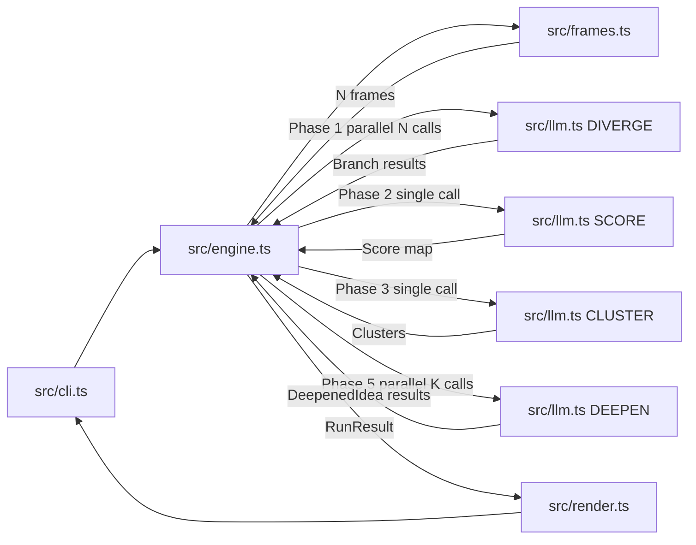
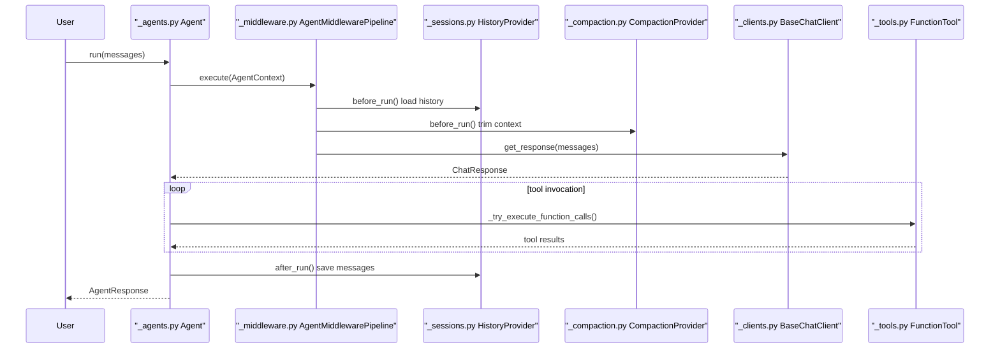
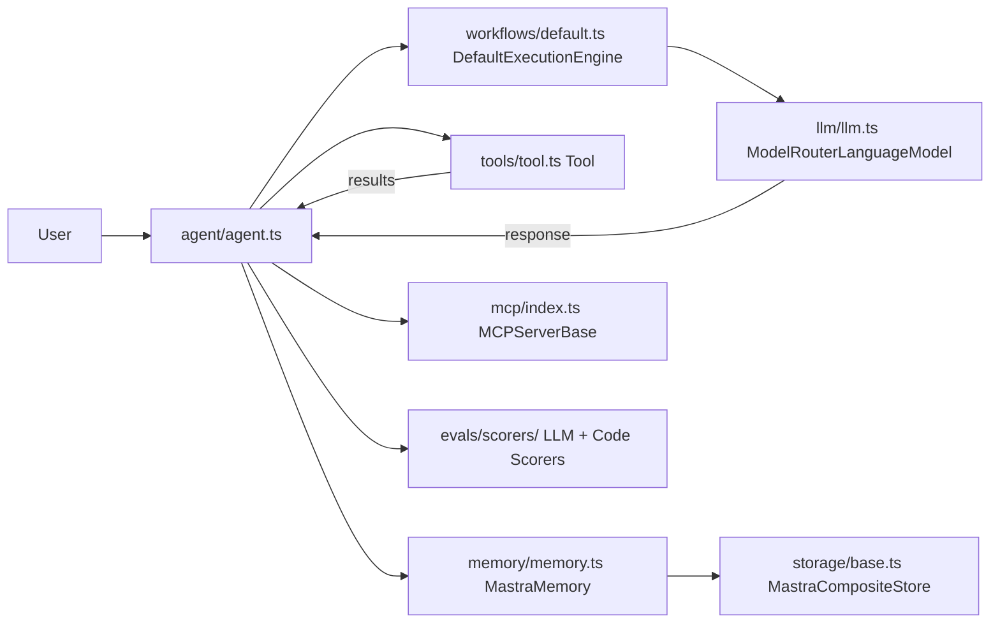
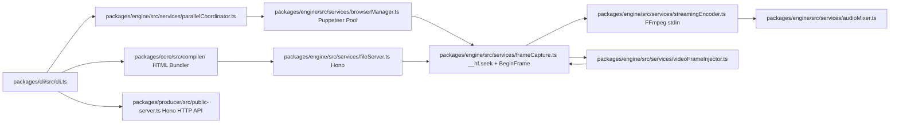

# Agentic AI Weekly Scan — 2026-05-29

> **Nguồn dữ liệu:** GitHub Search API (`created:>2026-05-22 stars:>200` + `pushed:>2026-05-22 stars:>500`).
> **Phương pháp:** Fetch README, directory tree, entry points, core modules, package files thực tế từ GitHub trước khi viết.

---

## Tóm tắt tuần (Executive Summary)

- **Điểm nhấn mới nhất:** `UditAkhourii/adhd` (481⭐, tạo 2026-05-25 — 4 ngày tuổi) đề xuất pattern **Diverge-Score-Cluster-Deepen** — biến thể Tree-of-Thought với hard isolation giữa các branches và intentional tool-disable trong diverge phase để tránh convergence pressure; kèm LLM-as-judge eval harness với anti-positional-bias randomization.

- **Production-grade week:** `microsoft/agent-framework` implement Pregel superstep graph với 7 compaction strategies và security primitives first-class (information-flow control, `ContentVariableStore`, quarantined LLM pattern) — depth engineering vượt xa hầu hết OSS agent frameworks. `mastra-ai/mastra` unify Zod v3/v4 + JSON Schema dưới `StandardSchemaWithJSON` và tích hợp eval scoring trực tiếp vào agent loop (score=0 triggers re-run).

- **Emerging pattern:** `heygen-com/hyperframes` (22k⭐, HeyGen-backed) không phải agent framework truyền thống mà là **deterministic media rendering pipeline** sử dụng CDP `HeadlessExperimental.beginFrame` — HTML animations được scrub theo timeline thay vì play-through, cho phép agents kiểm soát video production một cách reproducible.

---

## Danh sách 10 repos đáng theo dõi

| # | Repo | Stars | Status | Relevance signal | Verdict |
|---|------|------:|--------|-----------------|---------|
| 1 | [UditAkhourii/adhd](https://github.com/UditAkhourii/adhd) | 481 | **Mới** 2026-05-25 | Novel D-S-C-D architecture, LLM-as-judge eval, intentional tool isolation | ✅ Deep-dive |
| 2 | [microsoft/agent-framework](https://github.com/microsoft/agent-framework) | 10.8k | Updated 2026-05-29 | Pregel graph, 7 compaction strategies, security module, 26 ADRs | ✅ Deep-dive |
| 3 | [mastra-ai/mastra](https://github.com/mastra-ai/mastra) | 24.5k | Updated 2026-05-29 | TypeScript, eval-in-loop, MCP-native, 40+ providers, working memory templates | ✅ Deep-dive |
| 4 | [heygen-com/hyperframes](https://github.com/heygen-com/hyperframes) | 22k | Updated 2026-05-29 | CDP BeginFrame deterministic rendering, agent-friendly JSON CLI, WCAG audit | ✅ Deep-dive |
| 5 | [openai/openai-agents-python](https://github.com/openai/openai-agents-python) | 26.7k | Updated 2026-05-28 | Official OpenAI multi-agent, handoffs, built-in tracing | Bỏ qua: well-documented ở nơi khác, không có novel update tuần này |
| 6 | [elizaOS/eliza](https://github.com/elizaOS/eliza) | 18.5k | Updated 2026-05-29 | Agentic OS, plugin swarm topology, Discord/Telegram/Slack | Bỏ qua: architecture stable, update incremental |
| 7 | [pydantic/pydantic-ai](https://github.com/pydantic/pydantic-ai) | 17.4k | Updated 2026-05-29 | Pydantic-native, type-safe tool calling, structured output | Bỏ qua: incremental release |
| 8 | [withkynam/vibecode-pro-max-kit](https://github.com/withkynam/vibecode-pro-max-kit) | 346 | **Mới** 2026-05-27 | 12 agents, 32 skills, spec-driven context memory (14.6MB size) | Chưa đủ evidence: cần kiểm tra substance vs. prompt collection |
| 9 | [camel-ai/camel](https://github.com/camel-ai/camel) | 17k | Updated 2026-05-29 | Scaling law research, role-playing multi-agent, society sim | Bỏ qua: incremental |
| 10 | [agent0ai/agent-zero](https://github.com/agent0ai/agent-zero) | 17.8k | Updated 2026-05-26 | Autonomous hierarchical agent, tool sandboxing, self-improving | Bỏ qua: incremental |

---

## Mục lục deep-dives

1. [adhd — UditAkhourii/adhd](#1-adhd)
2. [microsoft/agent-framework](#2-microsoftagent-framework)
3. [mastra — mastra-ai/mastra](#3-mastra)
4. [hyperframes — heygen-com/hyperframes](#4-hyperframes)

---

## 1. adhd

**Repo:** https://github.com/UditAkhourii/adhd | **Tạo:** 2026-05-25 | **Stars:** 481

### §1 — Quick Context

Tree-of-Thought với pruning chạy trên Claude Agent SDK: fanout nhiều "cognitive frames" song song, score-cluster-deepen để tránh epistemic monoculture.

- **Tech stack:** TypeScript, `@anthropic-ai/claude-agent-sdk ^0.1.0`, `p-limit ^5.0.0`, `zod ^3.23.0`; không có database, HTTP server, hay vector store.
- **Repo health:** 481⭐, 1 contributor chính, tạo 2026-05-25, pushed 2026-05-28; có `bench/` eval harness + `EVALS.md` committed; không có `test/` directory.

### §2 — Architecture Deep-Dive

**A. Component inventory**

- `Orchestrator Engine` (`src/engine.ts`) — điều phối toàn bộ 5 phases của D-S-C-D pipeline.
- `Frame Catalog + Selector` (`src/frames.ts`) — 15 cognitive frames, `selectFrames(n, codeMode)` luôn inject ≥1 "wild" frame.
- `LLM Wrapper` (`src/llm.ts`) — `callLLM()` với `allowedTools: []` (tools explicitly disabled), `parseJSON<T>()` fence stripper.
- `Type System` (`src/types.ts`) — `Idea`, `Score`, `Branch`, `Cluster`, `DeepenedIdea`, `RunOptions`, `RunResult`, `RunEvent`.
- `CLI Entry` (`src/cli.ts`) — arg parsing, event logging to stderr, stdout JSON/text output.
- `ANSI Renderer` (`src/render.ts`) — terminal formatting.
- `Public API` (`src/index.ts`) — barrel export: `run`, `renderText`, `FRAMES`, `selectFrames` + 8 types.
- `Eval Harness` (`bench/run-evals.ts`) — A/B benchmark với positional-bias randomization.
- `LLM Judge` (`bench/judge.ts`) — "skeptical staff engineer" system prompt, 5-dimension scoring.

**B. Control flow — Diverge-Score-Cluster-Deepen (D-S-C-D)**

Đây **không phải** ReAct (không có tool-call loop), không phải planner-executor split. Đây là **fan-out divergence → prune → fan-in critique** pipeline:

1. `selectFrames(n, codeMode)` chọn N frames từ 15-item catalog (bias toward "code"/"design" khi codeMode=true, ≥1 "wild" frame).
2. **Phase 1 — Diverge (parallel):** N isolated `callLLM()` calls đồng thời (p-limit concurrency=4); mỗi call **không thấy output của call khác** — zero shared context.
3. **Phase 2 — Score (single call):** Rate tất cả ideas theo novelty/viability/fit/total; flag "traps" (ideas nghe hay nhưng thực ra dead-end).
4. **Phase 3 — Cluster (single call):** Nhóm ideas theo strategic angle, không phải surface similarity.
5. **Phase 4 — Shortlist:** Deterministic filter theo viability threshold + `nonObviousPick` = highest-novelty idea trong top-K.
6. **Phase 5 — Deepen (parallel):** K concurrent `callLLM()` calls sinh implementation sketch + child ideas + provocation question.

**C. State & data flow**

- Toàn bộ state: in-memory, single process, stateless across runs.
- `RunOptions` → `engine.ts` accumulates `RunResult` (branches, clusters, shortlist, traps, deepened, provocation).
- Event stream: `onEvent?: (e: RunEvent) => void` callback → stderr (không pollute stdout khi dùng `--json`).
- Message format: untyped string prompts → `parseJSON<T>()` JSON fence-stripped outputs.
- `Idea.parentId?: string` và `Idea.depth: number` track intra-run tree structure (discarded sau `run()`).

**D. Tool / capability integration**

- `allowedTools: []` — tools bị disable hoàn toàn. Comment trong source: *"tools create convergence pressure"* — intentional design choice để giữ Phase 1 diverge không bị anchor.
- Không có function calling, không có MCP, không có external API calls ngoài Claude SDK.
- Context injection duy nhất: `--context` file path → raw string inject vào problem statement.

**E. Memory architecture**

Không có persistent memory. Mỗi `callLLM()` là single-turn invocation, không có conversation history. Stateless hoàn toàn.

**F. Model orchestration**

- 4 system prompts khác nhau: `DIVERGE_SYSTEM`, `SCORE_SYSTEM`, `CLUSTER_SYSTEM`, `DEEPEN_SYSTEM` — tất cả cùng 1 model (default từ SDK; overridable via `--model` CLI flag hoặc `RunOptions.model`).
- Concurrency: `p-limit(concurrency)` gates Phase 1 (Diverge) và Phase 5 (Deepen); default concurrency=4.

**G. Observability & eval**

- `RunEvent` discriminated union (8 kinds: `frame:start`, `frame:done`, `score:done`, `cluster:done`, `deepen:start`, `deepen:done`, `warn`, và baseline) → stderr.
- `bench/run-evals.ts`: 6 engineering problems, A/B order randomized per problem (chống positional bias).
- `bench/judge.ts`: judge bằng LLM với "skeptical staff engineer" system prompt; 5 dimensions: `breadth`, `novelty`, `trap_detection`, `actionability`, `builder_usefulness` (0–10).
- ANSI stripped trước khi judge để tránh formatting-as-signal bias.

**H. Extension points**

`RunOptions.model` override model; `RunOptions.onEvent` custom event handler; `RunOptions.concurrency` adjust parallelism. Không có plugin system.

### §3 — Architecture Diagram

### §4 — Verdict

- **Điểm novel:** Hard isolation giữa diverge branches (tools disabled, no shared context) là design choice rất cụ thể và có lý — tránh anchoring bias ngay trong foundation. LLM-as-judge với anti-positional-bias randomization + ANSI stripping trước khi judge cho thấy tác giả hiểu rõ failure modes của LLM evaluation. "Wild" frame injection để tránh epistemic monoculture là heuristic đơn giản nhưng thú vị.
- **Red flags:** Single contributor, 4 ngày tuổi, không có `test/` directory. Không có error recovery nếu 1 trong N diverge calls fail partway through. `parseJSON<T>()` naive fence stripper có thể fail với complex nested JSON. `selectFrames()` không có formal ablation study cho 15 frames.
- **Open questions:** EVALS.md có kết quả thực tế thuyết phục không, hay chỉ là cherry-picked examples? Frame selection algorithm có được ablated không — liệu 15 frames là số optimal? Hard isolation có thực sự tốt hơn shared context trong diverge phase?

---

## 2. microsoft/agent-framework

**Repo:** https://github.com/microsoft/agent-framework | **Updated:** 2026-05-29 | **Stars:** 10.8k

### §1 — Quick Context

Framework đa ngôn ngữ (Python + .NET) của Microsoft cho orchestration AI agents với Pregel graph engine, 7 compaction strategies và security primitives tích hợp sẵn.

- **Tech stack:** Python ≥3.10 (50%) + C# .NET (47%), Pydantic v2, OpenTelemetry, 10+ LLM providers (OpenAI/Azure/Anthropic/Bedrock/Gemini/Ollama/Copilot Studio/Hyperlight); build: `flit-core`; test: `pytest` async-mode.
- **Repo health:** 10.8k⭐, 1.8k forks, 2.188 commits, tạo April 2025, pushed 2026-05-29; CI với `mypy` strict + `ruff` + `bandit` + `pyright`; 26 ADRs tại `docs/decisions/`.

### §2 — Architecture Deep-Dive

**A. Component inventory**

- `Agent` + `RawAgent` (`python/packages/core/agent_framework/_agents.py`) — core execution loop; `Agent` = `RawAgent` + `AgentMiddlewareLayer` + `AgentTelemetryLayer`.
- `AgentMiddlewarePipeline`, `ChatMiddlewarePipeline`, `FunctionMiddlewarePipeline` (`python/packages/core/agent_framework/_middleware.py`) — 3-tier middleware.
- `HistoryProvider` (in-memory/file/Redis/CosmosDB) (`python/packages/core/agent_framework/_sessions.py`) — `before_run()` load history, `after_run()` save.
- `CompactionProvider` (`python/packages/core/agent_framework/_compaction.py`) — 7 compaction strategies cho context window management.
- `BaseChatClient` + provider-specific clients (`python/packages/core/agent_framework/_clients.py`) — provider abstraction.
- `FunctionTool` + `@tool` decorator (`python/packages/core/agent_framework/_tools.py`) — Pydantic BaseModel auto-generates JSON Schema spec.
- `MCPTool` (stdio/HTTP+SSE/WebSocket) (`python/packages/core/agent_framework/_mcp.py`) — MCP integration với 3 transports.
- `Workflow` + `WorkflowBuilder` (`python/packages/core/agent_framework/_workflows/_workflow.py`, `_workflow_builder.py`) — fluent API build directed graph.
- `Pregel Runner` (`python/packages/core/agent_framework/_workflows/_runner.py`) — `run_until_convergence()` superstep loop.
- `EdgeRunner` (`python/packages/core/agent_framework/_workflows/_edge_runner.py`) — routes `WorkflowMessage` đến handlers.
- `AgentExecutor` + `FunctionExecutor` (`python/packages/core/agent_framework/_workflows/_executor.py`, `_agent_executor.py`) — graph node wrappers.
- `FunctionalWorkflow` với `@workflow`/`@step` decorators (`python/packages/core/agent_framework/_workflows/_functional.py`).
- `CheckpointStorage` (`python/packages/core/agent_framework/_workflows/_checkpoint.py`) — bound to `graph_signature_hash`.
- `SequentialOrchestration`, `ConcurrentOrchestration`, `HandoffOrchestration`, `GroupChatOrchestration`, `MagenticOneOrchestration` (`python/packages/orchestrations/agent_framework_orchestrations/`).
- `ObservabilityLayer` (`python/packages/core/agent_framework/observability.py`) — OpenTelemetry instrumentation.
- `SecurityModule` (`python/packages/core/agent_framework/security.py`) — information-flow control, prompt injection defense.

**B. Control flow — Pregel Superstep Graph**

Pattern được đặt tên rõ ràng trong source: **Pregel superstep graph execution**.

Single-agent path:
1. `Agent.run(messages)` → `AgentMiddlewarePipeline.execute(AgentContext)`.
2. `HistoryProvider.before_run()` inject prior turns → `CompactionProvider.before_run()` trim context theo budget.
3. `BaseChatClient.get_response(messages)` gọi LLM (qua `ChatMiddlewarePipeline`).
4. Tool invocation loop: `_process_function_requests()` detect tool calls → `_try_execute_function_calls()` run concurrently → results appended vào messages → lặp lại đến khi không còn pending calls hoặc `max_iterations`.
5. `HistoryProvider.after_run()` persist messages → return `AgentResponse`.

Workflow (Pregel) path:
6. `Runner.run_until_convergence()` → per superstep: `EdgeRunner` routes `WorkflowMessage` → `Executor._find_handler()` theo type.
7. Handlers gọi `ctx.send_message()` (executor-to-executor) hoặc `ctx.yield_output()` (surface to caller).
8. Lặp đến khi message queue rỗng hoặc `max_iterations`.

**C. State & data flow**

- `OrchestrationState` (`_orchestration_state.py`): `conversation: list[Message]`, `round_index`, `orchestrator_name`, `metadata`, `task`.
- `WorkflowState`: tracked by checkpoint bound to `graph_signature_hash` — reject nếu graph topology thay đổi.
- 22 `WorkflowEventType` values.
- `RequestContext`: typed `Map` threaded qua tất cả steps, serialized cho durable engines (Inngest).
- Message format: `Content` union type → provider-specific serialization tại client layer.

**D. Tool / capability integration**

- `@tool` decorator: Pydantic BaseModel auto-generates JSON Schema; `max_invocations`, `max_consecutive_errors_per_request` limits; `requireApproval` field cho human-in-the-loop.
- MCP 3 transports: `MCPStdioTool`, `MCPStreamableHTTPTool`, `MCPWebsocketTool`; OTel trace context propagated vào MCP requests; tool names normalized (non-alphanumeric → hyphen).
- Provider-native hosted tools: `SupportsCodeInterpreterTool`, `SupportsWebSearchTool`, `SupportsMCPTool` protocols — bypass local execution, run server-side.

**E. Memory architecture**

- Level 1 — conversation history: `HistoryProvider` (in-memory, file JSON Lines với lock striping, Redis, CosmosDB).
- Level 2 — long-term: `mem0` plugin, Redis context provider.
- 7 compaction strategies: `TruncationStrategy`, `SlidingWindowStrategy`, `SelectiveToolCallCompactionStrategy`, `ToolResultCompactionStrategy`, `SummarizationStrategy`, `TokenBudgetComposedStrategy`, `ContextWindowCompactionStrategy` (2-phase: tool eviction → truncation, derived from model context window size).

**F. Model orchestration**

- Structural subtyping: `SupportsAgentRun`, `SupportsChatGetResponse` protocols — không cần explicit inheritance.
- 10+ providers; `Workflow.as_agent()` wraps workflow as agent cho composability.
- 5 multi-agent patterns trong `agent_framework_orchestrations/`: Sequential (linear chain), Concurrent (fan-out + merge), Handoff (mesh topology via synthetic tool injection — `_AutoHandoffMiddleware` intercepts, không execute), GroupChat (centralized orchestrator selects speaker), MagenticOne (outer planning + inner speaker-selection + stall detection + replan).

**G. Observability & eval**

- OpenTelemetry first-class: `AgentTelemetryLayer`, `ChatTelemetryLayer`, `EmbeddingTelemetryLayer`; `enable_sensitive_telemetry()` opt-in cho message content.
- `evaluate_agent()`, `evaluate_workflow()`; `LocalEvaluator` với `keyword_check()`, `tool_called_check()`, `tool_call_args_match()`.
- `@evaluator` decorator cho custom eval checks; Azure AI Foundry cloud evaluators được referenced qua ADR 0023.

### §3 — Architecture Diagram

### §4 — Verdict

- **Điểm novel:** Pregel superstep model được implement từ scratch (không phải LangGraph wrapper) + `graph_signature_hash` checkpoint validation (reject restore nếu graph thay đổi) là production-grade thinking hiếm thấy. Security module (`security.py`): information-flow control với integrity/confidentiality labels, `ContentVariableStore` giữ untrusted data khỏi LLM context, quarantined LLM pattern cho hostile content processing — đây là feature set không thấy ở bất kỳ OSS agent framework nào khác. `ContextWindowCompactionStrategy` 2-phase (tool eviction → truncation) và `ToolResultCompactionStrategy` (replace old tool calls với compact summaries) show deep thinking về context budget management.
- **Red flags:** Codebase fragmented Python/C# (50%/47%) — risk khác biệt về feature parity. 26 ADRs gợi ý architecture still in flux. Hyperlight (WASM sandbox) dependency chỉ support Linux x86_64/Windows AMD64, Python <3.14 — narrow compatibility. `MagenticOneOrchestration` stall detection logic chưa rõ threshold.
- **Open questions:** `_functional.py` `@workflow`/`@step` decorators có replay semantics như Temporal (deterministic replay từ checkpoint) không? `graph_signature_hash` validation strict như thế nào với minor graph refactors? `HandoffOrchestration` mesh topology có bị circular handoff loops không và cơ chế ngăn là gì?

---

## 3. mastra

**Repo:** https://github.com/mastra-ai/mastra | **Updated:** 2026-05-29 | **Stars:** 24.5k

### §1 — Quick Context

TypeScript AI framework full-stack với agent loop, graph-based workflows, dual-category eval system và MCP-native architecture.

- **Tech stack:** TypeScript, Node.js ≥22.13.0, `@ai-sdk/provider-utils` (v5/v6), Hono HTTP server, Zod v3/v4, `@modelcontextprotocol/sdk ^1.29.0`; pnpm monorepo; Apache-2.0 core + Enterprise license cho `ee/`.
- **Repo health:** 24.5k⭐, nhiều contributors, pushed 2026-05-29; Vitest test suite; `posthog-node` telemetry; Node.js ≥22.13.0 requirement.

### §2 — Architecture Deep-Dive

**A. Component inventory**

- `Mastra` orchestrator (`packages/core/src/mastra/index.ts`) — registry root, dependency injection, `addTool()`, `getTool()`, `listTools()`.
- `Agent` (`packages/core/src/agent/agent.ts`) — `Agent<TAgentId, TTools, TOutput, TRequestContext>`.
- `TripWire` (`packages/core/src/agent/trip-wire.ts`) — extends Error, thrown trong processors để abort loop + inject retry feedback.
- `SubAgent` contract (`packages/core/src/agent/subagent.ts`) — `isAgentCompatible()` cho delegation.
- `MessageList` (`packages/core/src/agent/message-list.ts`) — message normalization, `TypeDetector`, `convertMessages()`.
- `Workflow` + `DefaultExecutionEngine` (`packages/core/src/workflows/workflow.ts`, `packages/core/src/workflows/default.ts`).
- `WorkflowStateReader` (`packages/core/src/workflows/state-reader.ts`) — read-only access cho workflow state.
- `Tool` + `createTool()` (`packages/core/src/tools/tool.ts`) — Symbol-marked (`Symbol.for('mastra.core.tool.Tool')`) để survive Vite SSR reloads.
- `MCPServerBase` (`packages/core/src/mcp/index.ts`) — abstract base, 4 transport strategies.
- `ModelRouterLanguageModel` + gateways (`packages/core/src/llm/llm.ts`) — routing by `"provider:model-name"` string, 40+ providers trong `PROVIDER_REGISTRY`.
- `MastraMemory` abstract (`packages/core/src/memory/memory.ts`) — 2-tier memory với `recall()` + optional semantic search.
- `MastraCompositeStore` + 24 domain modules (`packages/core/src/storage/base.ts`, `packages/core/src/storage/domains/`).
- `LLM Scorers` (`packages/evals/src/scorers/llm/`) — hallucination, answer-relevancy, faithfulness, bias, toxicity, context-relevance, trajectory, v.v. (12 scorers).
- `Code Scorers` (`packages/evals/src/scorers/code/`) — tool-call-accuracy, completeness, textual-difference, keyword-coverage, content-similarity, tone, trajectory (7 scorers).

**B. Control flow — Layered Processor-Gated Agentic Loop with Graph-Based Workflow**

Hai control flow patterns tùy entry point:

Agent loop (`Agent.generate()` / `Agent.stream()`):
1. `resolveInputProcessors()` pipeline theo thứ tự: Memory processor (history recall, semantic search) → Workspace → Skills → Channel → Browser → User-defined.
2. `combineProcessorsIntoWorkflow()` → `DefaultExecutionEngine` execute.
3. LLM call via `ModelRouterLanguageModel` (parse `"provider:model-name"` → PROVIDER_REGISTRY lookup).
4. Tool invocations (iterative, up to `maxSteps`); `requireApproval` triggers human-in-the-loop gate.
5. `TripWire` thrown trong processors → abort loop, inject feedback vào next LLM call.
6. Output processors: Memory save → User-defined processors.

Workflow path (`DefaultExecutionEngine`):
- Iterate `StepFlowEntry[]` graph với 6 step types: `step`, `parallel`, `conditional`, `loop` (dowhile/dountil), `foreach`, `sleep`/`sleepUntil`.
- `suspend()` → serialize state → wait; `resume()` / `restart()` / `timeTravel()` → restore state.

**C. State & data flow**

- `WorkflowState`: `{ runId, workflowName, status: WorkflowRunStatus (11 values: running/success/failed/tripwire/suspended/waiting/pending/canceled/bailed/paused/...), stepExecutionPath, steps: Record<stepId, StepResult> }`.
- Step discriminated union: `StepSuccess`, `StepFailure`, `StepSuspended`, `StepRunning`, `StepWaiting`, `StepPaused`.
- Messages: `CoreMessage` (AI SDK internal) → `UIMessage` (frontend) → `MastraDBMessage` (storage) → `CreatedAgentSignal` (in-flight, 3 projections: `toDBMessage()`, `toLLMMessage()`, `toDataPart()`).
- `RequestContext`: typed `Map` threaded qua steps, serialized cho durable engines (Inngest).
- Schema protocol: `StandardSchemaWithJSON` — unify Zod v3/v4, AI SDK Schema, JSON Schema dưới 1 interface qua `toStandardSchema()`.

**D. Tool / capability integration**

- `Tool<TSchemaIn, TSchemaOut, TSuspendSchema, TResumeSchema, TContext, TId, TRequestContext>` constructor: validate inputSchema → detect execution source (agent vs workflow) → validate suspendSchema/resumeSchema → validate outputSchema.
- `requireApproval`: boolean hoặc function; `inputExamples` array fed to LLM để improve tool selection.
- `MCPServerBase` 4 transports: stdio, SSE, Hono SSE, HTTP; `__registerMastra(mastra)` auto-exposes all tools/agents/workflows through MCP server.

**E. Memory architecture**

- `MastraMemory` abstract: 2 tiers — thread-scoped history (organized by `threadId` + `resourceId`) + working memory (Markdown/JSON templates injected as system messages, updated after each turn).
- `recall()` với `vectorSearchString?: string` → semantic search khi `vector + embedder` configured.
- `MastraCompositeStore` routes 24 domains đến different backend adapters; memory domain có thể live ở backend khác workflow state.
- FGA: `checkThreadFGA()` — Fine-Grained Authorization per thread.
- `__experimental_updateWorkingMemoryVNext()` — unstable API signal.

**F. Model orchestration**

- `ModelRouterLanguageModel`: routing by `"provider:model-name"` string, 40+ providers trong `PROVIDER_REGISTRY`.
- `ModelFallbacks = Array<{ id, model, maxRetries, enabled, providerOptions? }>` — fallback chain với runtime manipulation: `reorderModels()`, `updateModelInModelList()`, `__resetToOriginalModel()`.
- LLM scorers trong `@mastra/evals` dùng configurable judge model (independent của agent model).
- 5 gateway types: `MastraGateway`, `NetlifyGateway`, `ModelsDevGateway`, `AzureOpenAIGateway`, `MastraModelGateway`.

**G. Observability & eval**

- 12 LLM scorers + 7 code scorers trong `@mastra/evals` (v1.2.3).
- LLM scorer pipeline: Extract atomic claims → Analyze per claim → Deterministic score formula → LLM synthesize reason.
- Scoring formula non-trivial: Answer Relevancy = `Σ weights / total × scale` với uncertainty weight configurable (yes=1.0, unsure=0.3 default, no=0.0).
- Tool-call-accuracy scorer: validates selection + order (binary 0/1).
- **Eval-in-loop**: scorers trong `CompletionConfig` — score=0 triggers LLM feedback generation + re-run iteration.
- Workflow stream events: `step-suspended`, `step-waiting`, `step-result` với PubSub fan-out via `PUBSUB_SYMBOL`.

### §3 — Architecture Diagram

### §4 — Verdict

- **Điểm novel:** `StandardSchemaWithJSON` protocol (unify Zod v3/v4 + AI SDK Schema + JSON Schema dưới 1 interface) là pragmatic interop layer giải quyết real fragmentation trong TypeScript ecosystem. **Working memory templates** (Markdown/JSON injected as system messages, updated each turn) là alternative approach đến typical vector-only memory — có thể phù hợp hơn cho structured state. **Eval-in-loop** (`CompletionConfig`: score=0 → re-run) là tight feedback loop tích hợp trực tiếp vào agent execution, không phải separate eval pipeline.
- **Red flags:** Monorepo 1.3GB, Node.js ≥22.13.0 cắt compat rộng. `__experimental_updateWorkingMemoryVNext` signal unstable API. Enterprise license cho `ee/` directories tạo ambiguity về long-term OSS commitment. `ModelFallbacks` fallback chain chưa rõ có circuit-breaker logic không.
- **Open questions:** `MastraGateway` inference gateway là proprietary Mastra service hay self-hostable? `ModelFallbacks` array có circuit-breaker hay chỉ sequential retry? `CombineProcessorsIntoWorkflow` ordering có configurable không hay fixed (memory-first)?

---

## 4. hyperframes

**Repo:** https://github.com/heygen-com/hyperframes | **Updated:** 2026-05-29 | **Stars:** 22k

### §1 — Quick Context

Framework render HTML animations thành video deterministic với CDP `HeadlessExperimental.beginFrame` API; được thiết kế để AI agents drive programmatically qua JSON CLI + HTTP API.

- **Tech stack:** TypeScript monorepo (7 packages: core/engine/producer/cli/player/studio/aws-lambda), Puppeteer 24, FFmpeg, Hono, GSAP, ONNX Runtime (local Whisper + Kokoro-82M TTS), AWS Lambda + CDK; `oxlint`; React 19 (studio).
- **Repo health:** 22k⭐, HeyGen-backed, tạo March 2026, pushed 2026-05-29; telemetry built-in; vitest + oxlint CI.

### §2 — Architecture Deep-Dive

**A. Component inventory**

- `CLI Entry` (`packages/cli/src/cli.ts`) — 20+ commands, lazy-loaded.
- `render command` (`packages/cli/src/commands/render.ts`) — main render entrypoint.
- `snapshot command` (`packages/cli/src/commands/snapshot.ts`) — agent eval: frame captures + optional Gemini Vision describe.
- `validate command` (`packages/cli/src/commands/validate.ts`) — WCAG AA contrast audit + console error capture.
- `inspect/layout command` (`packages/cli/src/commands/layout.ts`) — headless layout audit.
- `skills command` (`packages/cli/src/commands/skills.ts`) — installs Claude Code / Cursor slash commands.
- `tts command` (`packages/cli/src/commands/tts.ts`) — Kokoro-82M ONNX local TTS (offline).
- `transcribe command` (`packages/cli/src/commands/transcribe.ts`) — local Whisper ONNX.
- `timingCompiler` (`packages/core/src/compiler/timingCompiler.ts`) — compile `data-start`/`data-duration`/`data-end` attributes + ffprobe unresolved durations.
- `HTML Bundler` (`packages/core/src/compiler/`) — `bundleToSingleHtml()`, `scopeCssToComposition()`, `validateHyperframeHtmlContract()`.
- `GSAP Parser` (`packages/core/src/gsap/parser.ts`) — parse GSAP animation declarations.
- `Registry Manifest` (`packages/core/src/registry/index.ts`) — component catalog.
- `BrowserManager` (`packages/engine/src/services/browserManager.ts`) — Puppeteer pool, `buildChromeArgs()` với `--enable-begin-frame-control`, `--deterministic-mode`.
- `FrameCapture` (`packages/engine/src/services/frameCapture.ts`) — `__hf.seek(quantizedTime)` → CDP `beginFrame` loop; 60-tick warmup; diagnostics writer.
- `StreamingEncoder` (`packages/engine/src/services/streamingEncoder.ts`) — FFmpeg stdin pipe, no temp disk writes; frame reorder buffer.
- `ChunkEncoder` (`packages/engine/src/services/chunkEncoder.ts`) — N-frame batches cho parallel workers.
- `ParallelCoordinator` (`packages/engine/src/services/parallelCoordinator.ts`) — distribute frame ranges across N Puppeteer sessions.
- `VideoFrameExtractor` (`packages/engine/src/services/videoFrameExtractor.ts`) — extract frames từ `<video>` elements.
- `VideoFrameInjector` (`packages/engine/src/services/videoFrameInjector.ts`) — replace `<video>` với `` tại exact timestamp.
- `AudioMixer` (`packages/engine/src/services/audioMixer.ts`) — composition audio.
- `LayerCompositor` (`packages/engine/src/utils/layerCompositor.ts`) — alpha blending.
- `ShaderTransitions` (`packages/engine/src/utils/shaderTransitions.ts`) — WebGL shader transitions.
- `ProducerApp` HTTP server (`packages/producer/src/public-server.ts`) — Hono render API cho agent HTTP calls.
- `DistributedRender` (`packages/producer/src/distributed.ts`) — plan/renderChunk/assemble primitives.
- `Lambda Handler + CDK Construct` (`packages/aws-lambda/src/index.ts`) — serverless rendering với `@sparticuz/chromium`.
- `Studio` (`packages/studio/src/index.ts`) — browser editor, CodeMirror 6, Zustand state.
- `Player` web component (`packages/player/src/`) — zero runtime deps, ESM/CJS/IIFE builds.

**B. Control flow — Deterministic Frame-Stepping Pipeline**

Đây **không phải** ReAct, không phải event-driven. Đây là **linear deterministic pipeline** với pull-based frame stepping:

1. CLI parse → `timingCompiler` compile `data-*` timing attributes → `bundleToSingleHtml()` inline all assets → `validateHyperframeHtmlContract()`.
2. `fileServer.ts` start Hono server → serve bundled HTML tại local URL.
3. `browserManager.ts` launch Puppeteer: Chrome args `--enable-begin-frame-control`, `--deterministic-mode`, GPU/memory flags.
4. `page.goto(url)` → 60-tick locked warmup → poll `window.__hf.duration` availability + media `readyState ≥ 2` + `document.fonts.ready`.
5. Per-frame: `quantizeTimeToFrame(t, fps)` → `window.__hf.seek(quantizedTime)` → beforeCapture hook (VideoFrameInjector: hide `<video>`, inject `` với extracted frame) → `HeadlessExperimental.beginFrame({frameTimeTicks, interval})` → receive PNG buffer.
6. Buffer pipe to `streamingEncoder.ts` stdin → FFmpeg mux → `applyFaststart()` (move moov atom) → MP4/WebM/ProRes output.

Parallelism: `parallelCoordinator.ts` distributes frame ranges across N independent Puppeteer sessions, each với own browser instance; sorted merge afterward.

**C. State & data flow**

- `window.__hf` protocol (page-side contract): `{ duration: number, seek(t: number): void, media[]?, transitions[]? }` — engine communicates với page CHỈ qua này + CDP `beginFrame`.
- Không có shared state giữa render workers — mỗi worker independent.
- Variable injection: `evaluateOnNewDocument` với `--variables` / `--variables-file` → typed parametric renders.
- No disk writes cho frames (streaming encoder pipes directly to FFmpeg stdin).

**D. Tool / capability integration**

- `skills command` (`packages/cli/src/commands/skills.ts`): `npx skills add heygen-com/hyperframes --all` → installs Claude Code slash commands (không phải MCP tools).
- Tất cả commands support `--json` output: `inspect --json` returns `{ schemaVersion: 1, duration, samples, issues[], ok }` — schema-versioned cho stable agent parsing.
- `snapshot --describe`: optional `@google/genai` dep → Gemini Vision → `descriptions.md` (LLM-in-the-loop visual eval).
- HTTP server mode (`packages/producer/src/public-server.ts`): agents POST render jobs.
- Không có MCP server, không có MCP tool definitions.

**E. Memory architecture**

Không có memory/state persistence. Stateless render pipeline. Variables inject via CLI flags hoặc HTTP POST body.

**F. Model orchestration**

Không có built-in LLM orchestration — framework là render target cho agents, không phải agent itself. Optional: Gemini Vision (`snapshot --describe`), local Whisper ONNX (`transcribe`), local Kokoro-82M ONNX (`tts`) — offline capability không cần external API.

**G. Observability & eval**

- Per-render metrics: duration, FPS, quality tier, worker count, memory, speed ratio, stage timings (compile/extract/encode/assemble), cache hit/miss rates.
- Frame capture diagnostics: `diagnostics/` directory với PNG + full HTML dump + JSON error/stack/console tail (200-message circular buffer).
- `getCapturePerfSummary()`: avgTotalMs, avgSeekMs, avgBeforeCaptureMs, avgScreenshotMs; `hasDamage`/`noDamage` frame counters.
- `validate --contrast`: WCAG AA audit tại 5 timeline samples.
- `inspect --json` với `ok` boolean — CI gate.
- Visual eval: `snapshot --describe` → Gemini Vision → `descriptions.md` (custom prompt supported).

### §3 — Architecture Diagram

### §4 — Verdict

- **Điểm novel:** `window.__hf` scrub-based seek API (thay vì play-through capture) là kiến trúc khác biệt hoàn toàn so với tất cả video rendering tools — **deterministic frame stepping** đảm bảo reproducibility tuyệt đối, không phụ thuộc timing. CDP `HeadlessExperimental.beginFrame` API usage cho deterministic compositor control là production-grade insight hiếm thấy trong OSS. Video frame injection pattern (hide `<video>`, inject `` tại exact timestamp trước mỗi `beginFrame`) giải quyết real problem với `<video>` playback timing non-determinism.
- **Red flags:** Repo này là rendering infrastructure, **không phải AI agent framework** — relevance bị limited cho orchestration/planning research. `window.__hf` protocol chỉ documented ở TypeScript type level, không có formal spec. `@sparticuz/chromium 148.0.0` tạo tight coupling với 1 vendor cho Lambda deployments. `skills` command install Claude Code slash commands (không phải MCP tools) — có thể bị deprecate nếu MCP standards mở rộng.
- **Open questions:** `distributed.ts` plan/renderChunk/assemble — có dùng AWS Step Functions (`@aws-sdk/client-sfn`) như thế nào cho long-running jobs? `parallelCoordinator.ts` scale tới bao nhiêu concurrent Puppeteer workers thực tế? WCAG contrast audit chỉ check 5 samples — có false negative nếu accessibility issues xảy ra ở frame khác không?

---

*Generated: 2026-05-29 | Branch: claude/serene-mccarthy-8Hmi0*
