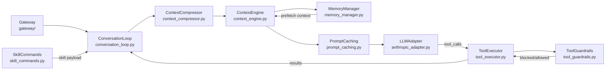
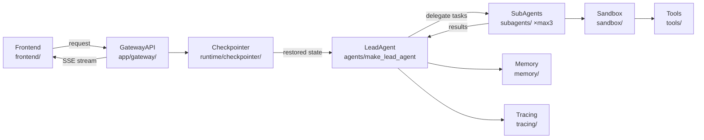

# Agentic AI Weekly Scan — 2026-05-30

## Executive Summary

- **Tuần này nổi bật nhất**: `UditAkhourii/adhd` giới thiệu pattern *parallel fan-out divergence + critic-prune convergence* được cụ thể hoá bằng typed TypeScript schemas — lần đầu tiên thấy Tree-of-Thought có pruning được đóng gói thành một npm skill có eval harness đo được.
- **Kiến trúc production trưởng thành nhất**: `NousResearch/hermes-agent` (173K stars) có vòng lặp ReAct với jittered exponential backoff, prompt-prefix caching cross-turn, tool guardrails 3 lớp, và memory provider abstraction tách biệt hoàn toàn — codebase production-grade thực sự.
- **Điều đáng lo nhất**: `bytedance/deer-flow` dùng LangGraph làm foundation nhưng thêm sandbox isolation (Docker/K8s), per-thread filesystem, và subagent delegation (max 3 concurrent) — tuy nhiên là thin layer trên LangChain, rủi ro coupling cao.

---

## Table of Contents

- [Repo 1 — UditAkhourii/adhd](#repo-1--uditakhouriiadhd)
- [Repo 2 — NousResearch/hermes-agent](#repo-2--nousresearchhermes-agent)
- [Repo 3 — bytedance/deer-flow](#repo-3--bytedancedeer-flow)

---

## Repo 1 — UditAkhourii/adhd

> https://github.com/UditAkhourii/adhd

### §1 — Quick Context

**One-line pitch**: Skill cho coding agents: fan out nhiều luồng tư duy độc lập song song, chấm điểm, cắt tỉa bẫy logic, đào sâu survivors.

**Tech stack**: TypeScript 69.7% / JS 30.3%; `@anthropic-ai/claude-agent-sdk ^0.1.0`, `p-limit ^5.0.0`, `zod ^3.23.0`; Node.js ≥18; không có persistent infra, all in-memory.

**Repo health**: 519 stars, 25 forks; created 2026-05-25, last pushed 2026-05-28; CI/tests có (`bench/run-evals.ts`, script `evals` và `evals:quick`); có `EVALS.md` và `CONTRIBUTING.md`.

---

### §2 — Architecture Deep-Dive

#### A. Component Inventory

| Component | File Path | Vai trò |
|-----------|-----------|---------|
| `FrameSelector` | `src/frames.ts` | Chọn N frame từ 15 cognitive frames có sẵn, đảm bảo diversity (biased toward code/design, luôn có ≥1 wild frame) |
| `DivergenceEngine` | `src/engine.ts` — `divergeBranch()` | Một LLM call per frame, isolate hoàn toàn, không cross-talk giữa các branches |
| `Critic/Scorer` | `src/engine.ts` — `scoreIdeas()` | Chấm điểm novelty (0.35), viability (0.40), fit (0.25); gắn cờ `trap` nếu idea có ẩn bẫy |
| `Clusterer` | `src/engine.ts` — `clusterIdeas()` | Nhóm ideas theo semantic angle (3–6 clusters), không theo keyword surface |
| `Deepener` | `src/engine.ts` — `deepenIdea()` | Đào sâu top-K ideas: sketch triển khai, rủi ro chính, sinh 3–5 child ideas |
| `LLMClient` | `src/llm.ts` — `callLLM()` | Wrap Claude Agent SDK, mỗi branch là một query() call độc lập, tools bị tắt hoàn toàn |
| `CLI` | `src/cli.ts` | Entry point dòng lệnh |
| `TypeSchemas` | `src/types.ts` | Định nghĩa `Idea`, `Score`, `Branch`, `RunResult`, `Cluster`, `DeepenedIdea`, `RunEvent` |

#### B. Control Flow — Pattern: Parallel Fan-out Tree-of-Thought với Prune

**Pattern**: Không phải ReAct (không có tool loop), không phải planner-executor. Đây là custom **parallel fan-out → critic convergence**, tương tự ToT nhưng có pruning explicit qua scoring + trap detection.

1. `selectFrames(N)` trong `src/frames.ts` chọn N frames (default 5) từ pool 15 frames với diversity constraint — code mode bias frames `code`/`design`, luôn thêm ≥1 frame tagged `wild`.
2. Tất cả frames chạy song song qua `divergeBranch()`: mỗi frame tạo một LLM call riêng với system prompt cấm evaluate — zero cross-talk giữa các branches. Concurrency được kiểm soát bởi `p-limit` (default 4).
3. Tất cả `Branch[]` thu về → `scoreIdeas()` chạy một LLM call critic duy nhất để chấm novelty/viability/fit và gắn `trap` flag nếu idea trông hay nhưng ẩn bẫy.
4. Ideas đã scored → `clusterIdeas()` nhóm theo underlying strategic angle (không phải keyword matching) thành 3–6 clusters.
5. Top-K ideas từ shortlist → `deepenIdea()` cho mỗi idea: sketch implementation, rủi ro chính, sinh child ideas (depth 1+). Trả về `RunResult` với `shortlist`, `nonObviousPick`, `traps`, `deepened`, `provocation`.

#### C. State & Data Flow

- **Message format**: Typed TypeScript schemas qua Zod — `Idea`, `Score`, `Branch`, `RunResult` đều strongly-typed. `parseJSON<T>()` trong `src/llm.ts` xử lý markdown fence extraction và locate JSON structure.
- **State storage**: Hoàn toàn in-memory, không có persistent storage. Mỗi run là stateless.
- **Context window management**: Không cần — mỗi LLM call là stateless one-shot, không có conversation history.

#### D. Tool / Capability Integration

- Tools bị **disable explicit** (`allowedTools: []`) trong `src/llm.ts` — design intentional: tools tạo convergence pressure không tương thích với divergent ideation.
- Model gọi LLM bằng pure text completion + JSON parsing, không dùng function-calling native.
- `parseJSON<T>()` xử lý output parsing, robust với markdown fences.

#### E. Memory Architecture

Không có — mỗi run hoàn toàn stateless. Không có short-term hay long-term memory.

#### F. Model Orchestration

- Tất cả roles (diverge, score, cluster, deepen) đều dùng cùng một model qua Claude Agent SDK với preset `"claude_code"`.
- `opts.model` cho phép override per-run.
- Parallelism qua `p-limit` (default concurrency 4), không có batching.

#### G. Observability & Eval

- `RunEvent` stream (`src/types.ts`): `frame:start`, `frame:done`, `score:done`, `cluster:done`, `deepen:start`, `deepen:done`, `warn` — caller nhận qua `opts.onEvent` callback.
- `bench/` directory với `run-evals.ts` (`--quick` mode có sẵn) — có `EVALS.md` documenting eval methodology và baseline numbers (breadth 1.9×, novelty 2.9×, trap detection 5.2×, actionability 1.5×).

#### H. Extension Points

- `opts.model` override model.
- `opts.onEvent` callback cho streaming progress.
- `opts.codeMode` bias frame selection.
- `opts.framesPerRun`, `ideasPerFrame`, `topK`, `concurrency` tunable.
- Thêm frame mới vào `src/frames.ts` để mở rộng cognitive frame pool.

---

### §3 — Architecture Diagram

```mermaid
flowchart LR
    CLI["CLI\nsrc/cli.ts"]
    FS["FrameSelector\nsrc/frames.ts"]
    DE["DivergenceEngine ×N\nsrc/engine.ts:divergeBranch"]
    LLM["LLMClient\nsrc/llm.ts"]
    SC["Critic/Scorer\nsrc/engine.ts:scoreIdeas"]
    CL["Clusterer\nsrc/engine.ts:clusterIdeas"]
    DP["Deepener\nsrc/engine.ts:deepenIdea"]
    RR["RunResult\nsrc/types.ts"]

    CLI --> FS
    FS -->|N frames| DE
    DE -->|parallel calls| LLM
    LLM -->|Branch[]| SC
    SC -->|scored ideas| CL
    CL -->|clusters| DP
    DP --> RR
```

---

### §4 — Verdict

**Điểm novel đáng học**: Cơ chế `selectFrames()` với diversity constraint (wild frame mandatory, code-mode bias) giải quyết một vấn đề thực tế của ToT: tất cả branches thường hội tụ về cùng một góc nhìn nếu không có structural diversity enforcement. Trap detection explicit qua `Score.trap` field — không phải heuristic, là explicit LLM judgment được typed.

**Red flags**: Toàn bộ pipeline là một chuỗi LLM calls mà không có caching — với N=5 frames, ideas=8, top=2, một run gọi 5 + 1 + 1 + 2 = 9 LLM calls. Chi phí tốc độ và tiền sẽ leo thang với N lớn hơn. `bench/` scripts tồn tại nhưng không rõ coverage của evals có systematic hay ad-hoc.

**Open questions**: `deepenIdea()` recursive nghĩa là depth có thể bùng nổ nếu child ideas tiếp tục được deepen — có budget cap không? Skill integration với 50+ agent platforms tự detect như thế nào — có test coverage không?

---

## Repo 2 — NousResearch/hermes-agent

> https://github.com/NousResearch/hermes-agent

### §1 — Quick Context

**One-line pitch**: Agent tự học từ kinh nghiệm, xây skills mới trong lúc dùng, nhớ user qua nhiều sessions, chạy được trên VPS $5.

**Tech stack**: Python 89.1%, TypeScript 8.1%; `openai==2.24.0` (provider-agnostic adapter pattern); `anthropic`, `jinja2`, `pydantic==2.13.4`, `croniter`; SQLite (session persistence), FTS5 (memory search); Docker/Modal/Daytona/SSH backends.

**Repo health**: ~173K stars; created 2025-07-22, last pushed 2026-05-30 (active hôm nay); có `tests/` directory, CI không xác định từ code; strict exact-pinning dependency policy.

---

### §2 — Architecture Deep-Dive

#### A. Component Inventory

| Component | File Path | Vai trò |
|-----------|-----------|---------|
| `ConversationLoop` | `agent/conversation_loop.py` — `run_conversation()` | Orchestrator chính: vòng lặp while với budget control, retry, tool dispatch |
| `ContextEngine` | `agent/context_engine.py` | Inject memory prefetch vào user message (không inject vào system prompt để preserve cache) |
| `ContextCompressor` | `agent/context_compressor.py` | Proactive compression khi conversation vượt ngưỡng; tracks token usage per call |
| `MemoryManager` | `agent/memory_manager.py` | Orchestrator memory: one built-in + one external provider maximum; two-phase prefetch |
| `ToolExecutor` | `agent/tool_executor.py` | Concurrent (ThreadPoolExecutor 8 workers) hoặc sequential execution với heartbeat polling |
| `ToolGuardrails` | `agent/tool_guardrails.py` | Pre-execution checkpoints: file mutation snapshots, destructive command flags, `before_call()` hook |
| `SkillCommands` | `agent/skill_commands.py` | Filesystem scan `~/.hermes/skills/`, /command syntax resolution, Jinja2 template expansion |
| `AnthropicAdapter` | `agent/anthropic_adapter.py` | Claude API adapter (cùng interface với Gemini, Bedrock, Codex adapters) |
| `PromptCaching` | `agent/prompt_caching.py` | Prefix cache markers cho Anthropic API, restored across turns |
| `Gateway` | `gateway/` | Multi-platform messaging: Telegram, Discord, Slack, WhatsApp, Signal |
| `RetryUtils` | `agent/retry_utils.py` | Jittered exponential backoff: 5s base, 120s cap |
| `ErrorClassifier` | `agent/error_classifier.py` | Phân loại lỗi: invalid JSON, empty content, truncation, incomplete scratchpad |

#### B. Control Flow — Pattern: ReAct-style với Jittered Retry + Budget Control

**Pattern**: ReAct (think→act→observe loop) với layer bổ sung: context compression trước loop, prompt prefix caching cross-turn, budget enforcement, và multi-type retry handling.

1. `run_conversation()` nhận user_message, gọi `_restore_or_build_system_prompt()` để load cached system prompt — tái dùng prefix cache cross-turn, tiết kiệm tokens.
2. `ContextCompressor` kiểm tra token count, compress conversation history nếu vượt ngưỡng model.
3. Vòng lặp while (`api_call_count < max_iterations AND budget.remaining > 0`): drain /steer commands → `ContextEngine` inject memory prefetch vào user message → sanitize messages (role alternation repair) → apply prompt caching markers → API call.
4. Xử lý response: extract text + tool_calls → validate (finish_reason, truncation check) → nếu truncated thì length continuation (max 3 retries).
5. `ToolExecutor` dispatch: concurrent path (ThreadPoolExecutor, 8 workers) hoặc sequential; mỗi tool qua `ToolGuardrails.before_call()` trước khi execute; results append vào messages.
6. Loop break khi `finish_reason=="stop"` hoặc không còn tool calls → `_persist_session()` lưu vào SQLite.

#### C. State & Data Flow

- **Message format**: `List[Dict]` chuẩn OpenAI-compatible — tất cả adapters đều convert về format này.
- **State storage**: SQLite cho session persistence. Memory context trong fenced blocks (`[[RECALLED MEMORY CONTEXT]]`).
- **Context window management**: Proactive compression qua `ContextCompressor` + Sliding: detect threshold → summarize → truncate. Memory prefetch inject vào user message (không vào system prompt để preserve Anthropic prefix cache).

#### D. Tool / Capability Integration

- 40+ tools trong `tools/` directory.
- `tool_search` unwrapping mechanism: khi model gọi `tool_search`, system "peel open" để reveal underlying tool và validate qua `_tool_search_scoped_names()` — session-level access control trước execution.
- Pre-execution checkpoints: snapshot working directory trước `write_file`/`patch`; flag destructive terminal commands.
- Guardrail 3 lớp: tool_search scope gates → plugin hooks (`get_pre_tool_call_block_message()`) → `tool_guardrails.before_call()`.
- MCP server integration qua `optional-mcps/`.

#### E. Memory Architecture

- `MemoryManager` (`agent/memory_manager.py`): orchestrator pattern — delegates đến providers, không tự implement storage.
- **Built-in provider**: luôn active (implementation trong `agent/memory_provider.py` abstract + concrete class).
- **External provider**: tối đa 1 — reject với warning nếu đăng ký provider thứ 2. Design explicit để tránh memory conflicts.
- **Two-phase retrieval**: `prefetch_all()` trước turn execution + `queue_prefetch_all()` schedule cho turn tiếp theo.
- **Short-term**: conversation history trong messages list (in-memory).
- **Long-term**: SQLite FTS5 full-text search trên session history; `on_pre_compress` hook cho providers contribute vào context compression summaries.
- Memory context inject vào user message (không system prompt) để preserve Anthropic prefix-cache.

#### F. Model Orchestration

- Adapters cho Anthropic, Gemini (native + CloudCode), AWS Bedrock, Codex Responses — tất cả expose cùng interface.
- 200+ models qua OpenRouter/Nous Portal mà không thay code.
- Strict exact-pin `pyproject.toml` (không dùng version ranges) — explicitly vì supply-chain attack prevention.
- Fallback chain: jittered exponential backoff (5s base, 120s cap) qua `retry_utils.py`.

#### G. Observability & Eval

- Log mỗi API call: latency, cache stats, cost estimates.
- `rate_limit_tracker.py` track rate limits per provider.
- `step_callback` hook cho gateway integration.
- Modal hibernation cho serverless deployment.
- Batch trajectory generation cho model training (documented trong README).

#### H. Extension Points

- Plugin system (`plugins/`) với `get_pre_tool_call_block_message()` hook.
- Custom memory provider qua abstract `MemoryProvider` interface.
- Skills qua filesystem scan `~/.hermes/skills/SKILL.md` — không cần restart.
- MCP servers qua `optional-mcps/`.
- Custom LLM provider qua adapter pattern.

---

### §3 — Architecture Diagram



---

### §4 — Verdict

**Điểm novel đáng học**: Memory injection vào user message (không system prompt) là insight quan trọng về Anthropic prefix-cache mechanics — nếu inject vào system prompt thì cache bị invalidate mỗi turn. `tool_search` unwrapping mechanism cho phép session-level access control granular hơn function-calling native. Exact-pin strategy trong `pyproject.toml` có rationale explicit cho supply-chain protection — pattern đáng học cho production agent deployment.

**Red flags**: ThreadPoolExecutor với 8 workers cho tool execution có thể race condition nếu tools share filesystem state — guardrails có snapshot mechanism nhưng không rõ atomic. External memory provider limit 1 là thiết kế đơn giản nhưng có thể là bottleneck khi cần hybrid retrieval. 173K stars và code quality có thể không đồng nhất — `optional-skills/` vs `skills/` boundary không rõ ràng.

**Open questions**: `on_pre_compress` hook có guarantee ordering với memory persistence không? Concurrent tool execution với heartbeat polling 5s có thể tạo ghost results nếu tool bị interrupt giữa chừng — cleanup mechanism là gì?

---

## Repo 3 — bytedance/deer-flow

> https://github.com/bytedance/deer-flow

### §1 — Quick Context

**One-line pitch**: SuperAgent harness của ByteDance: orchestrate sub-agents, sandbox, memory để xử lý tasks multi-hour trên LangGraph.

**Tech stack**: Python 73.4% + TypeScript 15.5%; LangGraph ≥1.0.6, LangChain ≥1.2.3, FastAPI ≥0.115.0; React (frontend); Docker/Kubernetes sandbox; Nginx reverse proxy; LangSmith/Langfuse observability; Python 3.12, Node.js 22.

**Repo health**: ~70K stars, 571 open issues, 360 PRs; created 2025-05-07, pushed 2026-05-29 (active); có `tests/`, có Makefile với nhiều targets; CI chưa xác định từ code.

---

### §2 — Architecture Deep-Dive

#### A. Component Inventory

| Component | File Path | Vai trò |
|-----------|-----------|---------|
| `LeadAgent` | `backend/packages/harness/deerflow/agents/` — `make_lead_agent()` in `deerflow.agents` | LangGraph state machine trung tâm, registered trong `backend/langgraph.json` |
| `Checkpointer` | `backend/packages/harness/deerflow/runtime/checkpointer/async_provider.py` | Async LangGraph checkpointer, khôi phục thread state cross-request |
| `GatewayAPI` | `backend/app/gateway/` | LangGraph API endpoint + REST API; auth handler tại `gateway/langgraph_auth.py` |
| `SubAgents` | `backend/packages/harness/deerflow/subagents/` | Child agents với isolated contexts; max 3 concurrent per turn |
| `Sandbox` | `backend/packages/harness/deerflow/sandbox/` | Per-thread isolated execution; local/Docker/K8s backends; virtual path translation |
| `Memory` | `backend/packages/harness/deerflow/memory/` | Long-term memory với LLM-powered extraction post-turn |
| `Persistence` | `backend/packages/harness/deerflow/persistence/` | Thread state persistence |
| `Tools` | `backend/packages/harness/deerflow/tools/` | Sandbox tools + Tavily/Jina/Firecrawl + MCP adapters |
| `Skills` | `backend/packages/harness/deerflow/skills/` | Modular skill units (markdown-defined workflows) |
| `Guardrails` | `backend/packages/harness/deerflow/guardrails/` | Safety constraints |
| `Tracing` | `backend/packages/harness/deerflow/tracing/` | LangSmith/Langfuse integration |
| `MCPIntegration` | `backend/packages/harness/deerflow/mcp/` | MCP server adapters với OAuth flows |
| `Frontend` | `frontend/` | React TypeScript UI với real-time streaming |

#### B. Control Flow — Pattern: State Machine (LangGraph) + Hierarchical Sub-agent Delegation

**Pattern**: State machine / graph (LangGraph) với single lead agent là supervisor, sub-agents là workers — hierarchical pattern được implement trên LangGraph state graph.

1. Request đến Nginx (port 2026) → route `/api/langgraph/*` đến GatewayAPI LangGraph endpoint hoặc `/api/*` đến REST API.
2. `Checkpointer` (async) restore thread state nếu existing thread — LangGraph persistence cross-request.
3. `make_lead_agent()` khởi tạo LangGraph state machine với 9 sequential middlewares: thread isolation, uploads handling, sandbox provisioning, summarization, memory extraction, v.v.
4. LeadAgent xử lý: dynamic model selection (vision/thinking support) → nếu task phức tạp thì delegate đến `SubAgents` (max 3 concurrent) với isolated contexts và scoped tools.
5. Sub-agents execute trong `Sandbox`: per-thread filesystem (uploads/, workspace/, outputs/) với virtual path translation; Docker/K8s container isolation nếu configured.
6. Results từ sub-agents trả về LeadAgent → memory extraction (LLM-powered) → response stream về Frontend qua Server-Sent Events.

#### C. State & Data Flow

- **Message format**: LangGraph State object — typed Python dataclass được managed bởi LangGraph checkpointer.
- **State storage**: Async checkpointer cho thread state (LangGraph built-in persistence); `Persistence` module cho custom data; per-thread filesystem isolation trong Sandbox.
- **Context window management**: 9 middleware trong lead_agent pipeline bao gồm summarization middleware — không rõ strategy cụ thể (sliding/summarize) từ code đã fetch.

#### D. Tool / Capability Integration

- Tool ecosystem qua `Tools` module: sandbox tools (command execution), community tools (Tavily, Jina, Firecrawl), MCP servers.
- MCP integration (`backend/packages/harness/deerflow/mcp/`) với OAuth flows — extend tool space mà không sửa core.
- Skills (`Skills` module): markdown-defined workflows, progressive loading.
- Sub-agent tool scoping: mỗi sub-agent có scoped tools riêng, isolated context.

#### E. Memory Architecture

- `Memory` module: LLM-powered extraction sau mỗi turn (automatic).
- Long-term memory persistent cross-sessions, local storage dưới quyền kiểm soát của user.
- Không xác định retrieval strategy cụ thể (vector/keyword/hybrid) từ code đã fetch.

#### F. Model Orchestration

- Dynamic model selection trong lead_agent (vision/thinking support per request).
- Multiple LLM providers qua OpenAI-compatible API — bao gồm local vLLM deployments.
- Sub-agents có thể dùng model khác với lead_agent — không rõ policy cụ thể từ code.

#### G. Observability & Eval

- `Tracing` module: LangSmith + Langfuse integration.
- LangGraph built-in persistence cho replay capability.
- LangGraph Studio cho visual graph debugging (implied bởi langgraph.json format).

#### H. Extension Points

- MCP servers với OAuth (`mcp/`) — plug-in custom tools.
- Skills system (markdown-defined).
- Custom LLM via OpenAI-compatible API endpoint.
- Messaging channels: Slack, Feishu, WeChat, Telegram, DingTalk, WeCom via `app/channels/`.

---

### §3 — Architecture Diagram



---

### §4 — Verdict

**Điểm novel đáng học**: Virtual path translation trong Sandbox module — sub-agents operate trên virtual paths, actual filesystem paths được resolve bởi sandbox layer, cho phép Docker/K8s backend swap mà không thay agent code. 9-middleware pipeline trong lead_agent là clean architecture separation: mỗi concern (auth, upload, sandbox, summarize, memory) là một independent middleware layer.

**Red flags**: LangGraph coupling là rủi ro lớn nhất — LangGraph 1.0 có breaking changes history, 571 open issues cho thấy maintenance pressure. Warning explicit trong documentation: "local trusted deployment only", "high-privilege capabilities including system command execution" — không phải production-ready cho multi-tenant. Memory extraction LLM-powered sau mỗi turn tăng latency và cost không rõ ràng.

**Open questions**: Sub-agent max 3 concurrent limit đến từ đâu — LangGraph limitation hay design decision? 9-middleware pipeline có thứ tự cố định không — nếu có thì middleware nào có thể bị disable? Memory extraction LLM call dùng model nào và có cache được không?
