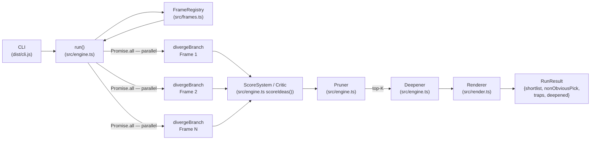
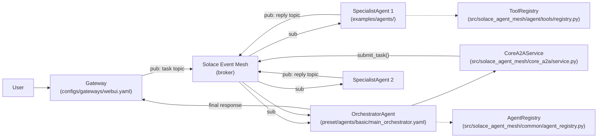
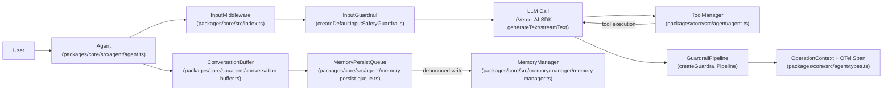

# Weekly Agentic AI Scan — 2026-05-31

## Executive Summary

- **Tuần này nổi bật về cơ chế cách ly context**: `adhd` chứng minh rằng anchoring bias trong LLM là vấn đề kiến trúc, không phải prompting — giải pháp là spawn các process hoàn toàn độc lập thay vì branching từ cùng một context.
- **Event-driven multi-agent đang trở thành production pattern**: `solace-agent-mesh` dùng Solace event broker (pub/sub) thay vì gRPC/REST trực tiếp giữa agents, mang lại decoupling và khả năng replay tự nhiên.
- **Observability mới chỉ bắt đầu được xử lý nghiêm túc**: `VoltAgent` là framework hiếm hoi tích hợp OpenTelemetry từ đầu; `nv-tlabs/Gamma-World` là research release — không có production observability nhưng có architectural novelty cao nhất tuần này (zero-shot multi-agent generalization).

## Table of Contents

- [1. UditAkhourii/adhd](#1-uditakhouriiadhd)
- [2. SolaceLabs/solace-agent-mesh](#2-solacelabssolace-agent-mesh)
- [3. VoltAgent/voltagent](#3-voltagentvoltagent)
- [4. nv-tlabs/Gamma-World](#4-nv-tlabsgamma-world)

---

## 1. UditAkhourii/adhd

**Repo:** https://github.com/UditAkhourii/adhd

### §1 — Quick Context

**One-line pitch:** Framework giải quyết anchoring bias bằng cách spawn N agent độc lập với cognitive frame khác nhau, sau đó dùng critic riêng để prune và deepening.

**Tech stack:** TypeScript/Node.js ≥18, `@anthropic-ai/claude-agent-sdk ^0.1.0`, `p-limit ^5.0.0`, `zod ^3.23.0`. Không dùng LangChain/CrewAI. Model mặc định: Claude qua claude-agent-sdk.

**Repo health:** 613 stars, created 2026-05-25 (6 ngày tuổi). 28 forks, 15 open issues. Có `has_discussions: true`, `has_pages: true` (GitHub Pages docs). Chưa có CI rõ ràng trong metadata nhưng có eval/benchmark scripts.

---

### §2 — Architecture Deep-Dive

#### A. Component Inventory

- **FrameRegistry** (`src/frames.ts`) — Danh sách 15 cognitive frames (hardware engineer, regulator, 10-year-old, competitor, biology, logistics, game design, markets, inversion, $0/1hr, infinite/10yr, remove-assumption, speedrunner, ant-colony, on-call-3am). Function `selectFrames()` chọn subset ngẫu nhiên, đảm bảo ít nhất một "wildcard" để divergence "stay weird".

- **DivergenceEngine** (`src/engine.ts`) — Core loop: với mỗi frame được chọn, gọi `divergeBranch()` dưới `DIVERGE_SYSTEM` prompt. Mỗi branch là một isolated LLM call — không shared context, không cross-talk. Output: JSON array các `Idea` object. Concurrency control qua `p-limit(concurrency)`, default 4.

- **Critic / ScoreSystem** (`src/engine.ts`, function `scoreIdeas()`) — LLM call riêng biệt với `SCORE_SYSTEM` prompt. Chấm điểm mỗi idea theo 3 trục: novelty (0–10), viability (0–10), fit (0–10). Weighting: `novelty * 0.35 + viability * 0.4 + fit * 0.25`. Phát hiện conceptual traps riêng (ideas bị đánh dấu hidden cost / unscalable).

- **Pruner** (`src/engine.ts`) — Ba bước: (1) rank by weighted score, (2) shortlist top 2–4 viable candidates, (3) non-obvious pick = candidate có novelty cao nhất trong shortlist (`novelty + viability * 0.5`).

- **Deepener** (`src/engine.ts`) — LLM call thứ 4: nhận top-K candidates, trả về `DeepenedIdea` với sketch + child ideas + risk assessment. Parallelized qua `p-limit`.

- **Renderer** (`src/render.ts`) — Format terminal output: brief summary → wide set clustered → convergence (shortlist + ★ non-obvious pick + ⚠ traps) → deepened sketches. Output type: `RunResult { problem, branches, shortlist, nonObviousPick, traps, deepened, provocation }`.

- **CLI** (`dist/cli.js`) — Entrypoint command-line. Argument parsing (`--frames`, `--ideas`, `--top`), pipes to `run()`.

#### B. Control Flow — Generator-Critic Pattern

Pattern: **Generator-Critic** (biến thể của Planner-Executor nhưng với explicit isolation trong phase 1).

1. User gọi `run({ problem, framesPerRun, topK })` trong `src/engine.ts`.
2. `selectFrames()` chọn N frames từ registry, ưu tiên ít nhất 1 wildcard frame.
3. `Promise.all(frames.map(f => limit(() => divergeBranch(problem, f))))` — N LLM calls song song, mỗi call hoàn toàn độc lập về context.
4. `scoreIdeas(allIdeas)` — 1 LLM critic call duy nhất nhận tất cả ideas, trả về scores + trap flags.
5. Pruner ranking → shortlist → nonObviousPick selection (deterministic, không LLM).
6. `Promise.all(shortlist.map(idea => limit(() => deepenIdea(idea))))` — parallel deepening của top-K.

#### C. State & Data Flow

- Toàn bộ state in-memory trong single `run()` call — không persistence.
- Message format: typed Zod schemas (`Idea`, `Branch`, `DeepenedIdea`, `RunResult`, `Score`).
- Context window: không có management — mỗi LLM call nhận fresh context. Diverge calls nhận `(problem + frame_prompt)` chỉ. Critic nhận tất cả ideas concatenated.

#### D. Tool / Capability Integration

- Không dùng tool-calling. Toàn bộ logic là pure LLM text generation với JSON output parsing (`parseJSON()`).
- Model được gọi qua `@anthropic-ai/claude-agent-sdk` — native Anthropic SDK.

#### E. Memory Architecture

Không có memory architecture — stateless per invocation.

#### F. Model Orchestration

- Tất cả calls dùng cùng model (configurable, default Claude qua claude-agent-sdk).
- Divergence, scoring, clustering, deepening là 4 distinct LLM call types với opposing system prompts.
- Không có model fallback hay batching.

#### G. Observability & Eval

- Eval scripts trong repo (`npm run eval`, `npm run eval:quick`): so sánh ADHD vs single-shot baseline trên 6 engineering problems.
- Metrics: Breadth, Novelty, Trap Detection, Actionability, Builder Usefulness (0–10 scale).
- Không có runtime tracing/logging infrastructure.

#### H. Extension Points

- `selectFrames(n, frames?)` cho phép inject custom frame set.
- `RunOptions` có `model`, `concurrency`, `framesPerRun`, `ideasPerFrame`, `topK` — fully configurable.
- `FRAMES` constant exported — user có thể thêm custom cognitive frames.

---

### §3 — Architecture Diagram

---

### §4 — Verdict

**Điểm novel:** Isolation là structural, không phải rhetorical — mỗi branch là một LLM call độc lập hoàn toàn, không share context. Đây là cách duy nhất thực sự phá anchoring trong multi-step reasoning (CoT và ToT đều không làm được vì vẫn chạy trên cùng context). Trap detection rate tăng 5.2× so với baseline là kết quả đáng chú ý.

**Red flags:** (1) Không có CI/CD, (2) Tác giả solo với 6 ngày repo tuổi — sustainability risk. (3) Eval là self-reported với "independent skeptical-engineer" không rõ method. (4) Không có memory → không dùng được trong agentic loop dài.

**Open questions:** Isolation có thực sự hoạt động khi problem description itself là anchor? Frame selection có ảnh hưởng lớn đến output quality không — có adversarial frame nào? Chi phí token per run với N=5 frames × K ideas là bao nhiêu so với single-shot?

---

## 2. SolaceLabs/solace-agent-mesh

**Repo:** https://github.com/SolaceLabs/solace-agent-mesh

### §1 — Quick Context

**One-line pitch:** Framework multi-agent event-driven dùng Solace event broker làm transport layer, thay thế direct agent-to-agent RPC bằng async pub/sub với A2A protocol.

**Tech stack:** Python 3.10–3.13, Google Agent Development Kit (ADK) cho agent runtime, Solace PubSub+ broker, A2A Protocol. Frontend config portal: TypeScript/React. Config: YAML.

**Repo health:** 4,928 stars, created 2025-01-10, pushed 2026-05-27. Extensive docs site, config portal (TypeScript/React), evaluation framework.

---

### §2 — Architecture Deep-Dive

#### A. Component Inventory

- **OrchestratorAgent** (`preset/agents/basic/main_orchestrator.yaml` + `cli/commands/init_cmd/orchestrator_step.py`) — Central coordinator: nhận task từ Gateway, phân tích và delegate sang specialist agents hoặc orchestrate multi-agent workflow. Config-driven via YAML. Instruction: "If the task can be fully addressed by a single peer agent, delegate. Otherwise, break into subtasks."

- **SpecialistAgents** (`examples/agents/orchestrator_example.yaml`, `docs/docs/documentation/components/`) — Domain-specific agents (Database, MultiModal, v.v.) với declared capabilities. Register vào AgentRegistry khi khởi động.

- **Gateway** (`configs/gateways/webui.yaml`, `docs/docs/documentation/components/`) — Flexible entry point: REST API, Web UI, Slack, custom. Nhận user request, forward qua Solace mesh đến OrchestratorAgent.

- **CoreA2AService** (`src/solace_agent_mesh/core_a2a/service.py`) — Reusable service layer encapsulating A2A protocol logic. `submit_task()` và `submit_streaming_task()`. Routing qua topic-based system: `get_agent_request_topic(namespace, agent_name)`. Message format: serialized A2AMessage với task-ID prefix, user properties (clientId, userId, replyTo, a2aStatusTopic).

- **AgentRegistry** (`src/solace_agent_mesh/common/agent_registry.py`) — Stores và manages AgentCards với health tracking (TTL expiration). `add_or_update_agent()`, discovery callbacks `on_agent_added` / `on_agent_removed`. Dynamic agent discovery via `process_discovery_message()`.

- **ToolRegistry** (`src/solace_agent_mesh/agent/tools/registry.py`) — Singleton `_ToolRegistry`. Register tools by name, retrieve by name hoặc category. `BuiltinTool` với `name` và `category` attributes.

- **PlatformServiceApp** (`src/solace_agent_mesh/services/platform/app.py`) — Wires broker connection, component lifecycle, config loading (via Solace AI Connector).

#### B. Control Flow — Event-Driven Hierarchical

Pattern: **Event-Driven Hierarchical** (OrchestratorAgent là supervisor; messaging qua Solace broker thay vì direct call).

1. User gửi request qua **Gateway** (REST/Slack/WebUI).
2. Gateway publish message lên Solace topic. **OrchestratorAgent** subscribe.
3. OrchestratorAgent phân tích task: single-agent delegation vs multi-agent plan.
4. `CoreA2AService.submit_task()` constructs A2AMessage + routes tới target specialist topic.
5. **SpecialistAgent** nhận task, execute, publish response về reply topic.
6. OrchestratorAgent aggregate responses, publish final result back qua Gateway.

#### C. State & Data Flow

- Asynchronous pub/sub — không shared state giữa agents.
- Message format: A2AMessage (typed, có task-ID, clientId, replyTo).
- Streaming: `submit_streaming_task()` thêm `a2aStatusTopic` cho intermediate updates.
- State storage: AgentRegistry in-memory với TTL; không có explicit persistence layer.

#### D. Tool / Capability Integration

- Tools registered vào `ToolRegistry` singleton.
- Agent runtime (Google ADK) handle tool execution.
- Builtin tools: SQL, JQ, visualization (từ docs).
- Validation: không rõ từ code hiện có.

#### E. Memory Architecture

Không xác định từ code — docs đề cập file management và artifact handling nhưng không có explicit memory module trong source files được index.

#### F. Model Orchestration

- Google ADK xử lý LLM interaction — model-agnostic (bất kỳ major provider).
- Không có explicit multi-model routing rõ ràng trong code được đọc.

#### G. Observability & Eval

- `docs/docs/documentation/developing/evaluations.md`: có eval framework với `target_agent`, `expected_tools`, `wait_time`.
- Log files configurable per agent (`orchestrator-agent.log`).
- Không có OpenTelemetry evidence trong code được đọc.

#### H. Extension Points

- Custom agents via YAML config + Plugin system.
- Gateway interface pluggable.
- Multiple OrchestratorAgents cho different domains/workflows.

---

### §3 — Architecture Diagram

---

### §4 — Verdict

**Điểm novel:** Dùng enterprise event broker (Solace PubSub+) làm transport thay vì HTTP/gRPC giữa agents — đây là lựa chọn kiến trúc có tính production-grade thực sự: tự nhiên có message durability, replay, dead-letter queue, và decoupling hoàn toàn. Agent discovery qua TTL-based AgentRegistry là pattern sạch hơn hard-coded topology.

**Red flags:** (1) Phụ thuộc Solace PubSub+ — không phải free infrastructure, có vendor lock-in risk. (2) Google ADK là dependency lớn — framework nesting (framework within framework). (3) AgentCard structure dùng `a2a.types` nhưng không expose source để verify schema. (4) Không có explicit context window management.

**Open questions:** Cost model khi Solace broker là trung gian? Latency overhead so với direct agent call? Cơ chế nào đảm bảo OrchestratorAgent không trở thành bottleneck trong high-throughput scenarios?

---

## 3. VoltAgent/voltagent

**Repo:** https://github.com/VoltAgent/voltagent

### §1 — Quick Context

**One-line pitch:** TypeScript agent framework ưu tiên observability với OpenTelemetry span tích hợp sẵn, MemoryPersistQueue debouncing, và guardrail pipeline cho production safety.

**Tech stack:** TypeScript/Node.js, Vercel AI SDK, OpenTelemetry, Zod. Multi-provider: OpenAI, Anthropic, Google. Packages: monorepo (`packages/core`, `@voltagent/internal`, etc.).

**Repo health:** 9,259 stars, created 2025-04-16, pushed 2026-05-29. Có test suite (`step-persistence.spec.ts`, `memory-persistence.integration.spec.ts`). Monorepo cấu trúc rõ ràng.

---

### §2 — Architecture Deep-Dive

#### A. Component Inventory

- **Agent** (`packages/core/src/agent/agent.ts`) — Core entity. Constructor nhận `{ name, id, instructions, model, maxSteps, tools, toolkits, memory }`. Expose `generateText()` và `streamText()`. Mỗi operation chạy trong `OperationContext` với conversationId, userId, AbortController, OpenTelemetry span.

- **ToolManager** (`packages/core/src/agent/agent.ts`, referenced via import) — Manages static tools và dynamic toolkits. Hỗ trợ embedding-based search cho large tool pools (tool routing).

- **ConversationBuffer** (`packages/core/src/agent/conversation-buffer.ts`) — Short-term in-memory buffer cho messages trong một operation.

- **MemoryPersistQueue** (`packages/core/src/agent/memory-persist-queue.ts`) — Deferred persistence với debouncing. Nhận UIMessage từ ConversationBuffer, queue writes đến MemoryManager. Configurable `debounceMs`.

- **MemoryManager** (`packages/core/src/memory/manager/memory-manager.ts`) — Persistent memory backend. Hỗ trợ multiple adapters. API: `saveMessage()`, `getMessages()`.

- **GuardrailPipeline** (`packages/core/src/agent/agent.ts`, via `createGuardrailPipeline()`) — Real-time output sanitization stream. Preset guardrails: `createSensitiveNumberGuardrail`, `createEmailRedactorGuardrail`, `createProfanityGuardrail`, `createPromptInjectionGuardrail`.

- **InputMiddleware / OutputMiddleware** (`packages/core/src/index.ts` exports) — Pre/post processing hooks quanh LLM calls.

- **OperationContext** (`packages/core/src/agent/types.ts`) — Per-operation container: conversationId, userId, AbortController, OpenTelemetry span, systemContext map (lưu ConversationBuffer, MemoryPersistQueue keyed by `BUFFER_CONTEXT_KEY`, `QUEUE_CONTEXT_KEY`).

#### B. Control Flow — Supervisor-Worker (Multi-Agent)

Pattern: **Hierarchical Supervisor-Worker** (supervisor agent delegates đến specialist sub-agents).

1. User gọi `agent.generateText({ messages, conversationId })`.
2. Agent tạo `OperationContext` với root OpenTelemetry span.
3. InputMiddleware và InputGuardrail chạy tuần tự trước LLM call.
4. `generateText()` (Vercel AI SDK) gọi model với messages + registered tools. Tool calls được auto-executed trong `onStepFinish` callback.
5. OutputGuardrail pipeline chạy real-time trên stream.
6. `MemoryPersistQueue` debounce-writes messages từ `ConversationBuffer` vào `MemoryManager`.
7. OpenTelemetry span closed, usage metrics emitted.

Với supervisor pattern: supervisor agent có sub-agents là tools — khi supervisor gọi "delegate to specialist" tool, specialist agent's `generateText()` được invoke recursively.

#### C. State & Data Flow

- Short-term: `ConversationBuffer` in-memory per operation.
- Long-term: `MemoryManager` với pluggable adapter (SQLite, vector DB, custom).
- Message format: `UIMessage` (Vercel AI SDK type) — typed, includes role/content/metadata.
- Context window: không có explicit summarization — relies on message truncation per provider limits.
- `OperationContext.systemContext` Map lưu per-operation runtime state (buffer + queue refs).

#### D. Tool / Capability Integration

- Tools registered qua `ToolManager` — Zod-typed schemas.
- LLM calls via Vercel AI SDK's native tool-calling (provider-agnostic function calling).
- Tool routing: embedding-based search cho large tool pools (`toolPoolManager`).
- MCP server integration hỗ trợ.

#### E. Memory Architecture

- **Short-term**: `ConversationBuffer` (`packages/core/src/agent/conversation-buffer.ts`) — in-memory, per operation.
- **Long-term**: `MemoryManager` + `MemoryPersistQueue` (`packages/core/src/agent/memory-persist-queue.ts`) — debounced async write để tránh blocking.
- Không có explicit summarization/compaction strategy trong code được đọc.

#### F. Model Orchestration

- Multi-provider via Vercel AI SDK abstraction.
- Model fallback: implemented trong `generateText()` — retry with alternative model on failure.
- Không có explicit planner-uses-large-model / executor-uses-small-model pattern.

#### G. Observability & Eval

- **OpenTelemetry** tích hợp native: root span per operation, nested LLM spans, guardrail spans.
- Usage metrics extracted và emitted per step.
- VoltOps Console: execution traces, performance dashboards, memory inspection, log aggregation.
- Eval suite: test files `step-persistence.spec.ts`, `memory-persistence.integration.spec.ts` — unit + integration.

#### H. Extension Points

- Custom Memory adapters.
- Custom guardrails via `createInputGuardrail()` / `createOutputGuardrail()`.
- Custom middleware via `createInputMiddleware()` / `createOutputMiddleware()`.
- Pluggable toolkits.

---

### §3 — Architecture Diagram

---

### §4 — Verdict

**Điểm novel:** `MemoryPersistQueue` với debouncing là pattern thực dụng để tránh write storm khi conversation dài — hiếm thấy được implement explicitly trong OSS frameworks. OpenTelemetry từ đầu (không phải add-on) là dấu hiệu production-grade engineering nghiêm túc. Tool routing qua embedding search cho large tool pools là bước tiến so với simple name lookup.

**Red flags:** (1) Context window management không có explicit strategy — silently truncates khi overflow. (2) VoltOps Console là hosted service — observability phụ thuộc vendor. (3) Supervisor-worker pattern không có explicit back-pressure hay rate limiting rõ ràng trong code được đọc. (4) Model fallback logic không có circuit breaker.

**Open questions:** Embedding-based tool routing được thực hiện thế nào — model gọi hay vector DB? Debounce window mặc định bao nhiêu ms và có configurable per-conversation không? Memory adapter nào được recommend cho production?

---

## 4. nv-tlabs/Gamma-World

**Repo:** https://github.com/nv-tlabs/Gamma-World

### §1 — Quick Context

**One-line pitch:** NVIDIA research release — generative multi-agent world model (DiT-based) cho phép N agent độc lập tương tác trong môi trường chung, generalize zero-shot từ 2 lên 4 players.

**Tech stack:** Python (không confirm version — requirements.txt 404), PyTorch (implied by DiT/diffusion), CUDA (24 FPS real-time inference requires GPU). Không có LangChain/agent framework — đây là ML model, không phải orchestration framework.

**Repo health:** 438 stars, created 2026-05-25. NVIDIA research lab (nv-tlabs). 2 forks, 1 open issue. Apache License 2.0. arXiv:2605.28816. **Không có Python files indexed** bởi GitHub code search — repo có thể chưa release full code (chỉ inference demo hoặc config).

---

### §2 — Architecture Deep-Dive

> **Lưu ý quan trọng:** Python source files không được GitHub index (code search `language:python` trả về 0 kết quả). Toàn bộ evidence section này từ `README.md`. Các component dưới đây là kiến trúc từ paper description, không phải class paths thực tế.

#### A. Component Inventory

Evidence từ `README.md` (arXiv:2605.28816):

- **SimplexRotaryAgentEncoder** (`README.md` — implementation path không xác định từ code) — Parameter-free extension của 3D Rotary Position Embeddings (RoPE). Gán mỗi agent một vertex trên regular simplex trong rotary angle space. Duy trì permutation-equivalence trong khi mỗi agent có distinct rotary phase. Không cần learned per-slot encodings.

- **SparseHubAttention** (`README.md` — implementation path không xác định từ code) — Cross-agent communication mechanism dùng learnable hub tokens làm intermediaries. Reduces attention complexity từ O(N²) đến O(N). Hub tokens aggregate thông tin từ N agents rồi broadcast lại.

- **MultiAgentDiT** (`README.md` — implementation path không xác định từ code) — Multi-agent Diffusion Transformer. Nhận synchronized observations và actions của N agents, generate future world-state rollouts. Block-causal inference với KV caching cho 24 FPS streaming.

#### B. Control Flow — State Machine / Diffusion Rollout

Pattern: **Causal Diffusion Rollout** (không phải agent orchestration framework truyền thống).

1. N agents mỗi agent có observation (current frame) và action (input).
2. **SimplexRotaryAgentEncoder** gán unique rotary phase cho mỗi agent — không shared encoding.
3. Encoded observations + actions đưa vào **MultiAgentDiT** forward pass.
4. **SparseHubAttention** cho phép cross-agent information exchange qua hub tokens.
5. DiT denoising process generate next world-state frame cho tất cả agents.
6. KV cache từ previous steps enable causal streaming tại 24 FPS.

#### C. State & Data Flow

- State: video frames (pixel-space hoặc latent-space) + action vectors per agent.
- Cross-agent communication: implicit qua SparseHubAttention hub tokens — không có explicit message passing.
- Temporal state: block-causal KV cache.

#### D–H. (Các dimension còn lại)

Không xác định từ code — Python source chưa public hoặc chưa được index.

---

### §3 — Architecture Diagram

**Insufficient evidence for diagram** — Python implementation files không available (0 results từ code search). Evidence chỉ từ README.md mô tả paper; không đủ file path evidence cho ≥3 components theo rule §3.

---

### §4 — Verdict

**Điểm novel:** SimplexRotaryAgentEncoder là contribution độc đáo: dùng geometric property của simplex (equidistant vertices) để assign agent identity trong rotary angle space — không cần learnable parameters, scale tự nhiên, và permutation-equivalent. SparseHubAttention giảm cross-agent attention từ O(N²) xuống O(N) — scalability thực sự cho nhiều agents. Zero-shot generalization từ 2→4 players không cần retrain là kết quả ấn tượng.

**Red flags:** (1) Source code Python chưa public (0 files indexed) — chỉ có README/paper. Không verify được implementation. (2) Domain khác với LLM agent orchestration — đây là video world model cho game/robotics, không phải coding/planning agent. (3) Phụ thuộc GPU nặng — inference tại 24 FPS. (4) Research release early-stage — không có production considerations.

**Open questions:** Full source code release khi nào? SimplexRoPE có thể áp dụng cho LLM multi-agent identity encoding không (assign unique identity cho mỗi agent trong shared attention space)? SparseHubAttention có tổng quát hóa được sang agent-to-agent message passing trong LLM orchestration không?

---

*Generated: 2026-05-31 | Branch: claude/serene-mccarthy-TSaX1*
