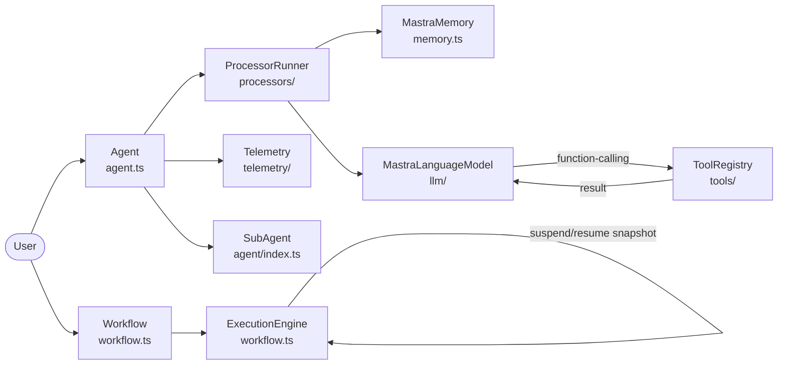
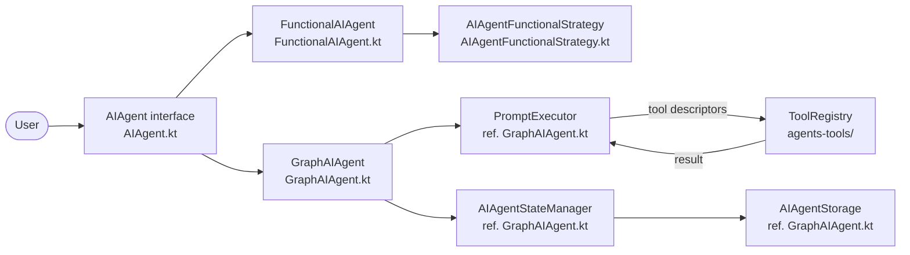
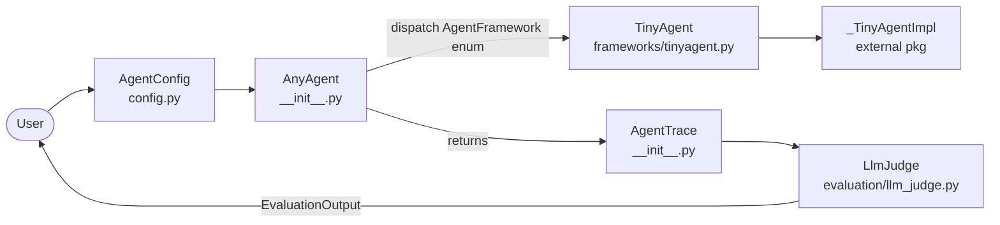
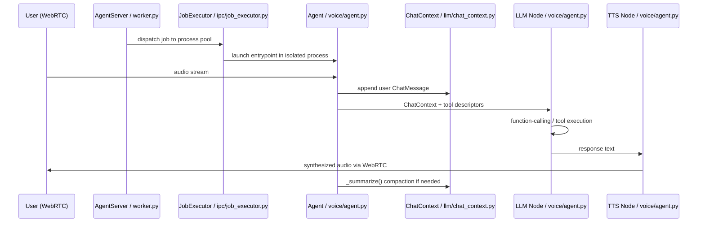

# Agentic AI Weekly Scan — 2026-06-01

## Executive Summary

- **Xu hướng hội tụ:** Hai frameworks nổi bật tuần này (mastra, koog) đều chuyển từ pure ReAct loop sang **graph-based execution với explicit state machine** — một hướng đi khác với LangGraph nhưng với typed-schema safety ở mức ngôn ngữ (TypeScript Zod, Kotlin sealed class).
- **Production engineering standout:** `livekit/agents` có architecture đáng học nhất về mặt production — process pool với CPU-based load balancing, semantic turn detection dùng transformer (không phải silence VAD), và ChatContext compaction tránh "summary of summaries" qua metadata tracking.
- **Cảnh báo:** `mozilla-ai/any-agent` đang soft-deprecated (core đã migrate sang `mozilla-ai-tinyagent`) — research value nằm ở eval methodology LlmJudge pattern, không phải framework code.

## Table of Contents

1. [mastra-ai/mastra](#1-mastra-aimastra) — TypeScript full-stack agent + workflow framework
2. [JetBrains/koog](#2-jetbrainskoog) — JVM/Kotlin agent framework với graph execution và Spring integration
3. [mozilla-ai/any-agent](#3-mozilla-aiany-agent) — Cross-framework abstraction + LLM-as-judge eval
4. [livekit/agents](#4-livekitagents) — Realtime voice AI với production process orchestration

---

## 1. mastra-ai/mastra

**Repo:** https://github.com/mastra-ai/mastra · Pushed: 2026-06-01

### §1 — Quick Context

**Pitch:** Framework TypeScript production-grade tích hợp agent, workflow graph, memory và evals trong một stack nhất quán, từ prototype đến deployment.

**Tech stack:** TypeScript, Hono v4 (HTTP server), Zod v3/v4 (schema validation), Vercel AI SDK v5/v6, MCP SDK v1.29, OpenTelemetry, PostHog v5, `p-retry`, `croner`, `ws`

**Repo health:** 24,609 stars, monorepo (`packages/core` v1.38.0-alpha.4), pushed 2026-06-01, CI exists, 40+ LLM provider support

### §2 — Architecture Deep-Dive

#### A. Component inventory

- `Agent` (`packages/core/src/agent/agent.ts`) — core AI agent class, extends `MastraBase`, quản lý tools/memory/processors/channels/voice; supports single hoặc array model với fallback
- `Workflow` (`packages/core/src/workflows/workflow.ts`) — step-based graph execution engine với `.then()/.branch()/.parallel()/.dowhile()/.foreach()`; extends `MastraBase` và cũng implement `Step` interface, cho phép workflow lồng nhau
- `MastraMemory` (`packages/core/src/memory/memory.ts`) — abstract base class dual-storage: thread messages (`MastraCompositeStore`) + optional vector DB; `MAX_CONTEXT_TOKENS`, `lastMessages` filter, `estimateTokens()` dùng heuristic 1.3×word count
- `ProcessorRunner` (`packages/core/src/processors/`) — orchestrates input/output/error processor pipeline; memory contributes processors tự động, deduplication đảm bảo không có duplicate instances
- `ToolRegistry` (`packages/core/src/tools/`) — tool conversion pipeline qua `convertTools()`; `normalizeToolPayloadTransformPolicy()` cho payload transformation
- `MastraLanguageModel` (`packages/core/src/llm/`) — model routing với `ModelFallbacks`, per-model retry counts, dynamic resolution per-request; `MastraLegacyLanguageModel` cho backward-compat
- `ExecutionEngine` (`packages/core/src/workflows/workflow.ts`, class `DefaultExecutionEngine`) — processes `ExecutionGraph`, manages state transitions, hỗ trợ time-travel debugging (step re-execution với modified state)
- `SubAgent` (`packages/core/src/agent/index.ts`) — composable sub-agent pattern; `isAgentCompatible()` cho validation; `deriveSubAgentBackgroundConfig()` cho async delegation
- Telemetry module (`packages/core/src/telemetry/`) — OpenTelemetry spans qua `getOrCreateSpan()`, W3C trace context propagation; client OTLP payloads flushed từ browser back tới server

#### B. Control flow

Mastra có hai paradigm song song:

**Workflow — State machine / graph pattern:**
1. User định nghĩa steps, chain bằng `.then()/.branch()/.parallel()`, gọi `.commit()` để finalize `ExecutionGraph`
2. `workflow.execute(inputData)` kích hoạt `ExecutionEngine`
3. Mỗi Step nhận `{ inputData, state, getStepResult(), getInitData(), requestContext }`; output validate bằng Zod schema trước khi pass tới step tiếp
4. `.branch()`: condition functions evaluate → nhánh được chọn; output `undefined` nếu condition fail
5. `.parallel()`: tất cả steps nhận identical input, chạy đồng thời, trả về `{ stepId: output }` map
6. Suspend: step gọi `await suspend(payload, { resumeLabel })` → snapshot lưu storage → workflow trả pending; `.resume(data)` restore từ snapshot, tiếp tục từ exact điểm treo

**Agent — implicit ReAct-style loop:**
1. User gọi `agent.stream()` hoặc `agent.generate()`
2. `ProcessorRunner` chạy input processors (memory recall → workspace → channels → user-defined)
3. `MastraLanguageModel` gọi LLM với tool descriptors qua AI SDK native function-calling
4. Model response: text output → output processors; tool call → execute → observation appended → loop lại tới LLM
5. Output processors persist to memory, telemetry spans recorded

#### C. State & data flow

- Message format giữa steps: typed TypeScript via Zod schemas — schema incompatibility fail tại type-check và runtime
- State storage: custom adapters (SQLite, Vercel KV, PostgreSQL) cho workflow snapshots và memory threads
- Context window: `lastMessages` filter (default 10 messages) + `SemanticRecall` vector search; **không có summarization/compaction** — confirmed từ `memory.ts` source

#### D. Tool integration

- Static: `tools` record trong `AgentConfig` constructor
- Dynamic: resolver function `(context) => tools` invoked per-request
- Native function-calling qua Vercel AI SDK v5/v6; browser tools auto-inject at runtime
- Zod schema validation + `normalizeToolPayloadTransformPolicy()` trước execution

#### E. Memory architecture

- Short-term: thread messages trong `MastraCompositeStore`, filter theo `lastMessages` count
- Long-term: vector DB qua `SemanticRecall` processor; probe embedder dimensions để generate dimension-aware index names
- Retrieval: hybrid (recency filter + semantic similarity)
- Không có summarization — chỉ truncation theo message count

#### F. Model orchestration

- Model array với priority fallback: first enabled model used; disabled entries skipped
- Per-model retry counts qua `p-retry`; dynamic resolution per-request
- 40+ providers: Anthropic v5/v6 (dual), OpenAI v5/v6 (dual), Google, Groq, Mistral, DeepSeek, Cerebras, Perplexity, XAI, Together AI

#### G. Observability & eval

- OpenTelemetry spans, W3C trace context; client-side OTLP flushed back từ browser tools
- PostHog analytics integration
- `evals/` module tại `packages/core/src/evals/`

#### H. Extension points

- Custom processors trong `ProcessorRunner` pipeline
- Dynamic tool resolvers per-request context
- Custom storage adapters
- `channels` và `integrations` plugin interfaces

### §3 — Architecture Diagram

### §4 — Verdict

**Novel:** Suspend/resume workflow với persistent snapshot là pattern production-grade hiếm có — resume từ exact điểm treo, không cần replay toàn bộ. Dual-paradigm (explicit state machine workflow + implicit ReAct agent) trong cùng stack cho phép mix use case trong một deployment.

**Red flags:** Memory không có summarization — long conversations sẽ bị truncated abruptly sau `lastMessages=10`. Dual AI SDK version support (v5+v6) cho mỗi provider tạo dependency complexity đáng kể. `DurableAgent` không export để tránh circular dependency — pattern này chưa documented rõ.

**Open questions:** `DurableAgent` khác `SubAgent` thế nào về fault tolerance? `ProcessorRunner` order có ảnh hưởng đến memory recall accuracy không? Time-travel debugging trong `ExecutionEngine` hoạt động như thế nào — có replay side effects không?

---

## 2. JetBrains/koog

**Repo:** https://github.com/JetBrains/koog · Pushed: 2026-06-01

### §1 — Quick Context

**Pitch:** Framework Kotlin-first cho AI agents trên JVM với graph execution, fault tolerance, và Spring Boot integration enterprise-ready; target cả mobile và WebAssembly qua Kotlin Multiplatform.

**Tech stack:** Kotlin 2.1 + Kotlin Multiplatform (JVM/JS/WASM/Android/iOS), kotlinx.coroutines 1.10.2, kotlinx.serialization 1.8.1, Spring Boot, Ktor, OpenTelemetry, Langfuse, W&B Weave, JDK 17+

**Repo health:** 4,280 stars, JetBrains-backed, pushed 2026-06-01, Apache 2.0, Gradle multi-module, 97.2% Kotlin

### §2 — Architecture Deep-Dive

#### A. Component inventory

- `AIAgent<Input, Output>` (`agents/agents-core/src/commonMain/kotlin/ai/koog/agents/core/agent/AIAgent.kt`) — primary interface với sealed `State<Output>` hierarchy: `NotStarted / Starting / Running(rootContext) / Finished(result) / Failed(exception)`; `suspend fun run(input): Output`
- `GraphAIAgent` (`agents/agents-core/src/commonMain/kotlin/ai/koog/agents/core/agent/GraphAIAgent.kt`) — graph-based execution qua `AIAgentGraphPipeline`; `AIAgentStateManager` và `AIAgentStorage` referenced; `prepareContext()` initialize fresh state per run
- `FunctionalAIAgent` (`agents/agents-core/src/commonMain/kotlin/ai/koog/agents/core/agent/FunctionalAIAgent.kt`) — delegates execution tới `AIAgentFunctionalStrategy`
- `AIAgentFunctionalStrategy` (`agents/agents-core/src/commonMain/kotlin/ai/koog/agents/core/agent/AIAgentFunctionalStrategy.kt`) — higher-order suspend function wrapper: `suspend AIAgentFunctionalContext.(TInput) -> TOutput`; custom loop logic được encapsulate trong coroutine context
- `AIAgentSimpleStrategies` (`agents/agents-core/src/commonMain/kotlin/ai/koog/agents/core/agent/AIAgentSimpleStrategies.kt`) — predefined strategies cho common patterns
- `ToolRegistry` (`agents/agents-tools/`) — tool registration, descriptor generation: `tools.map { it.descriptor }` exposed tới LLM
- `PromptExecutor` (referenced trong `GraphAIAgent.kt`) — LLM communication abstraction layer; multi-provider support
- `AIAgentStateManager` (referenced trong `GraphAIAgent.kt`) — state tracking trong execution pipeline
- `AIAgentStorage` (referenced trong `GraphAIAgent.kt`) — persistent state storage cho fault tolerance và restore
- RAG module (`rag/`) — retrieval augmented generation với vector search
- Embeddings module (`embeddings/`) — vector embeddings và ranked document storage

#### B. Control flow

Koog có hai strategy khác nhau:

**GraphAIAgent — Graph / state machine pattern:**
1. `agent.run(input)` gọi; state transitions `NotStarted → Starting → Running`
2. `GraphAIAgent` initialize `AIAgentGraphPipeline` với registered features
3. Pipeline execute stages qua `onAgentEnvironmentTransforming()` — sequential feature transformation của execution environment
4. `PromptExecutor` gửi message tới LLM với tool descriptors từ `ToolRegistry`
5. LLM response parsed: nếu tool call → `ToolRegistry` execute → kết quả append vào history → loop lại step 4
6. Termination condition met → state `Running → Finished(result)`; exception → `Failed(exception)`

**FunctionalAIAgent — ReAct-style via custom suspend coroutine:**
1. Developer viết custom suspend function `(Input) -> Output` với loop logic tùy ý
2. `AIAgentFunctionalStrategy` wrap function trong `AIAgentFunctionalContext`
3. Kotlin coroutines cho async execution và parallel tool calls

#### C. State & data flow

- Sealed `State<Output>`: compile-time enforcement — `result()` chỉ accessible khi `state == Finished`, `IllegalStateException` otherwise
- Typed generics `AIAgent<Input, Output>`: type safety tại Kotlin compile time
- State persistence: `AIAgentStateManager` (in-memory) + `AIAgentStorage` (persistent) cho fault recovery
- History compression: token-aware compaction via agents-features module (enabled per-feature)

#### D. Tool integration

- `ToolRegistry` passed tại construction time; `toolRegistry.tools.map { it.descriptor }` là interface tới LLM
- LLM function-calling native; MCP tool integration qua `agents/agents-mcp/` module
- `agents/agents-mcp-server/` expose agent as MCP server

#### E. Memory architecture

- Shared memory across conversations via `AIAgentStorage`
- History compression engine: token-aware (implementation trong `agents/agents-features/`)
- Vector embeddings + ranked document storage qua `rag/` và `embeddings/` modules
- Retrieval: không xác định strategy cụ thể từ code đã đọc

#### F. Model orchestration

- Multi-provider via `PromptExecutor`: OpenAI, Anthropic, Google, DeepSeek, OpenRouter, Ollama, Bedrock
- Provider switching không mất conversation history
- kotlinx.coroutines cho async execution; streaming API hỗ trợ parallel tool execution

#### G. Observability

- OpenTelemetry exporters built-in
- Integrations: Weights & Biases Weave, Langfuse
- Custom hooks qua `agents/agents-features/` module

#### H. Extension points

- Spring Boot starter (`koog-spring-boot-starter/`) cho dependency injection integration
- Ktor integration (`koog-ktor/`) cho web server deployment
- Custom features qua `agents/agents-features/` extension points
- Custom loop logic qua `AIAgentFunctionalStrategy` pattern

### §3 — Architecture Diagram

### §4 — Verdict

**Novel:** Kotlin sealed `State<Output>` hierarchy là type-safe agent lifecycle pattern không thấy ở Python frameworks — compiler enforce `result()` chỉ callable sau `Finished`, loại bỏ runtime null checks. Kotlin Multiplatform (JVM/JS/WASM/Android) trong một codebase là differentiator thực sự cho enterprise mobile+backend.

**Red flags:** `AIAgentGraphPipeline` là core execution engine nhưng implementation details rất ít documentation — không rõ graph traversal strategy (DFS? event-driven?). `FunctionalAIAgent` custom suspend function pattern linh hoạt nhưng khó debug. History compression không rõ là enabled by default hay opt-in.

**Open questions:** `AIAgentGraphPipeline` traverse nodes theo thứ tự nào? Fault recovery restore state trước hay sau tool call execution? `agents-mcp-server` vs `agents-mcp` — một cái expose agent as server, cái kia consume MCP tools, hay có gì khác?

---

## 3. mozilla-ai/any-agent

**Repo:** https://github.com/mozilla-ai/any-agent · Pushed: 2026-06-01

### §1 — Quick Context

**Pitch:** Unified Python interface để run và so sánh 7 agent frameworks qua cùng một API, với eval methodology LLM-as-judge cho cross-framework benchmarking.

**Tech stack:** Python 3.11+, Pydantic (config + output schemas), MCP, A2A protocol (optional install), 7 frameworks: TinyAgent, Google ADK, LangChain, LlamaIndex, OpenAI Agents SDK, Smolagents, Agno

**Repo health:** 1,171 stars, Mozilla AI lab, pushed 2026-06-01, **đang soft-deprecation** — core đã migrate sang `mozilla-ai-tinyagent` package riêng

### §2 — Architecture Deep-Dive

#### A. Component inventory

- `AnyAgent` (`src/any_agent/__init__.py`) — primary abstraction class: factory creation + unified execution interface; exports `AgentCancel`, `AgentRunError` exception types
- `AgentConfig` (`src/any_agent/config.py`) — Pydantic model với: `model_id` (str), `name` (str, default "any_agent"), `instructions` (str|None), `tools` (list[Tool]), `callbacks` (list[Callback]), `output_type` (type[BaseModel]|None), `agent_type` (Callable|None), `model_type` (Callable|None), `any_llm_args`, `model_args`, `agent_args`
- `AgentFramework` (`src/any_agent/config.py`) — enum: `GOOGLE, LANGCHAIN, LLAMA_INDEX, OPENAI, AGNO, SMOLAGENTS, TINYAGENT`
- `AgentTrace` (`src/any_agent/__init__.py`) — unified execution trace capture across frameworks
- `LlmJudge` (`src/any_agent/evaluation/llm_judge.py`) — LLM-as-judge evaluator: 2-message conversation (system "objective and thorough, err critical" + user context+question) → `EvaluationOutput` (Pydantic BaseModel)
- `AgentJudge` (`src/any_agent/evaluation/agent_judge.py`) — agent-based evaluator (alternative approach)
- `TinyAgent` (`src/any_agent/frameworks/tinyagent.py`) — wraps `_TinyAgentImpl` từ `mozilla-ai-tinyagent` package; `clients` dict là `ToolExecutor` registry; `_load_agent()` sync tools; `_run_async()` delegates execution
- `serve_a2a_async` / `A2AServingConfig` (`src/any_agent/serving/__init__.py`) — A2A protocol serving: expose agent as async service; optional dependency (`pip install any-agent[a2a]`)

#### B. Control flow — Adapter pattern

1. User tạo `AgentConfig(model_id="...", tools=[...])` với optional `framework=AgentFramework.TINYAGENT`
2. `AnyAgent.load(config)` factory dispatch theo `AgentFramework` enum → instantiate wrapper class
3. `TinyAgent._load_agent()`: sync tools và MCP clients tới inner `_TinyAgentImpl`
4. `agent.run(prompt)` delegates tới `TinyAgent._run_async(prompt)` → inner impl executes loop
5. Framework-specific loop chạy (varies: ReAct, function-calling, etc.)
6. Returns `AgentTrace` với full execution trace (LLM calls + tool calls)
7. Optional evaluation: `LlmJudge.evaluate(trace, question)` → structured `EvaluationOutput`

#### C. State & data flow

- `AgentConfig`: Pydantic model (type-safe config), framework-agnostic
- `AgentTrace`: unified trace format — normalizes tool call formats across frameworks
- Stateless per-run: không có persistent state giữa các calls
- `output_type`: Pydantic BaseModel subclass cho structured outputs
- `ServingConfig`: `host`, `port`, `endpoint`, `log_level`, `version` cho A2A serving

#### D. Tool integration

- `tools` list trong `AgentConfig`; built-in: web search, webpage visitation
- `TinyAgent.clients` dict: `ToolExecutor` instances per tool name
- MCP tool support; `agent_args` dict cho framework-specific tool configuration
- `update_output_type_async()` cho configuring structured output schemas at runtime

#### E. Memory — không xác định từ code

Stateless per-run design; không có persistent memory API trong public interface.

#### F. Model orchestration

- Single model per run (`model_id` string)
- `model_type` callable override cho framework-specific model classes
- `any_llm_args` cho LLM provider initialization
- `model_args` cho generation params (temperature, etc.)

#### G. Observability & eval

- `AgentTrace`: captures LLM calls và tool invocations qua unified trace
- `LlmJudge`: system prompt guideline "err on side of being more critical rather than lenient"; returns structured `EvaluationOutput` (không phải numeric score)
- `AgentJudge`: alternative evaluation via agent execution
- A2A serving cho multi-agent evaluation scenarios

#### H. Extension points

- `agent_type` Callable: override framework-specific agent class
- `callbacks` list: custom execution hooks
- `serve_a2a_async`: expose agent as A2A service
- Custom `ToolExecutor` via `TinyAgent.clients` dict

### §3 — Architecture Diagram

### §4 — Verdict

**Novel:** `LlmJudge` pattern với "err critical" bias và structured `EvaluationOutput` (không phải pass/fail) là eval methodology solid, reproducible, và có thể aggregate across runs. Cross-framework `AgentTrace` normalization cho phép apple-to-apple comparison giữa 7 frameworks trong cùng test harness — research value cao dù framework đang deprecated.

**Red flags:** Soft-deprecated: new development nên dùng `mozilla-ai-tinyagent` trực tiếp. Stateless design không suitable cho long-running agentic workflows. Chỉ có `TinyAgent` wrapper đã đọc được source; 6 framework adapters còn lại có thể có behavior khác nhau chưa documented.

**Open questions:** `AgentTrace` normalization có mất information không khi compare frameworks với khác nhau về tool call format (e.g., OpenAI parallel tool calls vs sequential)? `AgentJudge` dùng LLM hay rule-based evaluation? `mozilla-ai-tinyagent` package có architecture như thế nào sau khi tách ra?

---

## 4. livekit/agents

**Repo:** https://github.com/livekit/agents · Pushed: 2026-06-01

### §1 — Quick Context

**Pitch:** Production Python framework cho realtime voice AI với WebRTC media transport, multi-process job scheduling, semantic turn detection, và ChatContext compaction strategy.

**Tech stack:** Python (asyncio), LiveKit WebRTC server, plugin ecosystem (Deepgram STT, OpenAI/Google LLM, Cartesia TTS), Silero VAD, Prometheus, `uv`, pytest, ruff

**Repo health:** 10,757 stars, pushed 2026-06-01, monorepo (`livekit-agents/` + `livekit-plugins/`), extensive CI, commercial backing (LiveKit)

### §2 — Architecture Deep-Dive

#### A. Component inventory

- `Agent` (`livekit-agents/livekit/agents/voice/agent.py`) — STT/LLM/TTS pipeline definition; tool discovery qua `find_function_tools()` trên subclass methods decorated `@function_tool`; `_activity` (current execution context), `_chat_ctx` (read-only conversation history)
- `AgentSession` (referenced trong `voice/agent.py`) — container managing user interaction; holds `turn_detection` config; agent's `_chat_ctx` is "read-only property returns wrapped version"
- `AgentServer` (`livekit-agents/livekit/agents/worker.py`) — job scheduling, process pool management, load balancing; `request_fnc` callback cho job filtering; `_reserved_slots` chống over-acceptance
- `JobExecutor` Protocol (`livekit-agents/livekit/agents/ipc/job_executor.py`) — process/thread isolation interface: `start()`, `join()`, `initialize()`, `aclose()`, properties `started/status/running_job`
- `ChatContext` (`livekit-agents/livekit/agents/llm/chat_context.py`) — conversation history với `_summarize()` compaction; `find_insertion_index()` chronological ordering; `merge()` deduplication; `_ReadOnlyChatContext` wrapper
- STT Node (within `voice/agent.py`) — speech-to-text pipeline stage; VAD wrapping cho non-streaming providers
- LLM Node (within `voice/agent.py`) — language model stage; yields text + `FunctionCall` items; `ModelSettings.tool_choice` control
- TTS Node (within `voice/agent.py`) — text synthesis; sentence tokenization cho non-streaming TTS
- VAD (`livekit-agents/livekit/agents/vad.py`) — voice activity detection; optional wrap cho STT node
- Plugin system (`livekit-agents/livekit/agents/plugin.py`) — provider integrations registry

#### B. Control flow — Event-driven realtime pipeline + Process pool

**Job dispatch:**
1. `AgentServer` kết nối tới LiveKit server qua WebSocket với exponential backoff (16 attempts)
2. Server gửi `AvailabilityRequest` → worker evaluate CPU load qua `_DefaultLoadCalc` (moving average 2.5s windows)
3. Nếu load ≤ threshold và `request_fnc` accept: worker gửi accept → `JobAssignment` received (7.5s timeout)
4. `RunningJobInfo` created → dispatch tới process pool qua `JobExecutor`; idle warm processes reduce cold-start

**Voice pipeline (per-job process):**
1. User audio stream vào; `VAD` detect speech onset
2. STT Node transcribe audio → text
3. `ChatContext` appended với user `ChatMessage`
4. LLM Node nhận full `ChatContext` + tool descriptors → generate response
5. Nếu tool call: execute → `FunctionCallOutput` appended → loop lại step 4
6. Response text → TTS Node synthesize → stream audio tới user qua WebRTC
7. Semantic turn detection (transformer model) xác định khi user "done with their turn" — giảm false interruptions

#### C. State & data flow

- `ChatItem` types: `ChatMessage` (text/image/audio), `FunctionCall`, `FunctionCallOutput`, `AgentHandoff`, `AgentConfigUpdate`
- Multi-modal content: `ImageContent`, `AudioContent` trong messages
- **Summarization-based compaction** (`ChatContext._summarize()`): preserve last N conversation turns, compress older history via LLM; metadata tracking tránh "summary of summaries"
- Chronological ordering qua `created_at` timestamps; `merge()` deduplication by ID

#### D. Tool integration

- Decorator `@function_tool` trên Agent subclass methods → `find_function_tools()` auto-discover
- Dynamic update: `update_tools()` tại runtime
- LLM native function-calling; `ModelSettings.tool_choice` control invocation behavior

#### E. Memory architecture

- Short-term: `ChatContext` in-memory per session
- Compaction: `_summarize()` — keep last N turns, LLM summarize older content; metadata prevent re-summarization của existing summary
- Không có long-term persistent memory trong core — plugin-based extension

#### F. Model orchestration

- Plugin architecture: swap STT/LLM/TTS providers independently (`livekit-plugins/`)
- Process pool: `idle_process_warmup` cho pre-warmed processes; memory hard limits (500 MB default) với process termination
- `_DefaultLoadCalc`: CPU moving average 2.5s windows; worker rejects jobs khi load > threshold
- Drain mode: prevent new job acceptance, complete existing work cho rolling updates

#### G. Observability

- Prometheus metrics với multiprocess mode support; `/worker` HTTP load monitoring endpoint
- Health check HTTP endpoint với inference process availability và LiveKit connectivity checks
- Evals module (`livekit-agents/livekit/agents/evals/`)
- Logging qua `livekit-agents/livekit/agents/log.py`

#### H. Extension points

- Plugin system (`plugin.py`) cho custom STT/LLM/TTS providers
- Subclass `Agent`, override STT/LLM/TTS node methods
- `request_fnc` callback cho job routing/filtering
- Custom VAD implementation

### §3 — Architecture Diagram

### §4 — Verdict

**Novel:** Semantic turn detection bằng transformer (không phải naive silence VAD) là kỹ thuật giảm false interruptions đáng học cho voice agents. `ChatContext._summarize()` với metadata tracking để tránh "summary of summaries" là elegant solution cho long-running voice sessions. Process pool với CPU-based load balancing, memory hard limits, và drain mode là production engineering ít agent framework nào implement đầy đủ.

**Red flags:** Kiến trúc tối ưu cho voice/realtime — text-only agents phải chịu overhead không cần thiết. `_summarize()` gọi LLM thêm → latency + cost hidden. Phụ thuộc LiveKit server infrastructure (không self-contained).

**Open questions:** Semantic turn detection transformer là model gì — custom trained hay off-the-shelf? `_summarize()` dùng provider LLM nào (same as main LLM hay separate)? `AgentHandoff` trong ChatContext — multi-agent handoff hoạt động như thế nào qua WebRTC?
