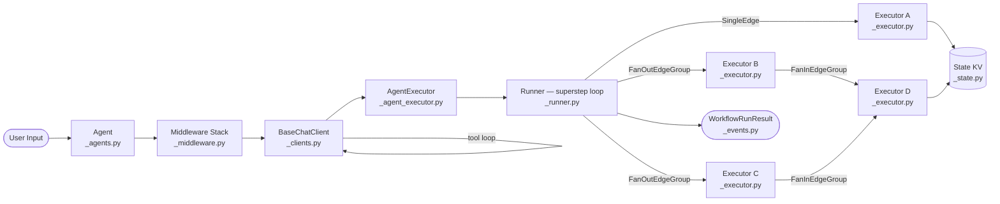
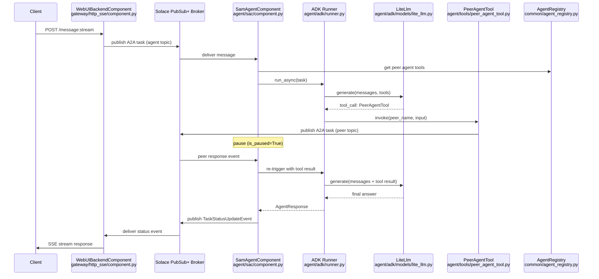
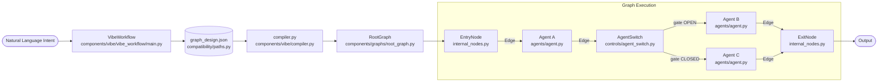
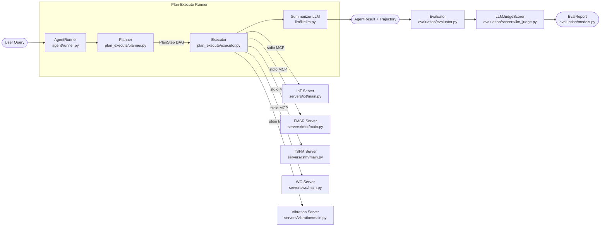

# Agentic AI Weekly Scan — 2026-06-02

## Executive Summary

- **Tuần này nổi bật 3 hướng kiến trúc khác biệt**: graph execution engine (Pregel-superstep), event-driven messaging mesh, và NL→graph compilation — tất cả đều đang active production-grade development, không chỉ research prototype.
- **microsoft/agent-framework** là repo đáng theo dõi nhất tuần này: ADR documentation chi tiết, OTel built-in, dual Python/.NET, và Pregel workflow engine với checkpoint/fan-in/fan-out là mức kỹ thuật cao hơn hầu hết framework hiện có.
- **IBM/AssetOpsBench** có eval methodology nghiêm túc nhất (LLM-as-judge 6-criteria + trajectory persistence + re-scoring), nhưng codebase thực tế flat hơn nhiều so với marketing — không có MetaAgent/AgentHive trong code.

## Table of Contents

- [Repo 1 — microsoft/agent-framework](#repo-1--microsoftagent-framework)
- [Repo 2 — SolaceLabs/solace-agent-mesh](#repo-2--solacelabssolace-agent-mesh)
- [Repo 3 — BUPT-GAMMA/MASFactory](#repo-3--bupt-gammamasfactory)
- [Repo 4 — IBM/AssetOpsBench](#repo-4--ibmassetopsbench)

---

## Repo 1 — microsoft/agent-framework

**URL**: https://github.com/microsoft/agent-framework  
**Last pushed**: 2026-06-02

### §1 — Quick Context

Framework Python/.NET của Microsoft để build, orchestrate, và deploy AI agents và multi-agent workflows production-grade.

**Tech stack core**: Python ≥3.10 (primary) + C# .NET (parallel track), `opentelemetry-api`, `pydantic`, `mcp` (optional); provider packages optional: `openai`, `azure-ai-projects`, `anthropic`, `boto3`, `ollama`, `mem0ai`, `a2a-sdk`. Monorepo với ~30+ packages độc lập versioned.

**Repo health**: ★10,956, 1,822 forks, CI gồm 27 workflows (ruff/pyright linting, CodeQL security scan, release automation, sample validation, coverage check). Có 26+ ADRs trong `docs/decisions/`.

---

### §2 — Architecture Deep-Dive

#### A. Component Inventory

- `Agent` (`python/packages/core/agent_framework/_agents.py`) — entry point người dùng; wraps client + history + middleware + memory.
- `BaseChatClient` (`python/packages/core/agent_framework/_clients.py`) — provider adapter protocol; abstract `get_response()` / `get_streaming_response()`.
- `FunctionTool` / `@tool` (`python/packages/core/agent_framework/_tools.py`) — wraps Python callable, JSON Schema inference từ type annotations, OTel histogram cho latency.
- `MCPStdioTool`, `MCPStreamableHTTPTool`, `MCPWebsocketTool` (`python/packages/core/agent_framework/_mcp.py`) — ba transport variant cho MCP protocol.
- `AgentMiddleware` / `ChatMiddleware` / `FunctionMiddleware` (`python/packages/core/agent_framework/_middleware.py`) — interceptor pipeline.
- `Workflow` (`python/packages/core/agent_framework/_workflows/_workflow.py`) — Pregel-style directed graph execution engine.
- `WorkflowBuilder` (`python/packages/core/agent_framework/_workflows/_workflow_builder.py`) — fluent API xây dựng graph.
- `Runner` (`python/packages/core/agent_framework/_workflows/_runner.py`) — superstep loop driver.
- `Executor` / `AgentExecutor` (`python/packages/core/agent_framework/_workflows/_executor.py`, `_agent_executor.py`) — workflow node; `AgentExecutor` wraps `Agent` thành graph node.
- `SingleEdge` / `FanOutEdgeGroup` / `FanInEdgeGroup` (`python/packages/core/agent_framework/_workflows/_edge.py`) — message routing primitives.
- `State` (`python/packages/core/agent_framework/_workflows/_state.py`) — shared KV store trong một workflow run.
- `InMemoryCheckpointStorage` (`python/packages/core/agent_framework/_workflows/_checkpoint.py`) — per-superstep snapshot.
- `HistoryProvider` / `InMemoryHistoryProvider` / `FileHistoryProvider` (`python/packages/core/agent_framework/_sessions.py`) — conversation history backends.
- `SlidingWindowStrategy` / `SummarizationStrategy` (`python/packages/core/agent_framework/_compaction.py`) — context window management.
- `ContextProvider` / `MemoryContextProvider` (`python/packages/core/agent_framework/_sessions.py`, `_harness/_memory.py`) — long-term memory injection.
- `GroupChatOrchestrator` (`python/packages/orchestrations/agent_framework_orchestrations/_group_chat.py`) — centralized orchestrator pattern.
- OTel setup (`python/packages/core/agent_framework/observability.py`) — telemetry configuration helper.

#### B. Control Flow — Pregel Superstep Graph

Pattern: **State machine / graph (Pregel superstep message-passing)** — không phải ReAct. Agents có tool loop nội bộ, nhưng multi-agent coordination là graph/message-passing.

1. User gọi `Agent.run(messages)` → `_agents.py`
2. `Agent` delegate xuống middleware stack (`AgentMiddleware` → `ChatMiddleware` → `FunctionInvocationLayer`)
3. `BaseChatClient.get_response()` thực thi tool loop (LLM → tool calls → tool results → LLM) nội bộ
4. Trong multi-agent mode: `WorkflowBuilder` đã xây một directed graph; `Runner` drive supersteps — mỗi step deliver queued messages tới target `Executor` nodes
5. `FanOutEdgeGroup` gửi message tới nhiều executors song song; `FanInEdgeGroup` là barrier chờ tất cả
6. Workflow dừng khi không còn message mới; `WorkflowRunResult` trả về aggregated events

Các orchestration patterns có sẵn trong `agent-framework-orchestrations`: `SequentialBuilder`, `ConcurrentBuilder`, `HandoffBuilder` (decentralized peer routing), `GroupChatBuilder`, `MagenticBuilder` (Magentic-One pattern).

#### C. State & Data Flow

Message format: `WorkflowEvent` typed objects — không phải raw dict. Shared state trong run: `State` KV store injected vào `WorkflowContext`. History qua runs: `HistoryProvider` (InMemory / FileJSONL / server-side nếu provider dùng `store=True`).

Context window compaction: 4 strategies (`SlidingWindow`, `ContextWindow`, `SelectiveToolCall`, `Summarization`) — chọn qua config.

#### D. Tool / Capability Integration

3 lớp: `@tool` decorator (Python callable → JSON Schema), `MCPTool` family (stdio/HTTP/WebSocket), `Skill`/`SkillsProvider` (experimental multi-source routing). `FunctionInvocationContext` middleware cho phép intercept trước/sau tool execution.

#### E. Memory Architecture

Short-term: `HistoryProvider` (InMemory hoặc FileJSONL). Long-term: `ContextProvider` hook pattern — `before_run()` inject memories vào system context, `after_run()` persist. `Mem0ContextProvider` (`python/packages/mem0/agent_framework_mem0/_context_provider.py`) tích hợp mem0.ai. MEMORY.md-backed local memory qua harness mode.

#### F. Model Orchestration

Provider-agnostic `BaseChatClient` protocol. Mỗi `AgentExecutor` trong workflow có thể dùng model khác nhau → heterogeneous model mixing. GAIA và TAU2 benchmark harnesses trong `python/packages/lab/`.

#### G. Observability & Eval

OTel baked into core (không optional): tool latency histogram, trace context propagation qua executor boundaries, workflow event taxonomy. `WorkflowViz` (`_workflows/_viz.py`) export Graphviz/Mermaid. Per-target coverage thresholds enforced trong CI.

#### H. Extension Points

Subclass `BaseChatClient` (new provider), `@tool`/`MCPTool` (new capability), `ContextProvider` (memory), `Executor` (workflow node), `WorkflowBuilder` (orchestration), YAML (declarative), `DurableTaskWorker` (long-running), `A2AAgent` (external agent proxy).

---

### §3 — Architecture Diagram

---

### §4 — Verdict

**Điểm novel**: Workflow engine là Pregel superstep model — rare trong agent framework, thường chỉ thấy ở distributed computing. `FanIn`/`FanOut` edge groups + per-superstep checkpoint + OTel built-in là production-grade engineering thực sự. 26+ ADRs là rare trong open-source agent projects — design rationale có thể learn được nhiều.

**Red flags**: Monorepo với ~30 packages độc lập có thể gây dependency hell. `_harness` và `SkillsProvider` vẫn là `ExperimentalFeature`. C# track theo sau Python — có thể bị lag về features.

**Open questions**: Declarative YAML workflow compiler hoạt động như thế nào so với WorkflowBuilder fluent API? Benchmark trong `lab/` package (GAIA, TAU2) được run trong CI không? Semantic kernel integration được document ở đâu?

---

## Repo 2 — SolaceLabs/solace-agent-mesh

**URL**: https://github.com/SolaceLabs/solace-agent-mesh  
**Last pushed**: 2026-06-02

### §1 — Quick Context

Event-driven multi-agent framework dùng Solace PubSub+ broker làm event bus trung tâm, không có direct agent-to-agent calls.

**Tech stack core**: Python ≥3.10, TypeScript (UI); **Google ADK** (Agent Development Kit) làm agent execution engine, **LiteLLM** làm LLM abstraction, `solace-ai-connector` (SAC) làm messaging layer, FastAPI + Uvicorn (HTTP/SSE gateway), SQLAlchemy + Alembic (session persistence), BM25 (RAG), `a2a` SDK (Google's Agent-to-Agent spec). Infra: Solace PubSub+ broker (self-hosted hoặc Solace Cloud).

**Repo health**: ★4,668, 254 forks, 12+ CI workflows (ci.yaml, test-and-sonarqube.yml, release-please.yaml, publish.yaml, Docker build/push). SonarQube integration. Release v1.26.1 ngày 2026-05-26.

---

### §2 — Architecture Deep-Dive

#### A. Component Inventory

- `WebUIBackendComponent` (`src/solace_agent_mesh/gateway/http_sse/component.py`) — FastAPI gateway; authenticates users (OIDC/session), publishes A2A tasks tới Solace.
- `SamAgentComponent` (`src/solace_agent_mesh/agent/sac/component.py`) — core agent runtime; subscribe Solace topic, dispatch task execution.
- `SamAgentApp` (`src/solace_agent_mesh/agent/sac/app.py`) — config management + topic generation.
- `AppLlmAgent` (`src/solace_agent_mesh/agent/adk/app_llm_agent.py`) — extends ADK `LlmAgent`; thêm callback hooks.
- ADK `runner.py` (`src/solace_agent_mesh/agent/adk/runner.py`) — ADK runner + compaction + streaming.
- `CoreA2AService` (`src/solace_agent_mesh/core_a2a/service.py`) — A2A protocol logic decoupled from SAC.
- `AgentRegistry` (`src/solace_agent_mesh/common/agent_registry.py`) — TTL-based peer discovery registry.
- `PeerAgentTool` (`src/solace_agent_mesh/agent/tools/peer_agent_tool.py`) — fire-and-forget A2A delegation tới peer agents.
- `WorkflowExecutorComponent` / `DAGExecutor` (`src/solace_agent_mesh/workflow/component.py`, `dag_executor.py`) — deterministic DAG workflow engine.
- `LiteLlm` (`src/solace_agent_mesh/agent/adk/models/lite_llm.py`) — LiteLLM backend wrapper cho ADK.
- `DynamicModelProvider` (`src/solace_agent_mesh/agent/adk/models/dynamic_model_provider.py`) — broker-based runtime model config.
- `EmbedResolvingMCPToolset` (`src/solace_agent_mesh/agent/adk/embed_resolving_mcp_toolset.py`) — MCP server toolset integration.
- `SessionCompaction` (`src/solace_agent_mesh/agent/adk/session_compaction.py`) — context-window summarization khi token count vượt ngưỡng.
- `AgentMonitor` / `ToolMonitor` (`src/solace_agent_mesh/common/observability.py`) — typed wrappers cho SAC observability.
- `MiddlewareRegistry` (`src/solace_agent_mesh/common/middleware/registry.py`) — enterprise extension point cho auth/config/RBAC.
- `patch_adk.py` (`src/solace_agent_mesh/agent/sac/patch_adk.py`) — monkey-patches ADK để support async peer tool calls.

#### B. Control Flow — Event-Driven (Solace Mesh)

Pattern: **Event-driven** với soft hierarchy (Orchestrator agent là một `SamAgentComponent` thường, không phải privileged process).

1. Client POST `/message:stream` → `WebUIBackendComponent` authenticate + publish A2A task message tới Solace topic `<namespace>/agents/<name>/tasks/sendStream`
2. `SamAgentComponent` subscribe topic → nhận message, tạo `TaskExecutionContext`, gọi ADK runner
3. ADK runner invoke `AppLlmAgent`; before-model callbacks fire: inject dynamic instructions, inject peer agent tools từ `AgentRegistry`, filter tools theo RBAC
4. LLM call qua `LiteLlm` → tool loop. Nếu LLM gọi local tool: execute synchronously
5. Nếu LLM gọi `PeerAgentTool`: publish A2A task tới peer agent's Solace topic (fire-and-forget); `patch_adk.py` allows ADK loop tiếp tục; component pauses và chờ response event
6. Peer agent xử lý xong, publish status update về Solace → `SamAgentComponent` nhận, re-trigger ADK runner với synthetic tool response

Discovery: mỗi agent publish `AgentCard` heartbeat tới discovery topic; `AgentRegistry` maintain TTL (stale sau 60s).

#### C. State & Data Flow

21 typed `DataPart` discriminated unions (`src/solace_agent_mesh/common/data_parts.py`) — tất cả structured data qua mesh đều typed. Messages follow Google A2A spec với SAM extensions trong `user_properties` headers. Artifact backend pluggable: in-memory / filesystem / GCS / S3 / Azure Blob.

Session backends: InMemory, SQL (SQLite/PostgreSQL), Vertex AI Session Service.

#### D. Tool / Capability Integration

5 lớp: Python callables (async functions + type annotations), MCP servers (`EmbedResolvingMCPToolset`), built-in tools (artifact, BM25 search, data analysis, web), `PeerAgentTool` (dynamic per-LLM-call), `WorkflowAgentTool` (sub-workflow invocation).

#### E. Memory Architecture

Short-term: ADK `Session` object (InMemory / SQL / Vertex). Context compaction: trigger khi token count đạt 75% window; progressive summarization; TTLCache defer notification đến khi task succeed. RAG: BM25-only (không vector DB); Vertex AI RAG là optional memory service backend.

#### F. Model Orchestration

LiteLLM làm universal proxy (100+ providers). `DynamicModelProvider` listen Solace topics cho runtime model config updates. Per-request `ContextVar`-based model override cho A/B testing. Named model roles trong `shared_config.yaml`: planning model (extended thinking), general-purpose, report generation, image generation.

#### G. Observability & Eval

`AgentMonitor`, `ToolMonitor`, `RemoteAgentProxyMonitor` track duration metrics. `LlmInvocationData` + `ToolInvocationStartData` DataParts capture every call. MCP audit logging (user_id, agent_id, tool_name, session_id). Eval framework: ROUGE-weighted (0.2×R1 + 0.3×R2 + 0.5×RL) + LLM-as-judge. `sam eval` CLI command. SonarQube CI.

#### H. Extension Points

Plugin system (pip-installable packages), YAML agent config, custom tools (async Python functions), `MiddlewareRegistry` (auth/RBAC/config), custom gateway (subclass `BaseGatewayComponent`), A2A proxy (any external A2A-compliant HTTP service), declarative YAML DAG workflows.

---

### §3 — Architecture Diagram

---

### §4 — Verdict

**Điểm novel**: Fire-and-forget peer delegation qua Solace broker là architectural choice rất khác biệt — agents hoàn toàn decoupled, horizontally scalable, không cần shared process state. 21 typed `DataPart` unions cho structured observability là clean design. Dynamic model config qua broker topics (không cần restart) là production-friendly.

**Red flags**: Dependency vào Solace PubSub+ broker tạo ra vendor lock-in nặng (dù có community cloud tier). `patch_adk.py` monkey-patches ADK internals — fragile khi ADK update. BM25-only RAG là limitation rõ ràng cho recall-heavy use cases.

**Open questions**: Solace broker bottleneck khi throughput cao — có backpressure mechanism không? `DynamicModelProvider` fail-safe ra sao nếu Platform Service unreachable lúc startup? DAGExecutor có support cycles/loops không, hay chỉ DAG thuần?

---

## Repo 3 — BUPT-GAMMA/MASFactory

**URL**: https://github.com/BUPT-GAMMA/MASFactory  
**Last pushed**: 2026-06-02

### §1 — Quick Context

Graph-centric framework cho Multi-Agent Systems, với tính năng "Vibe Graphing" — biên dịch natural language intent thành executable agent graph.

**Tech stack core**: Python ≥3.10, thuần custom (không dùng graph library bên ngoài như NetworkX); LLM providers: OpenAI, Anthropic, Google Gemini qua native SDKs; `tiktoken`, `tenacity`, `sentence-transformers`; VS Code extension (TypeScript/Vue) cho real-time visualization qua WebSocket. Paper: arXiv:2603.06007.

**Repo health**: ★401, 54 forks, CI gồm PyPI publish, VS Code extension publish, VitePress docs deploy. Tests tồn tại trong `tests/` nhưng không có test runner CI workflow.

---

### §2 — Architecture Deep-Dive

#### A. Component Inventory

- `Node` (`masfactory/core/node.py`) — abstract base class; có `pull_keys`/`push_keys` cho shared state, `gate` (OPEN/CLOSED).
- `Edge` (`masfactory/core/edge.py`) — directed message channel; buffer exactly one in-flight message; `congested` state.
- `Gate` (`masfactory/core/gate.py`) — enum OPEN/CLOSED; dùng để control branching/looping.
- `Agent` (`masfactory/components/agents/agent.py`) — observe/think/act loop; `step()` với tenacity retry.
- `DynamicAgent` (`masfactory/components/agents/dynamic_agent.py`) — runtime instruction override qua input dict key.
- `BaseGraph` / `Graph` / `RootGraph` (`masfactory/components/graphs/base_graph.py`, `graph.py`, `root_graph.py`) — Graph extends Node (composable); RootGraph là user-facing entry point.
- `Loop` (`masfactory/components/graphs/loop.py`) — wrapper với Controller + TerminateNode pattern; không dùng cyclic edges.
- `EntryNode`, `ExitNode`, `Controller`, `TerminateNode` (`masfactory/components/graphs/internal_nodes.py`) — internal nodes quản lý graph lifecycle.
- `AgentSwitch` / `LogicSwitch` (`masfactory/components/controls/agent_switch.py`, `logic_switch.py`) — LLM-driven vs deterministic routing.
- `VibeGraph` / `compiler.py` (`masfactory/components/vibe/vibe_graph.py`, `compiler.py`) — NL→graph compilation engine.
- `ToolAdapter` (`masfactory/adapters/tool_adapter.py`) — Python callable → LLM tool schema qua `inspect` + `docstring-parser`.
- `ContextComposer` (`masfactory/adapters/context/composer.py`) — aggregates ContextProviders, applies ContextPolicy, injects vào prompt.
- `HistoryMemory` / `VectorMemory` (`masfactory/adapters/memory.py`) — short-term conversation, long-term embedding-based.
- `VisualizerRuntime` (`masfactory/visualizer/runtime.py`) — WebSocket server bridge tới VS Code extension; 1,200-event history buffer.
- `HookManager` (`masfactory/utils/hook.py`) — `@masf_hook(HookStage)` decorator cho BEFORE/AFTER/ERROR callbacks trên mọi component.
- `NodeTemplate` (`masfactory/core/node_template.py`) — separates config từ instantiation; `Shared[T]` vs `Factory[T]` wrappers.

#### B. Control Flow — Graph-Centric với Vibe Compilation

Pattern: **State machine / graph** với ready-queue execution và NL→graph compilation pipeline.

**Vibe Graphing** (3 stages để compile NL intent → executable graph):
1. NL input → `VibeWorkflow` (Role Assigner → Planner Loop → Profile Designer) sinh `graph_design.json` qua human-in-the-loop editing
2. `compiler.py:compile_graph_design()` parse JSON → materialize `Node` và `Edge` objects; validate reachability, edge conditions cho Switch, loop isolation
3. `VibeGraph` load/cache `graph_design.json` tại `build()` time → standard `Graph` executable

**Standard execution** (sau khi graph được build):
1. `RootGraph.invoke(input_dict)` — user entry point
2. Graph._forward() chạy ready-queue loop: nodes chờ cho đến khi tất cả inbound edges có buffered messages và gate OPEN
3. `Agent._forward()`: `observe()` → build prompt + inject context; `think()` → `Model.invoke()`; `act()` → tool dispatch nếu response là tool_call, loop
4. Message pass sang adjacent nodes qua Edge `send_message()` / `receive_message()`
5. `Switch` nodes (Agent/Logic) mở/đóng gate trên outbound edges → branching
6. `Loop.Controller` maintains cached messages qua iterations → không cần cyclic edges; 3 termination modes: iteration count, LLM evaluation, custom callable
7. Safety cap: 10,000 iterations (graph), 1,000 iterations (loop)

#### C. State & Data Flow

Hai kênh dữ liệu orthogonal: (1) Edge message buffers — dict payload với required key validation; (2) `outer_env` attribute sharing — `pull_keys` copy từ parent graph scope trước `_forward()`, `push_keys` write back sau. Format: Python dict (không typed schema).

#### D. Tool / Capability Integration

`ToolAdapter` introspects Python functions với `inspect` + `docstring-parser` → JSON Schema. MCP qua `adapters/mcp.py` là lightweight `ContextProvider` delegate (no direct MCP SDK dep — user tự wire MCP client).

#### E. Memory Architecture

3-layer: `HistoryMemory` (FIFO eviction, configurable size), `VectorMemory` (cosine similarity search, oldest-first eviction), `MemoryOSMemory` (`integrations/memoryos.py` — inject-your-own retrieve/insert/update/delete fns). `ContextComposer` unifies all providers qua `ContextPolicy`.

#### F. Model Orchestration

Unified `Model` ABC (`adapters/model/base.py`) với linear-interpolation normalization của temperature/max_tokens qua providers. `TokenUsageTracker` auto-detect provider (tiktoken / Anthropic native / google-genai / HuggingFace transformers). Không có built-in per-role model assignment — user config thủ công.

#### G. Observability & Eval

`@masf_hook(HookStage)` wraps tất cả Node/Edge/Graph methods. VisualizerRuntime stream events (start/end/error, edge send/receive, attribute pull/push, human-in-the-loop, logs) tới VS Code extension qua WebSocket. **Không có eval framework trong code.**

---

### §3 — Architecture Diagram

---

### §4 — Verdict

**Điểm novel**: NL→graph compilation pipeline (`VibeWorkflow` + `compiler.py`) với human-in-the-loop validation là approach đáng học — không phải code generation mà là structured JSON design với strict validation. "Graphs are Nodes" pattern (Graph extends Node) cho phép composability không giới hạn. VS Code extension với WebSocket event streaming cho real-time debugging là production-quality DX.

**Red flags**: Không có test runner CI — chỉ có publish workflows. Graph execution dùng 10,000-iteration safety cap là magic number không có justification trong code. MCP integration rất lightweight (delegate pattern) — có thể thiếu tính năng cho complex MCP setups.

**Open questions**: `VibeWorkflow` planner loop chạy bao nhiêu LLM calls để generate một graph? `compiler.py` validation có đủ strict để prevent invalid graphs không (deadlock, missing termination)? Compatibility layer (ChatDev, Dify, LangFlow) có bidirectional không?

---

## Repo 4 — IBM/AssetOpsBench

**URL**: https://github.com/IBM/AssetOpsBench  
**Last pushed**: 2026-05-27

### §1 — Quick Context

Benchmark và framework đánh giá AI agents cho Industry 4.0 asset operations, với 460+ scenarios và 6 specialized MCP servers cho IoT, FMSR, TSFM, Work Order, Vibration data.

**Tech stack core**: Python ≥3.12, `fastmcp` (MCP server implementation), `litellm` (LLM routing), `claude-agent-sdk` + `openai-agents` + LangGraph (multiple runner backends), `tsfm_public` + `torch` (IBM Granite TTM time-series foundation model), CouchDB (`couchdb3`), `pandas`/`numpy`/`scipy`. Default model: Llama 4 Maverick 17B qua WatsonX.

**Repo health**: ★1,677, 250 forks. Academic venues: KDD 2026, NeurIPS 2025, EMNLP 2025. CI: chỉ có stale-bot workflow — **không có test runner CI**. Python `pytest` tests tồn tại nhưng không automated.

---

### §2 — Architecture Deep-Dive

#### A. Component Inventory

- `AgentRunner` base (`src/agent/runner.py`) — abstract base với `DEFAULT_SERVER_PATHS` dict và abstract `run(question) → AgentResult`.
- `Planner` (`src/agent/plan_execute/planner.py`) — LLM call; discovers MCP tool schemas, decomposes query thành `PlanStep` list với DAG dependencies.
- `Executor` (`src/agent/plan_execute/executor.py`) — execute từng `PlanStep` theo topological order; LLM call để resolve JSON args từ prior step context.
- `LiteLLMBackend` (`src/llm/litellm.py`) — abstract `LLMBackend` với `generate(prompt) → str`; WatsonX credential resolution.
- MCP Server — IoT (`src/servers/iot/main.py`) — 4 tools: `sites()`, `assets()`, `sensors()`, `history()`; backed bởi CouchDB.
- MCP Server — FMSR (`src/servers/fmsr/main.py`) — 2 tools: failure mode lookup (YAML cho chillers/AHUs, LLM fallback cho other assets), sensor mapping.
- MCP Server — TSFM (`src/servers/tsfm/main.py`) — 6 tools: zero-shot forecasting + few-shot finetuning + anomaly detection via IBM Granite TTM.
- MCP Server — Work Order (`src/servers/wo/main.py`) — 8 tools bao gồm Markov chain next-WO prediction.
- MCP Server — Vibration (`src/servers/vibration/main.py`) — 8 tools: FFT spectrum, envelope spectrum, ISO 10816 severity, bearing frequency calculation, full diagnosis.
- MCP Server — Utilities (`src/servers/utilities/main.py`) — 3 tools: file read, datetime utilities.
- `Evaluator` (`src/evaluation/evaluator.py`) — load + join + score scenarios.
- `LLMJudgeScorer` (`src/evaluation/scorers/llm_judge.py`) — LLM-as-judge với 6-criteria rubric.
- `OpsMetrics` (`src/evaluation/metrics.py`) — p50/p95 duration, cost estimation từ token counts.
- OTel tracing (`src/observability/tracing.py`) — `init_tracing()`, file + HTTP OTLP exporters.

#### B. Control Flow — Planner-Executor (Plan-Execute Runner)

Pattern chính: **Planner-executor với DAG step resolution**. SDK runners (Claude/OpenAI/Deep) dùng **ReAct** nội bộ.

1. User query → `Planner.plan()`: LLM discover tool schemas từ tất cả MCP servers, generate `PlanStep[]` với `{task, server, tool, dependencies: [#S<N>], expected_output}`
2. `Plan.resolved_order()` topological sort dependencies (`#S<N>` DAG references)
3. `Executor.execute()` xử lý từng step theo order: LLM call để resolve JSON args từ context + prior results, stdio_client call tới target MCP server
4. `StepResult` captured (success/error, response, `duration_ms`)
5. Summarizer LLM call: synthesize all step results → final answer
6. `AgentResult` returned với full `trajectory` (Planner + all StepResults + Summarizer)

#### C. State & Data Flow

Within a run: context dict của prior step results passed vào arg-resolution prompt. Artifacts: JSON files tại `AGENT_TRAJECTORY_DIR/{run_id}.json`. OTel spans: `OTEL_TRACES_FILE` (OTLP-JSON append). Cross-run: stateless — không có persistent memory.

#### D. Tool / Capability Integration

Tất cả tools expose qua MCP stdio transport (`fastmcp`). Mỗi runner spawn MCP servers như subprocesses via `AsyncExitStack`. Tool schemas discovered dynamically lúc startup. Planner biết server→tool mapping; assign `PlanStep.server` explicitly.

#### G. Observability & Eval

OTel span attributes per runner: `agent.runner`, `gen_ai.request.model`, `planning_duration_ms`, `num_plan_steps`, `turn_count`, `total_tool_calls`. Cost metering: `estimated_cost_usd` từ token counts. Trajectory persistence → re-scoring không cần re-run agents.

**Eval methodology**: `LLMJudgeScorer` với 6 boolean criteria: Task Completion, Data Retrieval Accuracy, Generalized Result Verification, Agent Sequence Correct, Clarity and Justification, Hallucinations. Score = `sum(criteria[0:5]) / 5.0 − hallucination_penalty(max 0.2)`. Trajectory truncated tới 8,000 chars cho judge prompt. CLI: `uv run evaluate --judge-model <model-id>`.

---

### §3 — Architecture Diagram

---

### §4 — Verdict

**Điểm novel**: Eval methodology nghiêm túc nhất trong 4 repos — 6-criteria rubric LLM-as-judge + trajectory persistence cho re-scoring decoupled từ agent execution. Vibration server dùng ISO 10816 + bearing frequency formula (BPFO/BPFI/BSF/FTF) — domain engineering thực sự, không phải LLM wrapping. TSFM server với IBM Granite TTM zero-shot forecasting tích hợp trực tiếp vào tool call là novel pattern.

**Red flags**: Marketing gap lớn — "MetaAgent" và "AgentHive" không tồn tại trong code hiện tại (chỉ còn trong comments cũ). Code-based và semantic scorers là unimplemented stubs (`raise NotImplementedError`). **Không có CI test runner** — repos học thuật có xu hướng như vậy nhưng vẫn là red flag. FMSR server non-deterministic cho non-chiller assets (LLM fallback live calls).

**Open questions**: Scenario dataset đầy đủ (460+ scenarios) chỉ trên HuggingFace — available không? Markov chain WO prediction (classical, không LLM) có outperform LLM-based approach không? LLM judge bị truncate trajectory tại 8,000 chars — đủ không cho complex multi-step scenarios?
