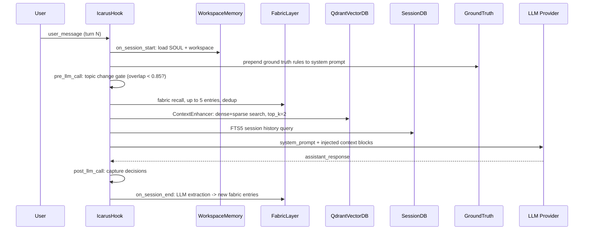
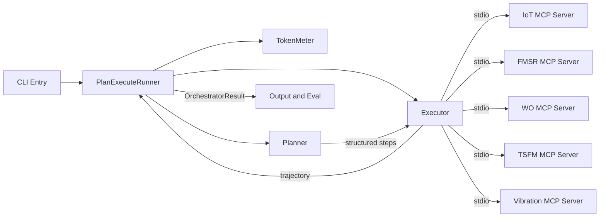
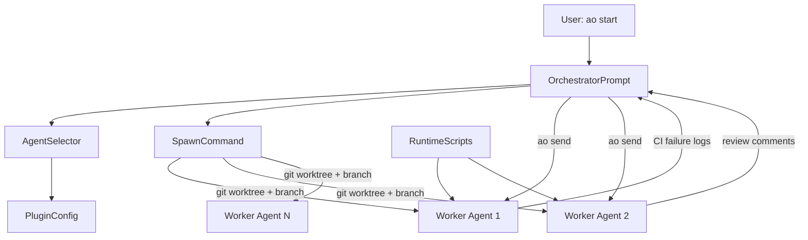
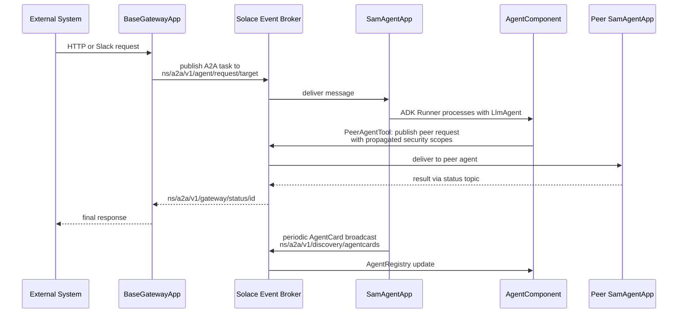

# Agentic AI Weekly Scan — 2026-06-03

## Executive Summary

- **Memory-as-OS** đang nổi lên như một pattern riêng biệt: thay vì nhét toàn bộ context vào prompt, `memory-os` xây dựng 7-layer injection pipeline với dedup gate, fallback cascade, và ground-truth hierarchy để buộc model dùng injected memory.
- **IBM AssetOpsBench** cung cấp phương pháp đánh giá nghiêm túc nhất tuần này: dual eval (LLM-as-Judge + ROUGE trên reasoning trace), domain-specific MCP servers, và kết quả thực nghiệm trên 7 LLMs với 460+ scenarios — được chấp nhận tại KDD/AAAI/ICLR 2025-2026.
- **Agent isolation qua git worktree + tmux** (ComposioHQ) và **agent decoupling qua message broker** (SolaceLabs) là hai hướng production engineering cho multi-agent đang ổn định hóa.

## Table of Contents

1. [ClaudioDrews/memory-os](#repo-1-claudiodrewsmemory-os) — 7-layer memory OS với surgical context injection
2. [IBM/AssetOpsBench](#repo-2-ibmassetopsbench) — Industrial benchmark + dual eval methodology
3. [ComposioHQ/agent-orchestrator](#repo-3-composiohqagent-orchestrator) — Parallel coding agents qua tmux + git worktrees
4. [SolaceLabs/solace-agent-mesh](#repo-4-solacelabssolace-agent-mesh) — Event-driven multi-agent với Solace broker

---

## Repo 1: ClaudioDrews/memory-os

**Link:** https://github.com/ClaudioDrews/memory-os

### §1 — Quick Context

**One-line pitch:** Memory OS cho AI agents — 7-layer persistent memory với surgical context injection per turn, provider-agnostic.

**Tech stack:** Python 3.11+, Qdrant 1.17 (Docker), Redis + ARQ (background tasks), SQLite FTS5, Qwen3-Embedding-8B (via OpenRouter), Hermes Agent, Docker Compose.

**Repo health:** 656 ⭐, 56 forks, created 2026-05-31 (3 ngày tuổi), 2 open issues. Không có CI/tests rõ ràng trong code được xác nhận.

---

### §2 — Architecture Deep-Dive

#### A. Component Inventory

| Component | File Path | Vai trò |
|-----------|-----------|---------|
| `IcarusHook` | `icarus/hooks.py` | Plugin hook system: 4 lifecycle callbacks (pre/post LLM, session start/end) |
| `WorkspaceMemory` | `layers/01-workspace.md` | Markdown files MEMORY.md, USER.md, CREATIVE.md injected vào system prompt mỗi turn |
| `SessionDB` | `layers/02-sessions.md` | SQLite FTS5 lưu toàn bộ conversation history, browse/scroll/search modes |
| `FactStore` | `layers/03-fact-store.md` | SQLite + HRR + FTS5 + trust scoring, CRUD 6 ops (add/search/probe/reason/update/contradict) |
| `FabricLayer` | `layers/04-icarus-fabric.md` | Cross-session memory qua 16 fabric tools, on_session_end trigger LLM extraction |
| `QdrantVectorDB` | `layers/05-qdrant.md` | Qdrant 1.17+ với Qwen3-Embedding-8B (4096 dims), BM25 sparse, 4-level fallback |
| `GroundTruth` | `layers/07-ground-truth.md` | SOUL.md + rulebook.md thiết lập injected memory là authoritative (Level 2 hierarchy) |
| `ContextEnhancer` | `icarus/hooks.py` (pipeline nội tại) | Embeds query (dense+sparse), calls `search_with_fallback()`, top_k=2, threshold=0.55 |

#### B. Control Flow — Hook-driven Injection (không phải ReAct hay Planner-Executor)

Pattern: **Hook-intercepted LLM calls** — mỗi LLM turn được intercept bởi lifecycle hooks để inject memory từ nhiều nguồn.

Happy path:
1. User message đến → `on_session_start` fire: load SOUL context + pending handoffs + cross-agent feedback + recent fabric entries (5 entries) + creative state
2. `pre_llm_call` fire: **Topic Change Gate** tính overlap = `len(tokens ∩ last_query_tokens) / max(len(tokens), 1)`, nếu overlap < 0.85 thì trigger injection
3. Injection pipeline (nếu gate mở): Fabric recall (≤5 entries, dedup qua `_injected_fabric` set) → Qdrant search (top_k=2, score > 0.55) → SessionDB FTS5 query → FactStore (chỉ first turn)
4. Mỗi source sanitize qua regex (block prompt injection, strip control chars, cap 600 chars/source)
5. Context blocks được prepend vào system prompt → LLM call thực thi
6. `post_llm_call` fire: capture decisions để future recall
7. `on_session_end` fire: score session; nếu score ≥ 0.2 → gọi LLM (DeepSeek qua OpenRouter) để extract knowledge points → ghi vào Fabric + Qdrant

#### C. State & Data Flow

- **Message format:** String/dict — hooks nhận `session_id`, `user_message`, `assistant_response` dưới dạng kwargs
- **State storage:** SQLite (sessions + facts), Qdrant (vectors), Redis + ARQ (background workers), Markdown on disk (workspace), `_injected_fabric`/`_injected_qdrant`/`_injected_sessions` sets (in-memory per session dedup)
- **Context window strategy:** Không sliding window — thay bằng surgical injection với per-turn dedup sets để tránh repeat. Gap limit: overlap threshold 0.85 chặn injection khi topic không đổi.

#### D. Tool / Capability Integration

- 16 fabric tools (`fabric_recall`, `fabric_write`, `fabric_brief`...), `qdrant_search`, `fact_store` (6 ops), `session_search` — tất cả exposed như Hermes Agent tools
- Không dùng function-calling native; tools được define trong Hermes Agent's plugin system

#### E. Memory Architecture

- **Short-term:** Layer 1 (workspace markdown, every turn) + Layer 2 (session SQLite FTS5, current session)
- **Long-term:** Layer 3 (facts + trust scores), Layer 4 (fabric cross-session), Layer 5 (Qdrant 4096-dim), Layer 6 (LLM Wiki auto-curated)
- **Retrieval:** 4-level fallback — Hybrid (dense cosine + BM25 RRF) → Dense-only → Lexical markdown → SQLite keyword
- **Compaction:** Weekly decay scanner, monthly semantic dedup (cosine > 0.92 merge). `on_session_end` distills via LLM (DeepSeek) nếu session score đủ cao

#### F. Model Orchestration

- OpenAI, Anthropic, OpenRouter, Ollama — provider-agnostic qua Hermes Agent
- DeepSeek (via OpenRouter) cho session scoring/extraction; Qwen3-Embedding-8B cho vector embedding
- Không phân biệt frontier vs small model theo role — một provider duy nhất per deployment

#### G. Observability & Eval

Không xác định từ code — không thấy OpenTelemetry hay logging framework được đề cập.

#### H. Extension Points

Custom hooks trong `icarus/hooks.py`; thay embedding model qua `EMBEDDING_API_BASE`/`EMBEDDING_MODEL` env vars; swap vector backend bằng cách đổi `EMBEDDING_DIMS` + Qdrant schema.

---

### §3 — Architecture Diagram

---

### §4 — Verdict

**Điểm novel:** Topic Change Gate với token-overlap threshold là giải pháp thực dụng để tránh injection flood trong long single-topic sessions — cụ thể hơn nhiều so với naive "always inject". 4-level fallback Qdrant → Dense → Lexical → SQLite là production-ready pattern cho khi vector DB offline.

**Red flags:** Không có test suite được xác nhận. Layer 6 (LLM Wiki) và Layer 7 (Ground Truth) là config-based chứ không phải code, nên "enforcement" phụ thuộc hoàn toàn vào prompt compliance — không có code guardrail. Repo 3 ngày tuổi với 656 stars có mùi marketing spike.

**Open questions:** Làm thế nào `fact_store` resolve contradictions khi trust score thấp? `on_session_end` gọi LLM (DeepSeek) để extract — chi phí per session là bao nhiêu với long sessions? Overlap gate 0.85 có handle multilingual topic shift không?

---

## Repo 2: IBM/AssetOpsBench

**Link:** https://github.com/IBM/AssetOpsBench | Paper: https://arxiv.org/abs/2506.03828

### §1 — Quick Context

**One-line pitch:** Benchmark và framework cho AI agents vận hành tài sản công nghiệp, 4 specialist agents + 2 orchestration patterns, chấp nhận tại KDD/AAAI/ICLR.

**Tech stack:** Python, LiteLLM proxy, Claude Agent SDK, OpenAI Agents SDK, LangGraph (deep_agent runner), MCP stdio protocol, CouchDB, IBM Granite time-series models, OpenTelemetry.

**Repo health:** 1,692 ⭐, created 2025-05-01, pushed 2026-06-02. Có `pyproject.toml` với `uv` build. Accepted tại 12+ venues. Issue #270 tracking OpenTelemetry integration.

---

### §2 — Architecture Deep-Dive

#### A. Component Inventory

| Component | File Path | Vai trò |
|-----------|-----------|---------|
| `PlanExecuteRunner` | `src/agent/plan_execute/runner.py` | Điều phối 4-phase workflow: discover → plan → execute → summarize |
| `Planner` | `src/agent/plan_execute/planner.py` | LLM decomposes question thành structured steps (#TaskN/#ServerN/#ToolN/#DependencyN) |
| `Executor` | `src/agent/plan_execute/runner.py` | Routes tool calls tới MCP servers via stdio; sequential execution |
| `_TokenMeter` | `src/agent/plan_execute/runner.py` | Wraps LLM backend để accumulate input/output tokens per run |
| `ClaudeAgentRunner` | `src/agent/claude_agent/runner.py` | ReAct loop qua Claude Agent SDK, tracks Trajectory + TurnRecord |
| `IoTMCPServer` | `src/servers/iot/` | CouchDB-backed sensor queries (4 tools) |
| `FMSRMCPServer` | `src/servers/fmsr/` | Failure mode reasoning via LiteLLM (2 tools) |
| `WOMCPServer` | `src/servers/wo/` | Work order management, CodeReAct (8 tools) |
| `TSFMMCPServer` | `src/servers/tsfm/` | Time-series forecasting với IBM Granite (6 tools) |
| `VibrationMCPServer` | `src/servers/vibration/` | DSP diagnostics (8 tools) |

#### B. Control Flow — Hai patterns song song

**Pattern 1 — Plan-Execute (Planner-Executor):**

1. `uv run plan-execute "$query"` → `PlanExecuteRunner.run()` khởi chạy
2. `Executor.get_server_descriptions()` query tất cả MCP servers qua stdio để collect available tools
3. `Planner.generate_plan(question, server_descriptions)` → LLM returns structured steps: `#Task1 / #Server1 / #Tool1 / #Dependency1 / #ExpectedOutput1` (tool arguments **không** được resolve tại bước này)
4. `Executor.execute_plan()` iterates từng step, routes tool call tới đúng MCP server qua stdio, collect responses vào trajectory
5. `_TokenMeter` accumulates tokens suốt quá trình
6. LLM call cuối synthesize trajectory thành final answer; `OrchestratorResult` ghi full trace với timing

**Pattern 2 — Agent-as-Tool (Hierarchical ReAct) — `ClaudeAgentRunner`:**

1. Orchestrator nhận query, kết nối tới tất cả MCP servers (IoT, FMSR, WO, TSFM, Vibration) như available tools
2. Claude Agent SDK tự động discover tool capabilities; Think → Act (invoke MCP tool) → Observe (tool response)
3. Mỗi turn append `TurnRecord` vào `Trajectory` với text/tool_calls/durations
4. Domain agent behavior (ReAct vs CodeReAct) quyết định bởi server-side — WO server dùng Python code execution

#### C. State & Data Flow

- **Message format:** Structured plan steps với key-value blocks (`#TaskN`, `#ServerN`...) giữa Planner→Executor; JSON messages qua MCP stdio protocol
- **State storage:** In-memory `Trajectory` + `OrchestratorResult` per run; CouchDB cho sensor/historical data
- **Context:** Linear execution — không sliding window. `Trajectory` là full execution history trong memory của một run.

#### D. Tool / Capability Integration

- MCP stdio protocol — servers spawn on-demand khi CLI chạy (`uv run plan-execute`)
- Tool invocation qua `execute_plan()` → MCP stdio message → server process → response
- 15+ tools tổng cộng phân bổ theo domain (IoT 4, FMSR 2, WO 8, TSFM 6, Vibration 8)
- WO server dùng CodeReAct — generate Python code, execute dynamically

#### F. Model Orchestration

- LiteLLM proxy cho model agnosticism — tested: GPT-4 (65%), Llama 4 Maverick 17B (59%), Llama 3.3 70B (40%), Granite 3.3 8B (35%)
- IBM Granite time-series models trong TSFM server (specialized, non-frontier)
- Không có explicit planner-vs-executor model differentiation — cùng model cho cả hai roles

#### G. Observability & Eval

- **Tracing:** OpenTelemetry (issue #270 đang implement), `init_tracing()` gọi tại CLI startup — end-to-end trace spanning agent graph + LLM turns + MCP tool calls
- **Eval:** LLM-as-Judge (Llama-4-Maverick-17B) scoring 6 dimensions + ROUGE metrics so với ground-truth planning traces
- **Agent Trajectory Explorer** tool để visualize decision pathways

#### H. Extension Points

4 runner implementations có thể swap: `plan_execute`, `claude_agent`, `openai_agent`, `deep_agent`. Custom MCP servers thêm vào `src/servers/` với stdio interface.

---

### §3 — Architecture Diagram

---

### §4 — Verdict

**Điểm novel:** Thiết kế plan format với `#DependencyN` nhưng thực tế execute **tuần tự** — đây là intentional choice để giữ MCP servers stateless. Dual eval (LLM judge + ROUGE) trên reasoning trace thay vì chỉ final answer là approach đúng cho industrial domain. CodeReAct cho WO agent (dynamic Python execution) thay vì chỉ ReAct là insight quan trọng cho structured-data-heavy domains.

**Red flags:** README nói "DAGs" nhưng code thực tế là sequential — misleading. Chỉ 141 main scenarios (số 460+ bao gồm FailureSensorIQ sub-benchmark). OpenTelemetry chưa merged (issue #270 open). ROUGE metrics so với ground-truth plan trace có thể penalize valid alternative plans.

**Open questions:** AgentHive vs MetaAgent khác nhau như thế nào ở code level? LLM judge calibration cho industrial domain — có domain expert validation không? `_TokenMeter` reset mỗi run nhưng LiteLLM proxy có rate limiting ảnh hưởng benchmark reproducibility không?

---

## Repo 3: ComposioHQ/agent-orchestrator

**Link:** https://github.com/ComposioHQ/agent-orchestrator

### §1 — Quick Context

**One-line pitch:** Fleet manager cho parallel coding agents — mỗi agent có git worktree riêng, tự xử lý CI failures và review comments, human chỉ approve merge.

**Tech stack:** TypeScript/Node.js, tmux (Linux/macOS) / ConPTY (Windows) / Docker, git worktrees, Claude Code / Codex / Aider / Cursor / KimiCode (pluggable), GitHub/Linear/GitLab (pluggable).

**Repo health:** 7,383 ⭐, 1,005 forks, created 2026-02-13, pushed 2026-06-01. 929 open issues — high activity, potentially maintenance debt.

---

### §2 — Architecture Deep-Dive

#### A. Component Inventory

| Component | File Path | Vai trò |
|-----------|-----------|---------|
| `OrchestratorPrompt` | `packages/core/src/prompts/orchestrator.md` | System prompt định nghĩa orchestrator role: read-only coordinator, spawn workers, route CI/review |
| `AgentSelector` | `packages/core/src/agent-selection.ts` | Resolves agent identity per role (orchestrator/worker) với cascading priority 5 levels |
| `SpawnCommand` | `packages/cli/src/commands/spawn.ts` | CLI handler, delegates worktree+branch creation tới SessionManager |
| `PluginConfig` | `agent-orchestrator.yaml.example` | 7 configurable slots (agent, tracker, notifier, runtime, ...) via YAML |
| `RuntimeScripts` | `scripts/claude-spawn`, `scripts/claude-batch-spawn` | Shell scripts để khởi tmux sessions cho từng agent |

#### B. Control Flow — Hierarchical (Supervisor → Workers)

Pattern: **Hierarchical multi-agent với process-level isolation**.

1. `ao start` → Dashboard khởi động + Orchestrator agent launch trong tmux/ConPTY session
2. Orchestrator đọc issue tracker (GitHub/Linear), quyết định issues cần spawn dựa trên `ao status`
3. `ao spawn ISSUE-123` → `SpawnCommand` → `SessionManager.spawn({projectId, issueId, agent, prompt})` → git worktree mới tạo, branch riêng, tmux window mới
4. `AgentSelector` resolves agent type (claude-code/codex/aider) và model override theo cascading priority: persisted session → spawn override → role-specific config → project default → plugin default
5. Worker agent nhận task context, autonomously implement: code changes, commit, PR creation
6. CI failure → logs được route tự động về worker session qua `ao send <session> <log>` (IPC qua named pipe/tmux send-keys)
7. Review comments → forwarded tới agent; `ao review run` → `ao review send <session> <findings>` loop
8. Human review PR → approve/merge. Orchestrator không own code, chỉ coordinate.

#### C. State & Data Flow

- **Message format:** Plain text qua `ao send <session> <message>` — không có typed schema giữa orchestrator và workers
- **State storage:** Git worktree state là implicit state (mỗi agent có isolated working directory); session metadata in-memory/config; không có explicit distributed state store
- **Context window:** Mỗi agent worker có isolated context — git worktree tách biệt về filesystem. Orchestrator monitor qua `ao status` poll, không có shared context.

#### D. Tool / Capability Integration

- Plugin interface TypeScript — 7 slots (Agent, Tracker, Notifier, Runtime, ReviewProvider, CIProvider, DashboardAdapter)
- Agent plugin (claude-code, codex...) xử lý tool-calling internally — orchestrator không can thiệp
- `ao send` là IPC mechanism duy nhất giữa orchestrator và workers

#### F. Model Orchestration

- `orchestratorModel` vs worker model — configurable separately qua `agentConfig`
- Default: claude-code cho cả hai roles
- Alternatives per worker: codex, aider, cursor, kimicode — mix-and-match possible per project config

#### G. Observability & Eval

- Dashboard tại configured port — real-time activity cards, PR status tables
- `ao status --reports` cho audit trails của agent self-reports
- Không thấy OpenTelemetry hay structured tracing trong confirmed code

#### H. Extension Points

7 TypeScript interface slots. Custom agent plugin implement `AgentPlugin` interface, swap tracker plugin cho Linear/GitLab, custom notifier cho Slack/Discord/webhook.

---

### §3 — Architecture Diagram

---

### §4 — Verdict

**Điểm novel:** Git worktree per agent là giải pháp thực sự elegant cho branch isolation — mỗi agent không thể accidentally overwrite code của agent khác. Prompt-defined read-only constraint cho orchestrator (`packages/core/src/prompts/orchestrator.md` explicitly says "investigations are read-only") là pattern đáng học cho supervisor agents. `orchestratorModel` vs `workerModel` separation cho phép dùng frontier model chỉ cho planning, nhỏ hơn cho execution.

**Red flags:** 929 open issues là warning sign nghiêm trọng. `ao send` dùng plain text — không có typed schema hay acknowledgment protocol, dễ fail silently. "Read-only orchestrator" chỉ là prompt-level constraint, không có code enforcement. `SessionManager` path không xác nhận được từ public code search — implementation ẩn.

**Open questions:** Git worktree cleanup sau khi PR merge/close được handle thế nào? Nếu 2 workers cùng sửa shared dependency, conflict được detect ở bước nào? Dashboard authentication — có expose sensitive PR/code info không?

---

## Repo 4: SolaceLabs/solace-agent-mesh

**Link:** https://github.com/SolaceLabs/solace-agent-mesh | Docs: https://solacelabs.github.io/solace-agent-mesh/

### §1 — Quick Context

**One-line pitch:** Multi-agent framework event-driven hoàn toàn: agents communicate qua Solace message broker với A2A protocol, security scopes embedded trong message properties.

**Tech stack:** Python 3.10-3.13, Google Agent Development Kit (ADK), Solace AI Connector (SAC), Solace Event Broker (PubSub+), JSON-RPC 2.0, Docker Compose.

**Repo health:** 4,699 ⭐, created 2025-01-10, pushed 2026-06-02. Official Solace Labs project với enterprise backing. Có docs site, unit tests (`tests/unit/`), CI implied.

---

### §2 — Architecture Deep-Dive

#### A. Component Inventory

| Component | File Path | Vai trò |
|-----------|-----------|---------|
| `SamAppBase` | `src/solace_agent_mesh/common/app_base.py` | Base class cho tất cả SAM applications, quản lý Solace connection lifecycle |
| `SamAgentApp` | `src/solace_agent_mesh/agent/sac/app.py` | Agent Host container (extends SamAppBase): manages ADK Runner, handles A2A protocol translation, enforces permission scopes |
| `AgentComponent` | `src/solace_agent_mesh/agent/sac/component.py` | SAC component bridges A2A messages và ADK execution; imports PeerAgentTool + AgentRegistry |
| `BaseGatewayApp` | `src/solace_agent_mesh/gateway/base/app.py` | Gateway base cho external system integration (REST, Slack, custom protocols) |
| `PeerAgentTool` | `src/solace_agent_mesh/agent/sac/component.py` (imported) | Tool cho agent-to-agent delegation: constructs A2A task, propagates security scopes |
| `AgentRegistry` | `src/solace_agent_mesh/agent/sac/component.py` (imported) | Local registry updated từ AgentCard discovery broadcasts |
| `ADKCallbacks` | `src/solace_agent_mesh/agent/adk/callbacks.py` | ADK lifecycle callbacks, embed injection cho status updates |
| `WorkflowApp` | `src/solace_agent_mesh/workflow/app.py` | Extends SamAgentAppConfig cho prescriptive workflow agents |

#### B. Control Flow — Event-Driven (pub/sub decoupled)

Pattern: **Event-driven với message broker làm trung gian — không có direct coupling giữa bất kỳ 2 components nào**.

1. External request (HTTP/Slack) tới `BaseGatewayApp`; gateway authenticate, translate sang A2A task format
2. Gateway publish message tới Solace topic: `{namespace}/a2a/v1/agent/request/{target_agent_name}`
3. Target `SamAgentApp` (subscribe topic đó) nhận message; `AgentComponent` invoke ADK Runner với `LlmAgent`
4. LLM reasoning loop (ADK manages): nếu cần delegation, `PeerAgentTool` constructs new A2A request cho peer, propagates original user's permission scopes qua Solace message user properties
5. Peer `SamAgentApp` nhận qua peer request topic, processes independently
6. Results flow back qua: `{namespace}/a2a/v1/gateway/status/{gateway_id}/{task_id}`
7. Parallel: mỗi `SamAgentApp` periodically publish `AgentCard` tới `{namespace}/a2a/v1/discovery/agentcards`; receivers update `AgentRegistry`

#### C. State & Data Flow

- **Message format:** JSON-RPC 2.0 qua A2A protocol schema; topic routing theo hierarchical pattern `{ns}/a2a/v1/{component}/{action}/{id}`
- **State storage:** ADK-managed `ArtifactService` + `MemoryService` per agent instance; Solace broker handles in-flight message state; không có central shared state store
- **Context:** Security scopes propagated via Solace message user properties — context không bị lose qua delegation chain. Không thấy context window compaction strategy trong confirmed code.

#### D. Tool / Capability Integration

- Google ADK tool integration — tools defined per agent trong ADK config
- `PeerAgentTool` là mechanism cho agent-to-agent delegation (agent như một tool)
- MCP support listed (từ README topics)
- Tool validation/sandbox qua ADK permission scope enforcement

#### E. Memory Architecture

- ADK `MemoryService` (per-session) và `ArtifactService` (file artifacts) — implementation details phụ thuộc vào ADK version, không xác định thêm từ SAM code
- Cross-session memory không được thấy trong confirmed source

#### F. Model Orchestration

- Bất kỳ LLM được support bởi Google ADK LlmAgent config
- Không có explicit model-per-role differentiation trong confirmed code — mỗi agent config độc lập

#### G. Observability & Eval

- OpenTelemetry được mention trong README. `ADKCallbacks` (`agent/adk/callbacks.py`) ghi status updates với embed injection
- Unit tests tại `tests/unit/` (confirmed từ `tests/unit/agent/sac/test_agent_sac_config.py`)

#### H. Extension Points

Custom Gateway qua `BaseGatewayApp`. Workflow agents qua `WorkflowApp`. Agent capabilities qua Google ADK tool definitions. SAC config files để deploy mới components vào mesh.

---

### §3 — Architecture Diagram

---

### §4 — Verdict

**Điểm novel:** Security scope propagation qua Solace message user properties là approach thực sự production-grade — không cần trust chain hay JWT re-signing khi delegate qua nhiều agents. Topic-based routing với hierarchical namespace pattern (`{ns}/a2a/v1/...`) cho phép multi-tenant deployment mà không cần code changes. ADK Callbacks với embed injection (`{embed_open_delim}status_update:...{embed_close_delim}`) là streaming UX pattern thú vị cho long-running agent tasks.

**Red flags:** Phụ thuộc vào Solace Event Broker (commercial product) — vendor lock-in nghiêm trọng; self-hosted PubSub+ Docker có free tier nhưng production scale cần license. Google ADK thêm một layer dependency nữa — hai "big vendor" dependencies trong critical path. Cross-session memory không được giải quyết bởi SAM itself.

**Open questions:** Behavior khi Solace broker down? Agent mesh có graceful degradation không? `AgentRegistry` được update qua broadcast — race condition nếu agent deploy đúng lúc request arrive? WorkflowApp vs SamAgentApp — prescriptive workflow vs LLM-driven khi nào chọn cái nào?

---

*Generated: 2026-06-03 | Sources: GitHub API search, raw.githubusercontent.com, solacelabs.github.io, arxiv.org/abs/2506.03828, research.ibm.com*
