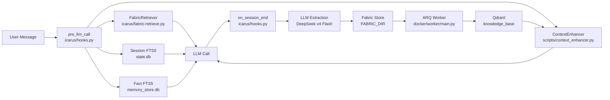
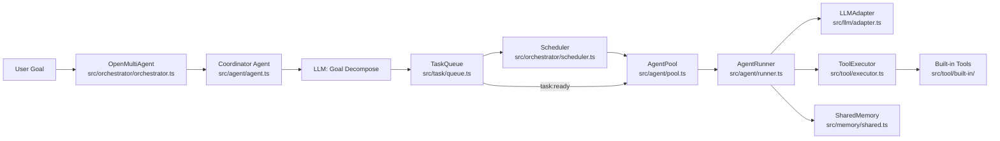
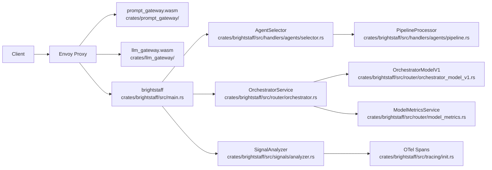
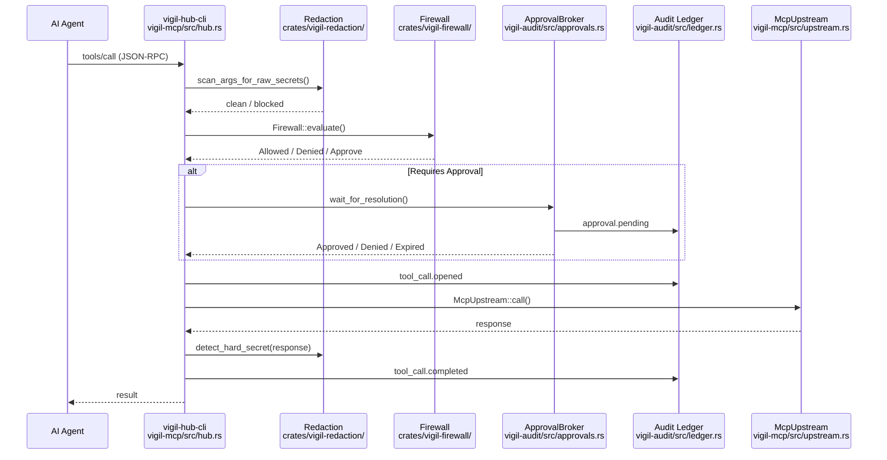

# Agentic AI Weekly Scan — 2026-06-04

## Executive Summary

- **memory-os** đặt ra khái niệm "Ground Truth Hierarchy" (Layer 7) — giải quyết vấn đề bị bỏ qua trong các hệ thống RAG/MemGPT: context được inject vào prompt nhưng agent vẫn re-query thay vì dùng. Song song đó tích hợp vòng lặp self-fine-tuning hoàn chỉnh từ session history → Together AI → model switch.
- **open-multi-agent** sử dụng LLM để phân rã goal thành task DAG *tại runtime* (không pre-wire topology), TypeScript-native với type-safety nghiêm túc, không lock-in vào agent framework nào.
- **katanemo/plano** là ví dụ production-grade hiếm của AI-infra-as-proxy: Envoy WASM data plane + Rust control plane, một "orchestrator LLM" nhỏ (4B params) route traffic cho LLM lớn, kèm 20 "Agentic Signals" quality metrics out-of-box qua OpenTelemetry.
- **vigils** đóng kín gap bảo mật còn thiếu: SHA-256 hash-chain audit trail, cross-process approval queue, PII redaction fail-closed — local-first, zero external telemetry, type-state machine Rust enforce lifecycle ở compile time.

## Table of Contents

- [1. ClaudioDrews/memory-os](#1-claudiodrewsmemory-os)
- [2. open-multi-agent/open-multi-agent](#2-open-multi-agentopen-multi-agent)
- [3. katanemo/plano](#3-katanemoplano)
- [4. duncatzat/vigils](#4-duncatzatvigils)

---

## 1. ClaudioDrews/memory-os

**Link:** https://github.com/ClaudioDrews/memory-os  
**Created:** 2026-05-31 | **Last push:** 2026-06-03

### §1 — Quick Context

Hệ điều hành bộ nhớ 7-layer cho Hermes Agent: persistent memory hoàn toàn local, provider-agnostic, inject context thông minh và có kiểm soát qua SOUL.md patches.

- **Stack:** Python 3.11, Qdrant 1.17 (Docker), Redis + ARQ, FastEmbed (BM25 local), Qwen3-Embedding-8B via OpenRouter
- **Repo health:** 770★, 74 forks, last push 2026-06-03, không có CI formal — cấu hình Docker + cron scripts

### §2 — Architecture Deep-Dive

**A. Component Inventory**

- `IcarusPlugin` (`icarus/__init__.py`) — plugin entry point, đăng ký 16 tools + 4 lifecycle hooks với Hermes Agent
- `HookEngine` (`icarus/hooks.py`) — tâm điểm: implement `on_session_start`, `pre_llm_call`, `post_llm_call`, `on_session_end`; chứa overlap gate (0.85), sanitization pipeline, multi-source injection logic
- `StateManager` (`icarus/state.py`) — quản lý Fabric I/O, session exchange buffer, model training pipeline (start/check/switch/rollback)
- `FabricRetriever` (`icarus/fabric-retrieve.py`) — SQLite FTS5-indexed retrieval với 8-dimension scoring: keyword hits×5, exact phrase+18, bigrams×4, trigrams×7, project/agent affinity, recency, tier, ref-chain (two-pass)
- `ToolHandlers` (`icarus/tools.py`) — 16 tool handlers; `fabric_write` validate `assigned_to`/`review_of` constraints; `fabric_switch_model` gate by min eval score
- `ContextEnhancer` (`scripts/context_enhancer.py`) — hybrid Qdrant search: 4-level cascade (hybrid RRF → dense-only → lexical vault → SQLite keyword), OTel-style telemetry JSONL
- `ARQWorker` (`docker/worker/main.py`) — ARQ job processor: `process_wiki_file`, `process_reflection`, `process_micro_reflection`; cron reflection mỗi 2h
- `FileIngestion` (`docker/worker/tasks/file_ingestion.py`) — markdown → Qdrant pipeline (Qwen3 4096d dense + BM25 sparse, dedup cosine ≥0.92 → merge payload)
- `DecayScanner` (`scripts/decay_scanner.py`) — `exp(-ln(2) * age / half_life)`, half_life=90d nếu importance≥0.3, archive khi decay<0.1
- `WikiIngestion` (`scripts/wiki_continuous_ingest.py`) — SHA-256 change detection, Redis ARQ enqueue, DLQ với failure classification

**B. Control Flow — Hook-based Context Injection**

Pattern: **Hook-based multi-source context injection** (không phải ReAct, không phải Planner-Executor).

1. User gửi message → Hermes Gateway nhận turn
2. `pre_llm_call` fires: overlap gate check (>0.85 overlap với previous turn → skip); social closer check (short/emoji messages → skip supplemental search)
3. Truy vấn 4 nguồn song song: `[fabric]` via FabricRetriever, `[qdrant]` via ContextEnhancer hybrid cascade, `[sessions]` via SQLite FTS5, `[facts]` via memory_store.db (first turn only)
4. Mỗi result: sanitize (10 regex patterns strip prompt injection, `{{template}}`, `<script>`, SYSTEM prefixes), dedup theo session-level set, label rõ nguồn, max 600 chars/item
5. Enriched system prompt → LLM call
6. `post_llm_call`: detect `DECISION_RE + OUTCOME_RE` patterns, track creative state (themes, learnings)
7. `on_session_end`: score session (< 0.2 → skip thin sessions), build transcript, LLM extraction call (DeepSeek v4 Flash) → structured entries → write to `$FABRIC_DIR/*.md` (atomic via tempfile+rename)

Background async: `wiki_continuous_ingest.py` (hourly SHA-256 diff) → Redis → ARQ Worker → Qdrant upsert

**C. State & Data Flow**

- Message format: string concatenation vào system prompt — không có typed schema giữa các layer
- Fabric store: plain markdown + YAML frontmatter trong filesystem; SQLite là cache rebuild từ mtime, không phải source of truth
- Context window strategy: overlap gate + per-source dedup set; không có summarization built-in
- State: SQLite (`state.db` 9 tables + `memory_store.db` 6 tables), Qdrant (vector), Redis (job queue), `$FABRIC_DIR/*.md` (experience store)

**D. Tool Integration**

- Register: `ctx.register_tool(name, toolset, schema, handler)` tại `icarus/__init__.py`
- Model gọi tool: JSON function-calling native qua Hermes Agent framework
- Tool validation: per-tool Python logic (`fabric_write` validate `assigned_to` khi `status='open'`, `review_of` format `agent:id`)
- Sandbox: không có sandbox — tools write trực tiếp lên filesystem

**E. Memory Architecture — 7 Layers**

1. **Workspace** (`icarus/hooks.py → on_session_start`): 3 markdown files (MEMORY.md, USER.md, CREATIVE.md) inject vào system prompt mỗi turn; Icarus write CREATIVE.md only (tránh dual-writer conflict với upstream)
2. **Sessions** (`state.db`): SQLite + FTS5, conversation history auto-logged bởi Hermes Gateway
3. **Structured Facts** (`memory_store.db`): SQLite + HRR vectors + Bayesian trust scoring (`trust = helpful_count/retrieval_count + prior 0.5`)
4. **Fabric** (`$FABRIC_DIR/*.md`): cross-session structured experience; 7 entry types; fine-tuning dataset source; 16 tools; cross-agent handoff qua `assigned_to` field
5. **Vector DB** (Qdrant `knowledge_base`): hybrid RRF (Qwen3-8B 4096d + BM25 sparse); decay lifecycle; dedup cosine 0.92
6. **LLM Wiki** (`$VAULT_PATH/wiki/`): self-curating vault; 2 pipelines: Wiki Agent (LLM-structured) + continuous ingest (SHA-256 → ARQ)
7. **Ground Truth Hierarchy** (`modifications/soul-rulebook.md`): SOUL.md patches — injected memory = Level 2 authority, cao hơn training knowledge. Enforce bằng instruction text, không phải code

Layer 7 là **novel nhất và không có software component**: giải quyết vấn đề agent bỏ qua injected context bằng cách patch identity files.

**F. Model Orchestration**

- Extraction: DeepSeek v4 Flash (OpenRouter default, DeepSeek direct priority 2, custom endpoint priority 1)
- Embedding: Qwen3-Embedding-8B 4096d (OpenRouter cloud hoặc Ollama local)
- Reflection: Ollama local `http://host.docker.internal:11434` (background, no latency budget)
- Fine-tune: Together AI, base model Qwen2-7B-Instruct
- Self-improvement loop: `fabric_export` → JSONL (5 pair types, review-correction weighted ×5) → `fabric_train` → `fabric_eval` → `fabric_switch_model` (gate: min_eval_score=0.7)

**G. Observability & Eval**

- Không có structured tracing. `state.log_usage()` ghi metrics vào SQLite
- `fabric_telemetry` tool: recall-vs-used ratio
- `_test_sanitize.py`: 23 assertions test prompt injection defense
- Fine-tune eval: cosine similarity trên word frequencies (không phải embedding-based)

**H. Extension Points**

- Thêm tool: handler trong `icarus/tools.py` + schema trong `icarus/schemas.py` + register trong `icarus/__init__.py`
- Swap embedding: 3 env vars (`EMBEDDING_API_BASE`, `EMBEDDING_MODEL`, `EMBEDDING_DIMS`)
- Swap LLM: 3-level priority chain (`ICARUS_ENDPOINT` → `DEEPSEEK_API_KEY` → OpenRouter)

### §3 — Architecture Diagram



### §4 — Verdict

**Điểm novel:** Layer 7 "Ground Truth Hierarchy" là insight cụ thể và mới: patch SOUL.md để injected memory có authority Level 2 — cao hơn training knowledge, thấp hơn terminal output. Vòng lặp self-fine-tuning hoàn chỉnh (session → JSONL export với review-correction pairs weighted ×5 → Together AI → eval → model switch với rollback) khác biệt rõ so với các memory systems chỉ dừng ở retrieval. **Red flags:** Không có CI/tests production-grade. Qdrant compatibility landmines được document (RRF chỉ từ v1.18, `AsyncQdrantClient.search()` missing trong 1.18+, RRF threshold range sai: ~0.1–0.6 không phải 0.5–0.95). **Open questions:** Layer 7 SOUL.md approach có portable sang agents khác Hermes không? Fine-tune eval bằng cosine similarity trên word frequencies có đủ robust không?

---

## 2. open-multi-agent/open-multi-agent

**Link:** https://github.com/open-multi-agent/open-multi-agent  
**Created:** 2026-03-31 | **Last push:** 2026-06-04

### §1 — Quick Context

Framework TypeScript-native: mô tả goal, coordinator LLM tự decompose thành task DAG tại runtime, workers execute song song với Kahn's topological sort.

- **Stack:** TypeScript (ES2022, Node.js ≥18), Anthropic SDK, OpenAI SDK, Zod; 13 LLM providers; Vitest (60+ test files)
- **Repo health:** 6,316★, nhiều contributors, last push 2026-06-04, CI Vitest bao gồm e2e tests

### §2 — Architecture Deep-Dive

**A. Component Inventory**

- `OpenMultiAgent` (`src/orchestrator/orchestrator.ts`) — top-level class: `createTeam()`, `runTeam()`, `runTasks()`, `runAgent()`, `runFromPlan()`; short-circuit heuristic, coordinator spawning, retry với exponential backoff, approval gates
- `Team` (`src/team/team.ts`) — coordination object: agent roster (O(1) Map), MessageBus, TaskQueue, SharedMemory, event bus
- `AgentPool` (`src/agent/pool.ts`) — global `Semaphore(maxConcurrency)` + per-agent `Semaphore(1)` mutex; `runEphemeral()` bypass mutex cho delegation
- `Agent` (`src/agent/agent.ts`) — lifecycle wrapper: `idle → running → completed/error`; multi-turn persistent history qua `prompt()`; structured output retry
- `AgentRunner` (`src/agent/runner.ts`) — conversation loop: LLM call → extract ToolUseBlocks → `ToolExecutor.executeBatch()` → append results → repeat; 3-layer tool access control; 4 context strategies
- `TaskQueue` (`src/task/queue.ts`) — event-driven dependency-aware queue; states `pending → blocked → completed/failed/skipped`; cascade failure/skip via DFS
- `Scheduler` (`src/orchestrator/scheduler.ts`) — 4 strategies: Round-Robin, Least-Busy, Capability-Match (keyword affinity), Dependency-First (BFS critical path)
- `ToolExecutor` (`src/tool/executor.ts`) — parallel batch (Semaphore 4), Zod validation, error isolation (never throws, returns `ToolResult { isError: true }`), output truncation 70% head + 30% tail
- `LLMAdapter` (`src/llm/adapter.ts`) — interface + factory; 13 providers lazy-import; `AISdkAdapter` bridge cho Vercel AI SDK
- `SharedMemory` (`src/memory/shared.ts`) — namespaced `<agentName>/<key>`, turn-based TTL, `getSummary()` → markdown digest cho prompt injection
- `MessageBus` (`src/team/messaging.ts`) — pub/sub: point-to-point + broadcast, read-state tracking
- `BuiltInTools` (`src/tool/built-in/`) — 6 tools: bash (không sandboxed), file_read/write/edit/glob/grep (sandboxed to `.agent-workspace`); delegate tool opt-in

**B. Control Flow — LLM-driven Planner → Dependency Graph Executor**

Pattern: **Planner-Executor** với LLM làm planner (không phải rules-based).

1. `runTeam(team, goal)` → `isSimpleGoal()` check (≤200 chars, no complexity patterns) → nếu simple: keyword-score agents, dispatch thẳng, skip coordinator
2. Tạo ephemeral Coordinator `Agent` với system prompt liệt kê roster + output format ("respond with JSON array inside ```json fence")
3. `agent.run(goal)` → LLM produces JSON tasks với `dependsOn` bằng title strings
4. `parseTaskSpecs()`: extract JSON, validate; `validateTaskDependencies()`: DFS 3-color cycle detection
5. `onPlanReady` gate (optional) → human review trước khi execute
6. `Scheduler.dependency-first()`: BFS transitive count → critical path priority
7. `AgentPool.runParallel()`: dispatch tất cả `pending` tasks song song; per-agent mutex serialize state
8. Khi task complete: `unblockDependents()` → dependents chuyển từ `blocked` → `pending` → `task:ready` event → dispatch ngay lập tức
9. `onApproval` gate giữa các batch
10. Synthesis: coordinator LLM aggregates all task results

**C. State & Data Flow**

- Message format: typed `LLMMessage { role, content: ContentBlock[] }` (TextBlock, ToolUseBlock, ToolResultBlock, ReasoningBlock) — full TypeScript type safety
- Task data flow: kết quả task được ghi vào `SharedMemory` dưới `agentName/task:<id>`; downstream tasks nhận qua `memoryScope: 'dependencies'` (default) hoặc `'all'`
- Context window: 4 strategies — `sliding-window`, `summarize` (LLM call), `compact` (rule-based head/tail), `custom`
- Plan serialization: `PlanArtifact { version: 1 }` cho DAG replay không cần re-invoke coordinator

**D. Tool Integration**

- Register: `defineTool({ name, description, inputSchema: ZodSchema, execute })` — custom Zod v3 → JSON Schema converter
- LLM calls: native function-calling (Anthropic/OpenAI); `text-tool-extractor.ts` fallback cho local models (Hermes XML tags, bare JSON)
- Validation: Zod input validation trong `ToolExecutor`; error isolation: errors trở thành `ToolResult { isError: true }` cho LLM xử lý
- MCP: `connectMCPTools({ command, prefix })` → stdio transport; normalize `/` → `_` trong tool names

**F. Model Orchestration**

- Coordinator: frontier model (configurable, typically Claude Opus/GPT-4o)
- Workers: per-agent `AgentConfig.model`, có thể dùng smaller models per task type
- Parallelism: `AgentPool.runParallel()` với `Promise.allSettled` (rejections không abort batch)
- Reasoning: `ReasoningBlock` drop by default trên cross-provider handoff; `preserveReasoningAsText: true` để enable `<thinking>` fallback

**G. Observability & Eval**

- Tracing: `onTrace` callback — `TraceEvent` typed spans (LLMCallTrace, ToolCallTrace, TaskTrace, AgentTrace) với `runId`, `startMs`, `durationMs`; secret redaction tự động (multi-pass regex: PEM, Bearer, AWS, Slack)
- Dashboard: `render-team-run-dashboard.ts` — self-contained HTML, Kahn's DAG layout, SVG edges, token ratio viz, không external deps
- Tests: `coordinator-dependency-contract.test.ts` — regression guard rằng framework không auto-wire hay drop declared dependencies; `research-aggregation.ts` example có inline parallelism assertion (wall-clock < 70% serial sum)
- Token budget: per-agent + per-run `maxTokenBudget`; `TokenBudgetExceededError` emits event

**H. Extension Points**

- Custom agent: `AgentConfig` trong `TeamConfig.agents[]`
- Custom tool: `defineTool()` → `AgentConfig.customTools`
- Custom LLM: implement `LLMAdapter` interface (chat + stream methods)
- Custom memory: implement `MemoryStore` interface; `SharedMemory` accepts `sharedMemoryStore` param

### §3 — Architecture Diagram



### §4 — Verdict

**Điểm novel:** Coordinator LLM quyết định DAG structure tại runtime — framework chỉ enforce invariants (dependency contract). `plan-replay.ts` cho phép replay plan không cần re-invoke coordinator, quan trọng cho cost control. Type-safety nghiêm túc nhất trong các TS agent frameworks: `ContentBlock[]` typed, Zod validation end-to-end, `strict: true`. `delegate_to_agent` deadlock prevention qua `availableRunSlots` check là chi tiết engineering đáng học. **Red flags:** Coordinator prompt không có structured output enforcement — JSON parsing dễ fail với complex goals. `bash` tool explicitly NOT sandboxed. Không có retry logic nếu coordinator LLM produce sai dependencies. **Open questions:** `capability-match` scheduler dùng keyword scoring — accuracy trong production với overlapping agent capabilities? Khi coordinator produce circular deps, `validateTaskDependencies` bắt được nhưng không suggest fix.

---

## 3. katanemo/plano

**Link:** https://github.com/katanemo/plano  
**Created:** 2024-07-09 | **Last push:** 2026-06-03

### §1 — Quick Context

AI-native proxy và data plane cho agentic apps: Envoy WASM data plane + Rust control plane, dùng lightweight LLM (4B params) để route traffic và orchestrate agents.

- **Stack:** Rust 70% (Hyper 1.x, Tokio), Envoy Proxy (WASM), Python CLI, 23 LLM providers; OpenTelemetry, Prometheus, Grafana
- **Repo health:** 6,567★, 427 forks, 66 releases (v0.4.23), CI có GitHub Actions, Docker-based deployment

### §2 — Architecture Deep-Dive

**A. Component Inventory**

- `prompt_gateway.wasm` (`crates/prompt_gateway/src/http_context.rs`) — Envoy WASM ingress filter: inject tool definitions từ `prompt_targets` config, mutate request/response bodies; `FilterContext` + `StreamContext` lifecycle
- `llm_gateway.wasm` (`crates/llm_gateway/src/stream_context.rs`) — Envoy WASM egress filter: provider auth normalization, SSE/Bedrock streaming, TTFT tracking (`content.len()/4` token estimate), compression
- `brightstaff` (`crates/brightstaff/src/main.rs`) — native control plane binary (Hyper 1.x, port 9091/19901): tất cả API routes, `Arc<AppState>` shared
- `AppState` (`crates/brightstaff/src/app_state.rs`) — shared Arc: orchestrator_service, llm_providers (Arc<RwLock>), agents_list, listeners, state_storage, filter_pipeline, signals_enabled
- `OrchestratorService` (`crates/brightstaff/src/router/orchestrator.rs`) — route/model selection: session cache lookup (LRU/Redis) → orchestrator LLM call → `ModelMetricsService.rank_models()`
- `OrchestratorModelV1` (`crates/brightstaff/src/router/orchestrator_model_v1.rs`) — routing LLM wrapper: system prompt với available agents → JSON `{"route": [...]}` response; middle-trim 60%+40% cho oversized context
- `AgentSelector` (`crates/brightstaff/src/handlers/agents/selector.rs`) — 3-tier: 1 agent (skip orchestration), N agents (LLM routing), fallback (first agent + warning)
- `PipelineProcessor` (`crates/brightstaff/src/handlers/agents/pipeline.rs`) — sequential agent chaining: raw HTTP filter chains + MCP JSON-RPC 2.0 transport (initialize → notifications/initialized → tools/call)
- `ModelMetricsService` (`crates/brightstaff/src/router/model_metrics.rs`) — real-time cost (DigitalOcean catalog API) + latency (Prometheus query); background refresh; `rank_models(policy)`: cheapest/fastest/none
- `SignalAnalyzer` (`crates/brightstaff/src/signals/analyzer.rs`) — 20 conversation quality signals; score 0–100; 3 layers: interaction, execution, environment
- `hermesllm` (`crates/hermesllm/`) — unified provider abstraction: `ProviderRequestType`/`ProviderResponseType`; 23 providers; SSE + Bedrock binary stream decoding
- `SessionCache` (`crates/brightstaff/src/session_cache/`) — LRU in-memory (10K entries) hoặc Redis; sticky routing per `{tenant}:{session_id}`; TTL 600s default

**B. Control Flow — Proxy-intercepted với LLM-based Routing**

Pattern: **Transparent proxy với LLM router + sequential agent chain**.

1. Client request → Envoy Proxy (port 10001/11000)
2. `prompt_gateway.wasm`: strip Content-Length, inject tools từ `prompt_targets` config vào request body, dispatch HTTP callout đến brightstaff nếu cần function-calling
3. Envoy forward đến brightstaff (port 9091) theo route:
   - `/agents/*` → `agent_chat()` → `AgentSelector` → nếu 1 agent: skip; nếu N: `OrchestratorModelV1` LLM call → route names → `PipelineProcessor` sequential chain (mỗi intermediate agent output thành assistant message cho agent tiếp theo; final agent stream về client)
   - `/v1/chat/completions` → `llm_chat()` → session cache lookup → `OrchestratorService.determine_route()` → ranked models → forward LLM provider
   - `/routing/*` → `routing_decision()` → trả ranked model list, caller tự handle fallback
4. `llm_gateway.wasm`: SSE/Bedrock stream decode, TTFT tracking, provider format transform
5. `SignalAnalyzer`: post-response quality analysis (buffered, không inline) → OTel span attributes

**C. State & Data Flow**

- Session state: `SessionCache` (key `{tenant}:{session_id}`) → sticky routing; CachedRoute {model_name, route_name}
- Conversation state: `StateStorage` (in-memory hoặc Postgres) cho `/openai/responses` API `previous_response_id`
- Config: YAML `plano_config.yaml` → `Configuration` struct via serde_yaml; validation bằng Python script
- Message normalization: `hermesllm` translate OpenAI ↔ Anthropic ↔ Bedrock formats

**D. Tool Integration**

- `prompt_targets` trong YAML config → `ChatCompletionTool` objects (trong `prompt_gateway.wasm`)
- LLM calls tools: native function-calling; `ArchFunctionHandler` detect hallucination qua log-probability entropy
- MCP: `PipelineProcessor` handle JSON-RPC 2.0 handshake tự động, transparent với agent developers
- Validation: `verify_tool_calls()` kiểm tra parameter presence + data type compatibility

**F. Model Orchestration**

- Orchestrator LLM: small 4B-param model (`plano-orchestrator` provider, e.g. GPT-4o-mini) → route names
- Worker LLMs: frontier models sau routing decision
- Fallback strategy: `routing_decision` endpoint trả ranked list; caller xử lý 429/5xx
- Session pinning: sau lần đầu route, cache kết quả cho toàn session (stickiness)

**G. Observability & Eval**

- OTel: OTLP gRPC, configurable sampling, W3C TraceContext propagation; `ServiceNameOverrideExporter` cho per-span service name override (`plano(orchestrator)`, `plano(filter)`, `plano(llm)`)
- Prometheus (port 9092): HTTP RED metrics, LLM TTFT histograms (100ms–180s range), routing decision latency, session cache hit/miss/store, process metrics; Grafana dashboards tại `config/grafana/`
- Agentic Signals™ (`signals/`): 20 signal types — interaction (misalignment, stagnation, disengagement, satisfaction), execution (failure, loops), environment (exhaustion); quality score 0–100; `is_concerning()` flag đổi span operation name
- `signals_replay` binary (`src/bin/signals_replay.rs`): batch offline analysis từ JSONL conversations stdin

**H. Extension Points**

- Thêm agent: YAML `agents:` list với `id`, `url`, `agent_type` (http hoặc mcp)
- Filter chains: `input_filters` / `output_filters` trên Listener config — zero code changes
- Custom routing: `routing_preferences:` với `models:` list, `selection_policy` (Cheapest/Fastest/None)
- Custom metric source: `model_metrics_sources:` với Cost (DigitalOcean) hoặc Latency (Prometheus)

### §3 — Architecture Diagram



### §4 — Verdict

**Điểm novel:** "Orchestrator là LLM" — không phải rule-based routing mà dùng 4B-param model classify user intent thành route names (chi phí thấp, flexibility cao). `ServiceNameOverrideExporter` giải quyết vấn đề OTel span attribution per-agent trong single-process setup một cách elegant. MCP transport built-in tại proxy layer là unique. Agentic Signals 20-metric là one of the most complete out-of-box conversation quality monitoring. **Red flags:** `OrchestratorModelV1` middle-trim 60%+40% có thể mất critical context ở giữa conversations. Sequential agent chain — không có parallel execution. WASM synchronous execution blocks Envoy worker thread. **Open questions:** Accuracy của routing LLM khi nhiều agents có overlapping capabilities? Chi phí orchestrator LLM call on every request (không có session cache bypass cho simple cases)?

---

## 4. duncatzat/vigils

**Link:** https://github.com/duncatzat/vigils  
**Created:** 2026-05-31 | **Last push:** 2026-06-03

### §1 — Quick Context

Control plane local-first cho AI agents: tamper-evident audit trail, cross-process approval queue, PII redaction fail-closed — Rust + Tauri desktop + Chrome MV3 extension.

- **Stack:** Rust (Tokio, rusqlite bundled, wasmtime 44, ONNX Runtime optional), Tauri 2, Vue 3, Chrome MV3; 18 crates workspace
- **Repo health:** 205★, 13 forks, last push 2026-06-03, v0.1.7 (post security audit 9.9/10), Apache-2.0

### §2 — Architecture Deep-Dive

**A. Component Inventory**

- `vigil-hub-cli` (`apps/vigil-hub-cli/`) — MCP gateway chính: nhận JSON-RPC từ AI agents qua stdio, orchestrate toàn bộ pipeline
- `Hub` (`crates/vigil-mcp/src/hub.rs`) — `handle_tools_call` pipeline: ISS-015 secret scan → scope cache → firewall → approval wait → upstream → ISS-016 leak check
- `Firewall` (`crates/vigil-firewall/`) — 3-stage: `EffectExtractor` (7 built-ins: paths, URLs, SQL, shells, emails, secrets, browser actions) → `RiskScorer` → `PolicyEngine`
- `PolicyEngine` (`crates/vigil-policy/`) — fail-closed rule evaluation: priority-sorted rules, `Deny > Approve > Allow` merge khi multiple rules match, default deny
- `ApprovalBroker` (`crates/vigil-audit/src/approvals.rs`) — cross-process coordination: `Arc<(Mutex, Condvar)>` cho in-process + 500ms SQLite polling cho cross-process (Tauri ↔ CLI)
- `AuditLedger` (`crates/vigil-audit/src/ledger.rs`) — SQLite WAL append-only, SHA-256 v2 hash chain, FTS5 full-text search; stores only fingerprints (32 hex chars), không có plaintext
- `ToolCallSpan` (`crates/vigil-audit/src/span.rs`) — type-state machine Rust: `ToolCallSpan<Opened> → ToolCallSpan<Decided> → Done`; enforce tại compile time via PhantomData; `Drop` writes `tool_call.abandoned`
- `Redaction` (`crates/vigil-redaction/`) — 13 credential classes (regex: AWS, GitHub tokens, Anthropic sk-ant-, OpenAI sk-, JWT, PEM, email, IP, Stripe, etc.) + optional ONNX ML ensemble (3 models); `detect_hard_secret()` fail-closed
- `McpUpstream` (`crates/vigil-mcp/src/upstream.rs`) — trait: stdio (NDJSON, UUID request IDs, reader/writer/stderr threads) hoặc HTTP (rustls-only, OAuth 2.1 PKCE)
- `vigil-sandbox-linux` (`crates/vigil-sandbox-linux/`) — Landlock LSM filesystem isolation; **duy nhất** unsafe entry point trong toàn 18-crate workspace
- `NativeHost` (`apps/native-host/`) — Chrome Native Messaging: u32 LE framed JSON, 1MB ceiling cả 2 chiều, classify → response loop
- `BrowserClassifier` (`crates/vigil-browser/src/classifier.rs`) — 5-stage: origin validation → `scan_hard_findings()` → localhost detection → action (Block/Redact/Allow) → fail-closed re-scan sau redaction
- `Desktop` (`apps/desktop/`) — Tauri 2 + Vue 3: viewer/control plane cho ledger, resolve approvals qua `UiCommand` protocol

**B. Control Flow — Synchronous Intercept-and-Gate**

Pattern: **Intercept gate** (không phải planning hay execution — đây là security middleware).

1. AI agent gửi `tools/call` JSON-RPC tới `vigil-hub-cli` qua stdio
2. `Hub::handle_tools_call`: ISS-015 `scan_args_for_raw_secrets()` — recursive JSON walk; `secret://alias` whitelist; bất kỳ credential pattern thật → immediate error
3. Session scope cache: `find_session_scope_allow()` — identical invocation đã approved → skip firewall
4. `ToolCallSpan::open()` → `tool_call.opened` vào SQLite ledger
5. `Firewall::evaluate()`: 7 EffectExtractors → `DescriptorOracle` (FirstSeen/ApprovedStable/Drifted) → `BudgetedOrtPiiScanner` (2s timeout, DegradedTimeout → hard-rules-only) → `PolicyEngine`
6. Outcome: `Allowed` → proceed; `Denied` → span `execute_failed()`; `Approve` → `ApprovalBroker.wait_for_resolution()` (Condvar in-process OR 500ms SQLite poll cross-process → Desktop UI hoặc CLI resolve)
7. `McpUpstream::call()`: StdioUpstream (UUID request ID, NDJSON) hoặc HttpUpstream (rustls, alg=none rejected)
8. ISS-016: `detect_hard_secret(response)` → `leak_detected_count` atomic increment (không modify response — out-of-band)
9. `ToolCallSpan::executed()` → `tool_call.completed` → return to agent

**C. State & Data Flow**

- Message format: JSON-RPC 2.0 (MCP protocol) qua stdio NDJSON
- State: SQLite WAL (`vigil.db`) cho ledger + approvals + server registry; in-memory cho session scope cache
- Hash chain v2 (post-audit VIGIL-SEC-001 fix): `SHA256(domain_tag || prev_hash || JCS(payload) || created_at || session_id || event_type || redacted_text)` — length-prefixed, `None` vs `Some("")` distinct
- Secrets: `SecretValue` wrapper với `zeroize` (zero-on-drop); `SecretStore` trait (in-memory hoặc OS keychain via `keyring` crate)
- Ledger: chỉ lưu SHA-256 fingerprints (32 hex chars) — "绝不存原文"

**D. Tool Integration**

- vigils là transparent MCP proxy — không inject tool definitions; tools đến từ upstream MCP servers
- Namespace routing: `<server_id>__<upstream_tool_name>` → `ToolRouter` lookup
- Validation: `PolicyEngine` + `EffectExtractor` thay vì schema validation
- MCP JSON-RPC 2.0: protocol version `"2024-11-05"`, handshake cached per agent

**G. Observability & Eval**

- Audit ledger: mọi event với hash chain; `vigil-hub-cli inspect` subcommands: `activity`, `search`, `approvals`, `sessions`, `servers`, `chain` (verify integrity)
- `DecisionRecord` per invocation: matched rule IDs, risk score, PII findings (privacy labels + fingerprints), `EngineStatusReport` (`Ok/DegradedTimeout/DegradedError/Unsupported`)
- Drift detection: command argv hash drift + resolved program path drift (2 orthogonal monitors)
- Browser: 32-entry ring buffer (metadata only, no original text)
- `signals_replay` equivalent: không có — vigils log dữ liệu nhưng không có offline analysis

**H. Extension Points**

- Custom policy: `PolicyRule` DSL với `match_effects`, `conditions`, `action`, `priority`
- Custom PII scanner: implement `PiiScanner` trait trong `vigil-firewall`
- Custom upstream: implement `McpUpstream` trait
- Embed SDK: `vigil-sdk` trên crates.io (re-exports Firewall, PiiScanner, scan_text)

### §3 — Architecture Diagram



### §4 — Verdict

**Điểm novel:** Type-state machine `ToolCallSpan<Opened → Decided → Done>` enforce lifecycle ở compile time via PhantomData — zero runtime overhead, impossible to audit wrong order. Hash chain v2 post-audit fix (VIGIL-SEC-001) binding `session_id + event_type + redacted_text` vào digest là security engineering cụ thể, không phải marketing. `forbid(unsafe_code)` workspace-wide trừ một file là discipline hiếm. `BudgetedOrtPiiScanner` 2s timeout với graceful degradation xuống hard-rules-only là production pattern đáng học. **Red flags:** 205★, single-person project còn non-production. 500ms SQLite polling là thô — latency cao khi Desktop UI ở foreground. ONNX ML ensemble hiện trả `Unsupported` — feature promise chưa delivered. **Open questions:** SQLite WAL single-writer mutex scale thế nào với 100+ concurrent tool calls? Policy DSL còn simple — làm thế nào express "allow bash only nếu đã approved file-write trước đó"?
