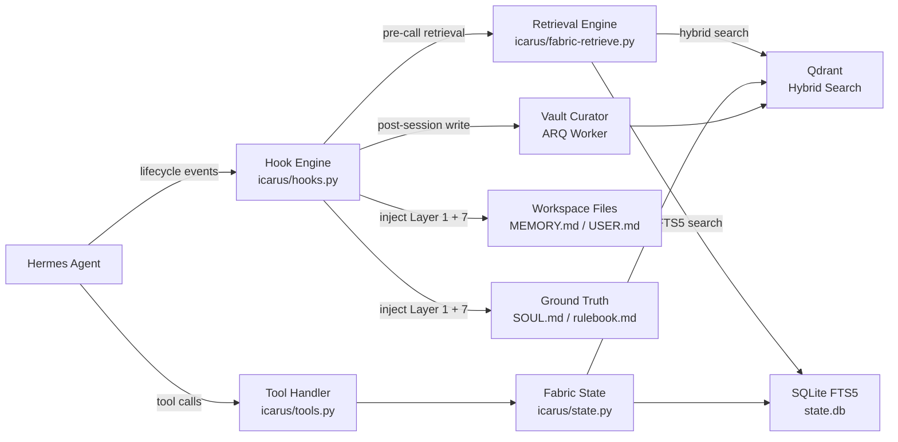
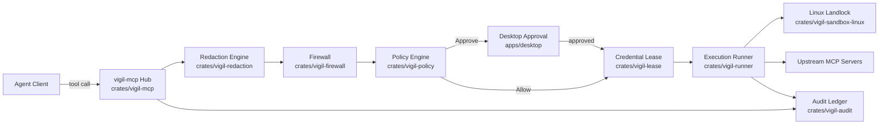
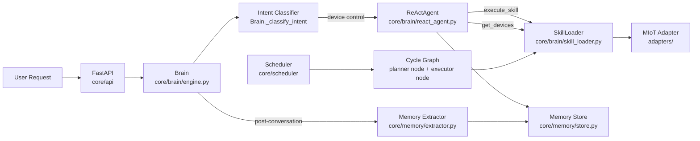
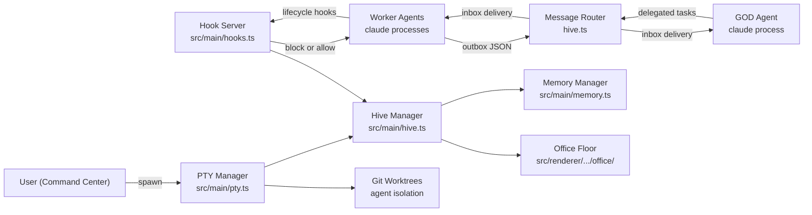

# Agentic AI Weekly Scan — 2026-06-05

## Executive Summary

- **Trend tuần này: Agent Infrastructure Layer.** Hai trong bốn repo không build agent mới mà build *meta-infrastructure* để quản lý, giám sát và cung cấp memory cho agent đang chạy (memory-os, vigils) — cho thấy thị trường đang chuyển từ "xây agent" sang "vận hành agent an toàn."
- **Hai kiến trúc coordination nổi bật:** File-based git-backed hive (munder-difflin) và pipeline security control plane (vigils) — cả hai đều tránh dependency nặng (không Redis, không message broker ngoài) bằng cách dùng primitives đơn giản nhưng enforce nghiêm.
- **Anima là repo duy nhất có actual hardware integration** với dual LangGraph pattern (cycle graph autonomous vs chat graph user-triggered) — separation of concerns sạch và có thể học được cho bất kỳ agent với scheduled + reactive workload.

---

## Table of Contents

- [Repo 1 — ClaudioDrews/memory-os](#repo-1--claudiodrewsmemory-os)
- [Repo 2 — duncatzat/vigils](#repo-2--duncatzatvigils)
- [Repo 3 — Fullive-AI/Anima](#repo-3--fullive-aianima)
- [Repo 4 — chaitanyagiri/munder-difflin](#repo-4--chaitanyagirimunder-difflin)

---

## Repo 1 — ClaudioDrews/memory-os

**GitHub:** https://github.com/ClaudioDrews/memory-os | Stars: 834 | Created: 2026-05-31

### §1 — Quick Context

**Pitch:** Hệ thống memory 7 lớp local-first cho AI agent — đảm bảo agent không quên ngữ cảnh qua các sessions, không phụ thuộc cloud.

**Tech stack:** Python 3.11, Qdrant (vector DB, hybrid 4096d Cosine + BM25), Redis + ARQ (async worker), SQLite FTS5, Docker Compose; provider-agnostic (OpenRouter / Anthropic / Ollama).

**Repo health:** 834 stars, 82 forks, cập nhật 2026-06-05. Solo project (1 contributor chính). CI workflow trong `.github/`. Có test suite: `scripts/test-plugin.sh` (66 test cases) + `_test_sanitize.py`.

---

### §2 — Architecture Deep-Dive

#### A. Component Inventory

| Component | File Path | Vai trò |
|---|---|---|
| `Hook Engine` | `icarus/hooks.py` | 4 lifecycle hooks tích hợp với Hermes agent session |
| `Tool Handler` | `icarus/tools.py` | Implements 16 tools: fabric_recall, fabric_write, fabric_search, fabric_pending, fabric_curate, fabric_export, fabric_eval, fabric_switch_model, fabric_rollback_model, fabric_brief, fabric_telemetry, fabric_report, fabric_init_obsidian, fabric_train, fabric_train_status, fabric_models |
| `Fabric State Manager` | `icarus/state.py` | Fabric I/O operations, session scoring, model registry |
| `Retrieval Engine` | `icarus/fabric-retrieve.py` | Ranked retrieval từ shared FABRIC_DIR với relevance scoring |
| `Training Exporter` | `icarus/export-training.py` | Extracts training pairs với quality filtering |
| `Tool Schemas` | `icarus/schemas.py` | LLM-accessible interface definitions |
| `Plugin Manifest` | `icarus/plugin.yaml` | Registration của 16 tools + 4 hooks |
| `Ground Truth Files` | `templates/SOUL.md`, `templates/rulebook.md` | Layer 7: inject authoritative memory hierarchy vào system prompt |
| `Vault Curator` | `icarus/tools.py` (fabric_curate) + ARQ worker | Semantic linking, MOC generation, auto-index vào Qdrant |
| `Qdrant Service` | `docker/` | Vector DB: hybrid search + semantic deduplication |
| `SQLite Sessions DB` | `state.db` (runtime) | FTS5 full-text search trên conversation history |

#### B. Control Flow — Event-Driven Plugin Pattern

Hermes plugin intercepts agent lifecycle theo hooks; không có central orchestrator — mỗi hook trigger một phase của memory pipeline.

1. **Session start** → `on_session_start` hook fires → MEMORY.md, USER.md, CREATIVE.md (Layer 1 workspace files) + SOUL.md (Layer 7 ground truth) được inject vào system prompt
2. **Pre-LLM call** → `pre_llm_call` hook fires → Retrieval Engine query Qdrant (semantic) + SQLite (FTS5) → ranked memories injected surgically (chỉ những gì relevant, không dump toàn bộ history)
3. **Agent uses tools** → `fabric_recall` / `fabric_search` calls → Tool Handler → Qdrant hybrid search → trả về ranked memories
4. **Post-LLM call** → `post_llm_call` hook fires → "high-value decisions (decision + outcome + substantial user request)" ghi vào SQLite + structured facts store
5. **Session end** → `on_session_end` hook fires → session quality scored → nếu pass threshold → structured notes ghi vào wiki vault
6. **Background** → ARQ worker → Vault Curator chạy async → semantic linking + MOC update → index vào Qdrant

#### C. State & Data Flow

- **Message format giữa components:** Shared filesystem (FABRIC_DIR) + SQLite + Qdrant — không có typed schema giữa components; coupling qua file paths và DB queries.
- **State storage:** SQLite `state.db` (sessions + structured facts, FTS5), Qdrant (semantic vectors, Layer 5), flat files (MEMORY.md, USER.md wiki files, Layers 1 & 6), Redis (ARQ job queue)
- **Context window management:** Surgical injection — `pre_llm_call` chỉ inject memories relevant đến topic hiện tại, không dump full history. Semantic deduplication trên Qdrant write ngăn context bloat.

#### D. Tool / Capability Integration

- 16 tools đăng ký qua `plugin.yaml` manifest; model gọi tool qua **native function-calling** (OpenRouter / Anthropic API).
- Validation: quality threshold scoring trước khi write (session quality filter trong `on_session_end`).
- Model replacement pipeline: `fabric_export` → fine-tune external → `fabric_switch_model` + `fabric_eval` → `fabric_rollback_model` nếu eval fail.

#### E. Memory Architecture

- **Short-term:** Conversation messages list trong agent session (ephemeral)
- **Long-term (4 layers):**
  - Layer 1: Workspace files (MEMORY.md, USER.md, CREATIVE.md) — human-readable, injected mỗi session
  - Layer 3: Structured facts SQLite với **trust scoring** và entity resolution
  - Layer 5: Qdrant (4096d dense Cosine + BM25 sparse) — hybrid vector search
  - Layer 6: LLM wiki vault — auto-curated, continuously ingested vào Qdrant
- **Retrieval:** `fabric-retrieve.py` — ranked retrieval từ shared FABRIC_DIR, multi-source injection
- **Compaction:** Semantic deduplication trên write; Vault Curator v3 semantic linking

#### F. Model Orchestration

- Provider-agnostic single model setup; không có multi-model routing.
- **Đặc biệt:** Self-improvement loop — `fabric_export` captures training pairs → fine-tune cheaper replacement model → `fabric_eval` so sánh → `fabric_switch_model` nếu pass threshold → `fabric_rollback_model` nếu regression.

#### G. Observability & Eval

- `fabric_telemetry` tool cho session metrics
- Session quality scoring trong `on_session_end` (threshold-based gate trước khi write)
- 66-test fixture suite (`scripts/test-plugin.sh`), smoke test (`scripts/smoke-handoff.sh`)
- Model evaluation script: `scripts/eval-replacement.py`

#### H. Extension Points

- Custom LLM provider: thêm vào `.env` (bất kỳ OpenRouter-compatible endpoint)
- Custom skills: thêm vào `skills/` directory
- Custom workspace files: edit templates trong `templates/`

---

### §3 — Architecture Diagram



---

### §4 — Verdict

**Điểm novel / đáng học:** Layer 7 "Ground Truth" (SOUL.md + rulebook.md) giải quyết một problem ít được nhắc đến: agent có memory được inject nhưng không *ưu tiên* sử dụng nó vì không biết đó là authoritative source. Đây là insight thực sự từ production usage. Self-improvement loop (`fabric_export` → fine-tune → `fabric_eval` → `fabric_switch_model`) là agentic self-optimization pipeline hoàn chỉnh, hiếm thấy được implement rõ đến vậy.

**Red flags:** Solo project, không có pyproject.toml (chỉ `requirements.txt`) → thiếu versioning discipline. Icarus là "heavily modified fork" — không rõ upstream tracking strategy. Không có unit tests cho core logic (SQLite writes, Qdrant indexing) — chỉ có integration-level smoke tests. File-coupling giữa components qua shared filesystem thay vì typed interface là tech debt tiềm ẩn.

**Open questions:** Trust scoring trong structured facts (Layer 3) được tính thế nào? Vault Curator semantic deduplication dùng threshold bao nhiêu — false positive rate? Training data quality filter trong `export-training.py` có đủ chặt để không poison fine-tuned model không?

---

## Repo 2 — duncatzat/vigils

**GitHub:** https://github.com/duncatzat/vigils | Stars: 226 | Created: 2026-05-31

### §1 — Quick Context

**Pitch:** Control plane local-first cho AI agent — intercept mọi tool call, enforce policy, redact secrets, sandbox execution, audit toàn bộ.

**Tech stack:** Rust 2021 (workspace 17 crates), Tauri 2 + Vue 3 (desktop app), Chrome MV3 (browser extension), SQLite WAL, Wasmtime 44, Linux Landlock LSM.

**Repo health:** 226 stars, 14 forks, last push 2026-06-04. Multiple contributors. ADR documents trong repo. CI + criterion benchmarks. Phiên bản 0.1.13 — active iteration. `#![forbid(unsafe_code)]` enforce ở crate level.

---

### §2 — Architecture Deep-Dive

#### A. Component Inventory

| Component | File Path | Vai trò |
|---|---|---|
| `vigil-mcp` | `crates/vigil-mcp/src/lib.rs` | MCP Gateway Hub: aggregates upstream MCP servers, routes tool calls qua security pipeline |
| `vigil-policy` | `crates/vigil-policy/src/lib.rs` | Policy DSL: Rust-based `PolicyRule` (match_effects, conditions, action, priority), default-deny |
| `vigil-firewall` | `crates/vigil-firewall/src/lib.rs` | EffectVector analysis, risk scoring, Stage 1 gate |
| `vigil-redaction` | `crates/vigil-redaction/src/lib.rs` | 13+ credential classes, fingerprint regex + EnsembleEngine ML, fail-closed |
| `vigil-audit` | `crates/vigil-audit/src/lib.rs` | SHA-256 hash-chained SQLite WAL append-only ledger + FTS5, session replay |
| `vigil-runner` | `crates/vigil-runner/src/lib.rs` | Execution: `WasmRunner` (Wasmtime) + `spawn_native`, 9 security invariants (ADR 0007) |
| `vigil-sandbox-linux` | `crates/vigil-sandbox-linux/src/lib.rs` | Linux Landlock LSM filesystem isolation |
| `vigil-lease` | `crates/vigil-lease/src/lib.rs` | RAII credential management: short-lived creds injected vào child process, auto-revoke |
| `vigil-sdk` | `crates/vigil-sdk/src/lib.rs` | Public API surface cho agent/tool integration |
| `vigil-types` | `crates/vigil-types/src/lib.rs` | Shared type definitions across workspace |
| `desktop` | `apps/desktop/` | Tauri 2 + Vue 3: approval queue, activity feed, server registry, session replay UI |
| `vigil-hub-cli` | `apps/vigil-hub-cli/` | CLI gateway: stdio + HTTP transport |
| `native-host` | `apps/native-host/` | Browser native messaging host (Chrome extension bridge) |

#### B. Control Flow — Pipeline Security Pattern

```
Agent → [vigil-mcp hub] → redact → firewall → policy → [approve/deny/allow] → runner → upstream tools
```

1. **Agent emits tool call** → vigil-mcp Hub nhận qua stdio hoặc HTTP (`vigil-http-transport`)
2. **Redaction stage** → `vigil-redaction`: scan payload bằng regex fingerprints (order-sensitive, Anthropic trước OpenAI) → replace với `[REDACTED rule_name]` → fail-closed nếu hard secret detected
3. **Firewall stage** → `vigil-firewall`: tính `EffectVector` + risk_score cho tool invocation
4. **Policy evaluation** → `vigil-policy`: duyệt `PolicyRule` set theo priority (desc) → action: Allow / Approve / Deny. Tie-breaking: Deny > Approve > Allow. Unmatched → Deny (default)
5. **Human approval** (nếu Approve) → vigil-mcp puts request vào approval queue → desktop app hiện cho user → user click approve/deny → response propagates
6. **Credential issuance** (nếu Allow/approved) → `vigil-lease` issues short-lived credential → RAII: injected vào child process env, revoked khi scope exits
7. **Execution** → `vigil-runner`: Wasm tools → Wasmtime sandbox; native tools → `spawn_native` + `apply_native_env_policy` + Landlock filesystem isolation
8. **Audit** → `vigil-audit` appends hash-chained event vào SQLite ledger (mọi branch — kể cả deny). Response qua redaction lần 2 → nếu leak detected → `EVENT_SECRET_LEAK_DETECTED`

#### C. State & Data Flow

- **Message format:** Typed Rust structs serialized qua serde/serde_json — không có stringly-typed messages giữa crates.
- **State storage:** SQLite WAL (vigil-audit ledger, approval queue), keyring OS-native (multi-platform credential storage), in-memory state trong vigil-mcp Hub.
- **Descriptor pinning:** `RegistryDescriptorOracle` theo dõi schema của upstream MCP servers — detect schema drift khi server update.

#### D. Tool / Capability Integration

- **Protocol:** MCP (Model Context Protocol) — stdio và HTTP transport (`vigil-http-transport`, `vigil-http-auth`)
- **Aggregation:** vigil-mcp Hub presents unified MCP surface đến agent client (Cursor, Claude Desktop) — agent không biết có vigils ở giữa
- **Sandbox:** Wasmtime (capability-based, cap-std) cho Wasm tools; Linux Landlock cho native
- **Validation:** 9 security invariants (ADR 0007), `prescreen_native` trước `spawn_native`

#### E. Memory Architecture

Không applicable — vigils là control plane, không phải agent. Không có memory layer.

#### F. Model Orchestration

Không applicable — vigils là model-agnostic. Hoạt động transparent với bất kỳ agent/model nào dùng MCP.

#### G. Observability & Eval

- **Audit ledger** (`vigil-audit`): append-only, SHA-256 hash-chained, FTS5 search. `ReplayEvent` capability cho session replay.
- **Events:** `EVENT_RAW_SECRET_ATTEMPT_DETECTED`, `EVENT_SECRET_LEAK_DETECTED` để track suspicious activity
- **Desktop UI:** Activity feed + approval queue + audit log viewer (Tauri 2 + Vue 3)
- **Benchmarks:** criterion dependency (performance benchmarking framework)
- **ADR documents:** Architecture Decision Records trong repo (ADR 0002, ADR 0007 confirmed)

#### H. Extension Points

- **vigil-sdk:** public crate API cho tích hợp custom agent/tool
- **Policy rules:** thêm `PolicyRule` vào config (Rust DSL)
- **Upstream servers:** đăng ký qua server registry, descriptor pinning auto-detects schema
- **Browser extension:** client-side redaction layer (Chrome MV3) có thể deploy independently

---

### §3 — Architecture Diagram



---

### §4 — Verdict

**Điểm novel / đáng học:** `vigil-lease` RAII credential management là pattern chưa thấy ở bất kỳ agent framework nào — credentials không persist, chỉ live trong scope của tool execution, revoked tự động khi process exit. Descriptor pinning (`RegistryDescriptorOracle`) để detect upstream schema drift là production-grade paranoia đúng chỗ: khi MCP server update tool schema silently, vigils sẽ catch. `#![forbid(unsafe_code)]` enforce ở toàn workspace là commitment hiếm thấy trong Rust projects.

**Red flags:** v0.1.13 — còn experimental, API surface unstable. Linux Landlock chỉ available trên Linux kernel ≥ 5.13 — macOS/Windows agents nhận sandboxing yếu hơn (không có Landlock equivalent). Wasm overhead chưa được benchmark công khai. EnsembleEngine ML component chỉ được mention, không rõ model cụ thể hay training data.

**Open questions:** EnsembleEngine ML dùng model gì, train trên data nào — false positive rate trên legitimate credentials trong code repos? Policy DSL có GUI editor không (hiện chỉ code-level config)? Hash-chain verification overhead trên high-throughput agent sessions (1000+ tool calls/hour)?

---

## Repo 3 — Fullive-AI/Anima

**GitHub:** https://github.com/Fullive-AI/Anima | Stars: 275 | Created: 2026-06-01

### §1 — Quick Context

**Pitch:** Agent OS cho smart home hardware — biến thiết bị Xiaomi thành collaborative agents có khả năng học preferences và điều phối cross-device.

**Tech stack:** Python 3.11 + FastAPI + Uvicorn, LangGraph ≥ 0.3.0 + LangChain-OpenAI, aiomqtt + amqtt (MQTT), React + Vite (dashboard), Docker Compose, python-miio (Xiaomi MIoT).

**Repo health:** 275 stars, 6 forks, last push 2026-06-03. Org account (Fullive-AI). Pre-commit hooks + Ruff linting. pytest-asyncio test suite trong `tests/`. Có docs/ với design documentation.

---

### §2 — Architecture Deep-Dive

#### A. Component Inventory

| Component | File Path | Vai trò |
|---|---|---|
| `Brain` | `core/brain/engine.py` | Central orchestrator: builds 2 LangGraph graphs, routes intents, instantiates ReActAgent |
| `ReActAgent` | `core/brain/react_agent.py` | ReAct loop (max 8 steps): think→act→observe cho device control |
| `SkillLoader` | `core/brain/skill_loader.py` | Dynamic discovery + loading của skills từ `skills/` directory |
| `MemoryStore` | `core/memory/store.py` | 3-tier memory storage (JSON file-based: preferences, history, extracted) |
| `MemoryExtractionService` | `core/memory/extractor.py` | LLM-based extraction của structured preferences từ conversation |
| `PreferenceLearningService` | `core/memory/learning.py` | Học user patterns (runs mỗi 300s qua Scheduler) |
| `HistoryFilter` | `core/memory/history_filter.py` | Context window management: filtering conversation history |
| `MemoryMerge` | `core/memory/memory_merge.py` | Conflict resolution khi new extracted memory mâu thuẫn stored |
| `DiscoveryOrchestrator` | `core/devices/` | Hardware detection: local network scan mỗi 7200s |
| `MIoTAdapter` | `adapters/` | Xiaomi MIoT protocol translation (python-miio) |
| `VirtualAdapter` | `adapters/` | Virtual device abstraction layer |
| `EventBus` | `core/events/` | Event-driven communication: SENSOR_UPDATED, DEVICE_DISCOVERED |
| `RulesEngine` | `core/rules/` | Conditional automation logic |
| `Scheduler` | `core/scheduler/` | 3 recurring jobs: device scan (7200s), env refresh (60s), preference learning (300s) |
| `MQTTClient` | `core/` | aiomqtt + amqtt connectivity |

#### B. Control Flow — Dual LangGraph (Planner-Executor) + ReAct Hybrid

Anima có **hai graph riêng biệt** và routing xảy ra *trước* khi vào graph:

**Chat flow (user-triggered):**
1. User message → FastAPI endpoint → `Brain._classify_intent()` phân loại: chitchat / device_control / environment_query / general
2. **Chitchat** → stream LLM response trực tiếp, không qua tool loop
3. **Device control / agentic** → Brain instantiates `ReActAgent(llm, model, skill_loader, memory)`
4. ReAct loop (max 8 steps): **Think** (LLM call với message history) → **Act** (nếu tool calls: `get_devices` trước, rồi `execute_skill`) → **Observe** (`{role: "tool", tool_call_id, content: observation}` appended)
5. `execute_skill` → SkillLoader retrieves skill → `SkillPlanItem` → `brain._execute_skill_plan_item()` → MIoTAdapter → physical command
6. Loop terminates khi không có tool calls hoặc `verified: true` returned
7. Post-conversation → `MemoryExtractionService` extracts preferences → `MemoryStore.save()`

**Cycle flow (scheduled, autonomous):**
1. Scheduler triggers cycle graph mỗi 60s
2. `_graph_planner` node: LLM nhận device states + environment + memory context → generates structured JSON task list
3. `_graph_executor` node: executes tasks sequentially qua skills → updates state
4. Graph terminates → kết quả committed, preference learning scheduled

#### C. State & Data Flow

- **Message format:** OpenAI-compatible dict list — `{role, content, tool_calls, tool_call_id}`. Language instruction re-injected sau mỗi observe step.
- **State storage:** JSON files cho memory (MemoryStore), in-memory messages list trong ReActAgent, FastAPI server state
- **Context window management:** `history_filter.py` (sliding/filtering), `memory_merge.py` (conflict resolution), MemoryExtractionService (LLM-based structuring thay vì raw append)

#### D. Tool / Capability Integration

- **Tools:** `get_devices` (query device + sensor states) và `execute_skill` (trigger skill trên specific device) — 2 tools chính trong ReAct loop
- **Calling mechanism:** OpenAI function-calling API (`tool_calls` trong response)
- **Streaming:** SSE events từ ReActAgent qua Brain → FastAPI → client

#### E. Memory Architecture

- **Short-term:** `messages[]` list accumulating trong ReActAgent (in-memory, per-request)
- **Long-term:** JSON files qua `MemoryStore` — 3 tiers: explicit preferences, interaction history, extracted memories (chỉ confirmed memories influence decisions by default)
- **Extraction:** `extractor.py` — LLM-based post-conversation extraction, không naive append
- **Learning:** `learning.py` — implicit pattern learning từ usage, runs every 300s
- **Merge strategy:** `memory_merge.py` — handles conflicts, chi tiết implementation không xác định từ API surface hiện có

#### F. Model Orchestration

- Single OpenAI-compatible LLM throughout (configured via settings)
- **Routing trước graph:** `_classify_intent()` quyết định path — chitchat bypass ReAct, chỉ device/agentic mới dùng full tool loop
- `_route_system_chat_message()` xử lý device discovery và skill creation requests riêng

#### G. Observability & Eval

- FastAPI endpoints expose system state
- Rich logging cho Scheduler jobs
- pytest-asyncio test suite trong `tests/` (pytest-timeout configured)
- Không có OpenTelemetry hay distributed tracing trong deps

#### H. Extension Points

- Custom skills: thêm Python file vào `skills/` → SkillLoader auto-discovers
- New device protocols: implement adapter interface trong `adapters/` (Matter, Home Assistant planned theo docs)
- Custom LLM: bất kỳ OpenAI-compatible endpoint qua settings

---

### §3 — Architecture Diagram



---

### §4 — Verdict

**Điểm novel / đáng học:** Dual LangGraph architecture — cycle graph (autonomous, scheduled, deterministic planner→executor) tách biệt hoàn toàn với chat graph (reactive, user-triggered, với ReAct fallback) — là separation of concerns sạch cho bất kỳ agent nào có cả scheduled workload lẫn interactive workload. Memory pipeline với explicit `extractor.py` + `memory_merge.py` thay vì naive append là production-thinking đúng hướng: LLM extract structured preferences, merge strategy handle conflicts, chỉ confirmed memories affect behavior.

**Red flags:** JSON file-based memory không có concurrent write safety — sẽ corrupt khi multiple requests cùng lúc. `max_8_steps` hardcoded trong ReAct loop — không configurable. `langchain-openai` dependency trong pyproject.toml → tight LangChain coupling dù đang dùng LangGraph. Chỉ 6 forks → community nhỏ, production battle-testing ít.

**Open questions:** `memory_merge.py` — conflict resolution algorithm cụ thể là gì khi user preference mâu thuẫn nhau? `_classify_intent()` dùng rule-based hay LLM call — latency impact? Cycle graph có safeguard không khi `_graph_executor` execute destructive device command (ví dụ: turn off HVAC khi người ở trong phòng)?

---

## Repo 4 — chaitanyagiri/munder-difflin

**GitHub:** https://github.com/chaitanyagiri/munder-difflin | Stars: 212 | Created: 2026-05-31

### §1 — Quick Context

**Pitch:** Electron harness biến Claude Code terminal sessions thành multi-agent system có GOD orchestrator, file-based coordination, và office-floor visualization bằng Pixi.js.

**Tech stack:** TypeScript, Electron 32.2.0, React 18, Pixi.js (office visualization), node-pty (PTY management), xterm.js (terminal rendering), Zustand (state management), git worktrees (isolation).

**Repo health:** 212 stars, 23 forks, last push 2026-06-05 (rất active). 1-2 contributors. `typecheck` script (TypeScript validation). Landing page + blog trong repo.

---

### §2 — Architecture Deep-Dive

#### A. Component Inventory

| Component | File Path | Vai trò |
|---|---|---|
| `PtyManager` | `src/main/pty.ts` | Manages node-pty instances: spawn, write, resize, kill, teardown; maps PTY ID → Agent ID |
| `HiveManager` | `src/main/hive.ts` | Multi-agent coordination: agent registration, registry, board, message routing, GOD integration |
| `MessageRouter` | `src/main/hive.ts` | Poll-based router: drains agent outboxes → delivers to inboxes; hop-cap 12; atomic via `.sent/` |
| `GODAgent` | Logic trong `src/main/hive.ts` + identity injected at spawn | Virtual supervisor: delegates tasks, sole scribe của board.md, escalates critical decisions |
| `HookServer` | `src/main/hooks.ts` | Unix domain socket server: captures Claude Code lifecycle hooks (Stop, PreToolUse, PostToolUse, Notification) |
| `MemoryManager` | `src/main/memory.ts` | Per-agent semantic memory wrapper: markdown-first storage, semantic indexing |
| `IPCBridge` | `preload/index.ts` | Typed `window.cth` bridge: sandboxed filesystem + git utilities exposed to renderer |
| `OfficeFloor` | `src/renderer/src/scene/office/` | Pixi.js visualization: agent avatars, animated message envelopes, office map (Tiled) |

#### B. Control Flow — Hierarchical Multi-Agent (Supervisor → Workers)

1. **User spawns agent** → `ipcMain.handle('pty:spawn')` → PtyManager validates inputs → creates node-pty process (claude CLI command)
2. **Hive provisioning** → `hive.ensureAgent()` → creates agent workspace: `inbox/`, `outbox/`, `memory.md`, `identity.md`, `cursor.json` → injects `AGENT_*` env vars vào spawned process
3. **Git isolation** (nếu `isolate: true`) → git worktree created trên branch `agent/<id>` → agents không conflict nhau
4. **Lifecycle hook capture** → Claude Code emits hooks qua Unix socket → HookServer receives → `drainForStop()` evaluates: nếu agent inbox có pending messages → `{"decision": "block"}` → agent tiếp tục xử lý
5. **Agent sends message** → writes JSON file vào `outbox/` (`{to, act, subject, body}` — act: request/inform/propose/query/agree/refuse/done)
6. **MessageRouter polls** → drains outbox → resolves "god" / "human" → GOD agent's inbox → moves processed files vào `outbox/.sent/` (atomic, idempotent)
7. **GOD agent** → drains inbox → delegates tasks qua MessageRouter → writes `board.md` → escalates critical items (spending, destructive ops, scope changes) đến user qua Claude Code native approval
8. **Agent teardown** → terminal exit / explicit kill → `teardownPty()` → archives agent in hive registry → removes git worktree (non-blocking)

#### C. State & Data Flow

- **Message format:** JSON files trong `outbox/` với schema `{to, act, subject, body}`. Act field có semantic: request/inform/propose/query/agree/refuse/done — soft governance protocol.
- **State storage:** Flat files trong `hive/` directory: `registry.json`, `board.md`, `tasks.json`, `log.jsonl`, `PROTOCOL.md`, `agents/<id>/inbox|outbox|memory.md|identity.md|cursor.json`. Single-writer git repo với retry/backoff trên stale lock.
- **Context management:** Per-agent `memory.md` (Markdown, human-readable), `cursor.json` tracks last processed message ID, semantic indexing qua MemoryManager.

#### D. Tool / Capability Integration

- **Tools exposed:** Filesystem ops + git ops qua typed `window.cth` IPC bridge (`preload/index.ts`) — không dùng MCP hay function-calling
- **Calling mechanism:** Claude Code agent gọi tools natively (bash, file read/write) trong PTY session; harness không intercept tool calls
- **Validation:** Input type checking trước mỗi `ipcMain.handle()` handler

#### E. Memory Architecture

- **Short-term:** Conversation context trong Claude Code session (managed by Claude Code itself, không phải harness)
- **Long-term:** `memory.md` per agent (Markdown), semantic indexing qua `MemoryManager` (`src/main/memory.ts`)
- **Retrieval:** Semantic search qua MemoryManager — indexing mechanism cụ thể không xác định từ code hiện tại

#### F. Model Orchestration

- Mỗi agent là claude CLI process — model configured externally (không controlled bởi harness)
- GOD agent cũng là claude CLI process với specific `identity.md` prompt injected
- Không có frontier/small model routing — tất cả agents dùng cùng model

#### G. Observability & Eval

- `log.jsonl` append-only event log trong `hive/`
- Token/cost telemetry parsed từ Claude Code transcripts → Activity tab trong desktop
- `cursor.json` per agent: tracks last processed message ID (at-least-once delivery guarantee)
- GitHub issue ingestion, CI status watching, Slack webhook integrations
- Task kanban board trong Command Center UI

#### H. Extension Points

- Custom agent roles: edit `identity.md` injected at spawn
- Custom missions: scheduled tasks qua `syncMissions()`
- Webhook integrations: GitHub, CI, Slack (webhook servers trong shutdown sequence)
- Tiled map customization cho office floor visualization

---

### §3 — Architecture Diagram



---

### §4 — Verdict

**Điểm novel / đáng học:** File-based, git-backed coordination protocol với atomic routing (`outbox/ → .sent/`) là zero-dependency approach — không cần Redis, không cần message broker — nhưng vẫn có atomicity và idempotency. Hook server integration với Claude Code lifecycle để **block genuine stops** khi agent inbox có pending messages là elegant backpressure mechanism, biến external event injection thành first-class primitive. hop-cap 12 để prevent message cycles là production-thinking: message storms trong multi-agent systems là real failure mode.

**Red flags:** Poll-based router — latency và polling interval không được document; có thể introduce noticeable delay khi nhiều agents. `PROTOCOL.md` là soft governance — GOD agent có thể violate protocol nếu prompt drift. `memory.md` Markdown file không có concurrent write protection. Electron 32 + node-pty là heavy stack với significant memory footprint per instance.

**Open questions:** MessageRouter poll interval là bao nhiêu ms? MemoryManager semantic search dùng embedding model nào — local (fastembed?) hay API call? GOD agent có khả năng bị overwhelmed (inbox saturation) khi số workers tăng lên không? Hop-cap 12 có đủ cho delegation chains complex trong real workflows không?

---

*Scan generated: 2026-06-05 | Nguồn: GitHub search `agent agentic created:>2026-05-29 stars:>200` + expanded queries*
