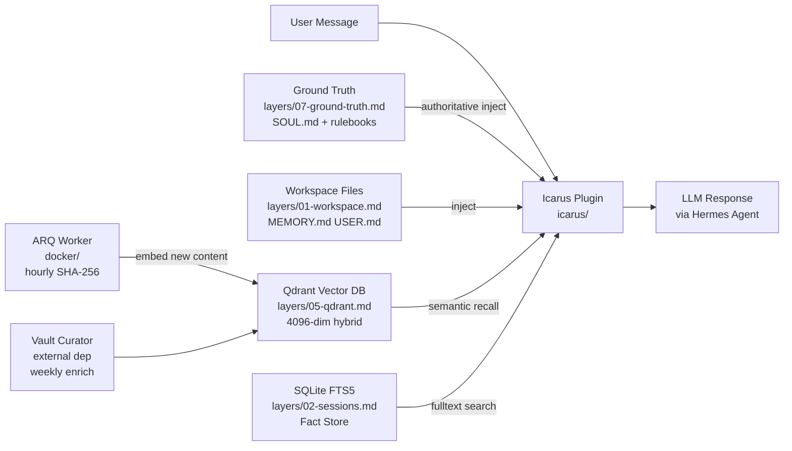
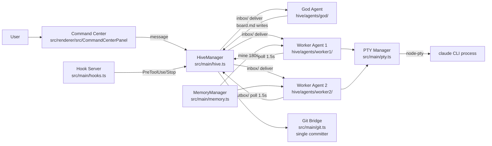
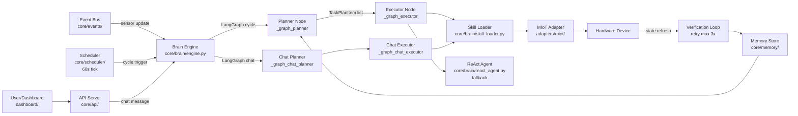
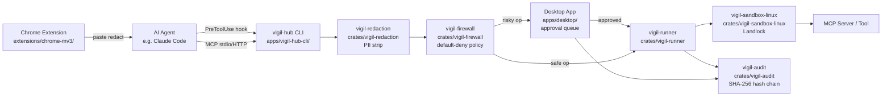

# Agentic AI Weekly Scan — 2026-06-06

## Executive Summary

- **Tuần này nổi bật về memory và guardrails:** Hai trong bốn repo đào sâu vào vấn đề bộ nhớ persistent cho agent (`memory-os` với 7-layer hierarchy, `munder-difflin` với file-based stigmergy), trong khi `vigils` đặt ra chuẩn mực mới về production security với Rust + hash-chained audit log.
- **Pattern dominant là Planner-Executor và Hierarchical Supervisor**, không phải ReAct thuần túy — `Anima` dùng LangGraph hai graph (cycle + chat), `munder-difflin` dùng GOD orchestrator + worker pattern. ReAct chỉ xuất hiện như fallback trong Anima.
- **Khoảng trắng đáng chú ý:** Không có repo nào implement distributed tracing hay cost-tracking — production observability vẫn là gap lớn trong hệ sinh thái agentic tuần này.

## Table of Contents

1. [ClaudioDrews/memory-os](#1-claudiodrewsmemory-os) — 7-layer memory OS, ★887
2. [chaitanyagiri/munder-difflin](#2-chaitanyagirimunder-difflin) — Multi-agent harness cho Claude Code, ★339
3. [Fullive-AI/Anima](#3-fullive-aianima) — Agent OS cho hardware IoT, ★331
4. [duncatzat/vigils](#4-duncatzatvigils) — Control plane + guardrails cho AI agents, ★281

---

## 1. ClaudioDrews/memory-os

> https://github.com/ClaudioDrews/memory-os

### §1 — Quick Context

**One-line pitch:** Hệ thống bộ nhớ 7 tầng, local-first, provider-agnostic cho Hermes Agent — Qdrant vector search, SQLite history, và surgical context injection để agent không còn quên.

**Tech stack:** Python 3.11+, Qdrant v1.17.1 (4096-dim cosine + BF25 sparse hybrid), Redis 7 + ARQ Worker, SQLite FTS5, Docker Compose; LLM provider-agnostic (OpenRouter/OpenAI/Anthropic/Ollama).

**Repo health:** ★887, 88 forks, 1 contributor (solo), last commit 2026-06-05, test duy nhất là `_test_sanitize.py`, không có CI pipeline.

---

### §2 — Architecture Deep-Dive

#### A. Component Inventory

| Component | File Path | Vai trò |
|-----------|-----------|---------|
| `Workspace Layer` | `layers/01-workspace.md` | Inject MEMORY.md, USER.md, CREATIVE.md vào system prompt |
| `Session Store` | `layers/02-sessions.md` | SQLite với FTS5 — toàn bộ conversation history |
| `Fact Store` | `layers/03-fact-store.md` | Structured facts với entity resolution và trust scoring |
| `Icarus Fabric` | `icarus/` + `layers/04-icarus-fabric.md` | LLM-powered extraction, 16 specialized tools, multi-source injection |
| `Qdrant Vector DB` | `layers/05-qdrant.md` | Hybrid vector search; semantic deduplication |
| `LLM Wiki` | `layers/06-llm-wiki.md` | Auto-curated concept vault; continuously ingested vào Qdrant |
| `Ground Truth Hierarchy` | `layers/07-ground-truth.md` | SOUL.md + rulebooks — designate injected memory là authoritative |
| `ARQ Worker` | `docker/` | Python async task queue; orchestrates embedding pipeline |
| `Vault Curator` | external (`ClaudioDrews/vault-curator`) | Weekly enrichment: frontmatter, semantic links, index |
| `Setup Script` | `setup.sh` | One-command Docker + database initialization |

#### B. Control Flow — Memory Retrieval Plugin Pattern

Memory-os **không phải agent runtime** — đây là memory infrastructure plugin cho Hermes Agent. Pattern: layered context injection với authority hierarchy.

1. User message đến Hermes Agent
2. Icarus Plugin (`icarus/`) intercepts request, bắt đầu context assembly
3. **Layer 7 inject trước:** SOUL.md + rulebooks làm nền authoritative
4. **Layer 1–4 inject tiếp:** Workspace files, SQLite FTS5 session search, structured facts
5. **Layer 5 semantic recall:** Qdrant hybrid query trả về relevant concepts/facts
6. Assembled context → LLM generates response với full persistent memory
7. *(Background)* ARQ Worker chạy hourly: SHA-256 change detection → vectorize mới → Qdrant; Vault Curator weekly enrich

#### C. State & Data Flow

- **Message format:** Plain Markdown files (MEMORY.md, USER.md, CREATIVE.md) injected vào system prompt — không có typed schema giữa layers
- **State storage:** SQLite (sessions/facts), Qdrant (vectors 4096-dim), Redis (ARQ queue), filesystem (Markdown)
- **Context window strategy:** Surgical injection — chỉ retrieve relevant memories, KHÔNG dump toàn bộ context. Ground Truth layer đảm bảo injected memory được LLM prioritize.

#### D. Tool / Capability Integration

- 16 Icarus tools cho LLM-powered extraction (tool list không public trong README)
- Integration là plugin-level với Hermes Agent — không phải MCP, không phải function-calling standard
- Không có sandboxing/validation evidence từ code

#### E. Memory Architecture

- **Short-term:** In-session SQLite log (`layers/02-sessions.md`) + Workspace Markdown files
- **Long-term:** Qdrant 4096-dim (cosine similarity + BF25 sparse hybrid) + LLM Wiki (`layers/06-llm-wiki.md`)
- **Summarization:** Vault Curator weekly — semantic links, frontmatter enrichment, decay archive
- **Retrieval:** Hybrid semantic (vector cosine) + keyword (SQLite FTS5)
- **Deduplication:** Semantic deduplication tại Qdrant ingestion

#### F. Model Orchestration

- Provider-agnostic: `OPENROUTER_API_KEY` cho embeddings + extraction
- Embedding dimensions: 4096 (must match Qdrant schema — env var `EMBEDDING_DIMS`)
- Không có multi-model routing hay fallback evidence từ code

#### G. Observability & Eval

- `_test_sanitize.py` — test duy nhất, không có CI
- ARQ Worker task queue cho pipeline visibility (Redis-backed)
- Không có tracing/metrics/eval framework

#### H. Extension Points

- Multi-provider support qua `.env` API key config
- Layer docs trong `layers/` gợi ý pluggable design nhưng không có plugin interface rõ ràng
- Docker Compose cho local deployment isolation

---

### §3 — Architecture Diagram



---

### §4 — Verdict

**Điểm novel / đáng học:**
- **Layer 7 Ground Truth Hierarchy** là insight quan trọng nhất: injected memory phải được mark là *authoritative*, không chỉ là optional context. Đây là giải pháp thực tế cho vấn đề LLM silently ignores injected context khi context window đầy.
- **Hybrid retrieval design** (4096-dim cosine + BF25 sparse trên cùng Qdrant collection) với semantic deduplication là implementation solid — ít framework nào implement đủ cả hai tại layer storage.

**Red flags:**
- Solo contributor, không CI, test coverage cực thấp. Icarus fork có thể drift khỏi upstream. Hermes Agent là closed-source host — toàn bộ system phụ thuộc vào một dependency không public.
- 887 stars trong 7 ngày: velocity nhanh dấy lên câu hỏi về tính bền vững.

**Open questions:**
- 16 Icarus tools là gì cụ thể? Có publicly documented không?
- Vault Curator versioning strategy khi là separate repo?
- Ground Truth injection được implement như thế nào tại code level — rule-based hay prompt engineering?

---

## 2. chaitanyagiri/munder-difflin

> https://github.com/chaitanyagiri/munder-difflin

### §1 — Quick Context

**One-line pitch:** Desktop app biến Claude Code CLI sessions thành team agent tự trị với GOD orchestrator, visual office floor Pixi.js, và on-disk message routing.

**Tech stack:** Electron + React + TypeScript, Pixi.js (office floor), xterm.js (terminals), node-pty (PTY processes), MemPalace CLI (semantic memory, external), Git (audit layer).

**Repo health:** ★339, 36 forks, 1 contributor, v0.1.7, last commit 2026-06-05, có HIVE.md + SPEC.md + DESIGN.md + MEMORY_GRAPH_SPEC.md (well-documented), macOS-first.

---

### §2 — Architecture Deep-Dive

#### A. Component Inventory

| Component | File Path | Vai trò |
|-----------|-----------|---------|
| `PTY Manager` | `src/main/pty.ts` | Quản lý real `claude` CLI processes qua node-pty |
| `HiveManager` | `src/main/hive.ts` | Multi-agent coordination: routing, delivery, registry, hop-cap |
| `Hook Server` | `src/main/hooks.ts` | Unix socket — intercept Claude Code lifecycle (PreToolUse, Stop) |
| `MemoryManager` | `src/main/memory.ts` | MemPalace CLI integration cho semantic memory |
| `GitHub Bridge` | `src/main/github.ts` | GitHub issue và CI integration |
| `Git Bridge` | `src/main/git.ts` | Single-committer git layer — audit trail |
| `File Bridge` | `src/main/fs.ts` | Filesystem ops cho hive directory |
| `God Agent` | `hive/agents/god/` (runtime dir) | Privileged orchestrator: owns board.md, routes tasks |
| `Office Floor` | `src/renderer/src/scene/office/` | Pixi.js visual layer — agent avatars + message animations |
| `Task Kanban` | `src/renderer/src/TasksKanban` | Dependency-aware task board |
| `Command Center` | `src/renderer/src/CommandCenterPanel` | User interface to god agent |
| `Thread Panel` | `src/renderer/src/ThreadsPanel` | Message thread viewer |

#### B. Control Flow — Hierarchical Supervisor Pattern

Munder-difflin implement **hierarchical supervisor + stigmergy**: God Agent là supervisor, worker agents là subordinates, và coordination xảy ra qua on-disk environment modification (stigmergy).

1. User gửi task qua Command Center (`src/renderer/src/CommandCenterPanel`) → routed tới God Agent
2. God Agent (`hive/agents/god/`) nhận task, decompose → writes to `hive/board.md` (shared blackboard) và `hive/tasks.json` (task ledger)
3. HiveManager (`src/main/hive.ts`) route task assignments vào worker agents' `inbox/` directories
4. Worker agent đọc inbox, PTY Manager (`src/main/pty.ts`) spawn thực tế `claude` CLI process
5. Agent execute task, write results/outgoing messages vào `outbox/`
6. HiveManager.routeOnce() **polls mọi outbox mỗi 1.5 giây**, deliver messages, move sent to `.sent/`
7. Hop-cap 12 prevent infinite loops; Stop hook fires khi agent complete
8. Git Bridge (`src/main/git.ts`) commit toàn bộ changes với single-committer pattern

#### C. State & Data Flow

- **Message format:** Typed JSON `HiveMessage` — FIPA-lite schema với 7 fields: `id, conversation, in_reply_to, from, to, act, subject, body, hops`; `act` enum: `request|inform|propose|query|agree|refuse|done`
- **State storage:** On-disk filesystem (`hive/` directory tree), Git (audit), SQLite via MemPalace (optional)
- **Context window:** Per-agent `memory.md` loaded tại task start + optional MemPalace wake-up digest (~600–900 tokens) qua `src/main/memory.ts`

```
hive/
├── registry.json       # agent roster + status
├── board.md            # shared blackboard (god-only write)
├── tasks.json          # task ledger
├── log.jsonl           # append-only event log
└── agents/<agentId>/
    ├── identity.md
    ├── memory.md
    ├── cursor.json     # message read cursor
    ├── inbox/
    ├── outbox/
    └── .sent/
```

#### D. Tool / Capability Integration

- Không có custom tool registration — dùng Claude Code native tool suite hoàn toàn
- Hook Server (`src/main/hooks.ts`) intercept qua Unix socket (PreToolUse events)
- GOD agent control qua message passing, không inject tools trực tiếp
- Approval workflow: human-critical decisions surface native trong Claude Code sessions (không cần separate approval UI)

#### E. Memory Architecture

- **Short-term:** Per-agent `memory.md` markdown trong `hive/agents/{id}/memory.md` — read tại task start
- **Long-term:** MemPalace CLI (external dep) — mine changed `memory.md` files mỗi 180 giây vào "wings" (per-agent namespaces)
- **Summarization:** không có automatic summarization — agents tự write/update `memory.md`
- **Retrieval:** Semantic search qua MemPalace CLI subprocess (`mempalace search`) với embedding models `minilm` hoặc `embeddinggemma`
- **Key design choice:** Vector DB như Letta/Mem0 bị reject explicitly — "architecturally wrong at 5–15 agents" vì chúng muốn own the runtime

#### F. Model Orchestration

- Tất cả agents chạy actual Claude (full model) qua Claude Code CLI
- Không có model tier differentiation (planner/executor dùng cùng model)
- Không có parallelism management — each agent là separate OS process

#### G. Observability & Eval

- Append-only `hive/log.jsonl` event log
- Git history làm audit trail (single-committer, mọi file change được version)
- Kanban board cho task status visualization
- Không có OpenTelemetry, Langfuse, hay cost tracking

#### H. Extension Points

- Custom agent roles qua `AgentMeta` schema tại spawn time (role, capabilities, isGod, isAssistant flags)
- `isAssistant` = send-only agent (excluded from broadcast fan-out)
- MemPalace backend swappable qua model config (`minilm` vs `embeddinggemma`)
- Git Bridge có thể point tới bất kỳ git repo nào

---

### §3 — Architecture Diagram



---

### §4 — Verdict

**Điểm novel / đáng học:**
- **File-based stigmergy** (on-disk outbox/inbox thay vì message broker): design có lý do rõ ràng — git audit trail miễn phí, không cần Redis/Kafka, crash-safe qua filesystem atomicity. Pattern này transferable sang bất kỳ multi-agent system nào cần audit-first design.
- **FIPA-lite speech acts** (`agree/refuse/done`) cho semantic message routing — rare trong open-source multi-agent. Chỉ `request/query/propose` mới obligate reply, phòng tránh infinite response loops theo formal protocol.
- **Single-writer-per-file constraint** (`board.md` chỉ God Agent write): giải quyết concurrent write problem bằng convention, không cần distributed lock.

**Red flags:**
- 1.5s polling interval tạo latency trong high-frequency loops. Với >10 agents polling outboxes đồng thời, I/O overhead có thể đáng kể.
- MemPalace là external undocumented dependency — không có public API docs, sustainability unclear.
- node-pty subprocess management chưa test được ở quy mô lớn (>10 agents).

**Open questions:**
- Hop-cap 12 — có đủ cho complex multi-step tasks hay không? Basis của con số này là gì?
- MemPalace không có public documentation — adoption risk cao.
- Performance degradation khi hive directory lớn (thousands of messages)?

---

## 3. Fullive-AI/Anima

> https://github.com/Fullive-AI/Anima

### §1 — Quick Context

**One-line pitch:** Agent OS open-source cho hardware IoT — biến Xiaomi smart devices từ "connected device" thành collaborative agent với LangGraph, skill system, và long-term learning memory.

**Tech stack:** Python 3.11+, FastAPI, LangGraph, aiomqtt, OpenAI-compatible API, React/TypeScript dashboard, Docker Compose; uv package manager, pytest + ruff + pre-commit.

**Repo health:** ★331, 8 forks, org account (Fullive-AI), last commit 2026-06-03, có ARCHITECTURE_GUARDRAILS.md + CHANGELOG.md, CI: pre-commit hooks, pytest suite.

---

### §2 — Architecture Deep-Dive

#### A. Component Inventory

| Component | File Path | Vai trò |
|-----------|-----------|---------|
| `Brain Engine` | `core/brain/engine.py` | Orchestrates hai LangGraph graphs (cycle + chat) |
| `ReAct Agent` | `core/brain/react_agent.py` | 8-step ReAct loop với OpenAI function calling (fallback) |
| `Skill Loader` | `core/brain/skill_loader.py` | Load và summarize device skill packages |
| `Planner Node` | `_graph_planner` in `core/brain/engine.py` | LangGraph node: generate TaskPlanItem list từ device+memory state |
| `Executor Node` | `_graph_executor` in `core/brain/engine.py` | LangGraph node: sort và run tasks, dispatch skill handlers |
| `Memory Store` | `core/memory/` | L1/L2/L3 layered memory với preference extraction |
| `Device Registry` | `core/devices/` | Discovery orchestrator với MIoT + virtual adapters |
| `Event Bus` | `core/events/` | Async pub/sub cho inter-component communication |
| `Scheduler` | `core/scheduler/` | Periodic jobs: device scan, brain cycles, preference learning |
| `API Server` | `core/api/` | FastAPI REST + SSE cho dashboard |
| `MIoT Adapter` | `adapters/miot/` | Xiaomi MIoT protocol translation (QR login, local control) |
| `Skills` | `skills/` | Device-type packages: light, humidifier, ac, air_purifier, speaker, coordinator, device_discovery, skill_creator |
| `Dashboard` | `dashboard/` | React + Vite monitoring UI với real-time SSE |

#### B. Control Flow — Planner-Executor với LangGraph (2 graphs)

Anima sử dụng **Planner-Executor pattern** được implement qua hai LangGraph graphs riêng biệt cho hai triggering scenarios khác nhau.

**Cycle Graph** (proactive/scheduled):
1. Trigger: sensor update qua Event Bus (`core/events/`) hoặc Scheduler 60s tick
2. Brain Engine (`core/brain/engine.py`) invoke cycle graph: `entry → planner → executor → END`
3. Planner node (`_graph_planner`): build context (device state + user memory + skills) → generate `TaskPlanItem` list
4. Executor node (`_graph_executor`): sort tasks by priority, dispatch tới skill handler
5. Skill handler (`skills/`) execute qua MIoT Adapter (`adapters/miot/`)
6. **Verification loop:** refresh device state, compare vs expected, retry tối đa 3x khi mismatch

**Chat Graph** (reactive/user-triggered):
1. User message qua API Server (`core/api/`) → chat graph: `entry → planner → executor → END`
2. Chat planner classify intent: `skill_create | system_action | execute_skill | ask_user | reply`
3. Executor processes classified tasks, returns aggregated result via SSE

#### C. State & Data Flow

- **State schema:** `BrainCycleState` / `ChatState` TypedDicts với `total=False` (partial updates)
- **LangGraph state:** Immutable dict merge per node — no mutable shared state
- **Persistence:** `data/config.json`, `history.json` (per device-type), `learned.json` (per-device profiles)
- **Context window:** Không có context compression evidence — structured state trong TypedDict

#### D. Tool / Capability Integration

- 4 static tools trong ReAct agent (`core/brain/react_agent.py`): `get_devices`, `get_skill`, `execute_skill`, `get_environment`
- OpenAI function calling với `"auto"` tool selection
- Validation: Pydantic models cho tất cả state schemas (`BrainCycleState`, `SkillPlanItem`, `ActionVerificationResult`)
- Skill extension: device-type package với `execute()` handler + fallback LLM decision-making
- `skill_creator` system skill: LLM generates mới skills tại runtime

#### E. Memory Architecture

- **L1 Core Identity:** `preferences_summary` — compact user/device preference profile
- **L2 Memory Directory:** Index của available memory profiles
- **L3 Memory Detail:** `learned.json` per-device historical contexts và patterns
- **Extraction:** Background preference learning job qua Scheduler (`core/scheduler/`)
- **Retrieval:** Không xác định từ code — có thể structured lookup thay vì vector search

#### F. Model Orchestration

- Single OpenAI-compatible endpoint (provider-agnostic: OpenAI, DeepSeek, Ollama)
- ReAct agent: streaming, tối đa 8 steps, suppress intermediate reasoning nếu có tool call
- Planner + Executor dùng cùng model endpoint — không có tier differentiation
- Bilingual support: language detection + enforcement injection sau mỗi tool result

#### G. Observability & Eval

- `tests/` directory với pytest-asyncio + coverage — có CI
- `ARCHITECTURE_GUARDRAILS.md` — documented architectural constraints (bilingual EN+ZH)
- Pre-commit hooks (ruff linting)
- SSE push tới dashboard cho real-time monitoring
- Không có OpenTelemetry / distributed tracing / cost tracking

#### H. Extension Points

- Custom skills: add package vào `skills/` với `execute()` handler
- `skill_creator` system skill: LLM-generated skills tại runtime (stored format không rõ)
- Adapter framework: pluggable ngoài MIoT (hiện chỉ 1 adapter)
- Config qua pydantic-settings + `.env`

---

### §3 — Architecture Diagram



---

### §4 — Verdict

**Điểm novel / đáng học:**
- **Double-graph design** (cycle graph cho proactive automation + chat graph cho reactive conversation) trong cùng Brain Engine là pattern elegant cho IoT domain — phân biệt rõ hai triggering paths mà không cần code duplication.
- **Verification loop** sau action execution (3 retries khi device state mismatch): practice production-grade mà ít LLM frameworks implement — critical trong IoT vì actuator failures là common.
- **`skill_creator` system skill**: meta-learning mechanism — agent có thể extend capability của chính nó tại runtime. Concept đáng theo dõi khi implementation mature hơn.

**Red flags:**
- Memory retrieval strategy không rõ (structured lookup hay vector?) — đây là critical component nhưng không documented trong code.
- Chỉ có 1 adapter (MIoT) dù claim extensible framework. Claims và implementation còn khoảng cách lớn.
- `aiomqtt` là dependency nhưng không thấy MQTT được dùng trong architecture docs — unclear role.
- Bilingual enforcement qua system prompt injection không reliable — có thể bị model ignore.

**Open questions:**
- `skill_creator` tạo skill dưới dạng gì — Python module? Stored ở đâu? Có sandbox execution không?
- Memory retrieval qua structured lookup hay vector? Ảnh hưởng thế nào khi device fleet scale?
- MQTT (`aiomqtt`) integrate ở điểm nào trong control flow?

---

## 4. duncatzat/vigils

> https://github.com/duncatzat/vigils

### §1 — Quick Context

**One-line pitch:** Control plane Rust-native cho AI agents — intercept, redact PII, apply policy, approve risky ops, sandbox execution, và audit toàn bộ với SHA-256 hash-chained ledger.

**Tech stack:** Rust workspace (15 crates + 3 apps), Tauri 2 + Vue 3, SQLite (FTS5 + hash chain), WebAssembly (Wasmtime), Linux Landlock LSM, Chrome MV3 extension (zero npm deps).

**Repo health:** ★281, 14 forks, 1 contributor (duncatzat), v0.1.15 released 2026-06-06, GitHub Actions CI, active development (15 releases in ~7 days).

---

### §2 — Architecture Deep-Dive

#### A. Component Inventory

| Component | File Path | Vai trò |
|-----------|-----------|---------|
| `vigil-audit` | `crates/vigil-audit` | SQLite ledger với SHA-256 hash chain, FTS5 full-text search |
| `vigil-policy` | `crates/vigil-policy` | Rust DSL rule engine — default-deny, per-agent rules |
| `vigil-firewall` | `crates/vigil-firewall` | Tool gating, per-agent rules, OAuth scope allowlists |
| `vigil-redaction` | `crates/vigil-redaction` | Hard fingerprint + ML-based secret/PII detection |
| `vigil-lease` | `crates/vigil-lease` | RAII credential leasing với auto-revocation khi drop |
| `vigil-runner` | `crates/vigil-runner` | Native + Wasm process execution |
| `vigil-runner-types` | `crates/vigil-runner-types` | Shared execution type definitions |
| `vigil-sandbox-linux` | `crates/vigil-sandbox-linux` | Linux Landlock LSM filesystem isolation |
| `vigil-mcp` | `crates/vigil-mcp` | MCP Hub/gateway, descriptor pinning, approval broker |
| `vigil-browser` | `crates/vigil-browser` | Browser integration layer |
| `vigil-http-auth` | `crates/vigil-http-auth` | HTTP authentication |
| `vigil-http-transport` | `crates/vigil-http-transport` | HTTP transport |
| `vigil-sdk` | `crates/vigil-sdk` | Plugin/integration SDK |
| `vigil-ui-protocol` | `crates/vigil-ui-protocol` | UI/Desktop protocol type definitions |
| `vigil-types` | `crates/vigil-types` | Shared types across workspace |
| `CLI Gateway` | `apps/vigil-hub-cli/` | `vigil-hub` binary: MCP endpoint + wrap command |
| `Desktop App` | `apps/desktop/` | Tauri 2 + Vue 3: approval queue, activity feed, server registry |
| `Native Host` | `apps/native-host/` | Chrome native messaging bridge |
| `Chrome Extension` | `extensions/chrome-mv3/` | MV3, zero npm deps — paste redaction trên AI sites |

#### B. Control Flow — Event-Driven Interception Pipeline

Vigils implement **event-driven security pipeline** — không orchestrate agents mà intercept tại execution boundary.

1. AI agent (e.g., Claude Code) invoke tool call
2. vigil-hub (`apps/vigil-hub-cli/`) intercept qua **hai điểm**:
   - Claude Code `PreToolUse` hook (Unix socket)
   - MCP gateway (stdio/HTTP upstream cho MCP servers)
3. **Stage 1 — Redaction** (`vigil-redaction`): strip secrets/PII trước khi bất kỳ storage hay log nào thấy
4. **Stage 2 — Policy + Firewall** (`vigil-policy` + `vigil-firewall`): evaluate default-deny rules per-agent
5. **Stage 3 — Approval Gate** (`vigil-mcp`): risky operations queued trong Desktop app (`apps/desktop/`) cho human review
6. **Stage 4 — Execution** (`vigil-runner`): approved actions run trong sandbox
7. **Stage 5 — Sandbox** (`vigil-sandbox-linux`): Wasm (Wasmtime) hoặc native process với Linux Landlock filesystem isolation
8. **Stage 6 — Audit** (`vigil-audit`): append to tamper-evident SQLite ledger với SHA-256 hash chain

#### C. State & Data Flow

- **Message format:** Typed Rust structs qua `vigil-types` crate — strongly typed, no stringly-typed APIs
- **State storage:** SQLite (`vigil-audit`) cho audit ledger + FTS5 search; in-memory cho approval queue
- **Credential lifecycle:** RAII lease objects (`vigil-lease`) — auto-revoke khi Rust ownership dropped

#### D. Tool / Capability Integration

- Sits **upstream** của MCP servers — transparent proxy qua stdio/HTTP
- `vigil-hub wrap` (v0.1.14): transparent shim wrapping existing tool commands — không cần modify agent code
- v0.1.15: wrap cả user-scope + local-scope Claude Code MCP servers; collision-resistant IDs (`local-<project-hash>-<name>`)
- Descriptor pinning (`vigil-mcp`): validate tool call signatures tại call-time
- Sandbox: Wasmtime execution hoặc native process + Linux Landlock (Linux-only)

#### E. Memory Architecture

Không có — vigils là control plane, không phải agent. Skip.

#### F. Model Orchestration

Không có — vigils không orchestrate models. Skip.

#### G. Observability & Eval

- **Tamper-evident audit log** (`vigil-audit`): SHA-256 hash chain — forensic-grade, detect any ledger modification
- FTS5 full-text search trên audit records trong Desktop UI
- Desktop App real-time activity feed + approval queue visualization
- Rust workspace modular crates: mỗi crate independently unit-testable
- GitHub Actions CI pipeline
- Không có OpenTelemetry / distributed tracing (single-machine scope)

#### H. Extension Points

- `vigil-sdk` crate: plugin SDK cho custom integrations
- `vigil-policy` DSL: custom rules per-agent
- `vigil-hub wrap` command: extend protection tới bất kỳ MCP server nào
- `--user-scope-only` flag cho selective protection scope
- Browser extension: pluggable redaction patterns

---

### §3 — Architecture Diagram



---

### §4 — Verdict

**Điểm novel / đáng học:**
- **SHA-256 hash-chained SQLite audit log** (`vigil-audit`): forensic-grade tamper detection — nếu bất kỳ record nào bị modify, chain breaks. Đây là enterprise security pattern applied vào open-source agent tooling — không thấy ở framework khác.
- **RAII credential leasing** (`vigil-lease`): Rust ownership semantics applied to security — credential tự động revoke khi scope ends, không cần explicit cleanup. Memory-safe security pattern elegant và novel trong AI context.
- **`vigil-hub wrap`** (v0.1.14): transparent MCP shim — wrap existing MCP server command mà không cần modify agent code. Adoption path rất thấp — `vigil-hub wrap npx @modelcontextprotocol/server-filesystem` là đủ.

**Red flags:**
- Rust + Tauri barrier to entry cao cho Python/JS-native AI developers — adoption friction lớn.
- `vigil-sandbox-linux` chỉ Linux — macOS/Windows users miss Landlock isolation (strongest layer).
- Solo contributor với velocity cao (v0.1.15 trong 7 ngày) — sustainability risk. 15 releases trong 7 ngày là red flag về stability.
- vigil-policy DSL expressiveness chưa documented — không rõ có đủ powerful cho complex rules không.

**Open questions:**
- vigil-policy DSL syntax — có support temporal rules (rate limiting, time-of-day gating) không?
- Performance overhead của Wasmtime execution vs native — latency budget cho interactive agent?
- ML-based redaction trong `vigil-redaction` — model size? False positive rate trên code paths?
- macOS/Windows sandbox alternative?

---

*Scan thực hiện: 2026-06-06 | Nguồn: GitHub Search API, raw README/source fetch | Repos verified HTTP 200*
