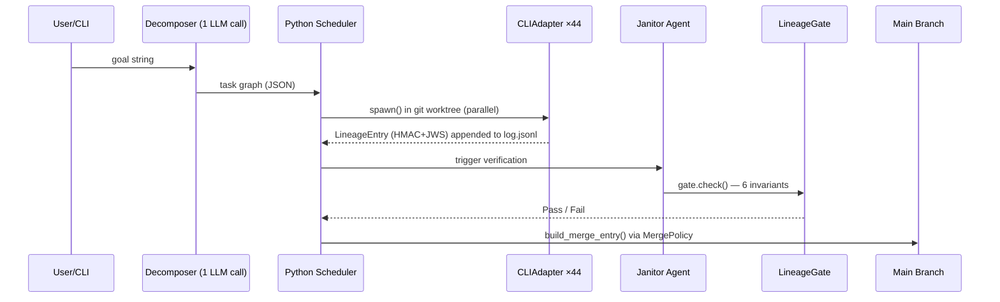
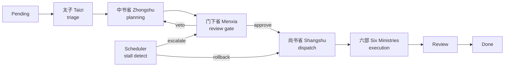
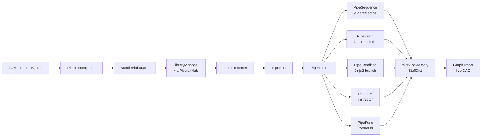
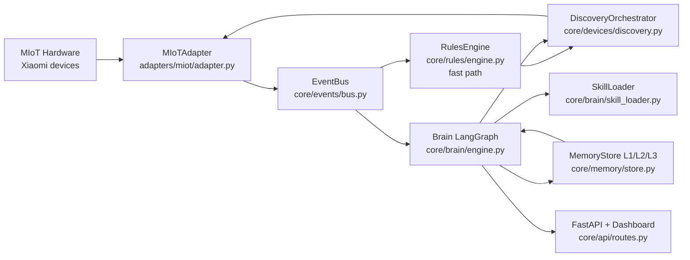

# Weekly Agentic AI Research Scan — 2026-06-07

## Executive Summary

- **Tuần này nổi bật về compliance và governance**: `bernstein` ra mắt kiến trúc multi-agent đầu tiên có HMAC-chained per-artefact lineage log + signed agent cards (Ed25519/JWS), trực tiếp trả lời yêu cầu EU AI Act Article 12 — không phải bolt-on, mà là first-class design.
- **Pattern novel nhất**: `edict` map hệ thống quan liêu nhà Đường (三省六部制) lên agent topology, với Menxia (门下省) là mandatory veto gate forcing re-plan loop và LinUCB bandit router chọn agent theo context — kiến trúc hoàn toàn không có trong các framework mainstream.
- **Hai hướng productionisation khác nhau**: `Pipelex` đi theo hướng DSL declarative (TOML + MTHDS standard) với Temporal.io integration cho durable distributed workflows; `Anima` đi theo hướng hardware-first với dual LangGraph brain, three-tier file-based memory, và MIoT adapter abstraction cho Xiaomi smart home.

## Table of Contents

- [1. bernstein — Audit-grade multi-agent orchestration](#1-bernstein)
- [2. edict — Kiến trúc 三省六部制 làm agent topology](#2-edict)
- [3. Pipelex — TOML DSL cho composable AI workflows](#3-pipelex)
- [4. Anima — Agent OS cho Xiaomi smart home hardware](#4-anima)

---

## 1. bernstein

**Link**: https://github.com/sipyourdrink-ltd/bernstein

### §1 — Quick Context

**One-line pitch**: Orchestrator compliance-grade cho CLI coding agents với HMAC-chained audit log và signed agent cards, không dùng LLM để schedule.

**Tech stack**: Python ≥3.10, FastAPI + Uvicorn (REST), Textual (TUI), Click (CLI), `cryptography` (Ed25519/JWS), `opentelemetry-api/sdk`, `prometheus-client`, Pydantic v2, `mcp≥1.0`, optional PostgreSQL, Redis, gRPC; hỗ trợ 44 CLI coding agent adapters (Claude Code, Codex, Aider…).

**Repo health**: 553 stars, created 2026-03-22, pushed 2026-06-06. CI/tests: có `mutmut` mutation testing coverage, pytest suite, CI xanh.

---

### §2 — Architecture Deep-Dive

#### A. Component Inventory

- `Decomposer` (LLM, 1 lần duy nhất) — `src/bernstein/cli/main.py`: nhận goal string, trả task graph JSON. **Duy nhất 1 LLM call trong toàn bộ scheduling pipeline.**
- `Python Scheduler` (`src/bernstein/cli/main.py`, background thread): đọc task graph, dispatch agents song song, deterministic hoàn toàn — không có LLM tham gia.
- `CLIAdapter` (`src/bernstein/adapters/base.py`): abstract base class bọc 44 heterogeneous CLI agents; có `spawn()`, `kill()`, `_start_timeout_watchdog()`, `_probe_fast_exit()`, `RateLimitMeter` (rolling 300s window, exponential backoff).
- `LineageStore` (`src/bernstein/core/lineage/store.py`): file-backed, thread+process-safe, atomic via `fcntl.flock(LOCK_EX)` + `os.fsync`. Layout: `.sdd/lineage/log.jsonl` (source of truth), `by-artefact/`, `tips/`, `signatures/`.
- `LineageEntry` (`src/bernstein/core/lineage/entry.py`): frozen dataclass với `parent_hashes`, `content_hash`, `agent_card_kid`, `operator_hmac`; canonicalization theo RFC 8785 JCS.
- `LineageGate` (`src/bernstein/core/lineage/gate.py`): read-only enforcer, kiểm tra 6 invariants (byte-canonical, JWS signature, HMAC, parent chain, fork detection).
- `AgentCardSigner` (`src/bernstein/core/security/agent_card_signer.py`): Ed25519 detached JWS (RFC 7515 §A.5) over JCS-canonicalized `AgentIdentityCard`.
- `AgentCard` + `verify_detached()` (`src/bernstein/core/lineage/identity.py`): 8-check validation, `AgentCard` frozendc: `agent_id`, `kid`, `public_key_pem`, `protocol_version="a2a/1.0"`.
- `MergePolicy` (`src/bernstein/core/lineage/merge.py`): 3 implementations — `HumanPolicy` (default, raises `LineageConflict`), `FirstWriterPolicy` (earliest `ts_ns` wins), `AgentPolicy` (designated agent's tip wins).

#### B. Control Flow — Deterministic Planner + Parallel Dispatcher

Pattern: **Planner-Executor thuần deterministic** — scheduler là Python, không phải LLM.

1. User gõ `bernstein -g "goal"` → CLI dispatches tới `run.callback()`.
2. **1 LLM call** decompose goal → task graph (roles, owned files, completion signals).
3. Python scheduler đọc graph, spawn agents song song trong isolated git worktrees qua `CLIAdapter.spawn()`.
4. Agent viết code; `post_write_lineage_hook()` ghi `LineageEntry` (HMAC + JWS) vào `log.jsonl`.
5. Janitor agent chạy tests/lint/types; kết quả pass → gate check `LineageGate.check()`.
6. Gate pass → `build_merge_entry()` merge về main, `MergePolicy` resolve conflicts.

#### C. State & Data Flow

- Message format: YAML manifests (orchestration seeds) → Python dicts trong runtime.
- State storage: `.sdd/` directory, file-based, append-only JSONL.
- Context window: không có — mỗi agent nhận `fresh_context: true/false` theo manifest; không có sliding window hay RAG.

#### D. Tool / Capability Integration

- Pluggable qua Python entry points: `bernstein.adapters`, `bernstein.sandbox_backends`, `bernstein.skill_sources`, `bernstein.storage_sinks`, `bernstein.gates`, `bernstein.plugins`.
- Tool validation: MCP mode (`mcp≥1.0`) validate tool schema tại startup.
- Không có function-calling native — wrap CLI subprocesses qua `subprocess.Popen(start_new_session=True)`.

#### E. Memory Architecture

Không có memory dài hạn — mỗi run là stateless. `task-backlog.json` cho external worker claims; per-session JSONL logs tại `.sdd/agent_tokens/`.

#### F. Model Orchestration

- Decomposer: 1 frontier LLM call (model config qua env); executor agents là external CLIs, không có model assignment tập trung.
- Fallback: `RateLimitMeter` với exponential backoff; `_probe_fast_exit()` phân biệt rate-limit vs. spawn failure.

#### G. Observability & Eval

- OpenTelemetry: `opentelemetry-api/sdk≥1.41.1`, OTLP/gRPC.
- Prometheus: `prometheus-client≥0.21`.
- Audit log: `.sdd/audit/YYYY-MM-DD.jsonl` HMAC-signed per scheduling decision.
- Mutation testing: `mutmut≥3.5` cover claim-next logic + audit log integrity + lineage v1 semantics.
- Web UI: `bernstein gui serve` tại `127.0.0.1:8052`; TUI: `bernstein live`.
- RFC 3161 timestamps (`asn1crypto≥1.5`) cho multi-tenant export verification.
- Compliance PDF: `reportlab≥4.0` generate evidence pack cho EU AI Act.

#### H. Extension Points

User plug-in custom adapter bằng cách implement `CLIAdapter` ABC và register qua `bernstein.adapters` entry point. Custom merge policy, storage sink, gate đều qua entry points.

---

### §3 — Architecture Diagram

---

### §4 — Verdict

**Điểm novel**: Zero-LLM scheduling là insight quan trọng nhất — scheduling decisions deterministic, auditable, reproducible; không có "emergent" routing nào che khuất audit trail. Dual-layer tamper evidence (operator HMAC + agent JWS) với byte-canonical binding là engineering đáng học nhất tuần. Compliance as first-class concern (EU AI Act, HIPAA, SBOM generation) hiếm thấy ở repo open-source.

**Red flags**: `tastyeffectco/sandboxes` và các repo infra khác phụ thuộc nặng vào `openclaw` binary external — `bernstein` cũng tie chặt vào ecosystem này không rõ long-term support. Repo ~553 stars từ org mới, chưa có independent security audit.

**Open questions**: Behavior khi janitor fail nhiều lần liên tiếp trên flaky test? Lineage store có compaction strategy không (log.jsonl sẽ tăng mãi)?

---

## 2. edict

**Link**: https://github.com/cft0808/edict

### §1 — Quick Context

**One-line pitch**: Multi-agent orchestration lấy cảm hứng từ quan chế nhà Đường (三省六部制) với 11 specialized agents, mandatory veto gate và LinUCB router.

**Tech stack**: Python (49.7%), TypeScript/React 18 + Vite + Zustand (dashboard), Redis Streams (EventBus + Outbox Relay), `openclaw` CLI (external agent runtime), Docker (multi-stage: node:20-alpine → python:3.11-slim), port 7891.

**Repo health**: 15,995 stars, 1,688 forks, cộng đồng lớn (contributors ≥20), CI tests tại `tests/`, pushed 2026-06-07.

---

### §2 — Architecture Deep-Dive

#### A. Component Inventory

- `太子 Taizi` (`agents.json`, `dashboard/server.py` `_STATE_AGENT_MAP`): triage agent — phân biệt casual chat vs. formal task, route vào pipeline chính.
- `中书省 Zhongshu` (`agents.json`, `_STATE_AGENT_MAP`, `scripts/kanban_update.py`): planning — decompose task thành subtask DAG.
- `门下省 Menxia` (`agents.json`, `_STATE_AGENT_MAP`, `_VALID_TRANSITIONS`): mandatory review gate — approve hoặc veto (veto → loop về Zhongshu).
- `尚书省 Shangshu` (`agents.json`, `_STATE_AGENT_MAP`, `_ORG_AGENT_MAP`): dispatch coordinator — assign subtasks cho 6 bộ.
- `六部` Six Ministries (`agents.json`, `dashboard/court_discuss.py`, `_ORG_AGENT_MAP`): Hubu (data), Libu (docs), Bingbu (code/algorithm), Xingbu (security), Gongbu (CI/CD/infra), Libu_hr (skills mgmt).
- `早朝官 Zaochao` (`install.sh`, `agents.json`): news aggregation + Feishu push notifications.
- `KanbanEngine` (`scripts/kanban_update.py`): state machine enforcer — `_VALID_TRANSITIONS` Python dict.
- `Scheduler` (`dashboard/server.py`): stall detection (stallThresholdSec=600), retry/escalation (level 0→2), snapshot/rollback.
- `LinUCB Router` (`scripts/linucb_router.py`): contextual bandit algorithm (requires numpy) cho agent recommendation.
- `Dashboard/军机处` (`dashboard/server.py`, `dashboard/dist/`): React 18 + Python http.server zero-dep, 10 panels, port 7891.
- `CourtDiscuss` (`dashboard/court_discuss.py`): multi-agent discussion engine với emotion/action fields, 20-message context window.
- `EventBus` (Redis Streams): topics `task.created`, `task.planning`, `task.review.request`, `task.dispatch`, `agent.thoughts`.

#### B. Control Flow — State Machine / Hierarchical

Pattern: **State machine với Hierarchical supervisor (三省六部)**.

1. Task tạo ra ở trạng thái `Pending` → `Taizi` phân loại.
2. `Taizi → Zhongshu`: plan decomposition thành subtask DAG.
3. `Zhongshu → Menxia`: mandatory institutional review — approve → `Assigned`; veto → `Zhongshu` (re-plan loop).
4. `Menxia → Shangshu (Assigned)`: dispatch coordinator nhận plan đã approve.
5. `Shangshu → Doing`: các bộ thực thi; stall detection qua scheduler (600s threshold, max retry → escalation level 0→2).
6. `Doing → Review → Done` hoặc rollback về snapshot nếu escalation level ≥2.

State-to-agent mapping: `_STATE_AGENT_MAP = {'Taizi': 'taizi', 'Zhongshu': 'zhongshu', 'Menxia': 'menxia', 'Assigned': 'shangshu', 'Review': 'shangshu'}`.

#### C. State & Data Flow

- Task object: `{id, flow_log, progress_log, todos, _scheduler: {stallThresholdSec, maxRetry, escalationLevel, snapshot, rollbackCount}}`.
- Session storage: `~/.openclaw/agents/{agent_id}/sessions/*.jsonl` — mỗi dòng: `{"timestamp", "message": {"role": "assistant|user|toolresult", "content"}}`.
- File-based concurrency: `atomic_json_read/write/update` qua `file_lock` module.
- EventBus: Redis Streams với Outbox Relay pattern (at-least-once delivery).

#### D. Tool / Capability Integration

- Dispatch qua `subprocess`: `openclaw agent --agent {agent_id} -m {message} --timeout 300`.
- Skills management: dashboard panel 8, import remote skills từ GitHub URLs.
- Model config: per-agent LLM switching, ~5s hot reload qua `apply_model_changes.py` trigger Gateway restart.

#### E. Memory Architecture

Session JSONL per agent là toàn bộ memory — không có long-term vector store. `court_discuss.py` dùng 20-message sliding window cho multi-agent discussion.

#### F. Model Orchestration

- Mỗi agent có independent LLM config qua dashboard Model Configuration panel.
- LLM provider priority trong `court_discuss.py`: env vars → GitHub Copilot token → `~/.openclaw/openclaw.json` → rule-based simulation fallback.
- LinUCB router (`scripts/linucb_router.py`) recommend agent theo context; chi tiết implementation không fetch được (path 404 trên raw GitHub).

#### G. Observability & Eval

- Task `flow_log` + `progress_log` embedded trong mỗi task object.
- Dashboard real-time: 5-phase timeline replay cho completed tasks (panel 3 "Memorial Archives").
- Heartbeat badges: 🟢active, 🟡stalled, 🔴alert.
- Redis Streams EventBus preserve all state transitions.

#### H. Extension Points

Thêm agent mới: thêm entry vào `agents.json` + workspace trong `install.sh`. Import skill từ GitHub URL qua dashboard (panel 8).

---

### §3 — Architecture Diagram

---

### §4 — Verdict

**Điểm novel**: Veto gate bắt buộc (Menxia) tạo ra feedback loop tự nhiên giữa planning và review — không có framework mainstream nào có mandatory institutional review trước execution. LinUCB contextual bandit router là approach học máy thay vì hardcode routing rules. Stall detection với auto-escalation + snapshot rollback là production-grade safety net hiếm thấy.

**Red flags**: Phụ thuộc nặng vào `openclaw` CLI binary không include trong repo — nếu binary đóng nguồn thì full-stack không chạy được. Redis Streams là hidden dependency (không có trong `requirements.txt` hay docker-compose source install). `linucb_router.py` không fetch được — unclear nếu nó thực sự hoạt động hay chỉ là placeholder.

**Open questions**: LinUCB router train online hay offline? Nếu task veto 3 lần liên tiếp thì có halt không? Menxia agent dùng LLM nào và prompt như thế nào?

---

## 3. Pipelex

**Link**: https://github.com/Pipelex/pipelex

### §1 — Quick Context

**One-line pitch**: Execution engine cho MTHDS open standard — khai báo AI workflows bằng TOML với typed concepts, dynamic branching, và Temporal.io integration.

**Tech stack**: Python ≥3.10, `mthds≥0.3.0` (MTHDS standard), `instructor≥1.13` (structured output), `openai≥2.0`, `jinja2≥3.1.4`, `networkx≥3.4.2`, `opentelemetry-*`, optional `temporalio` (durable distributed workflows), optional `anthropic`, `boto3`, `mistralai`, `fal-client`, `linkup-sdk`.

**Repo health**: 682 stars, MIT, pushed 2026-06-07. Có `py.typed`, `datamodel-code-generator`, type stubs — production-grade Python packaging.

---

### §2 — Architecture Deep-Dive

#### A. Component Inventory

- `PipelexInterpreter` (`pipelex/core/interpreter/interpreter.py`): parse TOML `.mthds` files → validate `PipelexBundleBlueprint` → hand off `BundleElaborator`.
- `BundleElaborator` (`pipelex/core/interpreter/bundle_elaborator.py`): transform blueprint → register concepts + pipes vào `LibraryManager`.
- `PipelexHub` (`pipelex/hub.py`): singleton registry, `ContextVar` cho per-workflow library scoping; owns `LibraryManager`, `InferenceManager`, `PipelineManager`, observers.
- `PipelexRunner` (`pipelex/pipeline/runner.py`): public API; implement `RunnerProtocol`; nhận `PipelineInputs | WorkingMemory`.
- `PipeRun` (`pipelex/pipe_run/pipe_run.py`): execution coordinator — gọi `PipeRouter.run(pipe_job)`.
- `PipeRouter` (`pipelex/pipe_run/pipe_router.py`): dispatch pipe_job đến pipe implementation.
- `PipeJob` (`pipelex/pipe_run/pipe_job.py`): unit of work: `{pipe, working_memory, pipe_run_params, job_metadata, output_name, library_crate}`; dual-state (hydrated/raw) cho Temporal.
- `WorkingMemory` (`pipelex/core/memory/working_memory.py`): named `StuffDict`, Jinja2 context generation, dot-notation access.
- `PipeSequence` (`pipelex/pipe_controllers/sequence/pipe_sequence.py`): ordered chain, `evolving_memory` threads forward.
- `PipeBatch` (`pipelex/pipe_controllers/batch/pipe_batch.py`): fan-out parallel qua `gather_bounded(max_concurrency=...)`.
- `PipeCondition` (`pipelex/pipe_controllers/condition/pipe_condition.py`): dynamic branching — evaluate Jinja2 expression against `working_memory` → dispatch to matched pipe code.
- `PipeLLM` (`pipelex/pipe_operators/llm/pipe_llm.py`): LLM invocation với `instructor` cho structured output.
- `PipeFunc` (`pipelex/pipe_operators/func/pipe_func.py`): wrap Python function, registered by name trong class registry.
- `GraphTracer` (`pipelex/graph/graph_tracer.py`): build live DAG of execution, render sang Mermaid hoặc React Flow.
- `EventLog` (`pipelex/tracing/`): pluggable backends — `InMemoryEventLog`, `NDJSONEventLog`, `DynamoDBEventLog`, `BufferingEventLog`.

#### B. Control Flow — Static Planner-Executor với Dynamic Jinja2 Branching

Pattern: **Planner-Executor (static graph) + Runtime conditional routing**.

1. User load TOML bundle → `PipelexInterpreter` parse + validate.
2. `BundleElaborator` register tất cả concepts và pipes vào `LibraryManager` (load time — không có LLM).
3. `PipelexRunner.run(inputs)` → `PipeRun` tạo `PipeJob` với initial `WorkingMemory`.
4. `PipeRouter` dispatch tới root pipe (có thể là `PipeSequence`, `PipeBatch`, hoặc `PipeCondition`).
5. Nếu `PipeSequence`: iterate steps tuần tự, `evolving_memory` accumulate outputs qua mỗi bước.
6. Nếu `PipeCondition`: evaluate Jinja2 expression tại runtime → dispatch tới matched `pipe_code`. `default_outcome` handle unmatched.

#### C. State & Data Flow

- Message format: `Stuff` objects (typed `StuffContent` subclasses: `TextContent`, `StructuredContent`, `ListContent`, `ImageContent`, `DocumentContent`).
- State storage: `WorkingMemory` in-memory (dict), serializable sang `working_memory_raw: dict` cho Temporal.
- Context window: `WorkingMemory.generate_context()` tạo Jinja2 namespace — tất cả stuffs đều accessible; không có compaction.

#### D. Tool / Capability Integration

- `PipeFunc`: register Python function bằng tên vào class registry; `PipeFunc` resolve tại validation time. Return type phải là `StuffContent` subclass match declared output concept.
- `PipeLLM`: function-calling qua `instructor` (enforce Pydantic schema trên LLM output).
- `PipeSearch`: Linkup SDK (optional dep).
- `PipeImgGen`: FAL client (optional dep).

#### E. Memory Architecture

`WorkingMemory` là execution-scoped (single pipeline run). Không có long-term memory — nếu cần persistence, user phải `PipeFunc` write ra ngoài.

#### F. Model Orchestration

Cascading priority: pipe-level `model` field trong TOML → `model_deck.llm_choice_overrides` → `model_deck.llm_choice_defaults`. `LLMSettingChoices` có `for_text` và `for_object` riêng — cho phép dùng model khác nhau cho text generation vs. structured output extraction. Backend routing via `InferenceModelSpec` với fallback chains.

#### G. Observability & Eval

- OTel spans trên mỗi pipe: `_start_pipe_span()` / `_end_pipe_span_success()` / `_end_pipe_span_error()` trong `PipeAbstract` (`pipelex/core/pipes/pipe_abstract.py`).
- `GraphTracer` build live execution DAG, render sang Mermaid + React Flow.
- Dry-run mode: `PipeRunMode.DRY` — skip LLM calls, mock `StuffContent`, validate ALL branches của `PipeCondition` recursively.
- Pluggable `EventLogProtocol` với DynamoDB backend cho cloud persistence.

#### H. Extension Points

Viết TOML `.mthds` file với custom `domain` namespace + `Concept` types. Plug-in Python functions qua `PipeFunc`. Custom LLM backend qua `backend_library.py` + credential config.

---

### §3 — Architecture Diagram

---

### §4 — Verdict

**Điểm novel**: Dry-run mode validate ALL branches của `PipeCondition` recursively (không chỉ happy path) — đây là static analysis capability hiếm có. Tách `for_text` vs. `for_object` model trong một step là microoptimization thực tế. Temporal.io integration cho durable distributed workflow là production path rõ ràng — không phải promise.

**Red flags**: Phụ thuộc `mthds≥0.3.0` là external standard package chưa rõ governance. `kajson==0.6.0` pinned exact — fragile dependency. `PipelexHub` singleton + `ContextVar` là global state pattern phức tạp để debug trong concurrent environments.

**Open questions**: MTHDS open standard là gì, ai govern? `WorkingMemory` không có compaction — pipeline dài sẽ context explosion không? Dry-run mock content quality ra sao khi pipeline có conditional logic phức tạp?

---

## 4. Anima

**Link**: https://github.com/Fullive-AI/Anima

### §1 — Quick Context

**One-line pitch**: Agent OS điều khiển thiết bị Xiaomi MIoT bằng dual LangGraph brain, three-tier file memory, và deterministic rules fast path.

**Tech stack**: Python (71.7%), TypeScript/React+Vite (dashboard, 26.3%), `langgraph≥0.3.0`, `openai≥1.0` (AsyncOpenAI), `fastapi≥0.115`, `aiomqtt≥2.3.0`, Eclipse Mosquitto MQTT broker, `python-miio≥0.5.9` (optional `[miot]` extra), Pydantic v2, Docker + docker-compose.

**Repo health**: 394 stars, 9 forks, created 2026-06-01 (mới nhất tuần), Apache 2.0. Tests tại `tests/` (integration + e2e + skill tests).

---

### §2 — Architecture Deep-Dive

#### A. Component Inventory

- `Anima` class (`core/main.py`): root orchestrator, wires tất cả subsystems; startup phases: skill discovery → LLM config → mode dispatch (cli/full).
- `MIoTAdapter` (`adapters/miot/adapter.py`): Xiaomi MIoT hardware integration; UDP broadcast discovery (port 54321), Xiaomi Cloud QR login, token-based device identity (SHA256 of token).
- `BaseAdapter` ABC (`adapters/base.py`): `discover()`, `subscribe()`, `execute()`, `start()`, `stop()`.
- `Brain` (`core/brain/engine.py`): hai LangGraph StateGraphs riêng biệt — `BrainCycleState` (scheduler automation) và `ChatState` (user message).
- `ReActAgent` (`core/brain/react_agent.py`): tool-calling loop, max 8 steps, tools: `get_devices`, `get_skill`, `execute_skill`, `get_environment`; streaming `AsyncOpenAI`, `temperature=0.1`.
- `SkillLoader` (`core/brain/skill_loader.py`): scan directories cho `SKILL.md`, parse YAML frontmatter, load `actions.py` as module.
- `MemoryStore` (`core/memory/store.py`): 3-tier — L1 (compressed preferences, ~200 tokens, mọi request), L2 (directory index, planning context), L3 (full profiles, on-demand).
- `MemoryExtractor` (`core/memory/extractor.py`): LLM-driven, extract claims từ history, `claim_type`: explicit_preference | implicit_preference | routine | device_alias | constraint | context.
- `PreferenceLearningService` (`core/memory/learning.py`): promote confirmed memories, synthesize vào categorical buckets, custom skill linking via token-overlap scoring.
- `RulesEngine` (`core/rules/engine.py`): pre-LLM deterministic fast path — `Condition` (sensor, operator, threshold) + `Rule` (cooldown_seconds).
- `EventBus` (`core/events/bus.py`): async pub/sub, wildcard `"*"` support, events: `SENSOR_UPDATED`, `DEVICE_DISCOVERED`.
- `DiscoveryOrchestrator` (`core/devices/discovery.py`): unified device_id→Device registry, command routing.
- `FastAPI routes` (`core/api/routes.py`): 40+ endpoints; SSE stream `/api/brain/events`.
- `Scheduler` (`core/scheduler/scheduler.py`): asyncio job scheduler, `interval_seconds` config, powers autonomous brain ticks.

#### B. Control Flow — ReAct-style + Planner-Executor (Dual Graph)

Pattern: **Dual LangGraph — ReAct cho user chat, Planner-Executor cho autonomous cycles**.

Scheduler automation path (BrainCycleState graph):
1. `scheduler.py` trigger brain tick → `Brain.run_cycle()`.
2. `RulesEngine` check sensor thresholds (AQI > 5 → purifier on; temp ≥ 28°C → AC on; humidity < 35% → humidifier on) — nếu match, bypass LLM.
3. Nếu không match rules: `_graph_planner` node — build prompt từ device state + skill summaries + memory → LLM → JSON plan.
4. `_graph_executor` node — iterate tasks theo priority → `execute_device_skill()`.
5. `execute_device_skill()` → `DiscoveryOrchestrator.execute_command()` → `MIoTAdapter.execute()`.

User chat path (ChatState graph):
1. User message → `_graph_chat_planner` route: skill-creator fast path, system message handler, hoặc skill-aware plan.
2. `_graph_chat_executor` → execute resolved plan.

#### C. State & Data Flow

- Message format: `Device`, `DeviceCommand`, `Sensor`, `ActionResult` typed Pydantic models (`core/models.py`).
- State storage: file-based, no database — `data/memory/users/{user_id}/preferences.md`, `history.json`, `learned.json`, `memories/{slug}.json`.
- Context window: L1 memory (~200 tokens) inject vào mỗi request; L3 loaded on-demand.

#### D. Tool / Capability Integration

- Skills là **file-system packages**: `SKILL.md` (frontmatter + prompts) + `references/` + `scripts/actions.py`.
- `SkillLoader` resolve by device type hoặc skill name từ registry.
- `ReActAgent` tools: `get_devices`, `get_skill`, `execute_skill`, `get_environment` — model gọi qua native OpenAI function-calling.
- `skill_creator` skill (`skills/system/skill_creator/`): generate hoàn toàn new skill package từ natural language request tại runtime.

#### E. Memory Architecture

3-tier file-based:
- **L1 (short-term)**: compressed preferences + last interaction, ~200 tokens, loaded mọi request.
- **L2 (index)**: directory of available profiles + memory topics — chỉ index, không full content.
- **L3 (long-term)**: full learned profiles, history records — load on-demand qua `get_memory_detail()`.

Extraction pipeline: batch 50 history items → LLM extract claims với evidence tracking (`positive_evidence`, `negative_evidence` reference `event_id`) → candidate → confirmed → rejected/stale.

#### F. Model Orchestration

- Default: `gpt-4o` (docker-compose env).
- OpenAI-compatible — works với DeepSeek, Anthropic (via proxy), Ollama.
- `LLMRuntime` (`core/llm/runtime.py`): `asyncio.Lock` protect reloads, snapshot pattern per-operation.
- Temperature spectrum: cycle planner `0.1`, skill decisions `0.2`, system routing `0.0`, ReActAgent `0.1` stream.

#### G. Observability & Eval

- FastAPI SSE endpoint `/api/brain/events` cho real-time brain notifications.
- `/api/decisions`: last 50 decision history.
- `/api/memory`: full debug dump.
- MQTT (`core/runtime/mqtt.py`): publish decisions tới `anima/system/brain/decisions`.
- Không có OpenTelemetry hoặc Langsmith integration.

#### H. Extension Points

New hardware: implement `BaseAdapter` ABC trong `adapters/`. New device intelligence: tạo skill directory trong `skills/system/` hoặc `skills/custom/`. Runtime skill generation qua `skill_creator` không cần code changes.

---

### §3 — Architecture Diagram

---

### §4 — Verdict

**Điểm novel**: Three-tier file-based memory không dùng vector DB là pragmatic engineering — zero external infra dependency, offline-capable. `RulesEngine` làm fast path trước LLM là pattern đúng cho IoT latency requirements. Skill-as-filesystem-package (không phải Python class) là extensibility model đơn giản và git-friendly. Runtime `skill_creator` tự generate skill packages mới là metacognitive capability thú vị.

**Red flags**: Toàn bộ hardware support thực tế chỉ là Xiaomi MIoT — "hardware intelligence" là overclaim. Memory extraction dùng LLM gọi thêm LLM call overhead per cycle. `matplotlib` trong pyproject nhưng không tìm thấy use case trong code. Không có rate limiting rõ ràng cho MIoT API calls.

**Open questions**: Memory extraction khi history.json phình lớn (> 10K events) thì batch 50 còn đủ không? Skill_creator generate code không có sandbox — security risk? L3 memory access có đảm bảo consistency khi đồng thời nhiều brain ticks không?

---

*Generated: 2026-06-07 | Sources: GitHub API + raw content fetch qua WebFetch*
