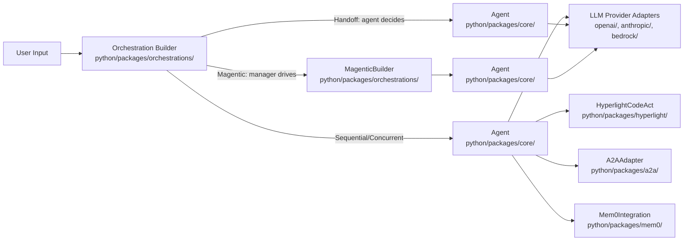
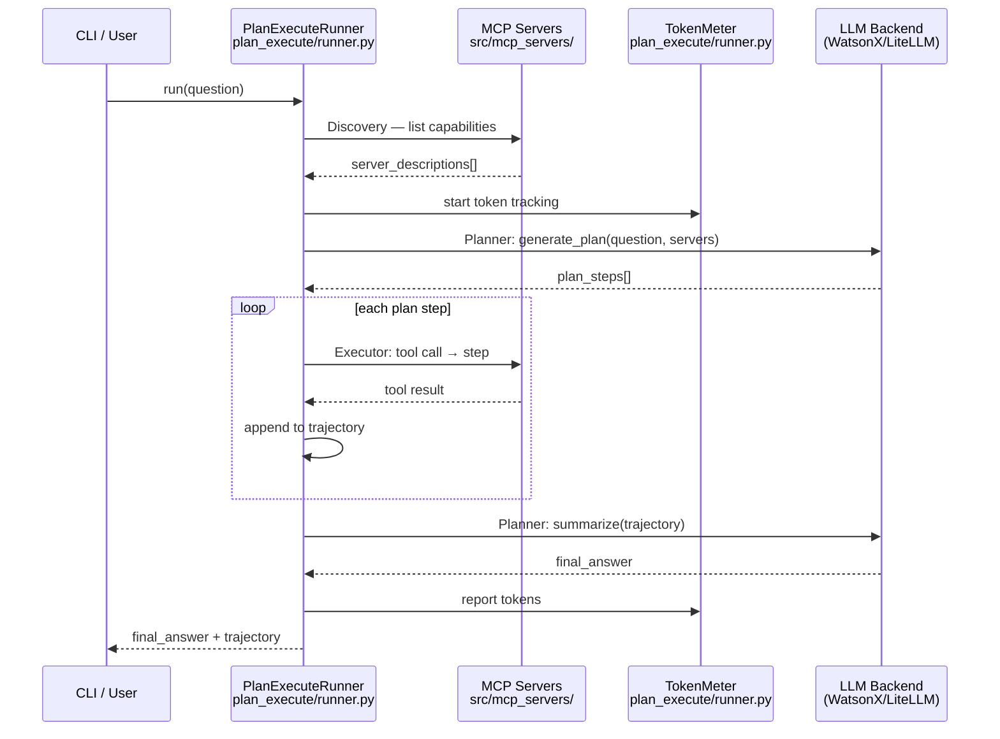
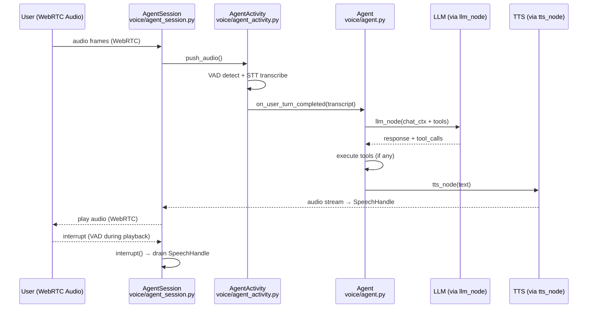

# Weekly Agentic AI Scan — 2026-06-08

## Executive Summary

- **Protocol convergence**: A2A (agent-to-agent), AG-UI (agent-to-frontend), và MCP (model context protocol) xuất hiện đồng loạt trong cả 4 repos tuần này — tín hiệu cho thấy lớp interoperability đang được standardize nhanh hơn dự kiến.
- **Eval gap đang được lấp**: IBM AssetOpsBench benchmark cùng 4 runner architectures (PlanExec / ReAct / Deep / OpenAI) trên 460+ industrial scenarios với LLM Judge — cách approach này hiếm gặp trong open-source và đáng học nhất tuần này.
- **Type safety trở thành citizen hạng nhất**: Pydantic AI implement graph-based execution với typed nodes + Rust-backed validation + per-category retry budgets — đây là bước chuyển rõ từ "script agent" sang "production agent" về mặt engineering.

## Table of Contents

1. [microsoft/agent-framework](#1-microsoftagent-framework) — 11k★ · Python+.NET · multi-agent orchestration
2. [IBM/AssetOpsBench](#2-ibmassetopsbench) — 1.7k★ · Python · Industry 4.0 eval benchmark
3. [livekit/agents](#3-livekitagents) — 10.9k★ · Python · realtime voice AI
4. [pydantic/pydantic-ai](#4-pydanticpydantic-ai) — 17.6k★ · Python · type-safe agents

---

## 1. microsoft/agent-framework

> https://github.com/microsoft/agent-framework

### §1 — Quick Context

Framework production-grade từ Microsoft để xây dựng và deploy AI agents đa ngôn ngữ (Python + .NET) trên Azure và on-prem.

**Tech stack**: Python ≥3.10 / C# .NET 8–9 · Pydantic v2 · OpenTelemetry · Azure Foundry/Functions/Cosmos · MCP ≥1.24 · Mem0 · OpenAI, Anthropic, Bedrock, Gemini, Mistral, Ollama  
**Repo health**: 11,116★ · ~80 contributors · pushed 2026-06-08 · CI với MyPy strict + Bandit security scan

---

### §2 — Architecture Deep-Dive

#### A. Component Inventory

| Component | File Path | Vai trò |
|---|---|---|
| `Agent` | `python/packages/core/` | Core LLM agent, middleware pipeline, system prompt management |
| `SequentialBuilder` | `python/packages/orchestrations/` | Workflow nối tiếp, forward context qua từng agent |
| `ConcurrentBuilder` | `python/packages/orchestrations/` | Fan-out parallel, aggregate results |
| `HandoffBuilder` | `python/packages/orchestrations/` | Decentralized routing — agent tự quyết định chuyển cho ai |
| `GroupChatBuilder` | `python/packages/orchestrations/` | Multi-agent conversation với orchestrator function chọn người nói tiếp |
| `MagenticBuilder` | `python/packages/orchestrations/` | Magentic One pattern — manager agent điều phối researcher, writer, reviewer |
| `DeclarativeAgent` | `python/packages/declarative/` | YAML/JSON-spec agent definitions |
| `DurableTaskHosting` | `python/packages/durabletask/` | Workflow persistence với checkpointing |
| `AzureFunctionsHosting` | `python/packages/azurefunctions/` | Serverless hosting |
| `HyperlightCodeAct` | `python/packages/hyperlight/` | Sandboxed code execution (CodeAct pattern) — Linux/Windows x86_64 |
| `Mem0Integration` | `python/packages/mem0/` | Long-term memory adapter |
| `CosmosDBHistory` | `python/packages/azure-cosmos/` | Persistent conversation history |
| `RedisIntegration` | `python/packages/redis/` | Session state storage |
| `A2AAdapter` | `python/packages/a2a/` | Agent-to-agent protocol connector |
| `AGUIApp` | `python/packages/ag-ui/` | AG-UI protocol cho frontend streaming |
| `DevUI` | `python/packages/devui/` | OpenAI-compatible debug server |
| LLM Provider Adapters | `python/packages/openai/`, `python/packages/anthropic/`, `python/packages/bedrock/` | Per-provider plugin packages implement shared model adapter interface |

#### B. Control Flow — Hierarchical + Pattern-Selectable

Pattern được chọn lúc build time bằng Builder; runtime routing phụ thuộc pattern:

1. Developer khởi tạo `Agent` với model + tools + system_prompt
2. Builder (e.g. `HandoffBuilder`) wires nhiều agents thành workflow graph
3. User message đến → Orchestrator dispatch theo pattern (sequential / concurrent / handoff / group)
4. Agent được gọi thực thi LLM call qua middleware pipeline (before/after hooks)
5. Tool calls được dispatch ra ngoài (MCP, Hyperlight CodeAct) và results trả về LLM context
6. Result được forward theo routing rule của pattern; MagenticBuilder dùng dedicated manager agent làm bước 3

Với **HandoffBuilder**: agent tự quyết định handoff (decentralized). Với **MagenticBuilder**: manager LLM điều phối — closest to AutoGen/Magentic One paper.

#### C. State & Data Flow

- Messages: typed Pydantic models
- Short-term: in-memory ChatContext per workflow run
- Long-term: Cosmos DB (conversation history) hoặc Redis (session cache)
- Persistence: DurableTask checkpointing cho long-running workflows (fault-tolerant)
- Context propagation: không xác định chi tiết từ code (package `core` không public source files trong search)

#### D. Tool / Capability Integration

- **MCP**: `mcp>=1.24.0` là first-class — agents giao tiếp với tool servers qua MCP protocol
- **Hyperlight CodeAct**: WASM-based sandbox cho phép agent execute code an toàn mà không cần Docker
- Declarative tools trong YAML spec (`python/packages/declarative/`)

#### E. Memory Architecture

- `Mem0`: long-term semantic memory (vector-backed)
- Cosmos DB: conversation history persistence
- Redis: fast in-memory session state
- Strategy: short-term = in-context; long-term = Mem0 retrieval (không xác định compaction strategy từ code)

#### F. Model Orchestration

- Plugin-per-provider architecture: mỗi model provider là 1 package riêng (`openai`, `anthropic`, `bedrock`, v.v.)
- MagenticBuilder assign roles: manager (frontier model) + specialists (có thể nhỏ hơn)
- Không có bằng chứng về automatic model routing hay fallback trong code tìm được

#### G. Observability & Eval

- OpenTelemetry built vào `core` package (`opentelemetry-api>=1.39.0`)
- DevUI: OpenAI-compatible API server để debug conversations
- Không có eval hooks cụ thể được tìm thấy trong code (khác với LiveKit và IBM)

#### H. Extension Points

- Thêm model provider: tạo package riêng implement adapter interface
- Custom orchestration: extend Builder hoặc implement orchestrator function
- YAML declarative: define agents không cần code

---

### §3 — Architecture Diagram



---

### §4 — Verdict

**Điểm novel**: MagenticBuilder tích hợp native Magentic One paper pattern; Hyperlight WASM sandbox là approach hiếm thấy cho CodeAct security; A2A + AG-UI + MCP đồng thời là interoperability story mạnh nhất trong ecosystem.

**Red flags**: 30+ packages tạo dependency hell nghiêm trọng; phụ thuộc nặng vào Azure infrastructure dù marketing "multi-cloud"; source code của các core abstractions không accessible qua GitHub search (có thể binary package distribution).

**Open questions**: MagenticBuilder khác GroupChatBuilder thực chất thế nào trong code? Middleware pipeline của `Agent` có composition pattern gì? DurableTask checkpointing hoạt động với stateful tool calls ra sao?

---

## 2. IBM/AssetOpsBench

> https://github.com/IBM/AssetOpsBench

### §1 — Quick Context

Benchmark và framework từ IBM cho 4 AI agent architectures trong Industry 4.0 — IoT, predictive maintenance, time-series forecasting, và work orders — với 460+ eval scenarios.

**Tech stack**: Python · MCP (stdio transport) · WatsonX / LiteLLM proxy · TSFM (TinyTimeMixer) · Hugging Face · LangChain (DeepAgentRunner only)  
**Repo health**: 1,727★ · ~10 contributors · pushed 2026-06-08 · có tests (`src/agent/tests/`)

---

### §2 — Architecture Deep-Dive

#### A. Component Inventory

| Component | File Path | Vai trò |
|---|---|---|
| `AgentRunner` (abstract) | `src/agent/` | Base class cho tất cả runners, interface thống nhất |
| `PlanExecuteRunner` | `src/agent/plan_execute/runner.py` | LLM-agnostic planner-executor, 4-phase pipeline |
| `Planner` | `src/agent/plan_execute/runner.py` | Decomposes question thành structured steps dùng LLM |
| `Executor` | `src/agent/plan_execute/runner.py` | Routes từng step tới MCP server thích hợp |
| `TokenMeter` | `src/agent/plan_execute/runner.py` | Accumulates input/output tokens per run |
| `DeepAgentRunner` | `src/agent/deep_agent/runner.py` | Long-horizon planning via LangChain deep-agents |
| `ClaudeAgentRunner` | `src/agent/claude_agent/runner.py` | ReAct loop via Claude Agent SDK |
| `OpenAIAgentRunner` | `src/agent/openai_agent/runner.py` | ReAct orchestrator via OpenAI Agents SDK |
| CLI | `src/agent/cli.py` | Entry point: `plan-execute` command |
| MCP Servers | `src/mcp_servers/` | Domain tool providers (IoT, FMSR, TSFM, WorkOrder, Vibration) |
| Test Suite | `src/agent/tests/test_runner.py` | Có `_UsageReportingLLM` — mock LLM tracking token usage |
| LLM Backend | external (WatsonX / LiteLLM proxy, configured via `--model-id`) | External LLM provider; wrapped bởi `TokenMeter` trong `PlanExecuteRunner` |

> **Lưu ý**: `MetaAgent` và `AgentHive` xuất hiện trong README description nhưng **không tìm thấy trong code** — khả năng là aspirational/planned hoặc ở private branch.

#### B. Control Flow — Planner-Executor (PlanExecuteRunner)

Pattern rõ ràng nhất là PlanExecuteRunner với 4 phases:

1. User gửi query qua CLI (`src/agent/cli.py`) hoặc Python API
2. **Discovery**: `PlanExecuteRunner` query các MCP servers để lấy danh sách available capabilities (`server_descriptions`)
3. **Planning**: `Planner` call LLM với question + server_descriptions → structured `plan_steps[]`
4. **Execution**: `Executor` iterate qua steps, route từng step đến MCP server tương ứng via stdio; thu thập `trajectory` (task description + response + success/error status)
5. **Summarization**: `Planner` call LLM lần nữa để synthesize `trajectory` thành final answer
6. `TokenMeter` accumulates total input/output tokens cho cả run

`ClaudeAgentRunner` và `OpenAIAgentRunner` dùng ReAct loop riêng của từng SDK (không qua Planner/Executor pipeline).

#### C. State & Data Flow

- Message format: string (không typed schema trong code tìm được)
- State: in-memory trajectory dict — không persist
- `TokenMeter`: reset mỗi run, không share giữa runs
- Context window: không xác định strategy (likely full-context vì industrial scenarios có structured data)

#### D. Tool / Capability Integration

- MCP via stdio transport — tool servers là OS processes
- Auto-discovery: `PlanExecuteRunner` query servers lúc runtime, không cần manual registration
- 5 MCP servers: IoT sensor data, FMSR failure analysis, TSFM time-series, WorkOrder management, Vibration analysis

#### E. Memory Architecture

Không có long-term memory — mỗi run là independent. Trajectory in-memory only. Skip section.

#### F. Model Orchestration

- Default model: Llama-4-Maverick-17B (via LiteLLM proxy hoặc WatsonX)
- Claude qua `ClaudeAgentRunner` (separate runner)
- OpenAI qua `OpenAIAgentRunner` (separate runner)
- Không có role-based model assignment (planner và executor dùng cùng LLM)

#### G. Observability & Eval

- CLI flags: `--show-plan`, `--show-trajectory`, `--json`, `--verbose`
- `TokenMeter`: per-run token accounting
- LLM Judge: Llama-4-Maverick-17B đánh giá trajectory trên 6 dimensions (reasoning quality, execution correctness, data handling, v.v.)
- 141+ reproducible scenarios với ground-truth answers (README) — leaderboard so sánh 7 LLMs

#### H. Extension Points

- Implement `AgentRunner` base class để add runner mới
- Add MCP server mới trong `src/mcp_servers/`
- Pass `--model-id litellm_proxy/...` để swap model mà không sửa code

---

### §3 — Architecture Diagram



---

### §4 — Verdict

**Điểm novel**: Thiết kế multi-runner (PlanExec / ReAct / Deep) cho phép so sánh fair 4 architectures trên cùng 460+ scenarios industrial — approach này hiếm thấy. LLM Judge với 6 dimensions cho industrial domain là contribution thực sự về eval methodology.

**Red flags**: `MetaAgent`/`AgentHive` trong README nhưng không có trong code — potential marketing gap. `DeepAgentRunner` phụ thuộc LangChain (heavy dependency, version conflicts thường xuyên). Trajectory không persist → không thể replay hay debug offline.

**Open questions**: MetaAgent/AgentHive pattern thực sự được implement ở đâu (private branch?). TSFM (TinyTimeMixer) integrate với LLM agent như thế nào cụ thể? Evaluation với 141 vs 460+ scenarios — discrepancy này từ đâu?

---

## 3. livekit/agents

> https://github.com/livekit/agents

### §1 — Quick Context

Framework Python để xây dựng realtime voice AI agents chạy như participants trong WebRTC room — STT→LLM→TTS pipeline với interruption handling và multi-agent handoff.

**Tech stack**: Python · WebRTC (LiveKit) · OpenAI / Anthropic / Deepgram / Cartesia / Silero · pytest · ruff · pdoc · uv  
**Repo health**: 10,890★ · ~60 contributors · pushed 2026-06-08 · CI có tests và lint

---

### §2 — Architecture Deep-Dive

#### A. Component Inventory

| Component | File Path | Vai trò |
|---|---|---|
| `Agent` | `livekit-agents/livekit/agents/voice/agent.py` | Base class; định nghĩa instructions, tools, pipeline nodes (STT/LLM/TTS override points) |
| `AgentTask` | `livekit-agents/livekit/agents/voice/agent.py` | Generic subclass của `Agent` cho task-based workflows, có `complete()` và `__await__()` |
| `AgentSession` | `livekit-agents/livekit/agents/voice/agent_session.py` | Runtime orchestrator — glue giữa audio I/O, speech pipeline, và tool dispatch |
| `AgentActivity` | `livekit-agents/livekit/agents/voice/agent_activity.py` | Per-agent-instance activity context, xử lý audio frames và pipeline execution |
| `SpeechHandle` | `livekit-agents/livekit/agents/voice/speech_handle.py` | Handle cho speech output, có priority levels (LOW/HIGH) |
| `ChatContext` | `livekit-agents/livekit/agents/llm/chat_context.py` | Conversation history; chứa `AgentHandoff` items khi switch agents |
| `AgentHandoff` | `livekit-agents/livekit/agents/llm/chat_context.py` | Handoff record với `old_agent_id` để preserve context |
| `IVRActivity` | `livekit-agents/livekit/agents/voice/ivr/ivr_activity.py` | IVR-specific activity cho telephony use case |
| `Judge` | `livekit-agents/livekit/agents/evals/judge.py` | Eval framework với 8 dimensions, LLM-based scoring |
| `AgentServer` | `livekit-agents/livekit/agents/` | Job scheduler, session lifecycle management (confirmed via README) |
| LLM Backend | `livekit-agents/livekit/agents/llm/` | LLM adapter submodule; called via `Agent.llm_node()` |
| TTS Backend | `livekit-agents/livekit/agents/` (plugin system) | TTS adapter; called via `Agent.tts_node()`; outputs `SpeechHandle` |

#### B. Control Flow — Event-Driven Pipeline

Pattern: event-driven realtime pipeline với interrupt/resume semantics:

1. Audio frames từ WebRTC room → `AgentActivity.push_audio()` → VAD detection
2. VAD triggers speech detection; STT transcribes audio → transcript event
3. Endpointing (silence timeout) signals end-of-user-turn → `on_user_turn_completed()` callback
4. `AgentActivity` gọi `Agent.llm_node()` với `ChatContext` + registered tools
5. LLM response stream → nếu có tool calls: execute tools → kết quả append vào `ChatContext` → tiếp tục LLM
6. Text output → `Agent.tts_node()` → audio stream → `SpeechHandle` play ra WebRTC room
7. Nếu user interrupt (VAD detect khi agent đang nói) và interruptions enabled → `AgentSession.interrupt()` → drain current `SpeechHandle` → restart từ bước 3

**Multi-agent handoff**: `AgentSession.update_agent(new_agent)` drain current activity, transfer `ChatContext`, khởi tạo new `AgentActivity`.

#### C. State & Data Flow

- Message format: `ChatContext` là list of typed chat messages (Pydantic-based)
- `AgentHandoff` embedded vào `ChatContext` để preserve cross-agent history
- State storage: in-memory per session (no persistence layer)
- Context management: full `ChatContext` gửi mỗi LLM request — không có summarization hay RAG (context window managed by provider limits)
- User/Agent states: `"listening" | "speaking" | "away"` → trigger OTel spans

#### D. Tool / Capability Integration

- Tools: `@agent.tool` decorated methods hoặc explicit `tools=` parameter
- Auto-discovery: `find_function_tools(self)` scan decorated methods trong class
- MCP: `mcp_servers=` parameter trong `Agent.__init__()`
- Tool execution: qua LLM function calling; non-blocking tools (via `__livekit_agents_tool_non_blocking` flag)

#### E. Memory Architecture

Short-term: `ChatContext` in-memory per session — không có long-term memory built-in. `AgentHandoff` records preserve cross-agent context trong session. Không có compaction strategy tìm thấy trong code.

#### F. Model Orchestration

- Mỗi `Agent` instance có STT, LLM, TTS riêng → có thể dùng models khác nhau per agent
- `AgentSession` inherit components từ previous agent khi handoff (reuse STT/LLM/TTS nếu compatible)
- Không có fallback hay batching logic tìm thấy

#### G. Observability & Eval

- **OpenTelemetry**: state transitions tạo OTel spans; session-level attributes
- **Langfuse integration**: `examples/voice_agents/langfuse_trace.py` — trace conversations
- **Built-in Eval framework** (`livekit-agents/livekit/agents/evals/judge.py`): 8 dimensions (Task Completion, Handoff Quality, Accuracy, Tool Use, Safety, Relevancy, Coherence, Conciseness); LLM judge với function calling + temperature=0; verdict: `pass/fail/maybe`

#### H. Extension Points

- Override `stt_node()`, `llm_node()`, `tts_node()`, `transcription_node()` trong subclass
- Subclass `Agent` để tạo specialized agents
- `AgentTask[T]` generic pattern cho task-based workflows

---

### §3 — Architecture Diagram



---

### §4 — Verdict

**Điểm novel**: Built-in eval framework với 8 dimensions specifically designed cho voice AI (Conciseness, Handoff Quality) — hiếm trong agent repos. Interrupt/resume semantics xử lý realtime audio rất kỹ: AEC warmup suppression, priority levels cho speech handles. AgentTask pattern cho phép inline sub-workflows trong tool calls.

**Red flags**: Không có long-term memory hay context summarization → sessions dài có thể bị context window overflow. Toàn bộ stack coupled chặt với LiveKit WebRTC — không dễ reuse với WebSocket hay telephony khác.

**Open questions**: `IVRActivity` khác `AgentActivity` ở điểm gì cụ thể cho telephony? Preemptive generation (LLM start trước khi user finish) được implement ở đâu trong code? Làm sao handle cross-session memory (returning users)?

---

## 4. pydantic/pydantic-ai

> https://github.com/pydantic/pydantic-ai

### §1 — Quick Context

AI agent framework từ Pydantic team, lấy cảm hứng từ FastAPI — type-safe, dependency-injection-first, với graph-based execution engine và durable workflow backends.

**Tech stack**: Python ≥3.10 · Pydantic v2 (Rust validation) · Pydantic Logfire · OpenTelemetry · FastMCP · Temporal / DBOS / Prefect (optional durable exec)  
**Repo health**: 17,591★ · ~50 contributors · pushed 2026-06-08 · CI (không xác định từ code)

---

### §2 — Architecture Deep-Dive

#### A. Component Inventory

| Component | File Path | Vai trò |
|---|---|---|
| `Agent` | `pydantic_ai_slim/pydantic_ai/agent/__init__.py` | Core orchestrator; generic `Agent[DepsT, OutputT]`; entry point cho runs |
| `AbstractAgent` | `pydantic_ai_slim/pydantic_ai/agent/abstract.py` | Interface với `AgentRetries` — per-category retry budgets |
| `WrapperAgent` | `pydantic_ai_slim/pydantic_ai/agent/wrapper.py` | Base class cho Temporal/DBOS/Prefect agents |
| `AgentSpec` | `pydantic_ai_slim/pydantic_ai/agent/spec.py` | Declarative YAML/JSON config để khởi tạo Agent |
| `AgentRun` | `pydantic_ai_slim/pydantic_ai/run.py` | Async-iterable run handle; cho phép step-by-step node traversal |
| `AgentStream` | `pydantic_ai_slim/pydantic_ai/result.py` | Streaming result với Pydantic output validation |
| `UserPromptNode` | `pydantic_ai_slim/pydantic_ai/_agent_graph.py` | Node 1: build system prompts + user message |
| `ModelRequestNode` | `pydantic_ai_slim/pydantic_ai/_agent_graph.py` | Node 2: call LLM model với capabilities middleware |
| `CallToolsNode` | `pydantic_ai_slim/pydantic_ai/_agent_graph.py` | Node 3: execute tool calls, validate output, decide retry hay End |
| `RunContext` | `pydantic_ai_slim/pydantic_ai/_run_context.py` | Per-run state: `deps`, model, usage, messages, tracer, tool_manager |
| `SystemPromptRunner` | `pydantic_ai_slim/pydantic_ai/_system_prompt.py` | Executes static hay dynamic system prompt functions |
| `FastMCPToolset` | `pydantic_ai_slim/pydantic_ai/toolsets/fastmcp.py` | MCP client toolset cho local/remote MCP servers |
| `FilteredToolset` | `pydantic_ai_slim/pydantic_ai/toolsets/filtered.py` | Wraps toolset với filter function nhận `RunContext` |
| `AgentWorker` | `pydantic_ai_slim/pydantic_ai/_a2a.py` | A2A protocol worker — agent nhận tasks từ A2A network |
| `AGUIApp` | `pydantic_ai_slim/pydantic_ai/ui/ag_ui/app.py` | ASGI app với AG-UI protocol support |
| `TemporalAgent` | `pydantic_ai_slim/pydantic_ai/durable_exec/temporal/` | Durable agent via Temporal workflow |
| `DBOSAgent` | `pydantic_ai_slim/pydantic_ai/durable_exec/dbos/_agent.py` | DBOS-backed durable agent |
| `PrefectAgent` | `pydantic_ai_slim/pydantic_ai/durable_exec/prefect/_agent.py` | Prefect-backed durable agent |

#### B. Control Flow — State Machine / Graph (LangGraph-style nhưng typed)

Pattern: directed acyclic graph với typed nodes, loop back on retry:

1. `Agent.iter()` hoặc `Agent.run()` khởi tạo `GraphAgentState` với `message_history`, `usage`, `run_id`
2. `UserPromptNode` execute: build system prompts qua `SystemPromptRunner`s (static + dynamic), prepend user message
3. `ModelRequestNode` execute: capability middleware `wrap_model_request()` → call LLM model → stream response
4. `CallToolsNode` execute: classify tool calls thành 3 loại:
   - **Output tools**: validate với Pydantic schema; failure → `RetryPromptPart` → back to `ModelRequestNode`
   - **Function tools**: execute parallel hoặc sequential (configurable `parallel_execution_mode`); kết quả → `ToolReturnPart` → append to history
   - **Deferred tools**: delegate to capability handler (external approval workflows)
5. Nếu tool calls thành công và output valid → `SetFinalResult` → End
6. Nếu retry budget exceeded → raise `AgentRunError`

#### C. State & Data Flow

- Message format: typed Pydantic models (`ModelMessage`, `ToolReturnPart`, `RetryPromptPart`)
- State: `GraphAgentState` chứa `message_history` list và `pending_messages` queue
- Storage: in-memory default; `TemporalAgent`/`DBOSAgent`/`PrefectAgent` cho durable persistence
- Context window: full history passed each request (không có built-in summarization)
- Dependency injection: `RunContext[DepsT]` carry typed `deps` qua mọi tool/prompt functions

#### D. Tool / Capability Integration

- `@agent.tool` decorator: đăng ký function tool với optional `RunContext` injection
- `FastMCPToolset`: MCP client tích hợp native (`fastmcp` package)
- `FilteredToolset`: dynamic tool visibility dựa trên runtime context
- Per-tool retry budget: `ToolOutput(max_retries=...)` override global budget
- Model calling: native function calling (không JSON-parse hack)

#### E. Memory Architecture

Short-term: `GraphAgentState.message_history` in-memory. Long-term: không có built-in — dùng `common_tools/x_search.py` subagent pattern. Durable exec backends (Temporal/DBOS) cho workflow replay nhưng không phải semantic memory.

#### F. Model Orchestration

- Model-agnostic: `models/` directory với adapter per provider
- Configuration layering: model built-in → agent-level → capability → run-level (override precedence)
- Dynamic model settings: callable nhận `RunContext` trả về `ModelSettings` per request
- Không có automatic routing hay fallback logic trong code tìm được

#### G. Observability & Eval

- **Pydantic Logfire**: first-class observability integration
- **OpenTelemetry**: tracer trong `RunContext`, spans cho model requests
- **Eval examples**: `examples/pydantic_ai_examples/evals/` với `AgentCalledTool`, `custom_evaluators.py`
- `RunUsage` dataclass track tokens per run; Logfire dashboard visualize

#### H. Extension Points

- `WrapperAgent` base class để wrap với durable execution backend
- `AgentSpec` YAML cho no-code agent definition
- `AgentCapability` interface thay thế legacy `history_processors`/`builtin_tools`
- `override()` context manager cho test isolation

---

### §3 — Architecture Diagram

```mermaid
flowchart LR
    User[User Input] --> AR[AgentRun\nrun.py]
    AR --> UPN[UserPromptNode\n_agent_graph.py]
    UPN --> SPR[SystemPromptRunner\n_system_prompt.py]
    SPR --> UPN
    UPN --> MRN[ModelRequestNode\n_agent_graph.py]
    MRN --> CTN[CallToolsNode\n_agent_graph.py]
    CTN -->|output valid| End[SetFinalResult\n_agent_graph.py]
    CTN -->|@agent.tool calls| FMT[FastMCPToolset\ntoolsets/fastmcp.py]
    CTN -->|filtered tools| FLT[FilteredToolset\ntoolsets/filtered.py]
    CTN -->|output retry| MRN
    FMT --> CTN
    FLT --> CTN
    End --> AS[AgentStream\nresult.py]
    AS --> User
```

---

### §4 — Verdict

**Điểm novel**: Graph-based execution (`_agent_graph.py`) với typed nodes là architectural choice rõ ràng nhất trong 4 repos — dễ test, dễ replay, dễ debug từng step. Per-category retry budgets (`tools` vs `output` riêng biệt) là UX detail nhỏ nhưng rất production-relevant. Durable exec backends (Temporal, DBOS, Prefect) qua `WrapperAgent` là extension point sạch nhất.

**Red flags**: `pydantic_ai_slim` naming gây confusing (không slim chút nào với 200k+ LOC). Full history passed mỗi request → không scale cho long conversations. `x_search.py` subagent tool pattern là workaround thú vị nhưng chưa được document rõ.

**Open questions**: `parallel_execution_mode` trong `CallToolsNode` có deadlock risk không khi tools có shared state? `AgentCapability` interface thực sự replace được `history_processors` trong tất cả patterns? Temporal vs DBOS — benchmark latency overhead của durable exec backends là bao nhiêu?

---

*Scan thực hiện: 2026-06-08 | Nguồn: GitHub search API + raw content*
