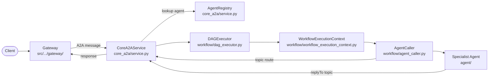
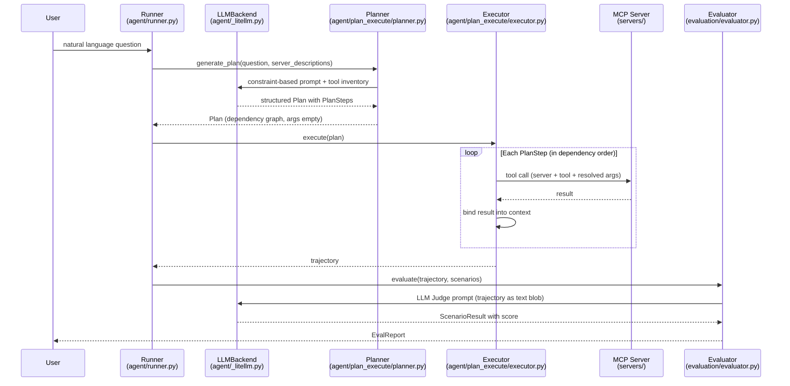
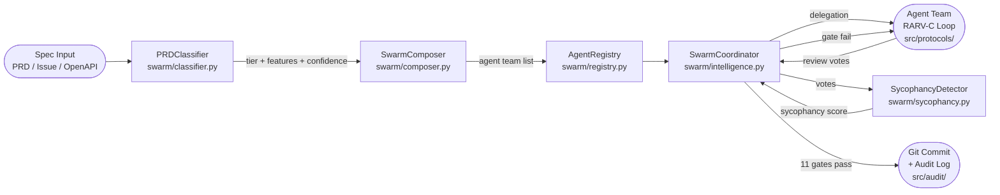
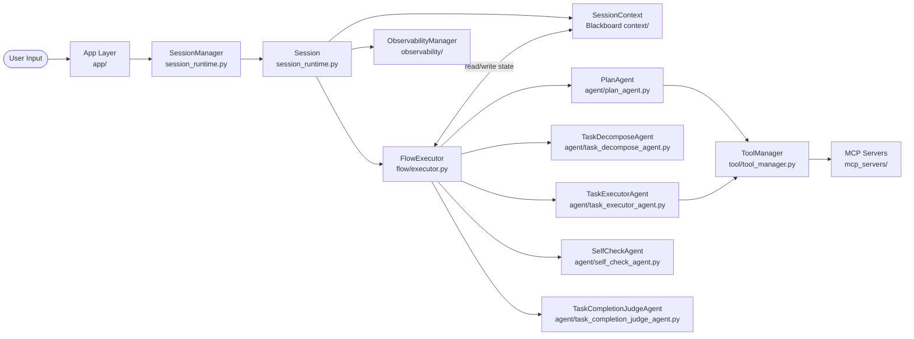

# Weekly Agentic AI Scan — 2026-06-09

## Executive Summary

- **Xu hướng tuần này**: Event-driven multi-agent (SolaceLabs) và composite flow-graph (Sage) cạnh tranh trực tiếp với LangGraph-style — cả hai repo đều có persistence thực sự, observability, và state machine rõ ràng, không phải wrapper.
- **Highlight đặc biệt**: IBM AssetOpsBench mang đến eval methodology hiếm thấy: multi-scorer pipeline (LLM judge + code-based + semantic) trên 460+ industrial scenarios; benchmark design xứng đáng học riêng, độc lập khỏi framework.
- **Cảnh báo**: loki-mode dùng BUSL-1.1 (non-OSS, source-available only); codebase rộng nhất trong bốn repo nhưng single-contributor và nhiều module thiếu test coverage rõ ràng.

## Table of Contents

- [1. SolaceLabs/solace-agent-mesh](#1-solacelabssolace-agent-mesh)
- [2. IBM/AssetOpsBench](#2-ibmassetopsbench)
- [3. asklokesh/loki-mode](#3-asklokeshloki-mode)
- [4. ZHangZHengEric/Sage](#4-zhangzhengEricsage)

---

## 1. SolaceLabs/solace-agent-mesh

**GitHub**: https://github.com/SolaceLabs/solace-agent-mesh

### §1 — Quick Context

Framework mã nguồn mở xây dựng hệ thống multi-agent AI dùng event broker làm transport layer, hỗ trợ A2A protocol và DAG-based workflow.

**Tech stack core**: Python 3.10–3.13 (69.4%) + TypeScript (30.1%), Google ADK, LiteLLM, FastAPI, Google Genai, OpenAI, SQLAlchemy/Alembic, pandas/numpy.  
**Infra**: Solace Event Broker (message bus), Docker, REST/Slack/Teams gateways.  
**Repo health**: 4,833★, 2,251 commits, Apache-2.0, CI với pytest-asyncio + pytest-cov + ruff + SonarQube, `uv.lock` → reproducible builds.

---

### §2 — Architecture Deep-Dive

#### A. Component Inventory

| Component | File Path | Vai trò |
|-----------|-----------|---------|
| `CoreA2AService` | `src/solace_agent_mesh/core_a2a/service.py` | A2A protocol layer: tạo task ID, route topic-based requests/responses, cancel |
| `AgentRegistry` | referenced trong `core_a2a/service.py` constructor | Discovery và lookup agent theo namespace |
| `DAGExecutor` | `src/solace_agent_mesh/workflow/dag_executor.py` | Thực thi workflow dưới dạng Directed Acyclic Graph |
| `WorkflowExecutionContext` | `src/solace_agent_mesh/workflow/workflow_execution_context.py` | Quản lý state trong suốt workflow run |
| `AgentCaller` | `src/solace_agent_mesh/workflow/agent_caller.py` | Invoke agent trong workflow, bridge giữa DAG và A2A |
| `Gateway` | `src/solace_agent_mesh/gateway/` | REST, Slack, Teams, Web UI interface |
| `Tools` | `src/solace_agent_mesh/tools/web_search/` | Built-in tools (web search) |
| `Workflow Protocol` | `src/solace_agent_mesh/workflow/protocol/` | Protocol definitions giữa workflow components |
| `Flow Control` | `src/solace_agent_mesh/workflow/flow_control/` | Flow control logic cho workflow management |

#### B. Control Flow — Event-Driven + DAG Execution

Pattern: **Event-driven** (asynchronous pub/sub) với **DAG Executor** cho dependency management giữa workflow steps.

1. Client gửi request qua Gateway (REST/Slack/Teams) → gateway publish event tới Solace Event Broker topic.
2. `CoreA2AService` consume event, sinh task ID, đóng gói A2A message payload via `a2a.create_send_message_request()`.
3. `AgentRegistry` được query để resolve agent name → target topic (`a2a.get_agent_request_topic(namespace, agent_name)`).
4. `DAGExecutor` traverse dependency graph workflow, gọi `AgentCaller` theo thứ tự topological sort.
5. `AgentCaller` invoke specialist agent; response route về qua `replyTo` user property trong A2A message.
6. `WorkflowExecutionContext` aggregate kết quả; streaming variant dùng `a2aStatusTopic` riêng.

#### C. State & Data Flow

- **Message format**: Typed A2A protocol objects với task_id, context_id, namespace; serialized payload là structured dict.
- **Storage**: Solace Event Broker cho transport; SQLAlchemy/Alembic cho persistent state; Azure Blob / GCS / S3 (boto3 dep) cho file artifacts.
- **Context window**: Không xác định từ code — không có evidence về sliding window hay summarization strategy.

#### D. Tool / Capability Integration

- Tools đăng ký dưới dạng config-driven components (xem `preset/` và `templates/`).
- Model gọi tool qua function-calling native của Google ADK / OpenAI API.
- `tools/web_search/` là built-in tool duy nhất có evidence trong codebase.

#### E. Memory Architecture

Không xác định từ code — không có evidence về short-term hay long-term memory module.

#### F. Model Orchestration

- LiteLLM (1.83.14) làm unified interface trên Google Genai (1.49.0) và OpenAI (2.24.0).
- Không có evidence về model differentiation giữa planner và executor roles.
- `google-cloud-storage` + `azure-storage-blob` + `boto3` cho multi-cloud artifact storage.

#### G. Observability & Eval

- **SonarQube**: `sonar-project.properties` trong root.
- **Testing**: pytest với 40+ custom markers, testcontainers cho postgres/mysql, asyncio auto mode.
- **Linting**: ruff với rule sets E/W/F/I/UP/B/C4/SIM.
- Không có evidence về OpenTelemetry hay Langfuse.
- `evaluation/` directory tồn tại nhưng nội dung chưa được fetch.

#### H. Extension Points

- `preset/` — pre-built agent preset configurations.
- `templates/` — template để tạo custom agent.
- Config-driven component registration cho custom tools và agents.

---

### §3 — Architecture Diagram

---

### §4 — Verdict

**Điểm novel / đáng học**: Topic-based A2A routing qua message broker — thay vì direct RPC hay shared memory, mọi agent communication đều đi qua Solace Event Broker, tạo ra decoupling thực sự và natural replay/audit capability. Pattern này horizontal-scalable theo cách mà LangGraph/CrewAI không làm được.

**Red flags**: Dependency list 60+ packages rất nặng cho một "lightweight" framework; coupling chặt vào Solace Event Broker — migration sang Kafka/RabbitMQ không hiển nhiên. License Apache-2.0 nhưng Solace broker có thể có commercial cost.

**Open questions**: (1) Cơ chế agent discovery động hoạt động ra sao khi agent join/leave mid-workflow? (2) `evaluation/` directory chứa gì — có benchmark builtin không? (3) Streaming A2A (`submit_streaming_task`) xử lý backpressure thế nào?

---

## 2. IBM/AssetOpsBench

**GitHub**: https://github.com/IBM/AssetOpsBench

### §1 — Quick Context

Benchmark + framework đánh giá AI agent cho Industry 4.0 với 5 specialist agents, 460+ scenarios, và multi-scorer evaluation pipeline kết hợp LLM judge, code-based, và semantic scoring.

**Tech stack core**: Python 3.12+, Claude Agent SDK, OpenAI Agents, DeepAgents, LiteLLM (unified interface), FastMCP, IBM Granite TSFM (time-series), Llama-4-Maverick-17B (LLM judge), CouchDB.  
**Repo health**: 1,735★, IBM organization, Apache-2.0, Hatchling build, renovate.json cho automated dep updates, `.python-version` cho reproducibility.

---

### §2 — Architecture Deep-Dive

#### A. Component Inventory

| Component | File Path | Vai trò |
|-----------|-----------|---------|
| `Planner` | `src/agent/plan_execute/planner.py` | LLM-based task decomposition thành dependency graph PlanSteps |
| `Executor` | `src/agent/plan_execute/executor.py` | Sequential tool execution following plan, late argument binding |
| `Runner` | `src/agent/runner.py` | Agent lifecycle orchestration, entry point |
| `LLMBackend` | `src/agent/_litellm.py` | Unified LLM interface qua LiteLLM |
| `Evaluator` | `src/evaluation/evaluator.py` | Trajectory scoring orchestrator (two-tier: Evaluator + Scorer) |
| `LLMJudge scorer` | `src/evaluation/scorers/llm_judge.py` | LLM-as-judge evaluation |
| `CodeBased scorer` | `src/evaluation/scorers/code_based.py` | Deterministic scoring |
| `Semantic scorer` | `src/evaluation/scorers/semantic.py` | Embedding-based scoring |
| MCP Server x6 | `src/servers/` | Domain servers: IoT, FMSR, TSFM, Work Orders, Vibration, Utilities |
| `Observability module` | `src/observability/` | OpenTelemetry (optional dep) |
| `CouchDB module` | `src/couchdb/` | Document persistence cho trajectories |

#### B. Control Flow — Planner-Executor (Constraint-Based)

Pattern: **Planner-executor** với constraint-driven prompting và dependency graph giữa steps; planning và execution là hai phase riêng biệt không overlap.

1. User cung cấp natural language question; `Runner` khởi động agent với LLMBackend.
2. `Planner.generate_plan(question, server_descriptions)` gọi LLM với full tool inventory + constraint-based prompt → LLM sinh `Plan` object gồm ordered `PlanStep` list.
3. Mỗi `PlanStep` chứa: step number, task description, server assignment, tool name, empty args dict, dependency list (`#S<N>` notation), expected output.
4. `Executor` traverse steps theo dependency order; tại mỗi step resolve args từ context và prior step results → gọi tool trực tiếp qua MCP (không invoke LLM thêm).
5. Tool results tích lũy trong context, feed vào downstream steps.
6. `Evaluator` load trajectory + scenario → dispatch `_score_one()` cho mỗi pair; trajectory serialized to text blob → LLM judge prompt → `ScenarioResult`.

#### C. State & Data Flow

- **Message format**: Typed Pydantic schemas (`Plan`, `PlanStep` trong `src/agent/plan_execute/models.py`).
- **Storage**: CouchDB cho document/trajectory persistence; JSON files cho trajectory serialization.
- **Context**: Dependency graph via `#S<N>` references; late argument binding tại execution time.

#### D. Tool / Capability Integration

- 6 domain-specific MCP servers via FastMCP (≥2.14.5) + MCP CLI (≥1.26.0).
- LangChain-MCP adapters cho LangChain-based agent variants.
- Multi-driver support: Claude Agent SDK, OpenAI Agents, DeepAgents, Stirrup — cùng benchmark, nhiều driver khác nhau.

#### E. Memory Architecture

- **Short-term**: Virtual filesystem cho long-horizon task management (từ README).
- Không có evidence về long-term memory module từ code.

#### F. Model Orchestration

- LiteLLM làm unified interface: 7 LLMs được evaluate (bao gồm Claude, OpenAI, Llama-4-Maverick-17B).
- Llama-4-Maverick-17B được dùng làm LLM Judge (tách biệt khỏi task-execution model).
- IBM Granite TSFM optional cho time-series forecasting tasks.
- Planner thường dùng frontier models; không có evidence về executor model differentiation.

#### G. Observability & Eval

- **OpenTelemetry**: optional dependency, support qua `src/observability/`.
- **Trajectory persistence**: `PersistedTrajectory` objects với JSON serialization → audit và replay.
- **Multi-scorer**: `llm_judge.py`, `code_based.py`, `semantic.py` — different scorer cho different scenario types.
- **CLI**: `src/evaluation/cli.py` cho batch evaluation; `src/evaluation/report.py` cho report generation.

#### H. Extension Points

- Thêm MCP server mới cho domain mới (6 template sẵn có trong `src/servers/`).
- Pluggable scorer: implement Scorer interface → register trong `Evaluator._resolve()`.
- Pluggable agent driver: thêm driver mới vào `src/agent/` (claude/openai/deep/stirrup templates sẵn).
- `src/scenarios/` cho custom benchmark scenarios.

---

### §3 — Architecture Diagram

---

### §4 — Verdict

**Điểm novel / đáng học**: (1) **Late argument binding**: args để trống lúc planning, resolve từ prior step output lúc execution — tránh hallucination về giá trị cụ thể trong giai đoạn planning. (2) **Multi-scorer pipeline**: cùng trajectory được score bởi 3 loại scorer khác nhau — code-based (deterministic), semantic (embedding), LLM judge — cho phép cross-validation evaluation, hiếm thấy ở mức này trong public benchmarks.

**Red flags**: README nói "460+ scenarios" nhưng README fetch trả về "141+ scenarios" — số liệu không nhất quán. CouchDB là dependency bất ngờ cho benchmark framework. Multi-driver support tốt nhưng `stirrup_agent/` ít documentation.

**Open questions**: (1) `code_based.py` scorer dùng metric cụ thể nào — exact match, F1, hay custom? (2) Virtual filesystem long-horizon implementation cụ thể ở đâu trong code? (3) Llama-4-Maverick-17B được serve locally hay qua API?

---

## 3. asklokesh/loki-mode

**GitHub**: https://github.com/asklokesh/loki-mode

### §1 — Quick Context

Framework tự động hóa toàn bộ SDLC từ spec đến deployment, tự compose agent team theo complexity classification và thực thi RARV-C closure loop với 11 quality gate bao gồm anti-sycophancy detection.

**Tech stack core**: TypeScript/Bun (primary runtime), Python 3.10+ (memory module), Claude Code (Tier 1), OpenAI Codex / Cline / Aider (fallback), OpenTelemetry, Docker, MCP server với 34 tools.  
**Repo health**: 966★, **BUSL-1.1** (non-OSS, source-available), single contributor, Node.js ≥20, active development (pushed 2026-06-09). Có `pytest.ini` cho Python components.

---

### §2 — Architecture Deep-Dive

#### A. Component Inventory

| Component | File Path | Vai trò |
|-----------|-----------|---------|
| `PRDClassifier` | `swarm/classifier.py` | 8-dimensional feature extraction → tier classification (simple/standard/complex/enterprise) |
| `SwarmComposer` | `swarm/composer.py` | Compose agent team từ BASE_TEAM + FEATURE_AGENT_MAP + ENTERPRISE_AGENTS |
| `SwarmCoordinator` | `swarm/intelligence.py` | 4-pattern coordination: voting, consensus, delegation, emergence |
| `AgentRegistry` | `swarm/registry.py` | Registry agent types, availability (IDLE/WORKING), capability profiles |
| `SycophancyDetector` | `swarm/sycophancy.py` | Phát hiện groupthink trong review process qua 4 weighted signals |
| `SwarmConfig` | `swarm/intelligence.py` (dataclass) | Configuration parameters cho từng coordination pattern |
| RARV-C Protocol | `src/protocols/` | Reason→Act→Reflect→Verify→Close closure loop |
| Observability | `src/observability/` | OpenTelemetry integration |
| Audit | `src/audit/` | Audit trail persistence (`.loki/swarm/` JSON) |
| Policy engine | `src/policies/` | Governance và constraint enforcement |
| MCP server | `mcp/` | 34 tools exposed via Model Context Protocol |
| Agent Hub | `agents/hub_install.py` | Agent type management và installation |

#### B. Control Flow — Hybrid Swarm + RARV-C Closure Loop

Pattern: **Hierarchical** (classifier → composer → coordinator) kết hợp với **RARV-C loop** (novel variant của ReAct với Reflect + Close phase).

1. User submit spec (PRD / GitHub issue / OpenAPI / YAML / one-liner).
2. `PRDClassifier.classify(prd_text)` trích xuất 8 feature dimensions (service_count, external_apis, database_complexity, deployment_complexity, testing_requirements, ui_complexity, auth_complexity) → tính total hits → tier + confidence score.
3. `SwarmComposer.compose(classification, org_patterns)` build agent team: BASE_TEAM (3 mandatory agents) + conditional FEATURE_AGENT_MAP (6 feature-triggered agents) + ENTERPRISE_AGENTS (3 premium agents nếu enterprise tier); sort by priority, truncate đến max agent count.
4. `SwarmCoordinator` nhận agent team → route theo pattern: delegation cho task assignment, consensus cho architectural decisions, voting cho code review (quorum 0.5), emergence cho insight aggregation.
5. Delegated agents thực thi RARV-C loop: **R**eason (analyze state) → **A**ct (execute code) → **R**eflect (update context) → **V**erify (test/spec validation) → **C**lose (commit if verified); failure triggers self-correction.
6. Review votes collected → `SycophancyDetector.detect_sycophancy(votes)` tính composite score từ 4 signals: verdict unanimity (30%), reasoning similarity Jaccard (30%), severity uniformity (20%), issue count similarity (20%).
7. 11 quality gates evaluated; failure blocks commit và restarts cycle.

#### C. State & Data Flow

- **Message format**: TypeScript typed schemas với correlation IDs cho async tracking.
- **Storage**: JSON files trong `.loki/swarm/` (proposals, observations, audit trails) cho recovery; persistent across restarts.
- **Context**: RARV-C loop maintains in-memory context; SwarmCoordinator dùng asyncio message bus với correlation IDs.

#### D. Tool / Capability Integration

- MCP server với 34 tools (`mcp/` directory).
- Provider abstraction layer (`providers/`) cho Claude Code, Codex, Cline, Aider — auto-failover theo thứ tự.
- Function calling qua underlying provider APIs; không có evidence về custom JSON parsing.

#### E. Memory Architecture

- **Short-term**: In-memory agent context trong RARV-C loop iteration.
- **Long-term**: `.loki/swarm/` JSON persistence (proposals, observations, audit trails).
- Python unittest coverage cho memory management module (`memory/`).

#### F. Model Orchestration

- Claude Code là Tier 1 primary; auto-failover thứ tự: Codex → Cline → Aider.
- Không có evidence về model differentiation giữa planner và executor roles.
- `calibration.py` (`swarm/calibration.py`) — có thể dùng cho model performance calibration, chi tiết chưa fetch.

#### G. Observability & Eval

- **OpenTelemetry**: optional deps (@opentelemetry/api, sdk-trace-node, exporter-otlp-http).
- **Audit trails**: JSON persistence trong `.loki/swarm/` với source attribution (classifier/org_patterns/manual_override).
- **Performance**: `swarm/performance.py` — chi tiết chưa fetch.
- `benchmarks/` directory tồn tại — có thể có benchmark builtin.

#### H. Extension Points

- `agent-skills/` cho custom agent behaviors.
- `providers/` cho new LLM provider.
- `SwarmConfig` dataclass cho tuning coordination patterns.
- VSCode extension (`vscode-extension/`), web app (`web-app/`), dashboard (`dashboard/`).

---

### §3 — Architecture Diagram

---

### §4 — Verdict

**Điểm novel / đáng học**: (1) **Anti-sycophancy detection** bằng cách đo Jaccard similarity giữa reviewer reasoning — không phải chỉ check verdict mà check *tính độc lập của quá trình reasoning*. (2) **8-dimensional PRD classifier** với enterprise keyword auto-elevation — complexity detection trước khi compose team là cách tiếp cận hiếm thấy, cho phép agent-count scaling hợp lý hơn static team composition.

**Red flags**: BUSL-1.1 license = không thể dùng trong commercial product không mua license. Single contributor. Codebase cực rộng (40+ top-level directories) nhưng nhiều module có vẻ là scaffold hơn là production code. Dependency list runtime của package.json gần như trống — không rõ production dependencies được manage thế nào.

**Open questions**: (1) `swarm/bft.py` — Byzantine Fault Tolerance trong swarm context là gì cụ thể? (2) `swarm/patterns.py` chứa patterns nào ngoài 4 patterns đã document? (3) RARV-C loop implementation thực tế ở `src/protocols/` — đây là pure TypeScript orchestration hay gọi external tool?

---

## 4. ZHangZHengEric/Sage

**GitHub**: https://github.com/ZHangZHengEric/Sage

### §1 — Quick Context

Framework multi-agent production-ready với kiến trúc phân lớp rõ ràng: Blackboard pattern cho state management, composite flow-graph execution có SequenceNode/ParallelNode/LoopNode, và planning agent riêng biệt với tool whitelist cứng.

**Tech stack core**: Python 3.10+ (56.7%), Vue/TypeScript (23.4%) cho web frontend, Rust (TUI), FastAPI, OpenAI API, MCP (≥1.9.2) + FastMCP (≥0.9.0), Gradio, rank-bm25.  
**Repo health**: 1,198★, MIT license, pyrightconfig.json + pytest, loguru logging, pushed 2026-06-05.

---

### §2 — Architecture Deep-Dive

#### A. Component Inventory

| Component | File Path | Vai trò |
|-----------|-----------|---------|
| `Session` + `SessionRuntime` | `sagents/session_runtime.py` | State machine (IDLE→RUNNING→COMPLETED/ERROR/INTERRUPTED), agent cache, disk persistence |
| `SessionManager` | `sagents/session_runtime.py` | SQLite registry + filesystem session lookup, lazy-load |
| `FlowExecutor` | `sagents/flow/executor.py` | Recursive async execution của composite FlowNode tree |
| `PlanAgent` | `sagents/agent/plan_agent.py` | Planning phase với tool whitelist, message compression, status judgment |
| `TaskDecomposeAgent` | `sagents/agent/task_decompose_agent.py` | Complex task → subtask decomposition |
| `TaskExecutorAgent` | `sagents/agent/task_executor_agent.py` | Thực thi assigned tasks |
| `SelfCheckAgent` | `sagents/agent/self_check_agent.py` | Output validation |
| `TaskCompletionJudgeAgent` | `sagents/agent/task_completion_judge_agent.py` | Terminal condition detection |
| `AgentBase` | `sagents/agent/agent_base.py` | Base class với runtime signature caching |
| `SessionContext` (Blackboard) | `sagents/context/` | Shared state theo Blackboard pattern, budget config, interrupt tracking |
| `ToolManager` + `MCPProxy` | `sagents/tool/tool_manager.py`, `sagents/tool/mcp_proxy.py` | Tool registry và MCP bridge |
| `RetrieveEngine` | `sagents/retrieve_engine/` | RAG support, rank-bm25 keyword search |
| `ObservabilityManager` | `sagents/observability/` | OpenTelemetry tracing |
| `PromptManager` | `sagents/prompts/` | Centralized prompt template management |

#### B. Control Flow — Composite Node Graph (State-Machine-Driven)

Pattern: **State machine** cho session lifecycle kết hợp **composite graph execution** (không phải static DAG — FlowExecutor xử lý conditional/loop/parallel nodes recursively tại runtime).

1. User gửi request qua App layer (desktop/web/CLI/extension/IM channel).
2. `SessionManager.get()` lookup SQLite registry → load/create `Session`; `Session.set_status(RUNNING)` clears stale interrupt flags.
3. `run_stream_with_flow()` khởi tạo `SessionContext` (Blackboard) với budget config, tool manager, sandbox metadata; merge persisted history với new input.
4. `FlowExecutor.execute(root_node)` evaluate `conditions.py` → chọn FlowNode tree phù hợp (enable_plan flag → PlanAgent node trước).
5. **Plan phase** (nếu bật): `PlanAgent` chạy iterative loop — Research (tool calls với whitelist: `file_read`, `file_write`, `search_memory`, `fetch_webpages`, `questionnaire`; block shell `mkdir|rm|pip|python`) → Execution → `_judge_plan_status()` terminal gate.
6. **Execute phase**: FlowExecutor traverse node tree — `SequenceNode` linear, `ParallelNode` asyncio.gather(), `LoopNode` với max-loop guard, `AgentNode` dispatch tới `TaskDecomposeAgent` → `TaskExecutorAgent` → `SelfCheckAgent` → `TaskCompletionJudgeAgent`.
7. Mỗi `AgentNode` kiểm tra interrupt event trước/sau mỗi chunk; session state persisted tới disk sau khi complete.

#### C. State & Data Flow

- **Message format**: Pydantic v2 models, streaming via `AsyncGenerator[List[MessageChunk], None]`.
- **Storage**: SQLite registry (`SessionManager`) + filesystem (`session_context.json` + `messages.json`); agent instances cached theo runtime_signature `(id(model), str(model_config), workspace)`.
- **Context window**: Budget-aware history filtering trong `PlanAgent._build_planning_history()` — giữ user inputs, assistant summaries, questionnaire results; discard execution artifacts.

#### D. Tool / Capability Integration

- `ToolManager` + `MCPProxy` làm bridge tới MCP servers (MCP ≥1.9.2, FastMCP ≥0.9.0).
- Planning phase enforces tool whitelist cứng — block dangerous shell operations.
- Observability wrapper được preserve khi reconstruct filtered tool proxies.

#### E. Memory Architecture

- **Short-term**: `SessionContext` Blackboard với message history trong-session.
- **Long-term**: `search_memory` tool + `MemoryRecallAgent` (`sagents/agent/memory_recall_agent.py`) cho cross-session user memory.
- **RAG**: `RetrieveEngine` với rank-bm25 keyword search (dep `rank-bm25 ≥0.2.2`).
- **Compaction**: Budget-aware filtering trong PlanAgent — retain compressed summaries, discard verbose execution logs.

#### F. Model Orchestration

- OpenAI API (≥1.0.0) làm primary; DeepSeek được dùng làm example trong README.
- `PlanAgent` dùng separate model config: optional `thinking` disabled, tool schema override cho planning whitelist.
- Agent instances cached theo runtime signature — config change sẽ invalidate cache và tạo fresh agent instances.

#### G. Observability & Eval

- **OpenTelemetry**: `sagents/observability/` với `ObservabilityManager`.
- **loguru**: logging qua toàn bộ framework.
- **Defensive wrapping**: `run_stream_safe()` wrap execution — on exception: set ERROR status, emit friendly message, persist state, report to `ObservabilityManager`. Finally block release resources trước khi yield token_usage.
- **Interrupt mechanism**: dual-signal — `asyncio.Event` cho trong-cycle cancellation + status enum cho across-restart recovery.

#### H. Extension Points

- Custom MCP servers qua `mcp_servers/` directory.
- Pluggable skill system (`sagents/skill/`).
- Multiple app frontends: desktop (Tauri), web (FastAPI+Vue), CLI, Chrome extension, IM channels.
- `PromptManager` cho custom prompt templates.

---

### §3 — Architecture Diagram

---

### §4 — Verdict

**Điểm novel / đáng học**: (1) **Dual-signal interrupt**: `asyncio.Event` cho trong-flight cancellation + status enum cho cross-restart recovery — phân biệt tường minh giữa "stop now" và "was stopped" là pattern production-grade mà nhiều framework bỏ qua. (2) **Planning tool whitelist với shell pattern blocking** (`mkdir|rm|pip|python`) — giới hạn blast radius của PlanAgent theo cách code-enforced chứ không phải prompt-only, thực tế và hiệu quả hơn prompt guardrails. (3) Blackboard pattern với runtime signature caching cho agent instances — elegant solution cho model config hot-reload.

**Red flags**: Alibaba Cloud deps (multiple `alibabacloud-*` packages) gợi ý origin và có thể có Asia-specific infra assumptions. Không có rõ ràng về test coverage cho core sagents/ (pytest.ini exists nhưng `tests/` chưa được inspect). `app/` layer có 4 frontends — maintenance burden cao nếu team nhỏ.

**Open questions**: (1) `sagents/flow/conditions.py` implement conditions bằng cách nào — Python expression eval hay typed enum? (2) `MemoryRecallAgent` dùng vector store hay pure BM25? (3) Cơ chế `enable_plan` flag được set từ đâu — user input hay auto-detected từ query?

---

*Scan thực hiện: 2026-06-09 | Nguồn: GitHub search API + WebFetch trực tiếp từ raw source files*
