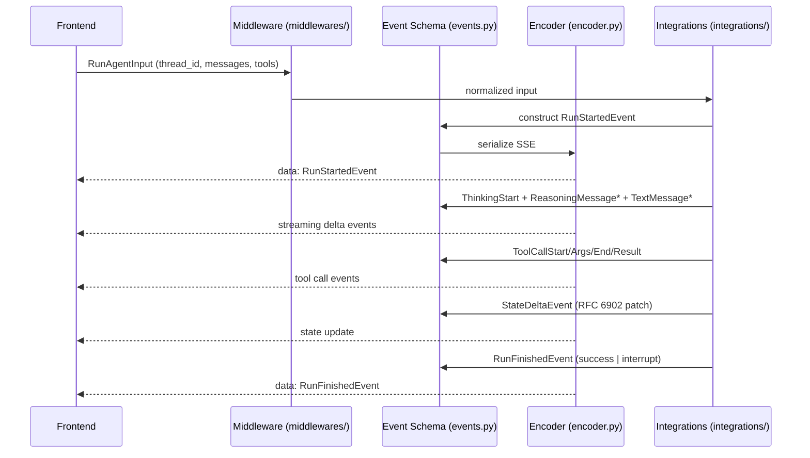
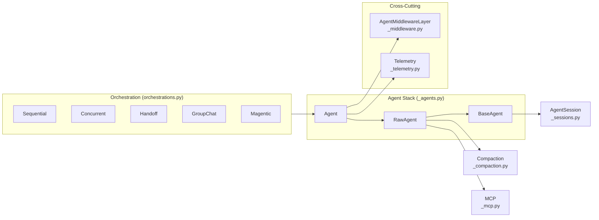
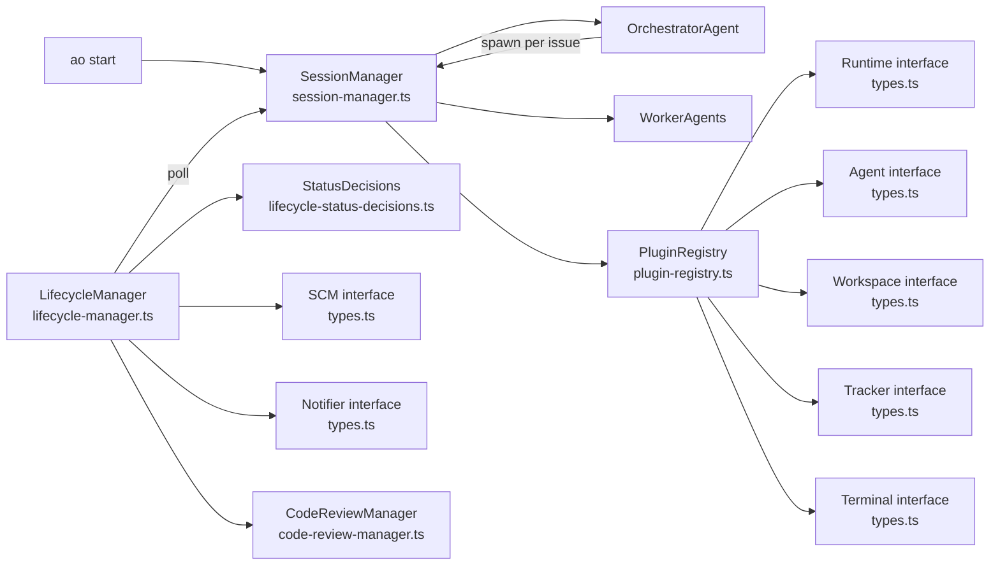
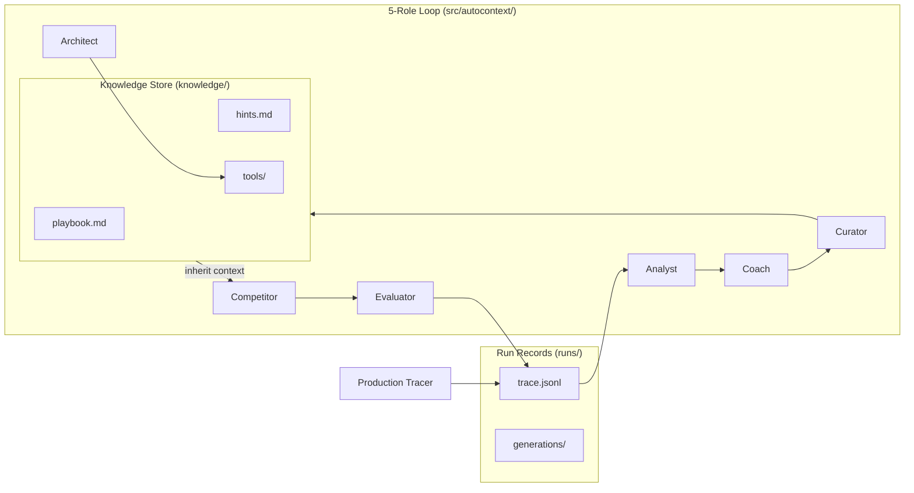

# Agentic AI Weekly Scan — 2026-06-10

## Executive Summary

- **AG-UI** chuẩn hóa giao tiếp agent↔frontend thành một giao thức sự kiện 30+ event type, với bidirectional state sync qua RFC 6902 JSON Patch và Interrupt/Resume là first-class concept — lần đầu "frontend protocol" cho agent được standardize rộng ngang MCP.
- **Microsoft Agent Framework** là framework production-grade đầy đủ nhất tuần: ba-tầng agent hierarchy, 5 orchestration pattern (Magentic One built-in), 15+ provider, OpenTelemetry, dual Python/C# — trọng tâm là composability qua `agent.as_tool()`.
- **AgentWrapper/agent-orchestrator** giải quyết bài toán cụ thể: orchestrate coding agents song song trong git worktree độc lập với reaction system có escalation budget cho CI/review failures — plugin 7-slot là điểm kỹ thuật nổi bật nhất tuần.

## Table of Contents

1. [ag-ui-protocol/ag-ui](#1-ag-ui-protocolag-ui)
2. [microsoft/agent-framework](#2-microsoftagent-framework)
3. [AgentWrapper/agent-orchestrator](#3-agentwrapperagent-orchestrator)
4. [greyhaven-ai/autocontext](#4-greyhaven-aiautocontext)

---

## 1. ag-ui-protocol/ag-ui

**GitHub:** https://github.com/ag-ui-protocol/ag-ui

### §1 — Quick Context

Giao thức sự kiện mở chuẩn hóa cách agent backend kết nối với frontend ứng dụng theo thời gian thực.

- **Tech stack:** TypeScript (primary), Python SDK + 8 ngôn ngữ khác; transport SSE/WebSocket; Pydantic v2; Nx + pnpm monorepo
- **Repo health:** 14,173 ★ | MIT | CI `.github/` | Integrations: LangGraph, CrewAI, Google ADK, AWS Strands, Magentic One, Pydantic AI và nhiều hơn | pushed tuần này

### §2 — Architecture Deep-Dive

#### A. Component Inventory

| Component | File Path | Vai trò |
|-----------|-----------|---------|
| `Event Schema` | `sdks/python/ag_ui/core/events.py` | 30+ typed event class: TextMessage, ToolCall, State, Reasoning, RunLifecycle, Steps, Custom |
| `Type System` | `sdks/python/ag_ui/core/types.py` | `RunAgentInput`, message hierarchy (DeveloperMessage → ReasoningMessage), Tool, Interrupt, ResumeEntry |
| `Encoder` | `sdks/python/ag_ui/encoder/encoder.py` | SSE serialization: `data: {json}\n\n`, media type `application/vnd.ag-ui.event+proto` |
| `Middleware` | `middlewares/` | Adapter layer đảm bảo cross-framework compatibility |
| `Integrations` | `integrations/` | LangGraph, CrewAI, Google ADK adapters |

#### B. Control Flow — Event-Driven

**Pattern:** Event-driven (frontend → agent → SSE stream → frontend)

1. Frontend gửi `RunAgentInput` (thread_id, run_id, messages, tools schema, optional `resume` array)
2. Agent emit `RunStartedEvent`, bắt đầu streaming: `ThinkingStart` → `ReasoningMessage*` events
3. Text output: `TextMessageStart/Content/End` với delta streaming
4. Tool calls: `ToolCallStart` → `ToolCallArgs` → `ToolCallEnd` → `ToolCallResult`
5. State sync: `StateDeltaEvent` (RFC 6902 JSON Patch) hoặc `StateSnapshotEvent`
6. `RunFinishedEvent` với outcome: success hoặc interrupt variant → frontend gửi `ResumeEntry` cho human-in-the-loop

#### C. State & Data Flow

- **Message format:** Typed Pydantic models, camelCase aliases — stateless ở protocol level
- **State sync:** `StateDeltaEvent.delta` dùng RFC 6902 JSON Patch, fine-grained partial updates
- **Context management:** Không định nghĩa ở protocol layer — delegate to agent backend

#### D. Tool Integration

Tools là JSON Schema objects trong `RunAgentInput.tools`; model gọi native function-calling, protocol chỉ chuẩn hóa event sequence: `ToolCallStart→Args→End→Result`.

#### E. Memory Architecture

Không định nghĩa ở protocol level — memory là concern của agent backend.

#### F. Model Orchestration

Provider-agnostic hoàn toàn — AG-UI chỉ định nghĩa I/O event stream, không dependency vào model cụ thể.

#### G. Observability & Eval

`CustomEvent(name, value)` cho app-specific telemetry; `StepStartedEvent/StepFinishedEvent` cho pipeline step tracking. `RawEvent(event, source)` pass-through native framework events. Không có built-in tracing framework — delegated to integration layer.

#### H. Extension Points

Custom events, middleware adapters (`middlewares/` directory), multi-language SDKs (8+ languages: Kotlin, Go, Dart, Java, Rust, Ruby, C++), transport-agnostic (SSE default, WebSocket/webhook supported). AGUI_MEDIA_TYPE (`application/vnd.ag-ui.event+proto`) cho protocol negotiation.

**Đặc điểm kỹ thuật nổi bật của message format:** Tất cả events kế thừa `BaseEvent(type, timestamp, raw_event)` với discriminated union trên field `type` — cho phép type-safe deserialization. `RunFinishedOutcome` phân biệt success và interrupt variant qua `field_validator` (interrupts list non-empty = interrupt). Design này tránh được nullable union ambiguity phổ biến trong event protocols.

---

### §3 — Architecture Diagram

---

### §4 — Verdict

**Điểm novel:** RFC 6902 JSON Patch cho state sync tránh truyền toàn bộ state; Interrupt/Resume là first-class protocol construct, không phải workaround; `ReasoningEncryptedValueEvent` gợi ý dùng cho production privacy use cases.

**Red flags:** Protocol không định nghĩa auth/authorization — mỗi implementation tự handle, fragmentation risk cao; không specify conflict resolution khi multiple clients connect cùng agent thread.

**Open questions:** `ReasoningEncryptedValueEvent` (subtype, entity_id, encrypted_value) phục vụ production use case gì cụ thể? State sync ordering được đảm bảo bởi ai khi nhiều frontend clients connect cùng thread?

---

## 2. microsoft/agent-framework

**GitHub:** https://github.com/microsoft/agent-framework

### §1 — Quick Context

Framework đa ngôn ngữ (Python + C#) cho production-grade AI agent với 5 orchestration pattern và OpenTelemetry built-in.

- **Tech stack:** Python 3.10+ (50.8%), C#/.NET (45.9%), TypeScript (2.8%); Azure OpenAI/OpenAI/Anthropic/Bedrock/Gemini/Mistral/Ollama — 15+ providers; OpenTelemetry; Pydantic
- **Repo health:** 11,198 ★ | MIT | devcontainer | TRANSPARENCY_FAQ (responsible AI) | 30+ packages | pushed tuần này

### §2 — Architecture Deep-Dive

#### A. Component Inventory

| Component | File Path | Vai trò |
|-----------|-----------|---------|
| `BaseAgent` | `python/packages/core/agent_framework/_agents.py` | Foundational: session management, context providers, tool wrapping — không có `run()` |
| `RawAgent` | `python/packages/core/agent_framework/_agents.py` | Extends BaseAgent: chat client integration, message prep, response parsing |
| `Agent` | `python/packages/core/agent_framework/_agents.py` | Full-stack = RawAgent + AgentMiddlewareLayer + AgentTelemetryLayer |
| `AgentMiddlewareLayer` | `python/packages/core/agent_framework/_middleware.py` | Request/response pipeline, per-service-call history persistence |
| `Compaction` | `python/packages/core/agent_framework/_compaction.py` | Tokenizer-aware context window management |
| `Evaluation` | `python/packages/core/agent_framework/_evaluation.py` | Eval hooks cho agent output |
| `Telemetry` | `python/packages/core/agent_framework/_telemetry.py` | OpenTelemetry distributed tracing |
| `SequentialBuilder` | `python/packages/orchestrations/agent_framework_orchestrations/orchestrations.py` | Chain agents in sequence, pass conversation context |
| `ConcurrentBuilder` | `python/packages/orchestrations/agent_framework_orchestrations/orchestrations.py` | Parallel execution, aggregate results |
| `HandoffBuilder` | `python/packages/orchestrations/agent_framework_orchestrations/orchestrations.py` | Decentralized routing: agent tự quyết định handoff target |
| `GroupChatBuilder` | `python/packages/orchestrations/agent_framework_orchestrations/orchestrations.py` | Orchestrator-directed multi-agent conversation |
| `MagenticBuilder` | `python/packages/orchestrations/agent_framework_orchestrations/orchestrations.py` | Magentic One pattern với Ledger và progress tracking |
| `MCP Integration` | `python/packages/core/agent_framework/_mcp.py` | MCP server normalization, AsyncExitStack connection management |

#### B. Control Flow — Hierarchical (Multiple Patterns)

**Pattern:** Hierarchical với 5 configurable orchestration sub-patterns

`Agent.run()` happy path (5 bước):

1. `_prepare_run_context`: merge options, normalize tools (MCP via AsyncExitStack), resolve AgentSession history, apply compaction
2. `_call_chat_client`: invoke model với prepared messages + tools (streaming hoặc non-streaming)
3. Parse response: streaming chains qua transformation hooks; non-streaming qua `_parse_non_streaming_response`
4. `after_run` callbacks: context providers execute theo reverse order (cleanup, history persistence)
5. Session update: conversation IDs propagate về AgentSession

#### C. State & Data Flow

- **Message format:** Typed Python classes — DeveloperMessage, SystemMessage, AssistantMessage, UserMessage, ToolMessage, ReasoningMessage
- **State storage:** `AgentSession` in-memory; Redis backend qua `python/packages/redis/`
- **Context management:** `_compaction.py` — tokenizer-aware strategies; per-service-call persistence inject tự động khi `require_per_service_call_history_persistence=True`

#### D. Tool Integration

`agent.as_tool()` converts bất kỳ Agent thành FunctionTool cho agent khác — recursive composition. MCP servers auto-connected qua AsyncExitStack, deduplicated by name.

#### E. Memory

Short-term: AgentSession history. Long-term: mem0 package (`python/packages/mem0/`). Compaction: `_compaction.py` strategies.

#### G. Observability

OpenTelemetry (`_telemetry.py`, `observability.py`); DevUI (`python/packages/devui/`) cho interactive debugging; checkpointing + time-travel debugging trong workflow context.

---

### §3 — Architecture Diagram

---

### §4 — Verdict

**Điểm novel:** `agent.as_tool()` là pattern elegant nhất: hierarchical composition tự nhiên không cần orchestration framework riêng. Per-service-call history persistence middleware inject tự động là ví dụ tốt về production concern được handle ở framework level. MagenticBuilder có research backing từ Magentic One paper, không phải pattern marketing.

**Red flags:** Package explosion (30+ packages) khó navigate; dual Python/C# maintenance burden; `_compaction.py` strategy behavior khi compaction fail không được document rõ.

**Open questions:** MagenticBuilder implement Ledger như thế nào — có giữ nguyên original Magentic One design không? Checkpointing/time-travel debugging nằm ở layer nào — `_sessions.py` hay orchestration engine riêng?

---

## 3. AgentWrapper/agent-orchestrator

**GitHub:** https://github.com/AgentWrapper/agent-orchestrator

### §1 — Quick Context

Orchestrate nhiều coding agent song song trong git worktree độc lập, tự động route CI failures và review comments về đúng agent.

- **Tech stack:** TypeScript 89.7%, pnpm monorepo; runtime: tmux/Docker; agents: Claude Code/Codex/Aider/Cursor/OpenCode; trackers: GitHub/Linear/GitLab/Jira
- **Repo health:** 7,476 ★ | MIT | 3,288 test cases | ARCHITECTURE.md + DESIGN.md | dashboard web | pushed tuần này

### §2 — Architecture Deep-Dive

#### A. Component Inventory

| Component | File Path | Vai trò |
|-----------|-----------|---------|
| `SessionManager` | `packages/core/src/session-manager.ts` | Spawn/restore/kill sessions; manage OrchestratorAgent và WorkerAgents |
| `LifecycleManager` | `packages/core/src/lifecycle-manager.ts` | Polling loop, status determination pipeline, reaction dispatch, escalation tracking |
| `PluginRegistry` | `packages/core/src/plugin-registry.ts` | Load/resolve 7-slot plugin system |
| `Runtime interface` | `packages/core/src/types.ts` | Execution env abstraction (create/destroy/sendMessage/getOutput/isAlive) |
| `Agent interface` | `packages/core/src/types.ts` | Coding agent abstraction (getLaunchCommand/detectActivity/getActivityState) |
| `Workspace interface` | `packages/core/src/types.ts` | Code isolation: git worktree hoặc clone |
| `Tracker interface` | `packages/core/src/types.ts` | Issue tracking (getIssue/listIssues/generatePrompt) |
| `SCM interface` | `packages/core/src/types.ts` | PR/CI lifecycle (detectPR/getCIChecks/getReviews/getMergeability) |
| `Notifier interface` | `packages/core/src/types.ts` | Human notification (notify/notifyWithActions) |
| `Terminal interface` | `packages/core/src/types.ts` | Human interaction UI (openSession/openAll) |
| `StatusDecisions` | `packages/core/src/lifecycle-status-decisions.ts` | Status determination: Runtime→Activity→Process→PR→AgentReport→IdleThreshold |
| `CodeReviewManager` | `packages/core/src/code-review-manager.ts` | Review comment categorization và dispatch |

#### B. Control Flow — Hierarchical (Supervisor → Workers)

**Pattern:** Hierarchical với AI supervisor + deterministic lifecycle manager

1. `ao start` → dashboard + OrchestratorAgent spawned (`SessionManager.spawnOrchestrator()`) trong tmux
2. OrchestratorAgent (AI) đọc issues từ Tracker → gọi `SessionManager.spawn()` per issue
3. `spawn()`: `Workspace.create()` (git worktree) → `Runtime.create()` → `Agent.getLaunchCommand()` → process launched
4. WorkerAgent tự động đọc code, viết tests, commits, mở PR
5. `LifecycleManager.pollAll()` periodic: batch enrich PRs qua GraphQL → determine status per session
6. CI failure: `getCIFailureSummary()` → format log context → `sessionManager.send()` → agent self-fixes
7. Review comments: `maybeDispatchReviewBacklog()` categorize human vs. bot → send với file/line context
8. PR merged → terminal state → cleanup worktree

#### C. State & Data Flow

- **Message format:** TypeScript typed interfaces (Session, PRInfo, CICheck, ReviewComment)
- **State storage:** `~/.agent-orchestrator/{sha256-hash}-{projectId}/sessions/` — key-value metadata filesystem
- **PR enrichment:** Batch GraphQL với ETag optimization → cached vào session metadata
- **Activity signal:** Multi-source confidence model: `native | terminal | hook | runtime` → ActivityState + validity

#### D. Tool Integration

Agent plugins implement `getLaunchCommand()`, `detectActivity()`, `sendMessage()`. Interaction qua terminal message passing — không có direct tool calling từ orchestrator layer.

#### G. Observability

`events-db.ts` (SQLite event log), `gh-trace.ts` (GitHub ops tracing), `observability.ts`; cost tracking via `AgentSessionInfo.cost`; real-time dashboard.

#### H. Extension Points

7 plugin slots: mỗi slot swap bằng external npm package (`plugin.package`) hoặc local path. `preflight?()` hooks validate prerequisites. `reactions` config cho custom automated responses.

---

### §3 — Architecture Diagram

---

### §4 — Verdict

**Điểm novel:** Persistent CI failure trackers (`PERSISTENT_REACTION_KEYS`) không reset khi CI oscillate — escalation budget tích lũy qua oscillations, chính xác hơn. Activity confidence model với `state: valid|stale|null|unavailable|probe_failure` là explicit uncertainty representation. Batch GraphQL ETag optimization cho enrichment cycle. 7-slot plugin composition genuinely modular — thêm k8s runtime không ảnh hưởng slots khác.

**Red flags:** Polling-based lifecycle — latency giữa event thực tế và detection lên đến 1 poll interval; interaction qua terminal message passing fragile nếu agent đang mid-input; `orchestratorSessionStrategy` có 6 options phức tạp hơn cần thiết.

**Open questions:** OrchestratorAgent (AI) và `LifecycleManager` (deterministic) tương tác nhau không hay hoàn toàn tách biệt? `openclaw-plugin/` directory — OpenClaw là gì trong ecosystem này?

---

## 4. greyhaven-ai/autocontext

**GitHub:** https://github.com/greyhaven-ai/autocontext

### §1 — Quick Context

Harness tự cải thiện đệ quy: 5 vai trò cooperative tích lũy knowledge vào playbook trên filesystem qua nhiều generations.

- **Tech stack:** Python (`src/autocontext/`), TypeScript (`ts/`), Pi extension (`pi/`); multi-provider: Anthropic/OpenAI/Gemini/Mistral/Groq/OpenRouter/Azure/MLX; SQLite + filesystem
- **Repo health:** 1,196 ★ | CHANGELOG.md | CI `.github/` | 11 scenario families | MCP integration (`.claude/skills/`) | version 0.6.0 | pushed tuần này

### §2 — Architecture Deep-Dive

#### A. Component Inventory

> Note: Fetch file `.py` cụ thể trong `src/autocontext/` trả về 404 — các role components có directory-level evidence từ GitHub listing, không có file-level path.

| Component | File Path | Vai trò |
|-----------|-----------|---------|
| `Competitor role` | `src/autocontext/` (directory confirmed) | Đề xuất strategy hoặc artifact cho task ở generation K |
| `Analyst role` | `src/autocontext/` (directory confirmed) | Phân tích trace, giải thích outcomes và nguyên nhân |
| `Coach role` | `src/autocontext/` (directory confirmed) | Convert analysis thành playbook updates và hints |
| `Architect role` | `src/autocontext/` (directory confirmed) | Đề xuất tool mới hoặc harness modifications khi loop stall |
| `Curator role` | `src/autocontext/` (directory confirmed) | Gate quality: kiểm soát knowledge nào được persist qua runs |
| `Knowledge Store` | `knowledge/` (directory confirmed) | `playbook.md`, `hints.md`, `tools/` — long-term accumulated knowledge |
| `Run Records` | `runs/` (directory confirmed) | Per-run: `trace.jsonl`, `generations/`, `report.md`, `artifacts/` |
| `Protocol` | `protocol/` (directory confirmed) | Protocol definitions cho harness communication |
| `Production Tracer` | ref. trong README: `autocontext.production_traces.instrument_client` | Wrap Anthropic/OpenAI clients, capture live traces cho distillation |

#### B. Control Flow — Iterative Self-Improvement Loop

**Pattern:** Generational improvement loop với verifier-driven gating

1. `autoctx solve "goal" --iterations N` → scenario auto-generated
2. Load `knowledge/playbook.md` + `knowledge/hints.md` làm inherited context
3. **Competitor** proposes strategy cho generation K
4. Evaluator executes trong scenario → ghi `runs/{run_id}/trace.jsonl`
5. **Analyst** đọc trace → explains what/why
6. **Coach** converts analysis → draft `playbook.md` + `hints.md` updates
7. **Architect** đề xuất tools mới nếu loop stall → lưu vào `knowledge/tools/`
8. **Curator** gates: chỉ validated knowledge persist vào `knowledge/`; unsuccessful changes rollback
9. Generation K+1 inherit updated `knowledge/` → repeat đến verifier satisfied hoặc max iterations

#### C. State & Data Flow

- **Message format:** Không xác định từ code (file-level 404) — likely dict/JSON với trace context
- **State storage:** Filesystem-first: `knowledge/` (long-term), `runs/` (per-run); SQLite cho metadata indexing
- **Context management:** Toàn bộ `playbook.md` + `hints.md` inject mỗi generation — không có RAG/chunking

#### D. Tool Integration

MCP protocol cho Claude Code, Pi; Python + TypeScript SDKs; `instrument_client(Anthropic(), app="..")` production wrapper; tools generated dynamically bởi Architect → `knowledge/tools/`.

#### E. Memory

- **Short-term:** `trace.jsonl` per run
- **Long-term:** `knowledge/playbook.md` (lessons), `knowledge/hints.md` (strategies), `knowledge/tools/` (generated utilities)
- **Compaction:** Coach role converts raw trace → structured entries; Curator gates quality

#### G. Observability

`trace.jsonl` (complete log), `generations/` (per-gen scores), `report.md` (human-readable); `autoctx replay <run_id>` để inspect trước khi persist; `instrument_client` cho production traces.

---

### §3 — Architecture Diagram

---

### §4 — Verdict

**Điểm novel:** Curator role như knowledge quality gatekeeper — ngăn knowledge pollution qua generations (anti-accumulation-debt); Architect role tạo tools dynamically mà không cần developer can thiệp; `autoctx train` distill filesystem knowledge thành cheaper local models trong một workflow; 11 scenario families bao gồm `tool_fragility` (API drift) và `schema_evolution` (mid-run state changes) — coverage breadth production-grade.

**Red flags:** File-level implementation của 5 roles opaque — architecture chủ yếu documented ở README level; playbook inject toàn bộ vào context mỗi generation → context bloat nếu knowledge base lớn; SQLite + filesystem có potential concurrency issues với parallel runs.

**Open questions:** Curator dùng scoring threshold hay LLM-judge để gate knowledge? Architect role generate code tools rồi sandbox-execute như thế nào — security boundary ở đâu? Cross-provider knowledge transfer có hoạt động không (run 1 dùng Anthropic, run 2 dùng Gemini)?
