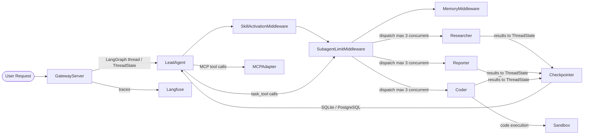
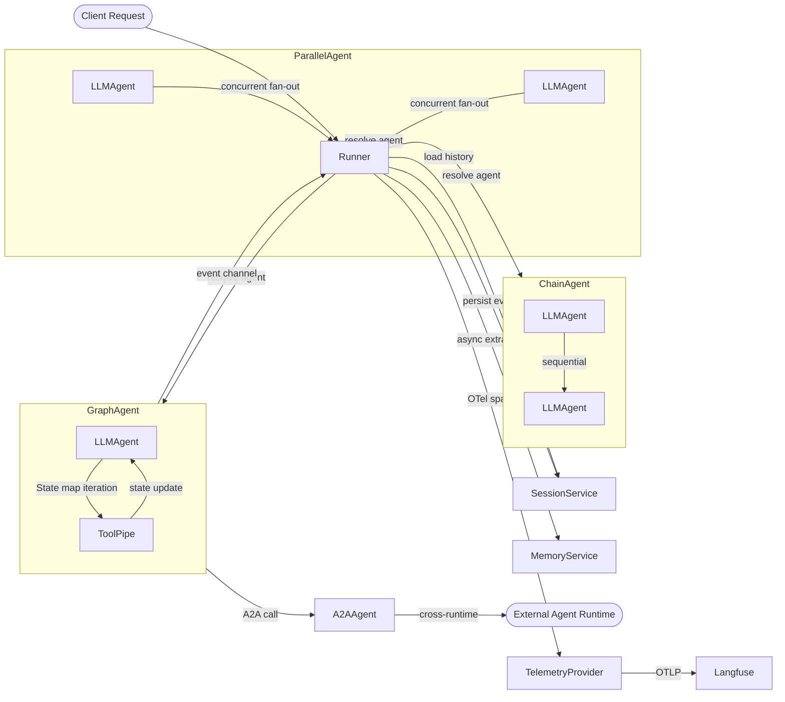
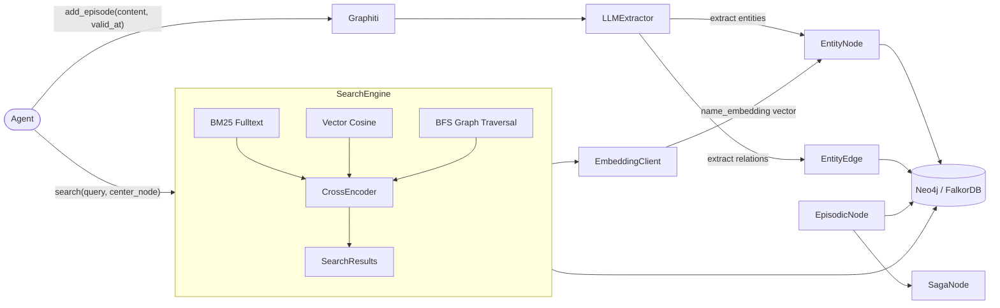
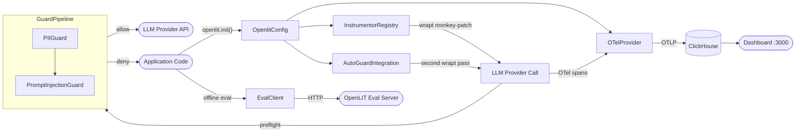

# Agentic AI Weekly Scan — 2026-06-11

## Executive Summary

- **DeerFlow 2.0** (ByteDance) nổi bật tuần này với kiến trúc hierarchical multi-agent dùng LangGraph, Skill system Markdown-based và middleware pipeline — pattern dễ mở rộng nhưng còn phụ thuộc nặng vào global config.
- **trpc-agent-go** (Tencent) là framework Go hiếm hoi đạt production-grade: native graph agent, 3 composition pattern (chain/parallel/cycle), A2A cross-runtime interop và OTel built-in — đáng học cho bất kỳ ai cần agent ở môi trường Go.
- **Graphiti** (Zep AI) giải quyết bài toán memory khác biệt với temporal knowledge graph — edges có validity window, 5 reranking strategy — thay vì vector search thuần túy.
- **OpenLIT** là lớp observability hoàn chỉnh nhất cho agent ecosystem: 50+ instrumentor, guard pipeline cho security, offline eval endpoint — đáng drop-in vào bất kỳ production agent nào.

## Table of Contents

1. [bytedance/deer-flow — DeerFlow 2.0 SuperAgent Harness](#1-bytedancedeer-flow)
2. [trpc-group/trpc-agent-go — Go Production Agent Framework](#2-trpc-grouptrpc-agent-go)
3. [getzep/graphiti — Temporal Knowledge Graph Memory](#3-getzepgraphiti)
4. [openlit/openlit — OpenTelemetry-native LLM Observability](#4-openlitorphanlit)

---

## 1. bytedance/deer-flow

> **Link**: https://github.com/bytedance/deer-flow  
> **Tìm thấy qua**: pushed:>2026-06-01, 70,932 stars

### §1 — Quick Context

**One-line pitch**: Platform multi-agent long-horizon nghiên cứu và code với sub-agent isolation và Skill Markdown-based.

**Tech stack**: Python 3.12+, LangChain ≥1.2.15, LangGraph ≥1.1.9, langchain-mcp-adapters, Node.js 22+ (frontend), SQLite/PostgreSQL (checkpoint), DuckDB, Langfuse/LangSmith (observability), Docker/Kubernetes.

**Models**: Claude, GPT-4, Gemini, Qwen3, DeepSeek, vLLM local. LeadAgent dùng frontier model; sub-agent có thể dùng model nhỏ hơn theo config.

**Repo health**: 70,932 stars, active CI (tests trong `backend/tests/`), last push 2026-06-11, 57 contributors, AGPL-3.0.

---

### §2 — Architecture Deep-Dive

#### A. Component Inventory

- `LeadAgent` (`backend/packages/harness/deerflow/agents/lead_agent/agent.py`) — orchestrator chính, nhận user request, phân công sub-agent, tổng hợp kết quả.
- `AgentFactory` (`backend/packages/harness/deerflow/agents/factory.py`) — factory tạo `CompiledStateGraph` từ LangGraph; nhận middleware list, feature flags, checkpointer.
- `ThreadState` (`backend/packages/harness/deerflow/agents/thread_state.py`) — shared state schema cho cả graph, được inject vào mỗi middleware node.
- `SkillActivationMiddleware` (trong `lead_agent/agent.py`) — parse `/skill-name` prefix, load full Markdown skill doc, giới hạn tool access theo skill whitelist.
- `SubagentLimitMiddleware` (trong `lead_agent/agent.py`) — throttle số parallel sub-agent calls (default `max_concurrent_subagents=3`), ngăn combinatorial explosion.
- `MemoryMiddleware` (trong `lead_agent/agent.py`) — queue conversation updates sau mỗi turn, trigger `memory_flush_hook` trước summarization.
- `task_tool` (tool đặc biệt, referenced từ `factory.py`) — tool dùng để spawn sub-agent; được register khi `subagent_enabled=True`.
- `SubAgents` (Coordinator, Planner, Researcher, Coder, Reporter — referenced từ `backend/tests/test_lead_agent_prompt.py` và demo content) — các worker agent chuyên biệt.
- `Sandbox` (Agent Sandbox — `agent-sandbox >=0.0.19` trong `pyproject.toml`) — isolated execution environment (local/Docker/Kubernetes) cho code execution.
- `MCPAdapter` (`langchain-mcp-adapters >=0.2.2` trong `pyproject.toml`) — wrap MCP server tools thành LangChain tools chuẩn.
- `Checkpointer` (`langgraph-checkpoint-sqlite`, `langgraph-checkpoint-postgres`) — persistent state cho LangGraph threads.
- `GatewayServer` (`backend/`) — HTTP server quản lý thread, SSE streaming, LangGraph orchestration.

#### B. Control Flow — Hierarchical Pattern

Pattern: **Hierarchical (supervisor → workers)** — LeadAgent làm supervisor, spawn sub-agent thông qua `task_tool`.

Happy path cho research task:

1. User gửi query tới `GatewayServer`, server tạo LangGraph thread với `ThreadState`.
2. `LeadAgent` nhận state, `SkillActivationMiddleware` kiểm tra `/skill-name` prefix và filter tool catalog.
3. LeadAgent gọi LLM (frontier model), LLM quyết định decompose thành sub-tasks, emit `task_tool` calls.
4. `SubagentLimitMiddleware` intercept, throttle xuống `max_concurrent_subagents=3`, dispatch tới các sub-agent (Researcher, Coder).
5. Sub-agents thực thi trong Sandbox riêng biệt (isolated `/mnt/user-data/` context), kết quả trả về dạng tool results trong `ThreadState`.
6. LeadAgent nhận tất cả sub-agent results, gọi Reporter sub-agent để synthesize, `MemoryMiddleware` queue conversation update.

#### C. State & Data Flow

- Message format: `ThreadState` (typed Pydantic/dataclass schema) — không dùng raw `dict`, được inject vào mỗi middleware node của LangGraph graph.
- State storage: SQLite (default via `langgraph-checkpoint-sqlite`), PostgreSQL (optional), DuckDB cho analytics.
- Context window management: `MemoryMiddleware` + `memory_flush_hook` trigger summarization trước khi context quá dài; `preserve_recent_skill_tokens_per_skill` config giữ skill context gần nhất.

#### D. Tool / Capability Integration

- Tool registration: `get_available_tools()` lấy full catalog → `filter_tools_by_skill_allowed_tools()` apply skill-based ACL → `assemble_deferred_tools()` phân loại immediate vs deferred (MCP tools).
- Model gọi tool: LangChain function-calling native (OpenAI/Anthropic tool use format) thông qua LangGraph node.
- Validation: `SubagentLimitMiddleware` validate số lượng concurrent calls; MCP tools qua `langchain-mcp-adapters` với OAuth `client_credentials`/`refresh_token` flows.
- Deferred MCP setup: MCP tools được setup lazily, không blocking initial graph compile.

#### E. Memory Architecture

- Short-term: `ThreadState` trong LangGraph graph — in-memory within thread.
- Long-term: `MemoryMiddleware` persist cross-session knowledge, deduplicates repeated facts.
- Summarization: `memory_flush_hook` trigger trước context-window overflow, per-agent memory isolation qua agent-name-based storage keys.
- Retrieval: không xác định rõ từ code (likely full-message lookup hoặc simple keyword).

#### F. Model Orchestration

- LeadAgent: frontier model (Claude Opus/GPT-4 hoặc theo `REACT_APP_DEFAULT_MODEL` config).
- Sub-agents: có thể override per-agent; factory validate model name safely với fallback to default.
- Không có explicit parallelism ở model layer — parallelism ở sub-agent dispatch (`max_concurrent_subagents`).

#### G. Observability & Eval

- **Langfuse**: trace correlation qua `session_id=thread_id`, `user_id`, `trace_name`, `tags` — reserved attributes.
- **LangSmith**: full tracing của LLM calls và tool executions.
- **Blocking-IO diagnostics**: `make detect-blocking-io` static scanner tìm event-loop hazards trong async code.
- **CI tests**: `backend/tests/` có `test_gateway_run_drain_shutdown.py`, `test_lead_agent_prompt.py`.
- **Gateway conformance**: Pydantic response schemas validation trong CI.

#### H. Extension Points

- Custom model: thêm provider qua `langchain-{provider}` package, register trong config.
- Custom skill: tạo Markdown file với skill spec, invoke bằng `/skill-name` prefix.
- Custom sub-agent: implement agent module, register trong agent factory.
- MCP server: configure HTTP/SSE MCP endpoint trong config, tool tự động available qua `MCPAdapter`.

---

### §3 — Architecture Diagram

---

### §4 — Verdict

**Điểm novel đáng học**:
- **Skill-as-Markdown**: skill được define bằng `.md` file, load lazily vào context chỉ khi user invoke — giảm context bloat một cách elegant.
- **SubagentLimitMiddleware**: throttling sub-agent concurrency ở middleware layer (không phải logic layer) — clean separation of concern.
- **Deferred MCP tool setup**: MCP tools không blocking graph compile, setup lazily — production-friendly.

**Red flags / Limitations**:
- `factory.py` documentation note: "injected runtime components may still read global config at invocation time" — global state smell, problematic khi chạy multi-tenant.
- DuckDB dependency (`>=1.4.4`) trong harness pyproject.toml nhưng chưa thấy rõ use case, có thể dead weight.
- Test suite còn mỏng — chỉ thấy 2 test files trong search results.

**Open questions**:
- Sub-agent context isolation thực sự hoạt động như thế nào — có shared LangGraph checkpoint không hay thực sự isolated thread?
- `deferred_setup` trong middleware builder làm gì cụ thể — lazy MCP connection pooling hay chỉ config binding?

---

## 2. trpc-group/trpc-agent-go

> **Link**: https://github.com/trpc-group/trpc-agent-go  
> **Tìm thấy qua**: pushed:>2026-06-01, 1,329 stars, Tencent OSS

### §1 — Quick Context

**One-line pitch**: Framework Go production-grade cho agent system với graph workflow, A2A, AG-UI và OpenTelemetry built-in.

**Tech stack**: Go 1.21+, openai/openai-go v1.12.0, OpenTelemetry v1.29.0 (full suite), trpc-a2a-go v0.2.5, trpc-mcp-go v0.0.10, zap logger, gRPC v1.65.0.

**Models**: OpenAI, DeepSeek, Anthropic-compatible APIs.

**Repo health**: 1,329 stars, 57 forks, pushed 2026-06-10, Apache 2.0, Tencent OSS, 153 MB size (substantial codebase).

---

### §2 — Architecture Deep-Dive

#### A. Component Inventory

- `Agent` interface (`agent/agent.go`) — core execution unit: `Run()`, `Tools()`, `Info()`, `SubAgents()`, `FindSubAgent()`.
- `LLMAgent` (`agent/llmagent/`) — base implementation kết hợp LLM inference + tool calling; `surface_runtime.go` quản lý streaming surface, `extension.go` handle extension points.
- `GraphAgent` (`agent/graphagent/`) — LangGraph-style state machine; `terminal_message_filter.go` xử lý terminal conditions; `graph.Graph` làm underlying struct.
- `ChainAgent` (`agent/chainagent/chain_agent.go`) — sequential composition của nhiều agents.
- `ParallelAgent` (`agent/parallelagent/options.go`) — concurrent fan-out với result merging.
- `CycleAgent` (`agent/cycleagent/structure_export.go`) — iterative loop cho đến khi termination condition.
- `A2AAgent` (`agent/a2aagent/a2a_converter.go`) — bridge tới external A2A-compliant agent runtimes (kể cả Python ADK).
- `CodexAgent` (`agent/codex/command.go`, `transcript.go`) — specialized code execution agent.
- `N8NAgent` (`agent/n8n/n8n_agent.go`) — integration với n8n workflow automation.
- `Runner` (`runner/runner.go`) — pipeline orchestrator: session management, agent selection, event loop, memory extraction.
- `SessionService` (referenced từ `runner/runner.go`) — persists conversation transcripts, state deltas.
- `MemoryService` (referenced từ `runner/runner.go`) — long-term memory, async extraction via `enqueueAutoMemoryJob()`.
- `ToolPipe` (`agent/extension/toolpipe/engine.go`, `wrapped_tool.go`) — middleware pipeline wrap tool calls.
- `ExtensionRegistry` (`agent/extension/registry.go`) — plugin registry cho agent extensions.
- `TodoEnforcer` (`agent/extension/todoenforcer/enforcer.go`, `format.go`) — enforce structured TODO format trong agent output.
- `TelemetryProvider` (`telemetry/`) — OpenTelemetry tracing, metrics, Langfuse export.
- `Server` (`server/`) — Gateway HTTP, AG-UI (SSE), A2A servers.
- `EvalFramework` (referenced từ README) — pluggable metrics, file-backed result storage.

#### B. Control Flow — State Machine / Graph Pattern

Pattern: **State machine / graph (LangGraph-style)** cho GraphAgent; plus **hierarchical** qua ChainAgent/ParallelAgent composition.

Happy path cho một GraphAgent request:

1. Client gửi request tới `Runner.Run(ctx, userID, sessionID, message, opts)`.
2. Runner gọi `getOrCreateSession()`, load history từ `SessionService`.
3. Runner resolve agent (direct injection → named registry → default fallback).
4. `Agent.Run(ctx, invocation)` trả về `<-chan *event.Event` — stream sự kiện bất đồng bộ.
5. `GraphAgent` init `State{messages, userInput, session, parentAgent}`, gọi `executor.Execute()`.
6. Graph executor traverse nodes theo conditional edges của `graph.Graph`; các nodes có thể fan-out tới `ParallelAgent`.
7. Events stream về Runner qua channel; `runEventLoop()` filter (bỏ partial/transient), persist qualified events qua `SessionService.AppendEvent()`.
8. Sau khi complete, Runner trigger `enqueueAutoMemoryJob()` async để extract memory.

#### C. State & Data Flow

- Message format: `State map[string]interface{}` — flexible map với typed constants (`StateKeyMessages`, `StateKeyUserInput`, `StateKeySession`, `StateKeyParentAgent`).
- State storage: `SessionService` persist conversation events + state deltas; `MemoryService` cho long-term. Backends: in-memory, Redis, S3, COS (referenced từ README).
- Context window: `PersistInterruptedAssistant` option để accumulate partial text khi run bị cancel — explicit interrupt recovery pattern.

#### D. Tool / Capability Integration

- Tool registration: Agent expose tools qua `Tools() []tool.Tool` method — interface-based registration, không global registry.
- Model gọi tool: LLM function-calling native (OpenAI tool use format) thông qua `LLMAgent`.
- `ToolPipe` (`agent/extension/toolpipe/engine.go`): middleware pipeline wrap tool execution — validation, logging, transformation có thể inject ở đây.
- MCP: `trpc-mcp-go v0.0.10` — Go-native MCP client implementation.
- A2A: `trpc-a2a-go v0.2.5` — cross-runtime agent calls qua A2A protocol, demo cross-call với Python ADK server.

#### E. Memory Architecture

- Short-term: `SessionService` — in-memory session hoặc persistent (Redis/S3/COS) conversation history.
- Long-term: `MemoryService` — async extraction sau mỗi run completion qua `enqueueAutoMemoryJob()`.
- Interrupt recovery: tích lũy partial text deltas khi run bị cancel; persist nếu `PersistInterruptedAssistant=true`.
- Retrieval: không xác định rõ từ code — likely full session lookup.

#### F. Model Orchestration

- `AgentFactory` pattern: factory function tạo agent per-request, config có thể depend on request context.
- Automatic prompt caching: "90% savings on cached content" — Native API prompt caching support.
- Parallelism: `ParallelAgent` xử lý concurrent execution với result merging.
- Fallback: Runner có default agent fallback khi named agent không tìm thấy.

#### G. Observability & Eval

- **OpenTelemetry**: full suite (trace, metrics, OTLP gRPC/HTTP export) — `go.opentelemetry.io/otel v1.29.0`.
- **Langfuse**: integration example trong telemetry package.
- **zap**: structured logging toàn stack.
- **EvalFramework**: repeatable eval sets, pluggable metrics, file-backed result storage, benchmarking over time.
- **Distributed tracing**: span attributes cho user/session identification, trace across model → tool → runner layers.

#### H. Extension Points

- Custom agent: implement `Agent` interface (`Run`, `Tools`, `Info`, `SubAgents`, `FindSubAgent`).
- Custom tool: implement `tool.Tool` interface, register trong agent's `Tools()`.
- Custom extension: register trong `ExtensionRegistry` (`agent/extension/registry.go`).
- Custom session/memory backend: inject `SessionService`/`MemoryService` interface implementations.
- A2A interop: `A2AAgent` cho heterogeneous runtime integration.

---

### §3 — Architecture Diagram

---

### §4 — Verdict

**Điểm novel đáng học**:
- **Go-native với đầy đủ composition patterns**: ChainAgent + ParallelAgent + CycleAgent + GraphAgent trong cùng framework — hiếm thấy ở Go ecosystem.
- **A2A cross-runtime**: gọi Python ADK agent từ Go runner qua chuẩn A2A — heterogeneous agent network production-ready.
- **ToolPipe middleware**: wrap tool calls bằng pipeline — clean point cho validation, rate limiting, logging mà không modify agent logic.
- **Interrupt recovery**: `PersistInterruptedAssistant` là pattern ít framework nào xử lý — quan trọng cho UX.

**Red flags / Limitations**:
- `State map[string]interface{}` — untyped state là footgun tiềm ẩn trong Go; typed state schema sẽ safer.
- Chỉ support OpenAI và DeepSeek theo go.mod — Anthropic "compatible" nhưng chưa thấy explicit adapter.
- Stars 1,329 còn thấp so với Python equivalents — adoption chưa rộng, ecosystem nhỏ.

**Open questions**:
- `graph.Graph` package (underlying cho `GraphAgent`) định nghĩa conditional routing như thế nào — có visual graph builder không?
- Memory retrieval strategy (long-term memory) là gì — vector search, keyword, hay full-scan?
- AG-UI protocol implementation có streaming partial tool results không?

---

## 3. getzep/graphiti

> **Link**: https://github.com/getzep/graphiti  
> **Tìm thấy qua**: pushed:>2026-06-01, 27,280 stars

### §1 — Quick Context

**One-line pitch**: Knowledge graph có temporal awareness cho agent memory — facts có validity window, không phải static snapshot.

**Tech stack**: Python 3.10+, Neo4j 5.26+ / FalkorDB 1.1.2+, OpenAI (default embedding+LLM), Anthropic/Gemini/Groq alternative, Pydantic, BM25 full-text, FastAPI (REST server), MCP server.

**Repo health**: 27,280 stars, 14,905 KB, last push 2026-06-10, Apache 2.0, active issues.

---

### §2 — Architecture Deep-Dive

#### A. Component Inventory

- `Graphiti` (`graphiti_core/graphiti.py`) — main interface: `add_episode()`, `add_episode_bulk()`, `search()`, `search_()`.
- `EntityNode` (`graphiti_core/nodes.py`) — graph node với `name_embedding`, `summary`, temporal `created_at`, dynamic `attributes`.
- `EpisodicNode` (`graphiti_core/nodes.py`) — raw episodic data với `source`, `content`, `entity_edges`, `valid_at` timestamp.
- `CommunityNode` (`graphiti_core/nodes.py`) — cluster của related entities với `name_embedding`, regional `summary`.
- `SagaNode` (`graphiti_core/nodes.py`) — narrative sequence tracker với `last_summarized_at` và `last_summarized_episode_valid_at`.
- `EntityEdge` (referenced từ `graphiti_core/`) — relationship với temporal validity window (start/end timestamps).
- `SearchEngine` (`graphiti_core/search/search.py`) — hybrid retrieval: `edge_search()`, `node_search()`, `episode_search()`, `community_search()`.
- `LLMExtractor` (referenced từ `graphiti_core/`) — extract entities và relations từ episode content bằng LLM + Pydantic structured output.
- `EmbeddingClient` (referenced từ `graphiti_core/`) — vector embeddings cho nodes và edges.
- `CrossEncoder` (referenced từ `graphiti_core/`) — neural reranker cho search results.
- `GraphitiClients` (referenced từ `graphiti_core/graphiti.py`) — coordinator container: driver + LLM + embedder + cross-encoder.
- `MCPServer` (`mcp_server/`) — MCP interface cho agent integration (Claude, Cursor, etc.).
- `RESTServer` (`server/`) — FastAPI HTTP API.

#### B. Control Flow — Data Pipeline + Episodic Memory Pattern

Pattern: **Data pipeline với episodic memory** — không phải agent orchestration framework mà là memory substrate cho agents.

Happy path khi agent thêm một episode mới:

1. Agent gọi `graphiti.add_episode(content="...", valid_at=datetime.now())`.
2. `Graphiti` dispatch tới `LLMExtractor` — LLM extract entities và relationships theo Pydantic schema.
3. `EmbeddingClient` generate `name_embedding` cho mỗi `EntityNode` mới.
4. Edge resolution: so sánh extracted facts với existing graph — determine semantic equivalence, detect contradictions.
5. Contradicted edges được đánh dấu `invalid_at=now()` (không delete), facts mới được insert với `valid_at`.
6. `EpisodicNode` được tạo, link tới `SagaNode` qua `HasEpisodeEdge` và `NextEpisodeEdge`.
7. Agent query bằng `graphiti.search(query, center_node_uuid=...)` — hybrid search + 5-strategy reranking.

#### C. State & Data Flow

- Message format: Pydantic models (`EntityNode`, `EpisodicNode`, `EntityEdge`) — fully typed.
- State storage: Neo4j 5.26+ (primary) hoặc FalkorDB 1.1.2+ — graph database với temporal indexes.
- Context window management: không applicable — Graphiti là external memory store, agent query on-demand thay vì maintain context internally.
- Temporal tracking: `valid_at`/`invalid_at` trên edges; `last_summarized_at` (wall-clock) và `last_summarized_episode_valid_at` (event-time) trên `SagaNode` — dual-watermark design.

#### D. Tool / Capability Integration

- Cơ chế: `MCPServer` (`mcp_server/`) expose Graphiti operations như MCP tools — `add_episode`, `search`, etc.
- Model gọi tool: MCP-native (agent dùng MCP client gọi Graphiti MCP server).
- Validation: Pydantic schema trên mỗi node/edge type — type safety at extraction và storage.

#### E. Memory Architecture

- Short-term: `EpisodicNode` — raw episodes theo chronological order trong `SagaNode` sequence.
- Long-term: `EntityNode` với evolving `summary` và `attributes` — summarized cross-episode knowledge.
- Summarization: incremental saga summarization qua `last_summarized_episode_valid_at` watermark — chỉ process episodes mới hơn watermark.
- Retrieval (5 strategies): **RRF** (Reciprocal Rank Fusion), **MMR** (Maximal Marginal Relevance — balance relevance vs diversity), **Cross-encoder** (neural reranking), **Node Distance** (graph proximity từ center node), **Episode Mentions** (frequency-based). Hybrid: BM25 fulltext + vector cosine similarity + BFS graph traversal, parallel execution via `semaphore_gather`.

#### F. Model Orchestration

- LLM dùng cho extraction và summarization (không phải orchestration) — model nhỏ hơn có thể dùng cho routine tasks.
- `GraphitiClients` allow inject custom LLM client per operation.
- Token tracking: `token_tracker` property expose LLM usage cho cost monitoring.

#### G. Observability & Eval

- OpenTelemetry: optional tracing trong `GraphitiClients` (`search_tracer` parameter trong search functions).
- Token usage: `token_tracker` property.
- Không có dedicated eval framework — test coverage qua standard pytest.

#### H. Extension Points

- Custom LLM/embedder: inject qua `GraphitiClients` constructor.
- Custom node/edge types: define Pydantic models kế thừa từ base types.
- Custom search config: `SearchConfig` với list of enabled search methods và reranker strategy.
- Alternative graph DB: FalkorDB adapter, Amazon Neptune, Kuzu (deprecated) — driver abstraction.

---

### §3 — Architecture Diagram

---

### §4 — Verdict

**Điểm novel đáng học**:
- **Dual-watermark temporal design**: `last_summarized_at` (wall-clock) vs `last_summarized_episode_valid_at` (event-time) — phân biệt processing time và business time rõ ràng, pattern này thường thấy ở stream processing nhưng hiếm ở agent memory.
- **Edge invalidation không xóa**: facts cũ được giữ nguyên với `invalid_at` timestamp — audit trail đầy đủ, query "what was true at time T" là first-class feature.
- **5 reranking strategies trong cùng pipeline**: RRF + MMR + CrossEncoder + NodeDistance + EpisodeMentions — đặc biệt `NodeDistance` (graph proximity) là retrieval signal độc đáo không có ở vector-only memory.

**Red flags / Limitations**:
- Neo4j dependency nặng cho small deployments — FalkorDB alternative nhẹ hơn nhưng ít battle-tested hơn.
- LLM extraction ở mỗi `add_episode()` có latency + cost không nhỏ — không phù hợp cho high-frequency real-time event streams.
- Temporal search filter không thấy rõ trong `search.py` — `valid_at` tracking tốt nhưng chưa rõ cách query "what was true at time T" được expose ở API level.

**Open questions**:
- Graph traversal depth limit trong BFS search là bao nhiêu — có risk combinatorial explosion ở large graphs không?
- `EdgeResolver` dùng LLM hay embedding similarity để detect contradictions?
- Community detection algorithm là gì (Louvain? Label propagation?) — ảnh hưởng tới `CommunityNode` quality.

---

## 4. openlit/openlit

> **Link**: https://github.com/openlit/openlit  
> **Tìm thấy qua**: pushed:>2026-06-01, 2,519 stars

### §1 — Quick Context

**One-line pitch**: Platform observability toàn diện cho LLM agents: OpenTelemetry-native, 50+ integrations, guard pipeline built-in.

**Tech stack**: Python SDK + TypeScript SDK + Go SDK, ClickHouse (storage), OpenTelemetry Collector, FastAPI (backend API), Next.js (dashboard), Docker Compose / Kubernetes/Helm.

**Models**: Vendor-neutral — instrument bất kỳ provider nào (OpenAI, Anthropic, Gemini, Groq, Bedrock, v.v.).

**Repo health**: 2,519 stars, 146,720 KB (lớn do cả dashboard), last push 2026-06-10, Apache 2.0, TypeScript primary language.

---

### §2 — Architecture Deep-Dive

#### A. Component Inventory

- `OpenlitConfig` (`sdk/python/src/openlit/_config.py`) — singleton configuration class, tránh circular imports.
- `InstrumentationLayer` (`sdk/python/src/openlit/__init__.py`) — `openlit.init()` entry point; dynamically instantiate và register 50+ instrumentors.
- `OTelProvider` (`sdk/python/src/openlit/otel/`) — setup `TracerProvider`, `MeterProvider`, `EventsProvider`; emit via OTLP (`otel/events.py`, `otel/metrics.py`).
- `InstrumentorRegistry` (implicit trong `__init__.py`) — map từ integration name → instrumentor class; conditional import based on library availability.
- Provider Instrumentors (`sdk/python/src/openlit/instrumentation/`) — per-provider modules: `openai/`, `anthropic/`, `groq/`, `cohere/`, `llamaindex/`, `crewai/`, `agno/`, `mem0/`, `mcp/`, `chroma/`, `qdrant/`, v.v.
- `MCPInstrumentor` (`sdk/python/src/openlit/instrumentation/mcp/async_mcp.py`) — instrument MCP tool calls với OTel spans.
- `GuardPipeline` (`sdk/python/src/openlit/guard/_pipeline.py`) — compose guards thành ordered evaluation chain.
- `GuardBase` (`sdk/python/src/openlit/guard/_base.py`) — abstract base cho tất cả guards: preflight/postflight phases, action types.
- `PIIGuard` (`sdk/python/src/openlit/guard/pii.py`) — ~25 regex patterns cho API keys, PII, secrets; <1ms local execution.
- `PromptInjectionGuard` (`sdk/python/src/openlit/guard/prompt_injection.py`) — regex patterns + optional user-provided callable cho ambiguous cases.
- `AutoGuardIntegration` (`sdk/python/src/openlit/guard/_integration.py`) — second wrapt pass trên LLM provider methods để guards run automatically.
- `EvalClient` (`sdk/python/src/openlit/evals/offline.py`) — thin HTTP client gửi prompt/response pairs tới OpenLIT server để evaluate.
- `ThreatTelemetry` (`sdk/python/src/openlit/threat.py`) — emit threat signals qua OTel traces.
- `CLI` (`sdk/python/src/openlit/cli/main.py`) — auto-instrumentation mà không cần code changes.
- `ClickHouseBackend` (trong dashboard backend) — time-series storage cho traces và metrics.
- `WebDashboard` (TypeScript/Next.js) — analytics UI tại `localhost:3000`.

#### B. Control Flow — Instrumentation-Based (Monkey-Patching)

Pattern: **Instrumentation-based** — monkey-patch LLM provider methods via `wrapt` library, không phải agent orchestration.

Happy path cho một OpenAI call được instrument:

1. Application gọi `openlit.init(otlp_endpoint="...", capture_message_content=True)`.
2. `OpenlitConfig` singleton được tạo; `OTelProvider` setup `TracerProvider` và `MeterProvider`.
3. `InstrumentationLayer` iterate qua enabled instrumentors, check library availability, gọi `instrument()` để monkey-patch provider methods.
4. `AutoGuardIntegration` thực hiện second wrapt pass — wrap lại provider methods với guard checks.
5. Application gọi `openai.chat.completions.create(...)` — OpenAI instrumentor intercept, tạo OTel span.
6. `GuardPipeline.run(phase="preflight", text=prompt)` — chạy PIIGuard, PromptInjectionGuard theo order.
7. Nếu guard action là `deny`: raise exception hoặc return deny response tùy `fail_open` setting.
8. LLM call proceed; response được capture; postflight guards chạy trên response.
9. Span được emit qua OTLP tới collector → ClickHouse → WebDashboard.

#### C. State & Data Flow

- Message format: OTel spans với GenAI semantic convention attributes — `gen_ai.system`, `gen_ai.request.model`, `gen_ai.usage.input_tokens`, v.v.
- State storage: ClickHouse time-series database — append-only traces và metrics.
- Context window: không applicable — OpenLIT là passive observer, không manage agent state.

#### D. Tool / Capability Integration

- Cơ chế: monkey-patching via `wrapt` — không cần thay đổi application code.
- `MCPInstrumentor` (`sdk/python/src/openlit/instrumentation/mcp/async_mcp.py`): wrap MCP async calls với OTel spans — `SpanKind` mapping per operation type.
- CLI auto-instrumentation: `openlit run script.py` — instrument mà không import vào code.
- Guard integration: `setup_auto_guards()` thực hiện second wrapt pass sau instrumentors đã wrap.

#### E. Memory Architecture

Không applicable — OpenLIT không manage agent memory; là pure observability layer.

#### F. Model Orchestration

Không applicable — vendor-neutral instrumentation; không dictate model routing.

#### G. Observability & Eval

- **OTel semantic conventions**: GenAI semantic conventions compliant — interop với Grafana, Jaeger, Tempo, v.v.
- **11 eval types** (server-side): hallucination, bias, toxicity, safety detection, prompt injection, PII leak, v.v.
- **Offline eval**: `EvalClient` (`sdk/python/src/openlit/evals/offline.py`) gửi prompt/response pairs tới server eval engine — decouple eval từ runtime.
- **Rule Engine**: conditional alerting dựa trên trace attributes.
- **GPU monitoring**: `collect_gpu_stats=True` option.
- **Exception tracking**: automatic exception spans.

#### H. Extension Points

- Custom instrumentor: implement instrumentor interface, register trong `disabled_instrumentors` blocklist (ngược lại — allowlist by default).
- Custom span attributes: `custom_span_attributes` dict inject vào mọi spans.
- Custom guard: implement `GuardBase`, add vào `GuardPipeline`.
- Custom eval: server-side eval engine nhận arbitrary prompt/response pairs qua `EvalClient`.
- Alternative storage: OTLP standard — route tới Grafana, Langfuse, hoặc any OTel-compatible backend.

---

### §3 — Architecture Diagram

---

### §4 — Verdict

**Điểm novel đáng học**:
- **Double-wrapping pattern**: instrumentors wrap first, guards wrap second (cùng `wrapt` layer) — guards run on every LLM call automatically mà không cần code changes trong application hay trong instrumentor. Pattern tách biệt concerns rất clean.
- **Offline eval endpoint**: `EvalClient` gửi prompt/response batch tới server-side eval engine — eval không blocking runtime, không cần embed judge model trong production binary.
- **CLI auto-instrumentation**: `openlit run script.py` approach theo OpenTelemetry Java agent pattern — zero-code-change observability.

**Red flags / Limitations**:
- ClickHouse dependency là overkill cho small teams — không có lightweight alternative storage adapter.
- `AutoGuardIntegration` thực hiện second wrapt pass có thể gây unexpected interaction nếu application cũng wrap cùng methods — wrapping order không được document rõ.
- 11 eval types nhưng chỉ có `offline.py` là thin HTTP client — toàn bộ eval logic nằm trên server, không thể inspect hay customize eval algorithm.

**Open questions**:
- Guard pipeline có support async context propagation không — quan trọng cho FastAPI/async LLM calls?
- OTel semantic conventions cho GenAI đang evolve nhanh — OpenLIT follow spec draft version nào, có migration path không?
- Dashboard TypeScript code có expose alerting webhooks không — hay chỉ visual?

---

*Scan thực hiện: 2026-06-11. Data source: GitHub search API + raw source file analysis. Repos được chọn dựa trên architectural novelty và production relevance, không phải star count.*
