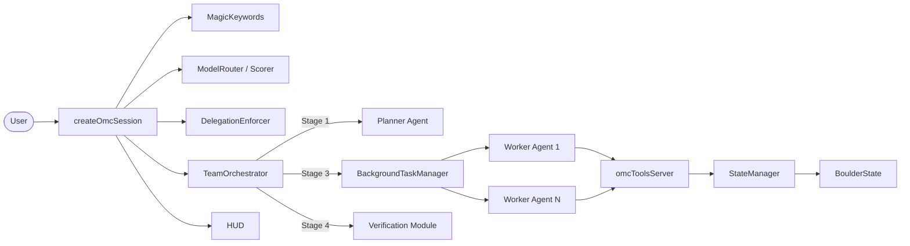
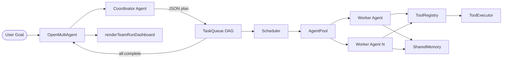
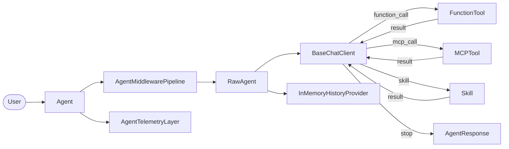
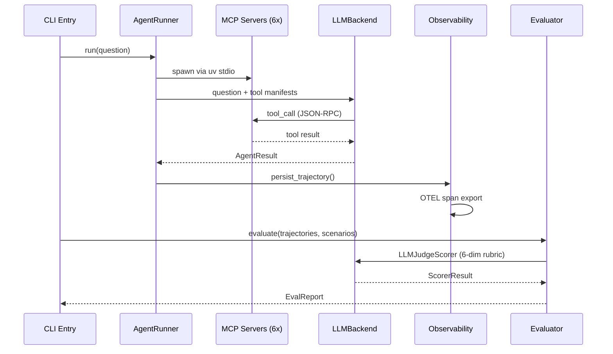

# Agentic AI Weekly Scan — 2026-06-12

## Executive Summary

- **Xu hướng tuần này:** DAG-based task decomposition và complexity-scored model routing nổi lên như hai pattern phân biệt nhau rõ ràng — `open-multi-agent` tự động hóa phân rã goal thành DAG song song, còn `oh-my-claudecode` dùng lexical/structural scoring để chọn model tier trước khi dispatch.
- **Production signal:** `microsoft/agent-framework` ra release dotnet-1.10.0 (2026-06-10) với Magentic-One pattern, Pregel-style Workflow graph, và two-phase ContextWindowCompaction — đây là framework duy nhất trong tuần có full OTel tracing + LLM-as-judge eval CI-gated.
- **Underdog đáng chú ý:** `IBM/AssetOpsBench` implement 4 orchestration pattern song song trên cùng một benchmark harness (ReAct / Planner-Executor / Hierarchical / ReAct+Code) — cho phép so sánh head-to-head kiến trúc agent trên dataset Industry 4.0 thực tế (460+ scenarios).

## Table of Contents

- [1. Yeachan-Heo/oh-my-claudecode](#1-yeachan-heooh-my-claudecode) — 36k⭐, TypeScript
- [2. open-multi-agent/open-multi-agent](#2-open-multi-agentopen-multi-agent) — 6.3k⭐, TypeScript
- [3. microsoft/agent-framework](#3-microsoftagent-framework) — 11.3k⭐, Python + .NET
- [4. IBM/AssetOpsBench](#4-ibmassetopsbench) — 1.8k⭐, Python

---

## 1. Yeachan-Heo/oh-my-claudecode

**Repo:** https://github.com/Yeachan-Heo/oh-my-claudecode

### §1 — Quick Context

**Pitch:** Tự động hóa vòng đời phát triển phần mềm bằng đội ngũ Claude Code agent chuyên biệt theo pipeline 5 giai đoạn có checkpoint.

**Tech stack:** TypeScript (Node ≥ 20), `@anthropic-ai/claude-agent-sdk`, `@modelcontextprotocol/sdk`, SQLite (`better-sqlite3`), Zod, Commander; tmux cho worker pane management.

**Repo health:** 36,241 ⭐ | version 4.14.6 | 7 GitHub Actions workflows (CI, PR-check, upgrade-test, release) | Vitest unit tests + benchmark suite | MIT license | active Discord community.

### §2 — Architecture Deep-Dive

**A. Component Inventory**

- `createOmcSession` (`src/index.ts`) — wires toàn bộ config, agents, MCP servers và trả về `queryOptions` cho Claude Agent SDK `query()`.
- `TeamOrchestrator` (`src/team/index.ts`) — engine 5-stage pipeline; quản lý worker spawn/lifecycle qua tmux panes, file-based inbox/outbox, heartbeats, và git worktrees per worker.
- `RalphthonOrchestrator` (`src/ralphthon/orchestrator.ts`) — PRD-driven persistence loop, single-leader architecture với hardening waves.
- `BackgroundTaskManager` (`src/features/background-tasks.ts`) — concurrency-capped (default: 5) async task queue; routes foreground vs. background via pattern matching.
- `calculateComplexityScore` / `routeTask` (`src/features/model-routing/scorer.ts` / `index.ts`) — scores lexical (+3 architecture), structural (+3 subtasks>3, +3 system-wide) và context signals (+2/failure); LOW<4→Haiku, 4–7→Sonnet, ≥8→Opus.
- `DelegationEnforcer` (`src/features/delegation-enforcer.ts`) — intercepts tool calls, normalizes model IDs, strips params cho non-Claude providers.
- `omcToolsServer` (`src/mcp/omc-tools-server.ts`) — in-process MCP server với 18+ tools: LSP, AST, Python REPL, Skills, Notepad, Memory, Trace, Shared Memory.
- `ToolRegistry` (`src/mcp/tool-registry.ts`) — `ToolDef` interface (name, description, Zod schema, async handler); Zod→JSON Schema tại runtime.
- `StateManager` (`src/features/state-manager/index.ts`) — atomic JSON writes tới `.omc/state/`; in-memory LRU cache (5s TTL, max 200 entries); TOCTOU-safe via `O_EXCL`.
- `BoulderState` (`src/features/boulder-state/index.ts`) — orchestrator working memory; persists plan identity + progress qua sessions.
- `MagicKeywords` (`src/features/magic-keywords.ts`) — regex prompt scanner; multilingual (EN/KO/JA/ZH/VI); triggers: `ultrawork` (parallel orchestration), `search`, `analyze`, `ultrathink` (extended reasoning).
- `Verification` (`src/features/verification/index.ts`) — 7 standard checks: BUILD, TEST, LINT, FUNCTIONALITY, ARCHITECT, TODO, ERROR_FREE; 5-minute evidence freshness TTL; parallel hoặc sequential mode.
- `HUD` (`src/hud/index.ts`) — real-time statusline: context window %, rate-limit buckets (5h/7d), active agents/tools/skills, session health (healthy/warning/critical).
- Agent personas: 19 markdown files trong `agents/` (planner, executor, architect, verifier, debugger, security-reviewer, v.v.).

**B. Control Flow — Hierarchical Planner-Executor với staged pipeline**

1. User invoke `/team N:agent-type "task"` → `MagicKeywords` scan + prompt enhancement → `createOmcSession` khởi tạo session.
2. **Plan stage:** `planner` (Opus) + `explore` (Haiku) scan codebase, build dependency-ordered task graph → `.omc/tasks/*.json`.
3. **PRD stage** (conditional): `analyst` (Opus) extract acceptance criteria + `critic` challenge scope → `prd.json`.
4. **Exec stage:** `TeamOrchestrator` spawn N workers song song trong tmux panes; mỗi worker claim task → execute → report completion qua `SendMessage` → unblock dependencies.
5. **Verify stage:** `verifier` (Sonnet) chạy 7 checks; risk-escalation thêm `security-reviewer`/`code-reviewer` (Opus) nếu auth/crypto changes hoặc >20 file diffs.
6. **Fix loop:** nếu fail → `debugger` (Sonnet) fix → quay lại exec → verify; bounded iterations; terminal `failed` state nếu exceed max.

**C. State & Data Flow**

Messages: Claude Agent SDK `SendMessage` (text, in-session) + tmux `send-keys` (out-of-band nudge). Job state: dual storage SQLite (preferred) + JSON fallback. Handoff documents `.omc/handoffs/<stage>.md` truyền context giữa stages — ngăn mỗi stage phải re-read full history. Context window % monitored real-time qua HUD; `payload-estimate.ts` ước tính token trước khi send.

**D. Tool / Capability Integration**

`ToolDef` interface: name + description + Zod schema + async handler + annotations (readOnly, destructive, idempotent). `buildListToolsResponse()` convert Zod→JSON Schema cho MCP capability discovery. Selective disable qua `OMC_DISABLE_TOOLS`. SIGKILL blocked — chỉ SIGTERM/SIGINT cho job management. External MCP servers (Exa, Context7, Playwright) opt-in qua `.omc/mcp-config.json`.

**E. Memory Architecture**

- Short-term: per-agent `Notepad` (MCP tools `mcp__t__notepad_*`).
- Cross-agent: `SharedMemory` (`mcp__t__shared_memory_*`) — teammates đọc findings của nhau mà không cần re-query.
- Long-term: `skills/skillify/` distill solved problems thành skill files → retrieved future sessions qua `mcp__t__skills_*`.
- Session persistence: `BoulderState` survive restart → resumable workflows.

**F. Model Orchestration**

| Role | Model | Basis |
|---|---|---|
| explore, scan | Haiku | Score < 4 |
| executor, verifier, debugger | Sonnet | Score 4–7 |
| planner, architect, critic, security-reviewer | Opus | Score ≥ 8 hoặc risk flag |

`routeWithEscalation()` bump tier +2 points/failure (capped +4). Cost mode: Opus→Sonnet→Haiku. Ultrawork: tất cả independent subtasks fire trong một parallel wave `Promise.allSettled()`.

**G. Observability & Eval**

HUD statusline real-time; `prompt-persistence.ts` audit trail mọi prompt/response; `audit-logging` trong `src/team/index.ts`; job lifecycle trong SQLite + JSON; Vitest unit tests + `benchmark/` suite; `OMC_DEBUG=true` verbose model selection logs.

**H. Extension Points**

Custom agent: thêm markdown file vào `agents/`. Custom skill: thêm `skills/<name>/SKILL.md` → auto-discovered. Custom MCP tool: implement `ToolDef`, add to `allTools`. Custom routing: override `DelegationRoutingConfig` hoặc edit `ROLE_CATEGORY_DEFAULTS`. Multi-repo workspace: `.omc-workspace` marker tại root.

### §3 — Architecture Diagram

### §4 — Verdict

**Điểm novel:** Complexity scorer (lexical + structural + context signals → 3-tier model) là cách tiếp cận ít phổ biến nhất trong các framework cùng loại — thay vì hardcode "coordinator dùng Opus", hệ thống tự điều chỉnh theo độ phức tạp thực tế. Multilingual magic keyword detection (bao gồm tiếng Việt) cho thấy design hướng đến global adoption, không phải English-only.

**Red flags:** Kiến trúc phụ thuộc nặng vào tmux — không portable sang môi trường containerized hoặc serverless. State persistence qua file JSON + `O_EXCL` locking có thể bị race condition trên NFS/network filesystems. Agent personas là markdown files thô, không có schema validation — prone to drift.

**Open questions:** Cơ chế nào đảm bảo task graph consistency khi worker crash giữa chừng? Benchmark suite đang test gì cụ thể (correctness hay throughput)? Dual-layer memory (Notepad vs SharedMemory) có overlap không và agent biết dùng cái nào trong trường hợp nào?

---

## 2. open-multi-agent/open-multi-agent

**Repo:** https://github.com/open-multi-agent/open-multi-agent

### §1 — Quick Context

**Pitch:** Framework TypeScript tự động phân rã mục tiêu thành DAG tác vụ song song, điều phối nhiều agent với 14 nhà cung cấp LLM và bộ nhớ chia sẻ có TTL.

**Tech stack:** TypeScript (Node ≥ 18), `@anthropic-ai/sdk`, `openai`, `zod`; optional peer deps: AWS Bedrock, Google GenAI, MCP SDK, Vercel AI SDK; CLI binary `oma`; test: Vitest.

**Repo health:** 6,365 ⭐ | MIT | launched 2026-04-01 (~2.5 tháng) | Vitest unit + e2e suite | TypeScript strict-mode check | 1 production user documented (temodar-agent).

### §2 — Architecture Deep-Dive

**A. Component Inventory**

- `OpenMultiAgent` (`src/orchestrator/orchestrator.ts`) — top-level orchestrator; tạo teams, chạy agents/tasks, enforce token budget, emit progress/trace events, retry loop với exponential backoff.
- `Scheduler` (`src/orchestrator/scheduler.ts`) — 4 chiến lược assign task: dependency-first BFS criticality, capability-match (keyword affinity), round-robin, explicit.
- `Team` (`src/team/team.ts`) — coordination object: agent roster (`Map<name, AgentConfig>`), `MessageBus`, `TaskQueue`, optional `SharedMemory`, internal `EventBus`.
- `MessageBus` (`src/team/messaging.ts`) — point-to-point và broadcast messaging giữa agents trong team.
- `Agent` (`src/agent/agent.ts`) — stateful wrapper; conversation history; lifecycle `idle→running→completed|error`; multi-turn `prompt()`, single-turn `run()`, streaming `stream()`.
- `AgentPool` (`src/agent/pool.ts`) — concurrent execution; `Semaphore` cap parallelism tại `maxConcurrency` (default 5).
- `LoopDetector` (`src/agent/loop-detector.ts`) — phát hiện tool-call và text repetition loops; `maxRepetitions` + `loopDetectionWindow` configurable.
- `TaskQueue` (`src/task/queue.ts`) — DAG state trong `Map<id, Task>`; auto-unblock khi completion; cascade failure transitively; typed events (`task:ready`, `task:complete`, `all:complete`).
- `ToolRegistry` (`src/tool/framework.ts`) — keyed store của `ToolDefinition`; `register()`, `toLLMTools()`.
- `ToolExecutor` (`src/tool/executor.ts`) — dispatch resolved tool calls; output truncation.
- `defineTool` (`src/tool/framework.ts`) — factory: Zod schema → JSON Schema via `zodToJsonSchema()`.
- `registerBuiltInTools` (`src/tool/built-in/index.ts`) — 7 built-ins: `bash`, `file_read`, `file_write`, `file_edit`, `grep`, `glob`, `delegate_to_agent`.
- `createAdapter` (`src/llm/adapter.ts`) — lazy-import 14 provider-specific adapter classes by name string.
- `SharedMemory` (`src/memory/shared.ts`) — namespaced KV `<agentName>/<key>`; turn-based TTL via `advanceTurn()`; pluggable `MemoryStore`; `getSummary()` inject markdown digest vào task prompts.
- `buildStructuredOutputInstruction` / `validateOutput` (`src/agent/structured-output.ts`) — append JSON schema instruction; retry once on validation failure.
- `renderTeamRunDashboard` (`src/dashboard/render-team-run-dashboard.ts`) — SVG DAG visualization; per-task token/duration metrics; live status streaming.

**B. Control Flow — Coordinator/Planner-Executor với DAG Parallel Dispatch**

1. `runTeam(team, goal)`: short-circuit nếu goal ≤ 200 chars + không có complexity signal → direct keyword-affinity dispatch không cần coordinator.
2. Coordinator `Agent` (dùng `defaultModel`) nhận goal + agent roster → output JSON array task specs: `{ title, description, assignee, dependsOn[] }`. `onPlanReady` hook = human-in-the-loop approval gate.
3. `TaskQueue.addBatch()` insert tất cả tasks; `resolveInitialStatus()` mark `pending`/`blocked`; `Scheduler.autoAssign()` fill unassigned tasks bằng dependency-first BFS criticality.
4. `AgentPool` dispatch tất cả `pending` tasks concurrently (≤ `maxConcurrency`); `SharedMemory.advanceTurn()` sau mỗi completion.
5. `TaskQueue.unblockDependents()` promote newly-ready tasks → immediate dispatch; `cascadeFailure()` mark transitive dependents failed.
6. Optional per-task consensus verification: proposer output → judge agents → dissent triggers revision (max `maxRounds`) → quorum acceptance finalizes.
7. Coordinator tổng hợp final answer từ tất cả task outputs + shared memory → `TeamRunResult`.

**C. State & Data Flow**

Messages: `LLMMessage { role, content: ContentBlock[] }` — discriminated union gồm `TextBlock | ReasoningBlock | ToolUseBlock | ToolResultBlock | ImageBlock`. `ReasoningBlock` mang `signature` + `redactedData` để preserve cross-provider reasoning. State: per-agent `Agent.messages[]` in-process; `TaskQueue` in-process `Map`; `SharedMemory` pluggable backend (InMemory default, Redis, Postgres). Plan serialization: `PlanArtifact` JSON-serializable → replayable via `runFromPlan()`. Context strategy: `sliding-window` / `summarize` / `compact` / custom compression function; tool output truncated qua `maxToolOutputChars`.

**D. Tool / Capability Integration**

`defineTool({ name, description, inputSchema: ZodSchema, execute })` → `ToolDefinition<T>`. Default-deny: agents chỉ thấy tools trong `AgentConfig.tools` allowlist. Input validated by Zod; failed structured output → one automatic retry. Sandbox: `.agent-workspace` directory làm default CWD — convention-based, không có OS-level sandbox. MCP qua `@open-multi-agent/core/mcp` export. `delegateToAgentTool` spawn ephemeral sub-agents; `maxDelegationDepth` (default 3) ngăn recursion vô hạn.

**E. Memory Architecture**

`SharedMemory` (`src/memory/shared.ts`): namespace `<agentName>/<key>` → provenance luôn rõ ràng; turn-based TTL (lazy expiry on read, không write-time race); pluggable `MemoryStore` (InMemory, Redis, Postgres); `getSummary()` inject markdown digest; `memoryScope: 'dependencies' | 'all'` kiểm soát context injection scope.

**F. Model Orchestration**

Coordinator default `claude-opus-4-6`; workers per `AgentConfig.model`; judges per `ConsensusVerifyOptions`. 14 providers native + 60+ qua Vercel AI SDK. Mixed-provider teams: mỗi `AgentConfig` set độc lập `provider`, `model`, `apiKey`, `baseURL`. `ModelRoutingPolicy` với `ModelRoutingRule[]` override theo `phase`, agent name, `taskRole`, `taskPriority`, `leaf`, `hasDependencies`. Extended thinking: `ThinkingConfig { enabled, budgetTokens, effort }` per agent.

**G. Observability & Eval**

Progress events: `agent_start/complete`, `task_start/complete/skipped/retry`, `budget_exceeded`. Trace events (structured, timestamped, per-`runId`): `llm_call` (model, phase, tokens), `tool_call` (tool name, input/output), `task` (success, retries), `consensus` (round, dissent). API keys auto-redacted. SVG dashboard với live status streaming. `LoopDetector` track `tool_repetition` / `text_repetition`.

**H. Extension Points**

Custom tool: `defineTool` + thêm vào `AgentConfig.tools`. Custom LLM: implement `LLMAdapter` interface. Custom memory: implement `MemoryStore`. Custom coordinator: `RunTeamOptions.coordinator`. Plan replay: `createPlanArtifact()` + `runFromPlan()`. MCP integration và Vercel AI SDK bridge sẵn có.

### §3 — Architecture Diagram

### §4 — Verdict

**Điểm novel:** `PlanArtifact` serialization + `runFromPlan()` là tính năng hiếm gặp — cho phép offline inspection, chỉnh sửa và replay coordinator plans mà không cần re-run planning step. `ModelRoutingPolicy` với rule matching theo `phase` + `taskRole` + `leaf`/`hasDependencies` tinh tế hơn cách hardcode model-per-role thông thường. Consensus verification (proposer → judges → revision loop) như một eval hook built-in cho từng task.

**Red flags:** Repo chỉ 2.5 tháng tuổi với 1 documented production user — chưa rõ behavior dưới high-concurrency thực tế. "Convention-based sandbox" (chỉ dùng default CWD) dễ bị bypass nếu LLM generate path traversal trong bash tool. `cascadeFailure()` mark toàn bộ transitive dependents failed — quá aggressive nếu một task không thực sự blocker.

**Open questions:** `Scheduler.capability-match` dùng keyword affinity — threshold/weighting được chọn như thế nào? Benchmark nào thể hiện DAG decomposition tốt hơn sequential hoặc simple parallel? `runFromPlan()` có support partial re-execution (chỉ re-run failed tasks) không?

---

## 3. microsoft/agent-framework

**Repo:** https://github.com/microsoft/agent-framework

### §1 — Quick Context

**Pitch:** Framework mã nguồn mở của Microsoft xây dựng, điều phối và triển khai AI agent đa tác nhân trên Python và .NET, hỗ trợ 10+ nhà cung cấp LLM với OTel tracing đầy đủ.

**Tech stack:** Python ≥ 3.10 (50%) + C# (46%), `flit-core` / MSBuild; `mcp[ws]` 1.27.2, `opentelemetry-sdk` 1.40.0, `pydantic`; providers: Azure OpenAI, OpenAI, Anthropic, Gemini, Mistral, Bedrock, Ollama, GitHub Copilot, Foundry, CopilotStudio.

**Repo health:** 11,271 ⭐ | 1,900 forks | 2,283 commits | 94 releases | 495 open issues | CI: pytest + mypy + pyright + ruff; latest release dotnet-1.10.0 (2026-06-10).

### §2 — Architecture Deep-Dive

**A. Component Inventory**

Core (`python/packages/core/agent_framework/`):
- `BaseAgent` (`_agents.py`) — minimal base: id/name/description, session creation, `as_tool()` wrapping.
- `RawAgent` (`_agents.py`) — adds chat-client inference, `run()`, tool resolution, streaming/non-streaming parsing; no middleware hoặc telemetry.
- `Agent` (`_agents.py`) — production class: composes `AgentMiddlewareLayer` + `AgentTelemetryLayer` + `RawAgent`.
- `BaseChatClient` (`_clients.py`) — abstract provider-agnostic LLM client; `get_response()` protocol; capability protocols cho code interpreter, web search, image gen.
- `FunctionTool` (`_tools.py`) — wraps Python callables; infer JSON schema từ type hints; `approval_mode`; `max_invocations`.
- `AgentMiddlewarePipeline / ChatMiddlewarePipeline / FunctionMiddlewarePipeline` (`_middleware.py`) — nested-closure chain executors; `MiddlewareTermination` exception cho short-circuit.
- `AgentContext / ChatContext / FunctionInvocationContext` (`_middleware.py`) — context bags qua middleware chains.
- `AgentSession` (`_sessions.py`) — `session_id`, `service_session_id`, mutable `state` dict; serializable.
- `InMemoryHistoryProvider` (`_sessions.py`) — default: messages trong `session.state["messages"]`.
- `FileHistoryProvider` (`_sessions.py`) — JSONL file per session; path-traversal protection; striped async locking.
- `MCPTool / MCPStdioTool / MCPStreamableHTTPTool / MCPWebsocketTool` (`_mcp.py`) — MCP server integration; paginated `list_tools`; OTel spans.
- `Skill / InlineSkill / ClassSkill / FileSkill` (`_skills.py`) — 3-phase disclosure: advertise → load → resources.
- `CompactionStrategy` hierarchy (`_compaction.py`) — `TruncationStrategy`, `SlidingWindowStrategy`, `SummarizationStrategy`, `TokenBudgetComposedStrategy`, `ContextWindowCompactionStrategy`.
- `ChatTelemetryLayer / AgentTelemetryLayer` (`observability.py`) — OTel span hierarchy; token usage histograms (bucket up to 16.7M tokens).
- `Evaluator / LocalEvaluator` (`_evaluation.py`) — `@evaluator` decorator LLM-as-judge; `keyword_check`, `tool_called_check`, `tool_call_args_match`; CI quality gates.
- `Workflow` (`_workflows/_workflow.py`) — Pregel-style directed graph; superstep synchronization; `WorkflowRunState` state machine; checkpointing; HIL via `ctx.request_info()`.
- `WorkflowBuilder` (`_workflows/_workflow_builder.py`) — fluent API: `add_edge`, `add_fan_out_edges`, `add_fan_in_edges`, `add_switch_case_edge_group`.

Orchestrations (`python/packages/orchestrations/`):
- `SequentialBuilder` (`_sequential.py`), `ConcurrentBuilder` (`_concurrent.py`), `HandoffBuilder` (`_handoff.py`), `GroupChatBuilder` (`_group_chat.py`), `MagenticBuilder` (`_magentic.py`) — 5 named orchestration patterns.

**B. Control Flow — State Machine / Graph với pluggable Orchestration styles (ReAct loop inside nodes)**

Single-agent ReAct path:
1. `agent.run(messages, session)` → `AgentMiddlewarePipeline` executes pre-hooks.
2. `before_run()` providers (history, skills, MCP servers) inject tools/instructions vào `SessionContext`.
3. `BaseChatClient.get_response(messages, tools, options)` → provider call.
4. Model returns `function_call` → `_auto_invoke_function()` execute → result appended as `role=tool` → re-call (ReAct loop).
5. `finish_reason=stop` → `AgentResponse` built; `after_run()` providers persist history; middleware post-hooks execute.
6. Return `AgentResponse` với `.messages`, `.text`, `.value`.

Multi-agent Handoff:
1. `HandoffBuilder.build()` → `Workflow` graph với `AgentExecutor` per participant.
2. Agent invoke synthetic handoff tool → `_AutoHandoffMiddleware` inject `{"handoff_to": target_id}`.
3. `_is_handoff_requested()` → route message tới target executor via edge; broadcast đến tất cả agents (`should_respond=False`).
4. Tiếp tục đến khi agent respond không có handoff → workflow emit output.

**C. State & Data Flow**

`Message { role, list[Content], author_name, message_id }`. `Content.type` discriminated union với 25+ values (text, function_call, function_result, mcp_server_tool_call, oauth_consent_request...). Storage: InMemory (default), FileHistoryProvider (JSONL), Redis, Cosmos DB, mem0. `ContextWindowCompactionStrategy` (production default): token budget = context window − max_tokens; two-phase pipeline: tool result eviction tại 50% threshold → truncation tại 80%. `SummarizationStrategy` dùng LLM configured riêng để summarize older message groups.

**D. Tool / Capability Integration**

`@tool` decorator trên Python function; hoặc `FunctionTool(func, input_model=PydanticModel)`. Schema inferred từ `typing.get_type_hints()` + `Annotated[T, "description"]`. MCP: `MCPStdioTool(command)` / `MCPStreamableHTTPTool(url)` → `load_tools()` auto-discover. `approval_mode="always_require"` suspend execution → emit `function_approval_request` → resume khi có approval response. Two-stage arg validation: Pydantic model + schema-based required fields / enum / type matching.

**E. Memory Architecture**

- Short-term: `InMemoryHistoryProvider` trong `session.state["messages"]` với compaction.
- Cross-session: Redis, Cosmos DB, `FileHistoryProvider` (JSONL per session).
- Semantic: `python/packages/mem0/` tích hợp mem0 vector-backed retrieval.
- Skills: `SkillsProvider` 3-phase progressive disclosure (advertise → load → resource) — `FileSkill` đọc từ `SKILL.md` files.

**F. Model Orchestration**

Bất kỳ agent nào cũng có thể dùng bất kỳ provider nào qua `BaseChatClient` protocol. `MagenticBuilder` designate một Agent là `StandardMagenticManager` (planner); participants là worker agents riêng biệt. `SummarizationStrategy` dùng `chat_client` khác với main agent. `ConcurrentBuilder` fan-out tất cả participants song song. Magentic replan khi stall (default: 3 stalls) với context reset.

**G. Observability & Eval**

OTel: `AgentTelemetryLayer` + `ChatTelemetryLayer`; token usage histograms (input/output, buckets đến 16.7M); `enable_sensitive_telemetry()` opt-in capture message content. `LocalEvaluator`: `keyword_check`, `tool_called_check`, `tool_call_args_match` — local, không cần API. `@evaluator` LLM-as-judge nhận `query/response/expected_output/conversation/tools/context` via introspection. `AgentEvalConverter` bridge Azure AI Foundry. CI gates: `raise_for_status()`, `assert_score_at_least()`, `assert_no_failed_items()`.

**H. Extension Points**

Implement `SupportsChatGetResponse` protocol (duck-typing, không cần inheritance) để add custom LLM provider. Custom middleware: `async process(context, call_next)` + `@agent_middleware`. Custom compaction: implement `CompactionStrategy` protocol. Custom history: implement `ContextProvider` với `before_run()`/`after_run()`. Declarative agents: YAML qua `python/packages/declarative/`. Hosting: Foundry, ASP.NET, Azure Functions.

### §3 — Architecture Diagram

### §4 — Verdict

**Điểm novel:** `ContextWindowCompactionStrategy` two-phase pipeline (tool result eviction → truncation) là approach ít thấy được implement tường minh trong các framework khác — thay vì hard truncate, nó giữ lại message structure và annotate token counts để compaction incremental. Duck-typing cho LLM providers (không cần inheritance) giảm coupling đáng kể. `Workflow` Pregel-style với checkpoint + HIL (`ctx.request_info()`) là một trong số ít implementation production-grade của graph-based orchestration.

**Red flags:** 495 open issues / 174 open PRs là dấu hiệu maintenance backlog lớn. `.NET` parallel implementation dùng cùng tên package nhưng không rõ parity với Python — risk divergence theo thời gian. `SerializationMixin` custom JSON thay vì Pydantic model validation cho `Message` là technical debt tiềm ẩn.

**Open questions:** `TokenBudgetComposedStrategy` compose các strategies theo thứ tự nào — có adaptive không? Magentic pattern có evidence về hiệu quả trên real tasks so với simple hierarchical không? `mem0` integration — chunk strategy và retrieval ranking được configure ở đâu?

---

## 4. IBM/AssetOpsBench

**Repo:** https://github.com/IBM/AssetOpsBench

### §1 — Quick Context

**Pitch:** Benchmark thống nhất đánh giá bốn kiến trúc AI agent khác nhau trên 460+ kịch bản bảo trì dự đoán công nghiệp, tích hợp MCP và multi-model.

**Tech stack:** Python ≥ 3.12, `uv` + `hatchling`; `fastmcp`, `mcp`; `claude-agent-sdk`, `openai-agents`, `deepagents`, `stirrup`; `litellm`; CouchDB (`couchdb3`); OpenTelemetry; `pydantic` v2; `torch`/`transformers` (optional); Pytest.

**Repo health:** ~1,800 ⭐ | 262 forks | `.all-contributorsrc` present | CI: chỉ có `stale.yml` (không có test/lint CI pipeline) | Pytest configured với `tests/` subdirs | Python 99.9%.

### §2 — Architecture Deep-Dive

**A. Component Inventory**

Agent Runners (`src/agent/`):
- `AgentRunner` (`src/agent/runner.py`) — abstract base; `DEFAULT_SERVER_PATHS` dict (6 MCP servers); abstract `async run(question) -> AgentResult`.
- `ClaudeAgentRunner` (`src/agent/claude_agent/runner.py`) — ReAct loop via `claude-agent-sdk`; `PostToolUse` hook capture tool outputs; default model `litellm_proxy/aws/claude-opus-4-6`; max 30 turns.
- `OpenAIAgentRunner` (`src/agent/openai_agent/runner.py`) — ReAct loop via `openai-agents`; `MCPServerStdio`; custom `ModelProvider` wrapper cho LiteLLM proxy routing.
- `DeepAgentRunner` (`src/agent/deep_agent/runner.py`) — Hierarchical planner via `deepagents`; `MultiServerMCPClient` từ `langchain-mcp-adapters`; `create_deep_agent()` + `agent.ainvoke()`; recursion limit 100.
- `PlanExecuteRunner` (`src/agent/plan_execute/runner.py`) — Planner-Executor deterministic; gọi `Planner` → `Executor` → LLM summariser; `_TokenMeter` cross-step token accumulation.
- `StirrupAgentRunner` (`src/agent/stirrup_agent/runner.py`) — ReAct + code execution; Docker/local/e2b sandbox; tracks "bypass" metric khi agent solve bằng code thay vì MCP tools.
- `Planner` (`src/agent/plan_execute/planner.py`) — LLM call với structured prompt; output numbered steps với `#Task[N]`, `#Server[N]`, `#Tool[N]`, `#Dependency[N]`; regex-parse thành `Plan`; validate chỉ backward references.
- `Executor` (`src/agent/plan_execute/executor.py`) — walk `plan.resolved_order()`; mở stdio `ClientSession` per MCP server; `_resolve_args_with_llm()` (second LLM call produce raw JSON args); `_call_tool()` via MCP stdio.
- `ToolCall, TurnRecord, Trajectory, AgentResult` (`src/agent/models.py`) — shared models qua tất cả runners.

LLM Backend:
- `LLMBackend` (`src/llm/base.py`) — abstract; `generate(prompt, temp) -> str`; `generate_with_usage() -> LLMResult`.
- `LiteLLMBackend` (`src/llm/litellm.py`) — `litellm.completion()`; `watsonx/` prefix → WatsonX env vars; max_tokens 2048.

MCP Servers (`src/servers/`):
- IoT Server (`src/servers/iot/main.py`) — FastMCP `"iot"`; 4 tools: `sites()`, `assets()`, `sensors()`, `history()`; đọc CouchDB; in-process caching.
- FMSR Server (`src/servers/fmsr/`) — failure mode & symptom records.
- TSFM Server (`src/servers/tsfm/`) — time series forecasting/anomaly detection (optional torch).
- WO Server (`src/servers/wo/`) — work order prediction.
- Vibration Server (`src/servers/vibration/`) — FFT spectrum và envelope analysis.
- Utilities Server (`src/servers/utilities/`) — shared helpers.

Evaluation (`src/evaluation/`):
- `Evaluator` (`src/evaluation/evaluator.py`) — load scenarios + trajectories, inner-join by `scenario_id`, run `_score_one()` per pair, return `EvalReport`.
- `LLMJudgeScorer` (`src/evaluation/scorers/llm_judge.py`) — 6-dimension rubric prompt; score = passing_criteria / 5.0 − 0.2 nếu hallucination.
- `code_based.py` (`src/evaluation/scorers/code_based.py`) — alternate scorer.
- `semantic.py` (`src/evaluation/scorers/semantic.py`) — alternate scorer.
- `aggregate_ops()` (`src/evaluation/metrics.py`) — p50/p95 duration percentiles, token totals, cost estimation (rate table per model).
- `EvalReport` (`src/evaluation/report.py`) — per-scenario results + `TypeBreakdown` + `AggregateOps`.

Observability (`src/observability/`):
- `tracing.py` (`src/observability/tracing.py`) — OTel `TracerProvider`; hai exporters: OTLP-JSON file + HTTP; `BatchSpanProcessor`; HTTPX auto-instrumentation; disable via `OTEL_SDK_DISABLED=true`.
- `persistence.py` (`src/observability/persistence.py`) — `{run_id}.json` tới `AGENT_TRAJECTORY_DIR`; keys: `run_id`, `scenario_id`, `runner`, `model`, `question`, `answer`, `trajectory`.

**B. Control Flow — 4 patterns song song trên cùng harness**

**Pattern 1 — ReAct** (Claude / OpenAI runners):
1. Runner build MCP server configs từ `DEFAULT_SERVER_PATHS`; mỗi server spawn qua `uv run <entry-point>` over stdio.
2. SDK gửi question + system prompt + tool manifests lên LLM.
3. LLM emit tool call → SDK route tới MCP subprocess → observation returned.
4. Loop (max 30 turns) đến khi LLM emit final answer.
5. `persist_trajectory()` → `AgentResult` returned.

**Pattern 2 — Planner-Executor** (PlanExecuteRunner):
1. Pre-fetch tool schemas từ tất cả 6 servers qua `_list_tools()`.
2. Planner LLM call → numbered steps với server/tool/dependency assignments.
3. Executor walk `plan.resolved_order()` sequentially; per step: `_resolve_args_with_llm()` → `_call_tool()` via MCP stdio.
4. Summariser LLM synthesize final answer từ accumulated `StepResult` list.

**Pattern 3 — Hierarchical** (DeepAgentRunner):
1. `MultiServerMCPClient` connect all servers; tools exposed as LangChain tools.
2. `create_deep_agent()` build LangGraph-based graph với planning + sub-agent nodes; `agent.ainvoke()`.
3. Sub-agents spawn nested tool calls; `_build_trajectory()` reconstruct turns từ LangChain message list.

**Pattern 4 — ReAct + Code** (StirrupAgentRunner):
1. Stirrup `Agent` với MCP tools + sandboxed code execution tool.
2. LLM chọn: gọi MCP tools hoặc viết code để solve.
3. Bypass metric tracked nếu agent solve qua code mà không dùng MCP tools.

**C. State & Data Flow**

Provider-native messages (Anthropic SDK, OpenAI chat completions, LangChain `AIMessage`/`ToolMessage`). MCP protocol over stdio (JSON-RPC). Plan-Execute: `Plan` (list `PlanStep`) → `StepResult` dict tăng dần, feed subsequent LLM arg-resolution calls. State in-process only trong run; sau run: `{run_id}.json` file + optional OTLP spans. Trajectory truncated tới 8,000 ký tự cho LLM judge. `max_tokens=2048` cho `LiteLLMBackend`. Không có sliding-window / RAG-based compression.

**D. Tool / Capability Integration**

MCP servers trong `DEFAULT_SERVER_PATHS`; runtime convert thành `uv run <entry-point>` subprocess. SDK-native: tool manifests auto-discovered từ MCP subprocess (`cache_tools_list=True`). PlanExecuteRunner: explicit `_list_tools()` trước khi plan. Arg validation: planner chỉ validate backward dependency refs; args từ LLM JSON parsing với markdown fence stripping. Code execution sandbox: Docker (default), local subprocess, hoặc e2b cloud.

**E. Memory Architecture**

Không có external memory store. State in-process only per run: Plan-Execute dùng `context` dict tăng dần; DeepAgentRunner dùng LangChain message list. Không có cross-run hoặc session-level memory.

**F. Model Orchestration**

Default model tất cả runners: `litellm_proxy/aws/claude-opus-4-6`. LLM judge trong evaluator: Llama-4-Maverick-17B (theo README). LiteLLM routing: `watsonx/<model>` → IBM WatsonX; `litellm_proxy/<provider>/<model>` → LiteLLM proxy. Không có parallel model calls — tất cả patterns sequential.

**G. Observability & Eval**

OTel: `agent_run_span` wraps mỗi run; `planning_ms`, `summarization_ms`, token counts per step; HTTPX auto-instrumented. Trajectory JSON per run, correlated với OTEL trace file qua `run_id`. `LLMJudgeScorer` 6-dimension boolean rubric: score ∈ [0, 1]; passing = tất cả 5 criteria đúng − 0.2 nếu hallucination. `aggregate_ops()` tính p50/p95 latency + cost estimates với per-model pricing table. 3 scorer implementations (`llm_judge`, `code_based`, `semantic`) có thể chọn per scenario. Không có CI automation cho tests — đây là red flag.

**H. Extension Points**

Custom runner: subclass `AgentRunner`, implement `async run()`. Custom MCP server: FastMCP `@mcp.tool()` decorators, thêm entry-point vào `pyproject.toml`, register trong `DEFAULT_SERVER_PATHS`. Custom LLM: subclass `LLMBackend`. Custom scorer: implement `Scorer` protocol → register trong `src/evaluation/scorers/__init__.py`. Custom model routing: mọi LiteLLM-compatible string routes tự động.

### §3 — Architecture Diagram

### §4 — Verdict

**Điểm novel:** Repo này implement 4 orchestration patterns khác nhau trên cùng một domain và dataset — điều này hiếm và cực kỳ có giá trị cho benchmarking kiến trúc. "Bypass metric" của StirrupAgentRunner (đo tỷ lệ agent solve bằng code thay vì MCP tools) là insight thực tế: khi nào agent tin tưởng code generation hơn tool-calling? LLM judge với separate Llama-4-Maverick cho eval (tách biệt khỏi Claude Opus execution) là good practice tránh self-evaluation bias.

**Red flags:** Không có CI pipeline test/lint — với 460+ scenarios và 4 runners, không automated regression là risk lớn. PlanExecuteRunner dùng LLM để resolve tool arguments (second LLM call per step) có thể accumulate errors nhanh trên long plans. Không có cross-run memory — mỗi run bắt đầu từ đầu, không thể học từ failed runs.

**Open questions:** Benchmark results thực tế giữa 4 runners trên cùng scenario set có được published không? Bypass rate trên StirrupAgentRunner là bao nhiêu và nó correlate với task type nào? Domain-specific MCP servers (TSFM, Vibration) có thể reuse cho các industrial benchmark domains khác không?
