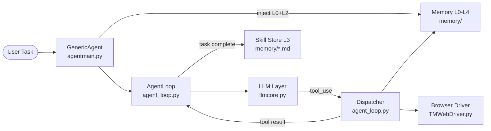
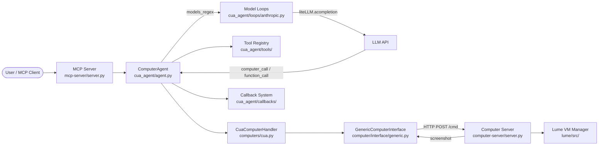
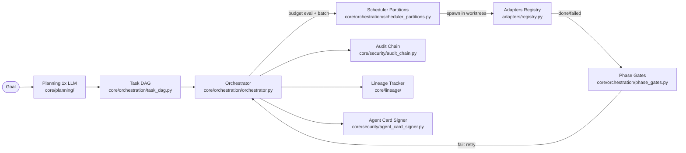
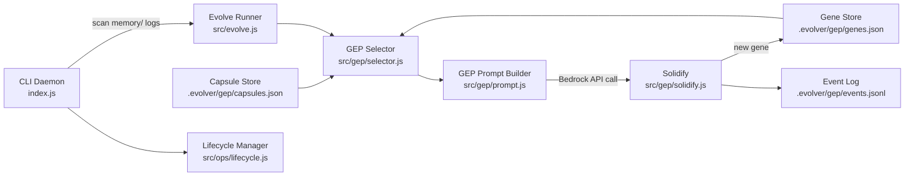

# Agentic AI Weekly Scan — 2026-06-13

## Executive Summary

- **Xu hướng kiến trúc tuần này**: Ba hướng phân hóa rõ — tối giản context (GenericAgent: 30K window + file-based skill memory), production infrastructure nặng (cua với 20+ model-specific loops + VM isolation, bernstein với HMAC audit chain + deterministic scheduler không có LLM trong hot path), và experimental evolution protocol (evolver/GEP).
- **Pick of the week**: **Bernstein** giải quyết pain point thực sự trong enterprise multi-agent deployment — compliance-first orchestration với tamper-evident HMAC audit chain, Ed25519-signed agent cards, và per-artifact lineage; đây là pattern chưa thấy ở framework nào khác và có compliance mapping đến EU AI Act Article 12, SOC 2, DORA/NIS2.
- **Red flag đáng chú ý**: **EvoMap/evolver** có arXiv paper thú vị (GEP, 9.1% → 18.57% accuracy) nhưng core `evolve.js` và `selector.js` bị obfuscate, mâu thuẫn trực tiếp với GPL-3.0 license và "auditable AI" branding — không thể verify claim từ code.

## Table of Contents

- [1. lsdefine/GenericAgent](#1-lsdefinegenericagent) — 12.8K★ — Self-evolving agent với 5-layer file-based memory
- [2. trycua/cua](#2-trycuacua) — 17.9K★ — Computer-Use Agent infrastructure full-stack cross-OS
- [3. sipyourdrink-ltd/bernstein](#3-sipyourdrink-ltdbernstein) — 570★ — HMAC-auditable multi-agent CLI orchestrator
- [4. EvoMap/evolver](#4-evomapevolver) — 8.5K★ — GEP-powered agent evolution engine

---

## 1. lsdefine/GenericAgent

**Repo**: https://github.com/lsdefine/GenericAgent  
**Updated**: 2026-06-13

### §1 — Quick Context

Framework tự tiến hóa khởi đầu từ ~3K LOC seed; mỗi task hoàn thành tự động crystallize thành reusable SOP markdown, tạo skill tree cá nhân hoá theo thời gian.

**Tech stack**: Python 3.10–3.13; Claude / Gemini / Kimi / GLM / MiniMax; 5 runtime deps (requests, beautifulsoup4, bottle, aiohttp, simple-websocket-server); Chrome CDP injection.

**Repo health**: 12.8K★, 1.5K forks, updated 2026-06-13. Python 88.5%. MIT. CONTRIBUTING.md có hướng dẫn; không thấy CI workflow tường minh.

---

### §2 — Architecture Deep-Dive

#### A. Component Inventory

| Component | File | Vai trò |
|---|---|---|
| `AgentLoop` | `agent_loop.py` | Vòng lặp ReAct tối đa 40 turns; tool dispatch qua `dispatch()`; `StepOutcome` dataclass |
| `GenericAgent Controller` | `agentmain.py` | Task queue, multi-LLM switching (`llmclients`), session state, streaming output |
| `LLM Layer` | `llmcore.py` | Multi-provider integration (Claude, Gemini, Kimi, GLM, MiniMax); Mixin config support |
| `Tool Dispatcher` | `agent_loop.py` | Routes `do_{tool_name}` pattern; inject `_index`, `_tool_num` context |
| `Memory L0–L4` | `memory/` | 5-layer file-based hierarchy (meta rules → insights → global facts → SOPs → archive) |
| `Skill Store (L3)` | `memory/*.md` | 20+ SOP markdown files crystallized từ completed tasks |
| `Session Archive (L4)` | `memory/L4_raw_sessions/` | Raw session logs cross-session |
| `Browser Driver` | `TMWebDriver.py` | Real Chrome CDP injection; bảo toàn cookies, login state, bot-detection bypass |
| `Plugin System` | `plugins/` | Extension modules (runtime-loaded) |
| `Reflect Mode` | `reflect/` | Polling-based trigger cho monitoring scripts |
| `Frontends` | `frontends/` | TUI, Streamlit, IM bots (Telegram, QQ, WeChat Work, DingTalk) |

#### B. Control Flow — ReAct-style (think → act → observe)

1. User submit task qua CLI hoặc API → `agentmain.py:put_task()`
2. `GenericAgent` assemble system prompt = `base_prompt` + `current_date` + L2 global memory context
3. `agent_runner_loop` (`agent_loop.py`) gửi messages lên LLM API, nhận `tool_use` blocks
4. `dispatch()` route tới `do_{tool_name}` handler tương ứng (e.g., `do_execute_code`, `do_web_scan`)
5. Tool result feed ngược vào message history dưới dạng `tool_result`
6. Lặp tối đa 40 turns đến khi tool trả `StepOutcome(should_exit=True)` hoặc hết vòng
7. Post-completion: solution crystallize tự động thành L3 SOP markdown file

#### C. State & Data Flow

- **Message format**: Claude Messages API dict (`role`/`content`/`tool_use`) — không có custom schema
- **State storage**: In-memory (`task_queue`, `BaseHandler` state) + file-based (`memory/` L0–L4 `.md` files)
- **Context window**: 30K tokens — chỉ inject L0 rules + L2 global facts; L3 SOPs loaded on-demand
- **Retrieval**: LLM-assisted từ L1 Insight Index; không dùng vector DB

#### D. Tool / Capability Integration

- **9 atomic tools**: Python/PowerShell code execution, file read/write/patch, web scan, JavaScript execution trong browser, user confirmation prompt, memory checkpoint update, long-term memory consolidation, ADB mobile device control
- **Mechanism**: Native Claude `tool_use` / JSON schema function calling
- **Browser**: `TMWebDriver.py` inject vào real Chrome session qua CDP (không headless, bảo toàn login state và extensions, bypass bot-detection services)
- **Validation**: `should_exit` flag từ tool; không có sandbox riêng biệt

#### E. Memory Architecture

- **Short-term**: In-memory conversation history trong `agent_runner_loop`
- **Long-term**: 5-layer file-based:
  - L0 (`memory/`): Meta rules, behavioral constraints — read-only
  - L1 (`memory/`): Insight Index — compressed summaries để LLM retrieve nhanh
  - L2 (`memory/`): Global facts — cross-session knowledge base
  - L3 (`memory/*.md`): Task skills/SOPs — 20+ markdown files crystallized từ tasks (e.g., `tmwebdriver_sop.md`, `plan_sop.md`, `supervisor_sop.md`)
  - L4 (`memory/L4_raw_sessions/`): Complete raw session archives
- **Compaction**: Crystallization trigger khi task complete — không có auto-summarization rolling window
- **Retrieval**: LLM đọc L1 index để biết skip hay load L3 SOP nào

#### F. Model Orchestration

- `load_llm_sessions()` dynamic load từ config file; Mixin configurations combine nhiều providers
- `next_llm()` switch giữa clients trong khi preserve conversation history
- **Không phân chia role** — cùng model cho planning lẫn execution
- Không fallback tự động; switching manual hoặc config-driven

#### G. Observability & Eval

- Logging: `temp/model_responses/` directory (file-based, không structured)
- "Peer hint" system: cross-session awareness mechanism
- arXiv technical report đi kèm (documented 6× token reduction vs competitors)
- Không OpenTelemetry, không Langfuse

#### H. Extension Points

- `plugins/` runtime-loaded extensions
- `frontends/` cho custom UI (Streamlit, TUI, IM bots)
- Mixin LLM config để combine multiple providers
- `/session.parameter=value` slash commands trong runtime

---

### §3 — Architecture Diagram

---

### §4 — Verdict

**Điểm novel**: 5-layer file-based memory hierarchy là quyết định thiết kế táo bạo — L3 SOP markdown thay vì vector DB cho phép agent hoạt động trong 30K context mà vẫn có "long-term knowledge". Token efficiency 6× là claim đáng chú ý nếu verify được. Real Chrome CDP injection (không headless) giải quyết vấn đề bot-detection mà hầu hết agent frameworks bỏ qua.

**Red flags**: Crystallization trigger không rõ ràng từ code — khi nào agent quyết định save skill vs không? Memory/ không scale tốt với long-running agents có hàng trăm SOPs (LLM phải scan L1 index ngày càng lớn hơn). "Dangerous" raw query mode tồn tại trong code mà không có sandbox isolation.

**Open questions**: L1 Insight Index hoạt động như thế nào — full-text scan hay LLM-generated summary keys? Làm sao tránh L3 SOP staleness khi codebase evolve? `next_llm()` history transfer có bảo toàn tool_use format across providers không?

---

## 2. trycua/cua

**Repo**: https://github.com/trycua/cua  
**Updated**: 2026-06-13

### §1 — Quick Context

Infrastructure toàn stack cho Computer-Use Agents: VM sandbox (Apple Virtualization Framework + QEMU) + agent SDK với 20+ model-specific loops + benchmark harness — unified API cross-OS.

**Tech stack**: Python 19.4%, Rust 9.0%, Swift 6.4%, TypeScript 2.6%; liteLLM 1.80.0 (pinned), Apple VZFramework, QEMU, Kasm; macOS/Linux/Windows/Android.

**Repo health**: 17.9K★, 1.2K forks, active 2026-06-13. MIT. CI/CD workflows trong `.github/`. Comprehensive tests directory.

---

### §2 — Architecture Deep-Dive

#### A. Component Inventory

| Component | File | Vai trò |
|---|---|---|
| `ComputerAgent` | `libs/python/agent/cua_agent/agent.py` | Main orchestrator; chọn loop theo model regex; dispatch computer/function calls |
| `Model Loops (20+)` | `libs/python/agent/cua_agent/loops/*.py` | Per-model predict_step implementations: anthropic.py, openai.py, gemini.py, qwen3vl.py, uitars.py, omniparser.py, moondream3.py, glm45v.py, internvl.py, generic_vlm.py, v.v. |
| `CuaComputerHandler` | `libs/python/agent/cua_agent/computers/cua.py` | Wraps Computer object; expose screenshot(), left_click(), type_text(), scroll(), drag() |
| `BaseComputerInterface` | `libs/python/computer/computer/interface/base.py` | Abstract primitives: click/type/scroll/drag/screenshot/hotkey/clipboard/accessibility tree |
| `GenericComputerInterface` | `libs/python/computer/computer/interface/generic.py` | Transport: REST-first, WebSocket fallback; HTTP POST `{"command":..., "params":{...}}` tới VM |
| `OS Interfaces` | `libs/python/computer/computer/interface/{macos,linux,windows,android}.py` | OS-specific subclasses |
| `Computer` | `libs/python/computer/computer/computer.py` | Top-level: VM lifecycle, interface factory, python_exec(), playwright_exec() |
| `Provider Factory` | `libs/python/computer/computer/providers/factory.py` | Chọn provider: lume / lumier / cloud / docker / winsandbox |
| `LumeProvider` | `libs/python/computer/computer/providers/lume/provider.py` | Lume HTTP API; pull image từ ghcr.io; ephemeral mode |
| `Lume VM Manager` | `libs/lume/src/` | Swift: VM.swift, DarwinVM.swift, LinuxVM.swift, VMFactory.swift; Apple Virtualization.Framework |
| `Computer Server` | `libs/python/computer-server/computer_server/server.py` | Chạy trong VM; nhận commands qua HTTP/WS; 40+ handlers |
| `Tool Registry` | `libs/python/agent/cua_agent/tools/` | BaseTool subclass + decorator-based registration; function_to_dict() via liteLLM |
| `Callback System` | `libs/python/agent/cua_agent/callbacks/` | 10 callbacks: budget, logging, telemetry, PII filter, trajectory saving |
| `SOM Parser` | `libs/python/som/` | Set-of-Marks: YOLO icon detection + EasyOCR text; ~0.4s trên Apple Silicon |
| `MCP Server` | `libs/python/mcp-server/mcp_server/server.py` | FastMCP: screenshot_cua, run_cua_task, run_multi_cua_tasks, get_session_stats |
| `cua-bench` | `libs/cua-bench/` | Environment: make(), reset(), step(), evaluate(); OSWorld/ScreenSpot/Windows Arena |
| `Cua Driver` | `libs/cua-driver/rust/` | Rust multi-crate: background desktop automation không steal focus; per-platform crates |

#### B. Control Flow — ReAct-style với model-specific adapter layer

1. User khởi tạo `ComputerAgent(computer, tools, callbacks, model="claude-sonnet-4-6")` → `_process_tools()` phân loại: computer tools, BaseTool instances, callables
2. `run()` bắt đầu vòng lặp: kiểm tra callbacks (budget check), preprocess messages qua `_on_llm_start`
3. `_predict_step_with_retry(agent_loop)` → model-specific loop (`loops/anthropic.py`) gọi `litellm.acompletion()` với computer-use beta headers
4. Response trả về items: `computer_call` hoặc `function_call`
5. `_handle_item()` dispatch: computer calls → `CuaComputerHandler.execute(action)` → `GenericComputerInterface` HTTP POST tới Computer Server trong VM → screenshot tự động sau action
6. Function calls → tool registry dispatch với argument validation
7. Kết quả wrap thành `computer_call_output` / `function_call_output` message, feed ngược vào history
8. Vòng lặp tiếp tục đến khi `last_item.role == "assistant"` (không có tool call tiếp theo)

#### C. State & Data Flow

- **Message format**: liteLLM-normalized (unified across all providers); OS-specific interfaces không expose format khác nhau
- **State storage**: In-memory raw message list; trajectory saving qua callback (file-based)
- **Context management**: Không có sliding window hay summarization — raw message accumulation
- **Sandbox state**: VM persistent (Apple VZFramework / QEMU); ephemeral mode tự delete sau stop

#### D. Tool / Capability Integration

- **Computer tools**: click/right_click/double_click/drag/type/key/hotkey/scroll/screenshot via `computer_handler.{action}(**args)`
- **Function tools**: Python decorator `@tool` hoặc `BaseTool` subclass; schema auto-generated via `litellm.utils.function_to_dict()`
- **Model resolution**: `_resolve_tools()` wrap computer objects vào specialized wrappers (e.g., `BrowserTool` cho specific models)
- **Coordinate normalization**: Generic VLM loop normalize từ 0–1000 space về actual pixels; Anthropic loop handle coordinate upscaling (API downscale screenshots >1568px)

#### E. Memory Architecture

Không có built-in long-term memory. Short-term: raw message list (không compaction). Trajectory export via callbacks cho offline RL training.

#### F. Model Orchestration

- **20+ model-specific loops**: mỗi loop có `models_regex` — `ComputerAgent` auto-select via `@register_agent` decorator
- Anthropic loop: map Claude version → tool type (`computer_20251124` / `computer_20250124` / `computer_20241022`)
- Generic VLM loop: parse tool calls từ OpenRouter XML, Ollama structured, hoặc raw text
- LiteLLM 1.80.0 pinned (breaking changes hay xảy ra trong liteLLM)
- Không fallback tự động khi model fail

#### G. Observability & Eval

- `_on_usage` callback: token/cost tracking per step
- Trajectory saving qua callback → export cho RL training
- `libs/cua-bench/`: `Environment.evaluate()` trả về reward 0.0–1.0 (success ≥ 0.5); OSWorld, ScreenSpot, Windows Arena
- `libs/python/computer/computer/otel_wrapper.py`: OpenTelemetry wrapper
- `libs/python/core/`: shared telemetry với privacy focus

#### H. Extension Points

- Custom loop: implement `AsyncAgentConfig` protocol + `@register_agent(models_regex=...)` decorator
- Custom tools: `BaseTool` subclass hoặc Python decorator
- Callbacks: `_on_llm_start/end`, `_on_computer_call_start/end`, `_on_screenshot`, `_on_usage`
- Custom providers: `BaseVMProvider` subclass
- MCP integration: `libs/python/mcp-server/` cho Claude Desktop / Cursor

---

### §3 — Architecture Diagram

---

### §4 — Verdict

**Điểm novel**: 20+ model-specific loops là engineering quan trọng — mỗi frontier VLM có tool format khác nhau (Anthropic computer-use beta, OpenAI responses API, Qwen XML tool calls) và cua chuẩn hóa tất cả qua liteLLM với per-model adaptation layer. SOM (Set-of-Marks) visual grounding trong 0.4s trên Apple Silicon là production-grade performance. Benchmark harness với trajectory export cho RL training là eval methodology không thấy ở nhiều repos.

**Red flags**: liteLLM pinned ở 1.80.0 là technical debt — breaking changes hay xảy ra và sẽ block security updates. Không có context window management (raw message accumulation) sẽ fail trên long-running computer-use tasks. Swift/Rust Lume layer only works trên Apple Silicon — Linux/Windows users bị push sang QEMU có overhead đáng kể.

**Open questions**: Làm sao `composed_grounded.py` loop kết hợp nhiều models (multi-model grounding)? Trajectory export format cho RL training có compatible với standard fine-tuning pipelines không? Cost của VM spin-up ảnh hưởng benchmark latency như thế nào?

---

## 3. sipyourdrink-ltd/bernstein

**Repo**: https://github.com/sipyourdrink-ltd/bernstein  
**Updated**: 2026-06-13

### §1 — Quick Context

Multi-agent orchestrator compliance-first: HMAC-SHA256 audit chain + Ed25519-signed agent cards + deterministic Python scheduler **không có LLM trong scheduling hot path**, cho 44 CLI coding agents.

**Tech stack**: Python 3.12+; FastAPI, OpenTelemetry, cryptography 45.x, SQLite FTS5; openai SDK 2.36+; optional E2B/Modal/Docker sandboxes.

**Repo health**: 570★, 47 forks, solo project (Alex Chernysh), active 2026-06-13. Python 97.8%. Apache 2.0. OpenSSF Scorecard weekly, ClusterFuzzLite fuzzing.

---

### §2 — Architecture Deep-Dive

#### A. Component Inventory

| Component | File | Vai trò |
|---|---|---|
| `Orchestrator` | `src/bernstein/core/orchestration/orchestrator.py` | Deterministic tick-based scheduler; zero LLM trong control loop; 6-phase tick cycle |
| `Task DAG` | `src/bernstein/core/orchestration/task_dag.py` | Dependency graph; parallel path computation; bottleneck detection |
| `Scheduler Partitions` | `src/bernstein/core/orchestration/scheduler_partitions.py` | Batch grouping: starving-role-first → priority → age tiebreakers |
| `Adaptive Tick` | `src/bernstein/core/orchestration/adaptive_tick.py` | Dynamic `max_agents` theo error rates và CPU load |
| `Adaptive Timeout` | `src/bernstein/core/orchestration/adaptive_timeout.py` | Per-agent timeout auto-tune từ history |
| `Blue-Green` | `src/bernstein/core/orchestration/blue_green.py` | Blue-green deployment pattern cho multi-agent rollouts |
| `Phase Gates` | `src/bernstein/core/orchestration/phase_gates.py` | Stage-based quality gates |
| `Approval Gate` | `src/bernstein/core/orchestration/approval_gate.py` | Manual approval workflow |
| `Adapters Registry` | `src/bernstein/adapters/registry.py` | 44+ CLI agent wrappers (`claude.py`, `codex.py`, `gemini.py`, `cursor.py`, `devin_terminal.py`, `aider.py`, `openai_agents.py`, v.v.) |
| `Adapter Contract` | `src/bernstein/adapters/_contract.py` | Chuẩn interface tất cả adapters phải implement |
| `Audit Chain` | `src/bernstein/core/security/audit_chain.py` | HMAC-SHA256 chained records per RFC 2104; write to `.sdd/audit/YYYY-MM-DD.jsonl` |
| `Agent Card Signer` | `src/bernstein/core/security/agent_card_signer.py` | JWS/Ed25519 detached signature over RFC 8785 JSON canonicalization |
| `Agent Card Keystore` | `src/bernstein/core/security/agent_card_keystore.py` | Ed25519 key storage |
| `Agent Identity` | `src/bernstein/core/security/agent_identity.py` | Agent identity management |
| `Audit Integrity` | `src/bernstein/core/security/audit_integrity.py` | Tamper detection trong audit chain |
| `JWT Tokens` | `src/bernstein/core/security/jwt_tokens.py` | Per-session zero-trust bearer token; `.sdd/runtime/agent_tokens/` |
| `Lineage Tracker` | `src/bernstein/core/lineage/` | Per-artifact: producer, inputs, prompt SHA, model, cost |
| `Codebase RAG` | `src/bernstein/core/knowledge/` | SQLite FTS5 + BM25 + AST-aware chunking (không neural embeddings) |
| `Telemetry` | `src/bernstein/core/telemetry/` | OpenTelemetry packages + prometheus-client |
| `Planning` | `src/bernstein/core/planning/` | 1× LLM call per run để decompose goal → tasks với roles + completion signals |
| `Routing` | `src/bernstein/core/routing/` | Task-to-agent routing logic |
| `Worktrees` | `src/bernstein/core/worktrees/` | Git worktree isolation per agent (clean main branch) |

#### B. Control Flow — Hierarchical Planner-Executor với deterministic scheduler

1. `bernstein run -g "goal"` → `src/bernstein/core/planning/` gọi LLM **1 lần** để decompose thành tasks với roles và completion signals
2. `task_dag.py` builds dependency DAG, compute parallel paths và bottlenecks
3. Orchestrator tick loop khởi động: refresh agent heartbeats, detect/reap crashed processes
4. `scheduler_partitions.py` group tasks theo role (starving-first → priority → age)
5. Budget policy evaluation: CONTINUE / PAUSE / DOWNGRADE_MODEL / ABORT
6. Per-batch: claim tasks trên HTTP task server → spawn CLI agents via adapters trong isolated git worktrees
7. Write-Ahead Log record mọi claim/spawn trước khi execute (crash recovery)
8. **Janitor gate**: verify tests pass, lint clean, files exist, types correct
9. `audit_chain.py` record mỗi scheduling decision vào `.sdd/audit/YYYY-MM-DD.jsonl` với HMAC-SHA256 chain
10. Verified work merged; failed tasks retry hoặc route sang model khác (DOWNGRADE_MODEL policy)

#### C. State & Data Flow

- **Task state machine**: `open → claimed → in_progress → done | failed` (HTTP task server)
- **Audit log**: `.sdd/audit/YYYY-MM-DD.jsonl` — HMAC-chained, tamper-evident, human-readable
- **WAL**: crash recovery — uncommitted entries replay via `/tasks/{id}/force-claim` on restart
- **Codebase RAG**: SQLite FTS5 + BM25 (lexical only) + TF cosine semantic cache — explicit design decision: **no neural embeddings, no vector DB**
- **Agent tokens**: per-session JWT trong `.sdd/runtime/agent_tokens/`; legacy `BERNSTEIN_AUTH_TOKEN` fallback

#### D. Tool / Capability Integration

- **44 CLI adapters** (`src/bernstein/adapters/*.py`): subprocess wrappers theo `_contract.py` interface
- Adapters cover: Claude Code, Codex, Gemini CLI, Cursor, Devin Terminal, Aider, Amp, Cody, Continue, Copilot, Goose, gptme, Plandex, OpenHands, Open Interpreter, AWS Q Developer, Kiro, Junie, AIChat, v.v.
- MCP server mode: `src/bernstein/mcp/`
- Pluggable sandbox backends: worktree (default), Docker, E2B, Modal

#### E. Memory Architecture

Bernstein là orchestrator, không phải agent — không có agent memory. Codebase RAG qua SQLite FTS5 + AST-aware chunking. Per-artifact lineage qua `src/bernstein/core/lineage/`.

#### F. Model Orchestration

- **Manager**: 1× LLM call per run cho decomposition (không repetitive trong scheduling loop)
- **Workers**: mỗi CLI agent tự manage model của mình
- **DOWNGRADE_MODEL** budget policy: auto-rewrite task model fields sang cheaper tier khi budget pressure
- `adaptive_timeout.py`: auto-tune per-agent timeout từ completion history
- Token growth monitoring: kill agents có quadratic token growth (runaway cost detection)

#### G. Observability & Eval

- **HMAC audit chain**: tamper-evident, replay với `bernstein replay` từ JSONL log
- **OpenTelemetry**: `src/bernstein/core/telemetry/` với prometheus-client integration
- **Per-artifact lineage**: producer / inputs / prompt SHA / model / cost — `bernstein lineage verify <run_id>`
- **Eval**: `src/bernstein/eval/` + `src/bernstein/evals/`
- **Compliance docs**: `docs/compliance/` — EU AI Act Article 12, SOC 2 CC4/CC7, DORA/NIS2, OWASP ASI06, RFC 2104/7515/8785
- **OpenSSF Scorecard** weekly automated assessment

#### H. Extension Points

8 plugin extension points via `pyproject.toml` entry points:
- `bernstein.adapters` — custom CLI agent adapter
- `bernstein.gates` — custom quality gates
- `bernstein.triggers` — event trigger sources
- `bernstein.reporters` — run summary reporters
- `bernstein.sandbox_backends` — execution environments (E2B, Modal, Docker)
- `bernstein.storage_sinks` — artifact storage (S3, GCS, Azure, R2)
- `bernstein.notification_sinks` — outbound notifications (Telegram, Slack, Discord)
- `bernstein.skill_sources` — capability packs

---

### §3 — Architecture Diagram

---

### §4 — Verdict

**Điểm novel**: Deterministic scheduler không có LLM trong hot path là design choice đáng học — reproducible, auditable, không tốn token burn cho scheduling. HMAC-chained audit log (RFC 2104) + Ed25519-signed agent cards (RFC 7515/8785) là production-grade compliance architecture không thấy ở bất kỳ open-source agent framework nào khác. Blue-green deployment pattern cho multi-agent rollout là sự trưởng thành engineering hiếm thấy. Plugin system 8 extension points rất clean.

**Red flags**: Solo project (1 maintainer) là sustainability risk nghiêm trọng cho production use. 570★ cho thấy còn ít adoption — edge cases trong 44 adapters chưa được test rộng. SQLite FTS5 lexical search sẽ fail với semantic retrieval tasks (e.g., tìm code implement "rate limiting" không mention từ "rate"). `approval_gate.py` pattern phù hợp cho regulated workflows nhưng sẽ bottleneck CI/CD pipelines.

**Open questions**: HMAC chain verification trong distributed multi-orchestrator setup hoạt động như thế nào? `federation.py` trong orchestration/ — federated scheduling cross-cluster được implement chưa hay chỉ là stub? Làm sao adapter conformance testing (`conformance.py`) verify 44 adapters có consistent behavior?

---

## 4. EvoMap/evolver

**Repo**: https://github.com/EvoMap/evolver  
**Updated**: 2026-06-13

### §1 — Quick Context

GEP (Genome Evolution Protocol) engine tự cải tiến cho AI agents: scan runtime logs → chọn compact "Genes/Capsules" → tạo structured evolution prompts → LLM sinh code improvements — backed by arXiv paper 2604.15097.

**Tech stack**: JavaScript/Node.js ≥22; @evomap/gep-sdk, @evomap/atp-sdk (private packages), @aws-sdk/client-bedrock-runtime; GPL-3.0-or-later.

**Repo health**: 8.5K★, 796 forks, active 2026-06-13. JavaScript 100%. **Core modules distributed in obfuscated form** (stated explicitly in README).

---

### §2 — Architecture Deep-Dive

#### A. Component Inventory

| Component | File | Vai trò |
|---|---|---|
| `CLI Daemon` | `index.js` | Entry point; --loop/--review/--solidify/--exec-bridge modes; lock-based singleton |
| `Evolve Runner` | `src/evolve.js` | Log analysis, Gene/Capsule selection — **⚠️ OBFUSCATED** |
| `GEP Prompt Builder` | `src/gep/prompt.js` | Structured protocol prompt assembly từ selected assets |
| `GEP Selector` | `src/gep/selector.js` | Gene/Capsule scoring và selection — **⚠️ likely obfuscated** |
| `Solidify` | `src/gep/solidify.js` | Validation execution với whitelist (node/npm/npx only); reject command substitution |
| `Lifecycle Manager` | `src/ops/lifecycle.js` | Background process management, daemon supervision |
| `Gene Store` | `.evolver/gep/genes.json` | Compact reusable genetic blueprints (runtime-generated) |
| `Capsule Store` | `.evolver/gep/capsules.json` | Encapsulated higher-level evolution strategies |
| `Event Log` | `.evolver/gep/events.jsonl` | Append-only audit trail của mọi evolution decisions |

#### B. Control Flow — Event-driven evolution loop

1. `index.js --loop` acquires lock singleton, khởi tạo heartbeat + A2A protocol connection
2. `evolve.run()` (`src/evolve.js`) scan `memory/` directory cho runtime logs và error patterns
3. `src/gep/selector.js` score và chọn matching Genes/Capsules theo strategy preset (balanced/innovate/harden/repair-only)
4. `src/gep/prompt.js` build structured GEP prompt từ selected assets
5. Prompt sent tới LLM qua AWS Bedrock (`@aws-sdk/client-bedrock-runtime`)
6. LLM output validated qua `solidify.js` (whitelist enforcement; reject `$()`, backticks, shell operators)
7. Evolution event ghi vào `.evolver/gep/events.jsonl`
8. Nếu `--loop`: adaptive sleep → restart; nếu single run: exit sau 1 cycle

#### C. State & Data Flow

- **Stateless per cycle**: mỗi evolution run hoàn toàn độc lập, không conversation history
- **Persistent state**: `.evolver/gep/*.json` files (genes, capsules, events JSONL)
- **Message format**: GEP-structured prompt — không phải standard chat format; protocol-constrained
- Không traditional message passing — scan logs trực tiếp để extract patterns

#### D. Tool / Capability Integration

- **Exec bridge**: `--harness` flag để bridge tới claude-code / openclaw / codex / opencode
- **Validation whitelist**: `solidify.js` chỉ cho phép `node`, `npm`, `npx` prefixes; 180s timeout
- External asset promotion: explicit `--validated` flag trước khi promote vào local stores
- A2A protocol: `@evomap/atp-sdk` cho agent-to-agent communication (network features)

#### E. Memory Architecture

- **Gene Store** (`.evolver/gep/genes.json`): compact blueprints — không phải full skill docs; research cho thấy compact representations outperform verbose ones
- **Capsule Store** (`.evolver/gep/capsules.json`): higher-level strategies, encapsulate multiple gene patterns
- **Event Log** (`.evolver/gep/events.jsonl`): audit-only, không dùng cho retrieval
- Không traditional memory retrieval — log scanning trực tiếp

#### F. Model Orchestration

- AWS Bedrock primary (`@aws-sdk/client-bedrock-runtime`)
- `@evomap/gep-sdk` handle protocol specifics (private package — không audit được)
- Không phân chia planner/executor roles
- Strategy presets: balanced (50% innovate / 30% optimize / 20% repair), innovate (80/15/5), harden (20/40/40), repair-only (0/20/80)

#### G. Observability & Eval

- `events.jsonl`: per-decision audit trail (event type, gene selected, timestamp)
- EvoMap Hub: leaderboards, collaborative gene sharing (optional network feature)
- arXiv 2604.15097: 4,590 controlled trials; Gene-based evolution 9.1% → 18.57% trên physics tasks
- Không OpenTelemetry, không cost tracking tích hợp

#### H. Extension Points

- `setup-hooks`: tích hợp với Cursor, Claude Code, Codex CLI, Kiro, opencode via hooks
- Strategy presets: configurable innovation/optimization/repair ratios
- EvoMap Hub: worker pool participation, shared gene/capsule marketplace
- A2A protocol: `a2a:export/ingest/promote` scripts cho cross-agent asset sharing

---

### §3 — Architecture Diagram

---

### §4 — Verdict

**Điểm novel**: GEP abstraction — compress agent experience thành compact Genes/Capsules thay vì verbose skill documents — là insight thú vị từ genetics/evolutionary computation. Strategy presets (balanced/innovate/harden/repair-only) là practical UX cho different lifecycle phases. arXiv backing (4,590 trials, 2× accuracy gain) cho thấy có experimental rigor thực sự.

**Red flags — nghiêm trọng**: Core `evolve.js` và `selector.js` **bị obfuscate** dù repo claim GPL-3.0 và "auditable AI" — đây là mâu thuẫn trực tiếp về license và thương hiệu. Không thể verify thuật toán gene selection từ code. `@evomap/gep-sdk` và `@evomap/atp-sdk` là private packages — vendor lock-in ẩn dưới open-source wrapper. Genes.json và capsules.json là runtime-generated files, không có trong repo — không thể evaluate chất lượng default gene library.

**Open questions**: Genes vs Capsules khác nhau về granularity như thế nào — là 1-function vs multi-function blueprint? Làm sao tránh gene explosion khi library grows (selection overhead tăng tuyến tính)? OMLS (Opportunistic Multi-Level Sampling) idle scheduling trong `index.js` hoạt động như thế nào?

---

*Scanned by: Claude Sonnet 4.6 — 2026-06-13*
