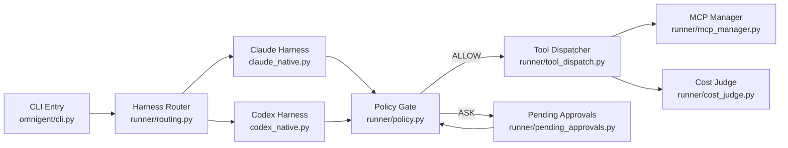
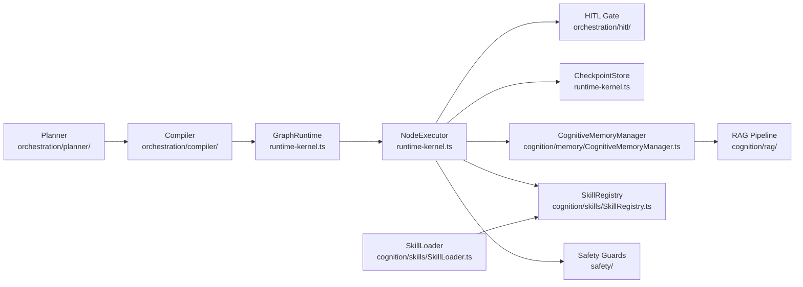
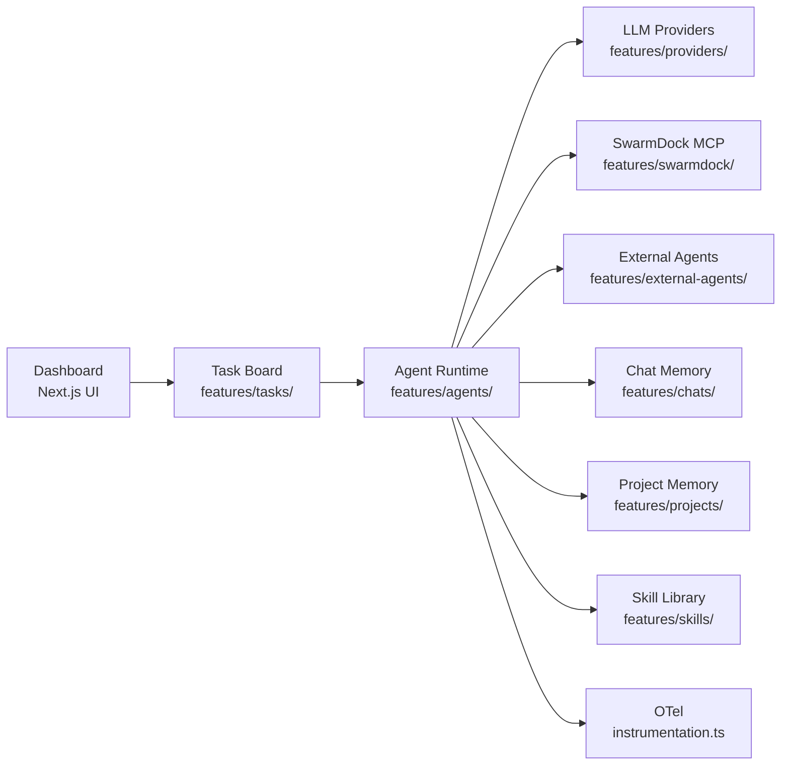

```mermaid
flowchart LR
    P["Propagator\ngraph/propagation.py"]
    MA["Market Analyst\nagents/analysts/"]
    SA["Social Analyst\nagents/analysts/"]
    NA["News Analyst\nagents/analysts/"]
    FA["Fundamentals Analyst\nagents/analysts/"]
    BR["Bull Researcher\nagents/researchers/"]
    Be["Bear Researcher\nagents/researchers/"]
    RM["Research Manager\nagents/managers/"]
    TR["Trader Agent\nagents/trader/"]
    RA["Risk Analysts\nagents/risk_mgmt/"]
    PM["Portfolio Manager\nagents/managers/"]
    SP["Signal Processor\ngraph/signal_processing.py"]
    RF["Reflector\ngraph/reflection.py"]

    P --> MA --> SA --> NA --> FA
    FA --> BR
    FA --> Be
    BR <--> Be
    BR --> RM
    Be --> RM
    RM --> TR
    TR --> RA
    RA --> PM
    PM --> SP
    SP --> RF
```

# Agentic AI Weekly Scan — 2026-06-14

## Executive Summary

- **Omnigent** giới thiệu meta-harness pattern chưa thấy trong OSS: một lớp orchestration duy nhất swap được giữa Claude Code, Codex, và custom YAML agents không cần rewrite — kèm policy enforcement 3-tầng (server/agent/session) chạy phía runner với DENY/ASK/ALLOW semantics rõ ràng.
- **AgentOS** là repo ấn tượng nhất tuần này về novel architecture: runtime tool forging trong `node:vm` sandbox với LLM judge approval, cognitive memory 8-cơ-chế neuroscience-based được benchmark trên LongMemEval-M với 70.2% accuracy reproducible.
- **TradingAgents** và **SwarmClaw** đại diện hai paradigm đối lập: LangGraph state machine domain-specific với adversarial debate được paper hóa vs. production-grade swarm runtime với OpenTelemetry, dream cycle memory consolidation, và token-cost-aware MCP dispatch.

## Table of Contents

- [1. omnigent-ai/omnigent — Meta-Harness với Policy Stacking 3-tầng](#1-omnigent-aiomnigent)
- [2. TauricResearch/TradingAgents — Adversarial Debate Multi-Agent cho Trading](#2-tauricresearchtradingagents)
- [3. framerslab/agentos — Runtime Tool Forging + Cognitive Memory](#3-framerslabagentos)
- [4. swarmclawai/swarmclaw — Production-Grade Swarm Runtime](#4-swarmclawaiswarmclaw)

---

## 1. omnigent-ai/omnigent

**Repo**: https://github.com/omnigent-ai/omnigent  
**Created**: 2026-06-11 (3 ngày trước khi scan)

### §1 — Quick Context

Meta-harness thống nhất cho Claude Code, Codex, Pi, và custom YAML agents với policy enforcement đa tầng và live multi-device collaboration.

**Tech stack core**: Python 3.12+ (82.8%), TypeScript (16.4%); uv package manager; Node.js 22 LTS; Modal/Daytona sandbox; OIDC (Google/GitHub/Okta).

**Repo health**: 587 ⭐, 76 forks, 24 commits on main, CI via `.github/workflows/`, Apache 2.0, status Alpha — repo còn rất non.

### §2 — Architecture Deep-Dive

#### A. Component Inventory

- `CLI Entry` (`omnigent/cli.py`) — parse commands, launch runner process, auth flows
- `Harness Router` (`omnigent/runner/routing.py`) — map conversation → runner via affinity binding; validate harness capability từ runner hello frame
- `Claude Harness` (`omnigent/claude_native.py`, `omnigent/claude_native_bridge.py`, `omnigent/claude_native_forwarder.py`) — wrap Claude Code SDK; forward messages, handle hooks
- `Codex Harness` (`omnigent/codex_native.py`, `omnigent/codex_native_bridge.py`) — wrap OpenAI Codex CLI
- `Runner Policy Gate` (`omnigent/runner/policy.py`) — evaluate function-type policies theo thứ tự DENY/ASK/ALLOW; DENY short-circuit; ASK accumulate rồi POST lên server
- `Tool Dispatcher` (`omnigent/runner/tool_dispatch.py`) — phân loại và route tools: OS (sys_os_*), REST (sys_call_async), MCP, terminal, file upload/download
- `MCP Manager` (`omnigent/runner/mcp_manager.py`, `omnigent/runner/proxy_mcp_manager.py`) — dispatch MCP tools qua WS tunnel; dynamic tool names
- `Cost Advisor / Cost Judge` (`omnigent/runner/cost_advisor.py`, `omnigent/runner/cost_judge.py`) — track và enforce token spend budget
- `Pending Approvals` (`omnigent/runner/pending_approvals.py`) — queue ASK verdicts; block runner; await server user-approval resolution
- `Policy Registry` (`omnigent/policies/registry.py`) — store builtin và custom policy definitions
- `Agent Entity` (`omnigent/entities/agent.py`) — persistence model (id, name, bundle_location SHA-256, version counter)
- `Loaded Agent / AgentSpec` (`omnigent/entities/agent.py`) — runtime representation parsed từ YAML config
- `Sandbox` (`omnigent/sandbox/`) — execution isolation (Modal, Daytona providers)

#### B. Control Flow — Hierarchical + Event-Driven

Pattern: **Hierarchical** (orchestrator → harness workers) với **event-driven** tool hooks phía runner.

1. User gửi input qua `omnigent/cli.py` hoặc Web UI (`ap-web/`)
2. `Harness Router` (`runner/routing.py`) resolve conversation → runner affinity binding → validate harness capability
3. Runner nhận request; `RunnerToolPolicyGate` (`runner/policy.py`) evaluate policies tuần tự (DENY short-circuit; ASK ghi nhận nhưng tiếp tục)
4. Tool call đến: `Tool Dispatcher` (`runner/tool_dispatch.py`) check `_ALL_LOCAL_TOOLS` set → execute locally (OS/MCP/terminal/file) hoặc forward lên server
5. MCP tools → `MCP Manager` dispatch qua WebSocket tunnel
6. ASK verdict → `Pending Approvals` (`runner/pending_approvals.py`) POST to server → runner block → user approves → resume
7. Results propagate ngược về LLM; state sync across tất cả connected devices

#### C. State & Data Flow

- Message format: JSON-serializable Python dicts, typed via dataclasses trong `omnigent/entities/`
- State storage: server-side conversation store; runner chỉ hold in-memory session state trong runner process
- Context management: không xác định từ code — delegate hoàn toàn sang underlying harness (Claude/Codex)

#### D. Tool / Capability Integration

- **Function tools**: Python functions với schema auto-generated từ type signature (`omnigent/runner/uc_function.py`)
- **Agent tools**: sub-agents callable as delegatable resources; inherit parent runner affinity
- **MCP tools**: dynamic names, dispatched qua `RunnerMcpManager`; không appear trong static allow-list
- **Policy tools**: CEL expression (`expression` + `reason`) hoặc builtin factory handlers (`handler` + `factory_params`)

#### E. Memory Architecture

Không xác định từ code — omnigent delegate memory management hoàn toàn sang underlying harness (Claude Code/Codex). Không có memory module visible trong `omnigent/` package.

#### F. Model Orchestration

- Mỗi agent YAML khai báo harness (claude-sdk, codex, pi, custom)
- Parent và sub-agents có thể run harness khác nhau đồng thời trong cùng session
- Model selection bên trong harness: delegate sang underlying runner; omnigent không control model trực tiếp

#### G. Observability & Eval

- CI: `.github/workflows/`
- Cost tracking: `runner/cost_advisor.py`, `runner/cost_judge.py`
- Policy audit: server logs approval events
- Không có OpenTelemetry hay distributed tracing visible từ code (24 commits, repo mới)

#### H. Extension Points

- Custom agent: YAML spec (khai báo harness, tools, policies); agents có thể self-author YAML
- Custom policy: implement trong `omnigent/policies/function.py` + register qua `policies/registry.py`
- Custom harness: implement harness protocol, register trong `omnigent/harness_aliases.py`
- Custom sandbox: plug Modal hoặc Daytona provider qua `omnigent/sandbox/`

### §3 — Architecture Diagram

### §4 — Verdict

**Novel**: Cross-harness orchestration — swap Claude/Codex/Pi không rewrite code là pattern chưa thấy trong OSS agentic frameworks. Policy stacking 3-tầng (server→agent→session) với CEL expression support và DENY/ASK semantics rõ ràng là governance model production-worthy hơn bất kỳ framework nào trong tuần. Runner-side CEL evaluation tránh server round-trip cho phép latency thấp.

**Red flags**: Chỉ 24 commits, Alpha status, 3 ngày tuổi — test coverage chưa rõ. Context management hoàn toàn absent ở omnigent layer — multi-harness session có thể diverge context budget không consistent. `bundle_location` dùng SHA-256 content-addressing nhưng không rõ rollback strategy khi harness update.

**Open questions**: Memory và context budget có được track cross-harness không, hay mỗi harness manage độc lập? "Live collaboration" (co-driving, shared observation) implement như thế nào ở transport layer — WebSocket fan-out hay event sourcing? Sub-agent YAML tự-generate bởi parent agent có pass qua policy gate trước khi load không?

---

## 2. TauricResearch/TradingAgents

**Repo**: https://github.com/TauricResearch/TradingAgents  
**Paper**: https://arxiv.org/pdf/2412.20138  
**Version**: v0.2.5 (May 2026)

### §1 — Quick Context

Framework đa agent mô phỏng trading firm với 8 specialized agents, adversarial bull/bear debate hai tầng, và LangGraph state machine được hỗ trợ bởi arxiv paper.

**Tech stack core**: Python 99.9%; LangGraph (orchestration); yfinance + Alpha Vantage (data); OpenAI GPT-5.5 / GPT-4-mini (default); SQLite (checkpoint).

**Repo health**: 85,894 ⭐, 16,592 forks, v0.2.5, CI via GitHub Actions, Apache 2.0, active maintainer (updated 2026-06-14).

### §2 — Architecture Deep-Dive

#### A. Component Inventory

- `Market Analyst` (`tradingagents/agents/analysts/`) — technical indicators (MACD, RSI), verified snapshots
- `Social Analyst` (`tradingagents/agents/analysts/`) — news + StockTwits + Reddit sentiment
- `News Analyst` (`tradingagents/agents/analysts/`) — macroeconomic indicators, insider transactions
- `Fundamentals Analyst` (`tradingagents/agents/analysts/`) — balance sheets, cash flow, income statements
- `Bull Researcher` (`tradingagents/agents/researchers/`) — argue upside thesis từ analyst reports
- `Bear Researcher` (`tradingagents/agents/researchers/`) — argue downside thesis adversarially
- `Research Manager` (`tradingagents/agents/managers/`) — adjudicate bull/bear debate; deep-thinking LLM
- `Trader Agent` (`tradingagents/agents/trader/`) — synthesize → `TraderProposal` (action, entry_price, stop_loss, sizing)
- `Risk Analysts` (`tradingagents/agents/risk_mgmt/`) — 3 roles: aggressive / conservative / neutral mediator
- `Portfolio Manager` (`tradingagents/agents/managers/`) — render final `PortfolioDecision`; deep-thinking LLM
- `Trading Graph` (`tradingagents/graph/trading_graph.py`) — compiled LangGraph workflow
- `GraphSetup` (`tradingagents/graph/setup.py`) — node + edge registration; model assignment per role
- `Propagator` (`tradingagents/graph/propagation.py`) — state init + graph execution entry
- `ConditionalLogic` (`tradingagents/graph/conditional_logic.py`) — debate round limits control
- `SignalProcessor` (`tradingagents/graph/signal_processing.py`) — extract final trading signal từ decision
- `Reflector` (`tradingagents/graph/reflection.py`) — log outcome với realized returns cho future runs
- `Checkpointer` (`tradingagents/graph/checkpointer.py`) — SQLite state persistence + resume
- `DataFlows` (`tradingagents/dataflows/`) — yfinance và Alpha Vantage adapters
- `LLM Clients` (`tradingagents/llm_clients/`) — multi-provider abstraction (OpenAI, Anthropic, Gemini, xAI...)

#### B. Control Flow — State Machine/Graph (LangGraph)

Pattern: **LangGraph state machine** với **planner-executor** trong debate phases.

1. `Propagator.propagate()` khởi tạo `AgentState` (ticker, trade date, market context) + `InvestDebateState` + `RiskDebateState`
2. START → 4 analyst nodes chạy **tuần tự** (market → social → news → fundamentals)
3. Mỗi analyst: gọi dedicated ToolNode (yfinance/Alpha Vantage) → clear messages node → pass to next
4. Last analyst → Bull Researcher; `ConditionalLogic` control debate rounds (default: 1 round)
5. Bull và Bear exchange arguments theo rounds; Research Manager (deep LLM) adjudicates → `ResearchPlan`
6. Research Manager → Trader; Trader synthesizes → `TraderProposal` (action, entry_price, stop_loss, position_sizing)
7. Trader → Risk Analysts: aggressive / conservative / neutral debate → `RiskDebateState`
8. Portfolio Manager renders `PortfolioDecision` → END
9. `SignalProcessor` extract signal; `Reflector` persist outcome với realized returns

#### C. State & Data Flow

- Primary: `AgentState` TypedDict (từ `tradingagents/agents/utils/agent_states.py`) — `messages` list là backbone
- Embedded states: `InvestDebateState` (bull_history, bear_history, judge_decision, count) + `RiskDebateState` (aggressive/conservative/neutral responses, count)
- Typed outputs: `ResearchPlan`, `TraderProposal`, `PortfolioDecision`, `SentimentReport` — Pydantic models trong `tradingagents/agents/schemas.py`
- Storage: SQLite checkpoint qua `Checkpointer` (opt-in, default disabled)

#### D. Tool / Capability Integration

- LangGraph `ToolNode` pattern — mỗi analyst có dedicated ToolNode riêng
- Tools: yfinance (OHLCV, fundamentals, insider tx), Alpha Vantage (fallback), news APIs
- Function calling via LangGraph native (structured output, không custom JSON parsing)
- Không có sandbox hay validation layer cho tool outputs visible từ code

#### E. Memory Architecture

- Short-term: `messages` list trong `AgentState` (per run, cleared between analyst nodes)
- Long-term: `Reflector` (`tradingagents/graph/reflection.py`) — ghi decision log với realized returns vào persistent store; `Propagator` inject log context vào `AgentState` ở run mới
- Không có vector search — chỉ sequential log injection; không có summarization

#### F. Model Orchestration

- `quick_thinking_llm` (default: gpt-4-mini) → 4 analysts, Bull/Bear researchers, Trader, Risk analysts
- `deep_thinking_llm` (default: gpt-5.5) → Research Manager + Portfolio Manager (strategic decision)
- Pattern rõ ràng: cheap model cho data processing/debate, frontier model cho strategic synthesis
- Multi-provider: Anthropic, Gemini, xAI, DeepSeek, Qwen, GLM, MiniMax via `tradingagents/llm_clients/`

#### G. Observability & Eval

- SQLite checkpoint (`tradingagents/graph/checkpointer.py`) — state inspection và crash resume
- Decision log qua `Reflector` với actual realized returns → implicit eval loop qua runs
- Không có distributed tracing hay structured logging visible từ code

#### H. Extension Points

- Thêm analyst: implement agent function, register node trong `tradingagents/graph/setup.py`
- Swap LLM: sửa `tradingagents/default_config.py` hoặc truyền `llm_config` dict vào `Propagator`
- Thêm data source: implement adapter trong `tradingagents/dataflows/`

### §3 — Architecture Diagram

### §4 — Verdict

**Novel**: Adversarial debate 2-tầng (investment bull/bear + risk aggressive/conservative/neutral) được paper hóa và code hóa song song là pattern cụ thể, không phải generic "multi-agent". Model tier assignment rõ ràng (cheap analyst → frontier synthesizer) là best practice ít thấy implement explicit trong OSS. `Reflector` + cross-run memory injection là primitive eval loop đơn giản nhưng effective.

**Red flags**: 4 analysts chạy **tuần tự** dù hoàn toàn độc lập — missed parallelism cơ bản có thể 4x latency. `ConditionalLogic` default chỉ 1 debate round — debate rất nông với default config. Không có validation cho tool outputs (yfinance trả NaN silently). Decision log không có vector indexing — inject toàn bộ log vào context sẽ blow context budget với history dài.

**Open questions**: `Reflector` lưu decision log format gì — JSON hay plain text? Cross-ticker learning có xảy ra hay log chỉ per-ticker isolated? Paper benchmark (Dec 2024) có còn valid với v0.2.5 và gpt-5.5? Tại sao `max_debate_rounds=1` là default — là design decision hay chưa tune?

---

## 3. framerslab/agentos

**Repo**: https://github.com/framerslab/agentos  
**Version**: v0.9.62 (2026-06-13)

### §1 — Quick Context

TypeScript agent framework với runtime tool forging trong hardened sandbox, cognitive memory 8-cơ-chế neuroscience-based được benchmark, và HEXACO personality modulation in-kernel.

**Tech stack core**: TypeScript 5.4+, pnpm; Vitest; SQL (SQLite/Postgres/IndexedDB/Capacitor); node:vm sandbox; 11 LLM providers unified.

**Repo health**: 577 ⭐, 79 forks, 388 releases, v0.9.62, CI + Codecov + CodeRabbit, Apache 2.0.

### §2 — Architecture Deep-Dive

#### A. Component Inventory

- `GraphRuntime` (`src/orchestration/runtime-kernel.ts`) — graph traversal engine; orchestrate node execution
- `NodeExecutor` (`src/orchestration/runtime-kernel.ts`) — evaluate individual graph nodes; LLM call + tool dispatch
- `ICheckpointStore / InMemoryCheckpointStore` (`src/orchestration/runtime-kernel.ts`) — pluggable state persistence interface
- `GraphEvent` (`src/orchestration/runtime-kernel.ts`) — event bus cho execution flow tracking
- `IR Types` (`src/orchestration/ir/types.ts`) — intermediate representation cho graph nodes và edges
- `Planner` (`src/orchestration/planner/`) — compile mission thành DAG hoặc AgentGraph cycles
- `Planning Module` (`src/orchestration/planning/`) — higher-level planning strategies
- `Turn Planner` (`src/orchestration/turn-planner/`) — per-turn planning và routing
- `HITL Gate` (`src/orchestration/hitl/`) — human-in-the-loop approval pauses
- `Compiler` (`src/orchestration/compiler/`) — compile workflow definitions sang runtime IR
- `CognitiveMemoryManager` (`src/cognition/memory/CognitiveMemoryManager.ts`) — 8-cơ-chế memory engine
- `AgentMemory` (`src/cognition/memory/AgentMemory.ts`) — per-agent memory interface
- `Memory Mechanisms` (`src/cognition/memory/mechanisms/`) — Ebbinghaus decay, reconsolidation, FOK, involuntary recall, source-confidence decay, gist extraction, schema encoding
- `SkillLoader` (`src/cognition/skills/SkillLoader.ts`) — load static tools từ filesystem
- `SkillRegistry` (`src/cognition/skills/SkillRegistry.ts`) — tool registration, discovery, dedup
- `RAG Pipeline` (`src/cognition/rag/`) — 7 vector backends, GraphRAG, HyDE, Cohere reranking
- `Safety Guards` (`src/safety/`) — guardrails layer
- `Extensions` (`src/extensions/`) — 100+ first-party adapters (channels, tools, guardrails)

#### B. Control Flow — State Machine/Graph (Custom Graph Runtime)

Pattern: **State machine/graph** (custom graph runtime) với **ReAct inner loop** per node và **dynamic skill injection**.

1. User gửi mission → `Planner` (`orchestration/planner/`) compile thành DAG hoặc AgentGraph cycles
2. `Compiler` (`orchestration/compiler/`) translate sang runtime IR (`orchestration/ir/types.ts`)
3. `GraphRuntime` traverse graph qua `NodeExecutor`
4. Mỗi node: LLM call → tool dispatch → `CognitiveMemoryManager` update → `ICheckpointStore` save
5. Nếu agent gặp task không có tool phù hợp → **Runtime Tool Forging**: agent writes TypeScript + Zod schema → LLM judge (separate call) evaluate → execute trong `node:vm` sandbox (5s wall-clock, blocked: eval/require/process/global) → `SkillRegistry` register
6. Nếu cần human approval → `HITL Gate` (`orchestration/hitl/`) pause execution, await response
7. Multi-agent: `Planner` spawn sub-agents qua Agency API; manager agents có thể forge sub-agents at runtime
8. Post-turn: `CognitiveMemoryManager` apply decay/reconsolidation; write to SOUL.md + vector index

#### C. State & Data Flow

- Graph IR: typed node definitions trong `src/orchestration/ir/types.ts`
- Events: `GraphEvent.ts` — event-based communication giữa nodes
- Checkpoint: `ICheckpointStore` interface → `InMemoryCheckpointStore` hoặc SQL backends (SQLite/Postgres/IndexedDB/Capacitor)
- Memory source-of-truth: SOUL.md markdown wiki files với `[[wikilinks]]` — vector/graph indices rebuild từ markdown

#### D. Tool / Capability Integration

- **Static tools**: `SkillLoader.ts` load từ filesystem vào `SkillRegistry`
- **Runtime Tool Forging**: agent writes TS + Zod schema → LLM judge separate call approve → `node:vm` sandbox (5s limit, no eval/require/process access) → `SkillRegistry.register()` → session reuse
- **SKILL.md promotion**: successful forged tools có thể promoted thành persistent skills
- **Cost**: full token cost lần đầu tạo; subsequent invocations ~tens of tokens

#### E. Memory Architecture

- Short-term: in-memory conversation context per session
- Long-term: SOUL.md markdown wiki với `[[wikilinks]]` — source of truth; vector + graph indices rebuilt từ markdown
- 8 cơ chế trong `src/cognition/memory/mechanisms/`:
  - Ebbinghaus decay curves (forgetting curve)
  - Retrieval-induced forgetting
  - Reconsolidation (memory update on recall)
  - Source-confidence decay
  - Involuntary recall
  - Feeling-of-knowing (FOK)
  - Gist extraction
  - Schema encoding
- Retrieval: vector search, keyword, GraphRAG, HyDE, Cohere reranking (`src/cognition/rag/`)
- Benchmark: LongMemEval-S 85.6% ($0.0090/correct, GPT-4o); LongMemEval-M 70.2% trên 1.5M-token haystacks

#### F. Model Orchestration

- 11 providers unified: OpenAI, Anthropic, Gemini, Groq, Ollama, OpenRouter, Together, Mistral, xAI, CLI-based
- **HEXACO personality** (6 traits: Honesty-Humility, Emotionality, Extraversion, Agreeableness, Conscientiousness, Openness) modulate memory retrieval, specialist routing, tool selection — implemented in kernel, không phải system prompt
- Multi-agent: different agents có thể có different HEXACO profiles → measurably different decision sequences với same prompts/tools

#### G. Observability & Eval

- Codecov test coverage CI (`codecov.yml`)
- CodeRabbit automated code review (`.coderabbit.yaml`)
- 388 semantic versioned releases → disciplined release cadence
- Benchmark harness với bootstrap 95% confidence intervals — reproducible methodology

#### H. Extension Points

- Custom adapters: `src/extensions/` (100+ first-party adapters; channels, tools, guardrails)
- Custom LLM: add provider trong provider abstraction layer
- Custom memory mechanisms: implement interface trong `src/cognition/memory/mechanisms/`
- Custom graph nodes: implement IR node type trong `src/orchestration/ir/`

### §3 — Architecture Diagram

### §4 — Verdict

**Novel**: Runtime tool forging với LLM judge approval + `node:vm` sandbox là implementation cụ thể và well-engineered nhất trong tuần — có security boundary rõ ràng (5s timeout, blocked APIs), không chỉ là "dynamic tool use" vague. HEXACO personality trong kernel (không phải prompt) là bước đột phá về agent personalization không tốn context tokens. LongMemEval-M 70.2% với bootstrap CI và reproducible methodology là claim verify được, không phải số vibes.

**Red flags**: 577 stars thấp so với độ phức tạp — adoption signal yếu. SOUL.md markdown source-of-truth có thể gây write conflict nếu multiple agents write cùng file simultaneously (không thấy lock mechanism). "8 neuroscience mechanisms" cần verify implementation thực tế trong `src/cognition/memory/mechanisms/` — có thể là thin wrappers. 388 releases trong ~8 tháng (Oct 2025 → Jun 2026) = ~1.5 releases/ngày — có thể signal instability.

**Open questions**: LLM judge cho tool forging dùng model nào — nếu judge = agent model thì circular approval risk. HEXACO trait assignment diễn ra như thế nào — user set manually hay learned từ interaction? Multi-agent shared SOUL.md có conflict resolution strategy không? Benchmark 85.6% đo trên cấu hình gì — context size, provider, temperature?

---

## 4. swarmclawai/swarmclaw

**Repo**: https://github.com/swarmclawai/swarmclaw  
**Version**: v1.9.39

### §1 — Quick Context

Self-hosted production agent swarm runtime với durable SQLite state, memory dream cycle consolidation, MCP-first tooling, và OpenTelemetry observability.

**Tech stack core**: TypeScript, Node.js 22.6+; Next.js (app router); better-sqlite3; Electron (desktop); Jest + Playwright; OpenTelemetry OTLP.

**Repo health**: 581 ⭐, 118 forks, v1.9.39, CI passing, MIT license, npm package `@swarmclawai/swarmclaw`.

### §2 — Architecture Deep-Dive

#### A. Component Inventory

- `Agent Runtime` (`src/features/agents/queries.ts`) — agent data access layer trong Next.js architecture
- `Task Board` (`src/features/tasks/`) — durable task queue; claim, assign, delegate workflows với liveness tracking
- `Skill Library` (`src/features/skills/`, `skills/SKILL.md`) — reusable skill repository; operator-approved skills
- `LLM Providers` (`src/features/providers/`) — 24+ provider adapters với unified routing interface
- `Connectors` (`src/features/connectors/`) — external integrations (Slack, email, webhooks)
- `External Agents` (`src/features/external-agents/`) — CLI delegation (Claude Code, Codex CLI, Gemini CLI, Cursor Agent CLI, Qwen Code CLI)
- `Protocols` (`src/features/protocols/`) — session templates với facilitators, participants, branching support
- `SwarmDock` (`src/features/swarmdock/`) — MCP registry, discovery, long-lived connection pooling
- `SwarmFeed` (`src/features/swarmfeed/`) — real-time activity monitoring stream
- `Gateways` (`src/features/gateways/`) — routing và proxy layer
- `Chat Memory` (`src/features/chats/`) — full conversation history + auto-compaction
- `Project Memory` (`src/features/projects/`) — project-scoped durable knowledge store
- `OTel Instrumentation` (`src/instrumentation.ts`) — OpenTelemetry lifecycle (init + graceful shutdown)
- `OTel Implementation` (`src/lib/server/observability/otel`) — distributed tracing configuration

#### B. Control Flow — Event-Driven Swarm/Handoff

Pattern: **Event-driven** với **swarm/handoff** delegation và optional **plan-injection**.

1. Agent được create với role/model/tools qua Dashboard (Next.js UI)
2. Task xuất hiện trên Task Board (`src/features/tasks/`) — agent claim (autonomous) hoặc assign explicit via `routeKey`
3. Optional: nếu plan-injection mode bật, agent phải emit `[MAIN_LOOP_PLAN]` trước khi execute
4. Agent execute: LLM call (Provider layer) → tool dispatch (MCP qua SwarmDock / built-in) → memory write (Chat + Project)
5. Delegation: agent gọi `manage_tasks` tool → tạo child task với `requiredCapabilities`, `workType`, `routeKey`
6. Deterministic `routeKey` → consistent child agent assignment; parallel fan-out với `maxParallelDelegations` cap
7. External delegation: native spawn Claude Code / Codex CLI với session resumption ID (`src/features/external-agents/`)
8. Background: `Memory Dream Cycles` — scheduled consolidation task; routes sang cheaper dream provider model
9. Completion propagates ngược qua task status; quorum join waits cho all branches

#### C. State & Data Flow

- SQLite (`better-sqlite3`) cho tất cả durable state (agents, tasks, memory, transcripts, schedules)
- File storage cho large knowledge artifacts
- `Context-Pack Handoff`: machine-readable JSON packet (session metadata, recent turns, linked tasks, resumption handles)
- WebSocket cho real-time Dashboard updates
- `lastDeliveryStatus`/`lastDeliveryError` per schedule run cho delivery tracking

#### D. Tool / Capability Integration

- **MCP via `SwarmDock`** (`src/features/swarmdock/`): stdio, SSE, streamable HTTP protocols — first-class, không phải plugin
- Per-agent eager-load (`alwaysExpose: true`) hoặc lazy-discovery
- Long-lived connection pooling để giảm latency
- **Token-cost discovery endpoint**: report schema token burn per tool trước khi execute — cost-aware dispatch
- CLI provider delegation: native spawn với session resumption ID (`src/features/external-agents/`)

#### E. Memory Architecture

- Short-term: full chat transcripts với auto-compaction (`src/features/chats/`)
- Long-term:
  - Reflection memory với embedding-based deduplication
  - Document store project-scoped (`src/features/projects/`)
  - **Memory Dream Cycles**: scheduled background consolidation routes sang cheaper dream provider model
  - Conversation-to-Skill: agents draft skill proposals từ live conversations → operator review → `skills/SKILL.md`
- Hierarchical scopes: session → project → agent

#### F. Model Orchestration

- Per-agent model selection từ 24+ providers (`src/features/providers/`)
- Dream cycle deliberately routes sang cheaper model — cost optimization by design
- Heartbeat loops dùng agent's assigned model
- `maxParallelBranches` prevent token burn từ runaway fan-out delegation

#### G. Observability & Eval

- **OpenTelemetry OTLP** (`src/instrumentation.ts`, `src/lib/server/observability/otel`) — distributed tracing với graceful shutdown
- Jest (unit tests) + Playwright (browser smoke tests)
- `SwarmFeed` (`src/features/swarmfeed/`) — real-time activity stream
- `lastDeliveryStatus`/`lastDeliveryError` per schedule run cho connector visibility

#### H. Extension Points

- Custom skills: add vào `skills/SKILL.md` hoặc qua Conversation-to-Skill approval pipeline
- Custom connector: implement trong `src/features/connectors/`
- Custom MCP server: register trong SwarmDock registry
- Self-hosted: Docker / Electron / Render / Fly.io / Railway deployment configs có sẵn

### §3 — Architecture Diagram

### §4 — Verdict

**Novel**: Memory Dream Cycles với cheaper dream provider là giải pháp thực tế cho long-running agent memory — không chỉ summarize mà có embedding deduplication. Token-cost discovery endpoint trước khi gọi tool (biết token burn của schema trước execute) là cost-awareness feature production-grade chưa thấy ở frameworks khác. Plan-injection `[MAIN_LOOP_PLAN]` là pragmatic debuggability mechanism — không cần special tracing infrastructure.

**Red flags**: `src/features/agents/` chỉ có `queries.ts` visible — agent runtime logic có thể ẩn trong Next.js server actions, làm khó test và extract độc lập. `swarmclaw/` directory chỉ chứa `SKILL.md` — không có standalone Python/Node package, gợi ý toàn bộ runtime là coupled với Next.js. Electron + Next.js + Node.js stack nặng cho teams muốn embed vào existing infrastructure.

**Open questions**: Dream cycle dùng algorithm gì — summarization, extraction, hay embedding clustering? Embedding deduplication threshold cho Reflection Memory là gì và ai set? `maxParallelBranches` enforce globally hay per-agent? OTel OTLP endpoint configurable hay hardcoded (không thấy từ `instrumentation.ts`)? Conversation-to-Skill pipeline có review queue UI trong Dashboard không?
