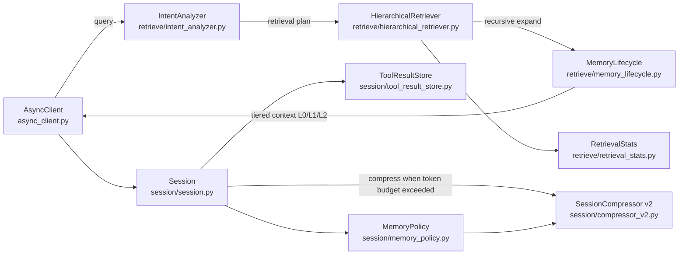
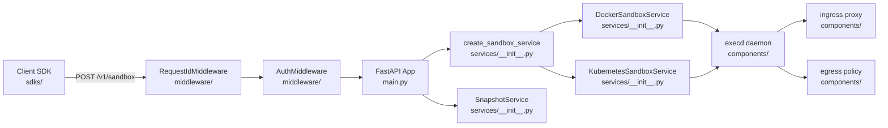
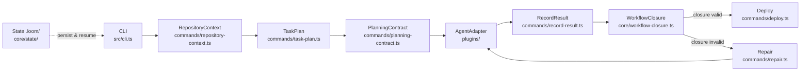
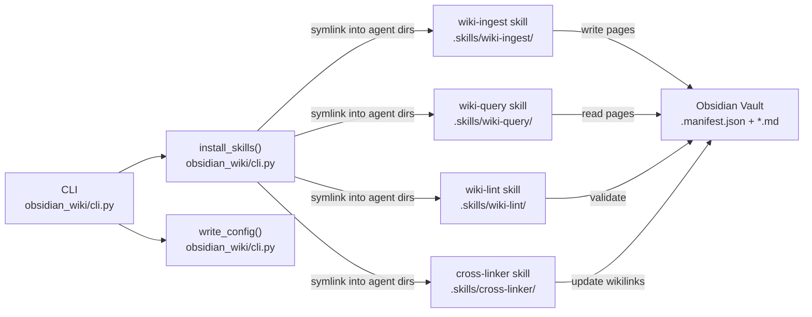

# Agentic AI Weekly Scan — 2026-06-15

## Executive Summary

- **volcengine/OpenViking** biến context management từ black-box RAG thành một virtual filesystem
  có địa chỉ (`viking://`), dùng hierarchical retrieval thay cosine-only search — tiết kiệm tới 91%
  token theo benchmark nội bộ.
- **opensandbox-group/OpenSandbox** là sandbox runtime production-grade duy nhất tuần này có
  credential vault injection (agent code không bao giờ thấy secret) + snapshot/restore cho
  audit trail, hỗ trợ gVisor/Kata/Firecracker.
- **valkor-ai/loom** đề xuất vòng lặp deliver 8 bước có evidence-based closure verification — thay
  vì hỏi "test pass chưa?", nó yêu cầu 4 loại bằng chứng khác nhau trước khi đóng task.

---

## Table of Contents

1. [volcengine/OpenViking — Context database dùng filesystem paradigm cho AI agents](#1-volcengineOpenViking)
2. [opensandbox-group/OpenSandbox — Secure sandbox runtime production-grade cho AI agents](#2-opensandbox-groupOpenSandbox)
3. [valkor-ai/loom — Loop engineering với evidence-based delivery closure cho coding agents](#3-valkor-ailoom)
4. [Ar9av/obsidian-wiki — Framework cho AI agents xây dựng và duy trì digital brain Obsidian](#4-Ar9avobsidian-wiki)

---

## 1. volcengine/OpenViking

**Repo:** https://github.com/volcengine/OpenViking

### §1 — Quick Context

**Pitch:** Context database biến bộ nhớ agent thành virtual filesystem có địa chỉ `viking://` thay vì embedding flat.

**Tech stack:** Python 3.10+ (core), Rust + C++ (build), FastAPI, LiteLLM, OpenTelemetry, tree-sitter; hỗ trợ Volcengine Doubao, OpenAI, Kimi, GLM; embedding: Volcengine/OpenAI/Azure/Jina/Ollama/Voyage.

**Repo health:** 25,644 ⭐ | tác giả ByteDance | CI via `.github/` + `.pre-commit-config.yaml` | AGPL-3.0 | Alpha status.

### §2 — Architecture Deep-Dive

#### A. Component Inventory

| Component | File path | Vai trò |
|---|---|---|
| `HierarchicalRetriever` | `openviking/retrieve/hierarchical_retriever.py` | Recursive directory-based vector search với reranking |
| `IntentAnalyzer` | `openviking/retrieve/intent_analyzer.py` | Phân tích query để tạo multi-condition retrieval plan |
| `MemoryLifecycle` | `openviking/retrieve/memory_lifecycle.py` | CRUD lifecycle cho memory entries |
| `RetrievalStats` | `openviking/retrieve/retrieval_stats.py` | Per-query performance metrics |
| `Session` | `openviking/session/session.py` | Conversation state, message storage, compression lifecycle |
| `SessionCompressor (v2)` | `openviking/session/compressor_v2.py` | Sliding-window archival với 7-section working memory |
| `MemoryPolicy` | `openviking/session/memory_policy.py` | Rules về khi nào và gì cần remember |
| `ToolResultStore` | `openviking/session/tool_result_store.py` | Externalize large tool outputs ra khỏi message buffer |
| `ToolResultSynopsis` | `openviking/session/tool_result_synopsis.py` | Tóm tắt tool outputs theo budget |
| `AsyncClient / SyncClient` | `openviking/async_client.py`, `openviking/sync_client.py` | SDK entry points cho agent code |

#### B. Control Flow — Hierarchical Filesystem Retrieval

Pattern: **Tiered Context Serving + Hierarchical RAG**

1. Agent gọi `AsyncClient.retrieve(query)` → `IntentAnalyzer` phân tích query thành multi-condition retrieval plan.
2. `HierarchicalRetriever._global_vector_search()` tìm initial directory candidates qua dense + sparse vectors trên toàn tenant.
3. `_recursive_search()` dùng priority queue để expand từ directories downward (tối đa 4 parallel child searches, `MAX_PARALLEL_CHILD_SEARCHES = 4`).
4. Score propagation: `final_score = α × child_score + (1-α) × parent_score`; convergence detection sau `MAX_CONVERGENCE_ROUNDS = 3` vòng không đổi top-k.
5. `_rerank_scores()` áp dụng reranking khi "thinking mode"; fallback về vector scores.
6. `_convert_to_matched_contexts()` blend semantic similarity với hotness (recency + activity) → trả về top-k với tiered context: **L0** (~100 tokens abstract), **L1** (~2k overview), **L2** (full detail on demand).

#### C. State & Data Flow

- **Message format:** `Message` objects với unique IDs, lưu JSONL (`messages.jsonl`) + metadata JSON (`.meta.json`).
- **Session storage:** filesystem-based; distributed lock (Phase 1) trước khi archive; Phase 2 async memory extraction.
- **Context management:** Sliding window — giữ `keep_recent_count` messages live, archive older; `ToolResultStore` externalize outputs lớn với configurable preview budget.
- **Working memory:** 7 sections (Session Title, Current State, Task & Goals, Key Facts & Decisions, Files & Context, Errors & Corrections, Open Issues); update strategy: KEEP / UPDATE / APPEND per section.

#### D. Tool / Capability Integration

- MCP support (dep trong `pyproject.toml`).
- `tree-sitter` cho code parsing (nhiều language grammars).
- Tool results có thể externalized + summarized tự động trước khi vào context.
- Không có sandbox; không có function-calling native riêng — agent gọi via client SDK.

#### E. Memory Architecture

- **Short-term:** `_messages: List[Message]` trong RAM per session.
- **Long-term:** Archived chunks trong history directory; reconstructed qua `load()` method.
- **Compression:** `compressor_v2.py` — two-phase commit (filesystem lock → async memory extraction).
- **Retrieval:** dense + sparse vectors + hotness score; directory-recursive thay vì flat ANN search.
- **Tiering:** L0/L1/L2 — agent trả token tỷ lệ với độ sâu thực sự cần.

#### F. Model Orchestration

- LiteLLM làm multi-provider adapter (Volcengine, OpenAI, Gemini, Kimi, GLM đều qua đây).
- "Thinking mode" để reranking — có thể map sang frontier model cho planning step; không xác định rõ từ code.
- `ragas` trong test deps gợi ý có eval RAG quality nhưng harness cụ thể không xác định từ code.

#### G. Observability & Eval

- OpenTelemetry instrumentation trong deps; `openviking/telemetry/` + `openviking/observability/` directories.
- `RetrievalStats` (`openviking/retrieve/retrieval_stats.py`) ghi per-query metrics.
- Retrieval trajectory visualization — không xác định implementation file cụ thể.

#### H. Extension Points

- Pluggable embedding providers (8+ options qua pyproject.toml optional deps).
- Bot integrations: Telegram, Feishu, DingTalk, Slack, QQ via optional deps.
- LangChain/LangGraph optional integration group.
- `openviking/integrations/` directory (files không xác định từ browse).

### §3 — Architecture Diagram

### §4 — Verdict

**Điểm novel:** Hai insight kép: (1) virtual filesystem thay flat embedding space — retrieval theo hierarchy `viking://resources/project/docs` thay vì cosine-over-all; (2) L0/L1/L2 tiering cho phép agent pay-as-you-go về token cost. Score propagation `α × child + (1-α) × parent` là một cơ chế blend địa lý + ngữ nghĩa chưa thấy ở framework nào.

**Red flags:** ByteDance authorship + AGPL-3.0 + recommend deploy trên Volcengine ECS — vendor lock-in risk. Build complexity (Python + Rust + C++ + Cargo) là barrier cao. Alpha status despite 25k stars — tốc độ star tăng nhanh hơn tốc độ maturity.

**Open questions:** Benchmark "91% token reduction" được đo trên workload nào? `openviking/eval/` directory tồn tại nhưng harness cụ thể không xác định. Cơ chế `pyagfs` (Python Agent Filesystem) — không xác định từ code.

---

## 2. opensandbox-group/OpenSandbox

**Repo:** https://github.com/opensandbox-group/OpenSandbox

### §1 — Quick Context

**Pitch:** Sandbox runtime production-grade cho AI agents, hỗ trợ gVisor/Kata/Firecracker với credential vault injection và snapshot/restore.

**Tech stack:** Python 44.4% (FastAPI server), Go 30.4% (execd, ingress, egress daemons), Kotlin/C#/TS/Java (multi-language SDKs); Docker + Kubernetes; Apache 2.0.

**Repo health:** 11,517 ⭐ | Apache 2.0 | pre-commit CI | GOVERNANCE.md + OSEP process | multi-language SDK docs.

### §2 — Architecture Deep-Dive

#### A. Component Inventory

| Component | File path | Vai trò |
|---|---|---|
| `FastAPI App` | `server/opensandbox_server/main.py` | Lifecycle API entry point; middleware stack registration |
| `SandboxService` | `server/opensandbox_server/services/__init__.py` | Abstract interface cho sandbox operations |
| `DockerSandboxService` | `server/opensandbox_server/services/__init__.py` | Docker runtime backend |
| `KubernetesSandboxService` | `server/opensandbox_server/services/__init__.py` | Kubernetes runtime backend |
| `SnapshotService` | `server/opensandbox_server/services/__init__.py` | State checkpoint và restore |
| `PersistedSnapshotService` | `server/opensandbox_server/services/__init__.py` | Durable snapshot storage |
| `AuthMiddleware` | `server/opensandbox_server/middleware/` | API key validation |
| `RequestIdMiddleware` | `server/opensandbox_server/middleware/` | Per-request traceability |
| `execd` | `components/` | Execution daemon trong sandbox (Go) |
| `ingress` | `components/` | Traffic routing proxy (Go) |
| `egress` | `components/` | Per-sandbox network egress policy (Go) |
| `CLI` | `server/opensandbox_server/cli.py` | `osb` command-line tool |
| `StartupGuard` | `server/opensandbox_server/startup_guard.py` | Startup validation; API key confirm + runtime check |

#### B. Control Flow — Client-Server với Pluggable Runtime Backend

Pattern: **Control Plane / Data Plane Separation với Factory Pattern**

1. Client SDK gửi `POST /v1/sandbox` đến lifecycle API (`main.py`).
2. `RequestIdMiddleware` → `AuthMiddleware` → `CORSMiddleware` xử lý request theo thứ tự.
3. `create_sandbox_service()` factory chọn `DockerSandboxService` hoặc `KubernetesSandboxService` dựa trên config.
4. Backend provision container với gVisor/Kata Containers/Firecracker runtime (config trong `docs/secure-container.md`).
5. Execution requests route đến `execd` daemon trong sandbox; `ingress` proxy traffic vào; `egress` enforce per-sandbox network policy.
6. `SnapshotService` capture state checkpoint on demand → enable audit trail hoặc restore.
7. Sandbox tiến qua lifecycle states: create → run → cleanup; cleanup via lifecycle router.

#### C. State & Data Flow

- **Message format:** HTTP JSON qua OpenAPI specs (`specs/`); typed responses với `SnapshotRecord`, `SnapshotStatusRecord`, `SnapshotState`.
- **State storage:** `repositories/` layer — không xác định storage backend cụ thể (likely SQLite hoặc Postgres) từ code.
- **Context window:** N/A — sandbox không manage LLM context.
- **API versioning:** cả `/` và `/v1` prefix đều được register, future-proof.

#### D. Tool / Capability Integration

- MCP server expose sandbox operations cho Claude Code và Cursor.
- Multi-language SDKs trong `sdks/` (Python, JS/TS, Go, Java/Kotlin, C#/.NET).
- `examples/` integration với LangGraph, Google ADK, OpenClaw.
- Browser automation support: Chromium, Playwright, VNC.
- `Credential Vault` (`docs/credential-vault.md`): secrets injected vào sandbox mà workload code không thấy được — critical security property.

#### E. Memory Architecture

Không áp dụng — OpenSandbox là execution runtime, không manage LLM memory.

#### F. Model Orchestration

Model-agnostic. Compatible với Claude Code, Gemini CLI, OpenAI Codex, Qwen, Kimi. Không có routing logic riêng.

#### G. Observability & Eval

- `logging_config.py` (`server/opensandbox_server/logging_config.py`) — centralized logging.
- `RequestIdMiddleware` đảm bảo mọi request có traceable ID.
- OSEP (OpenSandbox Enhancement Proposals) trong `oseps/` — community-driven governance.
- Architecture documentation: `docs/architecture.md`, `docs/credential-vault.md`, `docs/secure-container.md`.

#### H. Extension Points

- `ExtensionService` (`server/opensandbox_server/services/__init__.py`) cho custom extensions.
- Pluggable runtimes: Docker vs Kubernetes via factory.
- OSEP process cho community-driven API changes.

### §3 — Architecture Diagram

### §4 — Verdict

**Điểm novel:** Credential vault injection là pattern hiếm gặp trong open-source sandbox: agent code chạy bên trong sandbox không bao giờ nhìn thấy API keys — giảm blast radius khi agent bị prompt injection hay code execution attack. Snapshot/restore tạo audit trail cho agent actions — không thấy ở E2B, Modal, hay Daytona.

**Red flags:** Go chiếm 30% codebase (`execd`, `ingress`, `egress`) nhưng không rõ test coverage. `startup_guard.py` validate runtime trước khi serve request — pattern này gợi ý từng có production incident. Storage backend của `repositories/` layer không xác định từ code.

**Open questions:** OSEP process có thực sự active không hay chỉ structure? Latency overhead của credential vault injection so với direct env var injection là bao nhiêu? gVisor vs Firecracker trade-off được document ở đâu?

---

## 3. valkor-ai/loom

**Repo:** https://github.com/valkor-ai/loom

### §1 — Quick Context

**Pitch:** Delivery harness bọc coding agents với stateful loop 8 bước và evidence-based task closure verification.

**Tech stack:** TypeScript 65.4% + JavaScript 34.6%; Node.js 20+; Commander.js, Zod, yaml, mammoth, pdf-parse; agent adapters cho Claude Code, Codex, OpenCode; Apache 2.0.

**Repo health:** 271 ⭐ | created 2026-06-09 (6 ngày tuổi) | 30+ verification scripts trong package.json | CI không xác định.

### §2 — Architecture Deep-Dive

#### A. Component Inventory

| Component | File path | Vai trò |
|---|---|---|
| `CLI` | `src/cli.ts` | Commander.js router; entry point tất cả commands |
| `WorkflowClosure` | `src/core/workflow-closure.ts` | Validate evidence đủ điều kiện close task |
| `PlanningContract` | `src/commands/planning-contract.ts` | Task contract với acceptance criteria |
| `TaskPlan` | `src/commands/task-plan.ts` | Task decomposition và sequencing |
| `RepositoryContext` | `src/commands/repository-context.ts` | Thu thập codebase context trước khi plan |
| `RuntimeDeliveryClosure` | `src/core/runtime-delivery-closure.ts` | Closure validation tại runtime |
| `RecordResult` | `src/commands/record-result.ts` | Evidence collection sau execution |
| `Repair` | `src/commands/repair.ts` | Fix cycle khi closure validation fail |
| `Deploy` | `src/commands/deploy.ts` | Deployment checks và evidence |
| `AgentAdapter` | `plugins/` | Claude Code / Codex / OpenCode adapter |
| `Schemas` | `src/core/schemas.ts` | Zod schemas cho tất cả data structures |
| `State` | `src/core/state/` | `.loom/` persistent project state |

#### B. Control Flow — Stateful Delivery Loop với Evidence-Based Closure

Pattern: **Planner-Executor loop với 4-point Evidence Gate**

1. `loom init` → `RepositoryContext` (`src/commands/repository-context.ts`) thu thập git history, README, tech stack; đọc DOCX/PDF requirements qua `mammoth` + `pdf-parse`.
2. `brainstorm.ts` gọi agent để ideate; `plan.ts` tạo `PlanningContract` với acceptance criteria.
3. Agent adapter (`plugins/`) delegate execution sang Claude Code / Codex / OpenCode CLI.
4. `RecordResult` (`src/commands/record-result.ts`) capture 4 loại evidence: `user_action`, `declared_interface_invocation`, `state_or_persistence_change`, `success_or_blocking_feedback`.
5. `WorkflowClosure` (`src/core/workflow-closure.ts`) validate: (a) user flow trong write boundary, (b) interface refs complete, (c) acceptance refs covered, (d) implementation actions present, (e) verification intents với runtime/automated evidence.
6. Nếu closure không đủ → `Repair` (`src/commands/repair.ts`) khởi động fix cycle; state lưu trong `.loom/` để resume.
7. `Deploy` (`src/commands/deploy.ts`) chạy deployment checks → final evidence capture.
8. `continue.ts` là primary navigation — đọc `.loom/` state và route đến step phù hợp.

#### C. State & Data Flow

- **Message format:** Typed TypeScript types qua `src/core/contracts.ts`; validated bằng Zod (`src/core/schemas.ts`).
- **State storage:** Project-local `.loom/` directory — YAML/JSON files cho context, task graphs, test results, repair notes, deployment evidence.
- **Context window management:** `compact-request-output.ts` — không xác định strategy cụ thể nhưng tên gợi ý context compaction.
- **Requirements import:** DOCX (mammoth), PDF (pdf-parse), YAML (yaml), ZIP (yauzl) — multi-format spec ingestion.

#### D. Tool / Capability Integration

- Agent adapters trong `plugins/`: `@loom` (Codex), `/loom` slash command (Claude Code), OpenCode integration.
- Loom không provide tools — delegate hoàn toàn sang agent's own tool ecosystem.
- `command-invocation.ts` (`src/commands/command-invocation.ts`) wrap agent CLI commands.
- Không có MCP integration (không xác định từ deps hoặc code).

#### E. Memory Architecture

- **Project-level memory:** `.loom/` state directory — task graphs, repair notes, test results persist across sessions.
- **No LLM memory:** Loom không manage agent's context window.
- **Resume:** `continue.ts` đọc saved state → route appropriately mà không restart delivery loop.

#### F. Model Orchestration

- Model-agnostic; delegates sang Claude Code, Codex, OpenCode adapters.
- Không có multi-model routing hoặc fallback logic trong code.
- Verification (`workflow-closure.ts`) chạy model-independent logic.

#### G. Observability & Eval

- `RuntimeDeliveryClosure` lưu evidence artifacts có structure.
- `status.ts` và `inspect.ts` cho delivery state visibility.
- `audit` scripts trong package.json cho Claude session logging.
- Không thấy OpenTelemetry hoặc tracing framework trong deps.

#### H. Extension Points

- Plugin architecture cho agent adapters (`plugins/`).
- Zod schemas cho phép thêm validation rules mà không break types.
- New command = new TypeScript file trong `src/commands/`.

### §3 — Architecture Diagram

### §4 — Verdict

**Điểm novel:** `WorkflowClosureRequirement` 4-point gate là insight đáng học nhất tuần: thay vì chỉ hỏi "tests pass không?", Loom yêu cầu bằng chứng của *user action*, *interface invocation*, *state change*, và *success feedback* — bắt được class bug "tests xanh nhưng feature không wired" mà unit test không detect được. Kết hợp `frontendSelfCheckViolatesRequiredClosure()` check data binding mode = "wired" là cụ thể và actionable.

**Red flags:** Repo mới 6 ngày, chưa có CI visible, 30+ verification scripts trong package.json nhưng không thấy `tests/` directory. `dist/cli.js` là compiled artifact — chưa rõ CI build pipeline. Low star count (271) so với độ phức tạp của delivery loop.

**Open questions:** `src/core/operations/` và `src/core/deployment/` subdirectories có gì? `compact-request-output.ts` implement context compaction strategy nào? Adapter `plugins/` có protocol riêng hay chỉ shell-invoke CLI của từng agent?

---

## 4. Ar9av/obsidian-wiki

**Repo:** https://github.com/Ar9av/obsidian-wiki

### §1 — Quick Context

**Pitch:** Framework cài skill markdown cho AI agents để xây dựng và maintain knowledge vault Obsidian như "digital brain" dài hạn.

**Tech stack:** Python 63.1% (installer CLI), HTML 25.6%, Shell 11.3%; pip package; optional QMD (semantic search); Git (sync); không có ML framework, không có vector DB baked-in.

**Repo health:** 2,036 ⭐ | created 2026-04-06 | 164 commits | pyproject.toml present | Apache 2.0.

### §2 — Architecture Deep-Dive

#### A. Component Inventory

| Component | File path | Vai trò |
|---|---|---|
| `CLI` | `obsidian_wiki/cli.py` | 3 commands: setup, list, info |
| `install_skills()` | `obsidian_wiki/cli.py` | Symlink/copy skill markdown files vào agent directories |
| `install_global_skills()` | `obsidian_wiki/cli.py` | Deploy skills vào tất cả supported agent dirs |
| `write_config()` | `obsidian_wiki/cli.py` | Ghi vault path vào `~/.obsidian-wiki/config` |
| `_check_stale()` | `obsidian_wiki/cli.py` | Warn về version mismatch |
| `wiki-ingest skill` | `.skills/wiki-ingest/` | 4-stage ingestion pipeline (Ingest → Extract → Merge → Schema) |
| `wiki-query skill` | `.skills/wiki-query/` | Tiered retrieval (summaries/tags trước, body sau) |
| `wiki-lint skill` | `.skills/wiki-lint/` | Schema và wikilink validation |
| `cross-linker skill` | `.skills/cross-linker/` | Wikilink maintenance |
| `setup.sh` | `setup.sh` | Automation script: symlinks + bootstrap files + git sync |

**Lưu ý về giới hạn Python code:** `obsidian_wiki/` package chỉ có 3 files (`__init__.py`, `__main__.py`, `cli.py`). Toàn bộ "architecture" thực tế là markdown skill files trong `.skills/` được AI agents đọc và thực thi. Python code là pure installer, không có ML hoặc retrieval logic.

#### B. Control Flow — Multi-Stage Knowledge Ingestion via Agent Skill

Pattern: **Skill-Driven Ingestion Pipeline** (behavior được define bằng markdown, thực thi bởi agent)

1. `obsidian-wiki setup --vault ~/vault` → CLI (`obsidian_wiki/cli.py`) symlink `.skills/*` vào `~/.claude/`, `~/.cursor/`, `.windsurf/`, v.v.
2. Agent đọc `wiki-ingest` skill từ discovery path → thực thi 4-stage pipeline: **Ingest** (raw source), **Extract** (concepts + relationships), **Merge** (integrate với existing pages), **Schema** (maintain wikilinks + categories).
3. `.manifest.json` tại vault root track delta — ingested sources, timestamps, produced pages.
4. `wiki-query` skill implement tiered retrieval: scan frontmatter summaries/tags trước → mở page body chỉ khi cần → cost flat khi vault grow.
5. `wiki-lint` skill validate schema coherence và broken wikilinks.
6. `wiki-sync.sh` (optional) push vault lên GitHub qua timestamped git commits.

#### C. State & Data Flow

- **Message format:** Không có — agent giao tiếp với vault qua file read/write trực tiếp.
- **State storage:** Plain markdown files trong Obsidian vault; `.manifest.json` cho delta tracking; `graph.json` cho link graph.
- **Context management:** `wiki-query` scan summaries trước (cheap) → body sau (expensive) — manual tiering không phải automated.

#### D. Tool / Capability Integration

- Agent history mining skills: extract từ `~/.claude/`, `~/.codex/`, `~/.hermes/`, `~/.openclaw/`, `~/.windsurf/` session files.
- QMD optional: semantic search với lex+vec pass trước khi fallback sang grep.
- `setup.sh` tạo `CLAUDE.md`, `AGENTS.md`, `.cursor/rules/`, etc. — bootstrap files cho nhiều agents.

#### E. Memory Architecture

- **Long-term memory:** Obsidian vault — markdown pages với wikilinks và frontmatter metadata.
- **Tiered retrieval:** `wiki-query` scan L0 (summaries/tags) → L1 (page body) on demand.
- **Provenance:** Claims tagged `extracted` / `inferred` / `ambiguous` với source attribution.
- **Graph export:** Wikilinks → JSON, GraphML (Gephi/yEd), Cypher (Neo4j), HTML visualization.
- **Short-term:** Không có — agent context window của từng session không được managed.

#### F. Model Orchestration

Không xác định — hoàn toàn delegate cho agent (Claude Code, Cursor, Windsurf, v.v.). Không có model routing logic.

#### G. Observability & Eval

- `wiki-status` skill: vault statistics, missing links, stale entries.
- `wiki-lint` skill: schema validation và consistency check.
- `_check_stale()` trong CLI: version mismatch detection.
- Không có structured logging hoặc telemetry.

#### H. Extension Points

- Thêm skill mới = thêm directory trong `.skills/` với `SKILL.md`.
- `install_skills(subset=...)` parameter cho selective installation.
- `_raw/` staging area: quick capture → promoted to proper wiki pages tự động.

### §3 — Architecture Diagram

### §4 — Verdict

**Điểm novel:** Pattern "agent builds its own memory" theo 4-stage pipeline (Ingest → Extract → Merge → Schema) + provenance tagging (extracted/inferred/ambiguous) là rất cụ thể và khác hẳn cách dùng vector DB thông thường. Graph export sang Neo4j/Gephi mở ra khả năng kiểm tra knowledge graph ngoài agent context. Multi-agent history mining (extract từ session files của 10+ agents) là unique capability.

**Red flags:** Python package là pure installer — không có production code nào thực sự chạy outside of agent. Phụ thuộc hoàn toàn vào agent interpreting markdown skill files đúng cách; không có schema validation, không có error handling, không có retry logic ở Python layer. "Architecture" thực sự là prompt engineering được đóng gói đẹp.

**Open questions:** `obsidian_wiki/` có thêm Python modules nào không liệt kê được từ browser? QMD là gì và licensing của nó ra sao? `wiki-synthesize` skill implement cross-document synthesis như thế nào về mặt context management?
