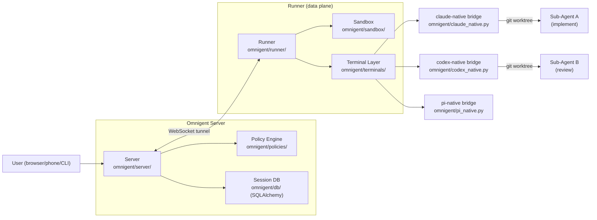
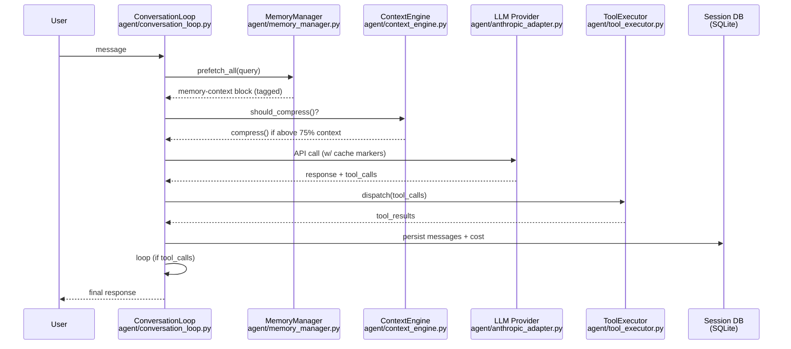
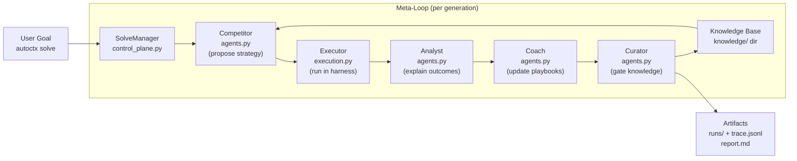
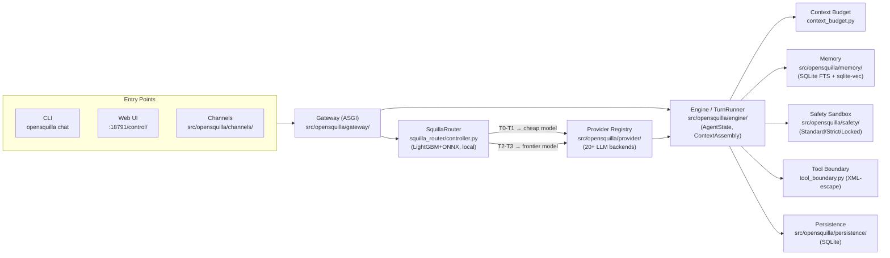

# Agentic AI Weekly Scan — 2026-06-16

## Executive Summary

- **Tuần này nổi bật về meta-orchestration**: Hai repo mới (`omnigent`, `autocontext`) độc lập đi đến cùng một kết luận — value không nằm ở một agent đơn mà ở *layer điều phối* phía trên. Omnigent giải quyết vấn đề cross-vendor policy; autocontext giải quyết vấn đề self-improvement across generations.
- **Chi phí inference đang trở thành first-class architectural concern**: OpenSquilla benchmarks 9x cost reduction so với single-model (0.9251 score vs 0.9255 tại $0.688 vs $6.23), đạt được bằng on-device ML classifier thay vì LLM-as-judge cho routing — pattern đáng học nhất tuần.
- **Prompt-caching preservation as architecture**: Hermes Agent (194K⭐, massive adoption) coi việc giữ nguyên prompt cache là invariant cấp kiến trúc — skills được inject như *user messages* chứ không phải system prompt. Insight nhỏ nhưng có tác động lớn đến latency và cost ở scale.

## Table of Contents

1. [omnigent-ai/omnigent](#1-omnigent-aiomnigent) — Meta-harness đa vendor với policy governance
2. [NousResearch/hermes-agent](#2-nousresearchhermes-agent) — Self-curating agent với prompt-cache architecture
3. [greyhaven-ai/autocontext](#3-greyhaven-aiautocontext) — Recursive self-improvement với 5-role meta-loop
4. [opensquilla/opensquilla](#4-opensquillaopensquilla) — Microkernel agent với on-device turn router

---

## 1. omnigent-ai/omnigent

**Link**: https://github.com/omnigent-ai/omnigent

### §1 — Quick Context

**Pitch**: Meta-harness thống nhất cho Claude Code, Codex, Pi, và custom agents với policy enforcement và real-time collaboration.

**Tech stack**: Python 3.12+, FastAPI/Starlette/Uvicorn, SQLAlchemy, Pydantic v2, Claude Agent SDK, OpenAI Agents SDK, Pexpect+Pyte (terminal emulation), CEL-Expr-Python (policy eval), OpenTelemetry, sandbox: `bubblewrap` (Linux) / `seatbelt` (macOS).

**Repo health**: 2,024 ⭐, 248 forks, created 2026-06-11, còn alpha, Apache 2.0, CI với pre-commit + pytest + playwright.

---

### §2 — Architecture Deep-Dive

#### A. Component Inventory

- `Server` (`omnigent/server/`) — REST + WebSocket API, quản lý sessions, multi-user auth (OIDC, invite-only signup), trung tâm điều phối.
- `Runner` (`omnigent/runner/`) — Execution-side data plane; sở hữu harness subprocesses, MCP connections, sub-agent harnesses; expose FastAPI app qua WebSocket tunnel về server. Dùng lazy import (PEP 562) để giảm 0.5s spawn overhead.
- `Policy Engine` (`omnigent/policies/`) — Abstract `Policy` + concrete `FunctionPolicy`; evaluate qua `EvaluationContext` → `PolicyResult`. Logic thuần (không có DB I/O); state và composition loop nằm ở `omnigent/runtime/policies/`. CEL expressions được dùng cho condition evaluation.
- `Sandbox` (`omnigent/sandbox/`) — `bwrap` OS isolation trên Linux, macOS Seatbelt; bắt buộc cho `claude-native`/`codex-native` terminals.
- `Terminal Layer` (`omnigent/terminals/`) — Pexpect + Pyte để emulate terminal; wraps harness CLI subprocesses (claude, codex, pi).
- `Native Bridges` (`omnigent/claude_native.py`, `omnigent/codex_native.py`, `omnigent/pi_native.py`) — Per-vendor protocol adapters; handle credential forwarding, elicitation (human-in-the-loop prompts), event streaming.
- `Session Lifecycle` (`omnigent/session_lifecycle.py`, `omnigent/resume_dispatch.py`) — Fork/resume logic, worktree management.
- `Harness Spec / Agent YAML` (`omnigent/spec/`) — Schema cho agent YAML: `executor`, `tools`, nested `agent` tool type cho sub-agents.
- `Examples: Polly` (`examples/polly/`) — Reference implementation của hierarchical pattern: `config.yaml` + `agents/` sub-configs + `skills/`.

#### B. Control Flow — Hierarchical (Supervisor → Workers)

Pattern: **Hierarchical orchestration với cross-vendor verification**.

Happy path với Polly example:
1. User gửi goal vào Polly (supervisor agent, không có coding harness).
2. Polly preflight checks: `sys_session_send` roster check, xác nhận claude_code/codex/pi available trên PATH.
3. Polly phân tách task, dispatch coding subtasks tới sub-agents (claude_code, codex) trong **parallel git worktrees** — mỗi sub-agent sở hữu isolated workspace.
4. Sub-agents tự chạy qua harness của họ (claude-native, codex-native), stream events về Runner → Server.
5. Polly poll inbox (`sys_read_inbox`) — non-blocking; nhận diffs từ sub-agents khi hoàn thành.
6. Polly dispatch review task tới **vendor khác** với vendor đã viết code (cross-vendor verification invariant).
7. Reviewer trả kết quả; Polly tổng hợp, báo cáo với human. Human merge PR.

#### C. State & Data Flow

- Message format: Pydantic schemas qua WebSocket (JSON), typed events giữa Runner và Server.
- State storage: SQLAlchemy (SQLite local, PostgreSQL deploy) — sessions, messages, users, token usage.
- Context window: Không expose compression strategy trong public source; context management là per-harness (phụ thuộc Claude/Codex native behavior).

#### D. Tool / Capability Integration

- Tools định nghĩa trong YAML: `type: function` (Python callable, schema auto-gen từ signature) hoặc `type: agent` (sub-agent-as-tool).
- Sub-agents được invoke qua `sys_session_send` / `sys_read_inbox` built-in tools — không phải function-calling native; là Omnigent's own protocol.
- Policy layer intercepts trước khi tools execute; trả `PolicyResult` (allow/block/ask).
- Validation: Pydantic schemas + CEL policy expressions.

#### E. Memory Architecture

Không xác định được memory architecture cụ thể từ code public — context management delegate cho underlying harness.

#### F. Model Orchestration

- Mỗi sub-agent YAML khai báo `harness` riêng: `claude-sdk`, `codex`, `codex-native`, `claude-native`, `cursor`, `openai-agents`, `pi`.
- Credentials per-agent, hỗ trợ API key, subscription, gateway (OpenRouter/LiteLLM/Ollama), Databricks.
- Supervisor (Polly) không cần coding harness — chạy với bất kỳ harness nào (`--harness pi`).
- Cost: `omnigent/cost_plan.py`, `omnigent/native_cost_popup.py` — cost tracking per session.

#### G. Observability & Eval

- OpenTelemetry: OTLP exporter (gRPC + HTTP), FastAPI instrumentation, HTTPX instrumentation — trong deps (`pyproject.toml`).
- Optional MLflow integration (trong `[tracing]` extra).
- Session replay: `omnigent/conversation_browser.py`.
- Không thấy eval framework bên trong repo — eval là external.

#### H. Extension Points

- Custom agent: YAML file với `executor.harness` + `tools` list.
- Custom policy: Python function matching `Policy` interface, reference trong YAML `policies:` block.
- Custom harness: Plug vào via gateway credential.
- Web SDK: `sdks/omnigent-ui-sdk` — embed UI vào third-party apps.

---

### §3 — Architecture Diagram

---

### §4 — Verdict

**Điểm novel**: Cross-vendor verification pattern trong Polly là architectural insight thực sự — độc lập review bởi different vendor giảm confirmation bias. Policy stack 3-level (server → agent → session) với CEL expressions là production-grade governance pattern hiếm thấy ở agent frameworks. Sandbox (bwrap/seatbelt) bắt buộc cho coding harnesses.

**Red flags**: Còn alpha (0.x), 108 open issues. Session fork/resume logic phức tạp — `resume_dispatch.py` chưa documented rõ. Web UI code (`ap-web/`) không open source đầy đủ.

**Open questions**: Context management strategy khi sub-agents approach context limit trong long-running worktree sessions? Policy CEL condition language có đủ expressive không cho production use cases? Latency overhead của cross-harness WebSocket tunnel so với direct function call?

---

## 2. NousResearch/hermes-agent

**Link**: https://github.com/NousResearch/hermes-agent

### §1 — Quick Context

**Pitch**: Agent tự cải thiện với skill curator, persistent memory, và cross-platform gateway cho 6 messaging channels.

**Tech stack**: Python, Node.js (optional harnesses), Anthropic SDK, Bedrock adapter, Gemini native adapter, SQLite (sessions), OpenRouter, Pexpect (terminal backends), Docker/Modal/Daytona/SSH execution.

**Repo health**: 194,629 ⭐ (extraordinary adoption), 34,143 forks, created 2025-07-22, MIT license, CI present, 20,922 open issues (scale của adoption).

---

### §2 — Architecture Deep-Dive

#### A. Component Inventory

- `ConversationLoop` (`agent/conversation_loop.py`) — Main ReAct-style loop; orchestrates API calls, tool dispatch, retry logic, cost tracking, session persistence.
- `TurnContext` (`agent/turn_context.py`) — Per-turn state: sanitized messages, system prompt, ephemeral context, retry counters.
- `ContextEngine` (`agent/context_engine.py`) — Abstract base; `ContextCompressor` là default impl. Tracks token usage per-turn, fires compress() khi vượt `threshold_percent` (default 75%). Protect first 3 + last 6 messages.
- `MemoryManager` (`agent/memory_manager.py`) — Provider-based delegation, at-most-one external provider. Prefetch trước mỗi turn, inject vào `<memory-context>` tagged block. `StreamingContextScrubber` giữ tags khỏi UI.
- `ToolExecutor` (`agent/tool_executor.py`) — Tool dispatch, validation, result normalization.
- `ToolGuardrails` (`agent/tool_guardrails.py`) — Safety constraints trước tool execution.
- `SkillCommands` (`agent/skill_commands.py`) — Skill loading/discovery; skills được inject như **user messages** (không phải system prompt).
- `TrajectoryCompressor` (`trajectory_compressor.py`) — Batch compression cho training data: bảo vệ first + last N turns, LLM summarizes middle region với "[CONTEXT SUMMARY]:" prefix; 20-30% compression, async parallel processing.
- `Gateway` (`gateway/`) — Single gateway process cho Telegram, Discord, Slack, WhatsApp, Signal, Email.
- `Providers` (`agent/anthropic_adapter.py`, `agent/gemini_native_adapter.py`, `agent/bedrock_adapter.py`) — Per-vendor adapters với prompt caching markers.
- `Curator System` (`skills/.usage.json`, `curator_backup.py`) — Tracks skill usage metrics (use count, patch count, last activity); auto-archives stale skills; **không bao giờ xóa, chỉ archive**.

#### B. Control Flow — ReAct-style (Think → Act → Observe Loop)

Pattern: **ReAct với priority-ordered context injection và budget enforcement**.

Happy path:
1. **Prologue**: `build_turn_context()` — khởi tạo stdio safety, reset retries, sanitize input, restore/build system prompt.
2. **Memory Prefetch**: `MemoryManager.prefetch_all(query)` — thu thập context từ memory providers trước API call.
3. **Drain Steer Commands**: consume pending `/steer` messages từ other users/channels vào message history.
4. **Build API request**: inject ephemeral context, apply prompt caching markers (Anthropic), normalize whitespace cho cache hits.
5. **API Call with Retry**: streaming preferred; retry với jittered backoff; fallback model nếu rate-limited.
6. **Response Processing**: extract reasoning blocks, handle truncation (max 3 continuation retries), detect thinking-budget exhaustion.
7. **Tool Dispatch** (nếu có): `ToolExecutor.dispatch()` → collect results → append assistant + tool messages → loop back bước 2.
8. **Persist**: messages, token counts, cost estimate → session DB.

#### C. State & Data Flow

- Message format: Typed dicts trong Python; Pydantic validation tại boundaries.
- State storage: SQLite (session DB); `~/.hermes/skills/` (skill files + `.usage.json`).
- Context strategy: 75% threshold trigger; protect first 3 (system, human, model response) + last 6 messages; LLM summarizes compressible middle.

#### D. Tool / Capability Integration

- 40+ built-in tools (file, terminal, web, git, etc.) + MCP support (`mcp_serve.py`).
- Function-calling native (Anthropic/OpenAI) hoặc plugin LLM pattern cho other providers.
- Guardrails check trước execution; tool results validated.

#### E. Memory Architecture

- **Short-term**: Conversation history với ContextEngine compression (sliding window + LLM summarization).
- **Long-term**: `~/.hermes/skills/` (skill files auto-curated), memory providers (MemoryManager). Optional exponential decay và "dream" consolidation.
- **Retrieval**: Query-based prefetch; kết quả inject trước API call trong `<memory-context>` block; `StreamingContextScrubber` giữ tags khỏi UI output.

#### F. Model Orchestration

- Multi-provider: Anthropic (direct + Bedrock), Gemini native, OpenRouter, 40+ via plugin.
- Prompt caching markers được inject per-provider (Anthropic-specific). **Architectural invariant**: "per-conversation prompt caching is sacred" — không mutate mid-conversation context.
- Skills inject như **user messages** (chứ không phải system prompt) để preserve cache.

#### G. Observability & Eval

- `agent/rate_limit_tracker.py` — Rate limit monitoring.
- `agent/error_classifier.py` — Error categorization.
- `trajectory_compressor.py` — Tạo training datasets từ live traces (production integration pattern).
- Không thấy OpenTelemetry hoặc Langfuse trong public deps.

#### H. Extension Points

- Custom skills: YAML frontmatter (`SKILL.md`), drop vào `~/.hermes/skills/`, auto-discovered.
- Custom providers: Plugin interface (`agent/plugin_llm.py`).
- Gateway extensions: `optional-mcps/`, `optional-skills/` directories.
- MCP server: `mcp_serve.py` — expose Hermes tools ra ngoài.

---

### §3 — Architecture Diagram

---

### §4 — Verdict

**Điểm novel**: Hai architectural decisions đáng học: (1) Skills-as-user-messages thay vì system prompt — giảm cache invalidation cost ở scale lớn. (2) Curator system dùng usage metrics (không phải LLM judge) để archive stale skills — simple, auditable, không tốn tokens. Trajectory compressor tạo training data từ live runs là production-to-training feedback loop đáng để nghiên cứu.

**Red flags**: 20,922 open issues cho thấy adoption vượt capacity maintenance. `ContextEngine` là abstract với "implementation-free" — không rõ default `ContextCompressor` quality. No explicit OpenTelemetry → observability limited ở scale.

**Open questions**: Memory provider "at most one external provider" constraint có gây bottleneck không ở memory-heavy use cases? Curator's auto-archive có false positives với skills dùng seasonally? TrajectoryCompressor dùng OpenRouter cho summarization — privacy implications?

---

## 3. greyhaven-ai/autocontext

**Link**: https://github.com/greyhaven-ai/autocontext

### §1 — Quick Context

**Pitch**: Harness tự cải thiện qua nhiều generations: 5 roles hợp tác tích lũy knowledge dùng cho agent lần sau.

**Tech stack**: Python 3.x + TypeScript/Bun (dual-language), SQLite (migrations/), JSONL traces, Anthropic/OpenAI/Gemini/Mistral/Groq/OpenRouter, Pi extension (`pi/`), MCP server, agent runtimes: Claude CLI, Codex CLI, Hermes CLI, Pi.

**Repo health**: 1,204 ⭐, 101 forks, created 2026-02-11, pushed 2026-06-16, Apache 2.0, có CI.

---

### §2 — Architecture Deep-Dive

#### A. Component Inventory

- `CLI` (`autocontext/src/autocontext/cli.py`, `cli_solve.py`, `cli_run.py`, `cli_mission.py`) — Entry points cho các modes: solve, run, simulate, investigate, mission.
- `SolveManager` (`autocontext/src/autocontext/control_plane.py` hoặc session module) — Orchestrates iteration loop: generate scenario → run N generations → collect artifacts.
- `Five Roles` (không có single file — được implement trong `agents.py` và `prompts/`) — Competitor, Analyst, Coach, Architect, Curator: mỗi role là separate LLM call với chuyên biệt prompt.
- `Scenarios` (`autocontext/src/autocontext/scenarios.py`) — 11 scenario families: game tournaments, agent tasks, simulations, artifact editing, investigations, workflows, negotiations, schema evolution, tool fragility, operator loops, multi-agent coordination.
- `Storage` (`autocontext/src/autocontext/storage.py`, `blobstore.py`, `artifacts.py`) — SQLite + blob storage; traces dưới `runs/`, accumulated knowledge dưới `knowledge/`.
- `Evaluation` (`autocontext/src/autocontext/evaluation.py`) — Staged validation, scoring per generation.
- `Knowledge Base` (`knowledge/`) — Root-level directory persist across runs: playbooks (Markdown), hints, tools, artifacts.
- `Execution` (`autocontext/src/autocontext/execution.py`, `runtimes/`, `harness/`) — Multi-runtime support: local subprocess, SSH remote, sandboxed.
- `TrajectoryCompressor` — Export via `trajectory_compressor.py` (tương tự Hermes); compress traces để tạo training datasets.

#### B. Control Flow — Multi-Role Meta-Loop (Self-Improvement Pattern)

Pattern: **Planner-Executor với multi-role meta-evaluation loop across generations**.

Happy path:
1. User chạy `autoctx solve "goal" --iterations 3`.
2. **Competitor** LLM call: đề xuất strategy/artifact cho generation N, được thông báo bởi playbooks từ generation N-1.
3. **Execute**: strategy được thực thi trong harness (Claude CLI / Codex / Pi / Hermes), collect outcomes.
4. **Analyst** LLM call: giải thích tại sao strategy thành công hoặc thất bại — causal analysis.
5. **Coach** LLM call: convert analyst output → cụ thể updates cho playbooks. Playbooks persist tới `knowledge/`.
6. **Architect** LLM call (nếu progress stalls): đề xuất modifications cho tools hoặc harness.
7. **Curator** LLM call: gate which knowledge persists — reject weak updates, merge strong ones vào `knowledge/`.
8. Loop lại từ bước 2 với generation N+1, bổ sung bởi updated knowledge.
9. Output artifacts: `trace.jsonl`, `generations/`, `report.md`, `artifacts/`.

#### C. State & Data Flow

- Message format: `trace.jsonl` (JSONL per generation), typed schemas qua `sdk_models.py`.
- State storage: SQLite (migrations/), `runs/` (per-run traces), `knowledge/` (accumulated cross-run).
- Context window: Context của từng role call là scoped — Competitor nhận playbooks, Analyst nhận execution log, Coach nhận analyst report. Không maintain single large conversation window.

#### D. Tool / Capability Integration

- Tools được generated dynamically bởi Architect role khi progress stalls.
- MCP server (`autocontext/src/autocontext/mcp/`) — expose core functions ra ngoài, natural language access từ Claude Code.
- Execution via subprocess (local), SSH (remote), hoặc sandboxed environment.
- `strategy_interface.py` — Abstract strategy contracts cho Competitor proposals.

#### E. Memory Architecture

- **Cross-run knowledge**: `knowledge/` directory — playbooks (Markdown lessons), hints (survivor guidance từ Curator), tools (generated helpers), artifacts (files produced).
- **Within-run**: Per-generation `generations/` directory lưu proposals, analysis, scores.
- Retrieval: Automatic injection — Competitor role tự động nhận playbooks từ previous generation. Không có vector search — file-based, deterministic.

#### F. Model Orchestration

- Mỗi role (Competitor, Analyst, Coach, Architect, Curator) là independent LLM call.
- Provider-agnostic: AUTOCONTEXT_AGENT_PROVIDER env var, hỗ trợ Anthropic, OpenAI, Gemini, Mistral, Groq, Pi.
- **Không có explicit model assignment per role** từ README — có thể dùng cùng model cho tất cả roles hoặc configurable.
- Execution environment (harness) là separate từ meta-loop LLM — executor agent có thể dùng Pi trong khi meta-loop dùng Claude.

#### G. Observability & Eval

- `trace.jsonl`: chronological record của tất cả prompts, tool calls, outcomes — replay-capable.
- `generations/`: per-generation strategy proposals, analyst observations, scores.
- Staged validation: scenarios execute thực sự; scores computed từ outcomes.
- Không thấy OpenTelemetry hoặc structured tracing ngoài JSONL.

#### H. Extension Points

- Custom scenarios: 11 families có thể extended.
- Custom harness: Env var `AUTOCONTEXT_AGENT_PROVIDER` + `AUTOCONTEXT_PI_COMMAND`.
- Custom roles: `strategy_interface.py` abstract contracts.
- Existing production systems: "Anthropic or OpenAI clients instrumented once to capture live traces."

---

### §3 — Architecture Diagram

---

### §4 — Verdict

**Điểm novel**: Multi-role meta-evaluation loop là pattern đáng học nhất trong scan này — mỗi role có **separation of concerns** rõ ràng (propose / explain / update / improve / gate), tránh "LLM làm tất cả trong một call" antipattern. Curator-as-gatekeeper ngăn knowledge accumulation degrade thành noise. File-based knowledge với Markdown playbooks — human-readable, diffable, không cần vector DB.

**Red flags**: Không có explicit evidence về model assignment per role — nếu dùng cùng frontier model cho tất cả 5 roles × N generations × M iterations, cost có thể explode. `evaluation.py` 404 khi fetch — scoring methodology không rõ ràng từ public code. `agents.py` cũng 404 — có thể roles được implement khác so với README description.

**Open questions**: Curator role dùng LLM để judge quality — có circular dependency không khi dùng cùng model với Competitor? Playbooks có version-controlled không (git) hay chỉ overwrite? Architect role "suggests tool modifications" — cơ chế thực tế để apply những modifications này là gì?

---

## 4. opensquilla/opensquilla

**Link**: https://github.com/opensquilla/opensquilla

### §1 — Quick Context

**Pitch**: Microkernel AI agent dùng on-device LightGBM classifier để route mỗi turn tới model tier rẻ nhất có khả năng xử lý.

**Tech stack**: Python 3.12+, Starlette ASGI, SQLite + sqlite-vec (memory), LightGBM + ONNX Runtime (SquillaRouter), Bubblewrap/Seatbelt (sandbox), Feishu/Telegram/Discord/Slack/DingTalk/WeCom/Matrix/QQ channels, 20+ LLM providers.

**Repo health**: 4,182 ⭐, 331 forks, v0.3.1, Apache 2.0, CI badge green, Git LFS cho router models.

---

### §2 — Architecture Deep-Dive

#### A. Component Inventory

- `SquillaRouter` (`src/opensquilla/squilla_router/controller.py`, `v4_phase3.py`, `models/v4.2_phase3_inference/`) — On-device LightGBM + ONNX classifier; classifies mỗi turn vào T0-T3 (thinking tiers) + P0-P2 (prompt policy tiers). Classification runs locally; **prompt không rời máy để routing decision**.
- `Engine` (`src/opensquilla/engine/`) — Agent state machine: `AgentConfig`, `AgentState`, `AgentEvent`, `SubagentManager`, `ContextAssembly`, `ToolHandler`. Lazy imports qua PEP 562.
- `Gateway` (`src/opensquilla/gateway/`) — Starlette ASGI server trên `127.0.0.1:18791`, WebSocket RPC, embedded `/control/` console.
- `Memory` (`src/opensquilla/memory/`) — `MEMORY.md` + dated Markdown notes; SQLite FTS (keyword) + `sqlite-vec` (semantic, ONNX embeddings on-device). Optional exponential decay, "dream" consolidation.
- `Safety Sandbox` (`src/opensquilla/safety/`, `src/opensquilla/sandbox/`) — 3-tier policy: Standard/Strict/Locked. Denial ledger: auto-pause autonomous runs sau repeated denials. Bubblewrap (Linux) / Seatbelt (macOS, profiles only).
- `Scheduler` (`src/opensquilla/scheduler/`) — `SchedulerEngine` với in-tree cron parser; `opensquilla cron` CLI.
- `Channels` (`src/opensquilla/channels/`) — Slack Socket Mode, Telegram polling/webhook, Discord, Feishu, DingTalk, WeCom, Matrix (với optional E2E), QQ.
- `Skills` (`src/opensquilla/skills/`) — 15 bundled skills, lazy-loaded khi task cần. Skill publishing/install CLI.
- `Provider Registry` (`src/opensquilla/provider/`) — 20+ LLM backends (OpenRouter, OpenAI, Anthropic, Ollama, DeepSeek, Gemini, DashScope/Qwen, Moonshot, Mistral, Groq, Zhipu, SiliconFlow, vLLM, LM Studio).
- `Persistence` (`src/opensquilla/persistence/`) — SQLite sessions, transcripts, replay; per-agent workspaces.
- `Context Budget` (`src/opensquilla/context_budget.py`) — Provider-budget compaction, prompt cache preservation, bounded tool results.
- `Tool Boundary` (`src/opensquilla/tool_boundary.py`) — XML-escaping tool results against prompt injection.
- `MCP Server` (`src/opensquilla/mcp_server/`) — Expose OpenSquilla tools ra ngoài.

#### B. Control Flow — Event-Driven với Router-First Dispatch

Pattern: **Router-First dispatch với shared TurnRunner across all entry points**.

Happy path:
1. Turn arrives qua bất kỳ entry point nào (Web UI, CLI `opensquilla chat`, messaging channel).
2. **SquillaRouter classifies**: local LightGBM model scores turn dựa trên length, language, code content, keywords, semantic embeddings → assign T0-T3 (thinking tier) + P0-P2 (prompt policy).
3. **Model selection**: T0 → cheapest tier (e.g., GLM5.1 Flash), T3 → frontier (e.g., Opus4.7). Primary + fallback selection từ Provider Registry.
4. **Context Assembly** (`ContextAssembly` trong Engine): budget-aware context build, prompt cache preservation, bounded tool results.
5. **Memory prefetch**: SQLite FTS + sqlite-vec semantic recall; inject relevant memories.
6. **API call**: adaptive reasoning — extended thinking ONLY nếu T2/T3; system prompt scales với complexity (lightweight cho T0, full cho T3).
7. **Tool dispatch**: XML-escaped results, subagent spawn nếu cần (`SubagentManager`).
8. **Persist**: SQLite session + transcript.
9. Response streamed về entry point.

#### C. State & Data Flow

- Message format: Internal typed Python objects; WebSocket RPC (JSON) với gateway clients.
- State storage: SQLite (sessions, transcripts, memory notes, cron jobs). Git LFS cho router model assets.
- Context: `context_budget.py` — provider-specific budgets; bounded tool results (prevent oversized injection); prompt cache preservation.

#### D. Tool / Capability Integration

- 15 bundled tools: file read/write/edit, shell, git, web search (Brave/DuckDuckGo + SSRF guard), spreadsheet/PPTX/PDF, image gen, TTS.
- Skills: lazy-load khi needed, CLI authoring/publish.
- MCP client + MCP server mode (`opensquilla[recommended,mcp]`).
- Tool results XML-escaped trước khi inject vào context (prompt injection defense).

#### E. Memory Architecture

- **Short-term**: Conversation history với `context_budget.py` compaction.
- **Long-term**: `MEMORY.md` (curated summary) + dated Markdown notes dưới `~/.opensquilla/memory/`.
- **Retrieval**: SQLite FTS (keyword) + `sqlite-vec` (semantic, ONNX embeddings on-device). Strong keyword matches usable khi vector scores thấp (hybrid fallback).
- Optional: exponential decay (older memories ít weight hơn), "dream" consolidation (background compaction).

#### F. Model Orchestration

- **SquillaRouter T0-T3 tiers**: T0 = direct simple answer (P0 prompt = "answer directly, keep thinking short"), T3 = extended reasoning với full system prompt.
- Primary + fallback provider selection.
- Benchmark (PinchBench 1.2.1, 25 tasks): OpenSquilla (routing: Opus4.7 + GLM5.1 + DS4 Flash) = 0.9251 score, $0.688. OpenClaw (Opus4.7 only) = 0.9255 score, $6.233. **9x cost reduction với <0.005 score difference**.

#### G. Observability & Eval

- `opensquilla doctor` / `opensquilla cost` — diagnostics và per-session cost rollup.
- `/health` + `/healthz` endpoints — liveness probes.
- Denial ledger — audit trail của rejected tool calls.
- `src/opensquilla/observability/` — dedicated module, content không xác định rõ từ public source.
- Không thấy OpenTelemetry explicit trong README deps.

#### H. Extension Points

- Custom provider: Implement provider interface.
- Custom channel: Channel adapter pattern.
- Custom skill: CLI authoring + publish.
- MCP client: Connect external MCP tools.
- MCP server mode: Expose OpenSquilla như một MCP tool.
- Docker deploy với `compose.yaml`.

---

### §3 — Architecture Diagram

---

### §4 — Verdict

**Điểm novel**: SquillaRouter là pattern đáng học nhất trong scan — dùng **on-device LightGBM + ONNX** thay vì LLM-as-judge để classify turn complexity. Classification decision runs locally (prompt không rời máy), latency negligible (<1ms), và benchmark chứng minh được hiệu quả (9x cost reduction). XML-escaping tool results tại `tool_boundary.py` như một hard defense layer — đơn giản nhưng hiếm thấy được implement explicitly. Denial ledger là operational insight thực sự: autonomous agents cần circuit breaker pattern.

**Red flags**: SquillaRouter v4_phase3 model assets qua Git LFS — không rõ training data. Sandbox trên macOS chỉ "renders profiles only (execution pending)" — chưa functional. sqlite-vec là extension beta-quality. `src/opensquilla/observability/` module không có public documentation rõ ràng.

**Open questions**: SquillaRouter training data là gì và có public không? Benchmark PinchBench là internal benchmark — external validation? Khi router misclassifies T3 task như T0, recovery mechanism là gì? "Dream" consolidation memory strategy có production-tested không?
