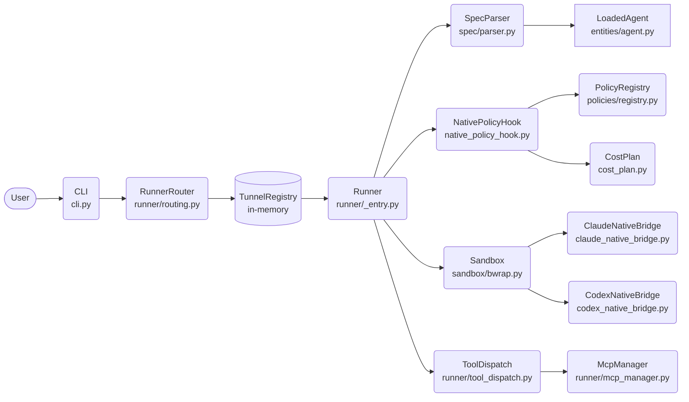
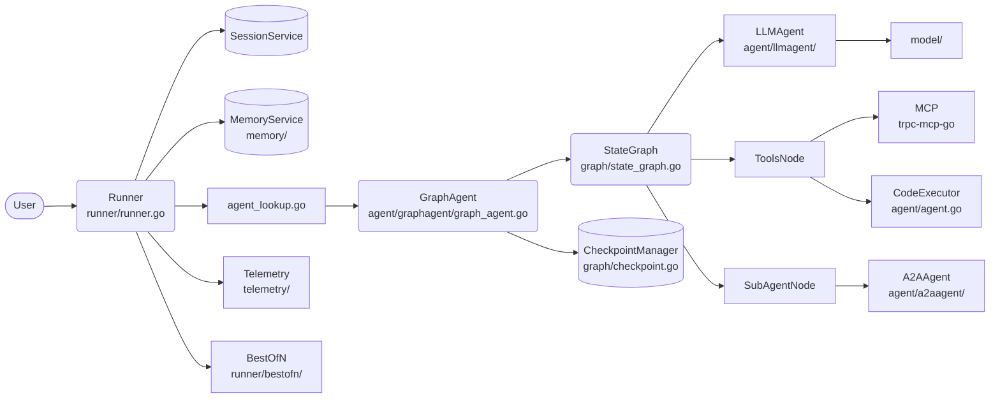
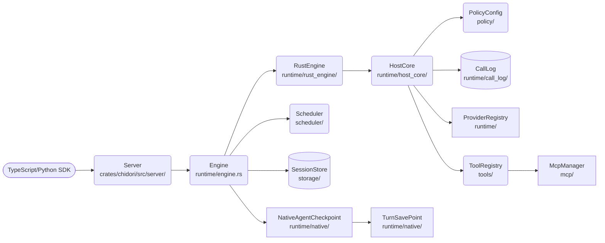
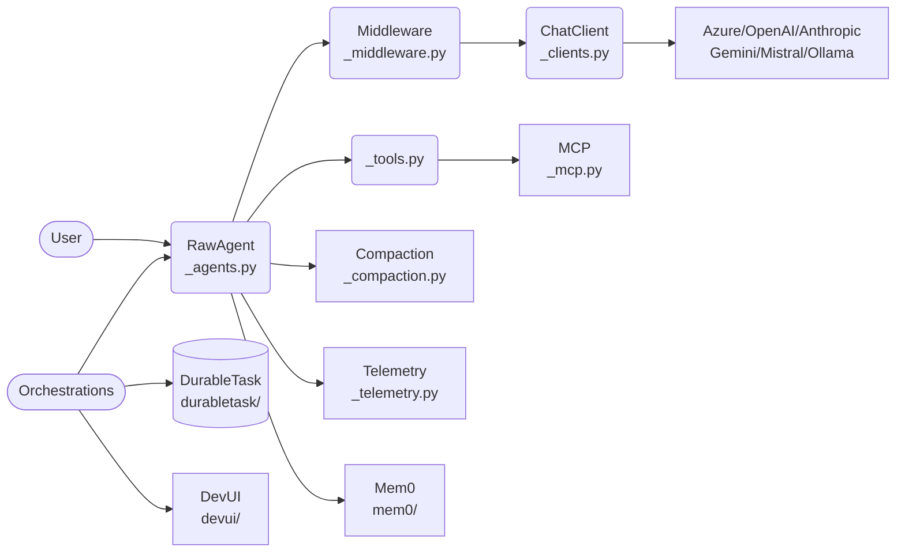

# Agentic AI Weekly Scan — 2026-06-17

## Executive Summary

- **Meta-harness và sandbox-as-first-class-citizen** nổi lên như một pattern mới: cả `omnigent` và `chidori` đều đặt execution boundary làm architectural concern trung tâm, không phải LLM orchestration.
- **Durability bằng cách ghi log toàn bộ side effect** (Chidori's host-call recording) là kỹ thuật đáng học — khác hoàn toàn checkpoint-based persistence thông thường và cho phép byte-identical replay không tốn LLM cost.
- **Go-native agent framework** (`trpc-agent-go`) thể hiện production-grade engineering hiếm gặp: graph workflows type-safe, OpenTelemetry full stack, A2A protocol, và `BestOfN` candidate selection — tất cả trong một codebase có coverage tốt.

## Table of Contents

1. [omnigent-ai/omnigent](#1-omnigent-aiomnigent) — Meta-harness cross-vendor với policy layer và OS sandbox
2. [trpc-group/trpc-agent-go](#2-trpc-grouptrpc-agent-go) — Go framework production-grade với graph workflows và full observability
3. [ThousandBirdsInc/chidori](#3-thousandbirdsinchchidori) — Rust runtime: durability qua host-call recording và byte-identical replay
4. [microsoft/agent-framework](#4-microsoftagent-framework) — Python/.NET polyglot framework với graph orchestration và DevUI time-travel

---

## 1. omnigent-ai/omnigent

**Repo:** https://github.com/omnigent-ai/omnigent  
**Created:** 2026-06-11 | **Last pushed:** 2026-06-17

### §1 — Quick Context

Meta-harness thống nhất Claude Code, Codex, Cursor, Pi, và custom agents trong một lớp policy/sandbox chung — không viết lại harness, chỉ wrap và govern chúng.

**Tech stack:** Python 3.12+ (83%), TypeScript (16%); YAML agent spec; bubblewrap sandbox (Linux) / seatbelt (macOS); `uv` package manager; `httpx` + WebSocket tunnel; MCP protocol.

**Repo health:** 2,931 stars, 338 forks, created 2026-06-11; pre-commit CI (`pyrefly.toml`); 142 open issues; Apache 2.0; active (pushed 2026-06-17).

---

### §2 — Architecture Deep-Dive

#### A. Component Inventory

| Component | File Path | Vai trò |
|---|---|---|
| `CLI` | `omnigent/cli.py` | Entry point; routing CLI commands tới server/runner |
| `RunnerRouter` | `omnigent/runner/routing.py` | Route conversations tới pinned runners qua TunnelRegistry; enforce conversation-runner affinity |
| `RoutedRunner` | `omnigent/runner/routing.py` | Dataclass: runner_id + httpx.AsyncClient qua WebSocket tunnel |
| `AgentSpec` | `omnigent/spec/omnigent.py` | Parsed agent configuration từ YAML bundle |
| `AgentEntity` | `omnigent/entities/agent.py` | Domain entity: id, name, bundle_location, version, session_id |
| `LoadedAgent` | `omnigent/entities/agent.py` | Fully loaded agent: parsed `AgentSpec` + `workdir` (extracted bundle trên disk) |
| `SessionLifecycle` | `omnigent/session_lifecycle.py` | Manage open/closed state của sessions qua labels và title markers |
| `ClaudeNativeBridge` | `omnigent/claude_native_bridge.py` | Bridge omnigent runner → Claude Code harness CLI |
| `CodexNativeBridge` | `omnigent/codex_native_bridge.py` | Bridge omnigent runner → Codex harness CLI |
| `PiNativeBridge` | `omnigent/pi_native.py` | Bridge omnigent runner → Pi harness |
| `Sandbox` | `omnigent/sandbox/bwrap.py`, `omnigent/sandbox/seatbelt.py` | OS-level process isolation per platform |
| `NativePolicyHook` | `omnigent/native_policy_hook.py` | Intercept tool calls trước khi execute; evaluate theo PolicyRegistry |
| `PolicyRegistry` | `omnigent/policies/registry.py` | Register và evaluate policy rules (token budget, command whitelist) |
| `McpManager` | `omnigent/runner/mcp_manager.py` | Manage MCP tool server registration và lifecycle |
| `ProxyMcpManager` | `omnigent/runner/proxy_mcp_manager.py` | Proxy layer composing multiple MCP servers |
| `ToolDispatch` | `omnigent/runner/tool_dispatch.py` | Dispatch tool calls tới registered handlers |
| `CostPlan` | `omnigent/cost_plan.py` | Token spend caps và cost advisory tracking |
| `SpecParser` | `omnigent/spec/parser.py` | Parse YAML agent bundle thành `AgentSpec` |
| `SpecValidator` | `omnigent/spec/validator.py` | Validate agent spec trước khi load |
| `ModelCatalog` | `omnigent/model_catalog.py` | Catalog các models được phép sử dụng |

#### B. Control Flow — Hierarchical (Supervisor → Workers)

1. User gửi message → `CLI` (`omnigent/cli.py`) hoặc web UI → `RunnerRouter.client_for_conversation(conversation_id, harness)` xác định runner phù hợp qua `TunnelRegistry`
2. `RunnerRouter` trả `RoutedRunner` với pinned `runner_id` và `httpx.AsyncClient` qua WebSocket tunnel — enforce conversation-runner affinity
3. Runner nhận request → `SpecParser` + `SpecValidator` load `LoadedAgent` (extract bundle từ `bundle_location` → `workdir`)
4. Request đi qua `NativePolicyHook` → `PolicyRegistry` evaluate: check token budget (`CostPlan`), command whitelist; block nếu vi phạm
5. `Sandbox` (bubblewrap/Linux hoặc seatbelt/macOS) isolate process → `ClaudeNativeBridge` / `CodexNativeBridge` / `PiNativeBridge` forward tới harness CLI tương ứng
6. Tool calls từ harness đi qua `ToolDispatch` → `McpManager` / `ProxyMcpManager`; response events stream về; `SessionLifecycle` mark closed khi done

#### C. State & Data Flow

- **Message format:** Typed Python dataclasses trong `omnigent/entities/` (`conversation.py`, `session_resources.py`)
- **State storage:** `ConversationStore` (inferred từ `entities/conversation.py`) — likely SQLite; `TunnelRegistry` in-memory với runner affinity
- **Context window management:** Không xác định từ code — có thể delegate hoàn toàn tới harness native (Claude Code, Codex)

#### D. Tool / Capability Integration

- **MCP protocol native:** `McpManager` (`omnigent/runner/mcp_manager.py`) + `ProxyMcpManager` để compose nhiều MCP servers
- **Tool dispatch:** `ToolDispatch` (`omnigent/runner/tool_dispatch.py`)
- **Validation:** `NativePolicyHook` intercept trước dispatch → policy rules từ `PolicyRegistry` (built-ins trong `omnigent/policies/builtins/`)
- **Sandbox:** Tất cả execution trong OS sandbox — không có escape path

#### E. Memory Architecture

Không xác định rõ long-term memory mechanism từ code được fetch — `SessionLifecycle` chỉ track open/closed state, không store conversation history.

#### F. Model Orchestration

- `ModelCatalog` (`omnigent/model_catalog.py`) + `ModelOverride` (`omnigent/model_override.py`) — centralized model management
- Supervisor agent (ví dụ "Polly") delegate tới sub-agents chạy trong parallel git worktrees
- `ReasoningEffort` (`omnigent/reasoning_effort.py`) — có thể điều chỉnh effort per agent type

#### G. Observability & Eval

- `cli_diagnostics.py` — CLI-level diagnostics
- Không thấy OpenTelemetry integration trong code được fetch
- Pre-commit hooks (`pyrefly` type checker, `.pre-commit-config.yaml`)
- `update_check.py` — version management

#### H. Extension Points

- **YAML agent spec** (`omnigent/spec/AGENTSPEC.md`) — language-neutral contract cho portable agents
- `harness_aliases.py` — alias mapping tới custom harnesses
- `omnigent/policies/function.py` — custom policy functions
- `ap-web/` — web UI component (TypeScript)

---

### §3 — Architecture Diagram

---

### §4 — Verdict

**Điểm novel:** Concept "meta-harness as policy boundary" là fresh — thay vì build agent framework mới, omnigent govern các framework hiện có (Claude Code, Codex) mà không đụng tới internal của chúng. YAML agent spec như portable contract (language-neutral) cho phép bundle agent một lần, chạy trên nhiều harnesses là design choice cụ thể và có value.

**Red flags / Limitations:**
- 142 open issues với repo chỉ 6 ngày tuổi là dấu hiệu đáng chú ý (có thể do launch rush)
- Context window management không rõ — delegate hoàn toàn tới harness native có thể gây inconsistency khi switch harnesses
- `session_lifecycle.py` chỉ 69 LOC cho task quan trọng — có thể undersized

**Open questions:**
- `AgentSpec` YAML format có portable thực sự không hay có harness-specific fields ẩn?
- `ProxyMcpManager` compose MCP servers như thế nào khi tool name collision?
- `TunnelRegistry` persistence — nếu server restart thì runner affinity có bị mất không?

---

## 2. trpc-group/trpc-agent-go

**Repo:** https://github.com/trpc-group/trpc-agent-go  
**Created:** 2025-05-14 | **Last pushed:** 2026-06-17

### §1 — Quick Context

Go framework production-grade cho AI agent systems: graph workflows type-safe, persistent memory, MCP, A2A protocol, AG-UI streaming, và OpenTelemetry full stack.

**Tech stack:** Go 1.21+; OpenAI SDK (`openai-go v1.12.0`); `trpc-a2a-go`; `trpc-mcp-go`; Uber Zap (logging); OpenTelemetry (metrics + tracing); Tencent COS (cloud storage); Redis.

**Repo health:** 1,367 stars, created 2025-05-14, pushed 2026-06-17; ~80+ test files với comprehensive coverage; Apache 2.0.

---

### §2 — Architecture Deep-Dive

#### A. Component Inventory

| Component | File Path | Vai trò |
|---|---|---|
| `Agent` interface | `agent/agent.go` | Contract: `Run(ctx, invocation) → events channel`, `Tools()`, `Info()`, `SubAgents()` |
| `Runner` interface | `runner/runner.go` | Orchestrate agent lifecycle: `Run(ctx, userID, sessionID, message) → events` |
| `ManagedRunner` | `runner/runner.go` | Extends Runner: `Cancel(requestID)`, `RunStatus(requestID)` |
| `SteerableRunner` | `runner/runner.go` | Extends ManagedRunner: `EnqueueUserMessage()` cho multi-turn steering |
| `runner` struct | `runner/runner.go` | Implementation: agents map, agentFactories, sessionService, memoryService, evolutionService, pluginManager |
| `GraphAgent` | `agent/graphagent/graph_agent.go` | Execute graph-based workflows: `Run()`, `TimeTravel()`, `createInitialState()` |
| `StateGraph` | `graph/state_graph.go` | Fluent builder: `AddNode()`, `AddLLMNode()`, `AddConditionalEdges()`, `AddJoinEdge()` |
| `LLMAgent` | `agent/llmagent/` | Wrap chat-completion model làm Agent |
| `ChainAgent` | `agent/chainagent/` | Sequential sub-agent execution |
| `ParallelAgent` | `agent/parallelagent/` | Concurrent execution với result merging |
| `CycleAgent` | `agent/cycleagent/` | Iterative ReAct-style loop tới termination |
| `A2AAgent` | `agent/a2aagent/` | Cross-runtime agent-to-agent protocol |
| `Memory` (service) | `memory/` | In-memory + Redis backends; CRUD + semantic search |
| `Knowledge` | `knowledge/` | RAG capabilities (document retrieval) |
| `Telemetry` | `telemetry/` | OpenTelemetry instrumentation across all layers |
| `Evaluation` | `evaluation/` | Benchmarking với pluggable metrics |
| `Skill` | `skill/` | Reusable workflows từ SKILL.md spec |
| `Artifact` (service) | `artifact/` | Store versioned outputs (reports, images) |
| `CheckpointManager` | `graph/checkpoint.go` | Persist và restore graph execution state |
| `TimeTravel` | `graph/time_travel.go` + `GraphAgent.TimeTravel()` | Replay state từ checkpoint |
| `BestOfN` | `runner/bestofn/` | Run N candidate agents, select best response |

#### B. Control Flow — State Machine / Graph (LangGraph-style)

1. `runner.Run(ctx, userID, sessionID, message)` → create/resume session qua `SessionService`; load long-term context qua `MemoryService`
2. `agent_lookup.go` resolve tên agent → dispatch tới `GraphAgent` (hoặc `LLMAgent`/`ChainAgent`/`ParallelAgent` tùy loại)
3. `GraphAgent.createInitialState()` khởi tạo typed state từ `StateGraph` schema; `StateGraph` executor bắt đầu từ entry node
4. `AddLLMNode` node gọi `model.Model` → nhận response; nếu có tool calls → `AddConditionalEdges` / `AddToolsConditionalEdges` route tới `ToolsNode`
5. `ToolsNode` execute tools: function tools, MCP tools (`trpc-mcp-go`), web search, code execution qua `CodeExecutor`; results append vào graph state
6. `AddJoinEdge` synchronize parallel branches khi cần barrier; events stream về Runner qua Go channel
7. `Telemetry` emit OpenTelemetry spans tại mỗi node; `ArtifactService` store versioned outputs; `CheckpointManager` save state sau mỗi node

#### C. State & Data Flow

- **Message format:** Typed Go structs (`model.Message`); graph state dùng generic `StateSchema` với type-safe access
- **State storage:** `SessionService` (in-memory / Redis); `MemoryService` (Redis cho long-term); `Artifact` store (cloud storage via Tencent COS)
- **Context window management:** `ralph_loop.go` trong runner/ — inferred là summarization loop; `Memory` service với semantic search cho RAG-based retrieval

#### D. Tool / Capability Integration

- **Function tools:** Bất kỳ Go function nào wrap như `tool.Tool`
- **MCP protocol:** Native integration qua `trpc-mcp-go`
- **A2A protocol:** `trpc-a2a-go` cho cross-runtime (Go ↔ Python) communication
- **Code execution:** `CodeExecutor` interface trong `agent/agent.go` — secure sandboxed
- **Agent-as-tool:** `SubAgents()` method trên `Agent` interface cho agent composition

#### E. Memory Architecture

- **Short-term:** Session state trong runner (in-memory `runHandle`)
- **Long-term:** `MemoryService` với Redis backend; CRUD + search + semantic operations
- **RAG:** `knowledge/` package — document retrieval cho agent context
- **Retrieval:** Semantic search trong MemoryService (vector backend không xác định từ go.mod)

#### F. Model Orchestration

- `model/` package abstract multiple providers: OpenAI, DeepSeek (từ go.mod)
- `AddLLMNode()` trong `StateGraph` assign model per node — planner node có thể dùng frontier, tool node dùng model nhỏ hơn
- `BestOfN` (`runner/bestofn/`) — parallel N candidates, `CandidateSelector` chọn best theo metrics
- `ParallelAgent` (`agent/parallelagent/`) — concurrent execution với merge

#### G. Observability & Eval

- **OpenTelemetry full stack** (`telemetry/`): metrics + distributed tracing; Langfuse integration trong examples
- **Evaluation framework** (`evaluation/`): benchmarking với pluggable metrics
- **TimeTravel** (`graph/time_travel.go`): replay graph state từ checkpoint — có thể dùng cho debugging
- **Diagnostics:** `runner/diagnostics.go`

#### H. Extension Points

- Implement `Agent` interface → custom agent type
- `Plugin` system (`agent/plugins.go`, `agent/run_with_plugins.go`)
- Custom `CandidateSelector` (`runner/candidate_selector.go`)
- AG-UI server, A2A server, Gateway server trong `server/`

---

### §3 — Architecture Diagram

---

### §4 — Verdict

**Điểm novel:** `BestOfN` candidate selection (`runner/bestofn/`) — chạy nhiều agents song song rồi chọn best theo metric là pattern hiếm thấy trong Go frameworks. `SteerableRunner.EnqueueUserMessage()` cho phép steer agent mid-execution mà không cancel run, là design choice production-grade. `AddJoinEdge()` trong StateGraph implement barrier synchronization type-safe là điểm cụ thể đáng học.

**Red flags / Limitations:**
- `go.mod` chỉ có `openai-go` — không có Anthropic hay Google SDK native, dependency sâu vào OpenAI-compatible API
- `ralph_loop.go` tên không rõ nghĩa — khó đoán đây là summarization loop hay retry logic
- Tencent COS dependency gợi ý internal Tencent origin → community adoption bên ngoài Tencent chưa biết

**Open questions:**
- `CandidateSelector` (`runner/candidate_selector.go`) dùng metrics gì để chọn best candidate?
- `evolution.Service` trong runner struct là gì? Không thấy `evolution/` trong directory listing
- A2A protocol có bidirectional streaming không hay chỉ request-response?

---

## 3. ThousandBirdsInc/chidori

**Repo:** https://github.com/ThousandBirdsInc/chidori  
**Created:** 2023-07-19 | **Last pushed:** 2026-06-17 | **Latest release:** v3.3.0 (June 2026)

### §1 — Quick Context

Rust runtime đặt durability boundary giữa agent code và external world: mọi side effect đi qua một "host call" layer được record — cho phép byte-identical replay không tốn LLM cost.

**Tech stack:** Rust 96.4% (single binary); pure-Rust JavaScript engine (không dùng V8/Node); Python + TypeScript SDKs qua HTTP (không có native bindings); OpenTelemetry.

**Repo health:** 1,349 stars, 55 forks; v3.3.0 June 2026 (16 releases); 246 commits; 1 open issue; Apache 2.0.

---

### §2 — Architecture Deep-Dive

#### A. Component Inventory

| Component | File Path | Vai trò |
|---|---|---|
| `Engine` | `crates/chidori/src/runtime/engine.rs` | Core executor: run/stream/pause/replay/branch; builder pattern `with_*()` |
| `HostCore` | `crates/chidori/src/runtime/host_core/` | Intercept layer: tất cả side effects đi qua đây trước khi execute |
| `HostBranch` | `crates/chidori/src/runtime/host_branch/` | Branch management cho parallel execution paths |
| `CallLog` + `CallRecord` | `crates/chidori/src/runtime/call_log/` | Immutable log của tất cả host calls — foundation của replay |
| `RustEngine` | `crates/chidori/src/runtime/rust_engine/` | Pure-Rust JavaScript runtime (không có V8/Node dependency) |
| `RuntimeContext` | `crates/chidori/src/runtime/context/` | Execution context per run |
| `NativeAgentRunner` | `crates/chidori/src/runtime/native/` | Runner cho native Rust agents |
| `NativeAgentCheckpoint` + `TurnSavePoint` | `crates/chidori/src/runtime/native/` | Checkpoint và resume sau mỗi turn |
| `SavePointHook` | `crates/chidori/src/runtime/native/` | Hook callback khi save point được tạo |
| `ProviderRegistry` | `crates/chidori/src/runtime/` | LLM provider abstraction: `LlmRequest`, `LlmResponse`, `Message`, `TokenSink` |
| `ToolRegistry` + `ToolDef` + `ToolParam` | `crates/chidori/src/tools/` | Tool definitions, `ToolBackend`, `NativeToolHandler` |
| `PolicyConfig` + `PolicyRule` + `Decision` | `crates/chidori/src/policy/` | Permission enforcement trước khi execute side effects |
| `McpManager` | `crates/chidori/src/mcp/` | MCP protocol integration |
| `Scheduler` | `crates/chidori/src/scheduler/` | Async task scheduling |
| `SessionStore` + `StoredSession` | `crates/chidori/src/storage/` | Session persistence |
| `Server` | `crates/chidori/src/server/` | HTTP session-based API |
| `TemplateEngine` | `crates/chidori/src/runtime/template/` | Dynamic prompt templating |
| `PromptCache` | `crates/chidori/src/runtime/prompt_cache/` | Structural caching cho stable prompt prefixes |

#### B. Control Flow — Event-Driven với Durability Boundary

1. TypeScript/Python agent gọi HTTP API tới `Server` (`crates/chidori/src/server/`) → create session trong `SessionStore`
2. `Engine` load agent code TypeScript → `RustEngine` (pure-Rust JS runtime) thực thi code trong sandbox
3. Mỗi khi agent code thực hiện side effect (LLM call, tool call, HTTP request), call đi qua `HostCore` — được record vào `CallLog` TRƯỚC khi execute
4. `HostCore` check `PolicyConfig` → `Decision` (approve/deny/require_approval); nếu là replay, serve kết quả từ `CallLog` thay vì re-execute tốn kém
5. LLM response có tool calls → `ToolRegistry` route tới `ToolBackend` phù hợp → `NativeToolHandler` execute; results append vào `CallLog`
6. `Scheduler` manage async tasks; sau mỗi turn `TurnSavePoint` và `SavePointHook` checkpoint state tới `persist_base/.chidori/runs/`
7. Crash recovery: `Engine.run_replay_pausable_with_host_promises_and_vfs_preserving_run_id()` reload `CallLog` → replay tới điểm dừng → byte-identical state

#### C. State & Data Flow

- **Message format:** Typed Rust structs: `LlmRequest`, `LlmResponse`, `Message`, `ToolCall`, `ToolSchema`
- **State storage:** `persist_base/.chidori/runs/` — immutable call log files trên disk; in-memory `SessionStore` cho active sessions
- **Context window management:** `prompt_cache` module cho structural caching của stable prefixes; `memory` module trong runtime (detail không rõ từ code)

#### D. Tool / Capability Integration

- **Tool definitions:** `ToolRegistry`, `ToolDef`, `ToolParam`, `ToolBackend` — typed Rust structs
- **Native tools:** `NativeToolHandler` cho Rust-native tool implementations
- **MCP protocol:** `McpManager` (`crates/chidori/src/mcp/`)
- **Validation:** `PolicyConfig` → `PolicyRule` → `Decision` enforced tại `HostCore` — không thể bypass vì tất cả side effects đều phải qua layer này

#### E. Memory Architecture

- **Short-term:** `RuntimeContext` trong mỗi run
- **Long-term:** `memory` module trong runtime (nội dung không xác định đầy đủ từ code)
- **Replay-as-memory:** `CallLog` là implicit memory — tất cả LLM calls được cached, không cần re-query
- `mem_guard` module cho memory safety boundary

#### F. Model Orchestration

- `ProviderRegistry` abstract LLM providers: `ContentBlock`, `LlmRequest`, `LlmResponse`
- Agent code viết bằng TypeScript, chạy trong `RustEngine` — model selection trong agent code
- `PromptCache` auto-apply structural caching cho stable prefixes — giảm latency và cost
- Không có explicit multi-model orchestration pattern trong code được fetch

#### G. Observability & Eval

- **OpenTelemetry:** `otel` module trong `crates/chidori/src/runtime/`
- **Cost tracking:** `cost` module trong runtime
- **Replay capability built-in:** `CallLog` cho phép replay bất kỳ run nào — không cần external tracing
- `Engine.check()` — validate TypeScript agent code mà không execute

#### H. Extension Points

- Agents viết bằng TypeScript hoặc Python qua HTTP SDK (không cần biết Rust)
- `recipes` module (`crates/chidori/src/recipes/`) — preset agent patterns
- `PolicyConfig` + `PolicyRule` — custom permission rules
- `SavePointHook` — callback khi checkpoint được tạo
- `ToolBackend` — custom tool backends

---

### §3 — Architecture Diagram

---

### §4 — Verdict

**Điểm novel:** "Durability through call log, not checkpoint" là design insight cụ thể: thay vì snapshot toàn bộ memory state, Chidori ghi log mọi side effect theo thứ tự — replay chỉ cần re-execute agent code với log làm cache. Kết quả: byte-identical replay zero LLM cost, human-in-the-loop pause, và time-travel debugging đều là consequences của một design decision duy nhất. Pure-Rust JavaScript engine (không có V8/Node) là kỹ thuật exceptional — enable single binary distribution với JS agent support.

**Red flags / Limitations:**
- Agent phải viết bằng TypeScript — đây là constraint lớn cho teams không dùng JS ecosystem
- `CallLog` có thể grow indefinitely cho long-running agents — compaction strategy không rõ
- HTTP-based SDKs có latency overhead so với native bindings; không suitable cho high-throughput scenarios

**Open questions:**
- `HostBranch` manage parallel execution như thế nào khi hai branches có conflicting tool calls?
- `acp` module (Agent Communication Protocol) khác gì so với A2A standard?
- Với long-running agents (days/weeks), `CallLog` được rotate như thế nào?

---

## 4. microsoft/agent-framework

**Repo:** https://github.com/microsoft/agent-framework  
**Created:** 2025-04-28 | **Last pushed:** 2026-06-17

### §1 — Quick Context

Framework Python/.NET polyglot cho production agents với graph-based multi-agent orchestration, Durable Task persistence, time-travel debugging, và hỗ trợ hầu hết LLM providers.

**Tech stack:** Python 3.x + .NET/C#; Azure OpenAI, OpenAI, Anthropic Claude, Gemini, Mistral, Ollama; Durable Task (workflow persistence); OpenTelemetry; Mem0; Redis; WebAssembly (Hyperlight).

**Repo health:** 11,403 stars, created 2025-04-28, pushed 2026-06-17; comprehensive test suite; MIT license; 33 Python packages.

---

### §2 — Architecture Deep-Dive

#### A. Component Inventory

| Component | File Path | Vai trò |
|---|---|---|
| `SupportsAgentRun` Protocol | `python/packages/core/agent_framework/_agents.py` | Minimal interface: id, name, description, run(), create_session(), get_session() |
| `BaseAgent` | `python/packages/core/agent_framework/_agents.py` | Core agent: session management, middleware integration, `as_tool()` conversion |
| `RawAgent` | `python/packages/core/agent_framework/_agents.py` | Chat client-based agent: LLM interaction, tool invocation, streaming, MCP, compaction |
| `ChatClient` abstractions | `python/packages/core/agent_framework/_clients.py` | Uniform interface cho Azure OpenAI, OpenAI, Anthropic, Gemini, Mistral, Ollama |
| `Middleware` | `python/packages/core/agent_framework/_middleware.py` | Request/response pipeline processor |
| `Orchestrations` | `python/packages/core/agent_framework/orchestrations/` + `_workflows/` | Graph-based multi-agent: sequential, concurrent, handoff, group collaboration |
| `Telemetry` | `python/packages/core/agent_framework/_telemetry.py` + `observability.py` | OpenTelemetry distributed tracing |
| `MCP` | `python/packages/core/agent_framework/_mcp.py` | Model Context Protocol tool integration |
| `Compaction` | `python/packages/core/agent_framework/_compaction.py` | Context window compaction strategies |
| `Evaluation` | `python/packages/core/agent_framework/_evaluation.py` | Eval hooks và benchmarking |
| `Skills` | `python/packages/core/agent_framework/_skills.py` | Knowledge base từ files, inline code, class libraries |
| `Security` | `python/packages/core/agent_framework/security.py` | Security controls |
| `Sessions` | `python/packages/core/agent_framework/_sessions.py` | Session lifecycle management |
| `Tools` | `python/packages/core/agent_framework/_tools.py` | Function tools và callable wrappers |
| `DurableTask` | `python/packages/durabletask/` | Workflow persistence, restartability, checkpointing |
| `DevUI` | `python/packages/devui/` | Interactive debugging UI với time-travel |
| `Mem0` | `python/packages/mem0/` | External long-term memory integration |
| `A2A` | `python/packages/a2a/` | Agent-to-agent communication protocol |
| `AG-UI` | `python/packages/ag_ui/` | Streaming UI components |
| `Declarative` | `python/packages/declarative/` | YAML-based agent definitions |

#### B. Control Flow — Graph-based (Multi-agent Orchestration)

1. User create `RawAgent(client=ChatClient(...), instructions=..., tools=[...])` → call `agent.run(messages)`
2. `RawAgent` gửi messages tới LLM qua `ChatClient` (uniform interface) → nhận response qua `Middleware` pipeline
3. LLM response có tool calls → `Tools` module dispatch → results appended to message history; `Compaction` trim nếu context quá dài
4. Multi-agent scenario: `Orchestrations` define graph — nodes là agents (`BaseAgent` instances), edges define flow (sequential/concurrent/handoff/group)
5. `DurableTask` persist workflow graph state → support checkpoint và restart; human-in-the-loop pause points
6. `as_tool()` method cho phép wrap agent thành tool cho orchestrator agent
7. `Telemetry` emit OpenTelemetry spans tại mỗi agent call; `DevUI` intercept session cho time-travel debugging

#### C. State & Data Flow

- **Message format:** Typed Python classes trong `_types.py`
- **State storage:** `_sessions.py` cho session state; `DurableTask` cho workflow state persistence; `Mem0` cho long-term memory
- **Context window management:** `_compaction.py` — explicit compaction strategy (sliding window hoặc summarization, configurable per `RawAgent`)

#### D. Tool / Capability Integration

- **Function tools:** `_tools.py` — Python functions wrapped như callable tools
- **Agent-as-tool:** `BaseAgent.as_tool()` — agent composition
- **MCP protocol:** `_mcp.py` — MCP tool servers
- **A2A protocol:** `python/packages/a2a/` — cross-agent communication

#### E. Memory Architecture

- **Short-term:** In-session message history (managed bởi `_sessions.py`)
- **Context compaction:** `_compaction.py` — configurable strategy per agent
- **Long-term:** `Mem0` (`python/packages/mem0/`) — external memory với semantic search
- **Knowledge base:** `_skills.py` — multi-source: files, inline code, class libraries

#### F. Model Orchestration

- **Polyglot providers:** Azure OpenAI, OpenAI, Anthropic Claude, Gemini, Mistral, Ollama qua `_clients.py`
- **Per-agent model:** Mỗi agent trong Orchestration graph có thể dùng model riêng — planner dùng frontier, executor dùng cheaper
- **Hyperlight:** `python/packages/hyperlight/` — WebAssembly runtime cho sandboxed tool execution
- **Lab:** `python/packages/lab/` — reinforcement learning experiments

#### G. Observability & Eval

- **OpenTelemetry full stack:** `_telemetry.py` + `observability.py`
- **Evaluation:** `_evaluation.py` — eval hooks với pluggable metrics
- **DevUI time-travel:** `python/packages/devui/` — replay và inspect workflow state
- **Architecture Decision Records:** `docs/decisions/` — ADR pattern cho design transparency

#### H. Extension Points

- `Declarative` package (`python/packages/declarative/`) — YAML agent definitions
- Custom `Middleware` pipeline
- Any LLM provider qua `_clients.py` abstract interface
- `Hyperlight` — WASM-based sandboxed tool execution
- `Orchestrations` graph — custom workflow patterns

---

### §3 — Architecture Diagram

---

### §4 — Verdict

**Điểm novel:** `DevUI` với time-travel debugging là production engineering cụ thể — inspect và replay workflow state mà không cần re-run là differentiator so với most frameworks. `Compaction` là explicit, configurable per-agent — không ẩn trong framework như nhiều competitors. WASM-based tool execution qua `Hyperlight` là approach khác biệt cho sandboxing (so với OS-level sandbox của omnigent).

**Red flags / Limitations:**
- 33 Python packages riêng biệt có thể gây version hell trong dependency management
- Polyglot (Python + .NET) tăng surface area đáng kể — khó maintain consistency
- `_workflows/` chỉ có empty `__init__.py` trong code được fetch — có thể orchestration logic chưa mature

**Open questions:**
- `DurableTask` dùng backend nào? Azure Durable Functions hay self-hosted?
- `Hyperlight` (WASM) có support arbitrary tool code hay chỉ pre-compiled modules?
- Reinforcement learning trong `lab/` package đang research hay production-ready?

---

*Scan completed: 2026-06-17. Repos verified via WebFetch. Next scan: 2026-06-24.*
