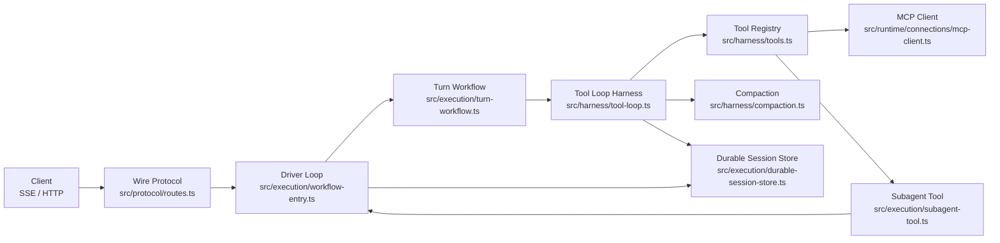
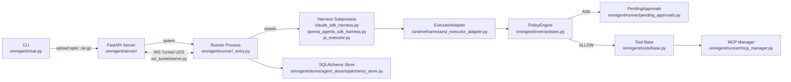
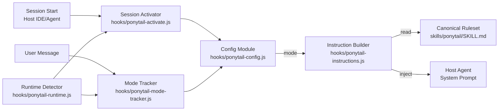

```mermaid
flowchart LR
    ExtClient["External Client"] --> Gateway["BaseGatewayComponent\ngateway/base/component.py"]
    Gateway --> A2AService["CoreA2AService\ncore_a2a/service.py"]
    A2AService -->|"JSON-RPC publish"| Broker["Solace PubSub+\nBroker"]
    Broker -->|"dedicated queue"| AgentComp["SamAgentComponent\nagent/sac/component.py"]
    AgentComp --> EventH["EventHandlers\nagent/protocol/event_handlers.py"]
    EventH --> Runner["ADK Runner\nagent/adk/runner.py"]
    Runner --> LlmAgent["AppLlmAgent\nagent/adk/app_llm_agent.py"]
    LlmAgent --> Callbacks["Callbacks\nagent/adk/callbacks.py"]
    LlmAgent --> PeerTool["PeerAgentTool\nagent/tools/peer_agent_tool.py"]
    PeerTool -->|"fire-and-forget"| Broker
    Broker -->|"peer response"| AgentComp
    AgentComp --> Gateway
```

# Agentic AI Weekly Scan — 2026-06-18

## Executive Summary

- **vercel/eve** (tạo 2026-06-16, 832★) là framework production-grade đáng chú ý nhất tuần: durable state machine 3 lớp (driver loop → turn workflow → tool loop), filesystem-as-schema design, eval framework tích hợp và OTel tracing. Stream protocol đã ở version 16 sau chỉ 2 ngày — tốc độ iteration đáng lo.
- **omnigent-ai/omnigent** (tạo 2026-06-11, 3.6K★) là meta-harness orchestrating 5 coding agents (Claude SDK, OpenAI Agents SDK, Codex, Pi, Antigravity) qua 3-tier subprocess architecture; nổi bật với policy engine 4-phase và Linux bubblewrap sandbox — engineering depth hiếm thấy ở dự án alpha.
- **SolaceLabs/solace-agent-mesh** (4.9K★, cập nhật tuần này) dùng Solace PubSub+ broker làm backbone: fire-and-forget peer tool calls với async re-injection, 2-phase embed resolution, và workflow-as-agent composition — architecture event-driven thuần khiết nhất trong tuần. **DietrichGebert/ponytail** (tạo 2026-06-12, 32K★) được include vì eval methodology phi truyền thống; cảnh báo: về bản chất là prompt injection layer, không phải agent framework.

## Table of Contents

- [1. vercel/eve](#1-verceleve)
- [2. omnigent-ai/omnigent](#2-omnigent-aiomnigent)
- [3. SolaceLabs/solace-agent-mesh](#3-solacelabssolace-agent-mesh)
- [4. DietrichGebert/ponytail](#4-dietrichgebertponytail)

---

## 1. vercel/eve

**Link:** https://github.com/vercel/eve

### §1 — Quick Context

**Pitch:** Framework TypeScript production-grade từ Vercel cho building durable, filesystem-defined AI agents với eval tích hợp.

**Tech stack:** TypeScript (ESM-only, Node.js ≥24), pnpm monorepo + Turbo, Vercel AI SDK (`ai`), `@ai-sdk/anthropic`/`openai`/`google`, Nitro runtime, `devalue` serialization. Sandbox: `@vercel/sandbox` / `microsandbox`.

**Repo health:** 832★, tạo 2026-06-16, active (Vercel org), stream protocol version 16 sau 2 ngày — có CI, có eval test suite (`e2e/`).

### §2 — Architecture Deep-Dive

**A. Component inventory**

- `Driver Loop` (`src/execution/workflow-entry.ts`) — outermost session state machine; dispatch loop on `NextDriverAction.kind`
- `Turn Workflow` (`src/execution/turn-workflow.ts`) — durable child workflow per user turn; runs `turnStep()` đến terminal action
- `Tool Loop Harness` (`src/harness/tool-loop.ts`) — leaf-level streaming model + tool execution via AI SDK `ToolLoopAgent`
- `Agent Graph Resolver` (`src/runtime/resolve-agent-graph.ts`) — compile manifest → `ResolvedAgentGraphBundle` (Map của `ResolvedRuntimeAgentNode`)
- `Discovery` (`src/discover/discover-agent.ts`) — filesystem scan: `agent/tools/*.ts`, `agent/skills/*.ts`, `agent/channels/*.ts`, `agent/connections/*.ts`, `agent/hooks/*.ts`, `agent/schedules/*.ts`
- `Compiler` (`src/compiler/compile-agent.ts`) — discovery → `CompiledAgentManifest` + `CompiledModuleMap`
- `Tool Registry` (`src/harness/tools.ts`) — assembles authored tools + subagent tools + MCP tools + OpenAPI tools theo 3 scope: step / turn / session
- `MCP Client` (`src/runtime/connections/mcp-client.ts`) — streamable-HTTP → SSE fallback, per-request bearer token, tool filtering
- `Subagent Tool` (`src/execution/subagent-tool.ts`) — child agent invocation; parent-continuation token `${parentSessionId}:${callId}`; HITL proxying qua `src/execution/subagent-hitl-proxy.ts`
- `Durable Session Store` (`src/execution/durable-session-store.ts`) — serialized với `devalue`; version field + `migrateDurableSessionSnapshot()`
- `Compaction` (`src/harness/compaction.ts`) — sliding window; trigger tại 90% token budget; model-generated summary
- `Context Container` (`src/context/container.ts`) — Node.js `AsyncLocalStorage`, durable vs virtual values
- `Wire Protocol` (`src/protocol/message.ts`, `src/protocol/routes.ts`) — NDJSON streaming, `x-eve-stream-version: 16`, 20+ event types
- `OTel Integration` (`src/harness/otel-integration.ts`) — `@ai-sdk/otel`, span context trong `TURN_TRACE_STATE_KEY`
- `Eval Framework` (`src/evals/define-eval.ts`, `src/evals/judge.ts`, `src/evals/runner/`) — file-per-case model, judge model tách biệt, 4-tier pyramid

**B. Control flow — Durable State Machine + Tool Loop (3 lớp)**

1. HTTP POST `POST /eve/v1/session/:sessionId` → Driver Loop (`workflow-entry.ts`) nhận message
2. Driver Loop dispatch `NextDriverAction` → start Turn Workflow (`turn-workflow.ts`) như child workflow
3. Turn Workflow chạy `turnStep()` → Tool Loop Harness (`tool-loop.ts`) stream model call
4. LLM trả về tool calls → Tool Registry resolve tool, thực thi; nếu subagent: Subagent Tool mint continuation token, spawn child workflow
5. Tool results inject lại context; turn continues hoặc terminates → `done` | `park` | `dispatch-code-mode-runtime-actions`
6. Driver Loop nhận terminal action → serialize session qua Durable Session Store, stream events qua NDJSON về client

**C. State & data flow**

- **Message format:** NDJSON streaming, `x-eve-stream-version: 16`; typed discriminated union `NextDriverAction`
- **State storage:** Durable session snapshots serialized bằng `devalue` (preserves URL, Buffer, Date, Map, Set) vào workflow step results; legacy path đọc từ `"eve.session"` stream với 10s timeout
- **Context window management:** Compaction tại 90% threshold; sliding window giữ recent N messages + model-summary của phần cũ; 2-phase retry nếu first compaction vẫn over budget

**D. Tool integration**

- Authored tools: `.ts` files trong `agent/tools/`, Zod schemas, 3-scope (step/turn/session)
- MCP: `McpConnectionClient` streamable-HTTP → SSE fallback; tool filtering; per-request bearer
- OpenAPI: `OpenApiConnectionClient` maps `operationId` → tool; path/query/body auto-wire
- Provider sentinels: framework injects web_search, code execution từ model provider; silent drop nếu provider không support
- Tool Auth: `requireAuth()` → `AuthorizationSignal` → driver parks → OAuth callback → resume

**E. Memory architecture**

Không có vector store. Memory = conversation history + model-generated summary. Compaction trigger: `JSON.stringify().length / 4 > 0.9 × contextWindow`. Summary instruction: preserve goal, decisions, discoveries, open work. Reasoning blocks bị strip trước khi summarize.

**F. Model orchestration**

Multi-model per agent config: `@ai-sdk/anthropic`, `@ai-sdk/openai`, `@ai-sdk/google`. Prompt cache: breakpoints tại end-of-system-prompt, end-of-tool-defs, last assistant+user. Anthropic: `cacheControl: "ephemeral"`. Error recovery 2-stage: drop unsupported tools → reissue empty response.

**G. Observability & eval**

OTel qua `@ai-sdk/otel`; user-authored `agent/instrumentation.ts`. Eval framework: `defineEval()` file-per-case; `t.send()`, `t.calledTool()`, `t.check()`; judge model tách biệt; autoevals (factuality, summarization, closed QA, SQL).

**H. Extension points**

File convention hoàn toàn: `agent/tools/`, `agent/skills/`, `agent/channels/`, `agent/connections/`, `agent/hooks/`, `agent/schedules/`, `agent/sandbox/`, `agent/instrumentation.ts`. Subagent = subdirectory. Remote agent = HTTP POST protocol.

### §3 — Architecture Diagram

### §4 — Verdict

**Điểm novel:** Filesystem-as-schema làm configuration surface — không YAML, không JSON config, directory layout IS the spec. Driver loop dispatch qua closed discriminated union `NextDriverAction` enforces explicit versioning. HITL proxying qua toàn bộ subagent tree transparent — parent thấy 1 `input.requested` bất kể depth. `devalue` serialization preserve complex types qua durable storage.

**Red flags:** Node.js 24+ hard requirement loại phần lớn existing deployments. Stream protocol version 16 sau 2 ngày gợi ý breaking changes liên tục. Token estimation `JSON.stringify.length / 4` là heuristic thô. Không có persistent storage ngoài workflow steps.

**Open questions:** Nitro runtime có thể swap out không, hay đây là hard dependency? Closed `NextDriverAction` union có extension path nào cho third-party runtimes không? `devalue` serialization có versioned migration path khi schema thay đổi không?

---

## 2. omnigent-ai/omnigent

**Link:** https://github.com/omnigent-ai/omnigent

### §1 — Quick Context

**Pitch:** Meta-harness orchestrating Claude Code, OpenAI Agents SDK, Codex, Pi và Antigravity qua unified 3-tier subprocess architecture với policy engine.

**Tech stack:** Python 3.12+, Apache 2.0, FastAPI, SQLAlchemy (SQLite/PostgreSQL), `anthropic-agents-sdk ≥0.1.62`, `openai-agents`, `@earendil-works/pi-coding-agent` (Node.js), LiteLLM, httpx UDS. Optional: Modal/Daytona/E2B/OpenShell sandbox. Entry: `omnigent`/`omni` CLI → `omnigent.cli:main`.

**Repo health:** 3.6K★ (tăng nhanh), tạo 2026-06-11, alpha status (Development Status 3), Databricks authorship, CI present.

### §2 — Architecture Deep-Dive

**A. Component inventory**

- `Chat Orchestrator` (`omnigent/chat.py`) — top-level `omnigent chat`; dispatch daemon / ephemeral / remote server modes
- `YAML Loader` (`omnigent/inner/loader.py`) — YAML → `AgentDef`; dispatch harness type từ config
- `ExecutorAdapter` (`omnigent/runtime/harnesses/_executor_adapter.py`) — normalizes tất cả 5 harness types thành SSE event stream; stable callback bridges
- `Workflow` (`omnigent/runtime/workflow.py`) — per-turn loop: env-var builders cho 5 harnesses, auth resolution, history loading, compaction
- `PolicyEngine` (`omnigent/inner/policies.py`) — `FunctionPolicy` + `PromptPolicy`; max-action semantics (DENY > ASK > ALLOW); 4 evaluation phases: request / tool_call / tool_result / response
- `RuntimeCaps` (`omnigent/runtime/caps.py`) — operator-level caps: mandatory timeout, forced sandboxing, server-wide policy injection
- `BwrapSandbox` (`omnigent/inner/bwrap_sandbox.py`) — Linux bubblewrap + seccomp; whitelist `AF_UNIX/INET/INET6` only
- `EgressRules` (`omnigent/inner/egress/rules.py`) — default-deny allowlist; DNS-safe character validation
- `MCP Manager` (`omnigent/runner/mcp_manager.py`) — LRU eviction (8 specs), namespace prefixing `{server_name}__{tool_name}`, circuit breaker
- `PendingApprovals` (`omnigent/runner/pending_approvals.py`) — Future-based approval registry, 120s timeout, idempotent resolution
- `WS Tunnel` (`omnigent/runner/transports/ws_tunnel/serve.py`) — ASGI bridge qua RequestFrame/PingFrame/RequestCancelFrame
- `SQLAlchemy Store` (`omnigent/stores/agent_store/sqlalchemy_store.py`) — agent/session persistence; bounded history load by compaction cursor
- `Claude Gateway Shim` (`omnigent/inner/claude_gateway_shim.py`) — local reverse proxy fix Databricks ↔ Claude CLI compatibility (patches `thinking.display`)
- `Pi Executor` (`omnigent/inner/pi_executor.py`) — spawns Node.js Pi subprocess; bridges Python tools qua dynamically-generated JavaScript over TCP
- `Tool Base` (`omnigent/tools/base.py`) — abstract `Tool`: `name()`, `description()`, `get_schema()`, `invoke()`

**B. Control flow — Three-tier Supervisor / Subprocess**

1. CLI `omnigent chat` (`chat.py`) → resolve target (remote URL / daemon / ephemeral) → upload agent spec bundle `.tar.gz` → `POST /v1/agents`
2. Server tạo session → `POST /v1/sessions` → spawn runner process out-of-process (`runner/_entry.py`)
3. Runner connect về server qua WebSocket tunnel (UDS bridge, `ws_tunnel/serve.py`) → resolve harness type → spawn harness subprocess (FastAPI, UDS)
4. `ExecutorAdapter` wrap inner executor → normalize events thành SSE stream
5. Inner executor (e.g. `ClaudeSDKExecutor`) run agent turn → tool call → PolicyEngine evaluate (ALLOW / ASK / DENY)
6. ASK → PendingApprovals register Future (120s timeout) → human approval via API → resume; ALLOW → dispatch tool; DENY → reject

**C. State & data flow**

- **Message format:** SSE event stream từ ExecutorAdapter; `RequestFrame`/`PingFrame` over WebSocket
- **State storage:** SQLAlchemy (SQLite dev, PostgreSQL prod); bounded history load kể từ compaction cursor; session compaction tạo LLM summary layer
- **Context window:** Compaction keyed by `response_id` (safe replay); bounded O(items-since-compaction)

**D. Tool integration**

- Python tools: dotted import path trong AgentSpec YAML → `importlib.import_module()` → schema từ function signatures
- MCP: `McpServerConnection` (`omnigent/tools/mcp.py`) — stdio/SSE/Streamable-HTTP, TTL cache, circuit breaker, reconnect; namespace-prefix `{server}__{tool}`
- Pi tools: Python tools → dynamically-generated JS extension (TCP callback) → `pi.registerTool()` — cross-language tool bridging không cần fixed protocol SDK
- Sub-agents as tools: nested `AgentSpec.sub_agents` expose child agents như callable `Tool`; `SysAgentGetTool`/`SysAgentListTool` (`omnigent/tools/builtins/agents.py`) cho runtime discovery

**E. Memory architecture**

Short-term: in-memory per runner (`_AgentsSessionState`). Long-term: SQLAlchemy store với compaction cursor. Compaction: LLM-generated summary keyed by `response_id` cho safe replay. `_SanitizingSession` strip provider-specific fields during replay.

**F. Model orchestration**

LLM router (`omnigent/llms/client.py`): OpenAI Responses API → Chat Completions fallback. Adapters: OpenAI, Anthropic/Claude, Bedrock (`omnigent/llms/adapters/bedrock.py`), Databricks (`omnigent/llms/adapters/databricks.py`). Retry: exponential backoff (`omnigent/runtime/llm_retry.py`).

**G. Observability & eval**

Không có OpenTelemetry tìm thấy trong code. Custom SDK client (`sdks/python-client/omnigent_client/`) với SSE streaming. Pre-commit lint hooks (`dev/__init__.py`).

**H. Extension points**

New harness: thêm env-var builder trong `workflow.py` + `*_harness.py` subprocess entry. Custom tools: subclass `Tool`, declare dotted path trong agent YAML. Cloud sandboxes: Modal/Daytona/E2B/OpenShell là optional extras trong `pyproject.toml`. LLM providers: thêm adapter dưới `omnigent/llms/adapters/`.

### §3 — Architecture Diagram

### §4 — Verdict

**Điểm novel:** Pi tool bridge qua dynamic JS codegen — Python tools exported sang Node.js agent bằng cách generate JavaScript TCP callbacks at runtime, không cần SDK cố định. `Claude Gateway Shim` như in-process reverse proxy để fix API incompatibility — version-agnostic compatibility layer. Policy engine 4-phase với `PromptPolicy` (LLM-evaluated, fail-closed) là pattern mạnh cho production compliance. Dual-guardian orphan detection chống PID reuse.

**Red flags:** Alpha status tự khai báo. Bubblewrap sandbox Linux-only, silent degradation trên macOS/Windows. Pi executor phụ thuộc Node.js package external có RPC contract không stable. 120s hard timeout cho human approvals không configurable. MCP pool limits hard-coded (8 specs runner / 32 agents server).

**Open questions:** `antigravity` harness là gì — không có `*_harness.py` file tương ứng tìm thấy? Claude gateway shim tương thích Claude CLI versions nào sau 2.1.168? Policy engine có audit log không?

---

## 3. SolaceLabs/solace-agent-mesh

**Link:** https://github.com/SolaceLabs/solace-agent-mesh

### §1 — Quick Context

**Pitch:** Framework event-driven orchestrating multi-agent AI qua Solace PubSub+ message broker — agents không bao giờ gọi nhau trực tiếp.

**Tech stack:** Python, Google ADK (`google-adk`), Solace AI Connector (SAC), Solace PubSub+ (AMQP/SMF), litellm, FastAPI, testcontainers (dev). Enterprise overlay tùy chọn.

**Repo health:** 4.9K★, tạo 2025-01-10, active updates tuần này, CI có (`evaluation/` pytest harness).

### §2 — Architecture Deep-Dive

**A. Component inventory**

- `SamAgentComponent` (`src/solace_agent_mesh/agent/sac/component.py`) — core agent host; SAC ↔ ADK bridge; `active_tasks` dict per-process
- `EventHandlers` (`src/solace_agent_mesh/agent/protocol/event_handlers.py`) — routes MESSAGE/TIMER/CACHE_EXPIRY events; `handle_task_request()` / `handle_agent_response()`
- `AppLlmAgent` (`src/solace_agent_mesh/agent/adk/app_llm_agent.py`) — extends Google `LlmAgent`; host_component backref
- `ADK Runner` (`src/solace_agent_mesh/agent/adk/runner.py`) — ADK runner setup, session compaction, streaming
- `Callbacks` (`src/solace_agent_mesh/agent/adk/callbacks.py`) — 6 lifecycle callbacks: `inject_dynamic_instructions`, `_inject_peer_tools`, `process_thinking_content`, `manage_large_mcp_tool_responses`, `repair_history`, `after_tool_inject_metadata`
- `PeerAgentTool` (`src/solace_agent_mesh/agent/tools/peer_agent_tool.py`) — fire-and-forget cross-agent invocation; returns `None` immediately
- `TaskExecutionContext` (`src/solace_agent_mesh/agent/sac/task_execution_context.py`) — per-task mutable state: buffers, correlations, artifacts, `active_peer_sub_tasks` (atomic claim)
- `DAGExecutor` (`src/solace_agent_mesh/workflow/dag_executor.py`) — 5-node-type workflow engine: agent / switch / map / loop / workflow
- `WorkflowExecutorComponent` (`src/solace_agent_mesh/workflow/component.py`) — publishes `AgentCard` → đây là peer agent từ góc nhìn mesh
- `BaseGatewayComponent` (`src/solace_agent_mesh/gateway/base/component.py`) — external platform → A2A bridge; `_extract_initial_claims()`, `_send_update_to_external()`
- `CoreA2AService` (`src/solace_agent_mesh/core_a2a/service.py`) — task submission, discovery, cancellation; in-memory AgentRegistry
- `EmbedResolvingMCPToolset` (`src/solace_agent_mesh/agent/adk/embed_resolving_mcp_toolset.py`) — pre-process tool params qua embed/signal resolution trước MCP call
- `A2AProxyComponent` (`src/solace_agent_mesh/agent/proxies/a2a/component.py`) — HTTPS ↔ Solace bridge cho external agents
- `ObservabilityMonitors` (`src/solace_agent_mesh/gateway/observability/monitors.py`) — `gateway.duration`, `gateway.ttfb.duration`, `gateway.requests` histograms/counters

**B. Control flow — Event-Driven, Fire-and-Forget + Async Re-injection**

1. External message → `BaseGatewayComponent._handle_message()` → auth (`_extract_initial_claims()` + `validate_agent_access()`)
2. `CoreA2AService.submit_task()` build JSON-RPC request (task ID, replyTo topic, user properties bao gồm `callDepth` circuit-breaker)
3. Publish tới `{namespace}/agents/{agent_name}/request` trên Solace broker
4. Broker route tới dedicated queue `{namespace}/q/a2a/{agent_name}` của target agent
5. `SamAgentComponent._handle_message_async()` dequeue → `EventHandlers.handle_task_request()` → tạo `TaskExecutionContext`
6. Load session, run ADK callbacks: `repair_history` → `inject_dynamic_instructions` → `_inject_peer_tools` (live AgentRegistry lookup) → LLM call
7. Nếu LLM chọn `PeerAgentTool`: publish fire-and-forget tới peer, return `None` → ADK pauses turn
8. Peer response arrive tại `{namespace}/agents/{caller}/response/{task_id}` → `_claim_peer_sub_task_completion()` (atomic pop) → `_retrigger_agent_with_peer_responses()` re-inject tool results, resume ADK
9. Final `Task` → publish tới gateway reply topic → `BaseGatewayComponent._handle_agent_event()` → resolve embeds → deliver

**C. State & data flow**

- **Message format:** JSON-RPC 2.0; Solace user-properties: `clientId`, `userId`, `authToken`, `replyTo`, `a2aStatusTopic`, `callDepth`
- **State storage:** In-memory `active_tasks` dict per-process (no persistence). Session history qua ADK `session_service`. `FilteringSessionService` re-derive "current" view bằng cách filter compacted ranges.
- **Context window:** `session_compaction.py` — append-only event log; compaction là một event mới, không modify existing. `LlmEventSummarizer` progressive re-summarization.

**D. Tool integration**

Singleton `tool_registry` (`agent/tools/registry.py`) — `BuiltinTool` keyed by name. Peer agent tools inject dynamically per-request qua `_inject_peer_tools_callback` (reflect live registry). MCP: `EmbedResolvingMCPToolset` pre-process tool params qua embed resolution. `after_tool_callback_inject_metadata` tự động inject artifact metadata vào tool results. `manage_large_mcp_tool_responses_callback` save oversized responses thành artifacts, truncate LLM copy.

**E. Memory architecture**

Session compaction append-only: compaction IS an event trong log. `FilteringSessionService` re-derive view at load time. Progressive `LlmEventSummarizer` ngăn context unbounded growth. Không có vector store — memory = session event log.

**F. Model orchestration**

Multi-provider via litellm. ADK `LlmAgent` wrapping. `process_thinking_content_callback` strip reasoning tokens và publish như discrete `ThinkingContentData` signals. Enterprise overlay có thể patch LLM flow (`AppLlmAgent._llm_flow`).

**G. Observability & eval**

Custom `MetricRegistry` với histograms: `gateway.duration`, `gateway.ttfb.duration`, `gateway.requests`. `MonitorLatency` context manager. Thinking content published dưới dạng signals tách biệt cho rendering. `evaluation/` package với pytest + testcontainers.

**H. Extension points**

Gateway plugins: subclass `BaseGatewayComponent`. Custom tools: register `BuiltinTool` via `tool_registry.register()`. MCP: `EmbedResolvingMCPToolset` không cần code change. Workflow: YAML `WorkflowDefinition` với 5 node types. External agents: `A2AProxyComponent` bring external agents vào mesh không modify agent. Enterprise overlay: graceful fallback imports (`try: import enterprise_module`).

### §3 — Architecture Diagram

### §4 — Verdict

**Điểm novel:** Fire-and-forget peer tool calls với async re-injection — `PeerAgentTool.run_async()` return `None` immediately, ADK pause turn; khi peer response arrive, `_retrigger_agent_with_peer_responses()` re-invoke entire ADK run loop với synthetic tool responses. Không blocking, không distributed lock. `_claim_peer_sub_task_completion()` atomic dict pop implement fork-join pattern over async messaging. 2-phase embed resolution (EARLY trước tool run, LATE tại gateway) ngăn premature resolution. Workflow executor publish `AgentCard` → workflow là peer agent, enabling recursive composition.

**Red flags:** In-memory `active_tasks` — agent crash mất tất cả in-flight correlations. Temporary queues mặc định → mất messages khi agent restart. In-memory AgentRegistry cần TTL broadcast window sau restart. OAuth token cache per-process (không shared trong horizontal scaling). `callDepth` circuit-breaker không được enforce tại broker level — forgeable.

**Open questions:** `shared/outbox/` có phải outbox pattern cho exactly-once delivery không? Enterprise trust manager hoạt động ra sao với multi-tenant broker? `FilteringSessionService` có performance degradation khi session log dài không?

---

## 4. DietrichGebert/ponytail

**Link:** https://github.com/DietrichGebert/ponytail

> **⚠️ Cảnh báo phân loại:** Ponytail không phải agent framework. Đây là behavioral policy injection layer — prepend text vào system prompt của host agent. Included vì eval methodology phi truyền thống và production-grade canonical enforcement pattern.

### §1 — Quick Context

**Pitch:** Cross-platform YAGNI enforcement plugin inject ruleset vào system prompt của mọi AI coding assistant qua lifecycle hooks.

**Tech stack:** JavaScript (Node.js), hỗ trợ Claude Code (hooks), Pi extension, OpenCode, Cursor/Windsurf/Cline/Copilot/Codex (static markdown). Benchmark: `promptfoo`, Python/Node subprocess graders.

**Repo health:** 32K★ (viral trong 6 ngày), tạo 2026-06-12, 1,478 forks, CI có (`scripts/check-rule-copies.js`), không có OTel, không có test suite truyền thống.

### §2 — Architecture Deep-Dive

**A. Component inventory**

- `Config Module` (`hooks/ponytail-config.js`) — 5 modes (`off`/`lite`/`full`/`ultra`/`review`); 3-level precedence: env var `PONYTAIL_DEFAULT_MODE` → `$XDG_CONFIG_HOME/ponytail/config.json` → hardcoded default `full`
- `Instruction Builder` (`hooks/ponytail-instructions.js`) — đọc `SKILL.md`, strip YAML frontmatter, filter lines theo mode từ intensity table; fallback inline ruleset
- `Canonical Ruleset` (`skills/ponytail/SKILL.md`) — single source of truth: 6-rung decision ladder, intensity table (`lite`/`full`/`ultra`), worked examples
- `Session Activator` (`hooks/ponytail-activate.js`) — Claude Code `SessionStart` hook; write flag file `~/.claude/.ponytail-active`; emit ruleset như hook output JSON
- `Mode Tracker` (`hooks/ponytail-mode-tracker.js`) — Claude Code `UserPromptSubmit` hook; parse `/ponytail`, `@ponytail`, `$ponytail` commands; write mode changes
- `Runtime Detector` (`hooks/ponytail-runtime.js`) — detect platform qua env vars; platform-polymorphic: Copilot → `additionalContext`, Codex → `systemMessage`, Claude → plain context
- `Pi Extension` (`pi-extension/index.js`) — `before_agent_start` hook prepend instructions; mode persistence qua session entry log (`pi.appendEntry("ponytail-mode", { mode })`) thay flag file
- `OpenCode Plugin` (`.opencode/plugins/ponytail.mjs`) — `experimental.chat.system.transform` hook; acknowledged race condition khi mode change trong same turn
- `Consistency Guard` (`scripts/check-rule-copies.js`) — CI: assert 7 platform copies khớp canonical; test load-bearing phrases như string invariants
- `Benchmark Suite` (`benchmarks/promptfooconfig.yaml`, `benchmarks/correctness.js`, `benchmarks/behavior.js`, `benchmarks/robustness-audit.js`) — 3 models × 5 tasks; self-validating `--selftest` mode

**B. Control flow — Lifecycle Hook Injection**

Không có agent loop. Pattern thuần túy là **system prompt augmentation**:

1. Session start → `ponytail-activate.js` hook fire → `ponytail-config.js` resolve mode (env → file → default)
2. `ponytail-instructions.js` load `SKILL.md`, filter lines theo mode
3. Inject filtered ruleset vào system prompt của host agent (format theo platform)
4. User message → `ponytail-mode-tracker.js` scan cho `/ponytail {mode}` commands
5. Mode change detected → write tới flag file (Claude/Copilot) hoặc session entry log (Pi)
6. Next session start → mode persist qua flag file hoặc `resolveSessionMode()` scan session entries reverse

**C. State & data flow**

- **Mode state:** Plain text file `~/.claude/.ponytail-active` (Claude, Copilot, Codex) hoặc session entry log (Pi — không có file I/O, survive `/clear` và `/compact`)
- **Instruction payload:** Generated fresh mỗi session từ `SKILL.md`, không cache
- **Cross-platform output format:** Same `getPonytailInstructions()` export; output JSON schema khác nhau per platform qua `ponytail-runtime.js`

**D. Tool integration**

Không có tool integration. Ponytail operate hoàn toàn ở system prompt level. Skills (`/ponytail-review`, `/ponytail-audit`, `/ponytail-debt`) là text commands hướng dẫn model behavior, không invoke external APIs.

**G. Observability & eval**

Benchmark: `promptfoo` — 3 models (Haiku/Sonnet/Opus), 5 tasks. `correctness.js`: extract code blocks, run trong isolated Python/Node subprocesses với 10s timeout, score 0/1. `behavior.js`: 3 behavioral probes (hardware realism, explanation completeness >45 words, testability). `robustness-audit.js`: `--selftest` mode validate graders trên known-good/bad references trước khi burn API tokens. Kết quả tự công nhận: 80-94% code reduction, 3-6x speed trên 5 simple tasks.

**H. Extension points**

New mode: update `VALID_MODES` trong `ponytail-config.js` + thêm row vào SKILL.md intensity table. New platform: gọi `getPonytailInstructions()` / `getDefaultMode()` tại lifecycle point phù hợp. `ponytail:` comment convention là extension point cho `/ponytail-debt` debt tracking.

### §3 — Architecture Diagram

### §4 — Verdict

**Điểm novel:** Single canonical source (`SKILL.md`) với CI consistency enforcement (`check-rule-copies.js`) test load-bearing phrases như string invariants — pattern áp dụng được cho bất kỳ multi-platform configuration project. Pi extension dùng session entry log như key-value store thay flag file — mode survive `/compact` không cần filesystem. Self-validating benchmark grader (`--selftest`) là pattern đáng adopt: validate measurement tool trước khi dùng real API tokens.

**Red flags:** Về bản chất là prompt engineering wrapper — hiệu quả hoàn toàn phụ thuộc vào model compliance với instruction. Benchmark 5 tasks / single-shot (không phải multi-turn agent sessions) — generalizability thấp. OpenCode race condition (mode change không apply trong cùng turn) được acknowledge nhưng không fix. Hook timeout 5s có thể silent fail khi Node.js cold start.

**Open questions:** Benchmark trên Haiku/Sonnet/Opus — kết quả có hold trên non-Anthropic models không? `ponytail:` comment debt convention có tooling integration nào ngoài `/ponytail-debt` markdown command không? Có adversarial evaluation (model bị prompt-injected để ignore rules) không?

---

*Generated: 2026-06-18 | Sources: GitHub API, raw.githubusercontent.com | Repos: 31 scanned, 4 selected*
