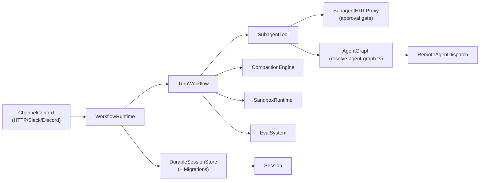
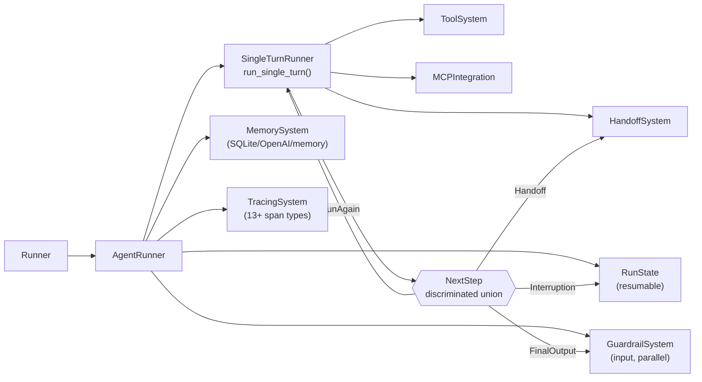
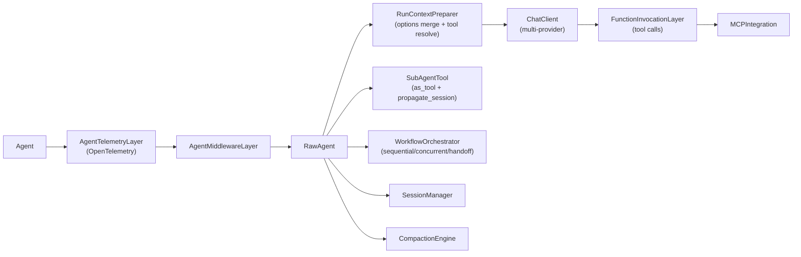
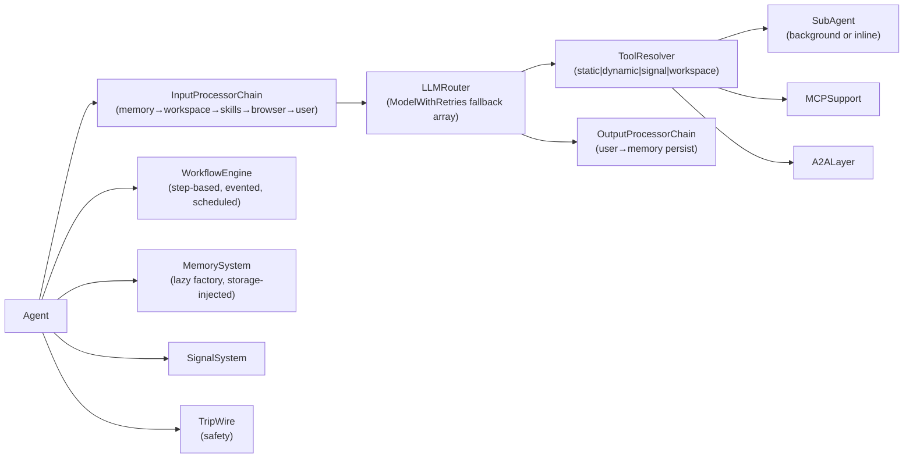

# Agentic AI Weekly Scan — 2026-06-19

## Executive Summary

- **Vercel ra mắt Eve** (tạo ngày 16/06, 1427★ trong 3 ngày): framework TypeScript mang paradigm filesystem-first cho durable agents, với durable session store có migration, governance layer, và evals tích hợp Braintrust — cách tiếp cận novel nhất tuần này.
- **OpenAI Agents SDK** (27k★, pushed 18/06) bổ sung Sandbox Agents cho extended filesystem tasks và chuẩn hóa control flow bằng `NextStep` enum explicit — giải quyết dứt khoát vấn đề agent "không biết khi nào dừng".
- **Microsoft Agent Framework** (11k★, pushed hôm nay) và **Mastra** (25k★, pushed hôm nay) đều đạt milestone lớn: MAF với protocol-based duck-typing + OpenTelemetry native; Mastra với processor-pipeline architecture và model fallback first-class.

## Table of Contents

- [1. vercel/eve](#1-verceleve)
- [2. openai/openai-agents-python](#2-openaiopenai-agents-python)
- [3. microsoft/agent-framework](#3-microsoftagent-framework)
- [4. mastra-ai/mastra](#4-mastra-aimastra)

---

## 1. vercel/eve

**GitHub:** https://github.com/vercel/eve

### §1 — Quick Context

Framework TypeScript filesystem-first của Vercel cho phép xây dựng durable agents với convention-over-configuration.

- **Tech stack:** TypeScript, Nitro 3.0 runtime, Vercel AI SDK (`@ai-sdk/*`), `@vercel/sandbox`, Zod, Vitest, Braintrust/autoevals
- **Repo health:** 1427★ (tạo 16/06/2026, 3 ngày tuổi), 85 forks, 37 open issues. CI có `vitest.unit.config.ts`, `vitest.integration.config.ts`, `vitest.scenario.config.ts`, `e2e/`. Apache-2.0.

### §2 — Architecture Deep-Dive

#### A. Component Inventory

- `WorkflowRuntime` (`packages/eve/src/execution/workflow-runtime.ts`) — engine điều phối toàn bộ vòng đời execution
- `Session` (`packages/eve/src/execution/session.ts`) — trạng thái hội thoại trong một run
- `DurableSessionStore` (`packages/eve/src/execution/durable-session-store.ts`) — persistence layer có schema migration
- `DurableSessionMigrations` (`packages/eve/src/execution/durable-session-migrations/`) — version migration cho durable state
- `TurnWorkflow` (`packages/eve/src/execution/turn-workflow.ts`) — orchestrate một lượt user↔model
- `AgentGraph` (`packages/eve/src/runtime/resolve-agent-graph.ts`) — resolve topology của sub-agent tree
- `SubagentTool` (`packages/eve/src/execution/subagent-tool.ts`) — wraps sub-agent thành callable tool
- `SubagentHITLProxy` (`packages/eve/src/execution/subagent-hitl-proxy.ts`) — intercept approval trước khi sub-agent thực thi
- `CompactionEngine` (`packages/eve/src/execution/compaction.ts`) — nén lịch sử session khi vượt token budget
- `ChannelContext` (`packages/eve/src/execution/channel-context.ts`) — abstracts HTTP/Slack/Discord ingress
- `GovernanceLayer` (`packages/eve/src/runtime/governance/`) — policy enforcement
- `SandboxRuntime` (`packages/eve/src/execution/sandbox/`) — isolated execution environment
- `EvalSystem` (`packages/eve/src/evals/`) — evaluation hooks tích hợp Braintrust
- `RemoteAgentDispatch` (`packages/eve/src/execution/remote-agent-dispatch.ts`) — điều phối agent trên remote host

#### B. Control Flow — Durable Session + Agent Graph

Pattern: **Durable session-based workflow với graph-based sub-agent routing**

1. Request đến qua `ChannelContext` (HTTP REST, Slack webhook, Discord event) — channel xác định routing context.
2. `WorkflowRuntime` lookup session từ `DurableSessionStore`; nếu mới thì tạo `Session`, nếu cũ thì resume từ checkpoint.
3. `TurnWorkflow` bắt đầu: prompt assembled từ instructions.md + workspace + context, model gọi qua Vercel AI SDK (provider-agnostic).
4. Tool call dispatched: local tools trong `tools/` → validated bằng Zod schema; hoặc sub-agent call → `SubagentTool` resolve via `AgentGraph`.
5. Nếu sub-agent cần human approval → `SubagentHITLProxy` park execution, serialize state vào `DurableSessionStore`, return HTTP pending response.
6. Khi context gần giới hạn → `CompactionEngine` summarize lịch sử, lưu lại snapshot.

#### C. State & Data Flow

- Message format: typed objects qua Vercel AI SDK (`CoreMessage`)
- State storage: `DurableSessionStore` (file-backed hoặc Vercel KV) với schema migration support — agent update không làm mất session cũ
- Context window: `CompactionEngine` tự động nén khi vượt ngưỡng

#### D. Tool / Capability Integration

- Mỗi tool là một TypeScript function với Zod schema trong `tools/` directory
- Model gọi tool qua native function-calling của AI SDK
- MCP support qua `connections/` và `@ai-sdk/mcp`
- Validation: Zod parse trước khi execute
- `tool-auth.ts` handles per-tool authentication

#### E. Memory Architecture

- Short-term: `Session` in-memory per turn
- Long-term: `DurableSessionStore` với migration — persistent across restarts
- Compaction: `compaction.ts` — summarize + truncate khi token budget vượt ngưỡng
- Không có vector retrieval rõ ràng từ code (không xác định từ code)

#### F. Model Orchestration

- Provider abstraction: Vercel AI SDK (`@ai-sdk/anthropic`, `@ai-sdk/openai`, `@ai-sdk/google`, ...)
- Model config trong `agent.ts` — tập trung một nơi
- Sub-agents trong `subagents/` có thể dùng model khác (model per sub-agent)
- Fallback, batching: không xác định từ code

#### G. Observability & Eval

- Eval system trong `packages/eve/src/evals/` — tích hợp `autoevals` (0.0.132) và Braintrust peer dep (^3.0.0)
- 3 vitest config levels: unit, integration, scenario — coverage đa tầng
- E2E tests trong `e2e/`
- Tracing: OpenTelemetry qua `@ai-sdk/otel`
- `source-change.ts` theo dõi thay đổi nguồn

#### H. Extension Points

- Filesystem convention: thêm `tools/*.ts`, `skills/*.md`, `channels/`, `subagents/` → framework tự discover
- Custom channel: implement vào `channels/`
- Custom hook: thêm vào `hooks/`
- Framework-agnostic: có `react/`, `svelte/`, `vue/` adapter trong src

### §3 — Architecture Diagram

### §4 — Verdict

**Điểm novel đáng học:**
- **Durable session với migration**: session store có schema versioning — agent có thể update mà không break hội thoại đang chạy. Rất hiếm ở open-source framework.
- **Filesystem-as-architecture**: không phải template convention mà là runtime discovery — framework đọc directory structure để resolve agent capabilities. Giảm boilerplate, tăng inspectability.
- **HITL proxy tầng sub-agent**: `SubagentHITLProxy` intercept ở mức sub-agent (không phải top-level) — fine-grained approval.

**Red flags:**
- 3 ngày tuổi, beta API — chưa có semantic versioning stable; migration pattern chưa được battle-tested.
- Nitro 3.0 beta dependency — coupling chặt với Vercel infra stack.
- Không có multi-model routing hay model fallback rõ ràng.

**Open questions:**
- `DurableSessionMigrations` implement migration strategy gì — destructive hay additive?
- `GovernanceLayer` enforce policy nào — rate limit, content filter, hay authorization?
- Braintrust integration level: chỉ log hay có replay capability?

---

## 2. openai/openai-agents-python

**GitHub:** https://github.com/openai/openai-agents-python

### §1 — Quick Context

SDK Python nhẹ của OpenAI cho multi-agent workflows với guardrails, tracing, và sandbox execution built-in.

- **Tech stack:** Python ≥3.10, openai SDK ≥2.36, Pydantic v2, MCP SDK ≥1.19, SQLAlchemy, litellm (optional), WebSockets
- **Repo health:** 27250★, pushed 18/06/2026. Có `tests/`, `Makefile`, pyright + mypy config, mkdocs. MIT License.

### §2 — Architecture Deep-Dive

#### A. Component Inventory

- `Runner` (`src/agents/run.py`) — public API: `run()`, `run_sync()`, `run_streamed()`
- `AgentRunner` (`src/agents/run.py`) — internal execution loop (experimental, non-public)
- `Agent` (`src/agents/agent.py`) — generic dataclass: tools, handoffs, guardrails, model, instructions
- `GuardrailSystem` (`src/agents/guardrail.py`) — `InputGuardrail` + `OutputGuardrail` với decorator pattern
- `HandoffSystem` (`src/agents/handoffs/`) — agent switching logic
- `MemorySystem` (`src/agents/memory/`) — session abstraction: `session.py`, `sqlite_session.py`, `openai_conversations_session.py`, `openai_responses_compaction_session.py`
- `TracingSystem` (`src/agents/tracing/`) — span-based: `agent_span`, `function_span`, `guardrail_span`, `handoff_span`, `generation_span`, v.v.
- `SandboxAgent` (`src/agents/sandbox/`) — containerized long-running tasks
- `MCPIntegration` (`src/agents/mcp/`) — MCP server support
- `RunState` (`src/agents/run_state.py`) — resumable serialized state
- `RunContext` (`src/agents/run_context.py`) — execution context per run
- `ToolSystem` (`src/agents/tool.py`) — FunctionTool, tool validation
- `ToolGuardrails` (`src/agents/tool_guardrails.py`) — per-tool safety
- `RealtimeAgent` (`src/agents/realtime/`) — voice via gpt-realtime-2
- `NextStep` (`src/agents/run.py`) — discriminated union enum: FinalOutput | Handoff | Interruption | RunAgain
- `SingleTurnRunner` (`src/agents/run.py`) — `run_single_turn()` xử lý một lần gọi model và dispatch tool calls

#### B. Control Flow — ReAct với Explicit NextStep Enum

Pattern: **ReAct-style (think→act→observe) với NextStep discriminated union**

1. `Runner.run()` khởi tạo `AgentRunner`, tải `RunState` từ session nếu đang resume.
2. Input guardrails chạy (có thể parallel với model nếu `run_in_parallel=True`).
3. `run_single_turn()`: model invoked với tất cả accumulated items → response parsed.
4. Tool calls executed → results added vào items list → fed back vào next iteration.
5. Response classified thành `NextStep`: `FinalOutput` → chạy output guardrails → return; `Handoff` → switch `current_agent`, continue loop; `Interruption` → serialize `RunState`, return pending; `RunAgain` → increment turn counter, loop.
6. `max_turns` check mỗi iteration — prevent infinite loops.

#### C. State & Data Flow

- Message format: `items` list (typed messages, tool calls, tool results) — strongly typed
- State storage: `RunState` (in-memory, resumable) + Session backends (SQLite, OpenAI Conversations, in-memory)
- Context window: `openai_responses_compaction_session.py` — compaction qua OpenAI Responses API
- "Conversation-lock retry": rewind đến checkpoint cuối cùng khi retry

#### D. Tool / Capability Integration

- `FunctionTool` với Pydantic schema extraction tự động
- MCP tools qua `mcp/` — lazy connect, duplicate-name detection
- Agents-as-tools: `agent.as_tool()` wrap agent thành FunctionTool
- Per-tool guardrails: `tool_guardrails.py`
- Validation: Pydantic parse + `strict_schema.py`

#### E. Memory Architecture

- Short-term: `RunContext` + items list trong turn
- Long-term: 3 backends — `sqlite_session.py`, `openai_conversations_session.py`, in-memory
- Compaction: `openai_responses_compaction_session.py` — dùng Responses API để summarize
- `session_settings.py` cấu hình behavior (load_messages, etc.)

#### F. Model Orchestration

- Default model: gpt-5.4-mini (cấu hình trong `Agent.model`)
- Mỗi agent có thể dùng model khác — per-agent model config
- litellm optional: multi-provider support
- any-llm-sdk optional: alternative provider abstraction
- Fallback, parallelism: không xác định từ code

#### G. Observability & Eval

- Span-based tracing: 13+ span types (`agent_span`, `function_span`, `guardrail_span`, `handoff_span`, `generation_span`, `speech_span`, `mcp_tools_span`, ...)
- BatchTraceProcessor + flush_traces() cho immediate visibility
- Provider pattern: `set_trace_processors()` → custom backend (Langfuse, custom, etc.)
- `_debug.py` cho debug mode
- Không có built-in eval framework (khác với Eve/Mastra)

#### H. Extension Points

- Custom `Model` implementation: `src/agents/models/`
- Custom guardrail: `@input_guardrail` / `@output_guardrail` decorators
- Custom trace processor: `add_trace_processor()`
- Custom session backend: implement `session.py` base class

### §3 — Architecture Diagram

### §4 — Verdict

**Điểm novel đáng học:**
- **NextStep enum explicit**: cách terminate/handoff/pause được type-safe — không có implicit "agent decides to stop" mà phải classify rõ ràng. Dễ test, dễ trace.
- **`tripwire_triggered` guardrail pattern**: guardrail không throw exception mà return flag — execution flow vẫn tiếp tục với full context, caller quyết định halt. Non-intrusive và composable.
- **Conversation-lock retry với checkpoint rewind**: thất bại trong resume → rewind về checkpoint, không mất toàn bộ progress.
- **Sandbox Agents** (v0.14.0): agent chạy trong container với filesystem access — use case "vibe coding" dạng long-horizon.

**Red flags:**
- `AgentRunner` marked "experimental, not part of public API" — core execution loop không stable.
- Không có built-in eval framework — phải tự setup.
- litellm, any-llm-sdk là optional — multi-provider support không first-class.
- Default model `gpt-5.4-mini` — coupling với OpenAI có thể là vendor lock hidden.

**Open questions:**
- `responses_compaction_session.py` dùng API endpoint nào cụ thể? Có idempotent không?
- `SandboxAgent` dùng container runtime nào (Docker/Firecracker/e2b)?
- `HandoffSystem` có hỗ trợ parallel handoff (swarm) không hay chỉ sequential?

---

## 3. microsoft/agent-framework

**GitHub:** https://github.com/microsoft/agent-framework

### §1 — Quick Context

Framework production-grade của Microsoft cho multi-agent workflows, hỗ trợ Python + .NET với OpenTelemetry native và declarative YAML agents.

- **Tech stack:** Python ≥3.10 (+ .NET), Pydantic v2, opentelemetry-api 1.39+, MCP SDK ≥1.24, hỗ trợ OpenAI/Anthropic/Azure/Bedrock/Gemini/Mistral/Ollama
- **Repo health:** 11463★, pushed 19/06/2026 (hôm nay). `tests/` trong mỗi package, devui/, declarative-agents/, docs/. MIT License.

### §2 — Architecture Deep-Dive

#### A. Component Inventory

- `BaseAgent` (`python/packages/core/agent_framework/_agents.py`) — minimal: session management, `as_tool()`, `as_mcp_server()`
- `RawAgent` (`python/packages/core/agent_framework/_agents.py`) — chat client integration, message prep, history management
- `Agent` (`python/packages/core/agent_framework/_agents.py`) — full: extends RawAgent + AgentMiddlewareLayer + AgentTelemetryLayer
- `AgentMiddlewareLayer` (`python/packages/core/agent_framework/_middleware.py`) — request/response interception chain
- `AgentTelemetryLayer` (`python/packages/core/agent_framework/_telemetry.py`) — OpenTelemetry instrumentation
- `WorkflowOrchestrator` (`python/packages/core/agent_framework/_workflows/`) — sequential, concurrent, handoff, group-collaboration patterns
- `ChatClient` (`python/packages/core/agent_framework/_clients.py`) — abstraction layer cho multi-provider invocation
- `FunctionInvocationLayer` (`python/packages/core/agent_framework/_agents.py`) — tool call dispatch với context injection
- `RunContextPreparer` (`python/packages/core/agent_framework/_agents.py`) — `_prepare_run_context()`: options merge, tool resolve, history setup
- `SubAgentTool` (`python/packages/core/agent_framework/_agents.py`) — `as_tool()` wraps agent thành FunctionTool với propagate_session
- `SessionManager` (`python/packages/core/agent_framework/_sessions.py`) — conversation state, per-service-call persistence
- `CompactionEngine` (`python/packages/core/agent_framework/_compaction.py`) — context window management
- `EvaluationHooks` (`python/packages/core/agent_framework/_evaluation.py`) — eval framework
- `MCPIntegration` (`python/packages/core/agent_framework/_mcp.py`) — MCP tool discovery + lazy connect
- `SkillSystem` (`python/packages/core/agent_framework/_skills.py`) — reusable skill definitions
- `SecurityLayer` (`python/packages/core/agent_framework/security.py`) — security policies
- `A2ALayer` (`python/packages/a2a/`) — agent-to-agent protocol (dedicated package)
- `DeclarativeAgent` (`declarative-agents/`) + (`python/packages/core/agent_framework/declarative/`) — YAML-defined agents
- `DevUI` (`python/packages/devui/`) — interactive debugging UI

#### B. Control Flow — Layered Middleware với Orchestration Patterns

Pattern: **Layered delegation với middleware wrapping + graph orchestration**

1. Request đến `Agent` (outermost: telemetry + middleware interceptors run first).
2. `_prepare_run_context()`: merge options (None=unset convention), resolve tools từ default + runtime + MCP, setup history strategy (service-managed vs local).
3. `AgentMiddlewareLayer` chain chạy theo thứ tự configured.
4. `RawAgent._call_chat_client()`: forward tới provider đã chọn (OpenAI/Anthropic/Azure/Bedrock/...).
5. Tool calls xử lý qua `FunctionInvocationLayer` với `additional_function_arguments` injection.
6. Multi-agent scenarios: sub-agent exposed qua `as_tool()` với `propagate_session` hoặc qua `_workflows/` orchestrator (sequential, concurrent, handoff, group-chat).
7. `_finalize_response()`: set author names, propagate conversation IDs, run `after_run()` providers.

#### C. State & Data Flow

- Message format: `AgentResponse` | `ResponseStream` — provider-agnostic wrapper
- State: Session-based với per-service-call history mode; service-managed vs local in-memory
- Context window: `_compaction.py` — strategy không xác định từ code (summarize hay truncate?)
- Conversation ID tracking: 3 sources (explicit, service-managed, local sentinel)

#### D. Tool / Capability Integration

- Tool registration: pass vào constructor `tools=` list; runtime tools merge tại `_prepare_run_context()`
- Model gọi tool qua native function-calling của mỗi provider
- MCP: lazy connect (`_async_exit_stack`), duplicate-name detection
- `as_mcp_server()`: expose agent thành MCP server — bất kỳ MCP client nào gọi được
- `FunctionInvocationLayer` với context injection

#### E. Memory Architecture

- Short-term: in-memory conversation trong session
- Long-term: `SessionManager` — provider-managed hoặc local `InMemoryHistoryProvider`
- Compaction: `_compaction.py` — strategy không xác định rõ từ code
- `mem0` package: dedicated memory system (python/packages/mem0/)

#### F. Model Orchestration

- `_clients.py`: abstraction layer cho multiple providers (OpenAI, Azure OpenAI, Anthropic, Bedrock, Gemini, Mistral, Ollama)
- Mỗi agent config một client — single model per agent instance
- Multi-model: thông qua multi-agent composition, không phải per-request routing
- OpenTelemetry telemetry bọc quanh mọi provider call

#### G. Observability & Eval

- OpenTelemetry native từ core — không phải addon, là `_telemetry.py` trong `Agent` class hierarchy
- `observability.py` ở package root — custom observability hooks
- `_evaluation.py` — eval hooks (methodology không xác định từ code)
- DevUI (`python/packages/devui/`) — interactive testing và debugging
- TRANSPARENCY_FAQ.md — governance documentation

#### H. Extension Points

- Custom agent: implement `SupportsAgentRun` protocol (duck-typing — không cần inherit)
- Custom middleware: pass vào `middleware=` constructor
- Custom provider: implement chat client interface
- Declarative agents: YAML trong `declarative-agents/`
- Custom context provider: `context_providers=` parameter

### §3 — Architecture Diagram

### §4 — Verdict

**Điểm novel đáng học:**
- **`SupportsAgentRun` protocol (duck-typing)**: hoàn toàn không cần inherit — bất kỳ class nào implement `run()`, `create_session()`, `get_session()` đều compatible. Kiến trúc mở nhất trong các framework tuần này.
- **Options merging "None=unset"**: convention rõ ràng cho overriding — `None` không ghi đè default của service, khác với explicit `Optional[X]`. Pattern đáng học.
- **`as_mcp_server()`**: expose agent thành MCP server — interop với bất kỳ MCP client nào (Claude Desktop, VSCode, etc.) không cần code thêm.
- **Per-service-call history middleware**: tách biệt session persistence ra khỏi agent logic — middleware owns it.

**Red flags:**
- Monorepo quá lớn (30+ packages) — dependency hell tiềm năng, thiếu clear ownership.
- `_compaction.py` tồn tại nhưng strategy không documented từ code — black box.
- Multi-language (Python + .NET) làm documentation và testing phức tạp — nguy cơ drift.
- `declarative-agents/` YAML pattern: cần validation schema mạnh để tránh silent misconfiguration.

**Open questions:**
- `_workflows/` implement graph-based hay sequential-only? LangGraph-style state machine không?
- DevUI dùng giao thức gì để inspect live agent state?
- A2A package (`python/packages/a2a/`) dùng protocol chuẩn nào — Google A2A spec?

---

## 4. mastra-ai/mastra

**GitHub:** https://github.com/mastra-ai/mastra

### §1 — Quick Context

Framework TypeScript toàn diện nhất hiện tại: agents, workflows, memory, RAG, evals, MCP, voice, browser — từ prototype đến production.

- **Tech stack:** TypeScript, Node.js ≥22, pnpm monorepo, Vercel AI SDK, `@a2a-js/sdk`, `@modelcontextprotocol/sdk`, Zod, Vitest, PostHog
- **Repo health:** 25224★, 234 open issues, 224 PRs, pushed 19/06/2026. Dual license: Apache 2.0 + Enterprise. `vitest.config.ts`, E2E tests.

### §2 — Architecture Deep-Dive

#### A. Component Inventory

- `Agent` (`packages/core/src/agent/agent.ts`) — orchestrator chính với processor pipeline và model fallback
- `SubAgent` (`packages/core/src/agent/subagent.ts`) — delegated agent implement cùng interface
- `AgentProcessor` (`packages/core/src/agent/agent-processor.ts`) — execution logic của agent
- `AgentStreamProcessor` (`packages/core/src/agent/agent-stream-processor.ts`) — streaming response handling
- `WorkflowEngine` (`packages/core/src/workflows/execution-engine.ts`) — step-based execution runtime
- `WorkflowStep` (`packages/core/src/workflows/step.ts`) — định nghĩa một step trong workflow
- `StateReader` (`packages/core/src/workflows/state-reader.ts`) — đọc state giữa các steps
- `MemorySystem` (`packages/core/src/memory/`) — lazy-resolved với factory injection
- `InputProcessorChain` (`packages/core/src/processors/`) — pipeline input transformers: memory recall → workspace → skills → channel → browser → user
- `OutputProcessorChain` (`packages/core/src/processors/`) — pipeline output transformers: user → memory persistence
- `LLMRouter` (`packages/core/src/llm/`) — 40+ provider routing với fallback array
- `ToolResolver` (`packages/core/src/agent/agent.ts`) — `listTools()` aggregates static|dynamic|signal|workspace tools
- `RAGSystem` (`packages/core/src/agent/`) — vector retrieval (không xác định file cụ thể)
- `EvalFramework` (`packages/evals/`) — dedicated eval package
- `MCPSupport` (`packages/core/src/mcp/`) — MCP server/client
- `A2ALayer` (`packages/core/src/a2a/`) — agent-to-agent communication
- `SignalSystem` (`packages/core/src/agent/signals.ts`) — state signals và coordination
- `TelemetryLayer` (`packages/core/src/telemetry/`) — tracing hooks
- `ObservabilityLayer` (`packages/observability/`) — PostHog + custom
- `VoiceSystem` (`packages/core/src/voice/`) + (`packages/voice/`) — TTS/STT
- `DurableState` (`packages/core/src/agent/durable/`) — persistent agent state
- `TripWire` (`packages/core/src/agent/trip-wire.ts`) — safety mechanism

#### B. Control Flow — Processor Pipeline với Fallback Model

Pattern: **Processor pipeline (input→LLM→output) với step-based workflow nội tuyến**

1. Request đến Agent (HTTP/channel/programmatic) — request context validated bằng optional schema.
2. Input processors chạy tuần tự: memory recall → workspace instructions → skills → channel context → browser context → user-configured processors.
3. `resolveModelSelection()` → `normalizeModelFallbacks()` → `prepareModels()`: resolve model từ single config hoặc array `ModelWithRetries` với `enabled` flags.
4. LLM invoked qua Vercel AI SDK — tools resolved dynamically (static + dynamic + signal-provided + workspace-generated).
5. Tool calls dispatched; sub-agents trong `agents` registry gọi như tools (optionally as background tasks qua `deriveSubAgentBackgroundConfig()`).
6. Output processors chạy tuần tự: user-configured → memory persistence.
7. Workflow steps trong `workflows/` có thể execute mid-agent via `WorkflowEngine`.

#### C. State & Data Flow

- Message format: `CoreMessage[]` (Vercel AI SDK), `MessageList` (`agent/message-list/`) với deduplication
- State: storage-agnostic backends (in-memory, external), `DurableState` cho persistent, LRU cache + TTL cache
- Context window: memory processor inject history + semantic recall — không có explicit compaction từ code
- `SaveQueue` (`agent/save-queue/`) — batched persistence

#### D. Tool / Capability Integration

- `listTools()`: resolve static | dynamic function | signal-provided | workspace-generated — 4 sources merged
- `convertTools()` thêm browser tools at runtime
- MCP: `packages/core/src/mcp/` — server và client
- Validation: Zod schema cho mọi tool
- A2A: `@a2a-js/sdk` cho cross-agent communication

#### E. Memory Architecture

- Short-term: `MessageList` in-memory với deduplication
- Long-term: `MemorySystem` — lazy factory resolution, Mastra storage injected automatically
- Retrieval: memory processor contributes semantic recall (vector search — không xác định engine từ code)
- Compaction: không xác định từ code
- Deduplication: memory processor contributions skip duplicates từ user-configured pipelines

#### F. Model Orchestration

- Single model: `model: ModelConfig`
- Fallback array: `model: ModelWithRetries[]` — mỗi entry có `maxRetries`, `enabled` flag
- `resolveModelSelection()` filter disabled entries trước khi invoke factories
- 40+ providers qua Vercel AI SDK
- Per-sub-agent model: sub-agents inherit hoặc override

#### G. Observability & Eval

- `packages/evals/` — dedicated eval package (methodology không xác định từ code)
- PostHog (`posthog-node`) — analytics/telemetry
- `packages/observability/` — custom observability hooks
- `packages/core/src/telemetry/` — tracing integration
- `__recordings__/` trong packages/core — LLM recording/replay capability (qua `_llm-recorder`)

#### H. Extension Points

- Custom processors: pass vào `processors:` constructor
- Custom memory: implement memory interface
- Custom deployer: `packages/deployer/`, `deployers/`
- Custom channel: `packages/channels/`, `channels/`
- Enterprise features: `ee/` directories (proprietary license)
- Custom storage: `packages/stores/`

### §3 — Architecture Diagram

### §4 — Verdict

**Điểm novel đáng học:**
- **Model fallback as first-class**: `ModelWithRetries[]` array với `enabled` flags — không phải retry wrapper mà là true fallback chain. Từng entry có retry budget riêng.
- **Processor pipeline as middleware graph**: input/output processors kết hợp thành `combineProcessorsIntoWorkflow()` — reusable, testable, composable.
- **Sub-agent background task dispatch**: `deriveSubAgentBackgroundConfig()` quyết định sub-agent chạy blocking hay background — tùy context, không hard-code.
- **LLM Recording/Replay**: `__recordings__/` + `_llm-recorder` — deterministic replay cho testing, hiếm thấy ở open-source.

**Red flags:**
- Scope quá rộng (voice, browser, TTS, RAG, evals, channels, auth) — cohesion thấp; risk của "framework làm mọi thứ không tốt cái nào".
- Enterprise `ee/` directories với license riêng — core vs enterprise boundary không rõ ràng.
- 234 open issues — maintainability burden.
- PostHog telemetry built-in: user data có thể leak nếu không configure đúng.
- Memory compaction strategy "không xác định từ code" — tiềm năng OOM với long conversations.

**Open questions:**
- `combineProcessorsIntoWorkflow()` tạo ra WorkflowEngine hay chỉ là sequential function chain?
- Semantic recall trong MemorySystem dùng vector engine nào (pgvector, Pinecone, in-memory)?
- `DurableState` trong `agent/durable/` có dùng cùng migration strategy với Eve không?
- Enterprise features trong `ee/` có thể unlock gì mà core không làm được?

---

*Scan thực hiện: 2026-06-19. Tool: GitHub Search API + WebFetch. Repos được verify là public và accessible tại thời điểm scan.*
