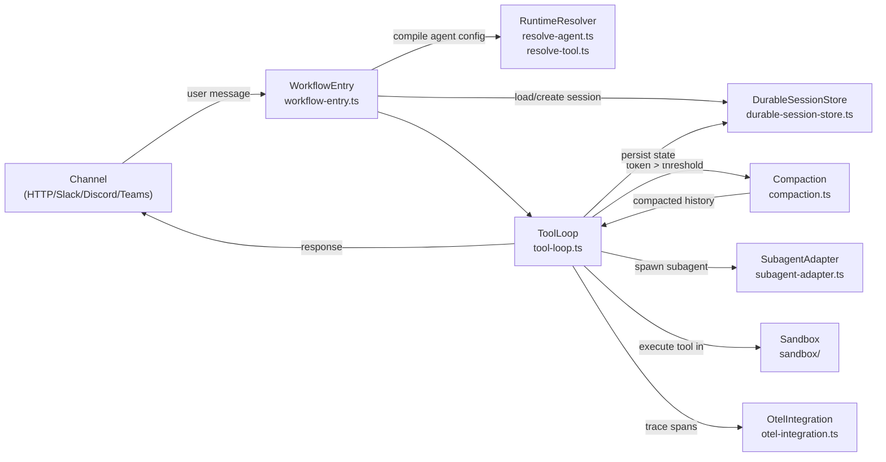
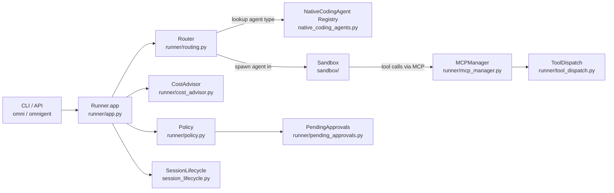
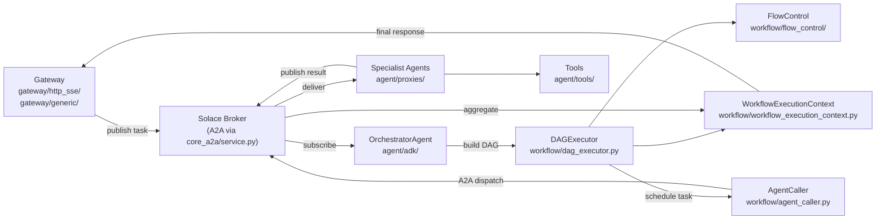
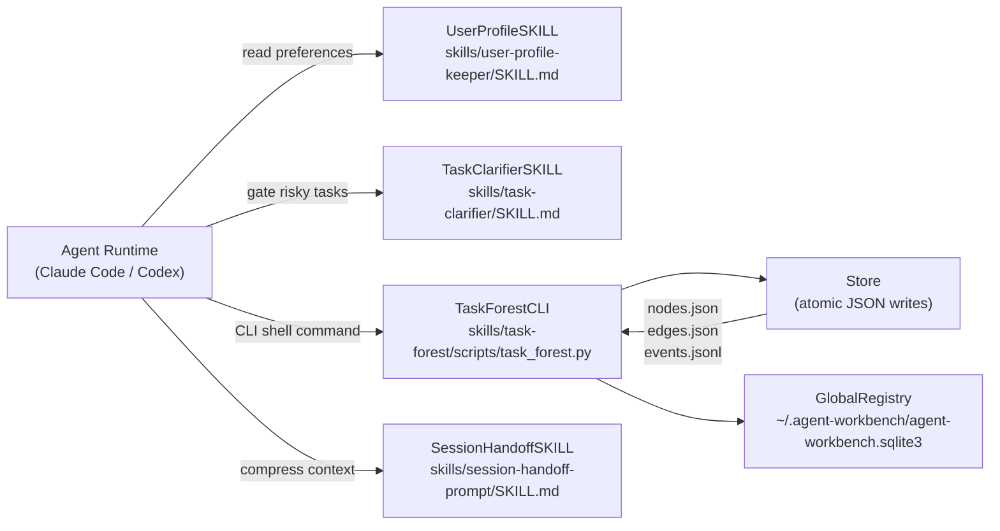

# Agentic AI Weekly Scan — 2026-06-20

## Executive Summary

- **vercel/eve** ra mắt ngày 2026-06-16 với kiến trúc filesystem-first mới lạ: convention-over-configuration cho agent (agent.ts + instructions.md + tools/), durable sessions qua workflow-steps, và tool-loop có compaction model riêng — đây là production-ready framework JavaScript đầu tiên dám cạnh tranh với LangGraph về độ sâu.
- **omnigent-ai/omnigent** (Databricks) giải quyết bài toán meta-orchestration: một supervisor duy nhất quản lý Claude Code, Codex, Cursor, Pi chạy song song trong các terminal riêng biệt, với cost_advisor + policy + pending_approvals như guardrails tầng hạ tầng.
- **SolaceLabs/solace-agent-mesh** và **dongshuyan/compass-skills** đại diện cho hai hướng kiến trúc ngược chiều nhau — SAM đẩy phức tạp lên infrastructure (event broker, DAG executor, A2A protocol), trong khi Compass kéo state xuống filesystem cục bộ (SKILL.md + local JSON/SQLite).

## Table of Contents

- [1. vercel/eve — Filesystem-First Agent Framework](#1-verceleve--filesystem-first-agent-framework)
- [2. omnigent-ai/omnigent — Meta-Orchestration for Native Coding Agents](#2-omnigent-aiomnigent--meta-orchestration-for-native-coding-agents)
- [3. SolaceLabs/solace-agent-mesh — Event-Driven Multi-Agent Mesh](#3-solacelabssolace-agent-mesh--event-driven-multi-agent-mesh)
- [4. dongshuyan/compass-skills — Skill-Based Local Agent OS](#4-dongshuyancompass-skills--skill-based-local-agent-os)

---

## 1. vercel/eve — Filesystem-First Agent Framework

**GitHub:** https://github.com/vercel/eve

### §1 — Quick Context

Framework TypeScript của Vercel định nghĩa agent qua convention thư mục thay vì API, với durable sessions và multi-channel deployment out-of-the-box.

- **Tech stack:** TypeScript (96.5%), Node 24+, pnpm workspaces, Turbo monorepo; AI SDK (Anthropic, OpenAI, Google); sandbox: Docker/microsandbox/Vercel; OTel
- **Repo health:** 1,675★, created 2026-06-16, active CI (Vitest unit/integration/e2e/scenario), 106 forks, 60 open issues, Apache-2.0

### §2 — Architecture Deep-Dive

#### A. Component Inventory

- `ToolLoop` (`packages/eve/src/harness/tool-loop.ts`) — vòng lặp ReAct chính: build toolset → invoke model → dispatch tool calls → feed results → loop/terminate
- `WorkflowEntry` (`packages/eve/src/execution/workflow-entry.ts`) — entry point của mỗi turn; khởi tạo/resume session, dispatches vào workflow runtime
- `DurableSessionStore` (`packages/eve/src/execution/durable-session-store.ts`) — persists toàn bộ session history qua các turn (across restarts)
- `RuntimeResolver` (`packages/eve/src/runtime/resolve-agent.ts`, `resolve-tool.ts`, `resolve-channel.ts`, `resolve-sandbox.ts`, `resolve-hook.ts`) — biên dịch filesystem convention thành runtime config objects
- `AgentGraph` (`packages/eve/src/runtime/graph.ts`, `resolve-agent-graph.ts`) — mô hình đồ thị các agent và sub-agent relationships
- `Channel` (`packages/eve/src/channel/`) — adapters vào HTTP, Slack, Discord, Teams, Twilio, Telegram, Linear, GitHub
- `SubagentAdapter` (`packages/eve/src/execution/subagent-adapter.ts`) — spawns và supervises sub-agents; HITL proxy (`subagent-hitl-proxy.ts`) chặn tool calls cần approval
- `Sandbox` (`packages/eve/src/sandbox/`) — execution isolation: Docker, just-bash, microsandbox, Vercel
- `Compaction` (`packages/eve/src/harness/compaction.ts`) — context window management với secondary compaction model
- `OtelIntegration` (`packages/eve/src/harness/otel-integration.ts`) — OpenTelemetry tracing, preserves turn trace context qua session continuations
- `Evals` (`packages/eve/src/evals/`) — built-in eval harness với expect utilities, loaders, reporters

#### B. Control Flow — ReAct-style (think → act → observe loop)

1. Message đến qua `Channel` (HTTP/Slack/Discord/etc.) và được forward vào `WorkflowEntry`
2. `WorkflowEntry` (`workflow-entry.ts`) load hoặc khởi tạo `DurableSession` từ store; `RuntimeResolver` biên dịch agent filesystem thành runtime config
3. `ToolLoop` (`tool-loop.ts`) bắt đầu: `buildToolSetWithProviderTools` assembles toolset; nếu token estimate > threshold → `maybeCompact` kích hoạt compaction model
4. AI SDK invoke model (`ToolLoopAgent.stream()`); model trả về text hoặc tool call requests
5. Tool calls được dispatch qua `execute-tool.ts`; results append vào `session.history` và feed lại vào model
6. Loop tiếp tục khi last message là tool result; terminate khi `final_output` tool được gọi hoặc model ra prose không có tool calls
7. Response phát qua `Channel`; session state được persist vào `DurableSessionStore`

#### C. State & Data Flow

- Message format: typed TypeScript objects (assistant/user/tool-result) trong `session.history`; schema defined tại `packages/eve/src/harness/types.ts`
- State storage: in-memory `HarnessSession` trong một turn; `DurableSessionStore` (`durable-session-store.ts`) cho persistence qua turns
- Context window: sliding window với token threshold; `maybeCompact` triggers secondary compaction model; `lastKnownInputTokens` từ step trước để estimate; broadcast `compaction.requested` / `compaction.completed` events

#### D. Tool / Capability Integration

- Tools là TypeScript functions trong `tools/` directory của agent; Zod schema validation
- Model gọi tool qua native function-calling (AI SDK abstraction)
- Approval flow: `SubagentHITLProxy` (`subagent-hitl-proxy.ts`) intercepts sensitive tool calls, parks session trong `PendingApprovals` state, chờ user confirm
- Tool interrupts (`tool-interrupts.ts`) xử lý cancel/timeout

#### E. Memory Architecture

- Short-term: `session.history` array in-memory trong mỗi turn
- Long-term: `DurableSessionStore` persists full message history
- Compaction: sliding window với configurable token threshold + separate compaction model (thường nhỏ hơn main model)
- Không có vector retrieval — context management thuần compression

#### F. Model Orchestration

- Agent khai báo model trong `agent.ts` (ví dụ `claude-sonnet-4-6`)
- Compaction có thể dùng model riêng (nhỏ hơn) để tiết kiệm cost
- Sub-agents có thể dùng model khác; `SubagentAdapter` dispatch qua `remote-agent-dispatch.ts`
- Code-mode (`code-mode.ts`, `code-mode-lifecycle.ts`) là execution path riêng cho code generation tasks
- Recovery: max 3 model call attempts; exponential backoff 500ms base; auto-retry khi provider tool bị reject hoặc empty response

#### G. Observability & Eval

- OTel tracing: `otel-integration.ts`; `instrumentation-config.ts`; turn trace context preserved qua session continuations (stored in `session.state[TURN_TRACE_STATE_KEY]`)
- Built-in eval harness: `packages/eve/src/evals/` với expect utilities, loaders, reporters; Vitest configs riêng cho scenario tests (`vitest.scenario.config.ts`)
- Events: `emission.ts` broadcasts typed events (compaction, tool execution, step start/end)

#### H. Extension Points

- Thêm TypeScript file vào `tools/` — tự động discovered
- Thêm channel config vào `channels/` directory
- Định nghĩa sub-agents trong `subagents/` directory
- Custom sandbox qua `resolve-sandbox.ts` extension

### §3 — Architecture Diagram

### §4 — Verdict

**Điểm novel cụ thể:** Filesystem-first convention là insight thực sự — agent không cần code để "register" tools hay channels, chỉ cần đặt file đúng chỗ; `RuntimeResolver` compile on-demand. Compaction có *secondary model riêng* (không compaction bằng chính model đang chạy) là design choice tinh tế. HITL `SubagentHITLProxy` suspend/resume pattern qua `DurableSessionStore` cho phép human approval không block server thread.

**Red flags:** Mới 4 ngày tuổi, API sẽ thay đổi (chính họ cảnh báo "public beta"). Code-mode path riêng biệt có thể tạo divergence maintenance burden. Chưa thấy evidence về rate-limit handling hay multi-tenant cost isolation.

**Open questions:** `AgentGraph` (`graph.ts`) implement orchestration pattern gì — có phải LangGraph-style execution graph không? `resolve-dynamic-instructions.ts` / `resolve-dynamic-skill.ts` cho phép runtime injection instructions đến mức nào? Code-mode và tool-loop có share state không?

---

## 2. omnigent-ai/omnigent — Meta-Orchestration for Native Coding Agents

**GitHub:** https://github.com/omnigent-ai/omnigent

### §1 — Quick Context

Framework Python của Databricks (alpha) giúp supervisor duy nhất quản lý nhiều native coding agent (Claude Code, Codex, Cursor, Pi) chạy đồng thời với cost control và governance.

- **Tech stack:** Python 3.12+, FastAPI, SQLAlchemy 2.0, Pydantic 2; `claude-agent-sdk` + `openai-agents`; sandbox: Modal/Daytona/CoreWeave/E2B; OTel + MLflow
- **Repo health:** 4,075★, alpha v0.2.0.dev0, từ Databricks, has openapi.json + deployment configs (Railway, Render), Apache-2.0

### §2 — Architecture Deep-Dive

#### A. Component Inventory

- `NativeCodingAgent` registry (`omnigent/native_coding_agents.py`) — frozen dataclass metadata cho 4 agent types: Claude (harness: "claude-native"), Codex (harness: "codex-native"), Pi (harness: "pi-native"), Cursor (harness: "cursor-native"); O(1) lookup by key/harness/label
- `Runner.app` (`omnigent/runner/app.py`) — FastAPI server, entry point cho API và CLI; manages agent session lifecycle
- `Router` (`omnigent/runner/routing.py`) — chọn native agent type để dispatch; routing logic dựa trên session context hoặc explicit config
- `ToolDispatch` (`omnigent/runner/tool_dispatch.py`) — routes tool calls từ native agents đến registered tools
- `MCPManager` (`omnigent/runner/mcp_manager.py`) — quản lý Model Context Protocol bridge; ProxyMCPManager (`proxy_mcp_manager.py`) cho distributed scenarios
- `CostAdvisor` + `CostJudge` (`omnigent/runner/cost_advisor.py`, `cost_judge.py`) — spending governance: CostAdvisor monitors realtime spend, CostJudge thực hiện enforcement decisions
- `Policy` (`omnigent/runner/policy.py`) — governance rules engine; enforce per-session hoặc global policies
- `PendingApprovals` (`omnigent/runner/pending_approvals.py`) — HITL approval queue: agent blocks tại checkpoint, chờ human confirm
- `Sandbox` (`omnigent/sandbox/`) — launchers: Modal, Daytona, CoreWeave, E2B, OpenShell
- `SessionLifecycle` (`omnigent/session_lifecycle.py`) — tracks open/close state; dual-path (title marker + label) cho backward compatibility

#### B. Control Flow — Hierarchical (supervisor → native coding agents)

1. User invoke `omni` CLI hoặc HTTP API; `Runner.app` nhận request
2. `Router` (`routing.py`) lookup trong `NativeCodingAgent` registry để chọn agent type (Claude/Codex/Pi/Cursor) dựa trên session config
3. Native agent spawned trong terminal/TUI context via pexpect; `Sandbox` launcher khởi tạo isolated environment (Modal/E2B/etc.)
4. Tất cả tool calls từ native agent đi qua `MCPManager` → `ToolDispatch` → registered tools (Unity Functions, UC functions, custom)
5. `CostAdvisor` monitor spend realtime; `CostJudge` ra decision khi limit tiến gần; `Policy` enforce governance rules
6. Khi agent gọi high-risk operation → `PendingApprovals` park session; user confirm/reject trước khi proceed
7. `SessionLifecycle` cập nhật closed state; `SQLAlchemy` store persists session metadata

#### C. State & Data Flow

- Session state: `SQLAlchemy 2.0` với SQLite/PostgreSQL backend (`omnigent/stores/` và `omnigent/db/`)
- Resource registry: `resource_registry.py` tracks session-owned resources
- Identity: `identity.py` manages auth context per session
- Native agents tự quản lý conversation state bên trong terminal của họ — omnigent chỉ supervise metadata và resource usage

#### D. Tool / Capability Integration

- MCP protocol là bridge chính: native agents gọi tools qua MCP; `MCPManager` route đến implementation
- `ToolDispatch` (`tool_dispatch.py`) xử lý dispatch logic, validation
- Unity Catalog Functions (`uc_function.py`) cho Databricks integration — đây là differentiator quan trọng
- Sandbox environment filesystem (`environment_filesystem.py`) expose workspace tới agents

#### E. Memory Architecture

Không xác định từ code — mỗi native agent (Claude Code, Codex) tự quản lý conversation history bên trong session của họ. Omnigent track metadata nhưng không can thiệp vào memory strategy của agent.

#### F. Model Orchestration

- Không có "meta-LLM" call — omnigent là supervisor/orchestrator thuần infrastructure, không thêm LLM layer lên trên các native agents
- `model_catalog.py` track available models across providers
- Native agents dùng model riêng của họ (Claude Code dùng Claude, Codex dùng GPT-4o, etc.)
- Có thể run multiple agents đồng thời trong cùng session
- Cloud providers: AWS Bedrock, Google Vertex AI, Databricks Model Serving qua optional extras

#### G. Observability & Eval

- OpenTelemetry: full OTel stack (`opentelemetry-*` packages)
- MLflow tracing: optional extra `[mlflow]`; MLflow experiment tracking cho agent runs
- Cost tracking: `cost_advisor.py` + `cost_judge.py` — realtime token spend monitoring
- Session closure audit: dual-path trong `session_lifecycle.py`

#### H. Extension Points

- Custom agents qua YAML spec (`AGENT_YAML_SPEC.md`)
- Custom sandbox launchers thêm vào `omnigent/sandbox/`
- Custom tools qua MCP protocol

### §3 — Architecture Diagram

### §4 — Verdict

**Điểm novel cụ thể:** Omnigent là framework đầu tiên mà tôi thấy treat các native coding agents (Claude Code, Codex, Cursor) như *workers trong một cluster* — supervisor không add thêm LLM layer mà chỉ thuần infrastructure management. `CostAdvisor` + `CostJudge` tách biệt monitoring và enforcement là pattern clean cho cost governance. MCP làm universal tool protocol giữa supervisor và agents.

**Red flags:** Alpha (v0.2.0.dev0) với Databricks provenance — có thể strongly opinionated về Unity Catalog integration. Pexpect để control TUI agents là brittle (screen scraping essentially). `session_lifecycle.py` backward-compat dual-path (title marker + label) là code smell.

**Open questions:** `routing.py` chọn agent dựa trên gì — task type classification hay explicit config? Khi nhiều native agents run parallel, có shared tool namespace không? Conflict resolution khi hai agents muốn write cùng file?

---

## 3. SolaceLabs/solace-agent-mesh — Event-Driven Multi-Agent Mesh

**GitHub:** https://github.com/SolaceLabs/solace-agent-mesh

### §1 — Quick Context

Framework Python event-driven cho multi-agent AI, dùng Solace PubSub+ làm message broker, Google ADK làm agent runtime, và A2A protocol cho peer-to-peer delegation.

- **Tech stack:** Python 69.4% / TypeScript 30.1%; Google `google-genai` + LiteLLM; FastAPI; Solace AI Connector (SAC); Google Agent Development Kit (ADK); Docker; config_portal (web UI)
- **Repo health:** 4,937★, Apache-2.0, CHANGELOG, release-please CI, sonar-project.properties (code quality), pytest với testcontainers

### §2 — Architecture Deep-Dive

#### A. Component Inventory

- `OrchestratorAgent` (`src/solace_agent_mesh/agent/`) — agent ADK-based nhận task, phân rã thành sub-tasks, build DAG
- `DAGExecutor` (`src/solace_agent_mesh/workflow/dag_executor.py`) — executes workflow DAG, schedules tasks respecting dependencies
- `AgentCaller` (`src/solace_agent_mesh/workflow/agent_caller.py`) — invokes individual specialist agents trong DAG
- `WorkflowExecutionContext` (`src/solace_agent_mesh/workflow/workflow_execution_context.py`) — maintains state của workflow run đang active
- `A2AService` (`src/solace_agent_mesh/core_a2a/service.py`) — core agent-to-agent communication via Solace broker; implements A2A protocol
- `Gateway` (`src/solace_agent_mesh/gateway/`) — external interfaces: HTTP SSE (`http_sse/`), generic REST, observability endpoint; adapters cho REST/Slack/Web UI
- `FlowControl` (`src/solace_agent_mesh/workflow/flow_control/`) — conditionals, loops, branching logic trong workflow
- `Tools` (`src/solace_agent_mesh/agent/tools/`, `tools/web_search/`) — SQL, JQ, web search, data visualization built-in

#### B. Control Flow — Planner-Executor với Event-Driven routing

1. Request đến `Gateway` (REST API / HTTP SSE / Slack / Web UI)
2. Gateway publish message lên Solace topic; `OrchestratorAgent` subscribe, nhận task
3. Orchestrator dùng Google ADK để phân rã task → DAG of sub-tasks; `WorkflowExecutionContext` được khởi tạo
4. `DAGExecutor` (`dag_executor.py`) schedule sub-tasks theo dependency order; `AgentCaller` dispatch mỗi task tới specialist agent qua `A2AService`
5. Specialist agents (chạy trên ADK) nhận task qua Solace topic, thực hiện, publish result
6. `DAGExecutor` collect results trong `WorkflowExecutionContext`; `FlowControl` xử lý branching
7. Final result aggregated, Gateway nhận qua Solace reply topic, gửi response cho client

#### C. State & Data Flow

- Message format: event messages publish/subscribe qua Solace topics (fully asynchronous); format là Solace message payload (likely JSON)
- State storage: `WorkflowExecutionContext` in-memory per workflow run; Solace broker durable queues cho reliability
- Fully decoupled: producer/consumer không biết nhau; Solace broker là single source of truth cho message delivery

#### D. Tool / Capability Integration

- Tools được register per-agent trong ADK config
- Built-in: SQL (query databases), JQ (JSON processing), web search (`tools/web_search/`), data visualization (plotly/kaleido)
- Document processing: pypdf, python-docx, python-pptx, markitdown cho ingestion
- Dynamic embeds: context-dependent content resolution

#### E. Memory Architecture

Không xác định từ code — không thấy vector store hay memory module rõ ràng trong directory structure. State management qua event broker. Mỗi agent ADK instance có conversation history riêng. Google Gemini có native long-context, có thể là strategy chính.

#### F. Model Orchestration

- LiteLLM là provider abstraction → 100+ models supported
- Google Gemini (`google-genai`) là primary ADK integration
- OpenAI fallback qua LiteLLM
- Orchestrator thường dùng frontier model (Gemini Pro/Ultra); specialists có thể dùng model nhỏ hơn
- Cloud: AWS Bedrock, Azure Blob, Google Cloud AI Platform đều được support

#### G. Observability & Eval

- `gateway/observability/` — dedicated observability endpoint/adapter
- `evaluation/` directory — eval framework cho agent quality
- `sonar-project.properties` — SonarQube code quality scanning
- Prometheus/Grafana tích hợp không rõ ràng từ code nhưng Solace platform support sẵn

#### H. Extension Points

- Custom agents: khai báo agent ADK mới, subscribe Solace topic
- Custom tools: thêm vào `agent/tools/`
- Custom gateways: implement `gateway/base/` interface
- `templates/` directory cho scaffolding new agents

### §3 — Architecture Diagram

### §4 — Verdict

**Điểm novel cụ thể:** Dùng enterprise message broker (Solace PubSub+) làm agent communication backbone là differentiator thực sự so với LangGraph/CrewAI — guaranteed delivery, durable queues, pub/sub topology. `DAGExecutor` kết hợp với `FlowControl` cho phép conditional branching trong workflow, không chỉ linear chain. A2A protocol over broker tách biệt agent interface khỏi transport.

**Red flags:** Hard dependency vào Solace Platform (vendor lock-in nghiêm trọng — free tier có limits). 70+ dependencies trong pyproject.toml là bloat risk. Google ADK là additional dependency layer có thể bị breaking changes. Multi-cloud support (AWS/Azure/GCP) trong một framework dẫn đến nhiều code paths cần test.

**Open questions:** Solace broker locally (free) vs Solace Cloud — latency overhead của broker cho simple tasks là bao nhiêu? `evaluation/` directory chứa gì cụ thể — automated benchmarks hay manual test cases? `preset/` directory chứa pre-built agent templates gì?

---

## 4. dongshuyan/compass-skills — Skill-Based Local Agent OS

**GitHub:** https://github.com/dongshuyan/compass-skills

### §1 — Quick Context

Bộ 4 SKILL.md skill packages giúp bất kỳ AI coding agent nào (Claude Code, Codex, v.v.) có task memory, session handoff, và user alignment tồn tại local.

- **Tech stack:** Python 55.1% (stdlib only, zero external deps) / HTML 44.9%; `npx skills add` installer; SKILL.md packaging; SQLite (stdlib); JSON/JSONL storage
- **Repo health:** 368★, created 2026-06-15, MIT license, có PUBLICATION_AUDIT.md và SECURITY.md, 30 forks

### §2 — Architecture Deep-Dive

#### A. Component Inventory

- `TaskForestCLI` (`skills/task-forest/scripts/task_forest.py`) — CLI quản lý DAG task graph: add-node, update-node, add-edge, list, export, validate; atomic writes với `os.fsync()`
- `Store` (class trong `skills/task-forest/scripts/task_forest.py`) — JSON/JSONL file I/O với atomic writes qua temp file + rename; fsync cho durability
- `GlobalRegistry` (`~/.agent-workbench/agent-workbench.sqlite3`) — SQLite database cross-workspace session index
- `TaskClarifierSKILL` (`skills/task-clarifier/SKILL.md`) — instruction package: gates execution khi goal/scope/acceptance criteria chưa clear
- `SessionHandoffSKILL` (`skills/session-handoff-prompt/SKILL.md`) — compresses conversation context thành paste-ready prompt cho new session
- `UserProfileSKILL` (`skills/user-profile-keeper/SKILL.md` + scripts) — persists local collaboration preferences, communication style, risk tolerance

#### B. Control Flow — Procedural / Sequential (không phải agent framework)

Compass không phải agent framework — nó là *skill layer* được inject vào agent runtime qua SKILL.md instruction packages:

1. Agent runtime (Claude Code/Codex) load SKILL.md files như additional system instructions
2. `UserProfileSKILL` được consulted đầu tiên: communication preferences, risk style inform cách agent respond
3. Với ambiguous/high-risk task → `TaskClarifierSKILL` trigger: agent hỏi clarifying questions, establish acceptance criteria trước khi execute
4. `TaskForestCLI` được agent invoke như shell command: `python task_forest.py add-node ...` để update DAG
5. Sau session, `SessionHandoffSKILL` compress context → structured prompt; không modify task data
6. Tất cả state persists locally trong `.agent-workbench/` workspace directory

#### C. State & Data Flow

- Config: `.agent-workbench/task-forest/config.json`
- Graph: `.agent-workbench/task-forest/graph/nodes.json` + `edges.json`
- Events: `.agent-workbench/task-forest/events/events.jsonl` (append-only log)
- Exports: `.agent-workbench/task-forest/exports/` (JSON + HTML visualization)
- Global registry: `~/.agent-workbench/agent-workbench.sqlite3`
- Node types: `global_task, milestone, task, subtask, requirement, decision, risk, question, follow_up`
- Edge types: `child_of, depends_on, contributes_to, related_to, duplicates, supersedes, clarifies, derived_from`
- Node status: `proposed → ready → in_progress → blocked → review_needed → done → deprecated → archived`

#### D. Tool / Capability Integration

- Agent gọi `task_forest.py` như shell command thông thường (không phải function-calling hay MCP)
- Zero external dependencies — stdlib Python only: `json, sqlite3, os, sys, argparse, hashlib, datetime`
- `proposal-save` / `proposal-apply` workflow: staged changes cần confirmation trước khi commit vào graph
- Multi-session locking: concurrent sessions interact qua CLI để avoid race conditions; stale-hash validation

#### E. Memory Architecture

- Short-term: trong-session conversation (agent runtime tự quản lý)
- Long-term: `.agent-workbench/` local filesystem
  - DAG graph (nodes.json + edges.json) — structured task memory
  - events.jsonl — append-only audit log
  - user profile — preference memory
  - SQLite global registry — cross-workspace index
- Không có vector retrieval — lookup là JSON deserialization + DFS/BFS qua graph

#### F. Model Orchestration

Không xác định từ code — compass-skills không làm LLM calls. Nó là instruction layer; model orchestration hoàn toàn do agent runtime quyết định.

#### G. Observability & Eval

- Events log: `events/events.jsonl` — append-only audit trail mọi graph mutation
- `validate` command: DFS cycle detection, dependency integrity check
- HTML export với timeline playback cho visualization
- `PUBLICATION_AUDIT.md` — security audit documentation

#### H. Extension Points

- Thêm skills mới theo SKILL.md spec
- Python scripts trong `scripts/` directory của mỗi skill
- Cross-runtime: bất kỳ agent nào support SKILL.md format đều dùng được (Claude Code, Codex, v.v.)

### §3 — Architecture Diagram

### §4 — Verdict

**Điểm novel cụ thể:** SKILL.md packaging model là cách portable nhất để inject capabilities vào nhiều agent runtimes khác nhau mà không cần framework integration. `TaskForestCLI` với cycle detection (DFS), stale-hash validation, multi-session locking, và atomic fsync writes là production engineering trong một Python script stdlib-only — zero-dependency là differentiator thực sự. `proposal-save/apply` workflow (staged changes với confirmation) cho agent governance.

**Red flags:** Toàn bộ "architecture" về cơ bản là 4 Markdown files + Python scripts — thiếu typed interfaces, không có test suite rõ ràng từ code, không có CI. Stale-hash validation approach có thể dễ conflict trong heavy multi-session use. 44.9% HTML repo size là tutorial/visualization content, không phải framework code.

**Open questions:** `SessionHandoffSKILL` compress theo algorithm gì — LLM summarization hay structured extraction? GlobalRegistry SQLite được dùng cho gì cụ thể — chỉ cross-workspace index hay còn lưu data khác? SKILL.md spec có chuẩn hoá cross-vendor không hay mỗi runtime interpret khác nhau?
