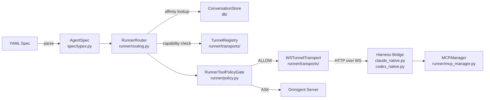
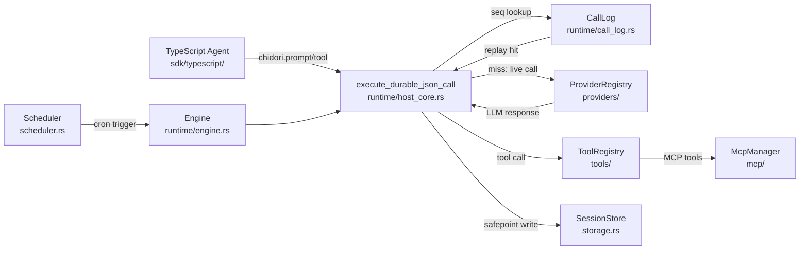
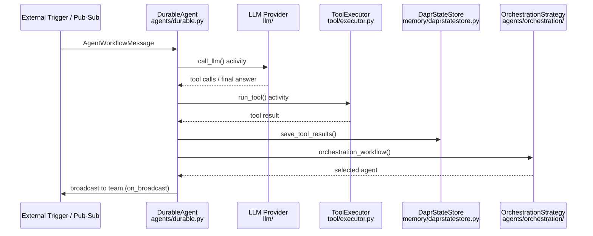
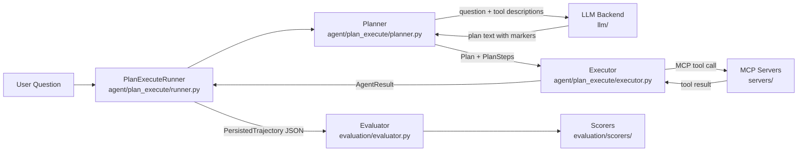

# Weekly Agentic AI Scout — 2026-06-21

## Executive Summary

- **Omnigent** ra mắt một pattern chưa phổ biến: *meta-harness* — một lớp orchestration ngồi trên các coding agent (Claude Code, Codex, Cursor) với policy engine CEL-based, WebSocket tunnel routing, và per-conversation affinity, thay vì build một agent framework mới.
- **Chidori** là Rust runtime duy nhất trong tuần này implement *durable execution* cho agent ở mức host-call boundary: mọi LLM call, tool call, HTTP request đều bị intercept, ghi log theo `(seq, function)`, và có thể replay byte-identical không tốn token — đây là approach novel so với checkpoint-based frameworks.
- **dapr/dapr-agents** và **IBM/AssetOpsBench** đại diện cho hai extreme của production readiness: dapr-agents mang toàn bộ Dapr infrastructure (virtual actor, pub/sub, durable workflow, mTLS) vào agent runtime; AssetOpsBench xây eval pipeline nghiêm túc với 4 scorer type và anti-self-judging guard.

## Table of Contents

- [1. omnigent-ai/omnigent](#1-omnigent-aiomnigent)
- [2. ThousandBirdsInc/chidori](#2-thousandbirdsinc-chidori)
- [3. dapr/dapr-agents](#3-daprdapr-agents)
- [4. IBM/AssetOpsBench](#4-ibmassetopsbench)

---

## 1. omnigent-ai/omnigent

**GitHub:** https://github.com/omnigent-ai/omnigent

### §1 — Quick Context

Meta-harness orchestrate nhiều coding agent (Claude Code, Codex, Cursor, Pi) qua một lớp duy nhất mà không rewrite agent code.

- **Stack:** Python 3.12+ (83%), TypeScript (16%), FastAPI, SQLAlchemy, OpenTelemetry, CEL, MCP ≥1.0
- **Deps nổi bật:** `claude-agent-sdk≥0.1.62`, `openai-agents≥0.0.17`, `dapr-ext-fastapi` không có, modal/daytona/e2b làm sandbox
- **Repo health:** 4,218 stars, 475 forks, created 2026-06-11, CI qua pre-commit + pyrefly, có tests/

### §2 — Architecture Deep-Dive

#### A. Component Inventory

- `AgentSpec` (`omnigent/spec/types.py`) — typed dataclass định nghĩa agent identity, executor config, tools, skills, sub-agents, policies, guardrails, retry policy với adapter cho từng harness
- `RunnerRouter` (`omnigent/runner/routing.py`) — dispatch conversation → registered runner qua WebSocket tunnel; enforce per-conversation affinity pinning (hard affinity: một conv luôn route về cùng một runner)
- `TunnelRegistry` (`omnigent/runner/transports/`) — in-memory registry map runner ID → WebSocket session; source of truth cho online runners
- `WSTunnelTransport` (`omnigent/runner/transports/`) — httpx custom transport tunneling HTTP qua WebSocket
- `RunnerToolPolicyGate` (`omnigent/runner/policy.py`) — client-side CEL policy enforcement TRƯỚC và SAU mỗi tool call; verdict: `allow`/`deny`/`ask`
- `Policy` ABC (`omnigent/policies/base.py`) — abstract base với `async evaluate(ctx, context) → PolicyResult`; `reset_turn()` hook per-turn lifecycle
- `PolicyRegistry` (`omnigent/policies/registry.py`) — maps policy names → implementations
- `MCPManager` (`omnigent/runner/mcp_manager.py`) — quản lý MCP server connections cho tool execution
- `ConversationStore` (`omnigent/db/`) — SQLAlchemy persistence lưu conversation-to-runner affinity
- `CostAdvisor` / `CostJudge` (`omnigent/runner/cost_advisor.py`, `cost_judge.py`) — per-run cost tracking và policy
- Harness bridges: `claude_native.py`, `codex_native.py`, `cursor_native.py`, `pi_native.py` (`omnigent/`) — per-harness bridge/forwarder/hook

#### B. Control Flow — **Meta-Harness Routing Pattern**

Pattern: không phải ReAct, không phải graph — đây là **harness-routing with policy gate**.

1. YAML spec được parse thành `AgentSpec` với executor config (`omnigent/spec/types.py`)
2. `PATCH /v1/sessions/{id}` bind conversation vào registered runner (ghi vào `ConversationStore`)
3. User prompt → server gọi `RunnerRouter.client_for_conversation(conversation_id, harness)` (`runner/routing.py`)
4. Router check: runner online? Runner support harness capability? (từ `session.hello.harnesses`)
5. `RunnerToolPolicyGate` evaluate CEL policies pre-tool-call → DENY short-circuit, ASK = escalate to server, ALLOW = proceed
6. Request tunneled qua `WSTunnelTransport` (HTTP over WebSocket) → runner process gọi harness (Claude Code / Codex CLI / Cursor daemon)
7. Post-tool-call policies evaluated; tool-result ASK treated as DENY ("output đã tồn tại, không có clean rollback")
8. Response streamed ngược qua tunnel → client

#### C. State & Data Flow

- Message format: typed `AgentSpec` dataclasses (Python); YAML source
- Conversation-runner affinity: SQL (`ConversationStore` / `omnigent/db/`)
- Runner registry: in-memory `TunnelRegistry`
- Context window management: per-harness (delegation); `CompactionConfig` field trong `AgentSpec` cho per-agent override

#### D. Tool / Capability Integration

- MCP native (`runner/mcp_manager.py`, `proxy_mcp_manager.py`); tools định nghĩa trong YAML spec
- Policy gate wrap tool dispatch: CEL evaluation pre/post (`runner/policy.py`)
- Sandbox: Modal, Daytona, Islo, E2B qua `omnigent/environments/`

#### E. Memory Architecture

Không có memory module riêng trong core — delegation hoàn toàn cho underlying harness. `CompactionConfig` trong `AgentSpec` cho phép per-agent override nhưng implementation ở harness side.

#### F. Model Orchestration

- `RetryPolicy` (`spec/types.py`) có adapter riêng cho từng harness: `.openai`, `.anthropic`, `.claude_cli`, `.codex_cli`, `.pi`
- `model_catalog.py` + `model_override.py` cho multi-provider support
- Planner = frontier model của harness; không có explicit planner/executor split

#### G. Observability & Eval

- OpenTelemetry cho FastAPI và httpx (từ `pyproject.toml`)
- `CostAdvisor` + `CostJudge` (`runner/`) cho per-run cost accounting
- Không có eval hooks hay replay capability trong core

#### H. Extension Points

- Custom agent: YAML spec với custom `executor.type`
- Custom policy: subclass `Policy` ABC (`policies/base.py`), register vào `PolicyRegistry`
- Custom sandbox: thêm provider vào `omnigent/environments/`
- Custom harness: implement bridge/forwarder pattern (xem `claude_native_bridge.py`)

### §3 — Architecture Diagram

### §4 — Verdict

**Điểm novel:** Pattern meta-harness routing là genuinely khác với các agentic framework thông thường — thay vì build một agent engine, Omnigent xây một *proxy governance layer* ngồi trên top của existing coding agents. CEL-based policy gate với pre/post tool-call enforcement và per-conversation runner affinity là implementation detail đáng học. Retry adapters per-harness trong `RetryPolicy` rất pragmatic.

**Red flags:** Repo 10 ngày tuổi (created 2026-06-11), v0.2.0.dev0 — API chưa stable. `TunnelRegistry` in-memory → single point of failure nếu server restart. Không có eval/replay capability. Memory hoàn toàn delegation → không portable giữa harnesses.

**Open questions:** Cơ chế "resume the session to bind a registered runner" sau crash cụ thể như nào? Policy CEL expressions được validate như nào tại deploy time? Multi-runner load balancing có không hay chỉ có pin affinity?

---

## 2. ThousandBirdsInc/chidori

**GitHub:** https://github.com/ThousandBirdsInc/chidori

### §1 — Quick Context

Rust agent framework với durable execution: mọi side effect đều bị record, agent có thể resume từ crash với zero replay cost.

- **Stack:** Rust 96%, TypeScript/Python SDKs, embedded pure-Rust JS engine, SQLite, OpenTelemetry
- **Deps:** `cron` crate, `tokio`, `uuid`, `chrono`, `anyhow`, `serde_json`
- **Repo health:** 1,350 stars, 55 forks, Apache-2.0, pushed 2026-06-21, CI qua `.github/`

### §2 — Architecture Deep-Dive

#### A. Component Inventory

- `Engine` (`crates/chidori/src/runtime/engine.rs`) — core execution engine: khởi tạo `RuntimeContext`, load agent file, run với tool/MCP/policy injections
- `RuntimeContext` (`crates/chidori/src/runtime/host_core.rs`) — central execution state: manages call log, replay checking, sequence numbering, pause states
- `execute_durable_json_call` (`crates/chidori/src/runtime/host_core.rs`) — host-call boundary function; implement 3-phase: replay short-circuit → completed-operation lookup → live execution với safepoints
- `CallLog` + `CallRecord` (`crates/chidori/src/runtime/call_log.rs`) — ordered log của mọi host calls, indexed by `(seq, function)` tuple; aggregate metrics (tokens, cost, duration)
- `SessionStore` trait (`crates/chidori/src/storage.rs`) — pluggable persistence: `MemoryStore` (HashMap in Mutex) hoặc `SqliteStore` (single JSON blob per row)
- `StoredSession` (`crates/chidori/src/storage.rs`) — primary persistence entity: `{id, run_id, status, input, output, call_log, pending_seq, pending_signal_*, pending_approval, approvals, policy_profile}`
- `ToolRegistry` (`crates/chidori/src/tools/`) — load tool definitions từ directories, inject vào each run
- `McpManager` (`crates/chidori/src/mcp/`) — MCP server connections; tools injected vào scheduled runs
- `ProviderRegistry` (`crates/chidori/src/providers/`) — LLM provider abstraction
- `PolicyConfig` (`crates/chidori/src/policy.rs`) — policy enforcement layer
- `Scheduler` (`crates/chidori/src/scheduler.rs`) — cron-based recipe scheduling; `spawn_all()` tạo background tokio task per recipe
- `TemplateEngine` (`crates/chidori/src/runtime/template.rs`) — prompt templating
- TypeScript SDK (`sdk/typescript/`) — agent authoring surface: `agent(input, chidori)` async function pattern

#### B. Control Flow — **Durable Execution với Replay Short-circuit**

Pattern: **Event-sourced durable execution** (không phải ReAct hay graph).

1. User viết TypeScript agent export `agent(input: any, chidori: Chidori)` function
2. `Engine.run(agent_path, inputs)` init `RuntimeContext` với seq counter = 0, empty call log
3. Agent gọi `chidori.prompt(...)` → hits `execute_durable_json_call` tại host boundary
4. **Replay phase:** check call log cho `(seq, function)` tuple match → nếu found, return recorded result, zero LLM call
5. **Live phase:** nếu không có trong log, gọi `ProviderRegistry` → LLM call; safepoints trigger storage TRƯỚC và SAU live call
6. `CallRecord{seq, function, args, result, duration_ms, token_usage}` được append vào `CallLog`
7. Tool calls: route qua `ToolRegistry` (file-based) hoặc `McpManager` (MCP servers) → kết quả record tương tự
8. Crash/resume: `Engine` load `StoredSession` từ `SessionStore`, reconstruct `RuntimeContext` từ call log, re-run → deterministic replay đến crash point, tiếp tục live execution từ đó

#### C. State & Data Flow

- `CallRecord` JSON: `{seq, function, args, result, duration_ms, timestamp, token_usage{input, output, cached_input}, error}`
- `StoredSession` persistence: SQLite single JSON blob per row (đơn giản hóa schema, list limit 200 recent)
- Signal mailbox: `pending_signal_name`, `pending_signal_names`, `pending_signal_deadline` — support cho human-in-the-loop và fan-in signals
- Context window: `prompt_cache.rs` — structural prompt caching để reduce cost trên replay

#### D. Tool / Capability Integration

- File-based tool definitions: `ToolRegistry::load_from_dirs()` — tools là files trong directory
- MCP integration: `McpManager` inject MCP tools vào mỗi run (kể cả scheduled recipes)
- TypeScript SDK: `chidori.tool()` call route qua host boundary → recorded, replayable
- Policy: `PolicyConfig` applied per run

#### E. Memory Architecture

- `runtime/memory.rs` — short-term in-process memory
- `prompt_cache.rs` — structural prompt caching (cost optimization trên repeated prompts)
- No long-term vector memory hay RAG trong core

#### F. Model Orchestration

- `ProviderRegistry` (`providers/`) — multiple LLM providers
- `runtime/cost.rs` — per-call cost accounting
- `TokenUsage` track input, output, và cached tokens separately (billing-tier aware)
- Scheduled runs: `Scheduler` (`scheduler.rs`) — cron expression per recipe, `run_once()` funnels vào Engine pipeline

#### G. Observability & Eval

- `runtime/otel.rs` — OpenTelemetry integration
- `CallLog` là execution trace đầy đủ: timing, tokens, costs, nested call hierarchy (parent_seq)
- **Key insight:** call log IS the eval primitive — deterministic replay tạo ra test fixtures từ recorded runs; `zero LLM calls` khi replay = miễn phí regression testing

#### H. Extension Points

- Custom providers: implement trait trong `providers/`
- Custom tools: drop file vào tool directory hoặc connect MCP server
- Custom storage: implement `SessionStore` trait
- Scheduled agents (recipes): YAML với `schedule: "cron expr"`

### §3 — Architecture Diagram

### §4 — Verdict

**Điểm novel:** `execute_durable_json_call` với 3-phase (replay → completed-lookup → live + safepoints) là implementation đẹp nhất của durable agent execution mình thấy trong open-source. Đặc biệt: safepoints TRƯỚC live call đảm bảo crash safety; `parent_seq` trong call log cho phép reconstruct nested call hierarchy. Embedded pure-Rust JS engine (không cần Node.js) là kỹ thuật ấn tượng.

**Red flags:** Chỉ 1,350 stars, TypeScript là primary authoring language nhưng Rust là 96% codebase → learning curve cao. SqliteStore limit 200 recent sessions hardcoded. Không có vector memory hay RAG. Python SDK ít chú ý hơn TypeScript SDK.

**Open questions:** `runtime/typescript/` và `runtime/vendor/react/` — có phải là custom React reconciler cho UI hay gì khác? `host_branch.rs` implement gì — branching execution? Snapshot strategy (`snapshot.rs`) có allow forking runs không?

---

## 3. dapr/dapr-agents

**GitHub:** https://github.com/dapr/dapr-agents

### §1 — Quick Context

Framework Python cho production-grade agent system dựa trên Dapr infrastructure: virtual actor, durable workflow, pub/sub, state management.

- **Stack:** Python 3.11–3.13, Dapr ≥1.18, FastAPI, OpenTelemetry (OTLP + Zipkin), Pydantic ≥2.11, OpenAI/Anthropic/Mistral/HuggingFace
- **Infra:** Dapr sidecar (Kubernetes-native), Redis/CosmosDB/etc. cho state, ChromaDB cho vector memory
- **Repo health:** 695 stars, 128 forks, CNCF-affiliated, Apache-2.0, 1,142 commits, pushed 2026-06-19

### §2 — Architecture Deep-Dive

#### A. Component Inventory

- `AgentBase` (`dapr_agents/agents/base.py`) — core agent class: Dapr client, state config, pub/sub config, tool registry, memory, LLM, configs (`AgentMemoryConfig`, `AgentStateConfig`, `AgentExecutionConfig`, `AgentTracingExporter`)
- `DurableAgent` (`dapr_agents/agents/durable.py`) — workflow-native agent: extend AgentBase, integrate Dapr Workflow API cho durable task execution
- `AgentWorkflowMessage` (`dapr_agents/agents/schemas.py`) — typed Pydantic schema cho inter-agent messaging
- `OrchestrationStrategy` (`dapr_agents/agents/orchestration/strategy.py`) — base class cho agent selection
- `AgentStrategy` (`dapr_agents/agents/orchestration/agent_strategy.py`) — LLM-driven agent selection
- `RoundRobinStrategy` (`dapr_agents/agents/orchestration/roundrobin_strategy.py`) — deterministic rotation
- `RandomStrategy` (`dapr_agents/agents/orchestration/random_strategy.py`) — random selection
- `ToolBase` (`dapr_agents/tool/base.py`) — tool definition với JSON schema
- `ToolExecutor` (`dapr_agents/tool/executor.py`) — execution engine với validation
- MCP integration (`dapr_agents/tool/mcp/`) — zero-config MCP auto-discovery
- `MemoryBase` (`dapr_agents/memory/base.py`) — memory abstraction
- `DaprStateStoreMemory` (`dapr_agents/memory/daprstatestore.py`) — Dapr state API backend
- `ListStoreMemory` (`dapr_agents/memory/liststore.py`) — in-process list (short-term)
- `VectorStoreMemory` (`dapr_agents/memory/vectorstore.py`) — ChromaDB + sentence-transformers
- LLM providers (`dapr_agents/llm/`) — OpenAI, Anthropic, Mistral, HuggingFace
- Observability (`dapr_agents/observability/`) — OTLP + Zipkin exporters
- Agent telemetry (`dapr_agents/agents/telemetry/`) — per-agent metrics

#### B. Control Flow — **Durable Workflow với Virtual Actor**

Pattern: **Event-driven Durable Workflow** (Dapr Workflow API pattern).

1. External trigger publish message vào pub/sub topic → `DurableAgent` subscriber nhận
2. `agent_workflow()` Dapr Workflow activity được invoked — đây là durable execution context
3. `call_llm()` activity: gửi messages tới LLM provider, nhận tool calls hoặc final answer
4. Với mỗi tool call: `run_tool()` activity execute qua `ToolExecutor` → kết quả serialize
5. `save_tool_results()` activity persist vào Dapr state store (Redis/CosmosDB)
6. Human-in-the-loop: `_request_approval()` pause workflow, `wait for external event` với optional timeout
7. Multi-agent: `orchestration_workflow()` invoke orchestration strategy (Agent/RoundRobin/Random) → selected agent nhận broadcast qua `on_broadcast()`
8. Context broadcast đến team agents qua pub/sub `on_broadcast()` handler

#### C. State & Data Flow

- Inter-agent messages: `AgentWorkflowMessage` typed Pydantic (gRPC/pub/sub transport)
- State: Dapr state store API → pluggable backend (Redis, CosmosDB, PostgreSQL, v.v.)
- Memory: 3 backends — `ListStoreMemory` (in-process, short-term), `DaprStateStoreMemory` (durable, long-term), `VectorStoreMemory` (semantic retrieval)
- Virtual actor model: mỗi agent là persistent actor với riêng state partition — scale-to-zero friendly

#### D. Tool / Capability Integration

- Python decorator-based tool registration qua `ToolBase`
- `ToolExecutor` validate input theo JSON schema trước khi execute
- MCP auto-discovery (`tool/mcp/`): zero-config — server tự announce tools
- `tool/workflow/` — tools có thể trigger Dapr workflows
- mTLS + scope-based access control qua Dapr sidecar (không phải application code)

#### E. Memory Architecture

- **Short-term:** `ListStoreMemory` — in-process Python list, mất khi process restart
- **Long-term:** `DaprStateStoreMemory` — Dapr state API, persist qua restarts, backend-agnostic
- **Semantic:** `VectorStoreMemory` — ChromaDB + sentence-transformers, requires optional deps
- Summarization strategy: không xác định từ code (không thấy `ConversationSummary` usage rõ ràng)

#### F. Model Orchestration

- Frontier model cho orchestration (`AgentStrategy` dùng LLM để chọn next agent)
- Smaller models có thể assign cho worker agents (không enforce, config-driven)
- Multi-LLM provider qua `dapr_agents/llm/` — OpenAI, Anthropic, Mistral, HuggingFace
- Parallelism: virtual actor model → hàng nghìn agents chạy concurrent trên single core

#### G. Observability & Eval

- OpenTelemetry: OTLP + Zipkin exporters (`dapr_agents/observability/`)
- Agent telemetry module (`dapr_agents/agents/telemetry/`)
- Dapr sidecar: distributed tracing built-in (W3C trace context propagation)
- Không có built-in eval hooks hay replay capability

#### H. Extension Points

- Custom tool: decorator `@tool` trên Python function
- Custom memory: subclass `MemoryBase`
- Custom orchestration: subclass `OrchestrationStrategy`
- Custom LLM: implement provider interface trong `dapr_agents/llm/`
- Deployment: bất kỳ Dapr-supported infrastructure (Kubernetes, local, cloud)

### §3 — Architecture Diagram

### §4 — Verdict

**Điểm novel:** Dùng Dapr virtual actor model cho agent concurrency là approach production-grade nhất trong tuần — hàng nghìn agents với double-digit ms latency, scale-to-zero, state partition per actor. Ba memory backend (list/Dapr state/vector) tách biệt clean với single interface. mTLS và scope-based access control "for free" từ Dapr sidecar là security win mà các framework khác bỏ qua.

**Red flags:** Dependency nặng (Dapr sidecar required) → khó onboard nhanh. Python-only hiện tại. v0 stability (stable Q4 2025 theo README — nhưng đang là 2026). Vector store require optional deps (torch, chromadb) — heavy footprint. Không có summarization strategy rõ ràng cho long conversations.

**Open questions:** `ConversationSummary` type được import trong `agents/schemas.py` nhưng không thấy usage rõ — có auto-summarization không? `WorkflowContextInjectedTool` hoạt động như nào — tại sao phải inline trong workflow body thay vì activity? Human-in-the-loop timeout default là bao lâu?

---

## 4. IBM/AssetOpsBench

**GitHub:** https://github.com/IBM/AssetOpsBench

### §1 — Quick Context

Benchmark + framework cho AI agent trong industrial asset operations (Industry 4.0), với eval pipeline nghiêm túc và multiple agent architectures.

- **Stack:** Python 3.11+, MCP protocol, Anthropic SDK, OpenAI SDK, LiteLLM, ChromaDB (optional)
- **Accepted:** KDD 2026, AAAI 2026, ICLR 2026, ACL 2026, NeurIPS 2025
- **Repo health:** 1,862 stars, 279 forks, Apache-2.0, pushed 2026-06-21, CI qua pre-commit + gitleaks

### §2 — Architecture Deep-Dive

#### A. Component Inventory

- `AgentRunner` ABC (`src/agent/runner.py`) — abstract base cho tất cả agent runners: `run(question: str) → AgentResult`; `DEFAULT_SERVER_PATHS` dict map server name → uv entry-point
- `Planner` (`src/agent/plan_execute/planner.py`) — LLM-based plan decomposition với custom text format (#Task, #Server, #Tool, #Dependency, #ExpectedOutput markers); `parse_plan()` extract typed `Plan` + `PlanStep` via regex
- `Executor` (`src/agent/plan_execute/executor.py`) — execute plan steps theo dependency order qua MCP tool calls; không gọi LLM cho tool arguments (defer tới execution time)
- `PlanExecuteRunner` (`src/agent/plan_execute/runner.py`) — orchestrate `Planner → Executor` flow; subclass `AgentRunner`
- `ClaudeAgent` (`src/agent/claude_agent/`) — ReAct-based agent dùng Anthropic SDK với tool delegation
- `OpenAIAgent` (`src/agent/openai_agent/`) — ReAct-based dùng OpenAI SDK
- `DeepAgent` (`src/agent/deep_agent/`) — hierarchical planning với virtual filesystem (sub-agents)
- MCP Servers (`src/servers/`): `iot-mcp-server`, `fmsr-mcp-server`, `tsfm-mcp-server`, `wo-mcp-server`, `vibration-mcp-server`
- `Evaluator` (`src/evaluation/evaluator.py`) — batch evaluate trajectories vs scenarios; per-record scorer dispatch
- `metrics_from_trajectory()` (`src/evaluation/metrics.py`) — extract token counts, duration, cost per trajectory; pricing table cho Claude/GPT/Llama variants
- Scorers (`src/evaluation/scorers/`): `llm_judge.py`, `semantic.py`, `code_based.py`, `static_json.py`
- `Observability` (`src/observability/`) — không xác định từ code (cần đào sâu hơn)

#### B. Control Flow — **Planner-Executor**

Pattern: **Planner-Executor** (plan trước, execute sau với MCP tools).

1. User submit question → `PlanExecuteRunner.run(question)` được gọi (`agent/plan_execute/runner.py`)
2. `Planner.generate()`: send question + available MCP server descriptions + tool list tới frontier LLM
3. LLM trả về plan text với markers: `#Task`, `#Server`, `#Tool`, `#Dependency`, `#ExpectedOutput`
4. `parse_plan()` parse text → `Plan` object với list `PlanStep` (dependency graph, backward-only references)
5. `Executor` iterate steps theo dependency order; với mỗi step: gọi MCP tool trên designated server
6. Tool arguments resolved tại runtime từ question context + prior step results (không pre-generate)
7. Step results feed forward làm context cho dependent steps
8. Final `AgentResult` assembled từ last step output
9. (Offline) `Evaluator.evaluate()` load `PersistedTrajectory` JSON + `Scenario` specs → dispatch tới scorer

#### C. State & Data Flow

- Plan format: custom text với markers → `Plan` / `PlanStep` typed dataclasses (`agent/plan_execute/models.py`)
- Inter-step context: prior results passed as string context (không structured schema)
- Trajectory storage: JSON files (`PersistedTrajectory` với `{run_id, model, question, answer, trajectory, token_usage}`)
- No persistent state within a run; stateless per-question execution

#### D. Tool / Capability Integration

- Tất cả tools qua MCP protocol — 6 domain servers định nghĩa trong `DEFAULT_SERVER_PATHS`
- Servers launch qua `uv run <entry-point>` — isolated processes
- Tool arguments không pre-specified bởi planner ("resolved at execution time") — tránh hallucinated args
- MCP protocol handle schema validation

#### E. Memory Architecture

Không có explicit memory module — stateless per-run. Plan step results carry forward trong `Executor` nhưng không persist. Không có vector retrieval hay summarization.

#### F. Model Orchestration

- Planner: frontier model (Claude/OpenAI, configurable)
- Alternative runners: `ClaudeAgent` (ReAct, Anthropic), `OpenAIAgent` (ReAct, OpenAI), `DeepAgent` (hierarchical)
- `LLMBackend` abstraction (`src/llm/`) cho multi-provider support
- **Anti-self-judging guard:** `Evaluator._validate_judge_model()` raise `ValueError` nếu judge model matches trajectory model — enforce independent evaluation

#### G. Observability & Eval

- **Eval pipeline nghiêm túc:** `Evaluator` → `Scorer` registry với 4 scorer types:
  - `llm_judge.py` — LLM-as-judge với independent model constraint
  - `semantic.py` — semantic similarity scoring
  - `code_based.py` — programmatic/deterministic scoring
  - `static_json.py` — exact JSON match
- `metrics_from_trajectory()`: token counts (input/output), duration, tool call count, cost estimation
- `aggregate_ops()`: P50/P95 duration percentiles, total token/cost aggregation
- Cost model: per-1M-token pricing table với model name normalization (strip provider prefix, date suffix)
- 460+ benchmark scenarios trong `benchmarks/scenario_suite/`

#### H. Extension Points

- Custom agent: subclass `AgentRunner`, implement `run(question) → AgentResult`
- Custom scorer: register vào `scorer_registry`
- Custom MCP server: thêm vào `DEFAULT_SERVER_PATHS`
- Thêm scenarios: YAML files trong `benchmarks/scenario_suite/`

### §3 — Architecture Diagram

### §4 — Verdict

**Điểm novel:** Anti-self-judging guard trong `Evaluator._validate_judge_model()` là safety detail hiếm thấy trong open-source eval. Custom plan text format với explicit `#Dependency` markers giải quyết elegant vấn đề parallel execution trong Plan-Execute: planner declare dependency graph, executor có thể parallelize independent steps. Cost normalization pipeline (strip `litellm_proxy/` prefix, date suffix) cho thấy battle-tested production thinking.

**Red flags:** Stateless per-run → không có memory giữa questions. Plan format là custom text (regex-parsed) thay vì structured schema → fragile với model output variations. `src/observability/` directory tồn tại nhưng không xác định được nội dung từ code hiện tại. `DeepAgent` và `StirrupAgent` thiếu documentation rõ ràng.

**Open questions:** `DeepAgent` với "virtual filesystem" hoạt động như nào — có phải là persistent file state giữa sub-agents không? `stirrup_agent/` là gì — tên không phổ biến trong agentic literature? 460+ scenarios coverage có đủ để represent long-tail industrial failures không?

---

*Scan thực hiện: 2026-06-21 | Cutoff: repos pushed/created sau 2026-06-14 | Methodology: WebFetch README + directory structure + key source files*
