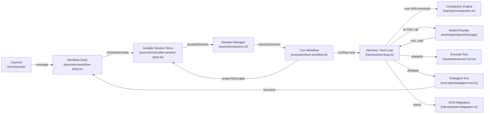
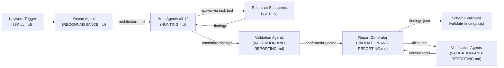
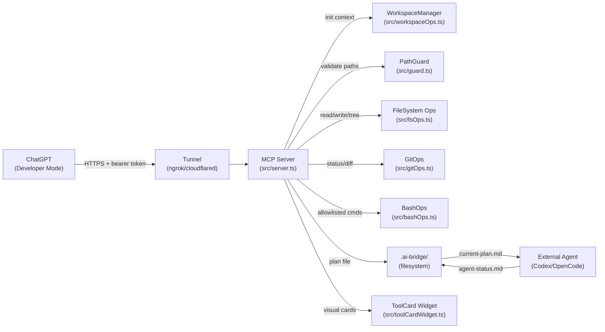

# Agentic AI Weekly Scan — 2026-06-22

## Executive Summary

- **`vercel/eve`** (2116★, tạo 2026-06-16) là framework TypeScript production-grade hiếm gặp trong repos mới: filesystem-first convention, durable minimal-projection sessions, và native OpenTelemetry — kiến trúc chín chắn hơn đa số agent frameworks hiện tại.
- **`cloudflare/security-audit-skill`** (254★, tạo 2026-06-18) giới thiệu pattern adversarial validation (agent phát hiện ≠ agent kiểm chứng) kết hợp semantic entrypoint→sink trace validation bằng code — novel methodology cho security eval trong agentic context.
- **`rebel0789/codexpro`** (639★, tạo 2026-06-16) implement MCP bridge đủ depth với 16 TypeScript modules, filesystem-based multi-agent handoff protocol (`.ai-bridge/`), và 3-level write mode — không phải wrapper mỏng mà là production tool với security model rõ ràng.

## Table of Contents

- [1. vercel/eve](#1-vercel-eve) — Filesystem-first durable agent framework
- [2. cloudflare/security-audit-skill](#2-cloudflare-security-audit-skill) — Multi-phase adversarial security audit skill
- [3. rebel0789/codexpro](#3-rebel0789-codexpro) — MCP bridge cho local coding agents

---

## 1. vercel/eve

**Link**: https://github.com/vercel/eve

### §1 — Quick Context

**One-line pitch**: Framework TypeScript cho backend AI agents durable, filesystem-first, tích hợp native OpenTelemetry và multi-sandbox trên Vercel infrastructure.

**Tech stack**: TypeScript 96.6%, Nitro 3.0-beta (HTTP server), Vercel AI SDK (Anthropic/OpenAI/Google), Zod, Vitest, Turbo monorepo, Node.js ≥24, pnpm

**Repo health**: 2116★ | 150 forks | 78 open issues | active (pushed 2026-06-22) | CI Vitest (unit/integration/scenario/e2e) | Apache-2.0 | public beta

---

### §2 — Architecture Deep-Dive

#### A. Component Inventory

- `Harness / Tool Loop` (`packages/eve/src/harness/tool-loop.ts`) — main ReAct execution loop, chạy `runStep()` cho mỗi iteration: hydrate → model call → tool dispatch
- `Compaction Engine` (`packages/eve/src/harness/compaction.ts`) — context window management, summarize older messages khi > 90% threshold
- `OTel Integration` (`packages/eve/src/harness/otel-integration.ts`) — OpenTelemetry spans per turn, nested qua `TURN_TRACE_STATE_KEY`
- `Execute Tool` (`packages/eve/src/harness/execute-tool.ts`) — thực thi từng tool call, error recovery 3-stage
- `Session Manager` (`packages/eve/src/execution/session.ts`) — tạo/rehydrate `HarnessSession` từ `DurableSession`
- `Durable Session Store` (`packages/eve/src/execution/durable-session-store.ts`) — persistent storage với migration support (`execution/durable-session-migrations/`)
- `Turn Workflow` (`packages/eve/src/execution/turn-workflow.ts`) — per-turn orchestration, bridge harness ↔ storage
- `Workflow Entry` (`packages/eve/src/execution/workflow-entry.ts`) — entry point nhận request từ channel
- `Subagent Tool` (`packages/eve/src/execution/subagent-tool.ts`) — spawn và delegate tới sub-agents với deterministic continuation token
- `Agent Graph` (`packages/eve/src/runtime/graph.ts`, `resolve-agent-graph.ts`) — resolve dependency graph giữa agents
- `Runtime / Tools` (`packages/eve/src/runtime/tools/`) — tool registry, dynamic resolution từ context storage
- `Sandbox` (`packages/eve/src/execution/sandbox/`) — code isolation (Docker, Vercel, MicroSandbox)
- `Channel` (`packages/eve/src/channel/`) — message integrations: Slack, Discord, GitHub, Telegram, Teams, Linear, Twilio
- `Protocol / Message` (`packages/eve/src/protocol/message.ts`) — typed message format chuẩn hóa
- `Eval Framework` (`packages/eve/src/evals/define-eval.ts`, `judge.ts`, `runner/`, `assertions/`) — eval-as-code infrastructure

#### B. Control Flow — ReAct-style Harness Loop với Durable State

Pattern: **ReAct harness loop** kết hợp **durable session** và **hierarchical subagent delegation**

1. Message vào qua `Channel` (HTTP/Slack/Discord/...) → `workflow-entry.ts` tiếp nhận
2. `session.ts` rehydrate (hoặc tạo mới) `DurableSession` từ `durable-session-store.ts`; rebuild `HarnessSession` (model config + tools + compaction threshold)
3. `turn-workflow.ts` khởi chạy harness loop
4. `tool-loop.ts::runStep()`: hydrate `eve-sandbox:` URI refs → gọi model qua AI SDK → nhận `tool_calls`
5. `execute-tool.ts` thực thi tools; nếu subagent cần → `subagent-tool.ts` spawn với deterministic token, route qua `workflow-entry.ts` recursively
6. Loop tiếp tục đến khi `final_output`, `schema fulfilled`, hoặc turn complete; nếu cần human-in-the-loop → park session
7. `projectToDurableSession()` serialize minimal state → `durable-session-store.ts`; response emit về channel

#### C. State & Data Flow

- **Message format**: typed `HarnessSession` (runtime, in-memory) → serialize thành `DurableSession` (minimal projection — chỉ giữ system prompt + compaction counters, bỏ tool metadata vì sẽ rebuild từ agent bundle mỗi turn)
- **Attachment scheme**: `eve-sandbox:` URI — references tồn tại trong history nhưng chỉ hydrate to bytes tại call time, tránh bloat session history
- **Context window**: threshold 90% model context window (fallback 100K tokens); `compaction.ts` truncate older messages về 280 chars + summarize tool calls thành `"Called toolName with input"` qua `generateText()`; repeat nếu vẫn over threshold

#### D. Tool / Capability Integration

- `defineTool()` với Zod schema — type-safe tại authoring time
- Filesystem convention: `tools/` directory trong agent folder → auto-discovered tại runtime qua `resolve-tool.ts`
- Dynamic tool resolution từ `context storage` (runtime pluggable)
- Tool approval gate: `getApprovedTools()` filter trước mỗi model call
- Function-calling native qua Vercel AI SDK (Anthropic, OpenAI, Google)
- Sandbox tools wrap code-mode execution với interrupt parking

#### E. Memory Architecture

- **Short-term**: `HarnessSession.messages` (in-memory, per process)
- **Long-term**: `DurableSession` trong `durable-session-store.ts` (persistent)
- **Compaction**: summarize messages cũ khi > 90% context threshold; recent window (mặc định 10 messages) preserved nguyên vẹn
- Vector DB: không xác định từ code (không có trong declared deps)

#### F. Model Orchestration

- `agent.ts` trong mỗi agent folder chỉ định model cụ thể (claude-sonnet-4-6, gpt-4o, gemini-2.0-flash...)
- Compaction model tách biệt — optional, có thể reuse turn model
- Subagent delegation với deterministic continuation tokens cho retry idempotency
- Provider-specific tool pinning cho gateway routing

#### G. Observability & Eval

- `otel-integration.ts`: OpenTelemetry spans nested per turn qua `TURN_TRACE_STATE_KEY` trên `session.state`
- `evals/`: full eval framework — `define-eval.ts` (eval config), `judge.ts` (LLM judge), `runner/` (test runner), `assertions/` (assertion library), `reporters/` (output formats)
- Vitest multi-config: unit, integration, scenario, e2e, Vercel-hosted

#### H. Extension Points

- Filesystem-first: thêm `tools/`, `skills/`, `channels/`, `schedules/` → auto-discovered, zero config
- Framework adapters: Next.js, Nuxt, SvelteKit, Vue, React exports trong package.json
- Custom sandbox: Docker, Vercel, MicroSandbox, hoặc custom implementation
- Approval workflow tools (built-in)

---

### §3 — Architecture Diagram

---

### §4 — Verdict

**Điểm novel**:
- Durable minimal-projection pattern: chỉ serialize system prompt + compaction counters, rebuild tool metadata từ `agent bundle` mỗi turn — tránh schema drift khi tool definition thay đổi giữa các deploys.
- `eve-sandbox:` URI hydration: attachments chỉ to bytes tại call time, không bloat session history — giải pháp thực tế cho long-running agents với nhiều file attachments.
- Eval-as-code (`evals/judge.ts`, `runner/`) first-class trong cùng repo — hiếm thấy ở agent framework mới.

**Red flags**: Node ≥24 (production risk — Node 24 released tháng 4/2025, nhiều server vẫn chạy 20/22); Nitro `3.0.260610-beta` — internal build date trong version string, không phải semver; 20+ subdirectories trong `src/harness` gợi ý risk of over-engineering; còn public beta (Vercel beta terms).

**Open questions**: `resolve-agent-graph.ts` gợi ý support agent topology graph — cyclic dependency handling thế nào? `evals/judge.ts` dùng model nào làm judge và cost control ra sao? Graceful degradation khi `durable-session-store` unavailable?

---

## 2. cloudflare/security-audit-skill

**Link**: https://github.com/cloudflare/security-audit-skill

### §1 — Quick Context

**One-line pitch**: Skill cho coding agent thực hiện security audit 6-phase với parallel Hunt Agents, adversarial validation, và machine-readable findings có semantic trace.

**Tech stack**: Markdown prompt files (SKILL.md pattern), Node.js zero-dependency (`validate-findings.cjs`), JSON Schema (`report-schema.json`), JavaScript

**Repo health**: 254★ | 23 forks | MIT | created 2026-06-18 | no CI | 8 files total

---

### §2 — Architecture Deep-Dive

#### A. Component Inventory

- `Orchestrator` (`SKILL.md`) — entry point, phase sequencer, agent delegation policy, triggered by audit keywords
- `Recon Agent` (`RECONNAISSANCE.md`) — Phase 1: map architecture, trust boundaries, input surfaces → tạo `architecture.md`
- `Hunt Agents` (`HUNTING.md`) — Phase 2: 3–12+ parallel `general` agents, mỗi agent cover một attack class × subsystem combination
- `Research Subagents` (spawned dynamically bởi Hunt Agents) — deep-dive focused via task tool
- `Validation Agents` (`VALIDATION-AND-REPORTING.md`) — Phase 3: cố disprove từng finding (khác team với hunters)
- `Report Generator` (`VALIDATION-AND-REPORTING.md`) — Phase 4–5: tổng hợp REPORT.md + FINDINGS-DETAIL.md + `findings.json`
- `Verification Agents` (`VALIDATION-AND-REPORTING.md`) — Phase 6: independent fact-check tất cả factual claims
- `Schema Validator` (`validate-findings.cjs`) — zero-dependency Node.js validator, semantic entrypoint→sink check
- `Report Schema` (`report-schema.json`) — single source of truth cho output format (confirmed + rejected verdicts)

#### B. Control Flow — Hierarchical Multi-Agent Pipeline với Adversarial Validation

Pattern: **Hierarchical pipeline** với role separation giữa hunter, validator, verifier

1. Coding agent detect từ khóa ("security audit", "find vulnerabilities", "pen-test") → load `SKILL.md`
2. Spawn Recon Agent: map codebase → ghi `architecture.md` (trust boundaries, input surfaces, component map)
3. Spawn 3–12 Hunt Agents **đồng thời trong cùng một message**: mỗi agent nhận attack class + subsystem scope + verbatim `architecture.md`
4. Hunt Agents tự spawn Research subagents khi cần deep investigation; results trả về qua task tool (không write files trực tiếp)
5. Validation Agents (khác Hunt Agents) nhận tất cả candidate findings → cố disprove từng cái với adversarial perspective
6. Report Generator tổng hợp confirmed/rejected → REPORT.md + FINDINGS-DETAIL.md + `findings.json`
7. `validate-findings.cjs` verify schema conformance + semantic trace (first item phải là `entrypoint`, last phải là `sink`)
8. Verification Agents độc lập verify factual claims trong source code; reconcile với findings

#### C. State & Data Flow

- **File-based communication**: `architecture.md` (Phase 1→2 bridge), `findings.json` (Phase 5→6 output)
- Agents communicate qua filesystem, không direct messaging hay shared memory
- **Finding format** (từ `report-schema.json`): JSON object với `verdict` (confirmed/rejected), `trace[]` (entrypoint→propagation→sink với file path + line number + scope), `severity: {likelihood, impact}` dùng thang `informational/low/medium/high/critical`, `root_cause` template: `"[function] in [file] does not [action], allowing [consequence]"`
- Rejected findings cũng structured (`verdict: "rejected"`, `reason`) → audit trail đầy đủ

#### D. Tool / Capability Integration

- Coding agent skill: không có tool definitions riêng, dùng tools của host agent (Claude Code, Cursor, etc.)
- Subagents spawned qua `task tool` của host coding agent
- `validate-findings.cjs` dùng `fs.readFileSync` + custom JSON Schema interpreter (zero npm deps)

#### E. Memory Architecture

Không có persistent memory giữa các runs. `architecture.md` là shared context in-run. Multiple runs expected để additive coverage (~50% findings per run, theo README).

#### F. Model Orchestration

- `research` agent: focused read-only fact verification, không spawn subagents
- `general` agent: broader investigation, có authority spawn focused research agents
- Quantity scaling: 3–4 agents cho small codebases, 8–12+ cho complex multi-subsystem apps

#### G. Observability & Eval

- Machine-readable `findings.json` với semantic trace (file path + line number) → tooling integration
- `validate-findings.cjs`: schema conformance check + semantic rule (trace[0].kind === "entrypoint", trace[last].kind === "sink")
- Severity model: likelihood × impact (không phải CVSS checklist hay audit deviation)
- Rejected findings documented → disproof ratio measurable

#### H. Extension Points

- Attack scope selection qua `ATTACK-CLASSES.md`
- Parallel agent count scalable theo codebase complexity
- Output schema extendable qua `report-schema.json`

---

### §3 — Architecture Diagram

---

### §4 — Verdict

**Điểm novel**: Adversarial validation với role separation — agent phát hiện ≠ agent kiểm chứng (khác context, không bị anchoring bias). Entrypoint→sink semantic trace validated bằng code (`validate-findings.cjs`), không phải manual review — machine-readable audit trail với line-level precision. Rejected findings có structured format riêng → disproof rate là metric đo được.

**Red flags**: Gần như không có code — 1 file `.cjs` khoảng 80 LOC là toàn bộ implementation; effectiveness phụ thuộc hoàn toàn vào underlying coding agent; "~50% per run" claim không có benchmark data trong repo; không có test suite cho chính skill này.

**Open questions**: Skill có tự theo dõi false negative rate qua nhiều runs không? Behavior với codebase >50K LOC khi Hunt Agents cần đọc toàn bộ source? Có thể integrate findings.json vào CI/CD pipeline như failing threshold không?

---

## 3. rebel0789/codexpro

**Link**: https://github.com/rebel0789/codexpro

### §1 — Quick Context

**One-line pitch**: MCP server Node.js biến ChatGPT Developer Mode thành coding agent có thể đọc, sửa, và verify repository local qua HTTPS tunnel.

**Tech stack**: TypeScript/Node.js 20+, MCP SDK (`@modelcontextprotocol/sdk`), ngrok/cloudflared tunnel, zero-dependency core

**Repo health**: 639★ | 59 forks | 5 open issues | MIT | created 2026-06-16 | pushed 2026-06-20 | GitHub Actions CI

---

### §2 — Architecture Deep-Dive

#### A. Component Inventory

- `MCP Server` (`src/server.ts`) — HTTP MCP server, conditional tool registration qua 3 modes, compat layer cho SDK versions
- `WorkspaceManager` (`src/workspaceOps.ts`) — workspace context initialization, path caching per root
- `PathGuard` (`src/guard.ts`) — path validation, blocked glob patterns, workspace boundary enforcement
- `BashOps` (`src/bashOps.ts`) — allowlist-based command execution policy (npm/git/lint allowed; pipes/redirects/destructive ops blocked)
- `FileSystem Ops` (`src/fsOps.ts`) — read (với line ranges), write (với diff reporting), edit (exact-match replacement), tree listing
- `GitOps` (`src/gitOps.ts`) — status, diff, log; `show_changes` unified view
- `SearchOps` (`src/searchOps.ts`) — regex + glob file search
- `ProContext` (`src/proContext.ts`) — bundle export cho offline agent planning (file tree + git state + diffs)
- `CodexSessions` (`src/codexSessions.ts`) — optional local Codex session transcript browsing
- `ToolCardWidget` (`src/toolCardWidget.ts`) — visual result cards (folded by default, expand on demand) cho ChatGPT UI
- `Redact` (`src/redact.ts`) — sensitive text masking trong tool results và structured output

#### B. Control Flow — MCP Bridge với Filesystem Agent Handoff Protocol

Pattern: **MCP server bridge** với optional **filesystem-based multi-agent handoff**

1. Tunnel (ngrok/cloudflared) expose `127.0.0.1:8787` → ChatGPT Developer Mode connect qua HTTPS với bearer token trong query param
2. `createCodexProServer()` init MCP server, register tools theo `CODEXPRO_TOOL_MODE` (minimal/standard/full)
3. ChatGPT gọi `open_current_workspace` → WorkspaceManager init context + cache workspace root
4. Agent read loop: `read`/`search`/`tree` → inspect code; PathGuard validate mọi path access
5. Agent write loop: `write`/`edit` → modify files (write mode enforcement); `bash` execute allowlisted commands; `show_changes` → GitOps diff summary
6. Optional handoff: `handoff_to_agent` ghi `.ai-bridge/current-plan.md` → external agent (Codex, OpenCode, custom) đọc + execute → ghi `.ai-bridge/agent-status.md` + `.ai-bridge/implementation-diff.patch` + `.ai-bridge/execution-log.jsonl`

#### C. State & Data Flow

- **Stateless server**: không có persistent session state trên server
- Workspace context cached per root path trong WorkspaceManager (in-memory, per process)
- **Agent handoff protocol**: file-based, `.ai-bridge/` directory là interface: `current-plan.md` (plan in), `agent-status.md` (status out), `implementation-diff.patch` (changes out), `execution-log.jsonl` (trace out)
- Tool results: `{content: [{type, text}], structuredContent, _meta: {widget_uri}, isError}` — consistent schema, redaction via `redact.ts`

#### D. Tool / Capability Integration

- MCP native (HTTP transport, spec-compliant)
- `registerCodexTool()` với conditional registration via `shouldRegisterTool(config, toolName)`
- 3 capability modes: minimal (~6 tools), standard (~10 tools), full (~16+ tools)
- `registerToolCompat()` wrap tất cả handlers: error handling + performance logging + multi-SDK version compat
- Tool results include `_meta.widget_uri` → ChatGPT render `toolCardWidget` cho compact display

#### E. Memory Architecture

Không có long-term memory. Skill discovery at runtime: load `SKILL.md` từ workspace → user → plugin dirs với byte limit. `.ai-bridge/` directory là semi-persistent planning state giữa agents.

#### F. Model Orchestration

Bridge-only: không orchestrate models. Agnostic — ChatGPT, Codex, OpenCode, hoặc bất kỳ MCP client nào đều dùng được cùng server.

#### G. Observability & Eval

- `CODEXPRO_LOG_TOOL_CALLS=1`: log performance metrics per tool call
- Structured `isError` flag trong mọi tool response
- `redact.ts` mask sensitive content trong logs (API keys, tokens, private paths)

#### H. Extension Points

- `CODEXPRO_TOOL_MODE` environment variable (minimal/standard/full)
- Handoff protocol mở: bất kỳ agent nào đọc/ghi được `.ai-bridge/` files
- Tunnel provider swappable (ngrok, cloudflared, local mode)
- Write mode (`CODEXPRO_WRITE_MODE`): `off`/`handoff`/`full` — progressive trust escalation

---

### §3 — Architecture Diagram

---

### §4 — Verdict

**Điểm novel**: Filesystem-based multi-agent handoff protocol (`.ai-bridge/`) là approach low-friction để chain heterogeneous agents (ChatGPT → Codex → OpenCode) mà không cần shared API hay message broker — bất kỳ agent nào đọc được file đều tích hợp được. `ToolCardWidget` với fold/unfold default giải quyết context bloat thực tế trong chat UI. 3-level write mode (`off`/`handoff`/`full`) cho phép progressive trust escalation khi deploy trong môi trường khác nhau.

**Red flags**: Bearer token trong query parameter của public tunnel URL — exposed trong server logs, ngrok dashboard, và HTTP access logs; security risk thực sự. Không có rate limiting trên MCP server. Phụ thuộc ChatGPT Developer Mode availability (platform-specific, có thể bị deprecated). `watch-handoff` mechanism không rõ polling strategy.

**Open questions**: Khi tunnel reconnect sau network drop, workspace context cache có invalidate không? Có thể chain >2 agents qua `.ai-bridge/` không (ChatGPT → Codex → verification agent → merge)? Bearer token rotation strategy là gì?

---

*Scan generated: 2026-06-22 | Repos covered: 3 | Excluded: Forsy-AI/agent-apprenticeship (no src/ directory, zero code files — data/protocol spec only)*
