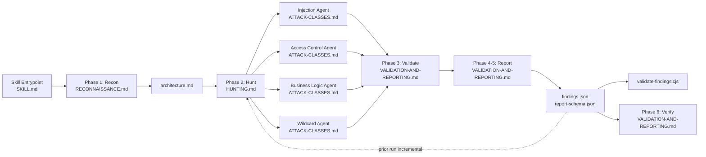
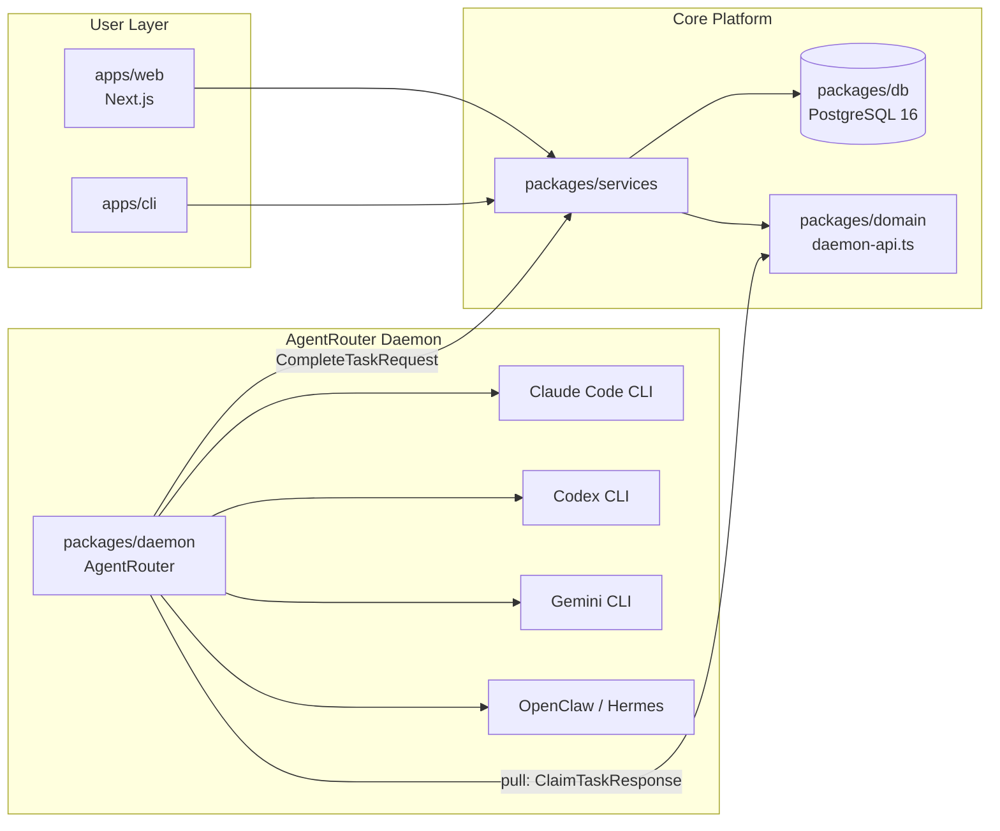
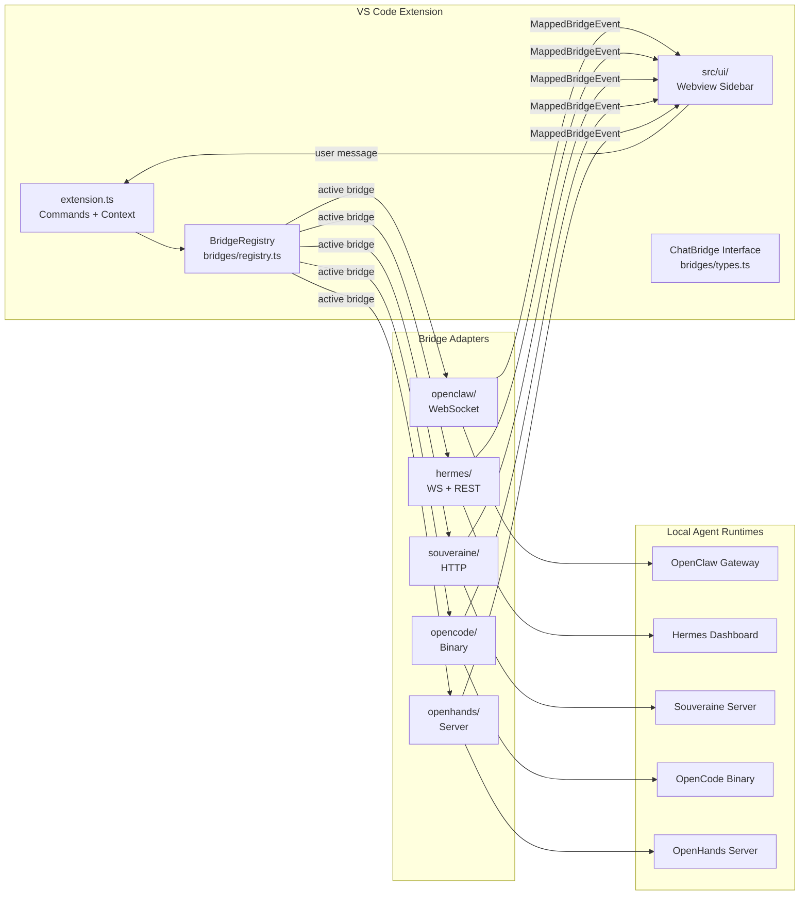

# Weekly Agentic AI Scan — 2026-06-23

> Kỳ quét: 2026-06-16 → 2026-06-23 | Nguồn: GitHub search `agent/multi-agent/agentic created:>2026-06-16 stars:>200`

---

## Executive Summary

- **Cloudflare** công bố `security-audit-skill`: pipeline 6-pha có adversarial validation thực sự (agent riêng biệt cố *bác bỏ* từng finding) — pattern eval này đáng học nhất tuần.
- **HKUDS** (Hong Kong Univ.) ra `AgentSpace`: monorepo production-grade với pull-based task claiming, PostgreSQL governance, và AgentRouter chuẩn hóa 5 provider khác nhau — approach multi-tenant agent deployment đáng xem.
- **Plaer1/junction** và **Forsy-AI/agent-apprenticeship** bổ sung hai góc khác: multi-bridge abstraction tại editor-layer và data standard cho shared learning signals — cả hai đều ở giai đoạn sớm nhưng concept rõ ràng.

---

## Table of Contents

1. [cloudflare/security-audit-skill](#1-cloudflare--security-audit-skill) — pipeline bảo mật đa pha với adversarial validation
2. [HKUDS/AgentSpace](#2-hkuds--agentspace) — workspace tích hợp human+agent với pull-based governance
3. [Plaer1/junction](#3-plaer1--junction) — VS Code multi-bridge client cho local coding agents
4. [Forsy-AI/agent-apprenticeship](#4-forsy-ai--agent-apprenticeship) — ecosystem chuẩn hóa shared learning signals

---

## 1. cloudflare / security-audit-skill

**Link**: https://github.com/cloudflare/security-audit-skill
**Created**: 2026-06-18 | **Stars**: 395 | **Org**: Cloudflare

---

### §1 — Quick Context

Biến coding agent thành security auditor có hệ thống qua 6 pha, kết quả được một agent độc lập xác minh.

- **Stack**: JavaScript (Node.js validator), Markdown prompt files, JSON Schema — không có runtime framework
- **Models**: Không prescribe; yêu cầu host agent hỗ trợ parallel sub-agents và tool use
- **Health**: 395 stars, 33 forks, org = Cloudflare, last push 2026-06-18, không có CI workflows, size 24 KB

---

### §2 — Architecture Deep-Dive

#### A. Component Inventory

| Component | File / Path | Vai trò |
|-----------|-------------|---------|
| Skill Entrypoint | `SKILL.md` | Activation prompt, core principles, workflow overview |
| Phase 1: Recon | `RECONNAISSANCE.md` | Prompt template: map architecture + input surfaces → `architecture.md` |
| Phase 2: Hunt | `HUNTING.md` | Orchestration instructions: spawn 3–12 parallel agents, 12-angle methodology |
| Attack Classes | `ATTACK-CLASSES.md` | 10 attack-class sub-agent prompts (injection, access control, crypto, business logic, wildcard…) |
| Phases 3–6 | `VALIDATION-AND-REPORTING.md` | Validate → Report → Structured Output → Independent Verify |
| Output Schema | `report-schema.json` | JSON Schema: 2 types — `confirmed` (với trace, execution, severity) hoặc `rejected` (với reason) |
| Schema Validator | `validate-findings.cjs` | Node.js script chạy AJV/JSON Schema validate `findings.json` |

#### B. Control Flow — Planner-Executor với Parallel Execution trong Phase 2

Pattern: **Planner-executor (plan trước, execute song song, validate độc lập)**

```
1. Coding agent nhận activation ("security audit this codebase")
2. Phase 1 — Recon: agent đọc codebase, sinh architecture.md (trust boundaries, input surfaces)
3. Phase 2 — Hunt: agent spawn 3–12 parallel sub-agents qua Task tool;
   mỗi sub-agent nhận: architecture.md + attack class scope + file paths
4. Phase 3 — Validate: sub-agent mới (không phải hunter gốc) CỐ BÁC BỔ từng finding
5. Phase 4–5 — Report: consolidate → REPORT.md + findings.json (schema-validated)
6. Phase 6 — Verify: fresh agent cross-check mọi factual claim so với source code
```

Số lượng hunters scale theo độ phức tạp: 3–4 với small library, 8–12+ với large application split theo cả attack class lẫn subsystem.

#### C. State & Data Flow

- **architecture.md**: Unstructured Markdown, được pass verbatim vào Phase 2 context
- **Hunter output**: Unstructured per-agent reports (không typed)
- **findings.json**: Strongly typed JSON — `confirmed` variant bắt buộc có `trace[]` (mỗi bước có `kind`, `file`, `line`, `scope`), `conditions[]`, `execution` (payloads + steps), `severity` (likelihood × impact), `confidence`; `rejected` variant có `reason`
- **Incremental state**: Prior `findings.json` được đọc đầu mỗi run để skip known findings → pseudo-memory cho multi-run coverage

#### D. Tool / Capability Integration

- Không có tool-calling code trong skill files — hoàn toàn relying on host agent's file-reading tools
- `validate-findings.cjs`: post-generation validation chạy ngoài agent loop (Node.js, command-line)
- Không có sandbox; code analysis là read-only

#### E. Memory Architecture

Không có short/long-term memory infrastructure riêng. Incremental coverage qua `findings.json` persistence: mỗi run đọc file từ run trước → tránh redundant findings → effective coverage tracking across sessions.

#### F. Model Orchestration

- Không prescribe model nào cho role cụ thể
- Tất cả 10 hunters và validator đều là `general` subagent type
- Không có evidence về frontier-vs-small model split từ code

#### G. Observability & Eval

- **Adversarial validation** (Phase 3): agent riêng biệt cố disprove findings — đây là eval hook thực sự, không phải self-assessment
- **Schema compliance**: `validate-findings.cjs` cung cấp machine-readable correctness check
- **Anti-patterns explicit**: SKILL.md liệt kê các pattern cần reject (OWASP checklist padding, "potential" claims không có proof)
- Không có distributed tracing hay structured logging

#### H. Extension Points

- Thêm attack vector: sửa `ATTACK-CLASSES.md` thêm sub-agent prompt mới
- Custom severity model: sửa schema trong `report-schema.json`
- Prior findings: `findings.json` path configurable → có thể integrate với issue tracker

---

### §3 — Architecture Diagram



---

### §4 — Verdict

**Điểm novel**: Adversarial validation là phần đáng học nhất — việc giao cho một agent *hoàn toàn khác* nhiệm vụ bác bỏ finding (thay vì self-review) giảm confirmation bias một cách có hệ thống. Schema `confirmed/rejected` với `trace[]` code-path là eval contract rõ ràng hơn hầu hết framework có eval. Incremental coverage qua prior findings.json là simple nhưng effective.

**Red flags**: Toàn bộ là prompt-driven, không có execution engine — chất lượng output hoàn toàn phụ thuộc vào host agent và model chất lượng. Phase 2 unstructured output (hunter reports không có schema) là bottleneck: Phase 3 validator phải "hiểu" output tự do từ hunters, tạo ra inconsistency risk.

**Open questions**: Làm sao đo coverage thực sự qua nhiều run? findings.json dedup có tránh được semantically-same-but-differently-worded findings không? Skill có work tốt với agents không support Task-tool-based parallelism (e.g. sequential-only agents)?

---

## 2. HKUDS / AgentSpace

**Link**: https://github.com/HKUDS/AgentSpace
**Created**: 2026-06-22 | **Stars**: 258 | **Org**: HKUDS (HK Univ. Data Systems Lab)

---

### §1 — Quick Context

Workspace cộng tác production-grade cho human+agent teams với pull-based task dispatch và centralized governance.

- **Stack**: TypeScript (92.5%), Next.js (web UI), PostgreSQL 16, Node.js 24; AgentRouter normalize: Claude Code, Codex, Gemini, OpenClaw, Hermes
- **Infra**: systemd daemon, nginx, PostgreSQL — có `deploy/` scripts đầy đủ
- **Health**: 258 stars, 26 forks, 4 open issues, org = HKUDS, last push 2026-06-22, không thấy CI workflows

---

### §2 — Architecture Deep-Dive

#### A. Component Inventory

| Component | File / Path | Vai trò |
|-----------|-------------|---------|
| Domain Model | `packages/domain/src/workspace.ts` | Workspace entity: top-level organizational boundary |
| Collaboration | `packages/domain/src/collaboration.ts` | Collaborative session model giữa agents + humans |
| Channel Doc Runs | `packages/domain/src/channel-document-runs.ts` | Per-document agent run tracking |
| Mentions | `packages/domain/src/mentions.ts` + `mention-plan.ts` | Cross-agent referencing system |
| Daemon API Contract | `packages/domain/src/daemon-api.ts` | Pull-based task claiming: `ClaimedDaemonTask`, `DaemonTaskInputBundle`, `CompleteTaskRequest` |
| Daemon Provider | `packages/domain/src/daemon-provider.ts` | `RuntimeProviderHealth` — per-provider health + error codes |
| Agent Templates | `packages/domain/src/agent-templates.ts` | Reusable agent configuration definitions |
| AgentRouter / Daemon | `packages/daemon/src/` | Provider CLI execution, HTTP client, I/O bundle management |
| Database Layer | `packages/db/` | PostgreSQL 16 persistence (runs, collab, channels, workspaces) |
| Services | `packages/services/` | Business logic layer |
| Web UI | `apps/web/` | Next.js workspace — digital employee board, channels, task boards |
| CLI | `apps/cli/` | Local control interface |
| Deploy | `deploy/` | systemd unit, nginx config, PostgreSQL scripts, daemon binary |

#### B. Control Flow — Hierarchical với Pull-Based Task Claiming

Pattern: **Hierarchical (web platform → service layer → daemon/AgentRouter → provider CLI)**

```
1. Human submits task qua apps/web (Next.js) hoặc apps/cli
2. Task stored vào PostgreSQL qua packages/services + packages/db
3. AgentRouter daemon polls server: ClaimTaskResponse trả về một task hoặc null (pull model)
4. Daemon nhận DaemonTaskInputBundle: prompt + runtime metadata + tool permissions
   + router_session_context (để continuation/fallback)
5. AgentRouter chọn provider (Claude/Codex/Gemini/OpenClaw/Hermes),
   exec provider CLI, stream output
6. Agent hoàn thành → daemon gửi CompleteTaskRequest:
   output text + session tracking + working directory + output bundle (files)
7. Services layer cập nhật PostgreSQL, UI phản chiếu trạng thái
```

Human approval gates được inject tại Step 5 cho sensitive operations (app install/update/uninstall).

#### C. State & Data Flow

- **Task format**: TypeScript typed interfaces (`ClaimedDaemonTask`, `DaemonTaskInputBundle`) — strongly typed, không phải dict
- **State storage**: PostgreSQL 16 — persistent across restarts; tracks workspace, channels, collaboration, agent runs
- **Context continuation**: `router_session_context` field trong DaemonTaskInputBundle cho phép resume task across provider switch
- **Mention system**: `mentions.ts` + `mention-plan.ts` — cross-agent referencing (agent A có thể mention/hand-off sang agent B)

#### D. Tool / Capability Integration

- `RuntimeToolCapability`: allowlist-based shell pattern control — mỗi agent/workspace có set of allowed shell patterns
- App operations (install/update/uninstall) có riêng claim/dispatch flow với approval workflow
- Approval gates built into dispatch flow trước khi execute sensitive actions
- Không có sandbox abstraction rõ ràng từ code (`packages/sandbox/` tồn tại nhưng nội dung không inspect được)

#### E. Memory Architecture

- Short-term: Không xác định từ code (router_session_context suggest có session continuity)
- Long-term: PostgreSQL stores channel-document-runs → effective run history per document
- Không có vector retrieval hay RAG trong evidence hiện có

#### F. Model Orchestration

- AgentRouter normalize 5 providers: Claude Code, Codex, Gemini, OpenClaw, Hermes — unified interface
- `RuntimeProviderHealth` track per-provider health + error codes: `provider.timeout`, `provider.rate_limited` → implies retry/fallback logic
- Không có evidence về role-based model assignment (planner vs executor dùng model khác nhau) từ code

#### G. Observability & Eval

- Audit trail: README mô tả "every action has a boundary, a record, and an owner" — PostgreSQL làm audit log
- Structured error codes trong daemon API (`provider.timeout`, `provider.rate_limited`)
- Không thấy OpenTelemetry hay Langfuse trong evidence

#### H. Extension Points

- Thêm provider: implement provider CLI adapter trong `packages/daemon/src/`
- Custom agent: `packages/domain/src/agent-templates.ts`
- Tool permissions: configure shell patterns per workspace/agent
- Self-hosted: `deploy/` scripts cho toàn bộ infra

---

### §3 — Architecture Diagram



---

### §4 — Verdict

**Điểm novel**: Pull-based task claiming (daemon poll thay vì push) là thiết kế thực dụng cho môi trường heterogeneous — daemon bị rate-limit hay timeout không block server. `router_session_context` cho phép cross-provider session continuity là elegant. HKUDS có nền research mạnh (GraphRAG, LightRAG) nên khả năng cao có paper hoặc technical writeup đi kèm sớm.

**Red flags**: Repo vừa tạo ngày 22/6 (1 ngày trước scan) — architecture rõ ràng nhưng codebase chưa mature. Mention system (`mentions.ts`, `mention-plan.ts`) chưa rõ cách agent A thực sự trigger agent B — có thể chỉ là UI reference chưa có execution backend. `packages/sandbox/` tồn tại nhưng không có evidence về isolation implementation.

**Open questions**: Mention-plan có trigger actual agent execution không hay chỉ là UI annotation? AgentRouter fallback mechanism hoạt động như thế nào khi provider primary bị `rate_limited`? Approval gates được implement ở daemon hay service layer?

---

## 3. Plaer1 / junction

**Link**: https://github.com/Plaer1/junction
**Created**: 2026-06-17 | **Stars**: 526 | **Maintainer**: Plaer1

---

### §1 — Quick Context

VS Code extension thống nhất 7 local AI coding agents sau một ChatBridge interface chuẩn hóa, cho phép switch backend không đổi workflow.

- **Stack**: TypeScript, VS Code Extension API, WebSocket + HTTP; backends: OpenClaw, Hermes, Souveraine, MiMoCode, Goose, OpenCode, OpenHands
- **Models**: Phụ thuộc backend; bridge expose `listModelChoices()` + reasoning support flag
- **Health**: 526 stars, 8 forks, 1 contributor (Plaer1), last push 2026-06-17, không có CI

---

### §2 — Architecture Deep-Dive

#### A. Component Inventory

| Component | File / Path | Vai trò |
|-----------|-------------|---------|
| Extension Entry | `src/extension.ts` | Activate, register commands, context tracking, status bar |
| Bridge Interface | `src/bridges/types.ts` | `ChatBridge` (extends EventEmitter), `BridgeCapabilities`, `HistoryMessage`, `HistoryPart`, `MappedBridgeEvent` |
| Bridge Registry | `src/bridges/registry.ts` | `BridgeRegistry` (extends EventEmitter): multi-bridge manager, active/configured state, fallback |
| HTTP Utilities | `src/bridges/http.ts` | Shared HTTP client utilities |
| OpenClaw Bridge | `src/bridges/openclaw/` | WebSocket gateway adapter với session + model management |
| Hermes Bridge | `src/bridges/hermes/` | Native WebSocket dashboard + REST API adapter |
| Souveraine Bridge | `src/bridges/souveraine/` | HTTP server adapter với managed runtime spawning |
| MiMoCode Bridge | `src/bridges/mimocode/` | MiMo server adapter (auto-spawn hoặc pre-configured) |
| Goose Bridge | `src/bridges/goose/` | Data directory + secret key config adapter |
| OpenCode Bridge | `src/bridges/opencode/` | Binary path + config home adapter |
| OpenHands Bridge | `src/bridges/openhands/` | Server launcher + home directory adapter |
| Workspace Context | `src/context/` | File/selection injection vào chat thread |
| UI | `src/ui/` | Webview sidebar (chat, markdown rendering, tool call cards) |

#### B. Control Flow — Event-Driven Multi-Bridge

Pattern: **Event-driven với single active bridge**

```
1. User type message trong VS Code chat sidebar (webview trong src/ui/)
2. Webview gửi message → extension.ts → BridgeRegistry.active.sendChatMessage()
3. Active ChatBridge translate sang backend-specific protocol
   (WebSocket frame / HTTP POST tuỳ bridge)
4. Backend stream response; bridge normalize → emit MappedBridgeEvent
5. Extension relay event → webview render (reasoning/text/toolCall parts inline)
6. User có 3 follow-up modes: queue (chờ agent xong), steer (inject mid-turn), interrupt+redirect
```

#### C. State & Data Flow

- **Message format in**: `HistoryMessage` (normalized) với parts: `reasoning | text | toolCall` — covers thinking tokens, streaming, tool invocations
- **Message format out**: Bridge-specific wire format (WebSocket JSON frame / HTTP body per backend)
- **State storage**: In-memory + VS Code extension state; không có persistent DB
- **Session management**: Per-bridge sessions via `createChat()`, `listSessions()`, `renameSession()`, `setActiveSession()` — sessions không shared cross-bridge

#### D. Tool / Capability Integration

- `BridgeCapabilities` interface: declare what each bridge supports — `sessions`, `models`, `agents`, `steering`, `usage`, `tools`
- `getToolStatus()` report tool availability per active bridge
- Không có direct LLM tool-calling trong extension; proxied entirely to backend agents
- Graceful degradation: features absent từ `BridgeCapabilities` bị hide trong UI

#### E. Memory Architecture

- `getSessionHistory()` fetch per-session history từ backend
- Không có long-term memory hay vector retrieval trong extension
- Cross-bridge history: không shared — mỗi bridge giữ session riêng

#### F. Model Orchestration

- `listModelChoices()` / `selectModelChoice()` expose backend's available models với reasoning support flag
- `BridgeRegistry.listEnvironmentChoices()` expose bridge list như "environment" menu
- Single active bridge tại một thời điểm — không có multi-bridge fan-out hay load balancing

#### G. Observability & Eval

- Logger với file output được init trong `extension.ts`
- Connection state events: `connected` / `disconnected` / `pairingRequired` → status bar update
- Không có distributed tracing hay metrics

#### H. Extension Points

- Thêm backend: implement `ChatBridge` interface (types.ts) + tạo subdirectory mới trong `src/bridges/` + register vào `BridgeRegistry`
- `BridgeCapabilities` cho phép partial implementation — không cần support tất cả features

---

### §3 — Architecture Diagram



---

### §4 — Verdict

**Điểm novel**: `ChatBridge` interface với `BridgeCapabilities` capability matrix là cách tiếp cận clean để abstract 7 backends rất khác nhau (WebSocket vs HTTP vs binary spawn vs managed runtime). `HistoryMessage` với `reasoning | text | toolCall` parts là normalized format tốt cho streaming + thinking tokens. Follow-up modes (queue/steer/interrupt) implement user control at editor-layer.

**Red flags**: Single-contributor repo, không có CI, không có tests visible. `src/checkpoints/` directory tồn tại nhưng không rõ purpose (không inspect được từ data hiện có). Cross-bridge session history không shared — nếu user switch bridge, conversation context bị mất.

**Open questions**: `injectMessage()` method trong `ChatBridge` làm gì chính xác — admin injection hay test hook? `watchSession()` / `unwatchSession()` "optional transport-level scoping" có nghĩa là gì trong practice? `src/checkpoints/` directory chứa gì?

---

## 4. Forsy-AI / agent-apprenticeship

**Link**: https://github.com/Forsy-AI/agent-apprenticeship
**Created**: 2026-06-19 | **Stars**: 694 | **Org**: Forsy-AI

---

### §1 — Quick Context

Ecosystem chuẩn hóa chia sẻ learning signal giữa các AI agents — định nghĩa schema cho trace, mentor checkpoint, và contribution bundle.

- **Stack**: JSON Schema (primary artifact), seed dataset (17MB, chủ yếu data); CLI via `npx agent-apprenticeship init` (binary không trong repo)
- **Supported agents**: Codex, Cursor, Claude Code, OpenClaw, OpenCode, Hermes, custom
- **Health**: 694 stars, 46 forks, org = Forsy-AI, last push 2026-06-20, không có CI; 17MB (bulk là seed_dataset)

---

### §2 — Architecture Deep-Dive

#### A. Component Inventory

| Component | File / Path | Vai trò |
|-----------|-------------|---------|
| Seed Task Schema | `schemas/seed_task.schema.json` | Format cho task: bundle_id, title, status, domains, trace_count, learning_signals_path |
| Contribution Bundle Schema | `schemas/contribution_bundle.schema.json` | Format bundle: contribution_manifest + artifacts[], traces[], outputs[], mentor_checkpoints[], follow_ups[] |
| Ecosystem Submission Schema | `schemas/ecosystem_submission.schema.json` | Format để publish bundle lên ecosystem |
| Seed Dataset | `seed_dataset/` | 500+ tasks, 495 lessons, 1000+ execution traces — data artifact |
| Ecosystem Index | `ecosystem/index.json` + `ecosystem/index.jsonl` | Dual-format bundle registry (JSON + JSONL) |
| Bundle Registry | `ecosystem/bundles/` | Shared bundle storage |
| Contributions Hub | `ecosystem/contributions/` | Community contribution staging |
| Submissions | `ecosystem/submissions/` | Pre-publish submission staging |

#### B. Control Flow — Data Standard, Không Có Execution Engine Trong Public Repo

Pattern: Không xác định rõ ràng từ code — đây là **data exchange protocol**, không phải execution framework.

Theo README, intended flow:
```
1. npx agent-apprenticeship init (CLI binary không trong repo)
2. Agent thực hiện task từ seed_dataset theo seed_task schema
3. Agent tạo traces, artifacts, outputs → đóng gói theo contribution_bundle schema
4. Bundle submit qua ecosystem_submission schema
5. Mentor review qua mentor_checkpoints[] (model-assisted / expert-led / hybrid)
6. Bundle publish vào ecosystem/bundles + update index.json/jsonl
```

Không có execution code, orchestration engine, hay API trong public repo.

#### C. State & Data Flow

- **Format**: JSON (strongly typed theo JSON Schema Draft 2020-12)
- **Storage**: File-based — index.json/jsonl + bundle directories; không có database hay API
- **Learning signals path**: Field `learning_signals_path` trong seed_task schema trỏ tới data; structure của learning signal data không inspect được từ public code

#### D. Tool / Capability Integration

Không xác định từ code — execution logic không có trong public repo.

#### E. Memory Architecture

Không xác định từ code.

#### F. Model Orchestration

Không xác định từ code. README liệt kê 3 mentor modes (model-assisted, expert-led, hybrid) nhưng implementation không public.

#### G. Observability & Eval

- `trace_count` và `attempt_count` fields trong seed_task schema — quantitative tracking
- `mentor_checkpoints[]` array trong contribution_bundle — qualitative quality gates
- Không có automated eval infrastructure trong public code

#### H. Extension Points

- `additionalProperties: true` trong tất cả schemas — domain-specific extensions được phép
- Custom agent support qua ecosystem_submission schema

---

### §3 — Architecture Diagram

**Insufficient evidence for diagram** — repo chủ yếu là JSON schemas và seed data; không có execution engine hay inter-component code paths để diagram. Các component trong §2.A là data format definitions, không phải runtime entities.

---

### §4 — Verdict

**Điểm novel**: Concept về **shared training signal ecosystem** có giá trị thực sự — nếu nhiều agents cùng contribute traces từ real-world tasks vào một shared index, đây là data flywheel cho post-training. `contribution_bundle` schema với `mentor_checkpoints[]` gợi ý human-in-the-loop quality gate trước khi learning signal được propagate — đây là pattern phòng tránh signal poisoning.

**Red flags**: 694 stars nhưng public repo gần như trống — CLI binary, execution engine, và actual learning signal pipeline đều không public. "Agent học từ shared traces" là claim lớn nhưng không có code để verify. Có thể là concept/marketing repo hơn là actual implementation.

**Open questions**: CLI binary (`npx agent-apprenticeship init`) làm gì thực sự? Learning signals có được dùng cho actual fine-tuning hay chỉ là context injection? Mentor checkpoint verification được implement như thế nào — human manual review hay automated?

---

*Scan generated: 2026-06-23 | Next scan: 2026-06-30*
