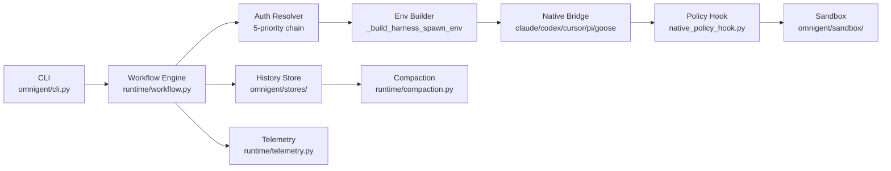
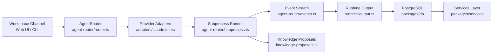
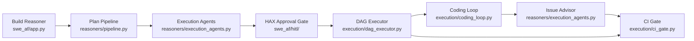

# Weekly Agentic AI Scan — 2026-06-24

> Tuần 2026-06-17 → 2026-06-24 | Scout: Claude Sonnet 4.6

---

## Executive Summary

- **Meta-harness là pattern nổi bật tuần này**: Cả `omnigent` lẫn `AgentSpace` đều giải quyết cùng bài toán — normalize nhiều agent CLIs (Claude Code, Codex, OpenClaw, Hermes) sau một interface thống nhất — nhưng ở hai tầng khác nhau: `omnigent` focus vào runtime isolation và policy governance ở process level, còn `AgentSpace` build một organizational workspace với persistent identity và audit trail cho "digital employees".
- **SWE-AF cung cấp blueprint production-grade cho SWE agent**: 3 nested control loops (inner retry → issue advisor → dag replanner), DAG-level parallelism với git worktree isolation, và shared-memory continual learning within a build. Case study PR #179 với concrete cost metrics ($19.23, 79 invocations) là rare evidence trong landscape đầy benchmark-washing.
- **Loại trừ**: `Forsy-AI/agent-apprenticeship` (870 stars, created 2026-06-19) có concept thú vị (collective training signal exchange từ real tasks) nhưng **không pass filter** — repo không có `/src` hoặc `/docs` directory, toàn bộ là data schemas và seed dataset, không có runnable code.

---

## Table of Contents

1. [omnigent-ai/omnigent](#repo-1-omnigent-aiomnigent) — Meta-harness thống nhất nhiều AI agent CLI với policy governance
2. [HKUDS/AgentSpace](#repo-2-hkudsagentspace) — Workspace tổ chức coi AI agents là "digital employees"
3. [Agent-Field/SWE-AF](#repo-3-agent-fieldswe-af) — Fleet agent tự động build software với adaptive DAG execution

---

## Repo 1: omnigent-ai/omnigent

> https://github.com/omnigent-ai/omnigent

### §1 — Quick Context

**One-line pitch**: Meta-harness Python unifying Claude Code, Codex, Cursor, Goose, OpenCode, Pi sau một orchestration layer với policy enforcement và multi-sandbox isolation.

**Tech stack core**: Python 3.12, FastAPI/Starlette, SQLAlchemy 2.0, OpenTelemetry (OTLP), MCP 1.x, Claude Agent SDK ≥0.1.62, OpenAI Agents SDK ≥0.0.17, CEL (Common Expression Language) cho policies; `uv` package manager; macOS `seatbelt` / Linux `bubblewrap` / Modal / E2B / Daytona sandbox backends.

**Repo health**: 4,608 stars | pushed 2026-06-24 (active) | pre-commit hooks, pytest, pytest-playwright, mypy | CONTRIBUTING.md, SECURITY.md, RELEASING.md | 263 open issues (active community).

---

### §2 — Architecture Deep-Dive

**A. Component Inventory**

- `Workflow Engine` (`omnigent/runtime/workflow.py`, 107.9KB) — orchestrator chính: auth resolution, spawn coordination, compaction triggering, policy gate.
- `Harness Auth Builders` (`omnigent/runtime/workflow.py`: `_build_claude_sdk_spawn_env`, `_build_codex_spawn_env`, `_build_pi_spawn_env`, `_build_openai_agents_sdk_spawn_env`) — per-harness env-var construction, không mutate `os.environ`.
- `Native Bridges` (`omnigent/claude_native.py`, `omnigent/claude_native_bridge.py`, `omnigent/codex_native.py`, `omnigent/codex_native_bridge.py`, `omnigent/cursor_native.py`, `omnigent/opencode_native.py`, `omnigent/pi_native.py`, `omnigent/goose_native.py`) — per-harness subprocess lifecycle và stdout/stderr parsing.
- `Policy Hook` (`omnigent/native_policy_hook.py`) — intercept tool calls trước execution, enforce CEL expressions.
- `Sandbox Layer` (`omnigent/sandbox/`) — abstraction trên macOS seatbelt, Linux bubblewrap, Modal, E2B, Daytona, cwsandbox.
- `History Store` (`omnigent/stores/`) — SQLAlchemy-backed conversation persistence.
- `Compaction Engine` (`omnigent/runtime/compaction.py`, 32.6KB) — context window management với `_LoadedHistory` tracking compaction boundary.
- `Telemetry` (`omnigent/runtime/telemetry.py`, 24.1KB) — OpenTelemetry instrumentation với OTLP gRPC/HTTP exporters.
- `LLM Retry` (`omnigent/runtime/llm_retry.py`, 12.6KB) — retry với backoff cho LLM calls.
- `Server` (`omnigent/server/`) — FastAPI server cho web UI (`ap-web/`) và team collaboration.
- `CLI` (`omnigent/cli.py`) — entry point; `omnigent/cli_sandbox.py` cho sandbox diagnostics.
- `Session Lifecycle` (`omnigent/session_lifecycle.py`) — session state machine.
- `Model Catalog` (`omnigent/model_catalog.py`) — model family validation trước spawn.

**B. Control Flow — Event-Driven với 5-level auth priority chain**

1. User invokes `omnigent` CLI (`cli.py`) → parse agent spec từ YAML hoặc conversational description
2. `_resolve_provider_for_build()` trong `workflow.py` chạy auth priority chain: spec `ProviderAuth` → explicit `spec.executor.auth` → legacy `spec.executor.profile` → global `~/.omnigent/config.yaml` → ambient env vars (5 levels, silent shadowing prevented)
3. `_build_*_spawn_env()` constructs harness-specific `dict[str, str]` — env vars injected vào subprocess, không touch `os.environ`
4. Subprocess spawned qua corresponding native bridge; stdout/stderr parsed per-harness
5. Tool call emitted → `native_policy_hook.py` evaluates CEL expressions (spend cap, tool limits, custom rules) → approved or rejected tại policy gate
6. Approved tool → executes trong sandbox (seatbelt/bubblewrap/cloud); result streamed back via `session_stream.py`
7. Token counter monitors context size → `compaction.py` triggers summarization khi threshold hit; `_LoadedHistory.last_compaction_created_at` tracks boundary, next load O(recent) not O(total)

**C. State & Data Flow**

- Message format: `ConversationItem` typed schema (Pydantic v2) trong `omnigent/entities/`
- State storage: SQLAlchemy ORM — SQLite cho local single-user, PostgreSQL cho team deployment; `stores/` manages reads/writes
- Context window: Compaction-aware loading — chỉ load items sau `last_compaction_created_at`, tránh O(total) reload; `_LoadedHistory` frozen dataclass bundles items + compaction metadata

**D. Tool / Capability Integration**

- MCP 1.x protocol cho tool registration và invocation
- Tool calls intercepted bởi `native_policy_hook.py` trước execution
- CEL expressions (`cel-expr-python`) evaluate spend caps, tool call limits, custom approval gates
- Sandbox validates filesystem paths trước tool execution
- `filesystem_registry.py` (34.6KB) tracks allowed filesystem access per session

**E. Memory Architecture**

- Short-term: in-process `ConversationItem` list trong `pending_inputs.py` (14KB)
- Long-term: SQLAlchemy-persisted conversation history trong `stores/`
- Compaction: `compaction.py` (32.6KB) — strategy không xác định rõ từ filename alone (LLM summary vs rule-based truncation cần đọc thêm)

**F. Model Orchestration**

- `model_catalog.py` validates model family availability trước spawn ("provider {name} has no {family} family")
- `model_override.py` cho per-spawn model override
- `reasoning_effort.py` cho effort-level control
- Fallback: spec model → global default provider → ambient env

**G. Observability & Eval**

- OpenTelemetry với dual exporters: `opentelemetry-exporter-otlp-proto-grpc` + `opentelemetry-exporter-otlp-proto-http`
- Optional MLflow tracing (`[tracing]` extra)
- `telemetry.py` (24.1KB) — comprehensive span instrumentation
- `cost_plan.py` — cost planning trước execution

**H. Extension Points**

- YAML agent spec với declarative tool/model/sandbox config
- Custom MCP servers via `mcp` dependency
- Custom sandbox providers: Modal, E2B, Daytona, cwsandbox, openshell (via extras)
- Custom model providers qua gateway config (OpenAI-compatible endpoints, Databricks)
- OIDC auth integration (Google, GitHub, Okta, Microsoft)

---

### §3 — Architecture Diagram

---

### §4 — Verdict

**Điểm novel / đáng học**: Per-spawn env-var injection pattern (không mutate `os.environ`) ngăn credential leakage giữa concurrent sessions — đây là production detail quan trọng ít framework làm đúng. CEL-based policy engine cho phép non-developer configure spend caps conversationally. Compaction-aware `_LoadedHistory` là smart optimization: O(items since summary) thay vì O(total conversation length).

**Red flags**: `workflow.py` ở 107.9KB là god-object risk rõ ràng — bất kỳ refactor nào cũng tốn kém. 263 open issues cho thấy feature velocity có thể đang outpace quality. `stores/` schema migration strategy (dùng Alembic) cần verify cho backward compat khi upgrade.

**Open questions**: Compaction dùng LLM summarization hay rule-based truncation? Multi-agent "co-driving" feature implement concurrent write conflicts thế nào? Policy evaluation có blocking I/O risk với async tool calls không?

---

## Repo 2: HKUDS/AgentSpace

> https://github.com/HKUDS/AgentSpace

### §1 — Quick Context

**One-line pitch**: Organizational workspace TypeScript nơi AI agents hoạt động như "digital employees" — có persistent identity, approval gates, và audit trail dùng cho toàn bộ team.

**Tech stack core**: TypeScript/Node.js monorepo (pnpm), Next.js App Router (web UI), PostgreSQL 16 (persistence), daemon process (`packages/daemon`), AgentRouter abstraction over Claude, Codex, OpenClaw, OpenCode, Hermes; Docker Compose cho self-hosted deployment.

**Repo health**: 320 stars | created 2026-06-22 (2 days old!) | test files có (`.test.ts` files xuyên suốt `packages/daemon/src/`) | CI GitHub Actions | Apache 2.0 | README cả EN và ZH.

---

### §2 — Architecture Deep-Dive

**A. Component Inventory**

- `AgentRouter` (`packages/daemon/src/agent-router/router.ts`, 5.4KB) — central dispatcher: validate request, detect harness, plan launch, run adapter, aggregate results.
- `Provider Adapters` (`packages/daemon/src/agent-router/adapters/claude.ts` 12.7KB, `openclaw.ts` 14.8KB, `codex.ts` 5.0KB, `opencode.ts` 4.4KB, `hermes.ts` 3.2KB, `shared.ts` 6.4KB) — per-provider detection, launch planning, error normalization, execution.
- `Subprocess Runner` (`packages/daemon/src/agent-router/subprocess.ts`, 3.6KB) — process spawn và stdio management.
- `Capability Discovery` (`packages/daemon/src/agent-router/capabilities.ts`, 7.3KB) — runtime tool capability negotiation per harness.
- `Remote Daemon` (`packages/daemon/src/remote-daemon.ts`) — distributed execution process, connects workspace to agent runtimes.
- `Event Stream` (`packages/daemon/src/agent-router/events.ts`, 14.9KB) — event deduplication, merge từ multiple sources.
- `Runtime Output` (`packages/daemon/src/runtime-output.ts`) — execution artifact management.
- `Runtime Output Manifests` (`packages/daemon/src/runtime-output-manifests.ts`) — persisted output tracking.
- `Knowledge Proposals` (`packages/daemon/src/knowledge-proposals.ts`) — agents propose knowledge entries vào workspace.
- `Domain Model` (`packages/domain/`) — TypeScript domain entities (agents, tasks, channels, workspaces, documents).
- `Database Layer` (`packages/db/`) — PostgreSQL 16 schema và queries.
- `Services Layer` (`packages/services/`) — business logic orchestration.
- `Sandbox Abstraction` (`packages/sandbox/`) — runtime isolation layer.
- `Web App` (`apps/`) — Next.js workspace UI + CLI.
- `Task Context` (`packages/daemon/src/task-context.ts`) — per-task execution context và state.
- `Channel Documents` (`packages/daemon/src/channel-documents.ts`) — shared document state trong channels.

**B. Control Flow — Event-Driven với Human Approval Gates (Hierarchical: coordinator → worker)**

1. Request drops vào workspace channel (Web UI hoặc CLI) → persisted vào `packages/db/` qua `packages/services/`
2. Coordinator agent nhận task → decompose thành subtasks qua `task-context.ts`
3. Subtasks route qua `AgentRouter` (`router.ts`): `validateRunRequest()` → `adapter.detect()` → `adapter.buildLaunch()` → `runCapabilityDiagnostics()` → `adapter.run()`
4. Provider adapter (`claude.ts`, `openclaw.ts`, etc.) spawns provider subprocess qua `subprocess.ts`
5. High-impact actions trigger approval gate trước execution; human approves/rejects qua web UI
6. Worker agent executes; output emitted qua event stream (`events.ts`), persisted qua `runtime-output.ts`
7. Artifacts surface trong workspace as tasks/documents với audit trail trong PostgreSQL; `knowledge-proposals.ts` cho phép agent propose knowledge vào shared registry

**C. State & Data Flow**

- Message format: TypeScript interfaces trong `packages/domain/` (strongly typed)
- State storage: PostgreSQL 16 qua `packages/db/` — persistent, multi-user, multi-session
- Context management: `channel-documents.ts` cho shared document context; Google Workspace integration (`google-workspace-readiness.ts`) cho external file access; `runtime-output-manifests.ts` tracks output artifacts cross-session

**D. Tool / Capability Integration**

- Skill imports qua `skill-imports.ts` — runtime skill loading
- `document-runtime-capabilities.ts` — discover capabilities per runtime type
- Google Workspace integration (`google-workspace-readiness.ts`)
- Provider-level (không phải model-level) routing — adapter pattern abstracts CLI differences

**E. Memory Architecture**

- Long-term: PostgreSQL-backed task history, document outputs, audit trails
- Knowledge registry: `knowledge-proposals.ts` — agents propose, humans (hoặc system) approve knowledge entries
- Runtime output manifests persist artifacts cross-session via `runtime-output-manifests.ts`
- Short-term: không xác định từ code (likely in-process conversation state per adapter)

**F. Model Orchestration**

- Provider-level routing qua `AgentRouter`, không phải model-level — workspace routes đến "Claude adapter" hay "Codex adapter"
- `versions.ts` (675 bytes) tracks version bindings per provider
- Model selection delegated đến underlying provider CLI (không override tại AgentRouter level)

**G. Observability & Eval**

- Audit trail qua PostgreSQL persistence (implicit)
- `daemon-api.ts` exposes daemon health/status
- `daemon-client.ts` với test coverage (`daemon-client.test.ts`)
- Không xác định OpenTelemetry hoặc structured tracing từ code visible

**H. Extension Points**

- New provider adapters via adapter pattern (`adapters/index.ts` exports)
- Skills via `skill-imports.ts`
- Self-hosted deployment qua Docker Compose (`deploy/`)

---

### §3 — Architecture Diagram

---

### §4 — Verdict

**Điểm novel / đáng học**: `knowledge-proposals.ts` là genuinely novel — agent không chỉ execute mà còn propose knowledge vào shared organizational registry, tạo compound learning loop. Provider-level routing (thay vì model-level) phù hợp với enterprise context: team muốn route "task này cho Codex vì có subscription", không phải configure từng model parameter. Persistent agent identity cross-sessions là architectural commitment quan trọng cho accountability.

**Red flags**: Repo chỉ 2 ngày tuổi khi scan (2026-06-22) — production readiness chưa xác định được. `agent-space-daemon-0.1.3.tgz` committed vào repo root là code smell nghiêm trọng (binary artifact trong Git history). Không xác định được structured observability/tracing. ApprovalGate flow không rõ timeout/escalation logic.

**Open questions**: `knowledge-proposals.ts` implement proposal approval workflow thế nào — human required hay auto-approve? Multi-tenant isolation enforce ở layer nào (PostgreSQL row-level security vs application-level)? `packages/sandbox/` dùng technology gì để isolate agent execution?

---

## Repo 3: Agent-Field/SWE-AF

> https://github.com/Agent-Field/SWE-AF

### §1 — Quick Context

**One-line pitch**: Fleet agent tự động build production-grade software với 3 nested control loops, DAG-level parallelism qua git worktrees, và continual learning within build runtime.

**Tech stack core**: Python 3.12, Claude Agent SDK (pinned ==0.1.20), AgentField platform (≥0.1.82), HAX SDK (≥0.2.4) cho human approval, Pydantic v2, asyncio, git worktrees; Railway / Docker Compose deployment; multi-provider: Claude, OpenRouter, OpenAI, Google.

**Repo health**: 885 stars | pushed 2026-06-23 | CHANGELOG.md, CODEOWNERS, SECURITY.md | `tests/` directory | pytest + pytest-asyncio | benchmark results documented với case study metrics.

---

### §2 — Architecture Deep-Dive

**A. Component Inventory**

- `App / Main Orchestrator` (`swe_af/app.py`, 86.5KB) — entry point với 3 reasoners (`build`, `plan`, `execute`) exposed as callable endpoints qua AgentField Agent SDK.
- `DAG Executor` (`swe_af/execution/dag_executor.py`, 72.7KB) — core engine: `DAGState`, `IssueResult`, `LevelResult`, `ReplanDecision` classes; level-by-level parallel execution với 3 gates (debt, split, replan).
- `Coding Loop` (`swe_af/execution/coding_loop.py`, 34.4KB) — inner issue-level retry loop: coder → QA → reviewer cycle.
- `Execution Agents` (`swe_af/reasoners/execution_agents.py`, 59.3KB) — specialized agent roles: PM, Architect, TechLead, Sprint Planner, Coder, QA, Code Reviewer, QA Synthesizer, Issue Advisor, Replanner, Merger, Integration Tester, Verifier.
- `Pipeline` (`swe_af/reasoners/pipeline.py`, 19.6KB) — sequential agent pipeline orchestration với feedback loops.
- `CI Gate` (`swe_af/execution/ci_gate.py`, 12.9KB) — CI validation post-level execution.
- `HITL` (`swe_af/hitl/`) — Human-In-The-Loop via HAX SDK; plan review + approval workflow.
- `Schemas` (`swe_af/execution/schemas.py`, 38.7KB) — typed Pydantic contracts: `DAGState`, `IssueResult`, `ReplanDecision`, `WorkspaceManifest`, `WorkspaceRepo`, `IssueAdaptation`.
- `Replanner Compat` (`swe_af/execution/_replanner_compat.py`, 3.0KB) — adapter cho replanner API changes.
- `DAG Utils` (`swe_af/execution/dag_utils.py`, 6.3KB) — dependency sorting, downstream traversal.
- `Prompts` (`swe_af/prompts/`) — role-specific prompt templates tách khỏi logic.
- `Fast Entry Point` (`swe_af/fast/app.py`) — fast execution path (invoked via `swe-fast` CLI).

**B. Control Flow — Hierarchical Planner-Executor với 3 Nested Control Loops**

1. `build()` reasoner (`app.py`) kicks off: `plan()` + git initialization chạy **parallel** via `asyncio.gather()`
2. `plan()` runs sequential pipeline: PM (PRD) → Environment Scout → Architect → TechLead (review loop, ≤N iterations) → Sprint Planner → Issue Writers (**parallel**)
3. **HITL checkpoint** (`swe_af/hitl/`): HAX SDK submits plan cho human review; reviewer approve / request changes (triggers re-plan loop) / reject
4. `execute()` calls `run_dag()` → iterates dependency levels sequentially; **within each level: issues execute in parallel** qua `asyncio.gather()` với optional `asyncio.Semaphore` throttle
5. **Inner loop** (`coding_loop.py`): coder agent → QA → code reviewer. Failure → **Issue Advisor** (`execution_agents.py`) decides: retry with modified criteria / new approach / accept with debt / split / escalate
6. After each level barrier: merge completed branches → CI gate (`ci_gate.py`) → **Debt Gate** (accept COMPLETED_WITH_DEBT) → **Split Gate** (handle FAILED_NEEDS_SPLIT) → **Replan Gate** (invoke Replanner for structural changes)
7. `_save_checkpoint()` serializes `DAGState` → `artifacts_dir/execution/checkpoint.json` sau mỗi level (resume capability)

**C. State & Data Flow**

- Message format: Pydantic v2 typed schemas trong `swe_af/execution/schemas.py` (38.7KB) — `DAGState`, `IssueResult`, `LevelResult`, `IssueAdaptation`, `WorkspaceManifest`
- State storage: JSON checkpoint (`artifacts_dir/execution/checkpoint.json`, scoped by `build_id`) — resume after crash; `_shared_memory` dict cho cross-issue learning (in-process)
- Context management: per-issue Agent SDK conversation (ephemeral); `_enrich_downstream_with_failure_notes()` injects upstream failure context vào downstream issue prompts; planning artifacts in `artifacts_dir` per `build_id`

**D. Tool / Capability Integration**

- Claude Agent SDK function-calling native interface (pinned ==0.1.20 do "Unknown message type: rate_limit_event" bug trong newer builds)
- `swe_af/tools/` — custom tools cho git worktree operations, file ops
- Credential injection centralized qua wrapper pattern trong `app.py` (replaces 25+ scattered `env=harness_env_for(router)` call sites)
- Multi-provider via `openrouter`, direct Claude, OpenAI, Google — configured per-role in flat YAML

**E. Memory Architecture**

- Short-term: per-issue conversation via Agent SDK (ephemeral)
- Cross-issue learning: `_shared_memory` dict (enabled via `config.enable_learning`) — patterns discovered early inject vào downstream issue prompts
- Build-level: JSON checkpoint trong `artifacts_dir/execution/` — persists `DAGState` including `adaptation_history`, `accumulated_debt`
- Không có vector DB hay external memory store — purely in-process + file-based

**F. Model Orchestration**

- Role-specific model config: flat YAML, ví dụ `coder: claude-opus`, `qa: claude-haiku`
- Multi-provider routing: Claude, OpenRouter, OpenAI, Google — mixed per role
- Benchmark: MiniMax M2.5 routing đạt 95/100 quality tại 70% cost ($6 vs $20 for Claude haiku config)
- `execute_fn_target` parameter cho external coder agent injection (swap coding backend)

**G. Observability & Eval**

- `IssueResult.iteration_history` — full per-issue adaptation record (advisor invocations, adaptations, debt items)
- `DAGState.adaptation_history` — build-level adaptation tracking
- Benchmark documented trong README: 95/100 vs Claude Code Sonnet 73/100, Codex o3 62/100
- Case study PR #179: 10 issues completed, 79 agent invocations, $19.23, 34/34 acceptance criteria, 217 tests passing
- CI gate (`ci_gate.py`, 12.9KB) — automated post-execution validation

**H. Extension Points**

- Per-role model config via flat YAML — swap model per agent role
- `execute_fn_target` — inject external coding agent instead of built-in loop
- Multi-repo support via `WorkspaceManifest` / `WorkspaceRepo` in `swe_af/execution/schemas.py`
- Custom provider via OpenRouter (any OpenAI-compatible endpoint)

---

### §3 — Architecture Diagram

---

### §4 — Verdict

**Điểm novel / đáng học**: 3-loop nested adaptation (inner retry → Issue Advisor → DAG Replanner) là blueprint elegant cho graceful degradation — hard failures không dừng toàn bộ build, họ trigger increasingly expensive interventions. `_shared_memory` dict cho within-build continual learning là lightweight và effective (không cần vector DB). Case study PR #179 với concrete metrics là rare — hầu hết SWE-agent repos chỉ có SWE-Bench numbers, không có real-world cost breakdown.

**Red flags**: `app.py` 86.5KB + `dag_executor.py` 72.7KB — hai file monolithic này là technical debt rõ ràng. AgentField platform dependency không open-source (vendor lock-in risk). Claude Agent SDK pinned to ==0.1.20 do upstream bug — upgrade path bị block. Benchmark methodology không rõ (single seed? temperature? hardware?) nên so sánh với Claude Code 73/100 cần verify độc lập.

**Open questions**: `swe_af/fast/` directory implement gì — fast path cho simple tasks hay batch execution mode? Cross-build learning có persist hay `_shared_memory` chỉ sống trong một build run? `FAILED_NEEDS_SPLIT` resolution trong `dag_executor.py` — heuristic hay LLM-driven decision về cách split?

---

*Generated by Claude Sonnet 4.6 — 2026-06-24*
*Sources: GitHub Search API, raw.githubusercontent.com, api.github.com/repos — tất cả links đã verify HTTP 200 tại thời điểm fetch*
