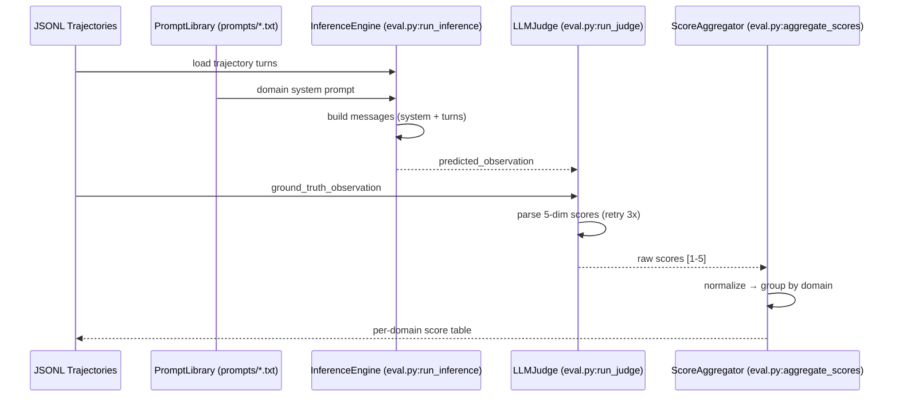
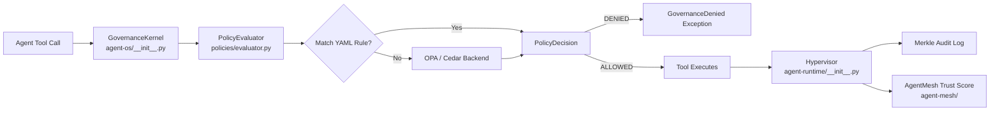
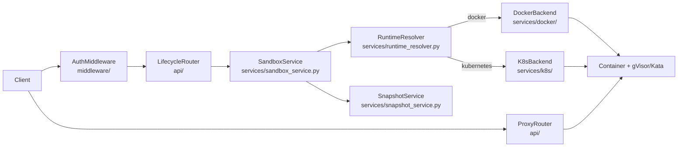
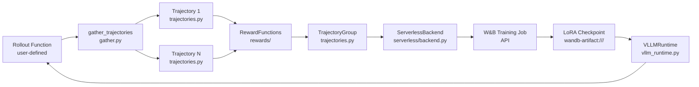

# Agentic AI Weekly Scan — 2026-06-25

## Executive Summary

- **Language World Models** đang nổi lên như một paradigm mới: thay vì test agent trên môi trường thật, dùng LLM để *simulate* phản hồi của terminal/browser/Android — Qwen-AgentWorld là hiện thân đầu tiên phủ 7 domain trong một model.
- **Governance-as-code** đã đạt production-grade: Microsoft AGT áp dụng tư duy OS-kernel vào agent safety, intercept mọi tool call *trước khi thực thi* qua deterministic policy engine, không phải prompt engineering.
- **GRPO online-RL** cho agent đang trở thành standard: ART của OpenPipe chứng minh vòng lặp *rollout → reward → GRPO update → reload LoRA* có thể chạy production với chi phí thấp hơn 40% qua W&B serverless.

## Table of Contents

1. [QwenLM/Qwen-AgentWorld](#1-qwenlmqwen-agentworld) — Language World Model simulation for agent testing
2. [microsoft/agent-governance-toolkit](#2-microsoftagent-governance-toolkit) — Production-grade agent governance
3. [opensandbox-group/OpenSandbox](#3-opensandbox-groupopensandbox) — Secure sandbox runtime cho AI agents
4. [OpenPipe/ART](#4-openpipeart) — Agent Reinforcement Trainer (GRPO)

---

## 1. QwenLM/Qwen-AgentWorld

**Repo:** https://github.com/QwenLM/Qwen-AgentWorld  
**Paper:** https://arxiv.org/abs/2606.24597

### §1 — Quick Context

Model LLM đầu tiên *simulate* 7 loại môi trường agent (MCP, Search, Terminal, SWE, Android, Web, OS) trong một model duy nhất — thay thế môi trường thật khi test/train agent.

- **Stack:** Python · vLLM / SGLang inference · OpenAI-compatible API · Qwen base architecture
- **Health:** 344 ★ · Alibaba/QwenLM org · Apache 2.0 · CI không có trong repo (model release) · Last push 2026-06-24

### §2 — Architecture Deep-Dive

**A. Component Inventory**

- `InferenceEngine` (`eval/eval.py:run_inference()`) — gửi trajectory turn hiện tại lên model endpoint (vLLM/SGLang/OpenAI-compatible), nhận *predicted observation*.
- `LLMJudge` (`eval/eval.py:run_judge()`) — gửi cặp (predicted observation, ground-truth observation) lên judge model, parse structured scores trên 5 chiều; retry 3 lần khi parse fails.
- `ScoreAggregator` (`eval/eval.py:aggregate_scores()`) — normalize raw 1–5 → 0–100 theo công thức `(raw-1)/4×100`, group kết quả theo subtask domain.
- `PromptLibrary` (`prompts/*.txt`) — system prompt template riêng cho từng domain, xác định format input/output của simulation.
- `EvalUtils` (`eval/lwm_eval_utils/`) — utilities: JSONL loading, response-tag extraction, context builder.

**B. Control Flow — Environment Simulation pattern**

Đây không phải ReAct hay Planner-Executor. Qwen-AgentWorld là **world model**: nhận một agent action, trả về simulated observation. Eval pipeline:

1. Load ground-truth trajectories từ JSONL files (mỗi file = một domain).
2. Với mỗi turn: `InferenceEngine` build messages từ `PromptLibrary` + turn history, query model → predicted observation.
3. `LLMJudge` nhận (predicted, ground-truth), build evaluation message với full context, gọi judge model, parse JSON scores.
4. Mark failed samples (inference fail hoặc parse fail) với flag `"failed": true`.
5. `ScoreAggregator` normalize → group by subtask → output per-domain table.
6. Final score = weighted average trên 5 dimensions × 7 domains.

**C. State & Data Flow**

- Format: JSONL trajectories với `{"system": ..., "turns": [{...}], "task": ...}`.
- State storage: stateless — không có persistence giữa các eval runs.
- Context window: 256K tokens — đủ load cả trajectory dài của coding/OS tasks.

**D. Tool / Capability Integration**

Không có tool-calling architecture trong bản thân LWM. Model được query như một black-box inference endpoint qua OpenAI-compatible API. Tool integration là concern của *agent* đang được evaluate, không phải của LWM.

**E. Memory Architecture**

Không có memory hệ thống. Context window 256K đảm nhiệm full-trajectory context.

**F. Model Orchestration**

- Inference: Qwen-AgentWorld-35B-A3B (3B active, MoE) hoặc 397B-A17B.
- Judge: bất kỳ OpenAI-compatible model nào — script nhận `--judge-model` flag.
- Training pipeline (3-stage): CPT (inject env knowledge) → SFT (activate next-state-prediction) → RL (sharpen simulation fidelity), trên 10M+ real-world trajectories.

**G. Observability & Eval**

- AgentWorldBench: JSONL per-domain, 5 dimensions (Format, Factuality, Consistency, Realism, Quality).
- Success rate tracked qua `"failed"` flag — không bị discarded để giữ denominator chính xác.
- Output: per-sample JSONL + per-domain summary table.

**H. Extension Points**

- Thêm domain mới: tạo JSONL benchmark file + system prompt trong `prompts/`.
- Swap judge model: `--judge-model` flag.
- Swap inference backend: bất kỳ OpenAI-compatible endpoint.

### §3 — Architecture Diagram

### §4 — Verdict

**Điểm novel:** Concept "Language World Model" cực kỳ đáng chú ý — thay vì maintain 7 môi trường thật (terminal, browser, Android emulator...) để eval/train agents, một model đơn giản *học cách simulate* chúng. Training trên 10M trajectories thực → fidelity đủ tốt để replace real env trong một số bài toán. Benchmark 5-dimension có cấu trúc rõ hơn pass/fail thông thường.

**Red flags:** Repo cực kỳ mỏng về code — chủ yếu là model weights + benchmark data. Không có CI, không có test suite. Fidelity thực tế của simulation chưa được independent-verify ngoài paper. Realism ≠ correctness với security-sensitive domains (OS, Terminal).

**Open questions:** LWM có thể làm training environment cho RL không (replace Gymnasium)? Fidelity drop như thế nào trên long-horizon tasks (>50 turns)? Model có bias về hành vi agent cụ thể không (vì trained trên real trajectories từ specific agents)?

---

## 2. microsoft/agent-governance-toolkit

**Repo:** https://github.com/microsoft/agent-governance-toolkit

### §1 — Quick Context

Governance layer deterministric cho autonomous agents: intercept mọi tool call trước khi thực thi, enforce YAML/OPA/Cedar policies, zero-trust identity qua SPIFFE/DID, audit log tamper-evident — phủ toàn bộ OWASP Agentic Top 10.

- **Stack:** Python 3.10+ · TypeScript · .NET · Rust (policy engine core) · Go · YAML/OPA/Cedar policies
- **Health:** 4507 ★ · Microsoft org · MIT · CI/CD với CodeQL + ClusterFuzzLite + OpenSSF Scorecard · 992 conformance tests

### §2 — Architecture Deep-Dive

**A. Component Inventory**

- `PolicyEvaluator` (`agent-governance-python/agent-os/src/agent_os/policies/evaluator.py`) — 3-tier fallback: YAML rules → OPA/Cedar external backends → defaults; fail-closed khi không có policy.
- `PolicyDocument` (`agent-governance-python/agent-os/src/agent_os/policies/evaluator.py`) — YAML/JSON spec với `PolicyRule`, `PolicyCondition`, `PolicyAction`, `PolicyDefaults`.
- `GovernanceKernel` (`agent-governance-python/agent-os/src/agent_os/__init__.py` via `GovernanceKernel` export) — entry point, wraps tool functions với policy gate qua `govern()`.
- `AgentMesh` (`agent-governance-python/agent-mesh/`) — zero-trust identity layer: SPIFFE/DID credentials, trust scoring (0–1000 scale), peer trust negotiation.
- `Hypervisor` (`agent-governance-python/agent-runtime/src/agent_runtime/__init__.py`) — execution audit: delta engine, in-memory commitment tracking, command denylist.
- `AgentRuntime` (`agent-governance-python/agent-runtime/src/agent_runtime/__init__.py` via `ExecutionRing`, `RingEnforcer`) — privilege ring enforcement (4 rings), saga orchestration, kill switch.
- `AgentSRE` (`agent-governance-python/agent-sre/`) — SLO monitoring, error budgets, chaos testing, circuit breakers.
- `PolicyEngine (Rust)` (`policy-engine/`) — stateless deterministic core, fail-closed verdicts; backing the Python layer.
- `MCPSecurityGateway` (`docs/specs/MCP-SECURITY-GATEWAY-1.0.md` + implementation) — tool poisoning detection, drift monitoring, hidden instruction scanning.
- `PromptDefenseEvaluator` (`agent-governance-python/agent-compliance/src/agent_compliance/prompt_defense.py`) — 12-vector prompt injection audit.

**B. Control Flow — Pre-execution Intercept pattern**

Pattern: **Intercept-before-execute** (không phải ReAct, không phải Planner-Executor — đây là governance middleware):

1. Agent attempts tool call → `govern(tool, policy="policy.yaml")` wrapper intercepts.
2. `PolicyEvaluator.evaluate(context)` runs 3-tier logic: scan YAML rules theo priority (descending, first-match-wins) → nếu không match, query OPA/Cedar backends → fallback to `default_action`.
3. Nếu scope-aware: traverse folder hierarchy tìm `governance.yaml`, merge hierarchically.
4. Decision: `PolicyDecision(allowed=True/False, matched_rule=..., audit_entry=...)`.
5. Nếu DENIED → raise `GovernanceDenied` — tool không bao giờ được thực thi.
6. Nếu ALLOWED → `Hypervisor` logs delta, records audit entry vào Merkle chain.
7. `AgentMesh` cập nhật trust score của agent dựa trên compliance history.

**C. State & Data Flow**

- PolicyDocuments: YAML files trên filesystem (hierarchical scope-aware loading).
- Trust scores: `AgentMesh` (in-memory + persistent), 0–1000 scale, default 500.
- Audit log: append-only Merkle chain — tamper-evident, exportable cho SOC 2 / EU AI Act.
- Message format giữa components: typed Python dataclasses (Pydantic models).

**D. Tool / Capability Integration**

- Register: `govern(my_tool, policy="policy.yaml")` wrapper — bất kỳ callable Python function.
- Gọi tool: agent gọi như normal Python function; governance transparent qua wrapper.
- MCP integration: `MCPSecurityGateway` thêm scanning layer trước MCP tool execution.
- Validation: policy evaluation ở application-layer (same process), không phải OS-level.

**F. Model Orchestration**

Agnostic với model — governance hoạt động ở tool-call layer, không phụ thuộc model provider. Framework adapters cho OpenAI Agents SDK, Semantic Kernel, AutoGen, LangGraph, CrewAI, Google ADK, LlamaIndex.

**G. Observability & Eval**

- `OTelLogsBackend` (`agent-governance-python/agent-os/src/agent_os/__init__.py` export) — OpenTelemetry.
- `GovernanceAuditLogger` — structured audit with Decision BOM.
- `ShiftLeftTracker` — tracks violation stage.
- CLI: `agt verify --evidence ./agt-evidence.json --strict` (fail CI on weak evidence), `agt red-team scan ./prompts/ --min-grade B`.
- 992 conformance tests (spec-driven), ClusterFuzzLite với 7 fuzz targets.

**H. Extension Points**

- Custom backend: `evaluator.add_backend(OPABackend(...))` hoặc `CedarBackend(...)`.
- Custom policy: YAML file với RFC 2119 format.
- Framework adapter: `agentmesh-integrations/` — 10 adapter contract spec.

### §3 — Architecture Diagram

### §4 — Verdict

**Điểm novel:** Áp dụng POSIX kernel model vào agent governance là conceptually clean — agent = process, tool call = syscall, policy engine = kernel intercept. Rust core cho policy evaluation đảm bảo sub-millisecond latency deterministic. Trust score 0–1000 kết hợp với Merkle audit log tạo ra accountability chain có thể audit được. OWASP Agentic Top 10 coverage có conformance test (không chỉ là checkbox marketing).

**Red flags:** Policy enforcement ở Python interpreter level — shared process boundary với agent, không phải OS-level sandbox. Một agent có thể monkeypatch `govern()` nếu có full Python access. Security claim "structurally impossible" misleading vì vẫn cần container isolation để thực sự enforce. Số package (45 → consolidated 5) cho thấy scope creep lớn.

**Open questions:** Performance overhead của Merkle chain trên high-throughput agent workflows? Trust score decay algorithm như thế nào (time-based hay event-based)? OPA/Cedar backend có support hot-reload policy không khi agent đang chạy?

---

## 3. opensandbox-group/OpenSandbox

**Repo:** https://github.com/opensandbox-group/OpenSandbox

### §1 — Quick Context

Control plane FastAPI cho sandbox lifecycle của AI agents: tạo/pause/resume/xóa sandboxes trên Docker hoặc Kubernetes, với network egress control, gVisor/Kata/Firecracker isolation, và Credential Vault.

- **Stack:** Python 3.10+ · FastAPI · Docker · Kubernetes · Redis · gVisor/Kata Containers/Firecracker · MCP server
- **Health:** 11,649 ★ · Apache 2.0 · pytest-async · pyright · Active development (pushed 2026-06-25)

### §2 — Architecture Deep-Dive

**A. Component Inventory**

- `FastAPI App` (`server/opensandbox_server/main.py`) — HTTP control plane với 4 routers (lifecycle, devops, pool, proxy) + startup validation.
- `SandboxService` (`server/opensandbox_server/services/sandbox_service.py`) — abstract base class: create/delete/get/list/pause/resume/renew sandbox operations; JSON Merge Patch (RFC 7396) cho metadata.
- `RuntimeResolver` (`server/opensandbox_server/services/runtime_resolver.py`) — translate `config.runtime.type` ("docker" | "kubernetes") → OCI runtime name hoặc Kubernetes RuntimeClass (gVisor, Kata-qemu, Firecracker).
- `DockerBackend` (`server/opensandbox_server/services/docker/`) — Docker-specific SandboxService implementation.
- `K8sBackend` (`server/opensandbox_server/services/k8s/`) — Kubernetes-specific SandboxService implementation.
- `SnapshotService` (`server/opensandbox_server/services/snapshot_service.py`) — snapshot/restore sandbox state.
- `AuthMiddleware` (`server/opensandbox_server/middleware/`) — API key validation, innermost middleware.
- `IngressConfig` (`server/opensandbox_server/config.py`) — direct mode hoặc gateway mode (wildcard/header/URI routing) + OSEP-0011 signed routes.
- `EgressConfig` (`server/opensandbox_server/config.py`) — network policy enforcement via sidecar (dns | dns+nft mode).

**B. Control Flow — Request-Response với Lifecycle State Machine**

1. Client gửi `POST /v1/sandboxes` → `AuthMiddleware` validate API key.
2. `RuntimeResolver` đọc `config.runtime.type`, resolve OCI runtime (gVisor/Kata) hoặc K8s RuntimeClass.
3. `SandboxService.create_sandbox()` instantiate container với security constraints: capability drop, AppArmor profile, seccomp policy, no_new_privileges, egress sidecar.
4. Client execute commands qua `ProxyRouter` (catch-all routes) hoặc execd binary trong container.
5. `SandboxService.renew_expiration()` extend lifetime; `SnapshotService` lưu/restore state nếu cần.
6. Client gửi `DELETE /v1/sandboxes/{id}` → `SandboxService.delete_sandbox()` clean up.

**C. State & Data Flow**

- Sandbox state: in-memory + persistent via `repositories/` layer.
- Snapshot state: `snapshot_repository.py`, `snapshot_runtime.py`.
- Config format: YAML với typed Pydantic models.
- Middleware execution order: RequestIdMiddleware (outermost) → CORSMiddleware → AuthMiddleware (innermost).

**D. Tool / Capability Integration**

- MCP server: integration point cho AI assistants và code editors.
- SDK: multi-language (Python, Java/Kotlin, TypeScript, C#, Go) qua unified API.
- CLI: `osb` command-line tool.
- Extension: `extensions/` và `integrations/` directories trong `opensandbox_server/`.

**G. Observability & Eval**

- `GET /health` → `{"status": "healthy"}`.
- `logging_config.py` với structured logging.
- DevOps router expose logs, inspect data, event histories.
- `startup_guard.py` — pre-flight validation trước khi accept traffic.

**H. Extension Points**

- Custom runtime: implement abstract `SandboxService` với runtime mới.
- Custom network policy: `EgressConfig` sidecar mode.
- Signed routes: OSEP-0011 specification cho secure access.

### §3 — Architecture Diagram

### §4 — Verdict

**Điểm novel:** Credential Vault tích hợp sẵn (không cần agent biết secrets — inject vào container runtime); signed routes qua OSEP-0011 spec cho secure agent-to-sandbox communication; `pool_router` cho sandbox pooling (pre-warm containers) giảm latency cold-start đáng kể với RL training workflows.

**Red flags:** Alpha status — breaking changes khả năng cao. Redis dependency cho state nhưng không rõ eviction policy khi sandbox long-running. Network policy enforcement via sidecar thêm latency và complexity; không rõ overhead thực tế. Snapshot/restore không rõ consistency guarantee khi sandbox đang execute.

**Open questions:** OSEP (OpenSandbox Enhancement Proposal) process có active không? Snapshot mechanism handle file descriptor state không? Pool manager có warming strategy cho specific image không (hay chỉ generic)?

---

## 4. OpenPipe/ART

**Repo:** https://github.com/OpenPipe/ART

### §1 — Quick Context

Framework online RL (GRPO/CISPO) cho agent: rollout → reward → train LoRA → reload vào vLLM — vòng lặp chạy serverless qua W&B API, không cần GPU local.

- **Stack:** Python 3.12+ · vLLM · Unsloth · TRL 0.20 · PEFT · LiteLLM · LangGraph · W&B/Weave · Polars · FastAPI (Tinker)
- **Health:** 10,172 ★ · OpenPipe org · MIT · pytest-async · Active (pushed 2026-06-25)

### §2 — Architecture Deep-Dive

**A. Component Inventory**

- `Trajectory` (`src/art/trajectories.py`) — single execution path: `messages_and_choices`, `reward: float`, `metrics: dict`, `initial_policy_version`, `final_policy_version`, `logs: list[str]`.
- `TrajectoryGroup` (`src/art/trajectories.py`) — batch container: list of `Trajectory` + `exceptions` (PydanticException), hỗ trợ `asyncio.gather()` overload.
- `Model` (`src/art/model.py`) — inference-only model: W&B tracking (`_wandb_run`), inference API endpoint config, `base_path`, metrics builder.
- `TrainableModel` (`src/art/model.py`) — extends Model: `base_model`, `lora_config: LoRAConfig`, `train_sft()`, `_cost_calculator`.
- `Backend` (`src/art/backend.py`) — Protocol: `train(model, trajectory_groups)` → `TrainResult`; `_train_sft()`; `_prepare_backend_for_training()`; `_delete_checkpoint_files()`.
- `ServerlessBackend` (`src/art/serverless/backend.py`) — W&B serverless implementation: `_client.training_jobs.create()` → poll `events.list()` → artifact `wandb-artifact:///`.
- `gather_trajectories` (`src/art/gather.py`) — async coordinator: wrap each awaitable, `asyncio.gather()`, `GatherContext` cho shared metrics + progress bar.
- `VLLMRuntime` (`src/art/vllm_runtime.py`) — vLLM inference integration, step-aware model naming.
- `LangGraphAdapter` (`src/art/langgraph/`) — LangGraph workflow integration.
- `MCPAdapter` (`src/art/mcp/`) — MCP server tool calling trong rollouts.
- `RewardFunctions` (`src/art/rewards/`) — pluggable reward computation.

**B. Control Flow — Online RL Loop (GRPO)**

1. User define async rollout function nhận `TrainableModel` → thực hiện N agent trajectories bằng model inference.
2. `gather_trajectories()` run tất cả rollouts concurrently via `asyncio.gather()`; `GatherContext` track metrics và progress.
3. Mỗi Trajectory tích lũy `messages_and_choices`, user assign `reward` qua `RewardFunctions`.
4. `TrajectoryGroup` batch trajectories; `Backend.train(model, trajectory_groups)` submit batch.
5. `ServerlessBackend` gọi W&B API: `create training_job` → poll `events.list()` → aggregate metrics via `aggregate_rl_training_metrics()`.
6. GRPO/CISPO loss update LoRA weights; checkpoint lưu vào W&B artifact (`wandb-artifact:///entity/project/name:step{N}`).
7. New LoRA weights load vào `VLLMRuntime` cho inference round tiếp theo.
8. Lặp lại cho đủ iterations.

**C. State & Data Flow**

- In-memory: `messages_and_choices` list trong mỗi Trajectory (OpenAI message format).
- Persistent: W&B artifacts (LoRA checkpoints), Polars DataFrames cho training metrics.
- Policy versioning: `initial_policy_version` / `final_policy_version` per Trajectory — track xem trajectory được rollout với policy nào.

**D. Tool / Capability Integration**

- Tool calling: qua `MCPAdapter` (`src/art/mcp/`) hoặc native LangGraph tools.
- Reward function: user-defined callable, register qua `RewardFunctions` (`src/art/rewards/`).
- Inference: LiteLLM (1.71.1–1.82.0) hoặc direct OpenAI-compatible API.

**F. Model Orchestration**

- Training: bất kỳ vLLM-compatible causal LM hỗ trợ bởi Unsloth — đặc biệt Qwen3.6, Llama, GPT-OSS.
- LoRA: `LoRAConfig` trong `TrainableModel`; efficient fine-tuning với PEFT.
- Benchmark: Qwen 2.5 14B fine-tuned qua ART outperform OpenAI o3 trên email retrieval task (ART·E demo).

**G. Observability & Eval**

- W&B/Weave tracking (`weave ≥0.52.24`) — tất cả rollouts, rewards, training metrics.
- `GatherContext` — per-batch: reward sum, completion tokens, success rate.
- `metrics_taxonomy.py` — structured metric categorization.
- `api_costs.py`, `costs.py` — cost tracking per API call.

**H. Extension Points**

- Custom reward: implement reward function nhận `Trajectory` → `float`.
- Custom backend: implement `Backend` Protocol (train, _train_sft...).
- LangGraph: `src/art/langgraph/` adapter để dùng LangGraph agents như rollout env.
- MCP tools: `src/art/mcp/` cho tool-using agents trong training.

### §3 — Architecture Diagram

### §4 — Verdict

**Điểm novel:** Policy versioning per Trajectory (`initial_policy_version`/`final_policy_version`) cho phép track chính xác off-policy degree — quan trọng cho importance sampling trong GRPO/CISPO. `auto_trajectory` decorator pattern (`src/art/auto_trajectory.py`) wrap bất kỳ async function thành trajectory collector mà không cần boilerplate. W&B serverless eliminates GPU requirement cho training server — bất kỳ Python machine nào đều có thể kick off training.

**Red flags:** Python 3.12+ requirement hạn chế adoption. Serverless training có cold-start latency không rõ — không suitable cho tight online RL loops yêu cầu sub-minute iteration. `_internal_config` field trong `TrainableModel` được đánh dấu "unstable" — API chưa ổn định. Dependency pinning LiteLLM (1.71.1–1.82.0) quá hẹp, có thể gây conflict.

**Open questions:** CISPO vs PPO performance tradeoff cụ thể trong agent context? `auto_trajectory` có handle branching trajectories (agent retry) không? Cost savings 40% so với gì (tự-host vLLM?)? Multi-turn conversation state có được preserve đúng qua policy updates không?

---

*Scan thực hiện: 2026-06-25 · Next scan: 2026-07-02*
