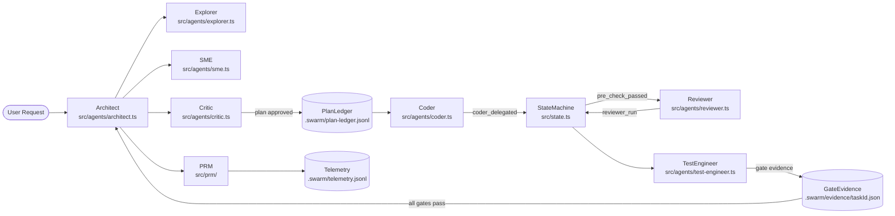
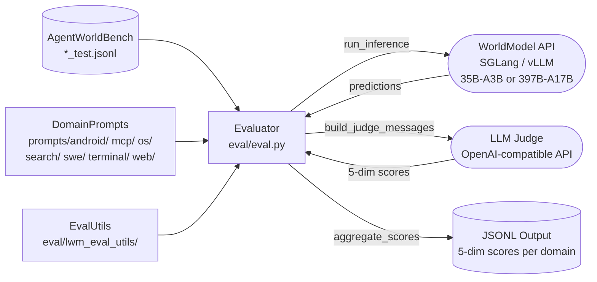
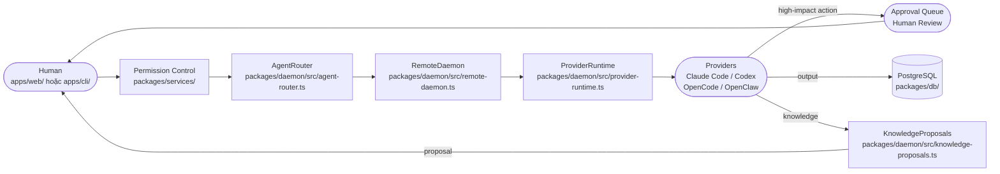
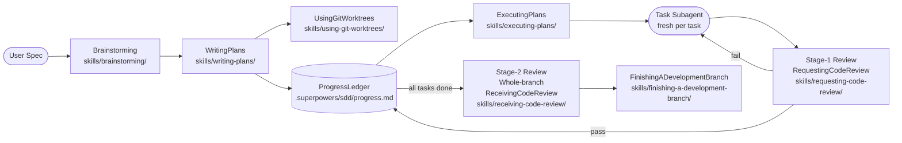

# Weekly Agentic AI Research Scan — 2026-06-26

## Executive Summary

- **Tuần này nổi bật về diversity of architectural concerns:** từ world-model simulation (QwenLM) đến hub-and-spoke swarm có gated state machine (opencode-swarm) đến organizational human-agent workspace (AgentSpace) đến meta-methodology cho orchestration (superpowers) — phủ cả research frontier lẫn production engineering.
- **Pattern đáng chú ý nhất:** `ZaxbyHub/opencode-swarm` implement Process Reward Model (PRM) cho real-time pattern detection và course-correction injection trong agent execution — không chỉ observe mà actively steer; kết hợp với 29 telemetry event types và gate expansion via set union, đây là production-grade orchestration engineering đáng học nhất tuần này.
- **Emerging theme:** Hai trong số bốn repo giải quyết vấn đề context compaction survival (`opencode-swarm` với rehydration pipeline, `superpowers` với progress ledger) — cho thấy đây đang là pain point thực sự trong long-running agent systems.

---

## Table of Contents

1. [ZaxbyHub/opencode-swarm](#1-zaxbyhub--opencode-swarm) — Hub-and-spoke swarm với gated state machine và PRM
2. [QwenLM/Qwen-AgentWorld](#2-qwenlm--qwen-agentworld) — Language World Model MoE cho agent environment simulation
3. [HKUDS/AgentSpace](#3-hkuds--agentspace) — Human+Agent organizational workspace với provider normalization
4. [obra/superpowers](#4-obra--superpowers) — 14 composable meta-skills cho coding agents

---

## 1. ZaxbyHub / opencode-swarm

> https://github.com/ZaxbyHub/opencode-swarm — 364 ⭐ | pushed 2026-06-25

### §1 — Quick Context

**Pitch:** Plugin biến OpenCode thành swarm gồm 14 specialized agents với pipeline có gate kiểm soát theo state machine.

**Tech stack:** TypeScript 99.5%, Bun runtime, Tree-sitter, CycloneDX, custom SAST (63+ rules).

**Repo health:** 364 stars, 37 forks, 51 open issues, 2318 commits, 6000+ unit/integration/adversarial tests. Last push: 2026-06-25.

---

### §2 — Architecture Deep-Dive

#### A. Component Inventory

- `Architect` (`src/agents/architect.ts`) — Hub trung tâm; unlimited budget, không bị invocation window; điều phối toàn bộ swarm
- `Coder` (`src/agents/coder.ts`) — Viết code, file authority giới hạn ở `src/` và `tests/` (scope enforcement)
- `Reviewer` (`src/agents/reviewer.ts`) — Gate evidence producer; kiểm tra correctness sau khi Coder hoàn thành
- `TestEngineer` (`src/agents/test-engineer.ts`) — Validate behavior; required gate partner của Reviewer
- `Critic` (`src/agents/critic.ts`) — Review plan trước khi coding bắt đầu
- `Explorer` (`src/agents/explorer.ts`) — Read-only codebase scan; không có write authority
- `SME` (`src/agents/sme.ts`) — Subject matter expert consultation theo domain
- `Council` (`src/agents/council-prompts.ts`, `src/agents/council-registration.ts`) — Quorum-based fast-path approval (mặc định 3 members)
- `PlanManager` (`src/plan/manager.ts`) — CAS-backoff plan mutation; ledger-aware state updates
- `PlanLedger` (`src/plan/ledger.ts`) — Authoritative task list; `.swarm/plan-ledger.jsonl`
- `GateEvidence` (`src/gate-evidence.ts`) — Append-only gate store; `.swarm/evidence/{taskId}.json`; expansion via set union
- `State` (`src/state.ts`) — Singleton state machine; TaskWorkflowState + per-session guardrails
- `Telemetry` (`src/telemetry.ts`) — 29 event types → `.swarm/telemetry.jsonl`; file rotation at 10MB
- `PRM` (`src/prm/`) — Process Reward Model: pattern detection, course-correction injection, escalation, hard stop
- `Scope` (`src/scope/`) — Per-agent file write authority enforcement với cross-process persistence
- `SAST` (`src/sast/`) — 63+ static analysis rules, 9 languages
- `SBOM` (`src/sbom/`) — CycloneDX dependency audit, 8 ecosystems
- `Memory` (`src/memory/`) — Short-term context management

#### B. Control Flow — Hierarchical Supervisor + State Machine

**Pattern:** Hierarchical (Architect = supervisor, workers = Coder/Reviewer/TestEngineer) với forward-only TaskWorkflowState machine làm gate enforcement.

1. User request → hook system intercepts (Messages Transform pipeline) → Architect nhận intent
2. Architect delegates đến Explorer (read-only codebase scan) và SME (domain context)
3. Architect viết plan → Critic review plan → gates pass → plan committed vào PlanLedger
4. Architect delegate Coder → State: `idle → coder_delegated`
5. Coder implements (chỉ trong declared file scope) → State: `→ pre_check_passed`
6. Reviewer chạy → State: `→ reviewer_run`; TestEngineer validate → State: `→ tests_run`; GateEvidence ghi `.swarm/evidence/{taskId}.json`
7. Tất cả required gates pass (set union) → State: `→ complete` → Architect chạy regression checks

#### C. State & Data Flow

- **Message format:** Structured JSON events qua OpenCode hook system (composeHandlers); fail-closed chain cho guardrails, safeHook cho advisory
- **State storage:** Dual-layer — in-memory Map (evicts sessions >2h idle) + durable `.swarm/plan.json` / `.swarm/plan-ledger.jsonl` / `.swarm/evidence/`
- **Context window management:** Session compaction hooks + circular buffer (max 20 recent tool calls) cho repetition detection; rehydration pipeline on startup đọc `.swarm/plan.json` + evidence files

#### D. Tool / Capability Integration

- 20+ built-in tools: Tree-sitter syntax validation, SAST, CycloneDX SBOM, placeholder detection, complexity/duplication budgets, shell write detection (POSIX/PowerShell/cmd)
- Tool registration: via OpenCode plugin's `tool:` export shape
- Validation: fail-closed cho guardrails + scope-guard + delegation-gate (errors block execution); safeHook cho advisory hooks

#### E. Memory Architecture

- **Short-term:** In-memory Map per session
- **Long-term:** `.swarm/context.md` (technical decisions), `.swarm/evidence/` (gate results per task)
- **Compaction:** Rehydration pipeline trên startup; evidence-derived state takes precedence over plan-only status; existing states không bao giờ bị downgrade
- **Retrieval:** Flat file reads — không có vector/RAG

#### F. Model Orchestration

- Architect: unlimited budget (no invocation window)
- Coder và Reviewer: separate models (deliberate để catch blind spots)
- Council: quorum 3 members cho fast-path approval bypass Stage B
- PRM (`src/prm/`): `prm_pattern_detected` → `prm_course_correction_injected` → `prm_escalation_triggered` → `prm_hard_stop`
- Fallback: `model_fallback` event tracked; `src/model-fallback.ts` exists

#### G. Observability & Eval

- 29 event types → `.swarm/telemetry.jsonl` (JSONL, self-rotating at 10MB)
- Events cover: `gate_passed/failed`, `loop_detected`, `scope_violation`, `prm_*`, `budget_updated`, `hard_limit_hit`, `heartbeat`, concurrency events
- Session rehydration từ `.swarm/` directory = replay capability
- Không có OpenTelemetry integration; local listener callback API cho custom integrations

#### H. Extension Points

- Thêm agent: tạo file trong `src/agents/`, register vào agent registry
- Thêm tool: expose trong plugin `tool:` export
- Custom gates: modify gate derivation logic trong `src/gate-evidence.ts`
- Custom model per agent: trong agent config

---

### §3 — Architecture Diagram

---

### §4 — Verdict

**Điểm novel:** PRM cho real-time pattern detection và course-correction injection là insight không phổ biến — thay vì chỉ log failures, system inject corrections trực tiếp vào agent flow và có thể trigger hard-stop. Gate expansion via set union (dynamic, không phải static gate list) cho phép QA requirements grow khi thêm agent types được dispatch. 6000+ adversarial tests cho orchestration plugin là production commitment thực sự. Dual-model strategy (coder ≠ reviewer model) để deliberate blind-spot diversity là engineering choice có cơ sở.

**Red flags:** Không có OpenTelemetry — vendor lock-in với self-rolled JSONL. Scope enforcement chỉ tại file path level, không có containerization hoặc process sandboxing thực sự. 51 open issues. Bun dependency (non-standard cho production Node.js ecosystems).

**Open questions:** PRM pattern detection cụ thể dùng classifier hay heuristics? Council quorum với mixed verdicts xử lý thế nào khi split vote? Cost tracking per agent type có không?

---

## 2. QwenLM / Qwen-AgentWorld

> https://github.com/QwenLM/Qwen-AgentWorld — 511 ⭐ | created 2026-06-22 | arxiv.org/abs/2606.24597

### §1 — Quick Context

**Pitch:** World model MoE (35B/397B tham số) được train để simulate agentic environments, không phải để act trong đó.

**Tech stack:** Python, SGLang / vLLM inference, Swift / Llama-Factory / UnSloth training, OpenAI-compatible API cho evaluation judge.

**Repo health:** 511 stars, 47 forks, 1 open issue. Last push: 2026-06-25. CI: không xác định từ code.

---

### §2 — Architecture Deep-Dive

**⚠️ Quan trọng:** Đây là model release + evaluation harness, không phải agent orchestration framework. Architecture deep-dive mô tả training pipeline + eval system.

#### A. Component Inventory

- `DomainPrompts` (`prompts/android/`, `prompts/mcp/`, `prompts/os/`, `prompts/search/`, `prompts/swe/`, `prompts/terminal/`, `prompts/web/`) — System prompts per domain, 7 thư mục riêng biệt
- `Evaluator` (`eval/eval.py`) — 3-stage pipeline: inference → judge → aggregation
- `EvalUtils` (`eval/lwm_eval_utils/`) — Helper utilities cho evaluation pipeline

*(Inference model là external artifact — served qua SGLang/vLLM, không có Python module trong repo)*

#### B. Control Flow — Research Evaluation Pipeline

**Pattern:** Linear evaluation pipeline (không phải agent orchestration).

1. `load_data()` đọc tất cả `*_test.jsonl` files từ benchmark directory
2. `run_inference()` gửi prompt tới World Model API (OpenAI-compatible) → collect predicted next-state observations (`gen` field)
3. `build_judge_messages()` assemble context từ historical trajectories, current prompt, predicted vs ground-truth observations
4. `run_judge()` gọi LLM judge với retry (max 3 attempts) → extract 5-dimension scores
5. `aggregate_scores()` normalize raw 1–5 → 0–100: `(raw - 1) / 4 * 100`, group by subtask

#### C. State & Data Flow

- **Message format:** JSONL với fields `task`, `system_str`, `prompt`, `response`, `turn_idx`
- **Output format:** JSONL với `gen`, `total_score`, dimension scores (`format`, `factuality`, `consistency`, `realism`, `quality`), `failed`, `strengths`, `weaknesses`
- **State storage:** Stateless pipeline; không có persistent state giữa evaluations

#### D. Tool / Capability Integration

- MCP (Model Context Protocol) là một trong 7 domains (`prompts/mcp/`)
- Trong evaluation context: model predict what tool/environment would return (world model behavior)
- Validation: retry logic (max 3) cho judge parse failures

#### E. Memory Architecture

Không áp dụng — stateless inference pipeline.

#### F. Model Orchestration

- World model sizes: Qwen-AgentWorld-35B-A3B (MoE, 35B total, 3B active, 256K context) và Qwen-AgentWorld-397B-A17B (MoE, 397B total, 17B active)
- Inference backends: SGLang, vLLM, Transformers
- Evaluation uses separate LLM judge (OpenAI-compatible API endpoint)
- Training: 3-stage — CPT (environment knowledge injection) → SFT (next-state-prediction reasoning activation) → RL (simulation fidelity sharpening), trên 10M+ real-world trajectories

#### G. Observability & Eval

- AgentWorldBench: 5-dimensional scoring (Format, Factuality, Consistency, Realism, Quality)
- Scores grouped by subtask trong output JSONL
- `failed` field per prediction track judge parse failures
- Không có training observability artifacts trong repo

#### H. Extension Points

- Thêm domain: tạo `prompts/{domain}/` + test JSONL files tương ứng
- Custom judge model: thay đổi judge API endpoint trong eval config

---

### §3 — Architecture Diagram

---

### §4 — Verdict

**Điểm novel:** Concept "Language World Model" là paradigm shift thực sự: thay vì train agent để act, train model để *simulate what an environment would return*. Điều này enable (1) synthetic training data cho agent training mà không cần real environment rollout, (2) controllable perturbations trong fictional environments vượt quá real-environment training distribution, (3) zero-shot generalization to out-of-distribution domains như Claw Agent tasks (theo paper). 3-stage training pipeline (CPT→SFT→RL) với 10M+ trajectories demonstrate research-grade engineering scale.

**Red flags:** Repo chứa ít code thực tế (chỉ eval/ + prompts/); phần lớn giá trị là model weights + paper — không học được architecture pattern nào implement trực tiếp. Judge model bias là unaddressed confound trong AgentWorldBench: model được judge bởi cùng LLM family có thể favor familiar output styles. Không có code evidence về training infrastructure.

**Open questions:** World model integrate thế nào vào actual agent training loop (offline data generation hay online simulation)? Simulation fidelity scale với model size ra sao? Performance gap giữa 35B-A3B và 397B-A17B trên từng domain?

---

## 3. HKUDS / AgentSpace

> https://github.com/HKUDS/AgentSpace — 432 ⭐ | created 2026-06-22

### §1 — Quick Context

**Pitch:** Workspace nơi human và AI agents làm việc như đồng nghiệp, với AgentRouter normalize nhiều agent CLI runtimes thành unified event stream.

**Tech stack:** TypeScript 92.5%, Next.js App Router, PostgreSQL 16, Node.js 24, npm workspaces monorepo.

**Repo health:** 432 stars, 43 forks, 5 open issues. Last push: 2026-06-24. CI: có test files; không xác định CI pipeline.

---

### §2 — Architecture Deep-Dive

#### A. Component Inventory

- `AgentRouter` (`packages/daemon/src/agent-router.ts`) — Provider normalization layer: unify Claude Code, Codex, OpenCode, OpenClaw, Hermes thành uniform JSON event stream + session model
- `RemoteDaemon` (`packages/daemon/src/remote-daemon.ts`) — Distributed task execution daemon, deployable independently từ web app
- `ProviderRuntime` (`packages/daemon/src/provider-runtime.ts`) — Health monitoring per provider; runtime app lifecycle
- `DaemonClient` (`packages/daemon/src/daemon-client.ts`) — HTTP client (`HttpDaemonClient`) cho server-side integration với daemon
- `DaemonAPI` (`packages/daemon/src/daemon-api.ts`) — Server-side API surface (REST)
- `KnowledgeProposals` (`packages/daemon/src/knowledge-proposals.ts`) — Knowledge management với proposal-review workflow
- `ChannelDocuments` (`packages/daemon/src/channel-documents.ts`) — Document management within workspace channels
- `TaskContext` (`packages/daemon/src/task-context.ts`) — Task context bundling per execution
- `RuntimeOutput` (`packages/daemon/src/runtime-output.ts`, `runtime-output-manifests.ts`) — Agent execution output rendering + manifests
- `SkillImports` (`packages/daemon/src/skill-imports.ts`) — Workspace skill loading/importing
- `PostgreSQL` (`packages/db/`) — Primary persistence layer
- `WebApp` (`apps/web/`) — Next.js App Router workspace interface
- `CLI` (`apps/cli/`) — Local control CLI
- `Sandbox` (`packages/sandbox/`) — Sandbox abstraction utilities

#### B. Control Flow — Hierarchical với Human-in-the-loop Approval Gates

**Pattern:** Hierarchical với human-in-the-loop — AgentRouter là broker trung gian, không phải agent supervisor.

1. Human tạo task/request trong `WebApp` (`apps/web/`) hoặc `CLI` (`apps/cli/`)
2. Permission control plane (`packages/services/`) kiểm tra workspace roles, channel access, agent ownership
3. `AgentRouter` (`packages/daemon/src/agent-router.ts`) select provider phù hợp (Claude Code, Codex, OpenCode, OpenClaw, Hermes) based on agent config
4. `RemoteDaemon` execute task qua selected `ProviderRuntime`
5. High-impact actions (tool use, external sends, budget decisions) → route tới human approval queue
6. Agent output flow qua `RuntimeOutput` → rendered trong web UI
7. Knowledge generated bởi agent → `KnowledgeProposals` → human review trước khi persist vào PostgreSQL

#### C. State & Data Flow

- **Message format:** Normalized JSON events (provider-agnostic) — AgentRouter abstracts divergent provider output formats
- **State storage:** PostgreSQL 16 (primary), file-backed skills/knowledge pages với version history
- **Context window management:** Không xác định từ code — không có evidence về sliding/summarize/RAG strategy

#### D. Tool / Capability Integration

- Skills: file-backed workspace skills, importable/exportable via `SkillImports`
- Tool execution: qua provider-specific CLIs (mỗi provider có execution model riêng)
- Validation: approval gates cho sensitive actions; `document-runtime-capabilities.ts` cho capability checking
- Google Workspace delegation (`packages/daemon/src/google-workspace-readiness.ts`)

#### E. Memory Architecture

- Skills: file-backed, workspace-scoped, versioned với rollback
- Knowledge: proposals workflow trước khi persist (human-gated write)
- PostgreSQL: runtime records, channel data, task history
- Retrieval: không xác định từ code (không có vector DB evidence)

#### F. Model Orchestration

- Model selection per provider: AgentRouter normalize nhưng không control model choice — mỗi provider CLI mang model của riêng nó
- Provider health: `ProviderRuntime` + `openclaw-health.ts` monitor provider availability
- Fallback: `provider-runtime.test.ts` suggests fallback logic tồn tại nhưng không xác định rõ strategy

#### G. Observability & Eval

- Test coverage: `agent-router.test.ts`, `provider-runtime.test.ts`, `remote-daemon.test.ts`, `bundle.test.ts`
- Không xác định tracing/logging framework từ code (không có OpenTelemetry, Langfuse, v.v.)

#### H. Extension Points

- Thêm provider: implement trong `AgentRouter` + add runtime trong `ProviderRuntime`
- Custom skills: workspace skill import system (`SkillImports`)
- Knowledge pages: managed via `KnowledgeProposals` workflow

---

### §3 — Architecture Diagram

---

### §4 — Verdict

**Điểm novel:** "Digital Employee Board" model — agents được quản lý như organizational resources với skills binding, knowledge permissions, availability tracking — là organizational abstraction layer chưa thấy trong các framework khác. `AgentRouter` unifying 5+ divergent agent CLIs (khác nhau về output format, session model, streaming behavior) thành uniform JSON event stream là giải quyết real engineering problem (tương đương OpenAPI spec cho agent runtimes). Approval gate architecture cho high-impact actions là production-grade human-in-the-loop pattern đúng hướng.

**Red flags:** Không xác định được memory/RAG strategy từ code — context window constraints unaddressed. Google Workspace delegation tạo large attack surface (OAuth, credential management, delegation scope). Không có vector DB evidence = knowledge retrieval có thể là flat SQL full-text search. Không thấy observability/tracing integration.

**Open questions:** AgentRouter event normalization có cover streaming output không (quan trọng cho real-time UX)? Permission model granular enough cho multi-tenant production org không? KnowledgeProposals review scale thế nào với nhiều concurrent agents?

---

## 4. obra / superpowers

> https://github.com/obra/superpowers — 238,854 ⭐ | pushed 2026-06-19+

### §1 — Quick Context

**Pitch:** 14 composable SKILL.md files biến bất kỳ coding agent nào thành orchestrator có subagent dispatch, TDD enforcement, và two-stage review.

**Tech stack:** Shell + JavaScript, 11 agent integrations (Claude Code, Cursor, Gemini CLI, GitHub Copilot CLI, OpenCode, v.v.).

**Repo health:** 238,854 stars (star count đáng chú ý — xem §4), pushed 2026-06-19+. Language: Shell. CI: không xác định.

---

### §2 — Architecture Deep-Dive

**Lưu ý:** Repo này là methodology framework — các "component" là SKILL.md files (instruction documents cho agents), không phải runnable code modules. Evidence phản ánh documented behavior trong skill files.

#### A. Component Inventory

- `SubagentDrivenDevelopment` (`skills/subagent-driven-development/SKILL.md`) — Dispatch pattern: fresh subagent per task, file-path handoffs thay vì artifact pasting, two-stage review gates
- `WritingPlans` (`skills/writing-plans/SKILL.md`) — Plan structure: header (goal/architecture/constraints), file mapping, 2-5min tasks với exact TDD steps
- `ExecutingPlans` (`skills/executing-plans/`) — Plan execution orchestration với checkpoints
- `TestDrivenDevelopment` (`skills/test-driven-development/`) — RED-GREEN-REFACTOR cycle enforcement
- `UsingGitWorktrees` (`skills/using-git-worktrees/`) — Isolated workspace creation per feature branch
- `Brainstorming` (`skills/brainstorming/`) — Spec refinement qua structured questioning trước khi planning
- `RequestingCodeReview` (`skills/requesting-code-review/`) — Invoke reviewer dispatch workflow
- `ReceivingCodeReview` (`skills/receiving-code-review/`) — Handle reviewer findings (critical/important/minor triage)
- `FinishingADevelopmentBranch` (`skills/finishing-a-development-branch/`) — Merge/PR decision với regression verification
- `SystematicDebugging` (`skills/systematic-debugging/`) — Evidence-based debug workflow
- `VerificationBeforeCompletion` (`skills/verification-before-completion/`) — Gate check trước khi mark task done
- `DispatchingParallelAgents` (`skills/dispatching-parallel-agents/`) — Concurrent subagent dispatch
- `ProgressLedger` (`.superpowers/sdd/progress.md`) — Durable cross-context-compaction state; task completion + commit range + review status
- `WritingSkills` (`skills/writing-skills/`) — Template để agents tự generate new skills

#### B. Control Flow — Planner-Executor với Two-Stage Review Gates

**Pattern:** Planner-executor — plan trước, execute với isolated subagents, review sau mỗi task.

1. `Brainstorming`: spec refinement qua structured questions → locked spec trước khi plan
2. `UsingGitWorktrees`: create isolated branch với verified test baseline
3. `WritingPlans`: decompose spec thành 2-5min tasks; pre-execution check cho internal contradictions
4. Per-task dispatch (`SubagentDrivenDevelopment`): fresh subagent nhận brief via `scripts/task-brief PLAN_FILE N`, viết report ra named file
5. Stage-1 Review per task: spec compliance gate (✅/❌) + code quality gate — độc lập nhau
6. Fix loop nếu review fail: dispatch fix subagent (không manual patch), re-dispatch reviewer
7. Stage-2 Review: whole-branch review trên "most capable available model" sau khi tất cả tasks pass
8. `FinishingADevelopmentBranch`: regression verification → merge/PR decision

#### C. State & Data Flow

- **Message format:** File paths (không phải artifact pasting) — subagents đọc brief từ file, ghi report ra file; decouples memory từ context window
- **State storage:** `.superpowers/sdd/progress.md` — explicit design cho context compaction survival; ghi commit range + review status per task
- **Context window management:** External memory pattern — progress ledger là source of truth khi context reset

#### D. Tool / Capability Integration

- Tool execution: qua host agent (Claude Code, Cursor, etc.) — superpowers không execute tools trực tiếp
- `scripts/task-brief PLAN_FILE N` — extract per-task brief (Shell script, evidence trong skill file)
- Validation: two-stage review gates (spec compliance + code quality) per task

#### E. Memory Architecture

- **Short-term:** Host agent context window
- **Long-term:** `.superpowers/sdd/progress.md` — explicit survival của context compaction
- **Compaction strategy:** External ledger design — agents read ledger to restore state sau compaction
- **Retrieval:** Flat file read — không có vector/RAG

#### F. Model Orchestration

- Primary orchestrator: bất kỳ coding agent nào (Claude Code, Cursor, Gemini CLI, OpenCode, v.v.)
- Task subagents: fresh per-task với isolated context (prevent context cross-contamination)
- Final reviewer: dispatch trên "most capable available model"
- Parallelism: `DispatchingParallelAgents` skill hỗ trợ concurrent subagents

#### G. Observability & Eval

- Progress ledger ghi commit range + review status per task
- Không có telemetry hay tracing system
- `VerificationBeforeCompletion` gate check trước khi mark task done
- No replay capability

#### H. Extension Points

- Thêm skill: `WritingSkills` (`skills/writing-skills/`) document pattern — agents có thể tự generate new skills
- Integrate new agent: add to agent-specific plugin config (11 agents supported)

---

### §3 — Architecture Diagram

---

### §4 — Verdict

**Điểm novel:** Explicit context compaction survival design là agentic engineering insight quan trọng: progress ledger được thiết kế để là source of truth sau khi context window reset — không phải afterthought. "File path handoff" thay vì artifact pasting giải quyết real memory pressure trong multi-task sessions. `WritingSkills` skill cho phép agents tự generate new skills = meta-recursion thực sự trong methodology framework. Two-stage review (spec compliance gate ≠ code quality gate, tách biệt) là principled approach tránh conflation.

**Red flags:** Chủ yếu là documentation (SKILL.md files = markdown) — ít runnable code; LOC thực tế rất thấp. 238k stars là đáng ngờ và cần verification (suspect viral trajectory hoặc star-farming). Không có enforcement mechanism — methodology hoạt động tốt khi model follow instructions nhưng không có guardrails khi không follow. Không có telemetry hay observability.

**Open questions:** 238k stars tích lũy trong bao lâu và khi nào trajectory tăng đột biến? `DispatchingParallelAgents` handle file conflicts thế nào khi parallel subagents write cùng file? Skills có composable theo thứ tự bất kỳ hay có dependency graph?
