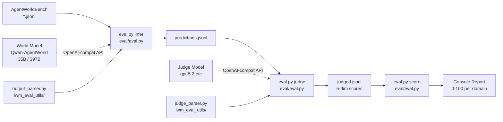
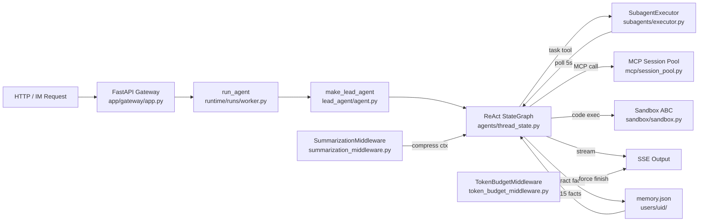
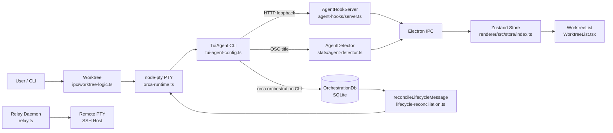

```mermaid
flowchart LR
    H[Human Channel\nMessage] --> PP[parseMentionPlan\nmention-plan.ts]
    PP -->|MentionPlan DAG| TQ[(agent_task_queue\nPostgreSQL)]
    TQ --> POLL[pollRemoteTasks\nremote-daemon.ts]
    POLL --> EXEC[executeRemoteTask\nremote-daemon.ts]
    EXEC --> CTX[prepareDaemonTaskContext\ntask-context.ts]
    CTX --> AR[runAgentRouter\nagent-router/router.ts]
    AR --> HA[HarnessAdapter\nadapters/claude.ts]
    HA -->|stdout events| MAN[Output Manifests\nruntime-output-manifests.ts]
    MAN --> POST[postMessageSync\nservices/src/index.ts]
    POST --> CH[Channel Output]
    AR -->|approval needed| GATE[waitForRuntimeApproval\nremote-daemon.ts]
    GATE -->|human approved| HA
```

# Weekly Agentic AI Scan — 2026-06-27

## Executive Summary

- **Qwen-AgentWorld** (QwenLM): Model MoE 35B/397B đầu tiên train *environment simulation* làm primary objective — không cần infrastructure thật, thuần language generation mô phỏng 7 domain (MCP, Terminal, Search, SWE, Android, Web, OS); kèm arXiv paper và benchmark riêng.
- **AgentSpace** (HKUDS): Workspace TypeScript biến AI agent thành "Digital Employee" — có identity, budget, channel access ngang hàng human — với `parseMentionPlan()` dịch @-mention ngôn ngữ tự nhiên (kể cả tiếng Trung) thành DAG multi-step task có explicit `dependencies[]`.
- **DeerFlow** (ByteDance): SuperAgent framework với 26-middleware stack production-grade, subagent pool 3 workers, per-thread sandbox cô lập, và 8 IM channel integrations (WeChat, Feishu, DingTalk, v.v.); boundary `harness/app` được enforce bằng CI test riêng.
- **Orca** (stablyai): ADE (Agent Development Environment) Electron chạy fleet 40+ coding agent song song, mỗi agent cô lập trong git worktree riêng, với PTY-native terminal host và SQLite-backed inter-agent message bus.

## Table of Contents

- [Repo 1: QwenLM/Qwen-AgentWorld](#repo-1-qwenlmqwen-agentworld)
- [Repo 2: HKUDS/AgentSpace](#repo-2-hkudsagentspace)
- [Repo 3: bytedance/deer-flow](#repo-3-bytedancedeer-flow)
- [Repo 4: stablyai/orca](#repo-4-stablyaiorca)

---

## Repo 1: QwenLM/Qwen-AgentWorld

**Link**: https://github.com/QwenLM/Qwen-AgentWorld  
**Paper**: https://arxiv.org/abs/2606.24597

### §1 — Quick Context

**Pitch**: Framework + eval cho Language World Model (LWM) mô phỏng môi trường agentic thuần ngôn ngữ — model *predict* next observable state thay vì thực thi hành động thật.

**Tech stack**: Python (chỉ 1 runtime dep: `openai`), inference qua SGLang / vLLM / Transformers; model chính `Qwen-AgentWorld-35B-A3B` (MoE hybrid GatedDeltaNet + GatedAttention, 262K context) và `397B-A17B`.

**Repo health**: 571 stars, created 2026-06-22, ~5 contributors, CI chỉ có `.github/workflows/inactive.yml`, không có test suite riêng — complexity nằm trong weights + prompts.

### §2 — Architecture Deep-Dive

**A. Component Inventory**

- `eval/eval.py` — Entry point toàn bộ pipeline; 3 subcommands: `infer`, `judge`, `score`
- `eval/lwm_eval_utils/output_parser.py` — `parse_model_output()`: strip `<think>` CoT blocks, extract `<predicted_observation>` tag
- `eval/lwm_eval_utils/judge_parser.py` — `parse_judge_output()` với 4 fallback strategies: markdown code block → JSON với "scores" key → brace-match last JSON → regex
- `eval/lwm_eval_utils/task_configs.py` — Domain configs, `SCORE_DIMENSIONS`, `JUDGE_USER_PROMPT`, `TURING_JUDGE_USER_PROMPT`, `REF_ANSWER_JUDGE_USER_PROMPT`
- `prompts/{android,mcp,os,search,swe,terminal,web}/system_prompt.txt` — System prompts per domain (7 files)
- `prompts/{android,mcp,os,search,swe,terminal,web}/judge_system_prompt.txt` — Judge prompts per domain

**B. Control Flow — 3-Stage Sequential Evaluation Pipeline**

Pattern: **Sequential pipeline** (không có agent loop, không có orchestration runtime)

1. `eval.py infer`: `load_data()` glob `*_test.jsonl` từ `AgentWorldBench/` → build OpenAI messages list per task → gọi LWM API (`max_tokens=32768`, `temperature=0.6`)
2. `output_parser.py` strip `<think>...</think>` → extract `<predicted_observation>` → ghi `predictions.jsonl`
3. `eval.py judge`: đọc `predictions.jsonl` → `build_judge_messages()` ghép judge system prompt + context + prediction + ground truth → gọi Judge LLM (max 3 retries)
4. `judge_parser.py` parse response → `Dict{strengths, weaknesses, scores{format,factuality,consistency,realism,quality}}` → ghi `judged.jsonl`
5. `eval.py score`: `aggregate_scores()` group by subtask, normalize 1-5 → 0-100, in console report

**C. State & Data Flow**

- Message format: `List[Dict]` (OpenAI format), per-sample trong JSONL (mỗi record embed system prompt riêng)
- Output container: `<predicted_observation>...</predicted_observation>` unified cho tất cả 7 domain
- Storage: JSONL files thuần; không có DB

**D. Tool/Capability Integration**

Không có tool execution thật — tools được **mô phỏng**. Mỗi domain định nghĩa action space khác nhau mà LWM phải predict next state:
- MCP: JSON `{name, arguments}` → model trả tool response (JSON/text)
- Terminal: JSON keystrokes + durations → model trả terminal stdout + prompt
- Search: `web_search(query)`, `web_extractor(url)`, `dict_memory(op)` → model trả results
- Android/Web/OS: UI action → model trả next accessibility tree / page state

**E. Memory Architecture** *(skip — không có external memory)*

In-context conversation history là mechanism duy nhất (262K token window). Search domain có simulated `dict_memory` — model simulate responses, không persist thật.

**F. Model Orchestration**

- World Model: `Qwen-AgentWorld-35B-A3B` (40 layers, pattern 10× [3×(GatedDeltaNet→MoE) + 1×(GatedAttention→MoE)], hidden dim 2048, 256 experts / 8 routed)
- Judge: Any OpenAI-compatible endpoint (caller-supplied); README ví dụ `gpt-5.2-2025-12-11`

**G. Observability & Eval**

3 evaluation modes trong `task_configs.py`: Standard (score 1-5 / 5 dimensions), Turing Test (binary A/B discrimination), Reference Comparison (head-to-head). 5 scoring dimensions: `format`, `factuality`, `consistency`, `realism`, `quality`. Không có distributed tracing.

**H. Extension Points**

Swap benchmark data (JSONL format), swap model endpoint, swap judge — tất cả qua CLI args.

### §3 — Architecture Diagram

### §4 — Verdict

**Điểm novel**: Model architecture hybrid GatedDeltaNet (linear attention) + GatedAttention (quadratic) interleaved là technical contribution thật — không phải decoder-only standard, enable 262K context efficiently. Quan trọng hơn: *environment simulation là training objective từ stage one*, không phải fine-tuning sau trên task-specific data. 3 evaluation modes — đặc biệt Turing Test (human-indistinguishable simulation) — là eval methodology đáng học.

**Red flags**: Codebase thực chất chỉ có 4 Python files; không có `requirements.txt` hay `pyproject.toml`; không có test suite; CI workflow tên `inactive.yml`. Toàn bộ giá trị nằm trong weights + benchmark data external — repo này chủ yếu là eval harness.

**Open questions**: Training data curation process cho 7 domain (bao nhiêu % real execution traces vs synthetic?)? Model có thể serve như simulation backend cho agent training (không chỉ eval) như đề xuất trong paper không? Accuracy gap giữa 35B và 397B variant trên từng domain là bao nhiêu?

---

## Repo 2: HKUDS/AgentSpace

**Link**: https://github.com/HKUDS/AgentSpace

### §1 — Quick Context

**Pitch**: Platform TypeScript biến AI agent thành "Digital Employee" — có identity, budget, channel access ngang hàng human — trong cùng workspace.

**Tech stack**: TypeScript, Next.js 16, React 19, PostgreSQL 16 (schema v18, 47 tables), Node.js 24, npm 11. Provider support: Claude Code, Codex, Gemini, OpenCode, OpenClaw, NanoBot, Hermes.

**Repo health**: 457 stars, created 2026-06-22, 6 open issues, CI có Playwright E2E + Vitest + TypeScript typecheck per package.

### §2 — Architecture Deep-Dive

**A. Component Inventory**

- `packages/domain/src/workspace.ts` — Core domain types: `WorkspaceMessage`, `WorkspaceMode ("im"|"market")`, `AgentSpaceState`
- `packages/domain/src/mention-plan.ts` — `MentionStep`, `MentionPlan`, `parseMentionPlan()` — NLU to DAG
- `packages/domain/src/daemon-provider.ts` — `DAEMON_PROVIDER_IDS = ["claude","codex","gemini","opencode","openclaw","nanobot","hermes"]`
- `packages/daemon/src/agent-router/router.ts` — `runAgentRouter()`, `mergeEventStreams()`, `validateRunRequest()`
- `packages/daemon/src/agent-router/types.ts` — `HarnessAdapter` interface (5 methods: detect, buildLaunch, run, normalizeError), `AGENT_ROUTER_HARNESSES`
- `packages/daemon/src/agent-router/adapters/claude.ts` — `claudeAdapter: HarnessAdapter` — Claude Code adapter
- `packages/daemon/src/remote-daemon.ts` — `pollRemoteTasks()` (3s interval), `executeRemoteTask()`, `waitForRuntimeApproval()`
- `packages/daemon/src/provider-runtime.ts` — `PROVIDER_CATALOG`, `runProviderTask()`, `detectProviders()`
- `packages/daemon/src/task-context.ts` — `ParsedTaskPayload` (30+ fields), `prepareDaemonTaskContext()`
- `packages/daemon/src/runtime-output-manifests.ts` — `AgentOutputManifest`, `ChannelDocumentsManifest`, `SkillImportsManifest`, `KnowledgeProposalsManifest`, `ExternalSheetsManifest`
- `packages/daemon/src/state.ts` — PID state, `DEFAULT_HEARTBEAT_INTERVAL_MS = 15_000`, `DEFAULT_TASK_POLL_INTERVAL_MS = 3_000`
- `packages/db/src/postgres-schema.ts` — Schema v18, 47 tables: `agent_task_queue`, `agent_router_session`, `token_usage`, `budget`, `audit_log`, `workspace_snapshot`
- `packages/services/src/index.ts` — `postMessageSync()`, `createTaskSync()`, `continueAutoContinuationAfterTaskSync()`
- `apps/web/` — Next.js 16 frontend (App Router + server actions)
- `apps/cli/src/index.ts` — CLI: `doctor`, `daemon`, `employee`, `task`, `skill`, `cost`

**B. Control Flow — Hierarchical DAG Dispatch với Approval Gate**

Pattern: **Hierarchical multi-agent** — mention-plan tạo DAG → daemon polling → harness adapter execution

1. Human @-mention trong channel → `parseMentionPlan()` (`mention-plan.ts`) parse NL (markers tiếng Trung: "然后", "再", "之后"; handoff: "发给", "交给") → `MentionPlan { mode: parallel|sequential, steps: MentionStep[] }`
2. `MentionStep` có explicit `{ agentId, instruction, dependencies[], handoffKind: document|attachment|message }`
3. Task enqueued → `agent_task_queue` row (PostgreSQL)
4. `pollRemoteTasks()` (`remote-daemon.ts`, 3s) → `claimTask()` → `executeRemoteTask()`
5. `prepareDaemonTaskContext()` build prompt với channel history, knowledge pages, skill files
6. `runProviderTask()` → `runAgentRouter()` → `getHarnessAdapter()` → `adapter.detect()` → `adapter.buildLaunch()` → `adapter.run()` (streams `AgentRouterEvent[]`)
7. Tool nguy hiểm → `createRuntimeApproval()` → `waitForRuntimeApproval()` polling → human approve/reject trong web UI
8. `collectRuntimeOutputBundle()` → parse manifest files → `applyKnowledgeProposalOperations()` / `applySkillImportOperations()`
9. Output → `postMessageSync()` → channel

**C. State & Data Flow**

- Message format: `WorkspaceMessage { id, channel, speaker, summary, attachments[], mentions[], acknowledgements[] }`
- Storage: PostgreSQL 16; `workspace_snapshot.state_json` cho full state; `agent_router_context_snapshot` cho memory snapshots
- Session continuity: `RouterSessionPromptContext { memorySummary, providerSessionId, transcriptLines, latestHandoffSnapshot, continuationMode }`

**D. Tool/Capability Integration**

Agents không gọi API — họ viết JSON manifest files vào working directory. `RuntimeToolCapability { allowedShellPatterns }` được convert thành Claude `--allowedTools Bash(pattern)`. Manifest provenance check: `generatedBy: "agent-space-cli"` assertion ngăn manual injection. Output size limits: max 64 files, 10MB/file, 25MB total bundle.

**E. Memory Architecture**

- Short-term: `RouterSessionPromptContext.memorySummary` + `transcriptLines` injected vào prompt
- Long-term: `KnowledgePage` hierarchical pages per agent (`knowledgeContextDir`); agent đề xuất thay đổi qua `KnowledgeProposalsManifest` → human approval flow
- Procedural: `WorkspaceSkill` Markdown files (`skillContextDir`, SKILL.md convention), importable từ `skills.sh`, `clawhub`, `github`

**F. Model Orchestration**

`HarnessAdapter` 5-method interface normalize tất cả providers. Session resumption: Claude (`--resume`), Codex (`thread_id`), OpenClaw (session profile). Cost tracking: `model_pricing` table + `token_usage` rows + `budget` table với `checkBudgetSync()` trước mỗi dispatch.

**G. Observability & Eval**

`token_usage`, `budget`, `audit_log` tables trong PostgreSQL. CLI command `cost` để xem spending per agent. `containsSensitiveTokenMaterial()` scan trước khi knowledge proposal được apply. Không có distributed tracing.

**H. Extension Points**

`HarnessAdapter` interface cho new providers. Runtime Apps via CLI-Hub (`pip|npm|uv|bundled|manual`). `AutomationRule { trigger: message_received|task_completed|schedule, conditions[], actions[] }`. Scheduled tasks với cron expressions.

### §3 — Architecture Diagram

### §4 — Verdict

**Điểm novel**: `parseMentionPlan()` dịch natural language (bao gồm Chinese sequential markers) thành DAG với explicit `dependencies[]` và `handoffKind` — NLU-to-orchestration bridge không thấy ở frameworks khác. Manifest-driven output pattern (agent writes files, daemon reads) tạo clear isolation boundary và dễ audit. `containsSensitiveTokenMaterial()` bảo vệ knowledge base khỏi credential leakage.

**Red flags**: Service layer dùng `*Sync` functions toàn bộ — synchronous DB operations sẽ bottleneck khi concurrent agents cao. Schema v18 sau chỉ 5 ngày tồn tại → migration velocity cao, schema chưa ổn định. "OpenClaw" provider được reference nhiều nhưng không có documentation public.

**Open questions**: Parallel `MentionStep[]` có chạy truly concurrent hay vẫn sequential trong daemon? `continuationMode: "fallback"` trigger khi nào và fallback sang provider nào? Budget enforcement (`checkBudgetSync()`) có atomic không hay có race condition?

---

## Repo 3: bytedance/deer-flow

**Link**: https://github.com/bytedance/deer-flow

### §1 — Quick Context

**Pitch**: SuperAgent framework ByteDance với 26-middleware stack, subagent pool 3 workers có polling mechanism, per-thread sandbox cô lập, và 8 IM channel integrations (WeChat, Feishu, DingTalk, WeCom, Discord, Slack, Telegram).

**Tech stack**: Python 3.12, LangGraph 1.1.9+, LangChain 1.2.15+, FastAPI, SQLite/PostgreSQL, Textual TUI, Docker AIO Sandbox. Deps: `deerflow-harness` v2.1.0, 30+ packages.

**Repo health**: ~75K stars, pushed 2026-06-26, active ByteDance team, CI có Blockbuster test enforce non-blocking IO, Alembic migrations.

### §2 — Architecture Deep-Dive

**A. Component Inventory**

- `backend/packages/harness/deerflow/agents/factory.py` — `create_deerflow_agent()` → `CompiledStateGraph`
- `backend/packages/harness/deerflow/agents/lead_agent/agent.py` — `make_lead_agent()`, `build_middlewares()` — orchestration entry
- `backend/packages/harness/deerflow/agents/thread_state.py` — `ThreadState` TypedDict: `sandbox`, `artifacts`, `todos`, `viewed_images`, `promoted`
- `backend/packages/harness/deerflow/agents/middlewares/token_budget_middleware.py` — max 200K tokens, warn at 80%, force finish at 100%
- `backend/packages/harness/deerflow/agents/middlewares/summarization_middleware.py` — trigger ~32K tokens, keep last 10 messages, rescue recent skill reads
- `backend/packages/harness/deerflow/agents/middlewares/loop_detection_middleware.py` — `warn_threshold:3`, `hard_limit:5` tool cycles, `tool_freq_hard_limit:50`
- `backend/packages/harness/deerflow/agents/middlewares/memory_middleware.py` — facts extraction, 30s debounce, inject top 15 facts
- `backend/packages/harness/deerflow/agents/middlewares/subagent_limit_middleware.py` — `MAX_CONCURRENT_SUBAGENTS=3`
- `backend/packages/harness/deerflow/agents/middlewares/sandbox_audit_middleware.py` — security logging cho shell/file ops
- `backend/packages/harness/deerflow/agents/middlewares/skill_activation_middleware.py` — `/skill-name` slash command → inject SKILL.md
- `backend/packages/harness/deerflow/tools/builtins/task_tool.py` — `@tool("task")` — subagent delegation entry point
- `backend/packages/harness/deerflow/subagents/executor.py` — `SubagentExecutor`, `SubagentStatus` enum, dual thread pools
- `backend/packages/harness/deerflow/subagents/builtins/general_purpose.py` — `GENERAL_PURPOSE_CONFIG` (max_turns=150)
- `backend/packages/harness/deerflow/subagents/builtins/bash_agent.py` — `BASH_AGENT_CONFIG` (max_turns=60)
- `backend/packages/harness/deerflow/sandbox/sandbox.py` — `Sandbox` ABC: `execute_command`, `read_file`, `glob`, `grep`, `write_file`
- `backend/packages/harness/deerflow/mcp/session_pool.py` — MCP session pool per `(server_name, user_id:thread_id)`
- `backend/packages/harness/deerflow/models/factory.py` — `create_chat_model()`, reflection-based dynamic instantiation
- `backend/app/gateway/app.py` — FastAPI: Auth → CSRF → CORS middleware stack
- `backend/app/channels/feishu.py` — Feishu/Lark WebSocket integration
- `backend/packages/harness/deerflow/runtime/runs/worker.py` — `run_agent()` main execution loop
- `backend/packages/harness/deerflow/tracing/` — LangSmith + Langfuse tracing

**B. Control Flow — ReAct với Hierarchical Subagent Offloading**

Pattern: **ReAct-style** (standard LangGraph `StateGraph`) với subagent delegation qua `task` tool

1. Request → `app/gateway/app.py` (FastAPI: Auth + CSRF + CORS) → `run_agent()` (`runtime/runs/worker.py`)
2. `make_lead_agent()` → `create_deerflow_agent()` → `CompiledStateGraph` (LangChain ReAct: model node → tool node → conditional edge)
3. 26 middlewares wrap vào graph; ordering strict: `InputSanitizationMiddleware` first → ... → `ClarificationMiddleware` last
4. ReAct loop: lead agent think → tool selection → execute
5. Khi gọi `@tool("task")` (`task_tool.py`):
   - Validate agent type, inherit sandbox/thread/model/trace_id từ parent context
   - `SubagentExecutor.execute_async()` → `_scheduler_pool` (3 `ThreadPoolExecutor` workers)
   - Polling 5s: `get_background_task_result(task_id)` → stream `task_running` events về SSE
   - Subagent: isolated graph, `checkpointer=False`, max 150 turns
6. `TokenBudgetMiddleware` hits 200K → force final answer
7. `SummarizationMiddleware` context ~32K → compress history, keep last 10 messages

**C. State & Data Flow**

- `ThreadState` extends `AgentState` với reducers: `merge_sandbox`, `merge_artifacts` (dedup), `merge_todos` (last-wins), `merge_viewed_images`
- Checkpointing: SQLite default (`.deer-flow/data`), PostgreSQL optional với `pg_advisory_lock`
- Per-thread isolation: `.deer-flow/users/{user_id}/threads/{thread_id}/user-data/`
- Tool output budgeting: `ToolOutputBudgetMiddleware` cap tool results trước khi model thấy (`externalize_min_chars: 12000`, `fallback_max_chars: 30000`)

**D. Tool/Capability Integration**

MCP via `MultiServerMCPClient` (`langchain_mcp_adapters`), session pool per `(server_name, user_id:thread_id)` — mtime-invalidated cache. Skill activation: `/skill-name` → `SkillActivationMiddleware` → inject `SKILL.md` as `SystemMessage`. `DeferredToolFilterMiddleware` + `tool_search` tool: MCP tools ẩn cho đến khi explicitly promoted.

**E. Memory Architecture**

- Short-term: In-context + `SummarizationMiddleware` compression (trigger 32K, keep last 10)
- Long-term: `memory.json` per-user: `{ workContext, personalContext, facts[{id, content, category, confidence, createdAt}] }`
- Extraction: `MemoryMiddleware.after_agent()` → 30s debounce → background LLM call → atomic write (temp + rename)
- Injection: top 15 facts trong `<memory>` tags, `max_injection_tokens: 2000`; guaranteed 500 tokens cho category `"correction"`
- Retrieval: keyword filter (không có vector search)

**F. Model Orchestration**

Reflection-based factory: `create_chat_model(name)` → `resolve_class()` dynamic import. 12+ providers: OpenAI, Anthropic, Ollama, DeepSeek, Gemini, MiMo, StepFun, MiniMax, vLLM, MindIE, OpenRouter. Thinking mode: 3 patterns. Subagents inherit via `model: "inherit"`.

**G. Observability & Eval**

LangSmith + Langfuse tracing (`tracing/`). `SandboxAuditMiddleware` log tất cả shell/file operations. `TokenUsageMiddleware` per-request counting. `RunJournal` track execution. CI: `tests/test_harness_boundary.py` enforce `deerflow.*` không import `app.*` — architectural boundary có CI backing.

**H. Extension Points**

Community plugins (`community/` folder: `aio_sandbox`, `tavily`, `jina_ai`, `firecrawl`, `brave`, `exa`). MCP servers via config. Custom subagents via `subagents/registry.py`. Skill system: SKILL.md files với `/skill-name` activation.

### §3 — Architecture Diagram

### §4 — Verdict

**Điểm novel**: 26-middleware stack với ordering được enforce bởi `build_middlewares()` code (không phải comment) là separation of concerns cực kỳ granular. `harness/app` architectural boundary có CI test riêng (`test_harness_boundary.py`) — đây là production-grade discipline hiếm gặp trong open-source agent frameworks. IM integrations cho WeChat/Feishu/DingTalk (Chinese enterprise market) rất ít repo nào có.

**Red flags**: Single Gateway worker enforced (comment trong code) → không horizontal scale được. Blockbuster CI test implies blocking IO là vấn đề thật trong codebase hiện tại. Docker sandbox image từ Volcengine (ByteDance cloud) — external dependency cho production isolation; `LocalSandboxProvider` có `allow_host_bash: false` default nhưng dễ misconfigure.

**Open questions**: Middleware ordering được enforce như thế nào lúc runtime (nếu ai đó gọi `build_middlewares()` sai thứ tự)? Budget của subagent có tính vào parent 200K token budget không (hay separate budget)? `tool_freq_hard_limit: 50` và `MAX_CONCURRENT_SUBAGENTS: 3` interact như thế nào khi 3 subagents cùng gọi một MCP tool?

---

## Repo 4: stablyai/orca

**Link**: https://github.com/stablyai/orca | **Website**: https://onorca.dev/

### §1 — Quick Context

**Pitch**: ADE (Agent Development Environment) Electron chạy fleet 40+ coding agent song song, mỗi agent cô lập trong git worktree riêng, với SQLite-backed inter-agent messaging.

**Tech stack**: TypeScript, Electron 42.3.3, React 19.2.5, node-pty 1.1.0, SQLite (OrchestrationDb), SSH2, React Native (mobile companion), Swift (macOS Computer Use), Node ≥24, pnpm 10.

**Repo health**: ~8K stars, pushed 2026-06-27, YC-backed, Playwright E2E (`@stablyai/playwright-test`), Vitest unit tests, oxlint + oxfmt.

### §2 — Architecture Deep-Dive

**A. Component Inventory**

- `src/shared/tui-agent-config.ts` — `TUI_AGENT_CONFIG`: 40 agent configs với `promptDelivery` mode per agent
- `src/shared/types.ts` — Master type file: `CreateWorktreeArgs`, `WorkspaceSessionState`, `Worktree`, `TuiAgent`, `GlobalSettings`
- `src/main/runtime/orca-runtime.ts` — `OrcaRuntimeService` — central hub: PTY graph, automation, mobile sessions, browser bridge
- `src/main/agent-hooks/server.ts` — `AgentHookServer` — HTTP loopback listener: `UserPromptSubmit`, `PermissionRequest`, `PreToolUse`, `PostToolUse`
- `src/main/stats/agent-detector.ts` — `AgentDetector` — OSC title scanner classify PTYs (`unknown|agent|stopped`), emit `onAgentStart/onAgentStop`
- `src/main/runtime/claude-agent-teams-service.ts` — `ClaudeAgentTeamsService` — multi-agent Claude via tmux emulation
- `src/main/runtime/claude-agent-teams-tmux-dispatcher.ts` — `ClaudeAgentTeamsTmuxDispatcher` — tmux command execution
- `src/main/runtime/orchestration/groups.ts` — `AGENT_NAME_GROUPS`, `GroupAddress`, `resolveGroupAddress()`
- `src/main/runtime/orchestration/lifecycle-reconciliation.ts` — `reconcileLifecycleMessage()` — worker_done/heartbeat dispatch lock release
- `src/relay/relay.ts` — Relay daemon: JSON-RPC over stdin/stdout hoặc Unix socket, deployed via SSH
- `src/relay/agent-exec-handler.ts` — `AgentExecHandler` — remote agent command execution
- `src/renderer/src/store/index.ts` — Zustand v5 store (`useAppStore`), exposed trên `window` cho Playwright E2E
- `src/renderer/src/components/sidebar/WorktreeList.tsx` — Sidebar với dnd-kit drag-and-drop, autoscroll
- `src/cli/specs/orchestration.ts` — CLI: `orchestration send/task-update/check/inbox/taskList`
- `src/main/ipc/worktree-logic.ts` — `computeBranchName()`, `mergeWorktree()`, `getConfiguredBranchPrefix()`
- `src/main/telemetry/burst-cap.ts` — Three-bucket rate limiter cho PostHog events
- `native/computer-use-macos/Sources/OrcaComputerUseMacOS/main.swift` — `AgentRuntime: NSObject, NSApplicationDelegate` — macOS Computer Use (accessibility API)

**B. Control Flow — Event-Driven với SQLite Task DAG**

Pattern: **Event-driven** + worktree lifecycle state machine + SQLite-backed inter-agent message bus

1. User tạo worktree → `CreateWorktreeArgs { baseBranch, startup: WorktreeStartupLaunch }` → `git worktree add` → branch auto-name qua `computeBranchName()` + `getConfiguredBranchPrefix()`
2. Agent launched trong PTY (`node-pty`) với 1 trong 5 injection modes: `argv` | `stdin-after-start` | `flag-prompt` | `flag-prompt-interactive` | `flag-interactive`
3. Agent POSTs hook events → `AgentHookServer` (loopback HTTP, token từ `ORCA_AGENT_HOOK_*` env) → Electron IPC → `OrcaRuntimeService` → Zustand store → UI update
4. Parallel detection fallback: OSC title scanning qua `AgentDetector` → `onAgentStart/onAgentStop` events
5. Orchestration: agent gọi `orca orchestration send <target> <message>` CLI → `OrchestrationDb` (SQLite) persist
6. Task DAG: `pending → ready → dispatched → completed|failed|blocked`; `reconcileLifecycleMessage()` handle lock release
7. Remote agents: `ssh2` → `relay.ts` (JSON-RPC) → remote `node-pty` + `RelayAgentHookServer` (replay on reconnect)
8. Approval gate: tool request → `AgentHookServer` `PermissionRequest` event → human review trong web UI → approve/reject IPC

**C. State & Data Flow**

- Renderer: Zustand v5, `WorkspaceSessionState { tabsByWorktree, terminalLayoutsByTabId, browserTabsByWorktree, sleepingAgentSessionsByPaneKey, lastVisitedAtByWorktreeId }`
- Orchestration: SQLite messages table `(id, from_handle, to_handle, subject, body, type, priority, thread_id, sequence)`
- Agent status: `RuntimeWorktreeStatus: 'active'|'working'|'permission'|'done'|'inactive'`; `last-status.json` 250ms trailing-edge debounce, 7-day TTL

**D. Tool Integration & MCP**

Không có native MCP client/server trong Orca. Integration surface:
- Agent Hook Protocol: HTTP loopback `127.0.0.1`, events: `UserPromptSubmit`, `PermissionRequest`, `PreToolUse`, `PostToolUse`, `PostToolUseFailure`
- Plugin Overlay System: materialize agent-specific config files trước khi launch (256KB cap); OpenCode: `OPENCODE_CONFIG_DIR`, Pi: `ORCA_PI_SOURCE_AGENT_DIR`
- Browser Bridge: `AgentBrowserBridge` inject HTML/CSS/cropped screenshots từ live Chromium vào agent prompt (`agent-browser ~0.27.0`)
- `ClaudeAgentTeamsService`: tmux server emulation cho Claude Code `--agent-teams` (`CLAUDE_CODE_EXPERIMENTAL_AGENT_TEAMS: '1'`)

**E. Memory Architecture** *(skip — không có internal memory system)*

Mỗi agent dùng memory mechanism riêng của CLI. Orca chỉ track `last-status.json` và `agent_router_context_snapshot` (relay side).

**F. Model Orchestration**

Provider-agnostic: Orca không gọi LLM API. 40 `TuiAgent` types (claude, codex, gemini, opencode, aider, goose, amp, kimi, qwen-code, grok, devin, v.v.). Per-agent override: `agentCmdOverrides`, `agentDefaultArgs`, `agentDefaultEnv` trong `GlobalSettings`.

**G. Observability & Eval**

PostHog analytics với `burst-cap.ts` (three-bucket rate limiter, opt-in/out tracking). `AgentDetector` track session timestamps per PTY. Relay Status RPC: PID, uptime, memory, active PTY count, socket state. Orchestration CLI: `orchestration.check --all`, `orchestration.taskList`, `orchestration.runStatus`.

**H. Extension Points**

`TUI_AGENT_CONFIG` thêm agent mới với 5 injection modes. `agentCmdOverrides` per agent. `ClaudeAgentTeamsService` cho experimental multi-agent. Sparse checkouts (`sparseDirectories`) cho monorepos lớn.

### §3 — Architecture Diagram

### §4 — Verdict

**Điểm novel**: `ClaudeAgentTeamsService` giả lập tmux server để Claude Code `--agent-teams` có thể spawn sub-panes trong Orca's terminal system mà không cần tmux thật — đây là integration trick khá tinh vi. Git worktree-as-isolation-unit là pattern production-ready nhất trong scan này: mỗi agent có branch riêng, diff riêng, merge decision riêng. 2-layer agent detection (structured HTTP hooks là authoritative + OSC title scan là universal fallback) là resilient design.

**Red flags**: 40 agents nhưng integration depth rất không đồng đều — một số chỉ có `stdin-after-start` mà không có structured hook support, nên UI status kém accurate. Không có native MCP — agents tự xử lý, Orca không có visibility vào MCP tool calls. Security model của relay daemon (có SSH key access + JSON-RPC unlimited) chưa được document rõ.

**Open questions**: Merge strategy khi nhiều worktrees tạo conflicting diffs trên cùng file? `ClaudeAgentTeamsService` works với Claude API (non-subscription) không? `USAGE_WORKTREE_CANONICALIZATION_CONCURRENCY = 8` background scan có gây disk thrash trên monorepos lớn (nhiều worktrees) không?
