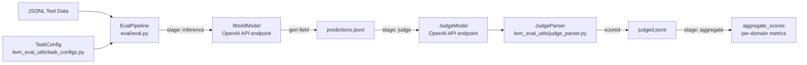
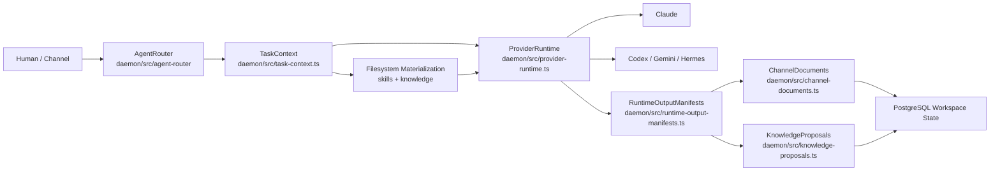
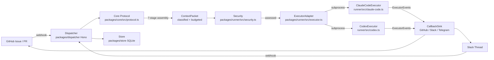
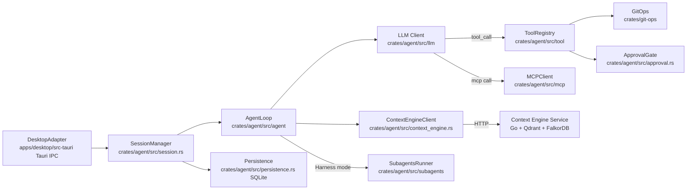

# Agentic AI Weekly Scan — 2026-06-28

## Executive Summary

- **Qwen-AgentWorld** đảo ngược paradigm agent thông thường: thay vì train model để *act*, Alibaba train model để *simulate environments* — đây là bước đệm quan trọng cho agent eval và transfer learning, đi kèm arxiv paper và benchmark đánh bại GPT-5.4.
- **AgentSpace** giải quyết vấn đề provider fragmentation với tầng `ProviderRuntime` chuẩn hóa 7+ runtime (Claude, Codex, Gemini, Hermes...) và sáng tạo trong việc dùng block-level versioned documents như shared memory giữa các agent.
- **opentag** và **Godcoder** đại diện hai hướng đối lập cho coding agents: thread-native mention routing (zero context-switch) vs. local-first Rust core (zero data leak), cả hai đều có kiến trúc rõ ràng và non-trivial engineering.

## Table of Contents

- [Repo 1 — QwenLM/Qwen-AgentWorld](#repo-1--qwenlmqwen-agentworld)
- [Repo 2 — HKUDS/AgentSpace](#repo-2--hkudsagentspace)
- [Repo 3 — amplifthq/opentag](#repo-3--amplifthqopentag)
- [Repo 4 — eli-labz/Godcoder](#repo-4--eli-labzgodcoder)

---

## Repo 1 — QwenLM/Qwen-AgentWorld

**GitHub**: https://github.com/QwenLM/Qwen-AgentWorld | **Paper**: https://arxiv.org/abs/2606.24597

### §1 — Quick Context

**Pitch**: Dạy LLM *simulate* tool outputs thay vì chỉ *call* tools — "Language World Model" làm nền cho agent eval và transfer learning trên 7 domain.

**Tech stack**: Python, SGLang/vLLM inference, OpenAI-compatible API endpoint, Qwen models (35B & 397B), 7 domains: MCP, Search, Terminal, SWE, Android, Web, OS.

**Repo health**: 599★, 53 forks, 1 issue, created 2026-06-22, arxiv paper kèm theo (2606.24597), Apache 2.0. Không thấy CI config rõ ràng. Contributor: QwenLM org.

---

### §2 — Architecture Deep-Dive

#### A. Component Inventory

- **WorldModel** (`eval/eval.py:run_inference()` → OpenAI-compatible endpoint) — mô hình thực sự (35B/397B) exposed qua REST API, nhận system+user messages, trả về `**Environment Observation:**`-tagged response.
- **EvalPipeline** (`eval/eval.py`) — orchestrator 3-stage: inference → judge → aggregate. Entry point: `main()` với CLI arg `--stages`.
- **TaskConfig** (`eval/lwm_eval_utils/task_configs.py`) — per-domain configuration: response markers, response tag, đường dẫn system prompt và judge prompt cho 7 domain.
- **OutputParser** (`eval/lwm_eval_utils/output_parser.py`) — extract `**Environment Observation:**` tagged block từ world model response.
- **JudgeParser** (`eval/lwm_eval_utils/judge_parser.py`) — multi-strategy JSON extraction từ judge LLM output (4 fallback strategies: markdown code block → last JSON with "scores" → brace-matching backward → brace-matching forward; kèm JSON repair).
- **Domain Prompts** (`prompts/{terminal,swe,search,mcp,android,web,os}/`) — system prompts domain-specific cho từng environment simulation context.

#### B. Control Flow — Planner-Executor (3-stage pipeline, not ReAct)

1. `main()` parse CLI với `--stages` selector và đường dẫn data directory.
2. **Stage inference**: `load_data()` đọc JSONL (có trường `system_prompt`, `user_content`, `ground_truth`); `run_inference()` gửi message tới WorldModel endpoint, lưu field `gen` vào `predictions.jsonl`.
3. **Stage judge**: `build_judge_messages()` inject cả `gen` lẫn `ground_truth` vào judge prompt (3 modes: standard 5-dim, Turing test, reference comparison); `run_judge()` gọi judge model với retry logic (3 attempts); `JudgeParser.parse_judge_output()` extract scores.
4. Kết quả judge được lưu vào `judged.jsonl` với các score fields.
5. **Stage aggregate**: `aggregate_scores()` normalize 1-5 → 0-100 bằng `(raw-1)/4*100`, group theo subtask domain, report per-dimension metrics.

#### C. State & Data Flow

- Input format: JSONL với fields `system_prompt`, `user_content`, `ground_truth`.
- Intermediate: `predictions.jsonl` (thêm `gen`), `judged.jsonl` (thêm score fields).
- Không có persistent state giữa stages — pipeline thuần file-based.
- Context window: single-turn inference, không có conversation history.
- Message format giữa components: Python dict / JSONL, không có typed schema.

#### D. Tool / Capability Integration

WorldModel **không call tools** — nó *simulate* tool outputs. `ground_truth` là actual environment response; model phải predict observation sát với thực tế nhất. Judge model đánh giá chất lượng simulation, không phải task completion.

Không có tool registry hay function-calling framework.

#### E. Memory Architecture

Không có memory. Kiến thức được encode trong model weights từ 10M+ real-world interaction trajectories (continuous pretraining + SFT + RL). Stateless per-sample.

#### F. Model Orchestration

- **WorldModel role**: Qwen-35B hoặc Qwen-397B — simulate environment observations.
- **Judge role**: configurable model (bất kỳ OpenAI-compatible endpoint) — score quality.
- 3 evaluation modes trong judge: (1) standard 5-dim scoring, (2) Turing test (real vs. simulated), (3) reference comparison (world model vs. reference model, cùng ground truth).
- Không có parallelism visible trong eval script — sequential processing.

#### G. Observability & Eval

- 5-dimension eval framework: **format** (structure compliance), **factuality** (accuracy), **consistency** (context alignment), **realism** (plausibility), **quality** (overall excellence).
- Turing test mode là metric độc đáo: nếu judge không phân biệt được model-gen vs. real-env output, world model coi như "pass".
- `JudgeParser` implement 4-strategy JSON extraction + repair: đủ robust để handle noisy LLM judge outputs.
- Scores clamped to [1, 5] range với validation trong `_extract_scores()`.

#### H. Extension Points

- Custom domain: thêm directory mới trong `prompts/`, khai báo config trong `TaskConfig` dict, cung cấp JSONL test data.
- Custom model: bất kỳ OpenAI-compatible endpoint — không locked vào Qwen weights.
- Custom judge: configurable model riêng biệt.

---

### §3 — Architecture Diagram

---

### §4 — Verdict

**Điểm novel**: (1) Paradigm "Language World Model" — train model simulate tool outputs thay vì call tools, tạo ra infinite synthetic environments cho agent training. (2) Turing test evaluation mode là metric định lượng "realism" mà các agent evals thông thường bỏ qua — nếu judge không phân biệt được model vs. real env, đó là bar rõ ràng hơn task-success-rate. (3) 5-dimension scoring (đặc biệt `realism` và `consistency`) phù hợp với simulation quality hơn binary pass/fail.

**Red flags**: Eval script sequential, sẽ rất chậm trên dataset lớn. Không có unit tests trong `eval/`. Repo chủ yếu là research artifact — không có SDK, không có deployment guide, không có integration hooks. `prompts/` là directories không chứa file trực tiếp (cần 1 hop thêm để đọc actual prompt content).

**Open questions**: Training data 10M trajectories được constructed như thế nào — từ sandbox execution hay human annotation? World model có thể dùng như agent *planner* (generate synthetic future states) không, hay chỉ là eval tool? So sánh với RAG over API documentation cho tool simulation?

---

## Repo 2 — HKUDS/AgentSpace

**GitHub**: https://github.com/HKUDS/AgentSpace

### §1 — Quick Context

**Pitch**: Workspace cộng tác cho human + nhiều AI agent như một team — có governance, audit trail, và shared document state, không phải chatbot.

**Tech stack**: TypeScript, Next.js (web UI `apps/web/`), Node.js (daemon `packages/daemon/`), PostgreSQL (persistence), Docker, 7+ provider runtimes (Claude, Gemini, Codex, OpenCode, OpenClaw, Hermes, NanoBot).

**Repo health**: 486★, 54 forks, 6 open issues, Apache 2.0, active (pushed 2026-06-27), có `.github/` CI config, README song ngữ EN/ZH.

---

### §2 — Architecture Deep-Dive

#### A. Component Inventory

- **ProviderRuntime** (`packages/daemon/src/provider-runtime.ts`, 68KB) — abstraction layer normalize 7+ AI provider runtimes; handles: binary detection (`detectProviders()`), sandboxed execution, event streaming (`ProviderTaskEvent`), session management, permission callbacks (`ProviderApprovalRequest/Decision`), error classification.
- **AgentRouter** (`packages/daemon/src/agent-router/`) — routes tasks tới ProviderRuntime phù hợp dựa trên agent config và provider availability.
- **TaskContext** (`packages/daemon/src/task-context.ts`, 43KB) — assembles complete execution context: parse input JSON → resolve agent profile + skills + knowledge pages → materialize tới filesystem → build system prompt → return `PreparedDaemonTaskContext`.
- **ChannelDocuments** (`packages/daemon/src/channel-documents.ts`, 24KB) — shared document store với block-level versioned editing, conflict detection, access control (viewer/editor/forwarder roles), native + Google Workspace storage modes.
- **RuntimeOutputManifests** (`packages/daemon/src/runtime-output-manifests.ts`, 77KB) — structured output capture: `AgentOutputManifest`, `ChannelDocumentsManifest`, `KnowledgeProposalsManifest`, `ExternalSheetsManifest`, `ExternalGoogleDocsManifest`, `SkillImportsManifest`. Validates trước khi apply.
- **DaemonClient** (`packages/daemon/src/daemon-client.ts`) — client interface tới daemon API từ web app.
- **SkillImports** (`packages/daemon/src/skill-imports.ts`, 22KB) — manages skill lifecycle: import, materialize, validate.
- **KnowledgeProposals** (`packages/daemon/src/knowledge-proposals.ts`) — agents propose knowledge entries (max 256KB) cho workspace KB.
- **Database** (`packages/db/`) — PostgreSQL persistence layer.
- **WebApp** (`apps/web/`) — Next.js UI cho human team members.

#### B. Control Flow — Hierarchical (supervisor → workers)

1. Human hoặc agent post task/mention trong channel; `AgentRouter` nhận event.
2. `TaskContext.prepareDaemonTaskContext()` resolve agent profile, skills, knowledge pages từ workspace state; materialize skills/knowledge tới filesystem directories; build system prompt.
3. `AgentRouter` select `ProviderRuntime` available (theo provider type và health status).
4. `ProviderRuntime.runProviderTask()` execute agent trong sandboxed environment, emit `ProviderTaskEvent` stream (normalized từ provider-specific formats).
5. Agent viết structured outputs tới `RuntimeOutputManifests` (documents, sheets, knowledge proposals, skill imports).
6. Manifests validated, bundled (max 64 files, 25MB), applied về workspace state.

#### C. State & Data Flow

- State: PostgreSQL cho durable workspace state; filesystem materialization để deliver skills/knowledge tới agent runtime.
- Message format: TypeScript interfaces (`ProviderTaskEvent`, `ParsedTaskPayload`, `PreparedDaemonTaskContext`).
- Document state: block-level versioned edits qua `applyChannelDocumentOperations()` với conflict recording.
- Context delivery: skills và knowledge materialized thành filesystem dirs — agent đọc theo conventions của provider runtime (Claude Code skill format, Codex, etc.).
- Session resumption: conversation sessions trackable across invocations qua `ProviderRuntime` session management.

#### D. Tool / Capability Integration

- Tools delivered qua "skills" materialized tới filesystem — agent provider (Claude Code, Codex, etc.) đọc skills theo native conventions của mình.
- External integrations: Google Workspace (Sheets, Docs) qua `ExternalGoogleDocsManifest` / `ExternalSheetsManifest` — output-based, không phải function-calling.
- Permission system: agent actions validated trước khi apply — `assertAgentDocumentActionAllowedSync()` kiểm tra role.
- Approval callbacks: `ProviderApprovalRequest/Decision` routing qua ProviderRuntime cho sensitive actions.

#### E. Memory Architecture

- **Short-term**: conversation history per session trong PostgreSQL.
- **Long-term**: `KnowledgeProposalsManifest` — agents propose knowledge tới workspace KB (durable, persistent).
- **Shared artifact memory**: `ChannelDocuments` — documents persist across agent invocations, accessible bởi multiple agents theo role. `resolveChannelDocuments()` + `materializeChannelDocuments()` → agent nhận `document.md` + `blocks.json` + `meta.json`.
- Không thấy vector retrieval ở daemon layer — knowledge management dựa vào markdown materialization.

#### F. Model Orchestration

- Model selection: `resolveModelId()` trong `provider-runtime.ts` — không hardcode frontier/small split.
- 7+ providers: Claude, Gemini, Codex, OpenCode, OpenClaw, Hermes, NanoBot — detected từ system PATH.
- Error handling: `normalizeProviderTaskErrorCategory()` classify failures (auth/timeout/protocol/etc.).
- Không thấy fallback chain hoặc parallelism ở router level.

#### G. Observability & Eval

- Audit trail: tất cả agent actions tracked qua manifest system và applied với logging.
- `readNodeMetadata()` và `readProviderTaskFailureMetadata()` cho diagnostics.
- Security: `RuntimeOutputManifests` validate và reject outputs chứa Google credential patterns.
- Không thấy OpenTelemetry — custom event logging.

#### H. Extension Points

- New provider runtime: implement detection + execution trong `provider-runtime.ts`.
- New skill type: package theo Claude Code / Codex skill conventions.
- New external integration: thêm `ExternalXxxManifest` type + handler.
- New platform: agentspace có thể self-hosted (Docker + PostgreSQL).

---

### §3 — Architecture Diagram

---

### §4 — Verdict

**Điểm novel**: (1) `ChannelDocuments` với block-level versioned editing như shared agent memory — multiple agents có thể coordinate trên cùng artifact mà không cần full message-passing; conflict detection tự động. (2) `RuntimeOutputManifests` như output contract explicit — agent phải khai báo mutations (document edits, knowledge proposals, skill imports) thay vì output tự do, enabling validation trước khi apply.

**Red flags**: Pre-built daemon binary (`agent-space-daemon-0.1.3.tgz`) shipped trong repo root — core routing logic có thể không fully open-source. `packages/domain/` và `packages/services/` rất sparse (chỉ có `package.json`, không thấy source code). Không có vector retrieval ở daemon layer — knowledge management không scale cho large teams.

**Open questions**: Logic trong `agent-space-daemon-0.1.3.tgz` có phải là phần không open-source của `AgentRouter`? `packages/sandbox/` implement isolation mechanism gì? Conflict resolution khi 2 agents cùng edit 1 document block đồng thời?

---

## Repo 3 — amplifthq/opentag

**GitHub**: https://github.com/amplifthq/opentag

### §1 — Quick Context

**Pitch**: `@mention` AI agents trực tiếp trong GitHub issue / Slack thread — agent chạy và trả kết quả ngay trong thread, không cần context-switch sang AI workspace.

**Tech stack**: TypeScript, Node.js 22, pnpm monorepo, Hono (web framework cho dispatcher), SQLite (`packages/store/`), vitest (tests), Claude Code & Codex (subprocess executors).

**Repo health**: 335★, 31 forks, 12 open issues, MIT, active (pushed 2026-06-27), v0.1.0, có `vitest.config.ts` và test directories.

---

### §2 — Architecture Deep-Dive

#### A. Component Inventory

- **Core** (`packages/core/src/protocol.ts`, 22KB; `mention.ts`, 15KB; `schema.ts`, 18KB; `action.ts`) — central data types: `OpenTagEvent`, `ContextPacket`, `MutationIntent`, `CapabilityContract`, `PolicyResolution`, `AdapterMutationCompiler`. Implements 7-stage context assembly pipeline via `assembleContextPacketFromEvent()`.
- **Dispatcher** (`packages/dispatcher/`) — Hono-based HTTP service; endpoints: `/healthz`, `/v1/*` (runners, project targets, channel bindings, runs, heartbeats, audit events). Factory function embeddable như library.
- **ExecutorAdapter** (`packages/runner/src/executor.ts`) — interface: `canRun(input)`, `run(input, sink)`, `cancel(runId)`. Implementations: `ClaudeCodeExecutor` (`claude-code.ts`), `CodexExecutor` (`codex.ts`), `EchoExecutor` (`echo.ts`).
- **Security** (`packages/runner/src/security.ts`, 8KB) — `RunnerSecurityPolicy` với: path containment checks, prompt injection scanner (instruction_override / secret_exfiltration / sensitive_file_access patterns), env var scrubbing (`scrubEnvironment()`).
- **GitOps** (`packages/runner/src/git.ts`) — branch isolation, dirty-worktree protection, checkpoint management.
- **GitHub** (`packages/github/`) — webhook event adapter, mention parsing.
- **Slack** (`packages/slack/`) — Slack event adapter.
- **Telegram** (`packages/telegram/`) — Telegram adapter.
- **LocalRuntime** (`packages/local-runtime/`) — local daemon runner.
- **Store** (`packages/store/`) — SQLite persistence cho run state và audit logs.
- **CLI** (`packages/cli/`) — management interface.

#### B. Control Flow — Event-driven với 7-stage Context Assembly

1. User types `@agent-name fix this bug` trong GitHub issue hoặc Slack thread.
2. `GitHub`/`Slack` adapter parse mention thành `OpenTagEvent` (command, context pointers, permissions, callbacks).
3. `Dispatcher` verify Bearer token auth, route tới runner selection.
4. `Core.assembleContextPacketFromEvent()` chạy 7-stage pipeline: **collect** context pointers → **classify** (primary_evidence / supporting_context / background_noise / sensitive_material) → **filter** sensitive → **budget** token consumption → **extract facts** → **summarize intent** → **emit** `ContextPacket`.
5. `preflightMutationIntent()` validate `CapabilityContract` (permissions, executor conditions, auto-apply flag).
6. `Security.assessExecutorRun()` check path containment, scan for prompt injection, scrub environment.
7. `ExecutorAdapter.run()` invoke Claude Code hoặc Codex subprocess với rendered context packet; emit `ExecutorEvent` stream (started/progress/completed/failed).
8. Results posted về thread gốc qua `CallbackSink` (GitHub/Slack/Telegram).

#### C. State & Data Flow

- Message format: `OpenTagEvent` (typed TypeScript) → `ContextPacket` (classified sources + facts + risk metadata) → `ExecutorRunInput` (file-based workspace).
- Storage: SQLite (`packages/store/`) cho run history và audit logs.
- Git state: `packages/runner/src/git.ts` — branch isolation per run, dirty-worktree check trước khi execute.
- Context classification: per-source reasoning về tại sao included/excluded, làm audit trail transparent.

#### D. Tool / Capability Integration

- Claude Code và Codex chạy như **subprocess** (process-level isolation), không phải function-calling. `renderContextPacketForPrompt()` format `ContextPacket` thành string array inject vào subprocess stdin/args.
- `ExecutorAdapter` là pluggable interface — `canRun()` check điều kiện, `cancel()` terminate process.
- Security: 3 operational modes — `enforce` (block violations), `audit` (log only), `off`. Prompt injection patterns detected bằng string matching (không phải sandboxed execution).
- `CapabilityContract` định nghĩa `semantic_actions`, `required_permission_scopes`, `executor_conditions`, `auto_apply` behavior cho mỗi loại mutation.

#### E. Memory Architecture

- Không có persistent cross-run memory.
- Context assembled fresh từ thread/issue content mỗi lần run.
- `ContextPacket.facts` cung cấp ephemeral facts extracted từ current context.

#### F. Model Orchestration

- Không có centralized model orchestration — delegated hoàn toàn tới Claude Code / Codex subprocess configuration.
- `ClaudeCodeExecutor` dùng Claude qua Claude Code CLI; `CodexExecutor` dùng OpenAI Codex.
- Không thấy parallel execution hay fallback chain.

#### G. Observability & Eval

- Audit event logging qua dispatcher `/v1/audit-events` endpoint.
- `ExecutorEvent` stream (started/progress/completed/failed) cho real-time tracking.
- Context assembly hooks: `ContextPacketAssemblyHooks` với extension points tại mỗi stage (collect, classify, filter, preserve, summarize, budget, emit).
- Không thấy OpenTelemetry.

#### H. Extension Points

- Custom executor: implement `ExecutorAdapter` interface.
- Custom platform: implement `CallbackSink` (GitHub/Slack/Telegram đã có).
- Custom capability: khai báo `CapabilityContract` với custom `semantic_actions`.
- Dispatcher embeddable: `@opentag/dispatcher` npm package dùng làm library trong existing Hono app.

---

### §3 — Architecture Diagram

---

### §4 — Verdict

**Điểm novel**: (1) 7-stage context assembly với per-source classification (primary_evidence / supporting_context / background_noise / sensitive_material) + reasoning — không chỉ collected mà còn explainable: audit trail cho thấy tại sao mỗi context source được include/exclude. (2) `CapabilityContract` system — mỗi mutation type phải khai báo contract (permissions, executor conditions, auto-apply), giống capability-based security thực sự thay vì ad-hoc permission check. (3) Dispatcher embeddable như library (`@opentag/dispatcher`), không bắt buộc deploy standalone service.

**Red flags**: v0.1.0, README ghi "production multi-tenant hosting requires additional hardening". Prompt injection scanner chỉ là string matching — không có sandboxed execution thực sự. 12 open issues nhiều so với codebase mới. Context budget management visible trong types nhưng không thấy rõ token counting implementation.

**Open questions**: `packages/lark/` là integration với Lark (Feishu) — implementation status? Branch isolation trong `git.ts` work như thế nào khi multiple concurrent agents cùng target một repo? `auto_apply` trong `CapabilityContract` triggered bởi điều kiện gì?

---

## Repo 4 — eli-labz/Godcoder

**GitHub**: https://github.com/eli-labz/Godcoder

### §1 — Quick Context

**Pitch**: Desktop coding agent viết bằng Rust + Tauri — local-first (code không rời máy), 5 operational modes, và "harness mode" tự scaffold và improve workflow của chính nó.

**Tech stack**: Rust (agent core `crates/agent/`, git ops `crates/git-ops/`), Go (context engine service `services/context-engine`), React + Tauri 2 (desktop UI `apps/desktop/`), tree-sitter (code indexing), Qdrant (vector search), FalkorDB (graph queries), SQLite (persistence), Bazel + Cargo build.

**Repo health**: 241★, 0 forks, 0 issues, created 2026-06-27 (1 ngày tuổi), có `ARCHITECTURE.md`, `SECURITY.md`, `CONTRIBUTING.md`, `CHANGELOG.md`. MIT license (giới hạn một số commercial use).

---

### §2 — Architecture Deep-Dive

#### A. Component Inventory

- **AgentLoop** (`crates/agent/src/agent/`) — core ReAct loop: send messages to LLM, handle tool_call responses, observe results, iterate.
- **SessionManager** (`crates/agent/src/session.rs`, 26KB) — concurrent session lifecycle management qua `Arc<RwLock<HashMap<SessionId, SessionHandle>>>`. Enum `SessionStatus`: `Active`, `Completed`, `Error(String)`. Functions: `start_ask_session()`, `start_coding_session()`, `cancel_session()`.
- **LLM Client** (`crates/agent/src/llm/`) — provider integrations cho OpenAI và Anthropic.
- **ToolRegistry** (`crates/agent/src/tool/`) — tool implementations available tới agent (file read/write, shell execution, etc.).
- **MCPClient** (`crates/agent/src/mcp/`) — Model Context Protocol client để connect tới external MCP servers.
- **SkillsLoader** (`crates/agent/src/skills/`, `crates/agent/default-skills/`) — loads và manage skill definitions.
- **SubagentsRunner** (`crates/agent/src/subagents/`) — parallel subagent execution cho Harness mode.
- **Persistence** (`crates/agent/src/persistence.rs`, 8KB) — SQLite-backed message và event persistence, supports cross-scope context transfer (Ask → Coding mode).
- **ContextEngineClient** (`crates/agent/src/context_engine.rs`, 24KB) — HTTP client tới optional Go context engine service. Interface: `ContextEngineApi` trait với `index_status()`, `search()`, `graph_query()`. Hai implementations: `ContextEngineClient` (reqwest HTTP, 10s connect timeout) và `MockContextEngine` (testing).
- **GitOps** (`crates/git-ops/`) — file checkpoint management: capture prior file states, enable restoration.
- **ApprovalGate** (`crates/agent/src/approval.rs`) — user confirmation trước destructive operations.
- **DesktopAdapter** (`apps/desktop/src-tauri/`) — Tauri 2 IPC bridge giữa Rust agent và React UI.
- **ContextEngine Service** (`services/context-engine`) — optional Go service: tree-sitter structural indexing, Qdrant vector search, FalkorDB graph queries.
- **BenchRunner** (`crates/bench-runner/`) — benchmarking crate.

#### B. Control Flow — ReAct-style (think → act → observe loop)

1. User chọn mode (Ask/Plan/Coding/Freestyle/Harness) và send query qua `DesktopAdapter` (Tauri IPC).
2. `SessionManager.start_ask_session()` hoặc `start_coding_session()` tạo `mpsc` channel và spawn `AgentLoop` async task với cancellation token.
3. `AgentLoop` call `LLM Client` (OpenAI/Anthropic), nhận `tool_call` hoặc text response.
4. Nếu `tool_call`: `ToolRegistry` execute tool (file read/write/shell) hoặc `MCPClient` forward tới external MCP server. `ApprovalGate` triggered cho destructive actions.
5. Optional: trước khi gửi LLM, `ContextEngineClient.search()` hoặc `graph_query()` fetch semantic context từ codebase.
6. Tool result append vào conversation, loop tiếp tục cho tới khi `AgentLoop` produce final response.
7. **Harness mode**: `SubagentsRunner` spawn parallel subagents, mỗi subagent scaffold improvements iteratively, persist outcomes tới SQLite để compound knowledge.

#### C. State & Data Flow

- Message format: typed Rust structs (`SearchRequest`, `SearchResponse`, `GraphQueryRequest`, `GraphQueryResponse`). LLM messages là standard array of role/content.
- Persistence: SQLite (`persistence.rs`) cho messages và events. Cross-scope: Ask session context transfer sang Coding session qua `start_coding_session()` với optional context import.
- Session state machine: `SessionStatus` enum watched bởi separate watcher task; notifies frontend qua `mpsc`.
- Context delivery: `ContextEngineClient` query theo strategy ("vector", "hybrid") với `SearchRequest.limit` control.

#### D. Tool / Capability Integration

- Tools trong `ToolRegistry` (`crates/agent/src/tool/`) là native Rust implementations.
- MCP: `MCPClient` (`crates/agent/src/mcp/`) connect tới external MCP servers — model gọi tools qua MCP protocol.
- `GitOps` tạo file checkpoints trước khi agent edit — restoration capability giống undo.
- `ApprovalGate` (`approval.rs`) interruptible user confirmation flow.

#### E. Memory Architecture

- **Short-term**: SQLite conversation history per session, re-seeded khi resume.
- **Cross-scope**: Ask mode context transfer sang Coding mode qua `persistence.rs` — không mất context khi switch mode.
- **Long-term semantic** (optional): `ContextEngine` service với:
  - **Qdrant**: vector search (`search()` → `SearchResponse` với relevance scores, strategy "vector"/"hybrid").
  - **FalkorDB**: graph queries (`graph_query()` với `function_name`/`file_path` → function relationships và call depth).
  - **tree-sitter**: structural code indexing qua `BulkIndexer` (`crates/bulk-indexer/`).
- **Harness mode memory**: SQLite persistence của improvement outcomes để compound knowledge across iterations.
- Không thấy summarization/compaction strategy.

#### F. Model Orchestration

- OpenAI và Anthropic integrations trong `crates/agent/src/llm/`.
- **Harness mode**: `SubagentsRunner` cho parallel improvement agents.
- User configure provider qua settings — không có hardcoded frontier/small model split.
- Không thấy fallback chain.

#### G. Observability & Eval

- `BenchRunner` (`crates/bench-runner/`) — dedicated benchmarking crate (implementation details không visible từ API).
- Session events streamed qua `mpsc` channels tới `DesktopAdapter` → React UI.
- `index_status()` trong `ContextEngineApi` check indexing readiness.
- Không thấy OpenTelemetry.

#### H. Extension Points

- New LLM provider: implement trong `crates/agent/src/llm/`.
- New tool: register trong `crates/agent/src/tool/`.
- New MCP server: configure trong settings, `MCPClient` pick up automatically.
- Context Engine: optional, deployable separately via Docker; disabled gracefully khi không running.
- Custom skill: thêm vào `crates/agent/default-skills/`.

---

### §3 — Architecture Diagram

---

### §4 — Verdict

**Điểm novel**: (1) Rust implementation cho agent core — `Arc<RwLock<HashMap>>` cho concurrent sessions là production-grade memory-safe concurrency; hiếm thấy trong agentic frameworks (hầu hết Python). (2) FalkorDB graph retrieval với `graph_query(function_name=..., file_path=...)` trả về call depth và relationships — cho phép agent hiểu dependency graph và blast radius trước khi edit, vượt xa vector search đơn thuần. (3) Harness mode tự scaffold và improve workflow của chính nó với persistent SQLite memory across iterations — autonomous self-improvement loop với clear data boundary.

**Red flags**: Repo 1 ngày tuổi (created 2026-06-27), 0 forks, 0 issues — chưa có external validation. Dual build system (Bazel + Cargo + Go modules = `go.mod` + `MODULE.bazel` + `Cargo.toml`) tăng operational complexity đáng kể. Context Engine là separate Go service với Qdrant + FalkorDB — production deployment phức tạp hơn nhiều so với README describe.

**Open questions**: `SubagentsRunner` trong Harness mode coordinate để tránh conflicting file edits như thế nào? `approval.rs` flow là blocking (wait user input) hay async với timeout? `BulkIndexer` và `ContextSync` crates làm gì chính xác — incremental indexing hay full re-index?
