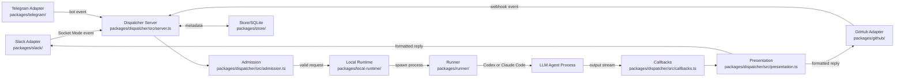
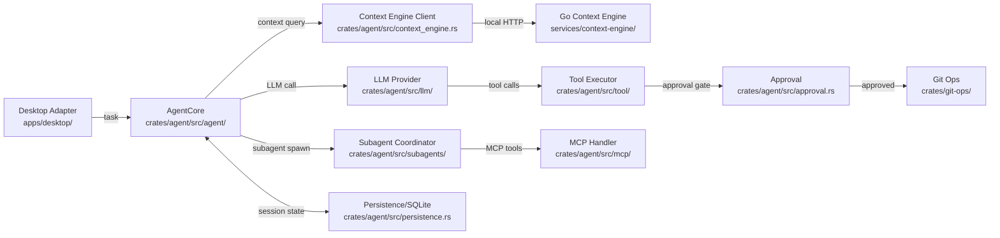
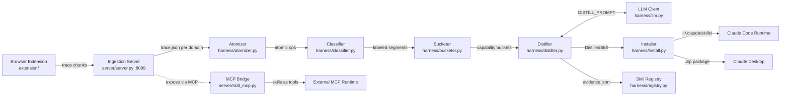

```mermaid
flowchart LR
    J[Match Clients\npackages/agent/src/clients/] -->|football data| A
    A[TickLoop\npackages/agent/src/core/TickLoop.ts] -->|match delta| B[BaseAgent\npackages/agent/src/core/BaseAgent.ts]
    B -->|specialty filter| C[Persona\npackages/agent/src/personas/]
    C -->|typed proposition| D[Proposition Logic\npackages/agent/src/propositions/]
    D -->|sign tx| E[Wallet Manager\npackages/agent/src/wallets/]
    E -->|CREATE2 factory call| F[PropMarketHook\npackages/contracts/]
    F -->|market open event| G[MCP Server\npackages/mcp-server/]
    G -->|4 tools| H[External LLM Runtime]
    C -->|persist pending reveals| I[Persistence/SQLite\npackages/agent/src/core/persistence/]
    I -->|restore on restart| A
```

# Weekly Agentic AI Research Scan — 2026-06-29

## Executive Summary

- Tuần này nổi bật **3 kiến trúc khác biệt**: event-driven routing dispatcher cho coding agents (OpenTag), self-building Rust agent loop với hybrid 3-modal context graph (Godcoder), và behavior cloning pipeline từ browser recordings thành reusable skills (Journey Forge Local).
- **The Eleven** là case study hiếm gặp về deterministic multi-agent swarm tích hợp on-chain state machine — 11 personas không dùng LLM trong decision loop; toàn bộ reasoning là rule-based, đảm bảo deterministic replay.
- Cả 4 repos đều theo xu hướng **local-first, no cloud runtime** — privacy-preserving agentic infrastructure đang trở thành default expectation.

## Table of Contents

1. [winsznx/theeleven](#1-winsznxtheeleven) — 11 AI personas deterministic cho prediction markets on-chain
2. [amplifthq/opentag](#2-amplifthqopentag) — Event-driven dispatcher routing @agent mentions tới local coding agents
3. [eli-labz/Godcoder](#3-eli-labzgodcoder) — Rust coding agent với hybrid 3-modal context engine và self-building harness
4. [Einsia/Browser-BC](#4-einsiabrowser-bc) — Behavior cloning pipeline từ browser recordings thành AI skills

---

## 1. winsznx/theeleven

**GitHub:** https://github.com/winsznx/theeleven

### §1 — QUICK CONTEXT

**One-line pitch:** 11 AI personas tự động mở binary prediction markets bóng đá real-time trên X Layer blockchain, không có randomness trong bất kỳ quyết định nào.

**Tech stack core:** TypeScript, Solidity 0.8.26 (Foundry), Next.js 15, Prisma/SQLite, Uniswap v4 custom hook, EIP-3009 gasless, React Three Fiber, MCP stdio protocol

**Repo health:** 702 stars, 2 forks, pushed 2026-06-25, CI/CD via GitHub Actions. Test coverage: 85 contract tests (100% line/branch/function trên `PropMarketHook`) + 229 agent tests + 172 web tests.

---

### §2 — ARCHITECTURE DEEP-DIVE

**A. Component inventory:**

- `BaseAgent` (`packages/agent/src/core/BaseAgent.ts`) — abstract class định nghĩa interface cho tất cả 11 personas: polling, market decision, staking window scheduling, reveal coordination.
- `TickLoop` (`packages/agent/src/core/TickLoop.ts`) — polling engine dùng chung; mỗi persona subscribe vào tick events từ shared loop.
- `StubPersona` (`packages/agent/src/core/StubPersona.ts`) — default/fallback persona implementation cho testing.
- `Persistence layer` (`packages/agent/src/core/persistence/`) — Prisma ORM + SQLite; lưu pending reveals để survive restart, không bao giờ miss settle deadline.
- `Persona implementations` (`packages/agent/src/personas/`) — 11 TypeScript classes extend `BaseAgent`, mỗi class encode tactical specialization (goalkeeper vs striker vs defensive anchor) với market type subset riêng.
- `Match data clients` (`packages/agent/src/clients/`) — API clients tới Football-Data.org và API-Football với automatic rate-limit failover.
- `Match handlers` (`packages/agent/src/matches/`) — normalize match deltas (possession, shots, fouls, corners) thành typed decision inputs.
- `Proposition logic` (`packages/agent/src/propositions/`) — encode market types per persona: `clean_sheet`, `next_goal`, `yellow_cards`, v.v.
- `Contract bindings` (`packages/agent/src/contracts/`) — TypeScript bindings tới `PropMarketHook` Solidity contract trên X Layer.
- `Wallet manager` (`packages/agent/src/wallets/`) — BIP-44 key derivation: một master mnemonic → 11 independent wallets, mỗi persona ký giao dịch độc lập.
- `PropMarketHook` (`packages/contracts/`) — Uniswap v4 custom hook implement commit-reveal binary prediction market; factory dùng CREATE2 salt-mining target permission bitmap `0x2A80` (~16K hash iterations).
- `MCP server` (`packages/mcp-server/`) — stdio bridge expose 4 tools: `get_system_status`, `list_active_markets`, `get_market_details`, `submit_gasless_stake`.
- `x402-facilitator` (`packages/x402-facilitator/`) — EIP-3009 settlement library, published standalone trên npm.

**B. Control flow — Swarm / event-driven pattern:**

1. `TickLoop.ts` poll football API theo interval; tự failover giữa Football-Data.org và API-Football khi hit rate limit.
2. Mỗi persona trong `personas/` nhận match delta từ `TickLoop` → evaluate theo specialty riêng (Il Bomber chỉ care shots/goals, Il Mediano chỉ care fouls/yellows).
3. Persona quyết định open market → sign transaction từ BIP-44 wallet (`wallets/`) → gọi `PropMarketHook` CREATE2 factory trên X Layer.
4. Staking window mở: users stake qua dApp (Next.js 15), Farcaster frame, hoặc MCP tool `submit_gasless_stake` với EIP-3009 typed-data signature.
5. Sau staking window, persona schedule reveal → `PropMarketHook` resolve commit-reveal scheme → tính pari-mutuel payout.
6. Pending reveals persist vào SQLite (`persistence/`) để restore sau restart — zero missed deadlines.

**C. State & data flow:**

- Message format: TypeScript typed objects — strongly typed match deltas và propositions, không phải plain dict.
- State storage: Prisma ORM + SQLite local; chỉ lưu pending reveals và market state, không lưu conversation.
- **Không có context window** — personas không dùng LLM; decisions là deterministic rule-based trên match statistics.

**D. Tool / capability integration:**

- **Không dùng LLM function-calling** trong agent loop — 11 personas là pure deterministic rule engines.
- MCP server (`packages/mcp-server/`) expose 4 tools để external LLM runtimes (Claude Desktop, Cursor, Vercel AI SDK) consume market data và submit stakes.
- EIP-3009 relayer đóng vai "tool" gasless cho user staking — relayer pays gas thay user.

**E. Memory architecture:**

Không có — agent không accumulate memory. Mỗi tick là stateless evaluation dựa trên current match state. SQLite chỉ persist pending reveals (operational data, không phải episodic memory).

**F. Model orchestration:**

**Không dùng LLM trong agent decision loop.** Design intentional: deterministic replay đảm bảo audit trail đầy đủ, critical với prediction markets. LLM integration chỉ qua MCP để external agents consume — "LLM-consumable agent" pattern thay vì "LLM-powered agent".

**G. Observability & eval:**

- 229 agent tests với `vitest` — **không có `Math.random()`** trong toàn bộ agent code → deterministic replay với same match feed.
- `smoke.ts` (`packages/agent/src/smoke.ts`) — smoke test entry point cho runtime validation.
- 100% line/branch/function coverage cho `PropMarketHook` contract.

**H. Extension points:**

- Thêm persona: extend `BaseAgent.ts`, define proposition subset, register vào wallet manager.
- Thêm market type: thêm proposition type trong `packages/agent/src/propositions/`.
- External integration: MCP server (`packages/mcp-server/`) hoặc npm package `x402-facilitator`.

---

### §3 — ARCHITECTURE DIAGRAM

---

### §4 — VERDICT

**Điểm novel:** Design không dùng LLM trong decision loop nhưng expose MCP cho LLMs consume là pattern thực sự mới — tách bạch "agent quyết định" (rule-based, auditable) khỏi "agent tương tác" (LLM). BIP-44 per-persona wallet derivation từ single mnemonic là elegant key management. Pari-mutuel settlement on Uniswap v4 hook là non-trivial DeFi primitive.

**Red flags:** Single resolver address kiểm soát on-chain outcomes là centralization risk rõ ràng — chưa có multi-sig hay timelock. Non-tournament markets dùng admin resolver — trust model yếu. 2 forks/702 stars là ratio thấp bất thường, có thể là star-farming.

**Open questions:** Personas có truly independent hay share TickLoop state (wash-trading risk giữa 11 wallets cùng mnemonic)? Football feed delay có thể tạo timing attack với commit-reveal? Nếu API-Football cũng down, fallback protocol là gì?

---

## 2. amplifthq/opentag

**GitHub:** https://github.com/amplifthq/opentag

### §1 — QUICK CONTEXT

**One-line pitch:** Routing layer kết nối Slack/GitHub/Lark/Telegram tới local coding agents (Codex, Claude Code) qua @mention, chạy hoàn toàn local.

**Tech stack core:** TypeScript, Node.js 20+, pnpm workspaces, SQLite, Slack Socket Mode, GitHub Webhooks, Hono HTTP framework

**Repo health:** 356 stars, 33 forks, pushed 2026-06-29, vitest test suite, MIT license, 4 open issues, 11 packages trong monorepo.

---

### §2 — ARCHITECTURE DEEP-DIVE

**A. Component inventory:**

- `CLI` (`packages/cli/`) — entry point `opentag setup` / `opentag start`; interactive setup 4 câu, write config tới `~/.config/opentag/config.json`.
- `Admission` (`packages/dispatcher/src/admission.ts`) — validate và gate incoming requests: credentials, format, có thể rate-limiting.
- `Dispatcher server` (`packages/dispatcher/src/server.ts`) — HTTP server (Hono-compatible) với runner endpoints và event tracking; embeddable vào existing Node services.
- `Callbacks` (`packages/dispatcher/src/callbacks.ts`) — callback registry và routing: nhận agent output stream, forward về đúng platform.
- `Presentation` (`packages/dispatcher/src/presentation.ts`) — format agent output trước khi reply vào platform thread.
- `Dispatcher index` (`packages/dispatcher/src/index.ts`) — public API exports của `@opentag/dispatcher`.
- `GitHub adapter` (`packages/github/`) — GitHub webhook listener; parse @agent mentions trong issues/PRs/comments.
- `Slack adapter` (`packages/slack/`) — Slack Socket Mode listener; real-time event stream không cần public URL.
- `Lark adapter` (`packages/lark/`) — Lark/Feishu integration.
- `Telegram adapter` (`packages/telegram/`) — Telegram bot integration.
- `Local Runtime` (`packages/local-runtime/`) — spawn và manage coding agent processes trên user machine.
- `Runner` (`packages/runner/`) — abstract runner interface; concrete impls: Codex (prod), Claude Code (prod), Echo (test stub).
- `Store` (`packages/store/`) — SQLite-backed state: message metadata, run status, credentials (file permissions restrictive, no cloud sync).
- `Core` (`packages/core/`) — shared types và protocols giữa tất cả packages.
- `Client` (`packages/client/`) — client SDK cho 3rd-party embedding.

**B. Control flow — Event-driven hub-and-spoke:**

1. User @mention agent trong Slack/GitHub → platform adapter nhận event (Socket Mode / Webhook).
2. Adapter extract task message → forward tới `Dispatcher server` (`packages/dispatcher/src/server.ts`).
3. `Admission` (`admission.ts`) validate: credentials valid, format correct, có thể rate-limit check.
4. `Local Runtime` (`packages/local-runtime/`) spawn coding agent process trên user machine.
5. `Runner` (`packages/runner/`) execute Codex hoặc Claude Code với task payload.
6. Agent stream output → `Callbacks` (`callbacks.ts`) nhận, buffer, route.
7. `Presentation` (`presentation.ts`) format → platform adapter post reply vào thread/comment.

**C. State & data flow:**

- Message format: TypeScript typed schemas qua `packages/core/` — strongly typed event objects.
- State storage: SQLite (`packages/store/`) cho message metadata và run status; credentials lưu local với restrictive file permissions.
- Runtime state: `~/.local/state/opentag`.
- **No session continuity** — mỗi @mention tạo fresh agent context; không có cross-session memory.

**D. Tool / capability integration:**

- Agent execution qua subprocess spawn — OpenTag không trực tiếp handle tools; delegate hoàn toàn cho agent process.
- Runner interface abstract: Codex và Claude Code là swappable implementations.
- Echo runner — test stub không gọi LLM, trả fixed responses.

**E. Memory architecture:**

Không có memory persistence giữa sessions. SQLite chỉ lưu run metadata (không phải conversation history). Design choice rõ ràng: mỗi @mention là independent task.

**F. Model orchestration:**

OpenTag không orchestrate models — delegate hoàn toàn cho coding agent process. Không có multi-model routing, không có planner/executor split, không có fallback trong OpenTag layer (agent tự handle).

**G. Observability & eval:**

- Vitest test suite (`vitest.config.ts`).
- Event tracking trong `dispatcher/src/server.ts` — format và extent không rõ từ code visible.
- Không thấy OpenTelemetry hay external tracing.

**H. Extension points:**

- Thêm platform: implement adapter package theo pattern `packages/slack/`, `packages/github/`.
- Thêm coding agent: implement `Runner` interface trong `packages/runner/`.
- Embed dispatcher: import `@opentag/dispatcher` vào Hono-compatible service (documented use case).

---

### §3 — ARCHITECTURE DIAGRAM

---

### §4 — VERDICT

**Điểm novel:** Pattern "platform-agnostic dispatcher với Admission gate + swappable Runner" sạch hơn direct webhook-to-agent approaches phổ biến — `admission.ts` là API gateway cho agentic requests, enforces consistency. `@opentag/dispatcher` là embeddable library thay vì standalone service — architectural decision cho phép integrate vào existing infra không cần sidecar.

**Red flags:** Không có cross-session memory — mỗi @mention là fresh context, không có task continuity. Khi cả Codex và Claude Code đều configured, không rõ routing logic (first-available? user-specified?). Không thấy cost control hay token budget mechanism.

**Open questions:** `admission.ts` có implement rate-limiting theo user/team không? Parallel @mentions có thể spawn multiple agent processes đồng thời không — có concurrency limit? `apps/` directory chứa gì — có standalone dispatcher app không?

---

## 3. eli-labz/Godcoder

**GitHub:** https://github.com/eli-labz/Godcoder

### §1 — QUICK CONTEXT

**One-line pitch:** Desktop coding agent viết bằng Rust với hybrid 3-modal context retrieval (vector + graph + BM25) và "Harness mode" cho phép agent tự modify vòng lặp của chính nó.

**Tech stack core:** Rust (crates/agent, crates/git-ops), Go (services/context-engine), TypeScript/React (apps/desktop), Tauri 2, Qdrant (vector), FalkorDB (graph), tree-sitter, SQLite, Anthropic/OpenAI API

**Repo health:** 245 stars, 1 fork, pushed 2026-06-28, `ARCHITECTURE.md` in-repo, MIT license, GitHub Discussions enabled.

---

### §2 — ARCHITECTURE DEEP-DIVE

**A. Component inventory:**

- `AgentCore` (`crates/agent/src/agent/`) — orchestration loop chính: turn management, streaming events, token accounting.
- `LLM provider` (`crates/agent/src/llm/`) — provider-agnostic interface; support OpenAI, Anthropic, và bất kỳ OpenAI-compatible endpoint.
- `MCP handler` (`crates/agent/src/mcp/`) — MCP protocol implementation trong agent core; nhận tools từ MCP servers.
- `Skill registry` (`crates/agent/src/skills/`) + `crates/agent/default-skills/` — built-in skills (file edit, bash exec, search, v.v.).
- `Subagent coordinator` (`crates/agent/src/subagents/`) + `crates/agent/default-subagents/` — spawn và coordinate sub-agents với independent sessions.
- `Tool executor` (`crates/agent/src/tool/`) — strongly-typed tool definitions và execution.
- `Session manager` (`crates/agent/src/session.rs`) — session lifecycle, turn ID tracking.
- `Approval workflow` (`crates/agent/src/approval.rs`) — trait-based approval gate; concrete impls: interactive (user confirm), auto (CI/headless), custom.
- `Context engine client` (`crates/agent/src/context_engine.rs`) — giao tiếp với Go microservice qua local HTTP.
- `Persistence` (`crates/agent/src/persistence.rs`) — trait-based storage abstraction; desktop adapter inject SQLite impl.
- `Git ops` (`crates/git-ops/`) — in-place snapshot (không dùng worktrees); checkpoint, restore, diff bounded to project root.
- `Desktop adapter` (`apps/desktop/`) — Tauri 2 + React; session management UI, diff review, terminal, plan visualization; bridge layer translate UI commands sang AgentCore calls.
- `Context Engine` (`services/context-engine/`) — Go microservice: tree-sitter parse → Qdrant (vector semantic) + FalkorDB (code relationship graph) + BM25 (keyword); optional Docker deployment.
- `ResearchSwarm bridge` (`third_party/ResearchSwarm-master/`) — vendored self-optimizing memory system; integration depth không rõ từ public API.

**B. Control flow — ReAct-style với Harness mode extension:**

Standard mode:
1. User submit task qua Desktop adapter (`apps/desktop/`) → bridge call vào `AgentCore` (`crates/agent/src/agent/`).
2. `AgentCore` query `context_engine.rs` nếu service enabled → enriched context từ Go microservice (Qdrant + FalkorDB + BM25).
3. LLM call qua `src/llm/` với enriched context → nhận tool calls trong response.
4. `Tool executor` (`src/tool/`) execute tools: file edit, bash, search, MCP tools.
5. Destructive actions gate qua `approval.rs` → user confirm/deny (hoặc auto-approve trong headless mode).
6. Tool results feed back vào `AgentCore` → tiếp tục think→act→observe loop đến done.
7. `git-ops` checkpoint sau significant changes.

Harness mode (novel):
- Tại step 3, agent scaffold sandbox environment qua `default-subagents/` patterns.
- Sub-agents (`src/subagents/`) nhận subtasks và coordinate results.
- Agent tự engineer tools và workflows; có thể modify `default-skills/` files.
- Improvement cycles: agent evaluate kết quả của subagents, iterate.

**C. State & data flow:**

- Message format: Rust typed structs — strongly typed qua `types.rs`, compile-time checked.
- State storage: SQLite qua `persistence.rs` trait; checkpoints via `git-ops`.
- Context retrieval (khi enabled): FalkorDB cho code relationship queries ("files calling this function"), Qdrant cho semantic similarity, BM25 cho exact-match keyword.
- Context window management: không rõ — `context_engine.rs` handle retrieval, chunking/truncation strategy không visible từ public architecture.

**D. Tool / capability integration:**

- Tools định nghĩa qua Rust trait (`src/tool/`) — strongly typed, compile-time validated.
- MCP support (`src/mcp/`) — agent nhận tools từ external MCP servers.
- `Approval gate` (`approval.rs`) trước destructive tool execution.
- Không có explicit sandbox/isolation — tools chạy trực tiếp trên user filesystem.

**E. Memory architecture:**

- Short-term: SQLite session state qua `persistence.rs`.
- Long-term (optional): Context Engine Go service — Qdrant (semantic vector), FalkorDB (code graph), BM25 (keyword), tất cả local via Docker.
- `ResearchSwarm bridge` (`third_party/`) — vendored memory optimization system; integration depth không xác định từ code hiện tại.
- Retrieval strategy: hybrid 3-modal — unique approach, phổ biến chỉ thấy vector đơn lẻ trong most frameworks.

**F. Model orchestration:**

- Single model per session; provider-agnostic qua `src/llm/`.
- Sub-agents (`src/subagents/`) có thể configured với model khác — không visible từ architecture doc.
- Không có explicit planner (frontier) / executor (smaller) split.

**G. Observability & eval:**

- `ARCHITECTURE.md` in-repo — document design decisions.
- Test suite trong `crates/agent/tests/`.
- Không thấy OpenTelemetry hay external tracing từ code visible.

**H. Extension points:**

- `persistence.rs` trait và `approval.rs` trait — inject custom implementations (headless, database backend, v.v.).
- Skills: thêm vào `default-skills/`, load qua `skills/` registry, hoặc via MCP.
- Sub-agents: thêm config vào `default-subagents/`.
- Context Engine: optional — disable hoàn toàn hoặc replace với alternative service.

---

### §3 — ARCHITECTURE DIAGRAM

---

### §4 — VERDICT

**Điểm novel:** Ba điểm cụ thể: (1) Hybrid 3-modal context retrieval (Qdrant semantic + FalkorDB code graph + BM25 keyword) trong dedicated Go microservice — FalkorDB cho phép query code relationships natively thay vì embed vào prompt. (2) `approval.rs` trait-based tách biệt hoàn toàn decision logic khỏi UI — headless testing không cần mock UI. (3) Harness mode self-modification concept được code thành `default-subagents/` patterns thay vì chỉ là marketing claim.

**Red flags:** `third_party/ResearchSwarm-master/` và `third_party/open-cowork-main/` là vendored whole repos — serious technical debt, unclear maintenance responsibility. 1 fork / 245 stars ratio thấp bất thường. Context Engine là Docker-optional nhưng là giá trị cốt lõi — UX barrier cao cho users không quen Docker.

**Open questions:** Harness mode thực sự modify `default-skills/` trực tiếp (persistent) hay chỉ temp context trong session? Sub-agents có independent LLM sessions hay share parent token budget? CoWork mode hoạt động qua screenshot-based hay accessibility tree — quan trọng cho reliability?

---

## 4. Einsia/Browser-BC

**GitHub:** https://github.com/Einsia/Browser-BC

### §1 — QUICK CONTEXT

**One-line pitch:** Pipeline biến browser task recordings thành reusable AI skills qua incremental behavior cloning và LLM distillation, auto-install vào Claude Code.

**Tech stack core:** Python (harness pipeline), TypeScript (browser extension), Claude Opus 4 (distillation LLM), Anthropic Messages API native + OpenAI-compatible fallback, local filesystem storage

**Repo health:** 216 stars, 21 forks, pushed 2026-06-28, CI via GitHub Actions, MIT license. _(Note: README title "Journey Forge Local" khác với repo description "Browser-BC" — có thể là rename chưa sync.)_

---

### §2 — ARCHITECTURE DEEP-DIVE

**A. Component inventory:**

- `Browser Extension` (`extension/`) — TypeScript/JS Chrome/Edge extension; record user interactions (clicks, inputs, navigations) thành structured trace events.
- `Ingestion Server` (`server/server.py`) — Python local HTTP server trên port 8099; nhận trace chunks từ extension, assemble thành `data/traces/<id>/trace.json` organized by domain.
- `MCP Bridge` (`server/skill_mcp.py`) — expose installed skills qua MCP protocol cho Claude Desktop và other runtimes.
- `Desktop Launcher` (`entry/main.py`) — entry point khởi động `server.py` và mở control panel.
- `Control Panel` (`app/dist/index.html`) — zero-build HTML dashboard (không có framework), serve bởi `server.py`.
- `Atomizer` (`harness/atomizer.py`) — segment trace recordings thành atomic operations (single click, form fill, navigation, v.v.).
- `Classifier` (`harness/classifier.py`) — LLM-powered label mỗi atomic segment vào capability categories.
- `Bucketer` (`harness/bucketer.py`) — group segments theo domain + capability type thành "capability buckets".
- `Distiller` (`harness/distiller.py`) — LLM synthesis core: nhiều segments của cùng capability → 1 generalized `DistilledSkill`; support incremental refinement qua `INCREMENTAL_ADDENDUM`.
- `LLM client` (`harness/llm.py`) — Anthropic Messages API native; fallback OpenAI-compatible gateway.
- `Skill Installer` (`harness/install.py`) — write skill tới `~/.claude/skills/` (Claude Code auto-pick up) hoặc package `.zip` cho Claude Desktop manual upload.
- `Skill Registry` (`harness/registry.py`) — track installed skills, versions, evidence sources.
- `Checkpoint` (`harness/checkpoint.py`) — save/restore pipeline state mid-run.
- `Config` (`harness/config.py`) — configuration: API keys, model selection, paths.
- `Progress tracker` (`harness/progress.py`) — pipeline progress reporting cho control panel.
- `CLI entry` (`harness/main.py`) — command-line interface cho manual pipeline runs.

**B. Control flow — Pipeline / behavior cloning pattern:**

1. User thực hiện task trong browser → `extension/` record events (clicks, inputs, navigations) → POST chunks tới `server/server.py:8099`.
2. Server assemble chunks → `data/traces/<id>/trace.json` organized by website domain.
3. User trigger distillation qua control panel hoặc `harness/main.py` CLI.
4. `atomizer.py` segment trace thành atomic ops.
5. `classifier.py` LLM-call → label mỗi segment: "login", "search", "checkout", "form-fill", etc.
6. `bucketer.py` group: cùng domain + capability → một bucket của multiple segments.
7. `distiller.py` call Claude Opus 4 với `DISTILL_PROMPT`: nhiều traces của cùng capability → extract "general pattern", preconditions, milestones, exit conditions, failure modes, "anti-drift boundaries". Nếu skill đã tồn tại → append `INCREMENTAL_ADDENDUM` để refine mà không cần retrain.
8. Output: `skills/{domain}/{capacity}/skill.md` + `metadata.json` + `evidence.jsonl` (lineage trail).
9. `install.py` copy vào `~/.claude/skills/` → Claude Code picks up automatically.
10. `server/skill_mcp.py` expose skills qua MCP cho any compatible runtime.

**C. State & data flow:**

- Message format: JSON trace events từ extension → Python dicts trong harness pipeline → `DistilledSkill` dataclass output.
- State storage: local filesystem — `data/traces/` cho raw recordings, `skills/` cho distilled outputs. Không có database.
- Evidence trail: `evidence.jsonl` per skill — lineage đầy đủ từ recordings tới skill, version-trackable.
- Checkpoint (`checkpoint.py`) — save pipeline state để resume mid-run nếu bị interrupt.

**D. Tool / capability integration:**

- LLM calls: native Anthropic Messages API qua `harness/llm.py`; fallback OpenAI-compatible gateway.
- Default model: Claude Opus 4 cho distillation — heavyweight model cho quality synthesis.
- Distilled skills là instructions only — execution requires separate browser automation (Playwright MCP).
- `server/skill_mcp.py` expose skills qua MCP cho external runtimes.

**E. Memory architecture:**

- Không có runtime memory giữa distillation và skill execution.
- Evidence JSONL là long-term memory của pipeline — mỗi recording append vào evidence pool.
- **Incremental distillation** là cơ chế continual learning: skill được refine khi có recordings mới qua `INCREMENTAL_ADDENDUM` prompt, không retrain từ đầu. Đây là key architectural decision.

**F. Model orchestration:**

- Single model (Claude Opus 4) cho toàn bộ distillation + classification.
- Classifier có thể dùng lighter model — không visible từ code hiện tại.
- Không có parallel model execution trong pipeline.

**G. Observability & eval:**

- `progress.py` cho pipeline progress tracking.
- Evidence JSONL là implicit eval trail — compare skill versions theo time.
- CI via GitHub Actions.
- Không có explicit eval harness cho generated skill quality.

**H. Extension points:**

- Thêm LLM: configure `harness/config.py` point tới OpenAI-compatible endpoint.
- Thêm platform target: implement installer variant trong `harness/install.py`.
- MCP bridge (`server/skill_mcp.py`): expose skills tới any MCP-compatible runtime ngoài Claude.

---

### §3 — ARCHITECTURE DIAGRAM

---

### §4 — VERDICT

**Điểm novel:** Incremental distillation qua `INCREMENTAL_ADDENDUM` là approach thực dụng cho continual learning không cần fine-tuning — mỗi recording mới refine skill existing thay vì overwrite. Pipeline stages rõ ràng (atomize → classify → bucket → distill) với checkpointing cho mỗi stage — dễ debug và resume. Evidence JSONL trail là lineage documentation tự động, valuable cho audit.

**Red flags:** Không có validation harness cho generated skills trước install — LLM có thể generate incorrect/harmful instructions và auto-install. Classifier + Distiller đều gọi heavy LLM (Claude Opus 4) → cost cao cho long recordings. Không có skill conflict resolution khi cùng domain có multiple overlapping skills.

**Open questions:** `DISTILL_PROMPT` có few-shot examples không hay zero-shot? Evidence JSONL có versioning hay append-only? Skill conflicts trong cùng domain được handle thế nào? Classifier stage dùng same model (Opus 4) hay lighter variant?
