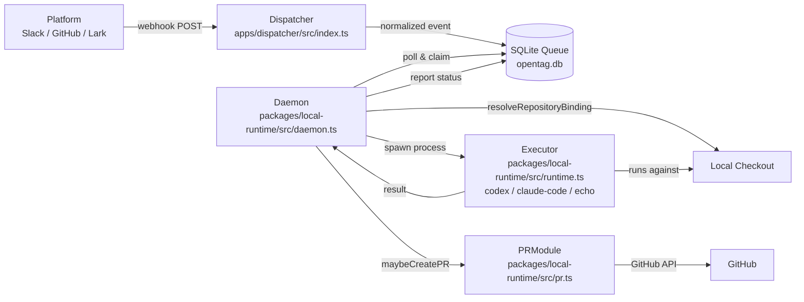
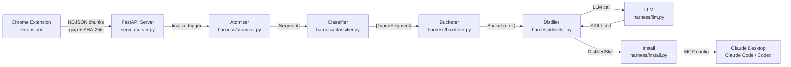
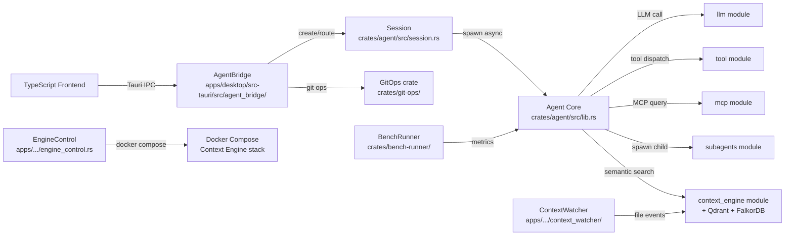
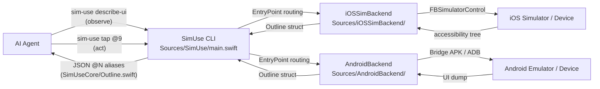

# Agentic AI Weekly Scan — 2026-06-30

## Executive Summary

- Tuần này nổi bật với hai kiến trúc **production-grade** đáng học: **OpenTag** (routing-as-orchestration với claim/poll queue) và **Journey Forge Local** (distillation pipeline biến browser recordings thành MCP skills — quasi-online learning không cần fine-tuning).
- **Godcoder** là repo duy nhất tuần này implement **self-hosting harness** — agent tự scaffold sandbox và chạy benchmark chính mình — nhưng phụ thuộc Docker Compose nặng và có single-maintainer risk.
- Cả 4 repo đều **local-first, model-agnostic**, tránh vendor lock-in bằng OpenAI-compatible endpoints — trend nhất quán cho thấy ecosystem đang dịch chuyển khỏi managed cloud agent APIs.

## Table of Contents

- [1. amplifthq/opentag](#1-amplifthqopentag) — 371★ — Event-driven @mention router
- [2. Einsia/Browser-BC (Journey Forge Local)](#2-einsiabrauser-bc-journey-forge-local) — 315★ — Browser-to-skill distillation pipeline
- [3. eli-labz/Godcoder](#3-eli-labzgodcoder) — 251★ — Self-hosting Rust/Tauri coding agent
- [4. lycorp-jp/sim-use](#4-lycorp-jpsim-use) — 230★ — Accessibility-based mobile agent tool

---

## 1. amplifthq/opentag

**Link:** https://github.com/amplifthq/opentag

### §1 — Quick Context

**One-line:** Router open-source nối @mention trên Slack/GitHub với coding agent cục bộ và tự động mở PR.

**Tech stack:** TypeScript (pnpm monorepo, Vitest), Hono HTTP framework, SQLite queue; executor adapters cho Codex và Claude Code.

**Repo health:** 371★, 34 forks, 7 open issues, CI (Vitest smoke tests cho dispatcher protocol), last push 2026-06-29. Contributors: nhỏ (Amplifth org, < 5 người).

---

### §2 — Architecture Deep-Dive

#### A. Component Inventory

- **`Dispatcher`** (`apps/dispatcher/src/index.ts`) — Entry point HTTP; reads env via `dispatcherRuntimeInputFromEnv`, khởi động Hono server qua `startDispatcher`.
- **`LocalDispatcher`** (`packages/local-runtime/src/dispatcher.ts`) — Hono app với sinks cho GitHub/Slack/Lark/Telegram; quản lý HTTP lifecycle; trả `LocalDispatcherHandle` với URL và `close()`.
- **`Daemon`** (`packages/local-runtime/src/daemon.ts`) — Long-running polling loop; hàm chính: `resolveRepositoryBinding()`, `resolveWorkspacePath()`, `runOneDaemonIteration()`, `serveDaemon()`.
- **`Executor`** (`packages/local-runtime/src/runtime.ts`) — 3 executor adapters: `echo` (testing), `codex`, `claude-code`; applied security policy per executor (safe env vars allowlist, workspace root restriction).
- **`PRModule`** (`packages/local-runtime/src/pr.ts`) — `maybeCreatePullRequest()`: validate → commit → push → create PR via `@opentag/github`; enriches result với PR URL và artifact.
- **`DoctorModule`** (`packages/local-runtime/src/doctor.ts`) — Validation và diagnostics (`opentag doctor`).

#### B. Control Flow — Event-Driven Pattern

1. Platform event (Slack @mention, GitHub issue comment) gửi webhook POST tới Dispatcher.
2. `LocalDispatcher` match event vào sink tương ứng, normalize thành OpenTag internal event (provider/owner/repo fields).
3. Daemon poll queue (SQLite `opentag.db`) qua `DaemonClient`, **claim** một available run.
4. `resolveRepositoryBinding()` khớp event với configured repo; `resolveWorkspacePath()` trả đường dẫn local checkout.
5. Security assessment + executor readiness check; select executor (codex/claude-code).
6. Executor spawn coding agent process chạy trên local checkout; Daemon gửi heartbeat signals định kỳ.
7. (Optional) `maybeCreatePullRequest()` commit changes, push branch, tạo PR với run ID trong title.
8. Daemon report completion status về queue; sleep đến poll interval tiếp theo.

#### C. State & Data Flow

- Message format: typed TypeScript objects (`LocalDispatcherRuntimeInput`, `LocalDispatcherHandle`).
- State: SQLite (`opentag.db`) qua `DaemonClient` — queue runs giữa dispatcher và daemon.
- Không có context window management — agent subprocess tự handle context.

#### D. Tool / Capability Integration

- Executors là **process spawns** của external CLIs (codex, claude-code command).
- Không có native function calling; model chạy trong subprocess tự quyết định tool.
- Security: safe env vars allowlist + workspace path restriction per executor config.

#### E. Memory Architecture

Không có long-term memory. State per-run, cleanup sau mỗi iteration.

#### F. Model Orchestration

- Model selection deferred hoàn toàn cho executor subprocess (user config codex/claude-code).
- `echo` executor cho dry-run testing.
- Không có planner/routing — executor được chọn statically theo config.

#### G. Observability & Eval

- `opentag doctor` command validates toàn bộ config chain.
- Không có distributed tracing; logs qua process stdout capture.
- PR artifact trong result cho human review.

#### H. Extension Points

- **New platform sink**: thêm vào `startDispatcher` trong `dispatcher.ts`.
- **New executor**: thêm vào `executorsFromConfig` trong `runtime.ts`.
- **PR flow**: bật `pullRequestOptionsFromConfig` trong `daemon.ts`.

---

### §3 — Architecture Diagram

---

### §4 — Verdict

**Điểm novel:** Pattern "claim một run từ queue" (không phải webhook-push trực tiếp vào executor) tạo natural backpressure — executor bận thì run nằm yên trong queue. Kết hợp với heartbeat signals, đây là cách xử lý long-running coding tasks production-grade hơn hầu hết agentic frameworks hiện tại.

**Red flags:** Executor là process spawn → sandbox yếu; security dựa vào env-var allowlist và workspace path restriction, dễ escape nếu claude-code có permission quá rộng. `maybeCreatePullRequest` commit _tất cả_ changed files mà không có selective staging.

**Open questions:** Xử lý rate limiting per platform thế nào? Token revocation? Concurrent runs trên cùng repo có conflict không? Retry strategy khi executor crash mid-run?

---

## 2. Einsia/Browser-BC (Journey Forge Local)

**Link:** https://github.com/Einsia/Browser-BC

> **Lưu ý:** Repo description ("Agent behavior clone for browser") và actual codebase ("Journey Forge Local") không khớp — README và code đều thuộc project Journey Forge Local. Phân tích dưới đây dựa trên code thực tế.

### §1 — Quick Context

**One-line:** Ghi browser tasks qua Chrome extension, distill thành SKILL.md files MCP cho Claude — mỗi domain tích lũy "bucket of capabilities" qua nhiều recordings.

**Tech stack:** Python 3 (FastAPI, uvicorn), TypeScript 62% (Chrome extension), optional pywebview; pipeline: atomize → classify → bucket → distill qua LLM.

**Repo health:** 315★, 28 forks, CI (.gitlab-ci.yml + .github/workflows), last push 2026-06-28. No open issues listed.

---

### §2 — Architecture Deep-Dive

#### A. Component Inventory

- **`Extension`** (`extension/`) — Chrome recorder, gửi gzip-compressed NDJSON event chunks lên server.
- **`Server`** (`server/server.py`) — FastAPI app: `/v1/traces/init`, `/v1/traces/{id}/chunks/{idx}`, `/v1/traces/{id}/finalize`; `/api/traj`, `/api/skills`, `/api/config`; background pipeline thread.
- **`Entry`** (`entry/main.py`) — uvicorn launcher với port management, duplicate detection, health check, pywebview support.
- **`Atomizer`** (`harness/atomizer.py`) — Phân đoạn `NormalizedTrack` thành `Segment` objects theo domain/idle-gap/path-change/form-submission boundaries; filters noise (iframe pageloads, lone modifiers, duplicate clicks); min 3 / max 80 events per segment.
- **`Classifier`** (`harness/classifier.py`) — Gán capability type cho mỗi Segment.
- **`Bucketer`** (`harness/bucketer.py`) — Gom Segments cùng domain/capability thành persistent Buckets.
- **`Distiller`** (`harness/distiller.py`) — LLM call per bucket: multiple segments → `DistilledSkill` (name, scope, preconditions, milestones, red lines, recovery strategies); output: `SKILL.md` + `TRACE_GUIDE.md` + JSONL evidence log; incremental refinement support.
- **`LLM`** (`harness/llm.py`) — LLM client abstraction (provider/model via `/api/config`).
- **`Install`** (`harness/install.py`) — Writes MCP config entries cho Claude Desktop (`~/Library/Application Support/Claude/claude_desktop_config.json`), Claude Code (`~/.claude.json`), Codex (`~/.codex/config.toml`).

#### B. Control Flow — Pipeline Pattern

1. User records browser task via Chrome extension.
2. Extension POST chunks (gzip + SHA-256 verification) tới `/v1/traces/...`; chunks stored atomically với lock files.
3. POST `/v1/traces/{id}/finalize` trigger background pipeline thread (global serialization lock).
4. **Atomizer** parse NDJSON events → filter noise → segment theo boundaries → `[Segment]`.
5. **Classifier** gán capability label cho mỗi Segment → `[TypedSegment]`.
6. **Bucketer** persist Segments vào domain/capability bucket trên disk.
7. **Distiller** gọi LLM với evidence từ toàn bộ bucket → synthesize `SKILL.md` "generalizable cho mọi website".
8. **Install** write MCP config; Claude Desktop / Claude Code / Codex pick up skill tự động.

#### C. State & Data Flow

- Message format: NDJSON events (extension → server), Python dataclasses (pipeline internal).
- State: file-based — gzip chunks trên disk, bucket state per domain (JSONL evidence log).
- In-memory: progress tracker per distillation job.
- Global serialization lock cho pipeline → single-threaded, single-user by design.
- **Incremental update**: `INCREMENTAL_ADDENDUM` prompt refines existing SKILL.md thay vì regenerate.

#### D. Tool / Capability Integration

- Output là MCP server entries (Playwright MCP + custom skill MCP).
- Integration: write trực tiếp vào config files của Claude Desktop/Code/Codex.
- Auto-detect + install Node.js nếu cần (macOS).

#### E. Memory Architecture

- **Short-term**: in-memory progress tracker per distillation run.
- **Long-term**: bucket state per domain trên disk — tích lũy qua nhiều recordings.
- **Compaction**: Distiller synthesizes all evidence in bucket → single canonical SKILL.md (quasi-online learning).

#### F. Model Orchestration

- Single LLM call per bucket distillation.
- Model selection via `/api/config` endpoint; user picks provider + model.
- Không có planner/executor split; LLM chỉ dùng ở distillation stage.

#### G. Observability & Eval

- Rotating file log tại data directory; GET `/api/logs` endpoint.
- Progress tracker per distillation job.
- Không có eval pipeline để verify skill quality.

#### H. Extension Points

- **New model/provider**: config via `/api/config`.
- **New install target**: thêm backend vào `install.py`.
- **Manual re-distill**: POST `/api/distill/{upload_id}`.

---

### §3 — Architecture Diagram

---

### §4 — Verdict

**Điểm novel:** "Bucket accumulation" per domain — mỗi lần record thêm, skill được refine incrementally qua `INCREMENTAL_ADDENDUM` prompt, không cần model fine-tuning. Distillation prompt explicitly yêu cầu "generalizable patterns, không phải site-specific selectors" — đây là attempt có ý thức để tạo transferable knowledge, khác với raw trajectory recording.

**Red flags:** Global serialization lock → không scalable, single-user by design. Không có eval pipeline: skill quality không được verify, có thể degrade silently khi website thay đổi. Repo name/description không khớp code (red flag về project continuity).

**Open questions:** Skill versioning khi website thay đổi behavior? Làm thế nào đo "skill quality" trước khi deploy vào MCP? Bucket schema migration nếu Atomizer logic thay đổi?

---

## 3. eli-labz/Godcoder

**Link:** https://github.com/eli-labz/Godcoder

### §1 — Quick Context

**One-line:** Desktop coding agent Rust/Tauri với harness mode tự-scaffold sandbox và self-optimize tool loop qua benchmark.

**Tech stack:** Rust (Tokio, Tauri 2, SQLite/parking_lot), TypeScript (frontend), Docker Compose (optional Context Engine: Qdrant + FalkorDB + tree-sitter), `git-ops` crate nội bộ.

**Repo health:** 251★, 1 fork, Discussions enabled, last push 2026-06-30 (active). Single contributor risk cao.

---

### §2 — Architecture Deep-Dive

#### A. Component Inventory

- **`AgentBridge`** (`apps/desktop/src-tauri/src/agent_bridge/`) — Tauri IPC command layer: session lifecycle (create/rename/delete/message), model selection, MCP config, skill + subagent management, checkpoint operations.
- **`ContextWatcher`** (`apps/desktop/src-tauri/src/context_watcher/`) — File watcher monitoring repository changes → feeds ContextEngine.
- **`EngineControl`** (`apps/desktop/src-tauri/src/engine_control.rs`) — Docker lifecycle: `start()` (preflight → `docker compose up -d` → poll `/api/health`), `stop()`, `down(remove_data)`, `logs(tail)`; emits `engine:status` Tauri events.
- **`Database`** (`apps/desktop/src-tauri/src/lib.rs`) — SQLite với `parking_lot::Mutex`; settings key-value store với timestamps.
- **`Agent` crate** (`crates/agent/src/lib.rs`) — Core agent library: modules `llm`, `tool`, `agent`, `persistence`, `session`, `context_engine`, `skills`, `subagents`, `mcp`.
- **`Session`** (`crates/agent/src/session.rs`) — `SessionHandle` với cancel token, `Active/Completed/Error` states, `Ask vs Coding` modes; `SessionManager` với `Arc<RwLock<HashMap>>`.
- **`GitOps` crate** (`crates/git-ops/`) — Branch management, diff, status, commit, push, PR creation.
- **`ContextSync` crate** (`crates/context-sync/`) — Code indexing pipeline.
- **`BenchRunner` crate** (`crates/bench-runner/`) — Benchmark execution cho harness self-improvement.

#### B. Control Flow — Hierarchical Pattern (Tauri IPC → Agent Bridge → Agent Crate)

1. User gửi message qua TypeScript frontend → Tauri IPC call tới `AgentBridge`.
2. `AgentBridge` create hoặc route tới existing `SessionHandle` (Ask vs Coding mode).
3. `Session` spawn async Tokio task, set status `Active`; frontend nhận event.
4. `Agent` crate: `llm` module query LLM với context từ `context_engine`; optional semantic search qua Qdrant/FalkorDB.
5. Tool calls dispatch qua `tool` module; MCP servers query qua `mcp` module.
6. `subagents` module spawn child sessions nếu cần.
7. `ContextWatcher` push file change events → `context_engine` update index.
8. Session watcher update status (`Active → Completed/Error`), emit Tauri events tới frontend.
9. Git operations (commit, branch, PR) qua `git-ops` crate từ `AgentBridge` commands.

#### C. State & Data Flow

- Session state: `Arc<RwLock<HashMap<SessionId, SessionHandle>>>` in-memory.
- Persistence: SQLite (settings), `persistence` module (session data).
- Context: tree-sitter parsing + Qdrant (vector) + FalkorDB (graph) — Docker Compose optional.
- IPC: Tauri typed commands (Rust → JSON serialization → TypeScript).
- SSRF protection: `fetch_url` command blocks loopback, private IP ranges, link-local.

#### D. Tool / Capability Integration

- MCP: `mcp` module trong agent crate; config via `AgentBridge` IPC.
- Skills: `skills` module load `.md` skill files.
- Subagents: `subagents` module spawn child `SessionHandle` instances.
- Tool registration: không xác định cơ chế cụ thể từ code (chỉ thấy module declaration).

#### E. Memory Architecture

- **Short-term**: session context trong `agent` module loop.
- **Long-term**: Qdrant (vector similarity) + FalkorDB (graph relationships) cho code semantic search, được populate bởi `ContextSync` crate.
- `ContextWatcher` maintain freshness của index qua file events.

#### F. Model Orchestration

- `llm` module: model selection via `AgentBridge` IPC (user picks provider/model, any OpenAI-compatible endpoint).
- `subagents` module: có thể route subagents tới different models (không xác định rõ từ lib.rs).
- **Harness mode**: agent scaffold sandbox → chạy benchmark via `bench-runner` crate → self-improve (mechanism chi tiết cần thêm code evidence).

#### G. Observability & Eval

- `EngineControl.logs(tail)` retrieves Docker Compose logs.
- `engine:status` Tauri events real-time.
- `bench-runner` crate cho self-benchmarking.
- Checkpoint/rewind qua `AgentBridge` checkpoint commands.

#### H. Extension Points

- **MCP servers**: config via `AgentBridge` IPC.
- **Custom models**: bất kỳ OpenAI-compatible endpoint.
- **Skills**: `.md` files loaded via `skills` module.
- **CoWork mode**: agent control GUI apps via `check_accessibility_permission`.

---

### §3 — Architecture Diagram

---

### §4 — Verdict

**Điểm novel:** `bench-runner` crate kết hợp với "harness mode" là attempt implement **self-improving agent loop** trong open source — agent không chỉ execute task mà còn benchmark chính mình để cải thiện toolchain. Phân tách Rust agent core + Tauri IPC layer (thay vì Python subprocess) cho type safety mạnh hơn hầu hết coding agents.

**Red flags:** Context Engine require Docker Compose với Qdrant + FalkorDB — setup nặng cho casual users; fallback nếu Docker không có là không rõ. 1 fork, 1 contributor = single-maintainer risk cao. `bench-runner` implementation chưa verify được vì 404 khi fetch source.

**Open questions:** Harness self-improvement loop hoạt động cụ thể thế nào? `bench-runner` benchmark metric gì — pass rate, latency, token cost? Subagents routing model selection có adaptive không?

---

## 4. lycorp-jp/sim-use

**Link:** https://github.com/lycorp-jp/sim-use

### §1 — Quick Context

**One-line:** CLI Swift cho AI agents điều khiển iOS Simulator và Android emulator qua accessibility API, trả JSON aliases @N compact 16× hơn raw tree.

**Tech stack:** Swift (macOS 14+), FBSimulatorControl/FBDeviceControl (Meta binary frameworks), Android Bridge APK + ADB; ArgumentParser; optional Daemon mode.

**Repo health:** 230★, 9 forks, 1 open issue, test targets (SimUseCoreTests, AndroidBackendTests, SimUseTests), last push 2026-06-29. LY Corporation (Line/Yahoo Japan).

---

### §2 — Architecture Deep-Dive

#### A. Component Inventory

- **`SimUse CLI`** (`Sources/SimUse/main.swift`) — `EntryPoint` enum detect iOS-only verb misuse; `SimUse` command với cross-platform verbs: `DescribeUI`, `Tap`, `Type`, `Paste`, `Swipe`, `Gesture`, `MultiTouch`, `Screenshot`, `AppState`, `RecordVideo`; platform namespaces: `IOSSimCommand`, `AndroidCommand`; infrastructure: `Daemon`, `SpikeDaemon`.
- **`SimUseCore`** (`Sources/SimUseCore/`) — Shared types: `Outline`, `Entry`, `Aliases`, `Region`, `Frame`, `ListSummary`.
- **`Outline`** (`Sources/SimUseCore/Outline.swift`) — Accessibility tree representation: `text` (human-readable), `entries` ([Entry]), `lists` ([ListSummary]), `screen` (dimensions), `appLabel`; snake_case JSON serialization.
- **`Entry`** (`Sources/SimUseCore/Outline.swift`) — UI element: `aliases` (@N / #N/@M), `role`, `label`, `states`, `frame`, `region`, `value`, `resourceId`, `hint`, `depth`.
- **`iOSSimBackend`** (`Sources/iOSSimBackend/`) — iOS-specific, wraps `FBSimulatorControl`, `FBDeviceControl`, `FBControlCore`, `XCTestBootstrap` (Meta binary frameworks).
- **`AndroidBackend`** (`Sources/AndroidBackend/`) — Android-specific, communicates via Bridge APK + ADB.

#### B. Control Flow — CLI Tool Pattern (Observe-Act per invocation)

1. AI agent gọi `sim-use describe-ui --device UUID` để observe UI state.
2. `EntryPoint` detect platform, route tới `iOSSimBackend` (via FBSimulatorControl) hoặc `AndroidBackend` (via ADB bridge).
3. Backend walk full accessibility tree (bao gồm WebViews, system overlays, embedded content).
4. Build `Outline`: mỗi element nhận `@N` alias stable (từ accessibility tree), region classification (Top/Content/Bottom), role/label/states.
5. Return JSON với `~16× token compression` so với raw accessibility JSON.
6. AI agent parse aliases, reason về UI, quyết định action.
7. Agent gọi `sim-use tap @9` (hoặc `type`, `swipe`, etc.); CLI execute qua FBSimulatorControl/Bridge APK.
8. iOS `batch` mode: nhiều steps trong một invocation để giảm round-trip cost.

#### C. State & Data Flow

- **Stateless per-invocation**: alias @N valid trong context của một Outline; không persist cross-call.
- **Daemon mode**: persistent daemon giảm startup overhead (observe-act cycle ~300ms after init).
- Message format: `--json` flag cho structured `Outline` JSON; human-readable outline là default.
- `ListAlias` (#N/@M notation) cho elements trong detected lists.

#### D. Tool / Capability Integration

- **iOS**: FBSimulatorControl (Meta) via binary XCFramework dependencies.
- **Android**: Bridge APK install một lần via `sim-use android init`; ADB communication.
- **Agent skill init**: `sim-use init` writes skill file cho Claude và các AI clients.
- Không có function calling; agent gọi CLI như shell command hoặc MCP tool.

#### E. Memory Architecture

Không có memory. Stateless per CLI invocation; Daemon mode chỉ reduce startup cost.

#### F. Model Orchestration

Không applicable — `sim-use` là tool layer, không integrate model trực tiếp. Agent chọn và gọi `sim-use` commands trong observation-action loop.

#### G. Observability & Eval

- `--json` flag cho machine-readable output.
- Observe-act cycle benchmark: ~300ms.
- Test targets: `SimUseCoreTests`, `AndroidBackendTests`.

#### H. Extension Points

- **New platform**: implement backend library tương tự `AndroidBackend`.
- **New commands**: thêm verb vào `SimUse` command trong `main.swift`.
- `SpikeDaemon`: experimental daemon variant (có thể là extension point đang phát triển).

---

### §3 — Architecture Diagram

---

### §4 — Verdict

**Điểm novel:** Alias system `@N` — thay vì coordinate-based clicking (giòn với resolution/scale thay đổi), alias map từ stable accessibility tree node IDs. Cross-platform "same verbs, same flags, same JSON shape" cho iOS và Android reduce prompt engineering đáng kể. `ListAlias` (#N/@M) cho positioned access vào list elements là detail tinh tế và practical.

**Red flags:** macOS 14+ only; FBSimulatorControl/FBDeviceControl là Meta binary frameworks — không có fallback nếu Meta ngừng maintain/publish. Android Bridge APK yêu cầu ADB permission và manual init step. "16× token reduction" chưa có độc lập benchmark.

**Open questions:** Alias stability qua partial UI updates — nếu một phần screen thay đổi, @N mapping của phần còn lại có được preserve không? `SpikeDaemon` là gì? Keyboard state (`KeyboardState` command) handle input method switching thế nào?
