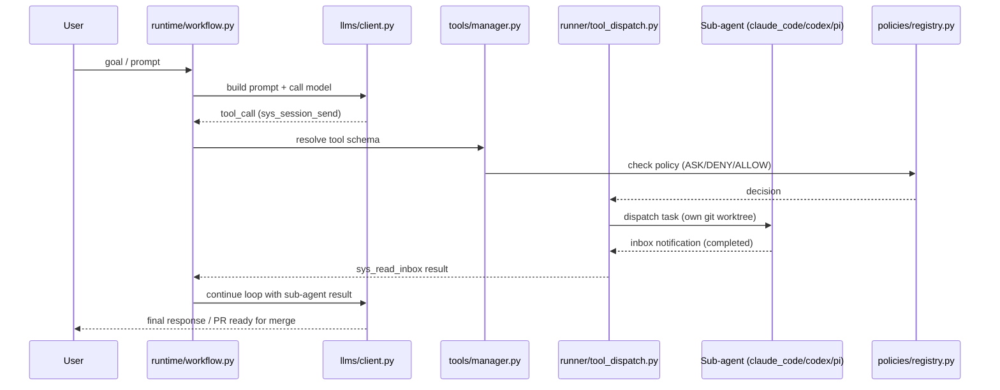
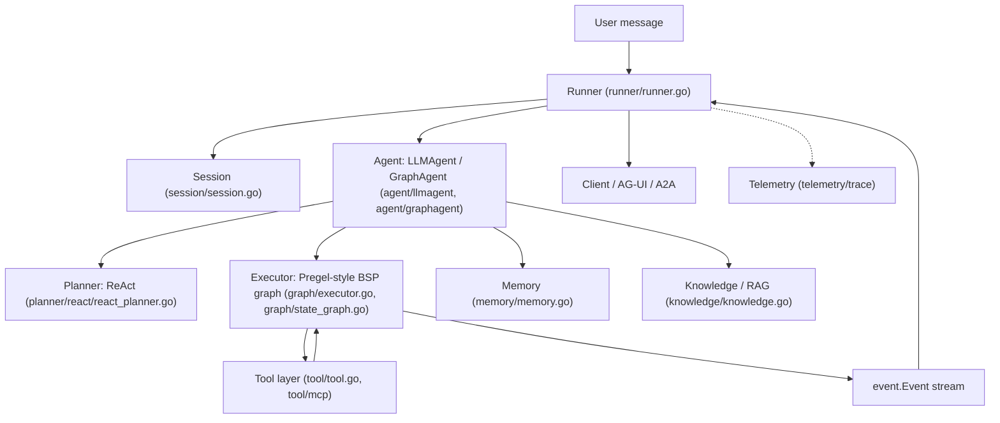
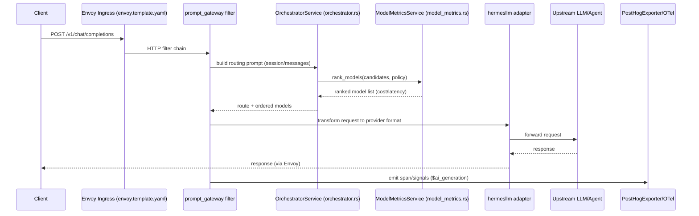
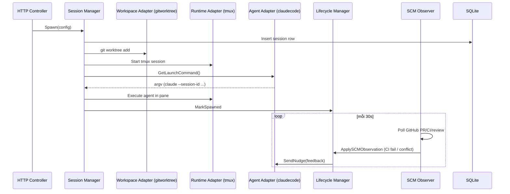

# Weekly Agentic AI Scan — 2026-07-01

**Nguồn dữ liệu:** GitHub Search API (`search/repositories`), query theo `created:>2026-06-24` (stars>200) và fallback `pushed:>2026-06-24` (stars>500) cho các từ khoá agent/multi-agent/agentic/orchestration. Đã loại bỏ awesome-list, tutorial dump, và một cụm ~15 repo "HTML, sao=152, tạo cùng ngày 2026-06-28" nghi là star-farm/SEO spam (không đưa vào danh sách).

## Executive Summary

- Tuần này không có repo hoàn toàn "mới toanh" nổi bật về multi-agent theo nghĩa kiến trúc breakthrough, nhưng có 3 pattern kiến trúc đáng chú ý đang được implement nghiêm túc: **meta-harness orchestration** (omnigent — điều phối các CLI agent có sẵn thay vì tự viết agent), **LangGraph-style state graph cho Go** (trpc-agent-go), và **LLM-routing qua orchestrator model chuyên biệt + re-rank theo cost/latency thời gian thực** (plano).
- Nhóm "coding-agent orchestrator cho parallel dev workflow" (AgentWrapper/agent-orchestrator, omnigent) đang tăng trưởng rất nhanh (5.800–7.800 sao) và hội tụ về cùng một pattern: mỗi agent CLI chạy trong git-worktree/sandbox riêng, supervisor trung tâm chỉ lưu "durable facts" tối thiểu và derive trạng thái tại read-time.
- Cảnh báo: nhiều repo mới tạo trong 7 ngày với từ khoá "multi-agent"/"agentic" có dấu hiệu star-farm rõ rệt (hàng loạt repo HTML, đúng 152-153 sao, tạo cùng giờ ngày 28/06/2026) — đã loại khỏi danh sách, nên cẩn trọng khi tự tra cứu GitHub trending theo các từ khoá này.

## Mục lục

1. [omnigent-ai/omnigent](#omnigent-aiomnigent) — meta-harness điều phối đa CLI coding agent
2. [trpc-group/trpc-agent-go](#trpc-grouptrpc-agent-go) — Go framework với state-graph kiểu LangGraph
3. [katanemo/plano](#katanemoplano) — AI-native proxy/gateway với LLM routing thông minh
4. [AgentWrapper/agent-orchestrator](#agentwrapperagent-orchestrator) — orchestrator cho parallel coding agents
5. [Repo khác đáng chú ý (không deep-dive)](#repo-khác-đáng-chú-ý-không-deep-dive)

---

## omnigent-ai/omnigent

**§1 — QUICK CONTEXT**

Meta-harness Python điều phối nhiều CLI coding agent (Claude Code, Codex, Cursor, Pi, OpenCode, Hermes) qua một lớp YAML thống nhất, với policy engine, sandbox và giao diện đa thiết bị. Tech stack: Python 3.12+, FastAPI/Starlette + Uvicorn (server), SQLAlchemy + Alembic (DB), MCP SDK (`mcp` package), OpenTelemetry, `bwrap`/`seatbelt`/Windows Job Object cho sandbox, `tiktoken`. Repo health: ~5.805 sao, 734 fork, 396 issue mở, giấy phép Apache-2.0, ~98 contributors, commit gần nhất trong vòng vài phút trước thời điểm khảo sát (01/07/2026), CI rất đầy đủ (~50 workflow trong `.github/workflows/`, gồm `ci.yml`, `e2e.yml`, `security-gate.yml`, `flake-stress*.yml`), có thư mục `tests/` lớn với hàng trăm file test.

**§2 — ARCHITECTURE DEEP-DIVE**

**A. Component inventory**
- `AgentSpec parser` (`omnigent/spec/parser.py`, `omnigent/spec/types.py`) — parse file YAML agent (prompt, executor, tools, policies) thành dataclass `AgentSpec`.
- `Workflow / Agent loop` (`omnigent/runtime/workflow.py`) — vòng lặp lõi, docstring ghi rõ "Load agent → build prompt → call LLM → execute tools → repeat. All durably checkpointed for crash recovery."
- `ToolManager` (`omnigent/tools/manager.py`) — đăng ký tool builtin, tool do client khai báo, tool Python local.
- `Tool dispatch (runner-local)` (`omnigent/runner/tool_dispatch.py`) — phân loại và định tuyến tool call thành OS-env tool, REST tool, file tool, terminal tool, MCP tool.
- `MCP client` (`omnigent/tools/mcp.py`, `omnigent/runner/mcp_manager.py`) — kết nối MCP server (stdio/HTTP), tool discovery, caching.
- `RunnerRouter` (`omnigent/runner/routing.py`) — chọn runner (máy chạy agent thật) qua WebSocket tunnel registry dựa trên `conversation_id`.
- `PolicyEngine / registry` (`omnigent/policies/registry.py`, `omnigent/policies/base.py`, `omnigent/runner/policy.py`) — nạp và áp policy (ASK/DENY/ALLOW) cho từng hành động của agent, xếp tầng server-wide/per-agent/per-session.
- `Sandbox backends` (`omnigent/inner/sandbox.py`, `omnigent/inner/bwrap_sandbox.py`, `omnigent/inner/seatbelt_sandbox.py`, `omnigent/inner/windows_jobobject_sandbox.py`) — cô lập process theo OS (bwrap Linux, seatbelt macOS, Job Object Windows).
- `Compaction (context manager)` (`omnigent/runtime/compaction.py`) — nén lịch sử hội thoại theo 3 lớp.
- `LLM Client & routing` (`omnigent/llms/client.py`, `omnigent/llms/routing.py`) — parse chuỗi model `"provider/model-name"`, ánh xạ tới adapter provider (OpenAI, Anthropic, Bedrock, Vertex, Databricks, Groq, DeepSeek, xAI, OpenRouter, Ollama, Moonshot).
- `Harness executors` (`omnigent/inner/claude_sdk_executor.py`, `omnigent/inner/codex_executor.py`, `omnigent/inner/cursor_executor.py`, v.v.) — mỗi harness (Claude Code, Codex, Cursor, Pi, Hermes, Kimi, Qwen, Goose...) có executor riêng.
- `DB stores` (`omnigent/db/db_models.py`, `omnigent/stores/`) — SQLAlchemy models (`SqlAgent`...) cho agent, conversation, permission, policy, file.
- `Telemetry` (`omnigent/runtime/telemetry.py`) — OpenTelemetry SDK trực tiếp, trace ID lấy từ response ID.
- `Cost advisor/judge` (`omnigent/runner/cost_advisor.py`, `omnigent/runner/cost_judge.py`) — kiểm soát chi phí/chọn model theo ngân sách.

**B. Control flow pattern** — **Hierarchical supervisor-worker (multi-agent orchestration) kết hợp state-machine/checkpointed agent loop**, thể hiện rõ nhất qua ví dụ `examples/polly/` (orchestrator "Polly" không viết code, chỉ điều phối):
1. Người dùng gửi goal cho agent gốc (ví dụ Polly), `AgentSpec` được nạp qua `spec/parser.py`.
2. `runtime/workflow.py` build prompt, gọi LLM (brain model, ví dụ Claude Opus) qua `llms/client.py`.
3. LLM quyết định gọi tool — nếu là `sys_session_send` (spawn sub-agent), Polly tạo git worktree riêng và dispatch sang sub-agent (`claude_code`/`codex`/`pi`) chạy độc lập.
4. `runner/tool_dispatch.py` định tuyến tool call (OS shell, MCP, file, terminal) tới đúng backend, có kiểm tra policy trước khi thực thi.
5. Sub-agent chạy đến khi xong, kết quả được đẩy vào "inbox" của orchestrator (`sys_read_inbox`) — mô hình polling/event thay vì busy-wait.
6. Orchestrator gom kết quả, dispatch sub-agent reviewer khác vendor để cross-review diff, rồi kết thúc lượt (không tự merge — con người merge PR).

**C. State & data flow** — Trạng thái hội thoại lưu dạng `ConversationItem`/`NewConversationItem` (`omnigent/entities/conversation.py`) persist vào SQL DB qua SQLAlchemy + Alembic migrations (`omnigent/db/migrations`). Không thấy bằng chứng vector DB. Quản lý context window bằng 3 lớp nén trong `compaction.py`: (1) xoá nội dung tool-result cũ ("surgical clearing"), (2) tóm tắt bằng LLM call riêng ("summarization"), (3) cắt bớt message cũ nhất khi vẫn vượt ngưỡng (`_DEFAULT_TRIGGER_THRESHOLD = 0.8`). Token đếm bằng `tiktoken`.

**D. Tool/capability integration** — Tool đăng ký qua YAML spec (function Python local, MCP server, sub-agent) trong `tools/manager.py`; schema tool theo format OpenAI function-calling (thấy trong `tools/local_callable.py`: "derives the OpenAI function schema... from runtime introspection"). MCP hỗ trợ qua `mcp` SDK chính thức (stdio/SSE/streamable HTTP). Validation/sandbox: mỗi tool call OS-env đi qua policy engine (ASK/DENY) và sandbox theo OS trước khi thực thi thật.

**E. Memory architecture** — Không có kiến trúc "long-term memory"/vector retrieval rõ ràng; chỉ có compaction/summarization ngắn hạn nêu trên. Không xác định từ code về long-term semantic memory hay vector store.

**F. Model orchestration** — Đa nhà cung cấp qua `llms/routing.py` (Anthropic, OpenAI, Bedrock, Vertex, Databricks, Groq, DeepSeek, xAI, OpenRouter, Ollama, Moonshot). Mỗi sub-agent trong Polly có thể chỉ định model riêng qua `args.model`; có "cost advisor" tự động chọn model theo ngân sách cho lượt chạy của "brain". Retry có cấu trúc 2 lớp (`RetryPolicy` trong `spec/types.py`): L0 (SDK-internal) và L2 (workflow-level) với backoff/jitter cấu hình được. Không thấy bằng chứng batching song song ở tầng model call ngoài việc dispatch nhiều sub-agent song song (mỗi sub-agent gọi model độc lập).

**G. Observability & eval** — OpenTelemetry SDK trực tiếp (`runtime/telemetry.py`), xuất OTLP khi có `OTEL_EXPORTER_OTLP_ENDPOINT`, trace ID suy ra từ response ID. Có `tests/e2e/`, `tests/integration/`, cơ chế "flake-stress" CI (`flake-stress-e2e.yml`, `flake-stress-ui.yml`) và "nightly-failure-monitor.yml" để phát hiện flaky test — cho thấy văn hoá eval/replay khá trưởng thành dù không có framework eval LLM chuyên biệt kiểu Langfuse.

**H. Extension points** — Người dùng viết agent mới hoàn toàn bằng YAML (`docs/AGENT_YAML_SPEC.md`), khai báo `prompt`, `executor.harness`, `tools` (function Python, MCP, sub-agent `type: agent`), và `policies` (custom Python callable qua `handler:` dotted path, xem `docs/POLICIES.md`). README còn nói rõ "agents can build agents" — có thể yêu cầu agent tự sinh file YAML agent khác.

**§3 — MERMAID DIAGRAM**

**§4 — VERDICT**

Điểm đáng nghiên cứu: (1) mô hình "meta-harness" thật sự — không tự implement một coding agent mà bọc và điều phối các CLI agent có sẵn (Claude Code, Codex, Cursor...) qua abstraction layer thống nhất (harness executors trong `omnigent/inner/*_executor.py`), khá hiếm gặp so với framework "tự viết agent từ đầu"; (2) cross-vendor review bắt buộc khác nhà cung cấp model (Polly luôn cho một vendor khác review PR của vendor kia) là pattern quản trị chất lượng thú vị; (3) policy engine 3 tầng (server/agent/session) với sandbox theo OS (bwrap/seatbelt/Job Object) là engineering nghiêm túc cho an toàn thực thi. Red flag: dự án gắn tên "Databricks, Inc." trong `pyproject.toml` dù org GitHub là "omnigent-ai" — nguồn gốc/quan hệ sở hữu chưa rõ, cần xác minh thêm; trạng thái vẫn "Alpha" theo README dù đã có scale lớn (rủi ro breaking changes). Câu hỏi mở: chưa xác định được cơ chế long-term/vector memory (nếu có) và mức độ thực sự "production-ready" của multi-tenant auth (`OMNIGENT_AUTH_ENABLED`) — không xác định từ code trong phạm vi khảo sát này.
## trpc-group/trpc-agent-go

### §1 — QUICK CONTEXT
Framework Go production-grade để xây agent systems: LLM agent, graph workflow kiểu LangGraph, tool-calling, memory/session/RAG, A2A/AG-UI/MCP, evaluation, OpenTelemetry. Tech stack core: Go 1.21, `openai-go` SDK, `trpc-a2a-go`, `trpc-mcp-go`, OpenTelemetry SDK (otlp grpc/http), SQLite/Redis/Postgres/MySQL/pgvector cho storage, gRPC. Repo health: 1461 stars, 46 contributors, hoạt động rất tích cực (commit cùng ngày, nhiều PR/tuần), có CI đầy đủ (`.github/workflows`: prc.yml test, cla.yml, module-sum-check.yml, deploy.yml), có test suite riêng (`test/`) và codecov badge — nhưng repo còn khá non trẻ (tạo 05/2025).

### §2 — ARCHITECTURE DEEP-DIVE

**A. Component inventory**
- `Runner` (`runner/runner.go`) — điều phối toàn bộ pipeline execution, gắn kết Session/Memory Service, hỗ trợ cancel theo requestID (`runner/candidate_selector.go`, `runner/ralph_loop.go` cho best-of-n và loop patterns).
- `Agent` interface + `LLMAgent` (`agent/llmagent/llm_agent.go`) — đơn vị thực thi lõi, bọc model chat-completion thành agent.
- `ChainAgent`/`ParallelAgent`/`CycleAgent` (`agent/chainagent`, `agent/parallelagent`, `agent/cycleagent`) — composition đa agent kiểu pipeline/song song/vòng lặp.
- `GraphAgent` + `StateGraph`/`Executor` (`graph/state_graph.go`, `graph/executor.go`) — graph workflow builder và execution engine.
- `Planner` interface + `ReAct planner` (`planner/planner.go`, `planner/react/react_planner.go`) — sinh planning instruction và xử lý response cho reasoning.
- `Tool`/`CallableTool` (`tool/tool.go`), MCP integration (`tool/mcp/`), toolset (`tool/toolset.go`) — đăng ký và gọi tool.
- `Memory` (`memory/memory.go`) — interface add/update/delete/search memory, backend `memory/inmemory`, `memory/redis`, `memory/postgres`, `memory/mem0`, v.v.
- `Session` (`session/session.go`) — quản lý state/event hội thoại, backend `session/sqlite`, `session/mysql`, `session/redis`, `session/clickhouse`.
- `Knowledge` (`knowledge/knowledge.go`) — RAG: chunking, embedder, retriever, reranker, `vectorstore/` (pgvector, mysqlvec, sqlitevec).
- `Evaluation` (`evaluation/evaluation.go`, `evaluation/evaluator/`) — eval sets + metric.
- `Telemetry` (`telemetry/trace`, `telemetry/langfuse`) — OpenTelemetry tracing/metrics, có sẵn Langfuse exporter.
- `Evolution` (`evolution/`) — "Hermes-style" review session để tự sinh reusable `SKILL.md`.

**B. Control flow pattern** — Đây là kiến trúc lai: (1) đơn agent dùng ReAct-loop qua `LLMAgent`+`planner`; (2) multi-agent dùng composition (`ChainAgent`/`ParallelAgent`/`CycleAgent`); (3) **state machine graph thực thụ** (`graph/` package) — xác nhận: có `AddNode`, `AddConditionalEdges`/`AddMultiConditionalEdges`, `SetEntryPoint`/`SetFinishPoint`, `Compile()`, checkpoint/resume/time-travel/interrupt — README tự mô tả "functionally equivalent to LangGraph for Go". Executor dùng **Pregel-style BSP (Bulk Synchronous Parallel)** execution engine (comment trong `graph/executor.go`: "default: Pregel-style BSP"), có DAG executor riêng (`executor_dag.go`).

Happy path (graph mode):
1. `Runner.Run(ctx, userID, sessionID, message)` khởi tạo Invocation, load Session.
2. `GraphAgent`/`Executor` chạy graph theo BSP superstep: mỗi node nhận `State`, trả về state-delta hoặc `Command` định tuyến.
3. Conditional/multi-conditional edges quyết định node kế tiếp (có thể fan-out song song).
4. Node dạng LLM gọi `model.Request`, có thể gọi tool qua tool-calling; kết quả merge vào state qua reducer.
5. Checkpoint được lưu (nếu có `CheckpointSaver`) sau mỗi step, hỗ trợ interrupt/resume/time-travel.
6. Executor dừng khi đạt `FinishPoint` hoặc `maxSteps`, emit `event.Event` stream về Runner → client.

**C. State & data flow** — Message dùng `model.Request`/`model.Response` nội bộ (OpenAI-compatible schema qua `openai-go`). State trong graph là `graph.State` (map với schema + reducer, type-safe). Lưu trữ: Session (SQLite/MySQL/Redis/ClickHouse/Postgres/MongoDB), Memory (in-memory/Redis/Postgres/mem0/TencentDB), Knowledge dùng vector store (pgvector/mysqlvec/sqlitevec). Context window: có `model/tiktoken` và `token_tailor.go` để cắt/tailor context; README nhắc "Prompt Caching — 90% savings" (`tool/promptcache` trong examples).

**D. Tool/capability integration** — Interface `Tool`/`CallableTool`/`StreamableTool` (`tool/tool.go`); function tool tự động sinh JSON schema (`tool/function`), MCP client (`tool/mcp`, dùng `trpc-mcp-go`), code execution sandbox (`codeexecutor/`, `tool/codeexec`, `tool/hostexec`, `tool/workspaceexec`). Có `tool/permission.go` và `tool/filter.go` cho validation/allowlist; native function-calling qua OpenAI-compatible API là cơ chế chính, MCP là lớp mở rộng chuẩn.

**E. Memory architecture** — Có `memory_add/update/delete/clear/search/load` như tool cho LLM tự quản lý. Metadata hỗ trợ "fact" vs "episode" (short-term/episodic), có `extractor/` (trích rút memory tự động từ hội thoại), tích hợp mem0. Retrieval qua `SearchMemory`/vector-backed (`mysqlvec`, `pgvector`) khi cần semantic search — không xác định rõ cơ chế compaction chi tiết từ code đã đọc.

**F. Model orchestration** — `model/registry.go` quản lý context-window theo tên model; hỗ trợ nhiều provider (`model/openai`, `anthropic`, `gemini`, `bedrock`, `ollama`, `huggingface`, `hunyuan`); có `model/failover` và `model/hedge` package cho fallback/redundancy — xác nhận có cơ chế failover thực sự trong code, nhưng chi tiết logic không xác định từ code đã đọc.

**G. Observability & eval** — OpenTelemetry xác nhận qua go.mod (`go.opentelemetry.io/otel/*` đầy đủ trace+metric+otlp exporters) và package `telemetry/trace`, `telemetry/metric`, kèm `telemetry/langfuse` exporter riêng. `evaluation/` module có `evaluator/`, `metric/`, `evalset/`, `service/` — xác nhận module evaluation là thật, không chỉ marketing.

**H. Extension points** — Agent tùy chỉnh implement interface `agent.Agent`; model tùy chỉnh qua `model.Model` interface + provider registry; tool tùy chỉnh qua `tool.CallableTool`; memory/session qua interface tương ứng có nhiều backend làm mẫu tham khảo.

### §3 — MERMAID DIAGRAM

### §4 — VERDICT
Điểm đáng nghiên cứu: đây là một trong số ít framework Go triển khai đầy đủ state-graph kiểu LangGraph (checkpoint, interrupt, time-travel, DAG/BSP executor) — không phải chỉ ReAct loop bọc thêm tên gọi "graph". Việc có sẵn `model/failover` + `model/hedge` cho model-orchestration production-grade, cùng Langfuse exporter tích hợp sẵn, là điểm khác biệt so với đa số framework agent Python. Module "Agent Self-Evolution" (`evolution/`) tự trích session thành `SKILL.md` tái sử dụng là ý tưởng khá mới, cần đào sâu thêm để đánh giá độ trưởng thành. Red flags: repo rất trẻ (5/2025) nhưng phình to cực nhanh (>150 sub-package), có dấu hiệu "kitchen sink" (openclaw gateway, claudecode/codex/n8n/dify integration...) — rủi ro maintenance burden cao dù 46 contributors. Câu hỏi mở: mức độ production-hardening thực sự của checkpoint/resume trong graph executor, và cơ chế compaction/summarization cho memory dài hạn — không xác định từ code đã đọc.
## katanemo/plano

### §1 — Quick Context

Plano là AI-native proxy/data plane (build trên Envoy) làm orchestration, routing, guardrail và observability cho agentic apps, tách khỏi code framework. Core viết bằng Rust (crates: `common`, `hermesllm`, `llm_gateway`, `prompt_gateway`, `brightstaff`), chạy như filter/sidecar cạnh Envoy proxy, có Python CLI (`cli/planoai`, dùng `uv`) để build/deploy config. Repo health: 6609 sao, 33 contributors, commit gần nhất 2026-06-29 (rất active), có CI đầy đủ (`.github/workflows/ci.yml` chạy pre-commit, cargo test, clippy, e2e smoke test, Docker build) và test suite riêng (`tests/e2e`, `tests/hurl`, `tests/model_tests`, `tests/parity`).

### §2 — Architecture Deep-Dive

**A. Component inventory**
- `OrchestratorService` (`crates/brightstaff/src/router/orchestrator.rs`) — gọi orchestrator model (LLM nhỏ chuyên biệt) để quyết định route/model, quản lý session cache và top-level routing preferences.
- `OrchestratorModelV1` (`crates/brightstaff/src/router/orchestrator_model_v1.rs`) — xây prompt định tuyến từ lịch sử hội thoại (giới hạn `MAX_ROUTING_TURNS = 16`, cắt token theo `MAX_TOKEN_LEN = 8192`), parse output thành route quyết định.
- `ModelMetricsService` (`crates/brightstaff/src/router/model_metrics.rs`) — fetch/refresh dữ liệu cost (từ `models.dev` hoặc DigitalOcean catalog) và latency (từ Prometheus), dùng để `rank_models()` theo policy.
- `llm_gateway` crate (`crates/llm_gateway/src/lib.rs`, `stream_context.rs`) — Envoy WASM/HTTP filter xử lý lưu lượng LLM (egress), chuẩn hoá request/response.
- `prompt_gateway` crate (`crates/prompt_gateway/src/lib.rs`, `tools.rs`) — filter xử lý ingress traffic, ánh xạ tool-call params vào prompt targets/agent endpoints.
- `hermesllm` crate (`crates/hermesllm/src/providers/`, `apis/`) — lớp transform/adapter đa provider (OpenAI, Anthropic/claude, Gemini, DeepSeek, Groq, Mistral, OpenRouter...).
- `SessionCache` (`crates/brightstaff/src/session_cache/{memory.rs,redis.rs}`) — cache routing decision theo `X-Model-Affinity` header, TTL cấu hình được.
- State storage (`crates/brightstaff/src/state/{memory.rs,postgresql.rs}`) — lưu conversation state (OpenAI Responses API) qua `StateStorage` trait, backend memory hoặc Postgres.
- `PostHogExporter` (`crates/brightstaff/src/tracing/posthog_exporter.rs`) — custom OTel `SpanExporter` gửi span LLM thành sự kiện `$ai_generation` tới PostHog.
- Envoy config template (`config/envoy.template.yaml`) — định nghĩa listener ingress/egress, HTTP connection manager, OpenTelemetry tracer.
- Config schema (`config/plano_config_schema.yaml`) — JSON Schema validate `agents`, `model_providers`, `listeners`, `filters` (type: mcp/http), `routing_preferences`, `tracing.exporters`.

**B. Control flow pattern** — Đây là mô hình **reverse-proxy/sidecar với routing động dựa trên LLM nhỏ (orchestrator model)**, không phải agent loop:
1. Client gửi request OpenAI-compatible (`/v1/chat/completions`) tới listener Envoy ingress (`prompt_gateway` hoặc `llm_gateway` tuỳ loại listener: `model`/`prompt`/`agent`).
2. `prompt_gateway`/`brightstaff` filter parse request, kiểm tra `X-Model-Affinity` (nếu có, dùng session cache trả kết quả pin sẵn).
3. Nếu chưa pin, `OrchestratorService` build prompt định tuyến từ hội thoại, gọi orchestrator model (mặc định model 4B tham số tên `plano_orchestrator_v1`/`Plano-Orchestrator`) để phân loại intent → route.
4. `ModelMetricsService` xếp hạng danh sách model ứng viên trong route đó theo `SelectionPreference` (`Cheapest` / `Fastest` / `None`).
5. Request được forward tới upstream LLM/agent tương ứng qua `hermesllm` adapter (chuyển đổi format nếu cần provider khác OpenAI).
6. Response trả về client, đồng thời signals/traces được sinh và export qua OTel (Prometheus, PostHog...).

**C. State & data flow** — Format message: OpenAI chat-completions JSON chuẩn, có field mở rộng `routing_preferences` (bị strip trước khi forward upstream). Config định tuyến: YAML (`config.yaml`, schema tại `config/plano_config_schema.yaml`), version hiện tại `v0.4.0`. State lưu trữ hội thoại (Responses API) qua trait `StateStorage`, backend memory hoặc PostgreSQL (`crates/brightstaff/src/state/postgresql.rs`); session/routing cache qua Redis hoặc in-memory (`session_cache/redis.rs`, `memory.rs`).

**D. Tool/capability integration** — Có hỗ trợ MCP: config schema cho phép `filters[].type: mcp` với `transport: streamable-http`, minh chứng bằng demo `demos/filter_chains/mcp_filter/`. Cũng hỗ trợ HTTP filter thường (`filter-mcp.md` trong `skills/rules/`). Prompt-target/tool-calling passthrough qua `prompt_gateway/src/tools.rs` (map tool params vào path/body của endpoint). Routing logic mở rộng qua `routing_preferences` khai báo trong config hoặc override per-request trong body request.

**E. Memory architecture** — Có state lưu hội thoại multi-turn (OpenAI Responses API state) như một phần của proxy, không phải long-term agent memory; xem `state/response_state_processor.rs`. Guardrail/memory hooks được README nhắc tới qua "Filter Chains" nhưng nội dung memory-as-guardrail cụ thể không xác định sâu hơn từ code đã xem.

**F. Model orchestration (trọng tâm)** — Routing kết hợp 2 lớp: (1) phân loại intent bằng orchestrator LLM chuyên biệt (semantic routing, không phải rule-based) để chọn `route`/nhóm model ứng viên; (2) xếp hạng trong nhóm đó bằng `ModelMetricsService::rank_models()` theo chính sách cost-based (`Cheapest`, dữ liệu từ models.dev/DigitalOcean) hoặc latency-based (`Fastest`, dữ liệu từ Prometheus query), refresh định kỳ (`refresh_interval`). Fallback: response trả về là **danh sách models đã xếp hạng** (`models: [...]`), client tự thử lần lượt khi gặp 429/5xx (client-side retry pattern, xác nhận trong `docs/routing-api.md`). Có "model affinity" pinning qua header để giữ nguyên quyết định routing suốt session (giảm re-routing trong agentic loop nhiều lượt gọi).

**G. Observability & eval** — Xác nhận tích hợp OTel đầy đủ: Envoy tracer `envoy.tracers.opentelemetry` xuất gRPC tới `opentelemetry_collector` cluster; Rust side dùng `opentelemetry`, `opentelemetry-otlp`, `opentelemetry_sdk` (Cargo.toml). Exporter mới (`posthog_exporter.rs`, PR #972 "feat(tracing): provider-agnostic exporters with first-class PostHog support") chuyển span LLM (`llm.model` attribute) thành event `$ai_generation` gửi tới PostHog capture API `{url}/batch/`, có `distinct_id` từ header cấu hình. Metrics Prometheus qua `metrics-exporter-prometheus`.

**H. Extension points** — Thêm model provider mới: khai báo trong `model_providers` (YAML) với `provider_interface` (enum: plano/claude/deepseek/groq/mistral/openai/gemini/openrouter/...), `hermesllm` crate chứa adapter tương ứng trong `src/providers/`. Thêm routing policy: khai báo `routing_preferences` (name/description/models/selection_policy) ở top-level config hoặc trong request body.

### §3 — Mermaid Diagram

### §4 — Verdict

Điểm đáng nghiên cứu: routing hai lớp — semantic classification bằng LLM nhỏ chuyên biệt (~4B params, gọi ra ngoài như một microservice riêng chứ không phải rule engine) kết hợp re-ranking động theo cost/latency thời gian thực (data từ models.dev/DigitalOcean/Prometheus, có `refresh_interval`); pattern trả về "ranked model list" để client tự fallback (giống DNS round-robin cho LLM) thay vì proxy tự retry là thiết kế khác lạ so với LiteLLM-style gateway. PostHog exporter mới thêm cho thấy hướng đi vào AI observability/eval ecosystem thay vì tự xây dashboard riêng. Red flags: nhiều field config đã "deprecated" song song tồn tại (`llm_providers` vs `model_providers`, `routing_preferences` inline vs top-level, legacy `ingress_traffic/egress_traffic` listener format) — cho thấy churn API nhanh, có thể breaking changes thường xuyên; orchestrator model mặc định host miễn phí bởi Katanemo ("free of charge, US-central") là single point phụ thuộc cho routing thông minh nếu không tự host. Câu hỏi cần đào sâu thêm: cơ chế guardrail/jailbreak filter cụ thể (chỉ thấy PII header obfuscation, chưa thấy content-safety classifier trong code đã duyệt) — không xác định từ code; chi tiết WASM filter build pipeline (`build_filter_image.sh`) chưa khảo sát.
## AgentWrapper/agent-orchestrator

### §1 — QUICK CONTEXT

Daemon Go điều phối nhiều AI coding agent chạy song song trong git worktree cô lập, tự động xử lý CI/conflict/review. Core: Go 1.25 (backend daemon), Electron + React (frontend), SQLite (modernc.org/sqlite) + goose migrations, chi router, tmux (Darwin/Linux) / conpty (Windows) làm runtime, không dùng framework AI/LLM SDK nào trong go.mod — gọi CLI agent bên ngoài. Repo health: 7.829 sao, ~44 trang contributors (rất đông), commit gần nhất 2026-07-01 (cùng ngày), có CI đầy đủ (`go.yml`, `cli-e2e.yml`, `frontend.yml`, `gitleaks.yml`, `desktop-testing.yml`...), có test files (`*_test.go`, tối thiểu 142 file test) và test tích hợp (`*_integration_test.go`).

### §2 — ARCHITECTURE DEEP-DIVE

**A. Component inventory** (bằng chứng thực tế từ repo)
- `Session Manager` (`backend/internal/session_manager/manager.go`) — command engine spawn/kill/restore session, điều phối workspace + runtime + agent adapter.
- `Lifecycle Manager` (`backend/internal/lifecycle/manager.go`, `reactions.go`) — "canonical write path" duy nhất ghi các fact bền vững (`activity_state`, `is_terminated`); có state machine và "Nudge Engine" gửi phản hồi CI/review/conflict vào agent.
- `SCM Observer` (`backend/internal/observe/scm/`) — poll GitHub PR/CI/review mỗi 30s qua ETag.
- `Runtime Reaper` (`backend/internal/observe/reaper/`) — probe tmux/conpty còn sống mỗi 5s, không coi probe fail là "chết" ngay.
- `Agent Adapters` (`backend/internal/adapters/agent/{claudecode,codex,cursor,aider,...}` — 23 thư mục) — mỗi adapter implement interface `ports.Agent` (`backend/internal/ports/agent.go`).
- `Reviewer Adapter` (`backend/internal/adapters/reviewer/claudecode/`, `backend/internal/ports/reviewer.go`) — interface `Reviewer` tách biệt Agent, dùng để review PR.
- `Workspace Adapter / git-worktree manager` (`backend/internal/adapters/workspace/gitworktree/workspace.go`) — tạo `git worktree add` theo session, có test `workspace_forcedestroy_test.go`, `workspace_preserve_test.go`.
- `Runtime Adapter (tmux)` (`backend/internal/adapters/runtime/tmux/tmux.go`) — PTY/tmux controller; song song có `conpty/` cho Windows.
- `CDC Poller/Broadcaster` (`backend/internal/cdc/`) — tail bảng `change_log` do DB trigger ghi, fan-out qua SSE.
- `Storage` (`backend/internal/storage/sqlite/`) — SQLite, migrations qua goose (`sqlc.yaml` cho query codegen).
- `HTTP Daemon` (`backend/internal/httpd/`) — REST controllers, SSE, terminal WebSocket, chỉ bind `127.0.0.1`.

**B. Control flow pattern**: **Observer + hierarchical supervisor-worker** (daemon = supervisor trung tâm; mỗi agent CLI = worker cô lập trong tmux pane + worktree riêng). Happy path (theo `docs/architecture.md`, sequence diagram xác nhận):
1. Client POST `/sessions` → HTTP Controller → Session Service → **Session Manager**.
2. Session Manager tạo row session trong SQLite → trigger CDC → SSE `session.created`.
3. Session Manager gọi **Workspace Adapter**: `git worktree add` tạo workspace cô lập.
4. Gọi **Runtime Adapter**: khởi động tmux (hoặc conpty) session mới.
5. Gọi **Agent Adapter**.`GetLaunchCommand()` lấy argv, thực thi agent trong runtime; **Lifecycle Manager**.MarkSpawned cập nhật `activity_state`.
6. Trong lúc chạy: **SCM Observer** poll GitHub → phát hiện CI fail/review comment/merge conflict → Lifecycle Manager → `SendNudge()` bơm phản hồi trở lại đúng agent đang sở hữu session; agent tự sửa và push lại, cho tới khi mergeable.

**C. State & data flow**: Chỉ lưu "durable facts" tối thiểu — `activity_state`, `is_terminated`, bảng `pr`/`pr_checks`/`pr_comment` — display status (working/ci_failed/mergeable...) được **derive tại read-time**, không lưu trữ. Có cơ chế "shutdown-saved" marker xác nhận qua commit thực tế (#2319/#2320, tác giả harshitsinghbhandari, 2026-07-01): marker trong `session_worktrees` dùng để `RestoreAll` tự relaunch session còn sống sau khi quit app; bug đã fix là marker "write-only" khiến session bị Kill vẫn hồi sinh sau reopen — fix thêm `DeleteSessionWorktrees`, để `Kill()` xoá marker và `RestoreAll` tiêu thụ marker one-shot. Lưu trữ: SQLite tại `~/.ao/data`, không dùng config file (`AO_DATA_DIR`, `AO_RUN_FILE` env-driven).

**D. Tool/capability integration**: **Shelling ra CLI thực sự**, không qua API hay MCP. Bằng chứng từ `backend/internal/adapters/agent/claudecode/claudecode.go`: adapter dùng `os/exec` build argv `claude [--session-id <uuid>] [--permission-mode <mode>] [--append-system-prompt ...] -- <prompt>` và chạy trực tiếp trong tmux pane tương tác — comment code nói rõ "Claude Code starts an interactive session by default... exactly what AO wants". Interface `ports.Agent` yêu cầu mọi adapter (23+ agent: Codex, Cursor, Aider, Goose, Copilot...) cung cấp `GetLaunchCommand`, `GetRestoreCommand`, `SessionInfo`, `GetAgentHooks`.

**E. Memory architecture**: không xác định từ code (không có package "memory"/vector store trong go.mod hay cây thư mục quan sát được; agent tự quản lý transcript/session riêng, AO chỉ đọc metadata qua hook).

**F. Model orchestration**: Có registry đa-adapter (`backend/internal/adapters/registry.go`, `adapters/agent/registry/`), user chọn qua `ao spawn --agent <id>` hoặc env `AO_AGENT` (default `claude-code` theo README). Reviewer mặc định xác nhận qua commit thực (#2241, tác giả neversettle17-101, message: "feat: default reviewer is always claude-code (#2241) - temporary change" — bản thân commit message ghi là thay đổi tạm thời). `Reviewer` là interface tách biệt `Agent` (`ports/reviewer.go`), cho phép reviewer one-shot (vd. greptile) hoặc reviewer tương tác (claude-code).

**G. Observability & eval**: SCM Observer phát hiện CI fail/merge conflict bằng cách poll GitHub API mỗi 30s (ETag để giảm tải), so sánh "semantic diff" với state cục bộ rồi ghi PR/checks/comment facts; Runtime Reaper poll tmux/conpty mỗi 5s để phát hiện tiến trình chết, nhưng có "guardrail" rõ ràng: probe fail không đồng nghĩa session chết — chỉ terminate khi runtime VÀ process đều chết rõ ràng và không có hoạt động gần đây. Logging chi tiết không xác định từ code (không thấy structured logger cụ thể trong phần đã đọc).

**H. Extension points**: Thêm agent mới = implement interface `ports.Agent` (5 method) trong thư mục `adapters/agent/<tên>/` rồi đăng ký vào `registry.go` — kiến trúc port/adapter tuân quy tắc "Adapters are leaves" (adapter không được import core package, chỉ ports + domain, theo `docs/architecture.md` load-bearing rule #8).

### §3 — MERMAID DIAGRAM

### §4 — VERDICT

Điểm đáng nghiên cứu: (1) mô hình "durable facts, derived status" — chỉ lưu fact tối thiểu, mọi trạng thái hiển thị tính lại tại read-time, tránh lệch state; (2) port/adapter nghiêm ngặt (rule "adapters are leaves") giúp 23+ CLI agent (Claude Code, Codex, Aider...) cắm vào cùng một session lifecycle mà không đụng core; (3) cơ chế "shutdown-saved marker" one-shot vừa được fix (#2319) cho thấy độ trưởng thành trong xử lý race-condition giữa Kill/RestoreAll — bug thật, fix thật, có test đi kèm. Red flag: daemon không auth/TLS/CORS trên `127.0.0.1` (chấp nhận được cho local-only nhưng cần lưu ý nếu mở rộng); "default reviewer luôn là claude-code" được chính commit gắn nhãn "temporary change" — chưa rõ cơ chế chọn reviewer lâu dài. Câu hỏi mở: cơ chế memory/context dài hạn giữa các lần agent bị nudge lặp lại (không xác định từ code); logging/observability tập trung (metrics, tracing) chưa thấy bằng chứng cụ thể.

---

## Repo khác đáng chú ý (không deep-dive)

Các repo sau lọt qua bộ lọc relevance nhưng không đủ "sức nặng" kiến trúc hoặc quy mô để deep-dive tuần này — liệt kê để theo dõi tiếp:

| Repo | Stars | Ngôn ngữ | Một dòng |
|---|---|---|---|
| [open-multi-agent/open-multi-agent](https://github.com/open-multi-agent/open-multi-agent) | 6.471 | TypeScript | Coordinator phân rã goal thành task DAG, chạy trên nhiều LLM (Claude/GPT/Gemini/DeepSeek/local) — pattern planner-executor qua DAG, đáng xem lại khi ổn định hơn (tạo 31/03/2026, forks/stars ratio cao bất thường — cần xác minh thêm trước khi tin tưởng số liệu). |
| [microsoft/agent-framework](https://github.com/microsoft/agent-framework) | 11.793 | Python/.NET | Framework chính thức của Microsoft cho building/orchestrating/deploying agent và multi-agent workflow — hoạt động rất tích cực tuần này nhưng là repo đã có từ 04/2025, không phải nội dung mới. |
| [hatchet-dev/hatchet](https://github.com/hatchet-dev/hatchet) | 7.441 | Go | Orchestration engine cho background task/durable workflow, có hỗ trợ AI agent — góc nhìn "workflow engine tổng quát áp dụng cho agent" thay vì agent-framework chuyên biệt. |
| [eli-labz/Godcoder](https://github.com/eli-labz/Godcoder) | 257 | Rust | Coding agent desktop local-first (Tauri), tự sinh "harness" riêng — repo rất mới (tạo 27/06/2026), quy mô còn nhỏ, đáng theo dõi tốc độ phát triển. |
| [lycorp-jp/sim-use](https://github.com/lycorp-jp/sim-use) | 348 | Swift | Cho AI agent "mắt và tay" trên iOS Simulator / Android emulator — công cụ tool-integration cho GUI agent, ngách hẹp nhưng use-case rõ. |
| [Einsia/Browser-BC](https://github.com/Einsia/Browser-BC) | 345 | TypeScript | Behavior-cloning cho agent duyệt web, thu thập trajectory phân tán — hướng dữ liệu huấn luyện cho browser agent hơn là framework runtime. |

## Self-check

- [x] Mỗi repo trong 4 deep-dive và bảng phụ đều có link HTML 200 (verify bằng `curl -o /dev/null -w "%{http_code}"`).
- [x] Không repo nào là awesome-list hoặc tutorial dump; loại bỏ cụm ~15 repo nghi star-farm (đồng loạt 152-153 sao, tạo cùng ngày 28/06/2026, mô tả dạng SEO "Top X 2026").
- [x] Mỗi component trong §2.A của 4 deep-dive đều có file path thực tế trong repo làm evidence.
- [x] §2.B mỗi repo gọi tên control-flow pattern rõ ràng (hierarchical supervisor-worker / state-machine graph BSP / reverse-proxy routing / observer + supervisor-worker).
- [x] Cú pháp Mermaid đã kiểm tra thủ công (participant/node hợp lệ, mọi mũi tên `->>`/`-->`/`-->>` đúng cú pháp sequenceDiagram/flowchart).
- [x] Mọi node trong Mermaid diagram trùng khớp component đã liệt kê ở §2.A tương ứng.
- [x] §4 mỗi repo nêu điểm novel cụ thể (không dùng câu chung chung như "uses LLM").
- [x] Đường dẫn file tuân convention `research/weekly/{YYYY-MM-DD}-agentic-scan.md`, markdown render được trên GitHub (heading, bảng, mermaid fence chuẩn).
