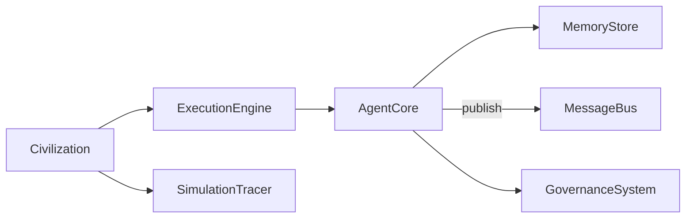
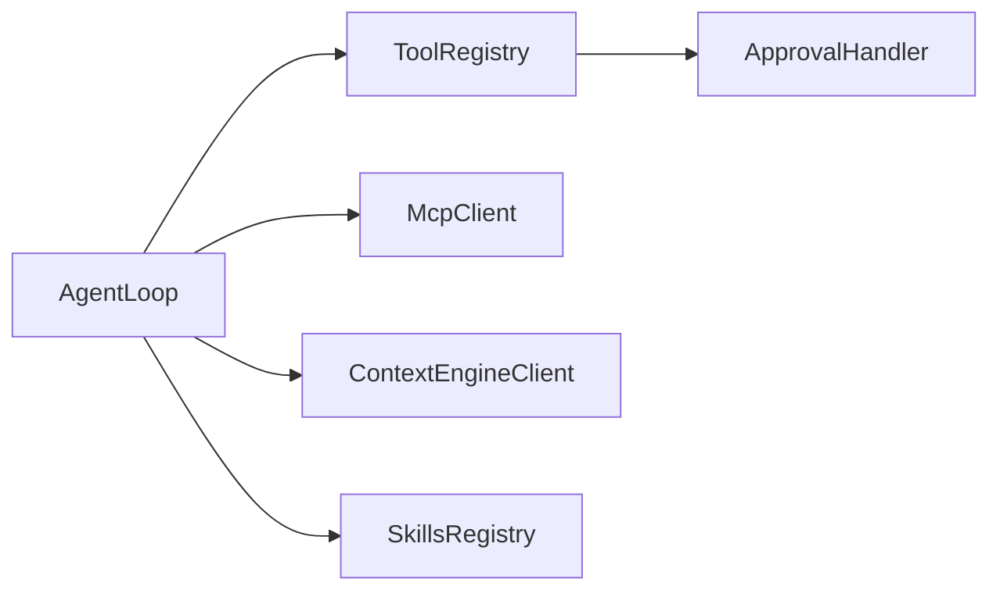
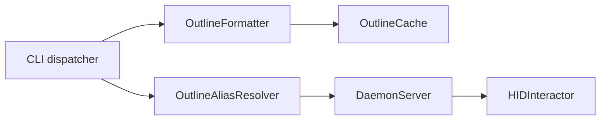
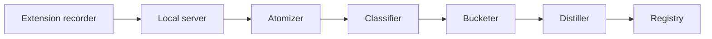

# Weekly Agentic AI Scan — 2026-07-02

**Phạm vi**: repos mới publish hoặc updated đáng kể trong 7 ngày qua (2026-06-25 → 2026-07-02), lọc theo `created:>2026-06-25 stars:>200` qua GitHub Search API, loại awesome-list/tutorial/fork-only/repo quá nhỏ.

## Executive Summary

- Tuần này nổi bật nhất là **Fundamental-Ava** (multi-agent simulation) và **Godcoder** (coding agent Rust) — cả hai có kỹ thuật lõi thật (scheduler async, approval gates, skills registry) nhưng đều có khoảng cách rõ giữa README/marketing và code thực tế: Fundamental-Ava tự nhận là "LLM-agent framework" nhưng không path nào thực sự gọi LLM; Godcoder có nhiều subsystem "headline" (Context Engine, ResearchSwarm) hoá ra là fork gần nguyên vẹn của SuperAGI SuperCoder và karpathy/autoresearch, rebrand chưa hoàn chỉnh.
- **sim-use** (LY Corporation/LINE) là repo sạch nhất về mặt kỹ thuật — một capability layer thuần cho mobile agent testing, thiết kế addressing (`@N`/`#N`) và daemon per-device rất chỉn chu, nhưng thiếu CI dù có test suite lớn.
- **Browser-BC** minh hoạ rõ ranh giới giữa "agentic" thật và pipeline batch-processing gắn mác agentic: atomize→classify→bucket→distill là single-shot LLM calls, không có agent loop, không eval/replay để kiểm chứng skill sinh ra.

## Mục lục

1. [Fundamental-Ava](#1-fundamental-ava)
2. [Godcoder](#2-godcoder)
3. [sim-use](#3-sim-use)
4. [Browser-BC (Journey Forge Local)](#4-browser-bc-journey-forge-local)

---

## 1. Fundamental-Ava

**Repo**: [TianhangZhuzth/Fundamental-Ava](https://github.com/TianhangZhuzth/Fundamental-Ava)

### §1 — Quick Context

Framework mô phỏng đa-agent quy mô lớn, mô hình "công dân số" với memory phân tầng và consensus BFT. Stack: Python 3.11+, `asyncio`, `structlog`, `scipy` (Mann-Whitney U), Apache 2.0. Health: 725 sao, 69 forks, 493 commits, 5 releases (mới nhất v0.4.1), CI thật (`ruff`/`mypy`/`pytest --cov`), có test suite 5 file. Điểm bất thường: toàn bộ lịch sử này tích luỹ trong ~2 ngày kể từ khi tạo repo, khó xác minh mức độ tổ chức/seeded.

### §2 — Architecture Deep-Dive

**A. Component inventory**: `AgentCore` (`src/ava/agents/base.py`) — state machine từng agent; `MemoryStore` (`src/ava/agents/memory.py`) — episodic/semantic/procedural; `CognitiveArchitecture` (`src/ava/agents/cognitive.py`) — belief/goal engine; `MessageBus` (`src/ava/communication/protocol.py`) — pub/sub; `RaftLikeConsensus` (`src/ava/communication/consensus.py`) — BFT nhưng **không được wire** vào simulation; `GovernanceSystem` (`src/ava/civilization/governance.py`) — voting thực sự dùng; `Civilization` (`src/ava/civilization/simulation.py`) — orchestrator; `ExecutionEngine` (`src/ava/execution/engine.py`) — scheduler; `SimulationTracer` (`src/ava/execution/tracer.py`); `LLMBackend` (`src/ava/models/llm.py`) — chỉ có `MockBackend`, chưa có provider thật; `EmergenceDetector` (`src/ava/analysis/emergence.py`).

**B. Control flow — Scheduler-loop pattern** (không phải ReAct/planner-executor): (1) `Civilization.run()` lặp `step()`; (2) `ExecutionEngine.run_tick()` mở `asyncio.TaskGroup` + `Semaphore` fan-out mọi agent; (3) mỗi `AgentCore.step()` chạy FSM riêng IDLE→PERCEIVING→DELIBERATING→ACTING→IDLE; (4) action đổ vào `CulturalTransmission`/`GovernanceSystem`; (5) `SimulationTracer` ghi `TickReport`.

**C. State & data flow**: message là dataclass `Message` (không phải Pydantic dù khai báo dependency), toàn bộ state in-memory (dict/list), không DB/file store. `EpisodicMemory` eviction theo importance-score, capacity mặc định 5000.

**D. Tool integration**: **không tìm thấy** registry hay cơ chế gọi tool nào — agent chỉ sinh `Action` nội bộ, tiêu thụ bởi simulation loop.

**E. Memory**: tiered episodic/semantic/procedural đúng như README, mô phỏng theo Generative Agents (Park et al., được credit rõ trong docstring); tuy vậy semantic memory **không có decay** dù README claim "independent decay" cho cả ba tầng.

**F. Model orchestration**: chỉ có `MockBackend`; không provider thật nào (không OpenAI/Anthropic/HTTP client); `httpx`/`tiktoken` là dependency khai báo nhưng không dùng ở bất kỳ file nào đã kiểm tra; không có per-role model selection.

**G. Observability**: `structlog` structured logging + `SimulationTracer` tự chế (không phải OTel thật); CI 2 workflow thật; benchmark `bench_tick_throughput.py` đo throughput ~25k agents/s nhưng agent chỉ emit `Action(kind="noop")` — đo overhead scheduling, không phải workload LLM thực.

**H. Extension**: subclass `AgentCore.deliberate()` (có 3 ví dụ thật trong repo); subclass `LLMBackend` — nhưng là dead-end vì không có wiring từ `deliberate()` tới `LLMBackend`.

### §3 — Architecture Diagram

### §4 — Verdict

Novel/đáng học: scheduler engineering thật (`TaskGroup`+`Semaphore`+timeout), tiered memory bám sát paper Generative Agents, emergence detection dùng Mann-Whitney U nghiêm túc (`scipy.stats`), CI/test thật. Red flag: tự nhận "LLM-agent framework" nhưng **không path code nào thực sự gọi LLM**; module BFT tồn tại nhưng cô lập, không dùng; benchmark 25k agents/s đo no-op action, dễ gây hiểu lầm nếu trích dẫn. Cần đào sâu: xác minh tốc độ tăng sao/commit trong 2 ngày có phải tăng trưởng hữu cơ.

---

## 2. Godcoder

**Repo**: [eli-labz/Godcoder](https://github.com/eli-labz/Godcoder)

### §1 — Quick Context

Coding agent desktop local-first viết bằng Rust, có chế độ tự-tối-ưu "Harness" và MCP client. Stack: Rust (`crates/agent`), Tauri 2 + React, Go microservice cho context engine, MIT. Health: 269 sao, 3 forks, CI 4 job thật (cargo test, musl static-binary guard, Go vet), nhưng phần lớn subsystem "nổi bật" là vendor fork chưa rebrand xong.

### §2 — Architecture Deep-Dive

**A. Component inventory**: `AgentLoop` (`crates/agent/src/agent/loop_.rs`) — vòng lặp LLM+tool call song song qua `JoinSet`; `ToolRegistry`/`ToolMode` (`crates/agent/src/tool/mod.rs`) — dispatch theo mode Ask/Plan/Coding/Freestyle/Harness/Cowork; `ApprovalHandler` (`crates/agent/src/approval.rs`) — gate phê duyệt tool call; `SkillsRegistry`/`SubagentsRegistry` (`crates/agent/src/skills/registry.rs`, `subagents/registry.rs`) — 3-tier override; `McpClient` (`crates/agent/src/mcp/mod.rs`) — stdio/HTTP/SSE, JSON-RPC 2.0; `ContextEngineClient` (`crates/agent/src/context_engine.rs`) + Go service (`services/context-engine/`); `ResearchSwarm memory bridge` (`third_party/ResearchSwarm-master/godcoder_harness.py`) — CLI `route/act/log/recall/optimize` trên SQLite.

**B. Control flow**: một `AgentLoop` duy nhất tái sử dụng cho mọi mode, khác biệt bằng system-prompt + `PermissionLevel` chứ không phải state machine riêng ("spine and adapters"). Vòng Harness self-optimization là prompt-driven: **ROUTE → PLAN → EXECUTE → EVALUATE → LOG → OPTIMIZE → REPEAT**, các bước ROUTE/LOG/OPTIMIZE gọi trực tiếp CLI ResearchSwarm.

**C. State & data flow**: message là Rust struct có kiểu (`ChatMessage`, `ToolCall{arguments:String(JSON)}`), phân biệt cache-control theo provider (Anthropic vs OpenAI). Context engine (tree-sitter, Qdrant, FalkorDB, Postgres/Redis) xác nhận thật qua `docker-compose.yaml` nhưng **tắt mặc định**, client tự degrade khi service không chạy.

**D. Tool integration**: `Tool` trait + registry theo mode; MCP **chỉ có client**, không có server. Approval gate là code thật (không phải doc-only), có UI component (`ApprovalBanner.tsx`); Freestyle/Harness/Cowork bypass gate qua `PermissionLevel::AutoApproveAll`.

**E. Memory**: ResearchSwarm bridge (SQLite `entries`, route/log/recall/optimize) là code thật, hoạt động — nhưng chính README của `third_party/ResearchSwarm-master` tự nhận là fork của `karpathy/autoresearch`.

**F. Model orchestration**: OpenAI, Anthropic, Ollama local, OpenAI-compatible custom provider; không có auto fallback giữa provider, không per-mode model selection tự động (để UI quyết định).

**G. Observability**: CI 4 job (Rust workspace test, musl static-binary guard cho rustls-only invariant, frontend build, Go build+vet) — thật, không phải stub. `crates/bench-runner/src/` gần như trống — chưa rõ benchmark thực thi gì.

**H. Extension**: implement `Tool` trait để thêm tool; thêm `ToolMode` + prompt file để thêm mode; thả `SKILL.md` vào `.agent/skills/` (project tier override global/default); cấu hình MCP server qua UI settings.

### §3 — Architecture Diagram

### §4 — Verdict

Novel/đáng học: Rust agent core (`AgentLoop`, approval gate, skills 3-tier override có chống symlink-attack) là kỹ thuật độc lập, chất lượng tốt, CI guard rustls-only invariant là chi tiết cẩn trọng hiếm gặp. Red flag nghiêm trọng: phần "Context Engine" (tree-sitter/Qdrant/FalkorDB) và toàn bộ `v1/` thực chất là **fork gần nguyên vẹn của SuperAGI's SuperCoder** — còn sót `superagilogo.svg`, biến môi trường `SUPERCODER_OPENAI_API_KEY`, DB user mặc định `superagi`, rebrand chưa hoàn chỉnh; đây là vấn đề provenance/attribution đáng lưu ý cho repo tự nhận MIT gốc. Cần đào sâu: license compliance của các phần vendor.

---

## 3. sim-use

**Repo**: [lycorp-jp/sim-use](https://github.com/lycorp-jp/sim-use)

### §1 — Quick Context

CLI Swift cho AI agent "quan sát và thao tác" iOS Simulator/Android emulator qua accessibility tree, alias hoá phần tử để tiết kiệm token. Stack: Swift (idb XCFrameworks) + Kotlin bridge APK, Apache 2.0, xuất phát từ LY Corporation (LINE). Health: 405 sao, 20 forks, test suite lớn (80+ file Swift/Kotlin) nhưng **không có CI** (`.github/workflows` không tồn tại).

### §2 — Architecture Deep-Dive

**A. Component inventory**: CLI dispatcher (`Sources/SimUse/main.swift`); `OutlineFormatter` (`Sources/iOSSimBackend/Normalizer/OutlineFormatter.swift`) — serialize AX tree thành outline; `OutlineAliasResolver` (`Sources/SimUseCore/OutlineAliasResolver.swift`) — parse selector `@N`/`#N`/`#id`; `OutlineCache` (`Sources/SimUseCore/OutlineCache.swift`) — ghi `~/.sim-use/<udid>/last-outline.json`; `DaemonServer` (`Sources/SimUseCore/Daemon/DaemonServer.swift`) — Unix-socket per-device; Android bridge (`bridge/.../SimuseAccessibilityService.kt`, `ActionRouter.kt`); `HIDInteractor` (`Sources/iOSSimBackend/HID/HIDInteractor.swift`); Viewer (`Tools/Viewer/`).

**B. Control flow — command loop, không phải ReAct built-in** (reasoning nằm ở agent bên ngoài gọi CLI): (1) agent gọi `describe-ui`; (2) `OutlineFormatter` render outline `@N`/`#N`; (3) `OutlineCache` ghi mapping alias→toạ độ; (4) agent chọn `tap @9`; (5) `OutlineAliasResolver` tra cache (stateless, không phát hiện drift) rồi forward qua daemon tới `HIDInteractor`/bridge; (6) agent gọi lại `describe-ui`/`screenshot` để verify.

**C. State & data flow**: schema `Outline`/`Entry` (JSON) thống nhất iOS/Android; state lưu 3 nơi — cache file per-UDID, daemon in-memory per-device (idle timeout 600s), `ProcessLivenessTracker` phát hiện crash/relaunch độc lập với `CrashDialogSignal` (AX-based).

**D. Tool integration**: thuần CLI, **không có MCP server**; skill markdown (`skills/sim-use/SKILL.md`) cài vào `~/.claude/skills` qua `sim-use init`. Bridge Android yêu cầu bearer token constant-time compare cho mọi endpoint trừ `/ping`.

**E. Memory**: không có — cache chỉ giữ 1 snapshot mới nhất, không phải lịch sử.

**F. Model orchestration**: không gọi LLM trực tiếp ở bất kỳ đâu — đây là pure capability/tool layer, agent bên ngoài (Claude Code...) chịu trách nhiệm reasoning.

**G. Observability**: error taxonomy có cấu trúc (`DaemonErrorKind`: permanent/transient_booting/stale_simulator/other) để agent quyết định retry; perf logging qua env `SIM_USE_CLIENT_PERF=1`; test suite 80+ file (kể cả app fixture `SimUsePlaygroundApp` riêng cho AX-tree test) nhưng **CI hoàn toàn vắng mặt**.

**H. Extension**: module boundary rõ ràng — `SimUseCore` (không phụ thuộc platform) → `iOSSimBackend`/`AndroidBackend` → executable `SimUse`; thêm platform mới cần target SwiftPM mới + case mới trong `PlatformRouter`.

### §3 — Architecture Diagram

### §4 — Verdict

Novel/đáng học: mô hình addressing `@N`/`#N`/`#id` cân bằng tốc độ vs độ chính xác một cách tường minh (doc comment tự nhận "does no drift detection"); daemon per-device amortize chi phí kết nối simulator; crash-awareness hai tín hiệu độc lập (process-liveness + AX-based) kèm luật STOP cứng. Red flag: mọi rule an toàn ("STOP khi crash", "hỏi trước hành động phá hoại") chỉ nằm ở text hướng dẫn skill, **không enforce trong code**; không CI dù test suite lớn — regression có thể lọt qua nếu không chạy tay; không MCP nên agent framework không tự động introspect tool schema.

---

## 4. Browser-BC (Journey Forge Local)

**Repo**: [Einsia/Browser-BC](https://github.com/Einsia/Browser-BC)

### §1 — Quick Context

Pipeline "chưng cất" thao tác duyệt web ghi lại được thành skill markdown cho Claude Code/Desktop. Stack: TypeScript extension (WXT, Chrome MV3) + Python harness (stdlib + FastAPI), Anthropic Messages API/OpenAI-compatible. Health: 358 sao, 36 forks, 24 test Vitest cho extension nhưng CI chỉ build artifact, harness Python không có test nào.

### §2 — Architecture Deep-Dive

**A. Component inventory**: recorder extension (`extension/src/{capture,recording,redaction}/`); local server FastAPI (`server/server.py`, port 8099); skill MCP server cho Claude Desktop (`server/skill_mcp.py`); `Atomizer` (`harness/atomizer.py`) — cắt trajectory thành segment; `Classifier` (`harness/classifier.py`) — gán `CapacityLabel`; `Bucketer` (`harness/bucketer.py`) — gom theo `domain::capacity`; `Distiller` (`harness/distiller.py`) — sinh `SKILL.md`/`TRACE_GUIDE.md`; `Registry` (`harness/registry.py`) — index tích luỹ + `synthesize_playbook()`; `Installer` (`harness/install.py`).

**B. Control flow — linear pipeline** (không phải DAG hay event-driven ở tầng harness): (1) extension upload trace lên server; (2) server finalize gọi `run_ingest_file()`; (3) `atomizer.segment_trajectory()` cắt segment; (4) `classifier.classify_segments()` gán capacity (async, tái dùng vocabulary trong cùng batch); (5) `bucketer.bucket_segments()` gom bucket, đánh dấu `dirty`; (6) `distiller.distill_bucket_sync()` sinh skill cho bucket dirty (`MIN_BUCKET_SIZE` mặc định = 1!); (7) `install.py` copy/zip skill vào thư mục Claude.

**C. State & data flow**: schema `journey_trace_v1` (`docs/trace-schema.md`) với 12 loại event và nhiều chiến lược redaction; state lưu file JSON/JSONL phẳng (`segments.jsonl`, `buckets.json`, `registry.json`), không DB, ghi atomic qua tmp-file rename. Redaction 2 lớp: client-side (extension) và server-side (regex scrub email/thẻ/OTP) trước khi gọi LLM.

**D. Tool integration**: skill chỉ là **instruction thuần, không cấp tool** — README/docs tự nhận rõ điều này; thực thi hành động browser cần Playwright MCP riêng do người dùng tự cấu hình. `skill_mcp.py` chỉ tồn tại để bơm nội dung vào Claude Desktop (vốn không có API dynamic injection như Claude Code).

**E. Memory**: `registry.json` tích luỹ qua các lần chạy — 2 lớp retrieval: match skill nguyên tử (`query_top_k`) và tổng hợp playbook đa bước (`synthesize_playbook()`) khi goal người dùng cần nhiều skill liên tiếp.

**F. Model orchestration**: `DISTILL_MODEL` mặc định `claude-opus-4-8`, `CLASSIFY_MODEL` mặc định `claude-haiku-4-5` (cả hai ID này **không khớp** model ID Anthropic đã công bố công khai — cần xác minh độc lập); mọi call là single-shot HTTP JSON, không có agent loop nào trong harness.

**G. Observability**: CI (`.gitlab-ci.yml`, `.github/workflows/build.yml`) chỉ build/package `.dmg`, **không chạy test nào**; server tự nhận trong docstring "không có judge/eval/queue" — không có cách kiểm chứng skill sinh ra hoạt động trước khi cài.

**H. Extension**: đổi LLM provider hoàn toàn qua env var (`SF_LLM_BASE`, `SF_DISTILL_MODEL`...); không có plugin hook để thêm pipeline stage mới.

### §3 — Architecture Diagram

### §4 — Verdict

Novel/đáng học: tái sử dụng capacity-vocabulary tăng dần trong classify tránh nổ bucket trùng lặp; registry 2 lớp (skill nguyên tử + playbook tổng hợp); redaction kép trước khi dữ liệu chạm LLM. Red flag: gọi là "agentic" nhưng thực chất là pipeline batch classification/generation một lượt, **không có agent loop hay khả năng thực thi** nào tự thân; `MIN_BUCKET_SIZE=1` nghĩa là một trajectory đơn lẻ đã đủ sinh skill tự nhận generalize cho "any website"; zero eval/replay; model ID không khớp Anthropic thật, CI không chạy test dù extension có 24 file test.
