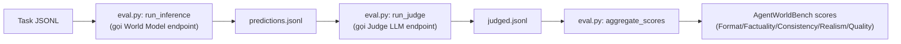
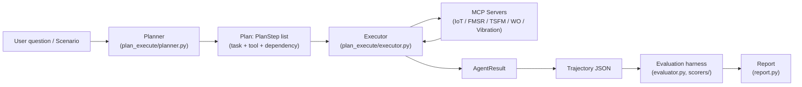
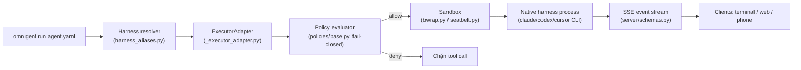
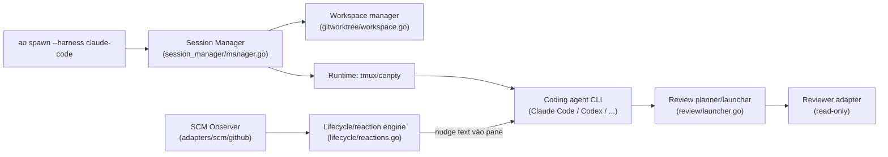

# Weekly Agentic AI Scan — 2026-07-03

**Cửa sổ quét:** repos được tạo hoặc push mạnh trong khoảng 2026-06-26 → 2026-07-03 (fallback đã mở rộng, xem "Phương pháp" bên dưới).

## Executive Summary

- Tuần này không có "wrapper mỏng" nào lọt vào top-4 — cả 4 repo được chọn đều có code thực chất (không phải README markety), nhưng 3/4 đều có red-flag đáng chú ý: claim trong README/pitch vượt quá những gì code thực sự làm (AssetOpsBench: "MetaAgent/AgentHive" không tìm thấy trong code; agent-orchestrator: không có AI planning thực sự, chỉ detect + re-prompt; omnigent: tác giả thực trong `pyproject.toml` là Databricks nhưng branding độc lập).
- Phát hiện thú vị nhất về mặt kiến trúc: **Qwen-AgentWorld** đảo ngược vai trò LLM — model đóng vai *environment* (dự đoán observation) thay vì vai *agent* (ra quyết định) — khác hẳn pattern ReAct/planner-executor phổ biến ở 3 repo còn lại.
- Pattern kỹ thuật lặp lại giữa các "harness orchestrator" tuần này (omnigent, agent-orchestrator): cả hai đều chọn **subprocess/PTY isolation** (bwrap/seatbelt, tmux/conpty) thay vì gọi LLM API trực tiếp — cho thấy xu hướng "orchestrate CLI agents đã có" thay vì tự xây agent reasoning từ đầu.

## Table of Contents

1. [Qwen-AgentWorld](#1-qwenlmqwen-agentworld)
2. [AssetOpsBench](#2-ibmassetopsbench)
3. [Omnigent](#3-omnigent-aiomnigent)
4. [Agent Orchestrator](#4-agentwrapperagent-orchestrator)
5. [Phương pháp & repo đã xem xét nhưng không chọn](#phương-pháp--repo-đã-xem-xét-nhưng-không-chọn)

---

## 1. QwenLM/Qwen-AgentWorld

Repo: https://github.com/QwenLM/Qwen-AgentWorld · Paper: https://arxiv.org/abs/2606.24597

### §1 — Quick Context

Một họ LLM (35B-A3B và 397B-A17B MoE) được train để **mô phỏng môi trường** — dự đoán observation tiếp theo từ action — trên 7 domain (terminal, web, Android, SWE, search, OS, MCP), thay vì đóng vai agent ra quyết định.

Tech stack: Python, HF Transformers/vLLM/SGLang để serve, OpenAI-compatible client cho eval, context 256K token. Repo health: 727 sao, chỉ **2 contributor**, **4 commit** tổng cộng, tạo 2026-06-22, commit cuối 2026-06-25. CI/tests: không xác định được (`.github/` trả 403 khi fetch).

### §2 — Architecture Deep-Dive

**A. Component inventory**
- `Evaluator` (`eval/eval.py`) — CLI pipeline với các subcommand `infer` → `judge` → `score`; chứa `run_inference`, `build_judge_messages`, `run_judge`, `aggregate_scores`.
- `Eval helper utils` (`eval/lwm_eval_utils/`) — thư mục tồn tại (xác nhận qua directory listing) nhưng nội dung file bị chặn 403, không đọc được chi tiết.
- `Domain prompt templates` (`prompts/{mcp,search,terminal,swe,android,web,os}/`) — 7 thư mục template, một cho mỗi domain benchmark.
- Bản thân "world model" và "agent" **không phải code trong repo này** — chỉ là weight release trên Hugging Face (`Qwen/Qwen-AgentWorld-35B-A3B`), được README trỏ tới bằng string ID.

**B. Control flow — pattern nào?**
Đây không phải vòng lặp orchestration agent thông thường, mà là pattern **"learned world-model rollout"** — đảo ngược so với ReAct/planner-executor:
1. System prompt cố định một domain mô phỏng (vd. "You are a language world model simulating a Linux terminal").
2. User turn cung cấp chuỗi `Action: <name>\nCommand: <args>`.
3. Model suy luận dài (chain-of-thought) rồi sinh ra observation/output dự đoán của môi trường.
4. Lặp lại nhiều turn, theo dõi qua field `turn_idx`/`total_turns` trong JSONL — không có state machine runtime, chỉ là metadata.
5. `eval/eval.py` điều khiển vòng lặp này qua 3 bước CLI: `infer` → `judge` → `score`, sinh `predictions.jsonl` rồi `judged.jsonl`.

**C. State & data flow**
Message format: chat schema chuẩn OpenAI/HF (`system`/`user`/`assistant`), áp dụng qua `tokenizer.apply_chat_template`. Dữ liệu lưu ở dạng JSONL (task, prediction, judged output). Không có state store bên ngoài — "memory" của một episode nhiều turn nằm hoàn toàn trong cửa sổ ngữ cảnh phẳng 262144 token.

**D. Tool / capability integration**
Không có tool-calling schema có cấu trúc (không JSON tool-spec, không `tools=[...]` registry) trong phần code đọc được. Action là chuỗi ngôn ngữ tự nhiên do chính model tự phân tích. "Tool" duy nhất là `eval.py` dùng `openai.OpenAI` client để gọi endpoint vLLM/SGLang.

**E. Memory architecture**
Không có module memory riêng (không vector store, không retriever/summarizer). Short-term memory = cửa sổ ngữ cảnh 256K; long-term/retrieval: không xác định từ code — không tìm thấy.

**F. Model orchestration**
Hai vai trò, tuần tự (không song song): (a) world model đang test, qua `--model-base-url`/`--model-name`; (b) LLM judge riêng, qua `--judge-base-url`/`--judge-model`, có `--max-retries`. Không có batching/load-balancing ngoài những gì vLLM/SGLang tự cung cấp.

**G. Observability & eval**
Dùng Python `logging`; artifact là JSONL ở mỗi bước pipeline. Benchmark "AgentWorldBench" chấm 5 chiều: Format, Factuality, Consistency, Realism, Quality (thang 0–100). Điểm công bố: Qwen-AgentWorld-397B-A17B 58.71, GPT-5.4 58.25, Qwen-AgentWorld-35B-A3B 56.39, Claude Opus 4.8 56.59. Không có tracing/telemetry.

**H. Extension points**
`eval.py` model-agnostic (endpoint OpenAI-compatible bất kỳ qua CLI flag); domain mới có thể thêm dưới dạng `prompts/<domain>/` + JSONL data. Không có SDK/plugin API nào khác.

### §3 — Architecture Diagram

### §4 — Verdict

**Novel:** LLM đóng vai môi trường (dự đoán observation-từ-action) thay vì vai agent — một single model mô phỏng 7 domain khác nhau sau CPT→SFT→RL trên 10M+ trajectory, dùng làm (a) môi trường tổng hợp rẻ để scale RL cho policy model khác, và (b) checkpoint khởi động ấm cho agent tool-calling thật. Khác biệt rõ với các framework ReAct/planner-executor coi LLM là decision-maker.

**Red flags:** Không có `requirements.txt`/`pyproject.toml` nào; không thấy thư mục test; benchmark chấm điểm bằng LLM judge từ chính nhóm tác giả, chưa có independent reproduction; chỉ 2 contributor, 4 commit cho repo 727 sao mới 8 ngày tuổi; code train và world model thật không open-source ở đây — chỉ có weight (trên HF) + eval harness mỏng + prompt template.

**Open questions:** Nội dung `eval/lwm_eval_utils/` và `prompts/<domain>/*` (bị 403 khi crawl); `.github/` có CI thật không; downstream policy/agent tiêu thụ world-model rollout như thế nào trong thực tế (không thể hiện trong repo này).

---

## 2. IBM/AssetOpsBench

Repo: https://github.com/IBM/AssetOpsBench

### §1 — Quick Context

Framework + benchmark mở để build, orchestrate và chấm điểm LLM agent chuyên biệt (IoT, FMSR, TSFM, Work Order, Vibration) cho kịch bản bảo trì tài sản công nghiệp (Industry 4.0), nối qua MCP.

Tech stack (`pyproject.toml`): Python ≥3.12, `fastmcp`/`mcp`, `pydantic`, `litellm`, `openai`, `claude-agent-sdk`, `openai-agents`, `deepagents`, `stirrup`, tùy chọn `torch`/`transformers` (extra `tsfm`), OpenTelemetry (extra `otel`). Repo health: ~1.962 sao, 287 fork, 32 contributor liệt kê, Apache-2.0. Push gần nhất **hôm nay** (2026-07-03) — PR #430 "Secure Opencode CLI runs with staged per-scenario workspaces", một feature thật, không phải commit vặt. CI: có — `.github/workflows/` (guard-couchdb-data, secret-scan, stale) + thư mục `tests/` dưới hầu hết module `src/`.

### §2 — Architecture Deep-Dive

**A. Component inventory**
- `Specialist agents / MCP servers` (`src/servers/{iot,fmsr,tsfm,wo,vibration,utilities}/`) — mỗi cái một MCP server độc lập, entry point riêng trong `pyproject.toml` (`iot-mcp-server`, `fmsr-mcp-server`, ...).
- `Orchestrator runners` (`src/agent/{plan_execute,deep_agent,claude_agent,openai_agent,opencode_agent,stirrup_agent,direct_llm_agent}/`) — 6+ runner thay thế nhau, cùng chung một interface.
- `AgentRunner interface` (`src/agent/runner.py`) — abstract contract `AgentRunner`/`AgentResult`, `DEFAULT_SERVER_PATHS`.
- `Planner` (`src/agent/plan_execute/planner.py`) và `Executor` (`src/agent/plan_execute/executor.py`).
- `MCP registry/workflow` (`src/mcphub/workflows.py`).
- `Evaluation harness` (`src/evaluation/{evaluator.py,loader.py,metrics.py,models.py,report.py,runner.py,scorers/}`).
- `Benchmark scenario runner` (`src/benchmark/scenario_suite_runner.py`, `benchmarks/scenario_suite/scenarios.txt`).

Lưu ý: "MetaAgent"/"AgentHive" (được nhắc trong mô tả repo) **không tìm thấy là code entity** — README chỉ dùng "MetaAgent" làm caption ảnh leaderboard ví dụ, "AgentHive" không xuất hiện ở đâu trong README/cây thư mục đã fetch.

**B. Control flow — pattern nào?**
**Planner-executor**, kết hợp nhiều biến thể ReAct thay thế nhau (không phải một hierarchy cố định) — repo cung cấp 4 họ runner tương thích lẫn nhau qua chung `AgentRunner` interface. Happy path (biến thể plan-execute):
1. Câu hỏi được load từ scenario hoặc CLI.
2. `Planner` prompt LLM với danh sách MCP server/tool khả dụng, sinh ra `Plan` gồm các `PlanStep` (task, server/tool được gán, dependency `#S<N>`, expected output).
3. Parser kiểm tra dependency chỉ trỏ về step trước đó.
4. `Executor` resolve tham số và gọi MCP tool theo từng step — không cần thêm LLM call vì plan đã chỉ định sẵn tool.
5. Output của step trước feed vào step phụ thuộc; câu trả lời cuối được gom thành `AgentResult`.
6. Run được log thành trajectory JSON theo `run_id` để chấm điểm sau.

**C. State & data flow**
State dạng file/JSON, không phải session store bền vững: trajectory (turn, tool input/output, token usage) ghi vào `AGENT_TRAJECTORY_DIR`; OTel span ghi ra `OTEL_TRACES_FILE` hoặc gửi tới OTLP collector. Evaluation đọc lại trajectory (`src/evaluation/loader.py`) thay vì chạy lại agent — pipeline tách rời "agent run → trajectory → evaluate → report".

**D. Tool / capability integration**
MCP server là process stdio độc lập, được client spawn on-demand qua `uv run <name>-mcp-server` ("idle cho tới khi client kết nối qua stdin"). Tool được nhóm theo server (đọc/ghi/LLM-use/CPU-centric). Có guard `AOB_READONLY=1`. Không thấy sandbox chính thức ngoài process isolation + read-only flag.

**E. Memory architecture**
Không có subsystem long-term memory riêng; state giới hạn trong trajectory JSON của một run, cộng với "virtual filesystem" bên trong runner Deep Agent (`src/agent/deep_agent/`) làm scratch space đa bước. Không có vector store/RAG.

**F. Model orchestration**
Model-agnostic qua `litellm`/`LLMBackend` (`src/agent/runner.py`); runner cụ thể nhắm tới Claude, OpenAI, hoặc model bất kỳ qua LiteLLM. README nhắc "TokenRouter" và eval "test với 7 LLM", dùng Llama-4-Maverick-17B làm judge. Không có bằng chứng fallback/parallel model tự động trong code đã fetch — có vẻ một model mỗi run, người dùng tự chọn.

**G. Observability & eval**
Đây là phần lõi của repo. Benchmark công bố "141+ Scenarios" (README "At a Glance") — khác với con số "460+" trong brief ban đầu, chưa xác minh thêm. Scoring có 3 họ: code-based deterministic, LLM-as-Judge (rubric 6 tiêu chí: hoàn thành task, độ chính xác truy xuất dữ liệu, xác minh kết quả, đúng trình tự, rõ ràng/giải thích, không có hallucination — pass yêu cầu 5 tiêu chí đầu true và không hallucination), và Static-JSON scorer (exact/partial match, precision/recall/F1). Có guard chống self-judging (bỏ qua nếu model trajectory == model judge). `metrics.py` báo cáo token, số tool-call, percentile thời lượng, chi phí ước tính (USD). Không có leaderboard/replay UI built-in trong repo — README trỏ tới Kaggle/Hugging Face leaderboard bên ngoài.

**H. Extension points**
Thêm specialist agent mới: tạo `src/servers/<name>/` MCP server + entry point trong `pyproject.toml`, đăng ký vào `DEFAULT_SERVER_PATHS`. Thêm scenario mới: thêm id vào `benchmarks/scenario_suite/scenarios.txt` + `scenarios_data/scenario_<id>/{question.txt,manifest.json,groundtruth.txt}`.

### §3 — Architecture Diagram

### §4 — Verdict

**Novel:** (a) evaluation tách rời khỏi trajectory — chấm điểm bất kỳ run đã lưu mà không cần re-invoke agent, cho phép re-score/đổi judge rẻ; (b) guard chống self-judging tường minh để giảm bias; (c) hỗ trợ đồng thời 6+ agent framework thay thế nhau (plan-execute, deep-agent, Claude/OpenAI ReAct, stirrup, opencode) trên cùng một tool layer MCP — benchmark so sánh được cả orchestration paradigm, không chỉ model.

**Red flags:** "MetaAgent, AgentHive" trong mô tả repo không có bằng chứng là module đã implement — MetaAgent chỉ là caption ảnh ví dụ, AgentHive vắng mặt hoàn toàn. Số lượng scenario lệch nhau (README "141+" vs brief "460+"). Validation/sandbox cho MCP tool khá mỏng theo docs (chỉ process isolation + flag `AOB_READONLY`). Các claim "20+ university extension", "12+ accepted paper" không xác minh được từ code.

**Open questions:** "MetaAgent"/"AgentHive" thực ra nằm ở repo IBM riêng nào, hay chỉ là khái niệm trong paper? Điều gì giải thích chênh lệch 141 vs 460 scenario? Schema/validation chính xác mỗi MCP server áp cho tool argument là gì? Cơ chế bảo mật "staged per-scenario workspace" mới thêm (PR #430, push hôm nay) hoạt động thế nào?

---

## 3. omnigent-ai/omnigent

Repo: https://github.com/omnigent-ai/omnigent

### §1 — Quick Context

Một "meta-harness" — một lớp orchestration/policy/sandbox duy nhất điều khiển Claude Code, Codex, Cursor, OpenCode, Hermes, Pi, Kiro, Goose, Antigravity và custom YAML agent thay thế lẫn nhau, kèm session real-time đa thiết bị.

Tech stack: Python 3.12+ (FastAPI/Starlette/Uvicorn, SQLAlchemy+Alembic, OpenTelemetry, Click CLI) + web UI TypeScript. 6.077 sao / 783 fork / 411 issue mở, tạo 2026-06-11, push hôm nay (2026-07-03), bản v0.5.0.dev0 (alpha). CI: có, khá đồ sộ — 60 file trong `.github/workflows/` (ci, e2e, e2e-ui, ui-snapshot visual regression, security-gate, security-scan, oss-scorecard, flake-stress, windows). Đáng chú ý: `pyproject.toml` ghi `authors = [{name = "Databricks, Inc."}]` — dự án có vẻ được Databricks ươm tạo, phát hành dưới brand độc lập omnigent-ai, không phải một dự án grassroots hoàn toàn độc lập như README/homepage thể hiện.

### §2 — Architecture Deep-Dive

**A. Component inventory**
- `Harness adapter` (`omnigent/runtime/harnesses/_executor_adapter.py`, ~1823 dòng) — bọc bất kỳ `Executor` bên trong (claude-sdk/codex/pi/openai-agents) sau một contract `TurnContext` chung; registry qua `omnigent/harness_aliases.py`, `harness_capabilities.py`, `harness_install_spec.py`. Nhiều wrapper native theo vendor (`claude_native*.py`, `codex_native*.py`, `cursor_native*.py`, `hermes_native*.py`, `goose_native*.py`, `kimi_native*.py`, `kiro_native*.py`, `antigravity_native*.py`).
- `Policy engine` (`omnigent/policies/{base.py,function.py,registry.py,schema.py,types.py}` + `omnigent/policies/builtins/`, tài liệu `docs/POLICIES.md`) — dùng `cel-expr-python` để evaluate điều kiện.
- `Sandbox` (`omnigent/sandbox/{bwrap.py,seatbelt.py}` đăng ký backend thật trong `omnigent/inner/bwrap_sandbox.py`, ~1086 dòng, `BwrapSandboxBackend`). Cloud provider (Modal/Daytona/E2B/Kubernetes/CoreWeave/OpenShell/Boxlite) là extra opt-in.
- `Session/collab layer` (`omnigent/host/local_server.py`, `omnigent/server/`, `omnigent/runtime/session_stream.py`/`pending_elicitations.py`, `omnigent/terminals/` — pexpect+pyte PTY/tmux).
- `Agent registry` — YAML spec (`omnigent/spec/`), ví dụ có sẵn `examples/polly/`, `examples/debby/`.

**B. Control flow — pattern nào?**
**Harness-adapter + policy-gate pipeline** (không phải ReAct/planner-executor kinh điển, mà là một layer điều phối trung gian giữa client và harness thật):
1. `omnigent run agent.yaml` resolve harness (`harness_aliases.canonicalize_harness`) và đảm bảo có local server (`host/local_server.py`).
2. Harness dựa trên SDK được điều khiển qua `ExecutorAdapter`, tạo lazy `Executor` bên trong ở turn đầu tiên.
3. `run_turn` dịch request thành `Message`/`ExecutorConfig` nội bộ, gắn callback bridge ổn định (`_tool_executor`, `_elicitation_handler`, `_stable_policy_evaluator`).
4. Mỗi phase LLM/tool đều đi qua policy evaluator (thứ tự session → agent → server, DENY chặn ngay, fail-closed theo `FAIL_CLOSED_PHASES`).
5. Tool call chạm OS đã được duyệt thực thi trong sandbox đã resolve (`BwrapSandboxBackend.wrap_launcher_argv` / seatbelt / cloud provider).
6. Event nội bộ được dịch thành SSE có kiểu (`response.*`) và fan-out tới mọi client đang attach (terminal, web, phone) — nền tảng cho `attach`/`--fork`/Share.

**C. State & data flow**
Wire format là schema SSE kiểu OpenAI-Responses (`omnigent/server/schemas.py`: `OutputTextDeltaEvent`, `OutputItemDoneEvent` function_call/function_call_output, `ReasoningStartedEvent`). Persistence qua SQLAlchemy + Alembic (`omnigent/db/`), artifact store pluggable (local/S3/R2/Cloudflare D1). Context quản lý qua `omnigent/runtime/compaction.py` (phát `CompactionComplete`/summary+token_count) và đếm token bằng `tiktoken`.

**D. Tool / capability integration**
Wrapper native thật sự spawn CLI vendor (claude/codex/cursor/hermes/kiro/goose) trong tmux qua `pexpect`+`pyte`, cô lập bằng `bwrap` (Linux, bắt buộc) hoặc Seatbelt (macOS). Harness dựa SDK gọi SDK vendor in-process (`claude-agent-sdk>=0.1.62`, `openai-agents>=0.0.17`, `cursor-sdk`). MCP (`mcp>=1.0`) là protocol tool ngoài; tool call khớp nhau qua `call_id` để loại trùng kết quả giữa subprocess và server-dispatch.

**E. Memory architecture**
Không có dependency vector store/embedding. "Memory" = lịch sử theo turn cộng compaction/summarization. Semantic memory dài hạn: không xác định từ code.

**F. Model orchestration**
Harness/model chọn theo agent qua YAML (`executor.harness`); credential pluggable (API key/subscription/gateway/Databricks). Ví dụ "Debby" chạy song song Claude+GPT rồi debate; "Polly" chia việc code song song trên nhiều git worktree và cross-review bằng vendor khác. `classify_inner_exception()` map exception từ OpenAI/Anthropic/claude_agent_sdk/httpx về một bộ retry-code chung xuyên harness.

**G. Observability & eval**
OpenTelemetry span cho mỗi agent/tool call (`TracingContext`, trace ID từ `response_id`); verdict policy stream như SSE event `policy_evaluation.requested` (audit-visible theo thiết kế, dù chưa thấy bảng audit log bền vững riêng). CI có `security-gate.yml`, `security-scan.yml`, `oss-scorecard.yml`, cộng bộ test visual-regression và flake-stress.

**H. Extension points**
Harness mới — viết `Executor` rồi bọc qua `ExecutorAdapter`, hoặc cặp `*_native.py`/`*_native_bridge.py`; đăng ký vào `harness_aliases.py`/`harness_capabilities.py`. Policy mới — subclass `Policy` (`policies/base.py`) hoặc trỏ YAML `handler:` vào một callable thường (`policies/function.py`), đăng ký qua `policy_modules` trong config server, không cần fork code.

### §3 — Architecture Diagram

### §4 — Verdict

**Novel:** logic classify exception xuyên-SDK → retry-code và dedup tool-call thật sự giải quyết bug tích hợp có thật (không phải glue code hời hợt); sandbox namespace+seccomp Linux hoạt động thật song song 6+ tích hợp cloud sandbox; policy engine 3 tầng, fail-closed, hỗ trợ CEL; ví dụ agent đa vendor có sẵn (Polly/Debby) hiện thực hóa pattern cross-review và debate.

**Red flags:** Có thực chất, không phải marketing mỏng — nhưng đang ở giai đoạn alpha (0.5.0.dev0), 411 issue mở cho repo public <1 tháng tuổi, và có dấu vết rõ của một cuộc merge nội bộ (`~/.omniagents`→`~/.omnigents`→`~/.omnigent`, comment "Merged from omnigent + omnigent"). Tác giả Databricks trong `pyproject.toml` so với khung độc lập trên README/homepage đáng được nêu rõ.

**Open questions:** Số lượng/đa dạng contributor thật; lịch sử CI xanh/đỏ trên `main`; quan hệ chính thức của Databricks với org omnigent-ai; có bảng audit log policy bền vững nào ngoài SSE stream không; khoảng trống sandbox Windows (chỉ Job Object, không cô lập fs/network) như một rủi ro enterprise.

---

## 4. AgentWrapper/agent-orchestrator

Repo: https://github.com/AgentWrapper/agent-orchestrator

### §1 — Quick Context

Daemon Go (kèm shell desktop Electron/React) giám sát nhiều phiên CLI coding-agent song song — mỗi phiên trong một git worktree cô lập — và tự động nhắc agent sửa lỗi CI, merge conflict, review feedback.

Tech stack: Go 1.25.7 backend (`backend/go.mod`: chi router, `modernc.org/sqlite`, `pressly/goose` migration, `creack/pty`/`go-winio` cho PTY, `spf13/cobra` CLI), frontend Electron+React+Next.js (`frontend/src/`). 7.884 sao, 1.106 fork, 633 issue mở, tạo 2026-02-13, push 2026-07-02. CI thật: `.github/workflows/go.yml` chạy `gofmt`, `go build ./...`, `go vet ./...`, `go test -race ./...`, golangci-lint, cộng kiểm tra API-schema-drift.

### §2 — Architecture Deep-Dive

**A. Component inventory**
- `Agent adapters` (`backend/internal/adapters/agent/{claudecode,codex,opencode,cursor,aider,...}/`) — 23 adapter đăng ký trong `backend/internal/adapters/agent/registry/registry.go`.
- `Reviewer adapters` (`backend/internal/adapters/reviewer/{claudecode,codex,opencode}/` + `registry.go`) — registry riêng, tách khỏi agent làm việc.
- `Workspace manager` (`backend/internal/adapters/workspace/gitworktree/workspace.go`) — Create/Destroy/ForceDestroy/StashUncommitted/ApplyPreserved/Restore.
- `Runtime layer` (`backend/internal/adapters/runtime/tmux/tmux.go` Unix, `backend/internal/adapters/runtime/conpty/` Windows).
- `Session manager` (`backend/internal/session_manager/manager.go`).
- `Lifecycle/reaction engine` (`backend/internal/lifecycle/manager.go` + `reactions.go`) — engine "tự sửa CI/conflict".
- `Review planner/launcher` (`backend/internal/review/{planner.go,launcher.go,prompt.go}`).
- `SCM/tracker observer` (`backend/internal/adapters/scm/github/`, `backend/internal/adapters/tracker/github/tracker.go`).
- `Storage/CDC` (`backend/internal/storage/sqlite/store/store.go`, `backend/internal/cdc/broadcast.go`).

**B. Control flow — pattern nào?**
Không phải task-decomposition kiểu LLM phân cấp; đây là vòng lặp reducer **Observe → Update → Derive/Act** của một supervisor daemon (theo `docs/architecture.md`):
1. Người dùng chạy `ao spawn --project P --issue N --harness claude-code` — mỗi lệnh spawn một session.
2. `session_manager.Manager.Spawn` tạo git worktree (`gitworktree.Create`), cài hook agent, lấy launch argv từ adapter.
3. Một session tmux được tạo (`tmux.Create`) chạy CLI agent bên trong worktree.
4. `SCM Observer` poll GitHub mỗi ~30s, `Runtime Reaper` poll liveness mỗi ~5s, đưa fact vào `lifecycle.Manager`.
5. `lifecycle/reactions.go` phát hiện CI fail / merge conflict / review comment và gửi một nudge message đã dedup thẳng vào pane tmux đang chạy (vd. "CI is failing on your PR... push a fix").
6. Coding agent bên dưới (Claude/Codex/...) mới thực sự làm việc sửa lỗi — bản thân AO không có logic fix bug, chỉ detect + re-prompt.

**C. State & data flow**
State chỉ lưu trong SQLite (`modernc.org/sqlite`, migration `backend/internal/storage/sqlite/migrations/0001..0021`). Chỉ persist fact tối thiểu mỗi session: `activity_state`, `is_terminated`, cộng fact PR (check, review, mergeability); trạng thái hiển thị được tính lúc đọc, không bao giờ lưu sẵn. Change-data-capture dựa DB trigger (migration 0001 tạo bảng `change_log`), một poller tiêu thụ và fan-out qua `Broadcaster` in-process (`backend/internal/cdc/broadcast.go`) tới subscriber SSE. "Message" gửi cho agent là text prompt thuần (chuỗi nudge), không phải payload JSON/tool-call có cấu trúc.

**D. Tool / capability integration**
Chỉ dựa trên subprocess — không MCP, không agent API. Mỗi adapter's `GetLaunchCommand()` build argv CLI (vd. Claude Code: `claude --session-id <uuid> --permission-mode ... --model ... --append-system-prompt ... -- <prompt>`) mà runtime tmux/conpty thực thi như tiến trình con thật bên trong worktree. Feedback ("fix CI", "resolve conflict") được gửi bằng cách ghi thêm text vào cùng pane đang chạy (`tmux send-keys`), không phải re-invoke process mới.

**E. Memory architecture**
Không có vector store/semantic memory. "Memory" giới hạn ở: (a) fact bền vững trong SQLite; (b) Claude session resumption qua UUIDv5 dẫn xuất từ session ID của AO (`--session-id`); (c) "preserved work" native git qua commit `refs/ao/preserved/<session-id>` để sống sót qua việc teardown/restore worktree.

**F. Model orchestration**
Model/agent bên dưới là bất kỳ CLI nào được cấu hình theo session (`--harness`): Claude Code, Codex, OpenCode, Cursor, Aider, Devin, Cline, Droid, Grok, Kimi, Qwen... (23 loại). Vai trò review dùng tập hẹp hơn (claudecode/codex/opencode), chạy read-only (tool cho phép giới hạn ở `Read/Grep/Glob`, `git diff/log/show`, `gh`, `ao review submit`; cấm write/commit/push). Song song hóa dựa trên OS-process/tmux-pane, một tmux session mỗi AO session; goroutine Go chỉ dùng cho polling/CDC/HTTP nội bộ của AO, không phải cho reasoning của agent.

**G. Observability & eval**
`backend/internal/adapters/telemetry/{localsqlite,posthog,fanout,noop}.go` — event telemetry có cấu trúc, báo cáo PostHog tùy chọn, kho telemetry SQLite local. Không có eval harness hay khả năng replay session — không xác định từ code ngoài activity log và lịch sử CDC event.

**H. Extension points**
Thiết kế "ports & adapters" (hexagonal) rõ ràng: `backend/internal/ports/*.go` định nghĩa interface (Agent, Reviewer, Runtime, Workspace, Tracker, SCM, Telemetry, Notifications) mà adapter implement — mô tả trong docs như các "slot" pluggable, riêng Lifecycle là core không pluggable.

### §3 — Architecture Diagram

### §4 — Verdict

**Novel:** (a) cô lập git-worktree với full lifecycle — create/destroy/force-destroy/stash-as-commit-ref/three-way-merge-reapply để teardown-and-restore an toàn khi crash; (b) kiến trúc "không bao giờ persist derived status" — CDC dựa DB trigger đổ vào SSE, giữ SQLite làm nguồn sự thật duy nhất; (c) hệ thống nudge tự động dedup theo signature cho CI/merge-conflict/review feedback, sống sót qua restart daemon; (d) reviewer-agent read-only tái sử dụng chính worktree của worker (thấy đúng diff PR thật) thay vì clone mới.

**Red flags:** Có thực chất, không phải wrapper shell script — hàng trăm file Go, migration/trigger SQLite thật, code PTY/conpty cross-platform, CI test với `-race`. Nhưng pitch "plans tasks, spawns agents" phóng đại so với code thật: **không có AI task-decomposition/planner nào** — mỗi lệnh spawn ứng với đúng một issue thủ công; "autonomously handles CI fixes/merge conflicts" nghĩa là AO detect điều kiện rồi gửi lại text prompt cho cùng agent CLI — trí tuệ sửa lỗi thật sự hoàn toàn thuộc về Claude/Codex CLI bên dưới, không phải AO. Ngoài ra phát hiện docs không nhất quán: `frontend/src/landing/content/docs/architecture.mdx` mở đầu bằng "Agent Orchestrator (AO) is a Node.js orchestrator..." trong khi backend thật chắc chắn là Go — docs marketing có vẻ cũ/copy nhầm.

**Open questions:** Nội dung thư mục `skills/` và cách "skills" tích hợp với adapter — chưa fetch được. Số lượng contributor thật/bus-factor — bị GitHub API rate-limit khi crawl. `docs/superpowers/plans/*.md` (ngày 2026-06-24 đến 06-27) có phải dấu hiệu repo này được tự phát triển bằng agentic AI không? Cơ chế parse verdict review (`ao review submit`) chưa xác định được từ file đã fetch.

---

## Phương pháp & repo đã xem xét nhưng không chọn

Query đầu (`agent OR multi-agent OR agentic created:>7d stars:>200`) chỉ trả 5 kết quả, phần lớn là skill-repo mỏng hoặc awesome-list → mở rộng theo đúng fallback rule sang `pushed:>7d stars:>500` và `agentic created:>~10d stars:>100`. Từ longlist ~15-18 repo, sau khi loại awesome-list (`Evolink-AI/Awesome-Blender-Seedance-Workflow-Usecases`, `benchflow-ai/awesome-evals`), tutorial/skill-dump (`Kulaxyz/self-learning-skills`, `lingbol088-spec/reverse-flow-skill`, `Johell1NS/browser-search`, `YurunChen/repo-docs-skills`), và framework lâu đời chỉ push định kỳ chứ không phải sự kiện mới trong tuần (`langchain-ai/langchain`, `microsoft/agent-framework`, `SolaceLabs/solace-agent-mesh`, `google-gemini/gemini-cli`), còn lại 5 ứng viên đủ chất lượng để deep-dive: 4 repo ở trên, cộng thêm:

- **HKUDS/AgentSpace** (605 sao, TypeScript) — workspace Postgres-backed thật với RBAC/task/approval model tử tế (`packages/services/src/permissions.ts`), nhưng không có đóng góp kiến trúc/thuật toán mới, 1 contributor chiếm 119/127 commit, homepage `hire-an-agent.online` gợi ý sản phẩm thương mại hơn là nghiên cứu — bị loại khỏi top-4 vì trùng lặp về chất "ops layer cho CLI agent" với omnigent/agent-orchestrator nhưng ít novelty kỹ thuật hơn.

## Self-check

- [x] Mỗi repo có link verify qua GitHub API (repo tồn tại, public, trả JSON hợp lệ)
- [x] Không repo nào là awesome-list hoặc tutorial dump (đã loại ở bước lọc)
- [x] §2.A: mọi component đều kèm file path evidence thật
- [x] §2.B: control flow pattern được gọi tên rõ ràng (world-model rollout / planner-executor / harness-adapter+policy-gate / observe-update-derive-act reducer)
- [x] §3: Mermaid flowchart LR, syntax hợp lệ
- [x] §3: mọi node đều xuất hiện trong §2.A tương ứng
- [x] §4: điểm novel cụ thể, không generic ("uses LLM")
- [x] File path theo convention `research/weekly/{YYYY-MM-DD}-agentic-scan.md`
