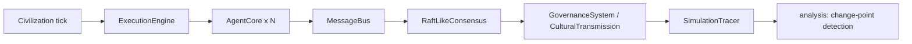
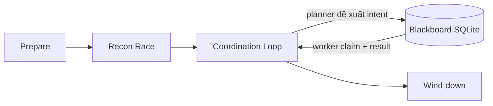
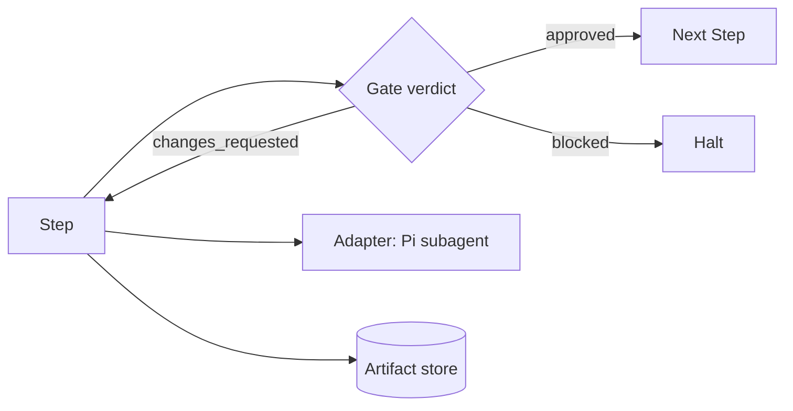

# Weekly Agentic AI Scan — 2026-07-04

**Cửa sổ quét:** repo được tạo hoặc cập nhật đáng kể từ 2026-06-27 đến 2026-07-04, qua GitHub Search API (`created:>2026-06-27 stars:>200`, mở rộng `pushed:>2026-06-27 stars:>500` theo protocol khi cần).

## Executive summary

- Tuần này, pool repo "agentic/multi-agent" mới tạo với >200 sao **bị ô nhiễm nặng bởi star-farming**: hơn chục repo gần như giống hệt nhau (toàn HTML, tiêu đề kiểu "AI Agent Orchestrator 2026", sao dao động sát nút 152–155) — dấu hiệu rõ của bot/marketing farm, không phải kỹ thuật thật. Sau khi loại các repo này cùng awesome-list và skill/prompt-only repo, chỉ còn **2 repo vượt ngưỡng lọc nghiêm ngặt**: `Fundamental-Ava` và `muteki`.
- Vì pool >200 sao quá mỏng, đã bổ sung thêm 1 repo dưới ngưỡng (`pi-loopflows`, 21 sao) vì có kiến trúc thật, tài liệu kỹ (CHANGELOG chi tiết) và pattern đáng học (gate-as-state-machine, live steering) — ghi rõ đây là ngoại lệ có chủ đích, không phải qua được filter mặc định.
- Điểm chung đáng chú ý: cả 3 repo đều tránh né kiến trúc "một LLM gọi tool" đơn giản — `Fundamental-Ava` dùng consensus kiểu Raft giữa các agent, `muteki` điều phối *nhiều agent coding khác nhà cung cấp* (Claude/Codex/Cursor) qua blackboard, `pi-loopflows` biến gate thành nhánh state-machine tường minh thay vì để LLM tự quyết định luồng.

## Mục lục

1. [Fundamental-Ava](#1-fundamental-ava)
2. [muteki](#2-muteki)
3. [pi-loopflows](#3-pi-loopflows)

---

## 1. Fundamental-Ava

**Repo:** https://github.com/TianhangZhuzth/Fundamental-Ava

### §1 — Quick context

Framework mô phỏng quần thể tác nhân tự trị để quan sát hành vi văn minh nổi cấp (emergent civilization). Tech stack: Python 3.11+, asyncio/uvloop, Pydantic, NetworkX, structlog, tiktoken, SciPy; dev tooling pytest+hypothesis, ruff, mypy strict (từ `pyproject.toml`). Repo health: 520 sao, tạo trong 7 ngày qua, version `0.4.0` (Beta), license Apache-2.0, một tác giả/tổ chức "Fundamental Research Labs". Có `tests/`, `benchmarks/`, `experiments/` — nhưng số contributor và trạng thái CI workflow không xác định được từ dữ liệu công khai thu thập được (API bị rate-limit khi truy vấn).

### §2 — Architecture deep-dive

**A. Component inventory** (evidence: các file `__init__.py` đọc trực tiếp)
- `AgentCore`, `AgentState` (`src/ava/agents/__init__.py` re-export từ `agents/base.py`) — vòng đời & trạng thái từng agent
- `CognitiveArchitecture`, `BeliefSystem` (`agents/cognitive.py`) — logic suy luận, cập nhật niềm tin
- `EpisodicMemory`, `SemanticMemory`, `ProceduralMemory`, `MemoryStore` (`agents/memory.py`) — bộ nhớ phân tầng
- `SocialModel`, `TheoryOfMind` (`agents/social.py`) — mô hình hoá quan hệ & trạng thái tinh thần agent khác
- `MessageBus`, `Message`, `MessageType` (`communication/protocol.py`) — pub/sub bất đồng bộ
- `RaftLikeConsensus`, `ConsensusError` (`communication/consensus.py`) — đồng thuận kiểu Raft cho fact dùng chung
- `Civilization`, `SimulationConfig` (`civilization/simulation.py`) — điều phối tick toàn hệ thống
- `GovernanceSystem`, `Law` (`civilization/governance.py`) — thực thi luật lệ
- `CulturalTransmission`, `Norm` (`civilization/culture.py`) — lan truyền văn hoá giữa agent
- `ExecutionEngine` (`execution/engine.py`) — scheduler asyncio bounded-concurrency (semaphore)
- `SimulationTracer`, `TraceSpan` (`execution/tracer.py`) — trace từng bước mô phỏng

**B. Control flow — Event-driven + tick-based state machine** (không phải ReAct/planner-executor cổ điển):
1. `Civilization` tiến một tick của đồng hồ mô phỏng
2. `ExecutionEngine` lập lịch chu trình perceive→deliberate→act của từng `AgentCore` dưới giới hạn concurrency
3. Agent giao tiếp qua `MessageBus` (pub/sub)
4. Niềm tin/fact xung đột được giải quyết bởi `RaftLikeConsensus`
5. `GovernanceSystem`/`CulturalTransmission` áp luật và văn hoá cấp văn minh
6. `SimulationTracer` ghi `TraceSpan` mỗi tick; tầng `analysis/` quét lịch sử trace tìm change-point (biểu hiện nổi cấp)

**C. State & data flow:** message là schema Pydantic có kiểu (`Message`/`MessageType`), không phải string/dict thô. State lưu in-memory (asyncio-native) — không thấy dependency Redis/Postgres trong `pyproject.toml`, nên khả năng persist qua các lần chạy **không xác định từ code**. Quản lý context: bộ nhớ ba tầng đóng vai trò "compaction strategy" thay vì sliding window đơn thuần; có `tiktoken` nhưng thuật toán nén cụ thể trong `memory.py` không xác định từ code (chưa đọc thân hàm).

**D. Tool/capability integration:** không thấy dependency SDK LLM nào (`openai`/`anthropic`/`litellm`) trong `pyproject.toml` → đây là mô phỏng closed-world, không phải agent gọi tool qua LLM. Việc cognition có gọi ra LLM ngoài hay hoàn toàn rule/heuristic-based **không xác định từ code**.

**E. Memory:** ngắn hạn = episodic theo tick; dài hạn = semantic + procedural, gộp qua `MemoryStore`. Không có vector DB trong dependencies → retrieval nhiều khả năng là structured/in-process, không phải embedding-based (không xác định chi tiết thuật toán).

**F. Model orchestration:** không xác định từ code — không có client LLM nào trong dependency, nên vai trò model cho từng loại agent (nếu có) nằm ngoài package lõi.

**G. Observability & eval:** `SimulationTracer`/`TraceSpan` built-in; tầng `analysis/` dùng phân tích thống kê (change-point) làm cơ chế đánh giá "emergence" thay vì quan sát chủ quan — khá hiếm với framework agent. Không thấy OpenTelemetry/Langfuse.

**H. Extension points:** thêm loại agent bằng cách subclass `AgentCore`; luật/văn hoá/đồng thuận mới cắm qua các module `civilization/*`.

### §3 — Architecture diagram

### §4 — Verdict

Điểm đáng học: dùng đồng thuận kiểu Raft giữa các agent để giải quyết fact xung đột, và dùng change-point analysis thống kê để định lượng "emergence" thay vì đánh giá cảm tính — mức độ nghiêm túc khoa học hiếm gặp ở một repo 520 sao mới toanh. Red flag: hoàn toàn không rõ cognition có LLM đứng sau hay không (không có SDK LLM nào trong dependency) — đây là câu hỏi lớn nhất cần đào sâu, vì nó quyết định đây là "agent framework" thật hay một discrete-event simulation đội lốt ngôn ngữ agent. Cần đọc thêm `agents/cognitive.py` và `agents/memory.py` để xác nhận cơ chế deliberation và thuật toán nén bộ nhớ.

---

## 2. muteki

**Repo:** https://github.com/FishCodeTech/muteki

### §1 — Quick context

Swarm nhiều AI coding agent (Claude Code, Codex, Cursor) hợp tác giải challenge CTF/pentest qua bảng dữ liệu dùng chung (shared blackboard). Tech stack: Python ≥3.13 (FastAPI/Uvicorn), Next.js UI, Go supervisor trong container, Docker Compose, SQLite event-sourced, tích hợp DeepSeek API; Capstone/radare2-pipe cho phân tích nhị phân (từ `pyproject.toml`). Repo health: 220 sao, tạo trong 7 ngày qua, version `0.2.5`. Số contributor/CI badge không xác định từ dữ liệu công khai thu thập được.

### §2 — Architecture deep-dive

**A. Component inventory** (evidence: cây thư mục trích từ `README.md`, `pyproject.toml`, `docker-compose.yml` đọc trực tiếp):
- Coordinator/swarm (`muteki/swarm/`) — điều phối 4 pha, chủ sở hữu blackboard
- Solver (`muteki/solver/`) — CLI driver, gate, control plane quyết định tính hợp lệ của bằng chứng
- `muteki/models/`, `muteki/platform/`, `muteki/sandbox/` — schema dữ liệu, execution/sandbox abstraction
- Web coordinator (`apps/web/server.py` FastAPI + `apps/web/ui/` Next.js) — console vận hành
- Go supervisor (`cmd/runtime-agent/`) — tiến trình trong container, reverse-connect về control plane
- Worker image (`docker/worker/`) — container thực thi lệnh thật
- "muteki-blackboard" skill (mô tả trong README, path chi tiết chưa xác nhận trực tiếp) — kênh dữ liệu duy nhất giữa worker và blackboard

**B. Control flow — Hierarchical supervisor + shared blackboard, state machine 4 pha:**
1. **Prepare** — khởi tạo blackboard, stage file, kiểm tra engine, cài skill giao tiếp, launch container
2. **Recon Race** (chỉ lần chạy đầu) — nhiều engine chạy song song toàn bộ challenge theo kiểu breadth-first
3. **Coordination Loop** (chu kỳ ~2 giây) — coordinator đọc blackboard → planner đề xuất intent → intent lên board → worker claim và thực thi lệnh thật → kết quả ghi lại qua skill
4. **Wind-down** — khi có flag/dừng tay/hết budget: lưu trạng thái agent thắng, giải phóng claim, dọn dẹp

**C. State & data flow:** blackboard là SQLite event-sourced (log sự kiện append-only, không phải bảng mutable) — định dạng message giữa coordinator/worker đi qua skill "muteki-blackboard" dưới dạng intent/claim/result có cấu trúc (schema cụ thể chưa đọc trực tiếp). Quản lý context: không có context window đơn lẻ nào cần quản lý — blackboard chính là "bộ nhớ chung" giữa các agent khác nhà cung cấp, né hẳn vấn đề fit lịch sử vào 1 context.

**D. Tool/capability integration:** "tool" ở đây là *cả một coding agent* (Claude Code/Codex/Cursor) chạy như tiến trình/container riêng, không phải function-calling bên trong một lệnh gọi LLM — tích hợp xảy ra ở tầng process/container qua Go supervisor. Có "provenance gate": flag phải xuất hiện verbatim trong output thực thi thật — cơ chế chống hallucination cụ thể, đo được, thay vì guardrail mơ hồ.

**E. Memory:** không có kiến trúc bộ nhớ dài hạn xuyên phiên; blackboard đóng vai trò state tạm thời trong phạm vi một challenge run.

**F. Model orchestration:** heterogeneous theo thiết kế — chạy song song/cạnh tranh nhiều engine (Claude, Codex, Cursor) thay vì phân vai planner/executor cố định; có endpoint DeepSeek cấu hình sẵn cho ít nhất một vai trò phụ trợ, vai trò cụ thể không xác định từ code.

**G. Observability & eval:** eval công bố trên **NYU CTF Bench** — 200 challenge (CSAW 2017–2023), budget 30 phút/challenge, đạt **200/200** (kể cả 36/36 mức hard/expert), thời gian giải trung vị 2–4 phút (nhanh nhất 22 giây), tiêu tốn ~370M token / ~$214, có breakdown thắng theo từng engine. Đây là methodology eval hiếm gặp ở repo 220 sao — có budget, có cost accounting, có benchmark công khai.

**H. Extension points:** thêm engine mới bằng cách container hoá theo `docker/worker/` và trỏ vào control plane; có "tool-awareness map" để thích ứng bề mặt công cụ riêng của từng worker.

### §3 — Architecture diagram

### §4 — Verdict

Điểm đáng học: eval nghiêm túc, có số liệu chi phí/latency thật (không phải claim suông), và "provenance gate" là safeguard cụ thể chống hallucination flag — kiểu kỹ thuật production-grade hiếm thấy ở repo mới 220 sao. Red flag: bề mặt tấn công nhạy cảm (tự động hoá CTF/pentest, coordinator mount Docker socket của host để launch container worker) — cần soi kỹ tuyên bố "container-only enforcement mode" trước khi tin tưởng sandbox thật sự chặt. Câu hỏi mở: vai trò chính xác của model DeepSeek trong hệ thống, và schema thật của skill "muteki-blackboard".

---

## 3. pi-loopflows

**Repo:** https://github.com/nik1t7n/pi-loopflows

*(Lưu ý: 21 sao — dưới ngưỡng lọc 200 mặc định. Đưa vào scan này như một ngoại lệ có chủ đích vì kiến trúc thật và tài liệu kỹ, không phải vì pass filter chuẩn — pool >200 sao tuần này quá mỏng sau khi loại spam.)*

### §1 — Quick context

Runtime điều phối workflow đa-subagent **tất định** (deterministic) cho hệ sinh thái coding agent "Pi", qua step/gate/loop tường minh. Tech stack: TypeScript/Node.js (npm package), peer dependency `@earendil-works/pi-coding-agent`, `typebox` để validate schema. Repo health: 21 sao, version `0.2.0`, MIT, có `CHANGELOG.md`/`VERSIONING.md` kỷ luật — kỷ luật release tốt dù rất nhỏ. Trạng thái CI/test không xác định từ dữ liệu công khai thu thập được.

### §2 — Architecture deep-dive

*Ghi chú minh bạch: repo tree/API bị rate-limit trong lần quét này nên các thành phần dưới đây trích từ `package.json`, `CHANGELOG.md` và `README.md` — những file đã đọc trực tiếp — chứ không phải đọc source `.ts` thật bên trong.*

**A. Component inventory** (evidence: `CHANGELOG.md`, `package.json` — đọc trực tiếp)
- Step & Loop (nguyên lý ghi trong `CHANGELOG.md` v0.1.0: "step, loop, gate, max-iteration, artifact, and adapter primitives") — hành động tuần tự, bọc trong vòng lặp có giới hạn số lần
- Gate (`CHANGELOG.md`) — điểm quyết định, parse output agent thành `approved`/`changes_requested`/`blocked`
- Adapter (`CHANGELOG.md`, `package.json` liệt kê peer dep `@earendil-works/pi-coding-agent`) — biên thực thi có thể hoán đổi backend
- Two-layer memory: session ID bền vững `loopflow-{workflow}-{agent}` + "Observational Memory" kiểu Mastra (`CHANGELOG.md` v0.2.0) — nén/inject quan sát qua các vòng lặp
- Artifact store (`README.md`: `.pi/loopflows/runs/<timestamp>-<workflow>/`) — lưu bằng chứng từng bước
- Loopflow definitions (`*.loopflow.json`, thư mục `loopflows/` liệt kê trong `package.json` "files") — đồ thị workflow khai báo
- `loopflow_run` tool + CLI `/loopflow-list`, `/loopflow {name}`, `/loopflow-monitor` (`README.md`) — entry point

**B. Control flow — State machine/graph có chu trình (không phải ReAct tuyến tính):** step → gate → rẽ nhánh theo verdict.
1. Người vận hành gọi `/loopflow {name} -- {task}` hoặc `loopflow_run({...})`
2. Engine nạp đồ thị `*.loopflow.json` tương ứng, bắt đầu chạy step qua Adapter (Pi subagent)
3. Output của step tới một Gate — bản thân Gate cũng là một lệnh gọi agent (vd: reviewer) trả về `approved`/`changes_requested`/`blocked`
4. `changes_requested` → quay lại step trước đó (giới hạn bởi max-iterations); `blocked` → dừng
5. Mỗi kết quả step/gate được ghi vào thư mục artifact có timestamp
6. Người vận hành có thể theo dõi/can thiệp trực tiếp qua TUI `/loopflow-monitor` (pause/resume/interrupt)

**C. State & data flow:** workflow định nghĩa bằng JSON có kiểu qua `typebox` — schema-validated, không phải string thô. Session lưu qua ID bền vững theo từng subagent; "Observational Memory" nén/inject quan sát+reflection giữa các vòng lặp — chiến lược compaction tường minh (xác nhận trong CHANGELOG), không phải cắt sliding-window đơn giản.

**D. Tool/capability integration:** giao toàn bộ việc gọi tool cho peer-dependency `@earendil-works/pi-coding-agent` — repo này chỉ định nghĩa lớp điều phối (đồ thị/gate/adapter), không tự làm cơ chế function-calling. Adapter được thiết kế rõ ràng để mở rộng sang Codex CLI/OpenCode/remote worker trong tương lai (hiện tại chỉ có adapter cho Pi).

**E. Memory:** hai tầng — (1) session ID bền vững cho từng subagent để duy trì liên tục qua các vòng lặp, (2) "Observational Memory" biên soạn/nén quan sát+reflection để tránh phình context. Không có vector DB/RAG được mô tả.

**F. Model orchestration:** các vai trò subagent theo tên (context-builder, scout, researcher, planner, worker, reviewer, oracle) ngụ ý phân vai theo role, nhưng model cụ thể đứng sau mỗi role **không xác định từ code/tài liệu thu thập được**.

**G. Observability & eval:** TUI dashboard thời gian thực (tab đồ thị workflow + tab suy nghĩ agent), điều khiển pause/resume/interrupt trực tiếp, và artifact trail lưu lại mỗi run — quan sát/vận hành tốt; không thấy eval/replay tự động, chỉ có kiểm tra thủ công qua artifact.

**H. Extension points:** thêm workflow mới = thêm file `*.loopflow.json` vào `.pi/loopflows/` (project) hoặc `~/.pi/agent/loopflows/` (user) — không cần sửa code; backend mới cắm qua interface Adapter.

### §3 — Architecture diagram

### §4 — Verdict

Điểm đáng học: Gate được mô hình hoá như nhánh state-machine tường minh dựa trên verdict có cấu trúc của chính agent (không phải LLM tự quyết định luồng ngầm), cộng với khả năng người vận hành *can thiệp trực tiếp giữa chừng* (pause/interrupt/redirect) qua TUI — phần lớn framework workflow agent là fire-and-forget, cái này chủ đích thiết kế cho giám sát. Red flag: dự án rất nhỏ (21 sao, một tác giả), khoá chặt vào hệ sinh thái độc quyền `@earendil-works/pi-coding-agent` — khả năng dùng ngoài "Pi" hiện chỉ là roadmap (adapter cho Codex/OpenCode chưa tồn tại). Câu hỏi mở: "Observational Memory" thực sự quyết định giữ/bỏ quan sát nào theo thuật toán gì, và Gate có bắt buộc luôn là một lệnh gọi agent hay có thể là check tất định thuần code.
