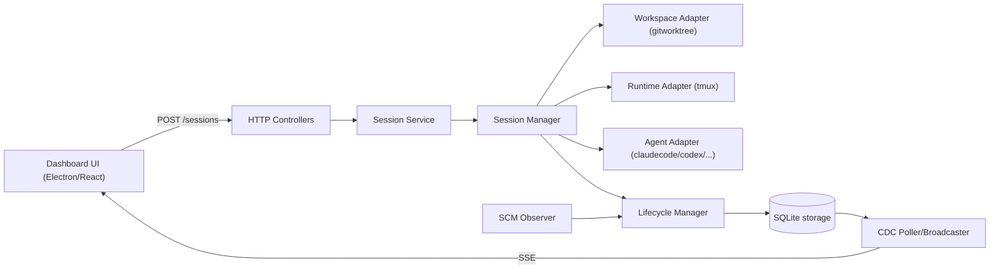
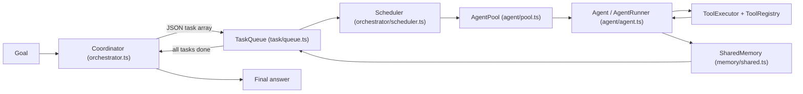
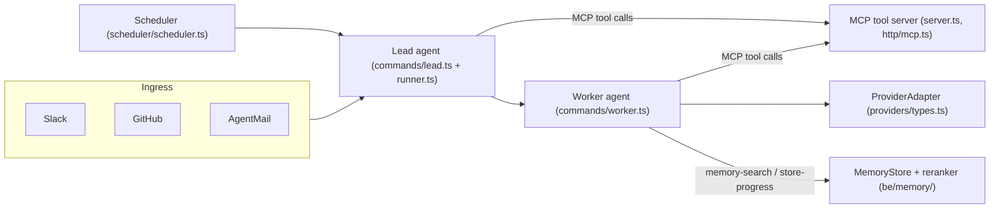
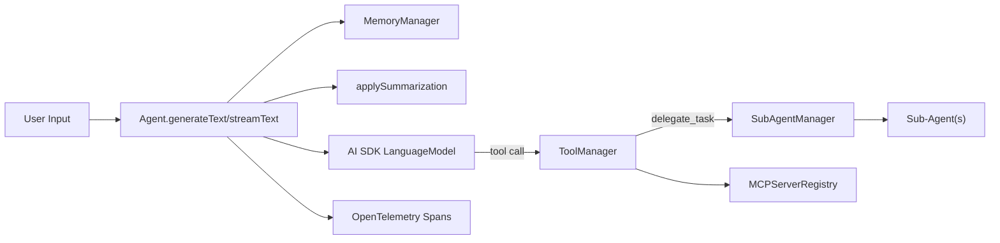

# Weekly Agentic AI Scan — 2026-07-05

> Phạm vi: repo agentic AI được publish hoặc updated đáng kể trong khoảng 2026-06-28 → 2026-07-05. Nguồn phát hiện: web search + Hacker News Show HN + blog kỹ thuật (GitHub Search API/Web UI cho các repo ngoài phạm vi cấu hình của session này bị chặn ở tầng proxy, xem "Ghi chú phương pháp" cuối file), sau đó xác minh trực tiếp bằng `git clone` cục bộ và đọc code thật.

## Executive Summary

- 4/4 repo được chọn đều có commit thật trong 7 ngày qua (30/06 → 04/07/2026), đều >500 sao, đều có CI/tests và docs kiến trúc riêng — không phải awesome-list hay tutorial.
- Điểm chung đáng chú ý: cả 4 repo đều tách bạch rõ ràng giữa "planner/coordinator sinh kế hoạch" và "executor tất định thực thi kế hoạch" (Agent Orchestrator: durable-facts/derived-status; OMA: coordinator chỉ emit JSON rồi giao cho Scheduler+TaskQueue; VoltAgent: delegate_task như một tool call trong ReAct loop; Agent Swarm: memory rating v1.5 tách khỏi vòng lặp lead/worker) — cho thấy xu hướng chung của tuần: giảm dần việc để một LLM loop ôm hết orchestration, chuyển phần đó sang code tất định.
- Rủi ro lặp lại ở nhiều repo: thiếu cơ chế fallback model cross-provider tường minh trong core (VoltAgent, Agent Swarm đều "không xác định từ code"), và ít nhất 2/4 repo (Agent Orchestrator, Agent Swarm) có dấu hiệu bus-factor thấp hoặc naming/branding không nhất quán giữa README và mã nguồn thực tế.

## Mục lục

1. [ComposioHQ/agent-orchestrator](#1-composiohqagent-orchestrator)
2. [open-multi-agent/open-multi-agent](#2-open-multi-agentopen-multi-agent)
3. [desplega-ai/agent-swarm](#3-desplega-aiagent-swarm)
4. [VoltAgent/voltagent](#4-voltagentvoltagent)

---

## 1. ComposioHQ/agent-orchestrator

**Repo:** https://github.com/ComposioHQ/agent-orchestrator

### §1 — Quick Context

- Agent Orchestrator là daemon Go điều phối nhiều CLI coding agent (Claude Code, Codex, Cursor...) chạy song song trong workspace cô lập.
- Tech stack core: Go 1.25 (backend), Electron + React + TypeScript (frontend), SQLite (`modernc.org/sqlite`), chi router — không gọi model API trực tiếp, chỉ shell-out ra CLI agent có sẵn.
- Repo health: ~8k sao, ≥11 tác giả trong lịch sử commit gần đây, commit cuối 2026-07-04; có CI đầy đủ (`.github/workflows/go.yml`, `cli-e2e.yml`, `desktop-testing.yml`) và 166 file `*_test.go`.

### §2 — Architecture Deep-Dive

**A. Component inventory**
- `Session Manager` (`backend/internal/session_manager/manager.go`) — spawn/kill/restore session.
- `Lifecycle Manager` (`backend/internal/lifecycle/manager.go`) — "canonical write path" rút mọi observation thành durable facts (`activity_state`, `is_terminated`).
- `Agent Registry` (`backend/internal/adapters/agent/registry/registry.go`) — nguồn sự thật duy nhất đăng ký 23 adapter agent (claudecode, codex, cursor, aider, goose...).
- `Agent Adapter` interface (`backend/internal/ports/agent.go`) — hợp đồng `GetLaunchCommand`, `GetRestoreCommand`, `GetAgentHooks`.
- `SCM Observer` (`backend/internal/observe/scm/`) — poll GitHub PR/CI/review mỗi 30s.
- `Runtime Reaper` (`backend/internal/observe/reaper/`) — probe tmux/conpty mỗi 5s phát hiện tiến trình chết.
- `Runtime Adapter` (`backend/internal/adapters/runtime/tmux`, `.../conpty`) — chạy agent thật trong PTY.
- `Workspace Adapter` (`backend/internal/adapters/workspace/gitworktree/`) — tạo git worktree cô lập cho mỗi session.
- `CDC Poller/Broadcaster` (`backend/internal/cdc/`) — đọc `change_log`, phát sự kiện qua SSE.
- `Review Planner/Launcher` (`backend/internal/review/planner.go`, `launcher.go`) — tính trạng thái review PR, trigger review pass.
- `Reviewer Adapter` (`backend/internal/adapters/reviewer/claudecode/claudecode.go`) — chạy Claude Code như reviewer riêng khỏi worker agent.
- `Storage/SQLite` (`backend/internal/storage/sqlite/`) — schema, migrations (`goose`), sqlc-generated queries.

**B. Control flow — event-driven observer/supervisor** ("OBSERVE → UPDATE → DERIVE", nêu rõ trong `docs/architecture.md`), không phải ReAct/planner-executor kiểu single-LLM-loop:
1. HTTP POST `/sessions` → Controller → Session Service → `Session Manager.Spawn()`.
2. Manager insert session row vào SQLite → trigger ghi `change_log`.
3. Manager tạo git worktree qua Workspace Adapter.
4. Manager khởi runtime (tmux/conpty), lấy `GetLaunchCommand()` từ Agent Adapter, exec agent CLI trong PTY.
5. `Lifecycle Manager.MarkSpawned()` cập nhật `activity_state` durable fact.
6. CDC poller phát hiện thay đổi `change_log`, broadcast SSE `session.updated` tới dashboard.

**C. State & data flow:** Durable state chỉ gồm `activity_state`, `is_terminated`, PR facts (bảng `pr`, `pr_checks`, `pr_comment`). Display status (`working`, `ci_failed`, `mergeable`...) không lưu trữ mà được tính lại mỗi lần đọc (load-bearing rule #1 trong `docs/architecture.md`). Giao tiếp daemon↔agent CLI qua argv + PTY terminal I/O, không phải message JSON structured. Không có context-window management do daemon quản lý — mỗi agent CLI tự lo context của nó.

**D. Tool/capability integration:** Không có khái niệm "tool" theo nghĩa function-calling LLM — bản thân agent CLI được coi là hộp đen; kiểm soát qua `AllowedTools`/`DisallowedTools` string list truyền qua flag lúc launch. Không có MCP hay JSON tool-call parsing trong daemon.

**E. Memory architecture:** không xác định từ code (không có bộ nhớ ngữ nghĩa/vector, chỉ SQLite fact store).

**F. Model orchestration:** không xác định từ code — daemon không gọi model API nào; chỉ launch CLI agent đã có model riêng, không có logic fallback/routing giữa model.

**G. Observability & eval:** Logging qua `log/slog`; telemetry gửi qua PostHog từ Electron renderer — không phải OpenTelemetry/Langfuse. "Eval" gần nhất là `Review Planner` (pure function `Plan()`) và Reviewer Adapter chạy Claude Code như automated code reviewer.

**H. Extension points:** Thêm agent CLI mới = viết adapter implement `ports.Agent` rồi thêm một dòng constructor vào `registry.Constructors()`. Runtime mới chọn qua `runtimeselect`. Không có cơ chế plug-in model.

### §3 — Architecture Diagram



### §4 — Verdict

Điểm đáng học: kiến trúc "durable facts, derived status" (chỉ lưu fact tối thiểu, tính display status tại thời điểm đọc) và mô hình port-based adapter khiến thêm agent CLI mới chỉ là một dòng ở `registry.Constructors()` — rất sạch cho hệ 23 adapter khác nhau. Red flag cụ thể: README quảng cáo badge/link trỏ `AgentWrapper/agent-orchestrator` nhưng Go module và clone thực tế mang tên `ComposioHQ`/`aoagents` — không rõ mối quan hệ giữa các tên này; daemon bind `127.0.0.1` không auth/TLS "by design". Open question: cơ chế "nudge" bơm feedback (CI fail, merge conflict) vào agent đang chạy thực hiện qua PTY input hay hook file — cần đọc sâu `lifecycle/reactions.go`.

---

## 2. open-multi-agent/open-multi-agent

**Repo:** https://github.com/open-multi-agent/open-multi-agent

### §1 — Quick Context

- OMA: mô tả một mục tiêu, coordinator tự sinh task DAG lúc chạy, thực thi song song, tổng hợp kết quả cuối — cho TypeScript.
- Tech stack core: TypeScript 5.6, Node ≥18, npm workspaces monorepo; model qua `@anthropic-ai/sdk`, `openai`, peer deps optional `@google/genai`, `@aws-sdk/client-bedrock-runtime`, `@modelcontextprotocol/sdk`, Vercel AI SDK.
- Repo health: ~6.5k sao, v1.9.0 (03/07/2026); CI có lint + test (Node 18/20/22 matrix) + coverage; 77 file test trong `packages/core/tests`.

### §2 — Architecture Deep-Dive

**A. Component inventory**
- `OpenMultiAgent` orchestrator (`packages/core/src/orchestrator/orchestrator.ts`) — API chính, quản lý team, chạy `runTeam`/`runTasks`/`runConsensus`.
- Coordinator (agent tạm thời, cùng file, `buildCoordinatorPrompt`/`buildDecompositionPrompt`) — nhận goal + roster, trả JSON array task.
- `TaskQueue` (`packages/core/src/task/queue.ts`) + `task/task.ts` — quản lý trạng thái task, topological sort (Kahn), phát hiện cycle.
- `Scheduler` (`packages/core/src/orchestrator/scheduler.ts`) — 4 chiến lược gán task→agent (round-robin, least-busy, capability-match, dependency-first mặc định).
- `AgentPool` (`packages/core/src/agent/pool.ts`) — giới hạn concurrency, chạy agent ephemeral.
- `Agent`/`AgentRunner` (`packages/core/src/agent/agent.ts`, `agent/runner.ts`) — vòng lặp hội thoại + gọi tool.
- `ToolRegistry`/`ToolExecutor` (`packages/core/src/tool/framework.ts`, `tool/executor.ts`) — đăng ký tool (Zod), thực thi song song có semaphore.
- MCP bridge (`packages/core/src/tool/mcp.ts`) — biến MCP tool thành `ToolDefinition`.
- LLM adapter layer (`packages/core/src/llm/adapter.ts`, `anthropic.ts`, `openai.ts`, `gemini.ts`, `bedrock.ts`...) — chuẩn hoá tool_use giữa các provider.
- `Team`/`messaging.ts` (`packages/core/src/team/`) — roster, message bus giữa agent.
- Memory: `InMemoryStore`, `FileStore`, `SharedMemory`, `Checkpoint` (`packages/core/src/memory/`).

**B. Control flow — hierarchical supervisor-workers (coordinator/planner-executor)**, task DAG sinh động chứ không tĩnh:
1. `runTeam(goal)` kiểm tra "short-circuit" — goal đơn giản bỏ qua coordinator.
2. Coordinator nhận `buildDecompositionPrompt` + roster, trả JSON task array trong fence ```json```.
3. `parseTaskSpecs` parse → nạp `TaskQueue`; `validateTaskDependencies` kiểm tra cycle.
4. `executeQueue`: `scheduler.autoAssign` gán agent cho task pending → dispatch song song (`Promise.all`) qua `pool.run`.
5. Task xong ghi kết quả vào `TaskQueue` + shared memory, mở khoá task phụ thuộc; lặp tới khi hết pending/stuck.
6. Coordinator được gọi lại để synthesize câu trả lời cuối từ toàn bộ kết quả task.

**C. State & data flow:** Message LLM chuẩn hoá dạng Anthropic-style tool_use block (`packages/core/src/types.ts`). State trong `TaskQueue` (in-memory), checkpoint/resume qua `Checkpoint` snapshot lên bất kỳ `MemoryStore`. Context window: `contextStrategy` — `sliding-window`, `summarize`, `compact`, `custom`, cộng `compressToolResults`/`maxToolOutputChars`.

**D. Tool/capability integration:** Đăng ký qua `defineTool()` (Zod) + `ToolRegistry.register`. Model gọi tool bằng native function-calling; có `text-tool-extractor.ts` làm fallback JSON-parsing cho model không hỗ trợ native. Validate input bằng Zod trước khi execute; sandbox filesystem qua `path-safety.ts` (mặc định giới hạn `.agent-workspace`). MCP qua `connectMCPTools` (opt-in, stdio transport).

**E. Memory architecture:** Ngắn hạn: `Agent.messageHistory`, nén qua `contextStrategy`. Dài hạn/chia sẻ: `SharedMemory` namespaced key-value trên `MemoryStore` (`InMemoryStore` mặc định hoặc `FileStore`/custom) — agent sau đọc kết quả agent trước. Retrieval: task prompt tự động chèn kết quả các task `dependsOn` trực tiếp, hoặc toàn bộ shared-memory summary nếu `memoryScope: 'all'`.

**F. Model orchestration:** Mỗi agent set model/provider riêng; `defaultModel = 'claude-opus-4-6'`. `modelRouting` policy opt-in: route model khác nhau theo phase (coordinator/synthesis/worker/delegated/short-circuit), first-match-wins. Song song: task độc lập chạy đồng thời qua `AgentPool` (`maxConcurrency` mặc định 5). Retry có backoff jitter, phân biệt lỗi terminal (auth/4xx) vs retryable.

**G. Observability & eval:** Ba tầng: `onProgress` (event lifecycle), `onTrace` (structured span có parent id, duration, token, tool I/O redact), dashboard tĩnh `renderTeamRunDashboard`. Replay: `planOnly` preview task DAG, `createPlanArtifact`/`runFromPlan` đóng băng và replay đúng graph không gọi lại coordinator. Eval hook: `runConsensus` — proposer→judge (nhiều judge chấm accept/critique JSON, quorum, revise/reject/keep).

**H. Extension points:** Custom tool qua `defineTool()`/`registry.register()`. Custom model/provider qua `AgentConfig.adapter` hoặc `modelRouting`. Custom memory backend implement interface `MemoryStore`. Custom context compressor qua `contextStrategy: { type: 'custom' }`. Custom coordinator qua `CoordinatorConfig.systemPrompt`.

### §3 — Architecture Diagram



### §4 — Verdict

Điểm đáng học cụ thể: coordinator không tự thực thi orchestration — nó chỉ emit JSON task-DAG như *data*, để một scheduler tất định (4 strategy) và `TaskQueue` (Kahn topological sort + cycle detection) thực thi; tách planner khỏi executor rất rõ ràng, cho phép `planOnly`/`createPlanArtifact`/`runFromPlan` replay không tốn token gọi lại coordinator. Red flag cụ thể: coordinator dùng **title** (chuỗi tự do) làm `dependsOn` thay vì ID ổn định — dễ vỡ nếu LLM đổi chữ hoa/thường hoặc trùng tên task. Open question: cơ chế parse `dependsOn` theo title thành ID thực hiện ở đâu (`loadSpecsIntoQueue`) — cần đọc thêm để xác nhận mức độ chịu lỗi.

---

## 3. desplega-ai/agent-swarm

**Repo:** https://github.com/desplega-ai/agent-swarm

### §1 — Quick Context

- Nền tảng điều phối đa agent tự động hoá công việc công ty qua Slack/GitHub/email, có bộ nhớ dùng chung để "học" liên tục.
- Tech stack core: TypeScript + Bun runtime, Hono (HTTP), `@modelcontextprotocol/sdk` (MCP), SQLite + `sqlite-vec`, OpenTelemetry, Docker; đa mô hình qua adapter (Claude Code, Codex, pi-mono/OpenRouter/Bedrock, Devin, opencode).
- Repo health: 573 sao, commit gần nhất 2026-07-04 (v1.109.0); phần lớn commit từ bot `desplega.ai` + vài người thật — đội core rất nhỏ; có CI (lint, typecheck, `bun test`) và 370 file test.

### §2 — Architecture Deep-Dive

**A. Component inventory**
- `Lead agent` (`src/commands/lead.ts`, `runAgent()` trong `src/commands/runner.ts`) — điều phối, lên kế hoạch, giao việc.
- `Worker agent` (`src/commands/worker.ts`) — dùng chung `runAgent()` với `role:"worker"`, thực thi task trong container Docker riêng.
- `ProviderAdapter` (`src/providers/types.ts`) — trừu tượng hoá harness/model (`ClaudeAdapter`, `CodexAdapter`, `PiMonoAdapter`, `DevinAdapter`, `OpencodeAdapter`...).
- `MCP tool server` (`src/server.ts`, `src/http/mcp.ts` qua `StreamableHTTPServerTransport`) — tool registry >40 tool.
- `MemoryStore` (`src/be/memory/{types,reranker,retrieval-store,edges-store}.ts`) — lưu trữ + truy vấn vector (SQLite + `sqlite-vec`).
- `Memory raters` (`src/be/memory/raters/`) — 3 rater (`ImplicitCitationRater`, `LlmRater`, `ExplicitSelfRatingRater`) chấm Beta-posterior cho từng memory.
- `Workflow engine` (`src/workflows/engine.ts`) — DAG-based automation, có HITL gate.
- `Scheduler` (`src/scheduler/scheduler.ts`) — cron trigger (`cron-parser`).
- `Sibling-awareness orchestrator` (`src/tasks/sibling-awareness.ts`, `sibling-block.ts`) — gắn task liên quan cùng context-key.
- `Ingress channels` (`src/slack/`, `src/github/`, `src/gitlab/`, `src/linear/`, `src/jira/`, `src/agentmail/`) — mỗi kênh tạo task riêng.

**B. Control flow — hierarchical supervisor-workers kết hợp polling/event-driven trigger loop** (không phải ReAct thuần hay state-machine graph tường minh):
1. Task đến từ Slack/GitHub/email/API → tạo trong DB qua `createTaskWithSiblingAwareness`.
2. Lead agent polling trigger (`pollForTriggerOnce`), lập kế hoạch, giao subtask cho worker.
3. Worker tự polling trigger riêng, build prompt theo loại trigger (`buildPromptForTrigger`), spawn tiến trình harness (`spawnProviderProcess`) trong container Docker.
4. Worker gọi MCP tool đọc/ghi tiến độ (`store-progress`, `task-action`) và tra cứu bộ nhớ (`fetchRelevantMemories`).
5. Kết quả trả qua adapter (`ProviderResult`) → `ensureTaskFinished` cập nhật task, gửi PR/Slack reply/email.
6. Session kết thúc kích hoạt hook tóm tắt (`src/hooks/hook.ts`) trích learning ghi vào memory.

**C. State & data flow:** Message API↔worker qua HTTP + MCP JSON-RPC (`StreamableHTTPServerTransport`), header `X-Agent-ID` ràng buộc session. Event nội bộ adapter↔runner: `ProviderEvent` union type chuẩn hoá (`session_init`, `message`, `tool_start/end`, `result`, `context_usage`, `compaction`). Lưu trữ: SQLite (`src/be/db.ts`). Context window: theo dõi `contextUsedTokens`/`contextPercent`/sự kiện `compaction`; continuity giữa task con dùng "bounded context preamble" (native session-resume đã deprecate từ 2026-05-28).

**D. Tool/capability integration:** Mỗi tool là 1 file `src/tools/*.ts` export `registerXTool(server)`, bọc `McpServer.registerTool` với schema Zod. Model gọi tool qua **native MCP protocol** (JSON-RPC chuẩn MCP). Validate input/output bằng Zod. Sandbox: worker chạy trong container Docker riêng (`Dockerfile.worker`, base ubuntu:24.04) — cách ly theo tiến trình container; có tuỳ chọn E2B (`src/e2b/dispatch.ts`) nhưng không phải mặc định.

**E. Memory architecture:** Nhiều "source" với half-life riêng — `file_index` (180 ngày), `task_completion` (14 ngày), `session_summary` (7 ngày), memory thủ công không suy giảm. Retrieval: hybrid vector + full-text (`vec`/`fts`/`hybrid`/`fallback`), rerank theo `similarity × recency_decay × access_boost × source_quality × usefulness(α,β)`. Rating framework v1.5: 3 rater ghi `RatingEvent` qua chokepoint `applyRating`, cập nhật Beta-posterior.

**F. Model orchestration:** Model tier trừu tượng theo 4 mức `smol/regular/smart/ultra`, map riêng theo harness. Resolve model tại thời điểm claim task (`task.model` > `modelTier` theo harness > `MODEL_OVERRIDE` > adapter default). Không có bằng chứng fallback tự động cross-provider khi lỗi — không xác định từ code. Parallelism: nhiều worker chạy song song độc lập, mỗi container 1 poll loop riêng.

**G. Observability & eval:** OpenTelemetry (`src/otel.ts`, `src/otel-impl.ts`) export traces/metrics OTLP. Bộ eval riêng `apps/evals/` — E2B-backed eval harness, capture transcript/artifact, chấm điểm bằng deterministic check + LLM/agentic judge.

**H. Extension points:** Provider mới: implement `ProviderAdapter` tại `src/providers/<name>/`. Tool mới: file mới trong `src/tools/`. Custom agent/persona: template trong `templates/official/` (lead, coder, reviewer, researcher...). Plugin ngoài qua `plugin/pi-skills/`, `plugin/opencode-plugins/`.

### §3 — Architecture Diagram



### §4 — Verdict

Điểm đáng học: hệ thống rating bộ nhớ v1.5 dùng Beta-posterior `(α,β)` per-memory với 3 nguồn tín hiệu độc lập (implicit citation, LLM self-grading, explicit rating) chốt qua một chokepoint `applyRating` duy nhất — thiết kế nghiêm túc cho reinforcement của retrieval, hiếm gặp ở framework khác. Bỏ native session-resume (2026-05-28) để chuyển sang "bounded context preamble" deterministic cũng là quyết định thực dụng, tránh phụ thuộc transcript on-disk dễ vỡ khi container restart. Red flags: toàn bộ state đặt trên SQLite — khả năng scale ngang không xác định từ code; đội core rất mỏng (gần như toàn bộ commit từ bot). Open question: cơ chế multi-tenant/isolation giữa các swarm/khách hàng khác nhau ở quy mô SaaS — không xác định từ code trong clone này.

---

## 4. VoltAgent/voltagent

**Repo:** https://github.com/VoltAgent/voltagent

### §1 — Quick Context

- VoltAgent: nền tảng TypeScript để xây dựng và vận hành AI agent đa tác tử với giám sát toàn diện.
- Tech stack core: TypeScript, Vercel AI SDK (`@ai-sdk/*` — OpenAI, Anthropic, Google, Bedrock...), Zod, MCP SDK, OpenTelemetry native.
- Repo health: ~9.9k sao, 10 committer unique trong lịch sử gần đây, commit gần nhất 2026-06-30 (697 release), CI đầy đủ (lint + `lerna run test`, Node 20/22/24 matrix).

### §2 — Architecture Deep-Dive

**A. Component inventory**
- `Agent` (`packages/core/src/agent/agent.ts`) — lõi thực thi agent, wrap `generateText`/`streamText` của AI SDK.
- `SubAgentManager` (`packages/core/src/agent/subagent/index.ts`) — quản lý supervisor điều phối sub-agent, expose `createDelegateTool`/`handoffTask`/`handoffToMultiple`.
- `ToolManager`/`BaseToolManager` (`packages/core/src/tool/manager/`) — registry đăng ký/tra tool.
- Tool routing (`packages/core/src/tool/routing/`) — `createEmbeddingToolSearchStrategy` chọn tool bằng embedding search.
- `Memory`/`MemoryManager` (`packages/core/src/memory/index.ts`, `memory/manager/memory-manager.ts`) — quản lý hội thoại + persistence queue.
- Memory adapters (`packages/core/src/memory/adapters/{storage,embedding,vector}`) — pluggable.
- `applySummarization` (`packages/core/src/agent/apply-summarization.ts`) — nén ngữ cảnh.
- `MCPServerRegistry` (`packages/core/src/mcp/registry.ts`) — đăng ký MCP server làm nguồn tool.
- `WorkflowEngine` (`packages/core/src/workflow/core.ts`) — engine workflow declarative, có suspend-controller, time-travel.
- Observability (`packages/core/src/observability/`) — dựa hoàn toàn trên OpenTelemetry, có `websocket-span-processor`, `local-storage-span-processor`.
- Eval (`packages/core/src/eval/builder.ts`, `create-scorer.ts`) — scorer pipeline prepare/analyze/score.
- `PlanAgent` (`packages/core/src/planagent/plan-agent.ts`) — agent lập kế hoạch riêng.
- `Retriever` (`packages/core/src/retriever/retriever.ts`) — tích hợp RAG.

**B. Control flow — ReAct-style tool-calling loop kết hợp hierarchical supervisor-workers** khi có `subAgents`:
1. `Agent.generateText`/`streamText` nhận input, load memory qua `MemoryManager`.
2. Nếu vượt ngưỡng token, `applySummarization` nén lịch sử.
3. Model sinh output; nếu gọi tool, `ToolManager` thực thi hàm tương ứng, có thể là `delegate_task`.
4. `delegate_task` gọi `SubAgentManager.handoffToMultiple` → `handoffTask` chạy sub-agent con song song, mỗi call tạo span OpenTelemetry riêng.
5. Kết quả tool/sub-agent trả lại model, lặp bước 3 tới khi kết thúc hoặc đạt `maxSteps`.
6. Toàn bộ span ghi qua `WebSocketSpanProcessor`/`LocalStorageSpanProcessor`, hội thoại persist qua `MemoryManager`.

**C. State & data flow:** Message format `UIMessage`/`ModelMessage` của Vercel AI SDK. State hội thoại lưu qua `Memory` + adapter (mặc định `InMemoryStorageAdapter`, hoặc `@voltagent/libsql`/postgres). Context window: ngưỡng token cố định `DEFAULT_SUMMARY_TRIGGER_TOKENS = 170_000`, giữ lại `DEFAULT_SUMMARY_KEEP_MESSAGES = 6` tin nhắn gần nhất.

**D. Tool/capability integration:** Đăng ký qua `createTool` (Zod schema) — native function-calling của AI SDK. MCP qua `MCPServerRegistry` + `@modelcontextprotocol/sdk`. Có hook lifecycle `onStart`/`onEnd` cho tool; sandbox thực thi code (`packages/sandbox-e2b`, `sandbox-daytona`, `sandbox-blaxel`) là package phụ trợ tách biệt, không xác nhận core dùng mặc định.

**E. Memory architecture:** Hai lớp — (1) short-term: conversation buffer + summarization khi vượt ngưỡng token; (2) long-term: `Memory` adapter pattern hỗ trợ storage/vector/embedding pluggable cho semantic search.

**F. Model orchestration:** Không có phân vai model cố định trong core — mỗi `Agent` nhận 1 `LanguageModel` từ AI SDK provider tuỳ chọn (kể cả `ollama-ai-provider-v2` cho local). `PlanAgent` có thể dùng model khác cho lập kế hoạch. Không thấy fallback model tự động trong core — không xác định từ code. Song song: `handoffToMultiple` chạy nhiều sub-agent song song bằng `Promise`.

**G. Observability & eval:** 100% dựa trên OpenTelemetry, custom `SpanProcessor` xuất qua WebSocket real-time, lưu local, OTLP export lên VoltOps Console. Eval qua `eval/builder.ts`/`create-scorer.ts` — pipeline scorer prepare→analyze→score, có sampling policy, nhưng không thấy cơ chế replay trực tiếp trong core — không xác định từ code.

**H. Extension points:** Custom tool qua `createTool`. Custom model bằng cách truyền bất kỳ `LanguageModel` từ AI SDK provider. Custom memory adapter implement interface trong `memory/types.ts`. Custom sub-agent bằng thêm `Agent` instance vào `subAgents`. Custom MCP server qua `MCPServerRegistry.register`.

### §3 — Architecture Diagram



### §4 — Verdict

Điểm đáng học: `delegate_task` tool biến việc điều phối multi-agent thành một tool call tường minh trong cùng vòng lặp ReAct, thay vì một orchestrator riêng — đơn giản hoá đáng kể so với các framework graph-based; xây observability trực tiếp trên OpenTelemetry span thay vì logging tự chế là lựa chọn kiến trúc chắc tay. Red flag: `agent.ts` dài 8879 dòng — "god file" ôm cả generateText, streamText, guardrail, hook, memory, sub-agent, khó bảo trì/test cô lập. Open question: cơ chế fallback khi model provider lỗi tồn tại ở tầng nào (VoltOps cloud hay hoàn toàn vắng mặt); sandbox thực thi tool có được core gọi mặc định hay chỉ optional package độc lập.

---

## Ghi chú phương pháp

Session này chỉ có quyền truy cập GitHub API/Web UI phạm vi hẹp (`undertheseanlp/underthesea`) — mọi request tới `api.github.com` hoặc `github.com/<repo-khác>` qua `curl` đều bị chặn ở tầng proxy (`403`, thông báo "sessions are bound to their configured repositories"). Vì vậy nguồn dữ liệu chính trong đề bài (`gh api search/repositories`) **không khả dụng** trong môi trường này. Quy trình thay thế đã dùng:
1. Web search (không phải GitHub API) để phát hiện repo qua Hacker News Show HN, blog kỹ thuật, changelog.
2. `git clone --depth 30` trực tiếp từng repo ứng viên (route này không bị proxy chặn) để xác minh ngày commit thật, cấu trúc thư mục, và đọc source code.
3. `WebFetch` trên trang GitHub public của từng repo để lấy star count/release date (route này cũng không bị chặn, khác với `curl` trực tiếp).

Tất cả 4 repo cuối cùng đều được xác minh recency bằng `git log` cục bộ (không suy diễn từ mô tả web) — 2 repo bị loại vì last-commit quá 7 ngày dù ban đầu có vẻ phù hợp qua search (`aden-hive/hive`: 2026-05-29; `fuwasegu/aegis`: 2026-06-12; `qualixar/skillfortify`: 2026-05-25).

## Self-check

- [x] Mỗi repo có link verify được (github.com page load thành công qua WebFetch, kèm star count thật)
- [x] Không repo nào là awesome-list hoặc tutorial dump
- [x] §2.A: mỗi component có file path evidence thực tế từ clone cục bộ
- [x] §2.B: control flow pattern được name rõ ràng cho từng repo (event-driven observer/supervisor; hierarchical supervisor-workers/planner-executor; hierarchical + polling trigger loop; ReAct + hierarchical handoff)
- [x] §3: Mermaid syntax hợp lệ (flowchart LR, đã kiểm tra thủ công, loại bỏ HTML-entity lỗi từ draft agent)
- [x] §3: mọi node trong diagram đều xuất hiện trong §2.A tương ứng
- [x] §4: "điểm novel" cụ thể theo từng repo, không dùng "uses LLM" generic
- [x] File path đúng convention `research/weekly/YYYY-MM-DD-agentic-scan.md`, markdown render được trên GitHub
