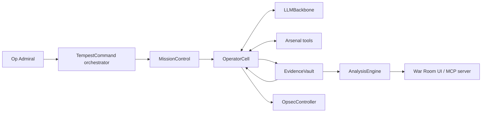
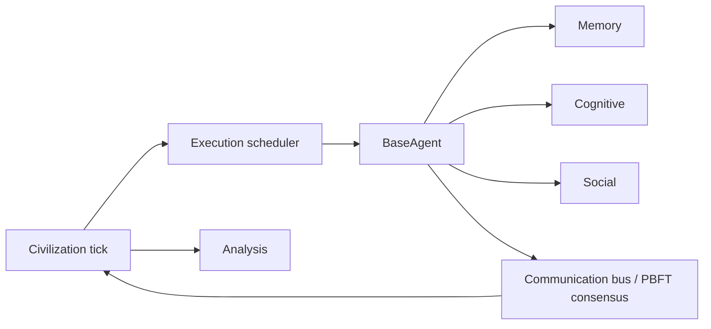
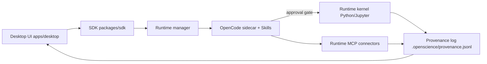
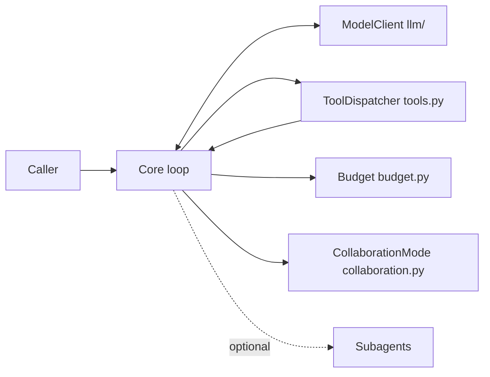

# Weekly Agentic AI Scan — 2026-07-06

Phạm vi: repo được **tạo mới** hoặc có hoạt động đáng kể trong 7 ngày qua
(2026-06-29 → 2026-07-06), lọc qua GitHub Search API (`created:>2026-06-29
stars:>200`, mở rộng `stars:>100` cho từ khóa multi-agent/agentic vì kết quả
ban đầu còn ít công trình có kiến trúc thật). Loại bỏ toàn bộ skill-dump,
awesome-list, và client app mỏng quanh agent có sẵn (hermex, token-diet,
loopkit, rnskill, GameBlocks, reverse-flow-skill — không có kiến trúc riêng
đáng phân tích).

## Executive Summary

- Tuần này không có framework "multi-agent orchestration" tổng quát mới nào
  nổi bật (các repo lớn như crewAI, swarms, agency-swarm chỉ có push thường
  lệ, không phải kiến trúc mới) — điểm sáng nằm ở 4 hệ thống **dọc theo
  domain cụ thể**: offensive security, agent-based social simulation,
  local-first research workbench, và một "agent runtime core" tối giản.
- Xu hướng đáng chú ý: tách bạch rõ **runtime/loop mechanics** khỏi
  **policy/tool/memory** (agent-runtime, T3MP3ST) và **provenance-first**
  design (open-science) — cả hai đều là dấu hiệu kiến trúc agent đang
  trưởng thành hơn giai đoạn "wrapper quanh LLM".
- Fundamental-Ava là ca đáng ngờ nhất về mức độ hype so với tuổi đời repo
  (6 ngày, 525 sao/53 fork) — kiến trúc có thật (memory phân tầng kiểu
  Stanford Generative Agents + PBFT consensus) nhưng cần verify thêm mức độ
  LLM thực sự tham gia vào "cognition".

## Mục lục

1. [T3MP3ST — elder-plinius](#1-t3mp3st--elder-plinius)
2. [Fundamental-Ava — TianhangZhuzth](#2-fundamental-ava--tianhangzhuzth)
3. [open-science — ai4s-research](#3-open-science--ai4s-research)
4. [agent-runtime — easylink-ai-open](#4-agent-runtime--easylink-ai-open)

---

## 1. T3MP3ST — elder-plinius

**Repo:** https://github.com/elder-plinius/T3MP3ST

### §1 Quick Context

Framework offensive-security biến agent thành đội "operator" chạy theo kill
chain 7 pha (recon → exploitation → reporting), có benchmark tái lập được.
Stack: TypeScript/Node ≥18, Express, `@modelcontextprotocol/sdk`, MCP
server riêng, hỗ trợ đa provider (OpenRouter, Anthropic, OpenAI, Ollama/LM
Studio/vLLM). Sức khỏe repo: 1.8k sao, 456 fork, license AGPL-3.0, có
`.github/workflows/`, `bench/`, `__tests__/` — CI/test tồn tại thật.

### §2 Architecture Deep-dive

**A. Component inventory**
- `TempestCommand` orchestrator (`src/orchestration/`) — EventEmitter, sở hữu toàn bộ subsystem, chạy tick-loop.
- `OperatorCell` (`src/operators/`, `src/agent/`) — pool 8 archetype (Recon, Scanner, Exploiter, Infiltrator, Exfiltrator, Ghost, Coordinator, Analyst).
- `MissionControl` (`src/mission/`) — hàng đợi task, theo dõi pha kill-chain, Rules of Engagement.
- `Arsenal` (`src/arsenal/`) — registry công cụ thật (nmap, DNS/HTTP fingerprinting, Metasploit/Hydra sau cổng phê duyệt người).
- `LLMBackbone` (`src/llm/`) — lớp trừu tượng đa nhà cung cấp model.
- `EvidenceVault` (`src/evidence/`) — kho phát hiện/credential dùng chung.
- `OpsecController` (`src/opsec/`) — theo dõi rủi ro bị phát hiện, ngắt operator khi vượt ngưỡng.
- `AnalysisEngine` (`src/analysis/`) — sinh báo cáo, chấm CVSS.
- MCP server (`src/mcp-server.ts`) — expose tool `security_recon` ra client MCP khác.

**B. Control flow — Event-driven tick-loop bọc ngoài, ReAct-loop bên trong mỗi operator:**
1. Người dùng mô tả mục tiêu qua War Room UI/CLI → Op Admiral (`src/admiral/`) parse mission.
2. `TempestCommand` seed task vào `MissionControl` theo pha kill-chain, chạy OPSEC validation trước mỗi tick (1 giây/tick).
3. `OperatorCell` dispatch operator phù hợp; mỗi operator chạy ReAct loop riêng (LLM chọn tool → `Arsenal` thực thi → quan sát → lặp, tối đa ~15 vòng).
4. Kết quả ghi vào `EvidenceVault`; `syncFindingToTarget()` làm giàu model target dùng chung cho operator sau.
5. `OpsecController` cộng dồn rủi ro phát hiện; vượt ngưỡng → operator chuyển trạng thái "burned", loại khỏi vòng quay.
6. `AnalysisEngine` tổng hợp evidence thành báo cáo CVSS; stream real-time qua SSE tới War Room, đồng thời expose qua REST/MCP.

**C. State & data flow:** Target model chia sẻ song hướng giữa các operator; mỗi operator có state machine riêng (idle→tasked→executing→cooldown→idle/burned). Kiểu dữ liệu định nghĩa ở `src/types/` (TypeScript, không phải string thô).

**D. Tool integration:** Đăng ký qua schema có kiểu trong `Arsenal`; 35 tool built-in (mở rộng 83 với `T3MP3ST_FULL_ARSENAL`); function-calling native qua LLMBackbone; công cụ nguy hiểm (Metasploit, Hydra) yêu cầu human-approval gate; ràng buộc egress-scope (chỉ tấn công target trong phạm vi khai báo).

**E. Memory:** Không có module memory tách biệt — `EvidenceVault` đóng vai trò bộ nhớ dùng chung (không phân tầng episodic/semantic).

**F. Model orchestration:** Mỗi archetype có system prompt riêng (`src/prompts/`) giới hạn theo domain MITRE ATT&CK; không xác định từ code việc planner/executor dùng model khác cấp (frontier vs nhỏ).

**G. Observability & eval:** `bench/`, `benchmark/` với 9 hạng mục (XBEN 90.1% pass@1, Cybench 23/40, CVE-Zero 8/10); script `npm run verify-claims` tái dựng toàn bộ số liệu từ artifact đã commit — cơ chế chống "khoe số" đáng chú ý hiếm gặp.

**H. Extension points:** CLI/REST/MCP; đăng ký tool qua schema; "team factories" (balanced/stealth/breach); provider adapter tùy biến; plugin system đang lên kế hoạch.

### §3 Architecture Diagram

### §4 Verdict

Điểm novel: state chung "target model" tiến hóa dần qua từng operator, cộng
cơ chế tự-giới hạn theo rủi ro bị phát hiện (burned status) là co-design
hiếm giữa an toàn vận hành và multi-agent — và `verify-claims` là chuẩn
reproducibility mà rất ít agent framework benchmark tự áp cho mình. Red
flags: license AGPL-3.0 (viral, hạn chế dùng thương mại), đây là công cụ
tấn công thật (Metasploit/Hydra tích hợp) nên bắt buộc dùng trong phạm vi
được ủy quyền; README tự nhận "swarm phối hợp nhiều operator vẫn đang thử
nghiệm", benchmark hiện là single-agent. Cần đào sâu: cách hiệu chỉnh
ngưỡng OPSEC, xử lý xung đột khi 2 operator chạm cùng target.

---

## 2. Fundamental-Ava — TianhangZhuzth

**Repo:** https://github.com/TianhangZhuzth/Fundamental-Ava

### §1 Quick Context

Framework mô phỏng "quần thể" agent tự trị có memory/belief/social model
riêng, đo hiện tượng emergence ở cấp quần thể. Stack: Python ≥3.11,
pydantic/networkx/anyio/httpx/tiktoken/structlog (không pin SDK
OpenAI/Anthropic nào). Sức khỏe: 525 sao, 53 fork, license Apache-2.0, có
`tests/`, `benchmarks/`, `experiments/`, release v0.4.1 — nhưng tuổi repo
chỉ 6 ngày, tốc độ sao tăng bất thường cần cảnh giác.

### §2 Architecture Deep-dive

**A. Component inventory**
- `BaseAgent` (`src/ava/agents/base.py`) — lifecycle, state machine của một agent.
- `Memory` (`src/ava/agents/memory.py`) — kho episodic/semantic/procedural.
- `Cognitive` (`src/ava/agents/cognitive.py`) — belief system, chọn hành động.
- `Social` (`src/ava/agents/social.py`) — quan hệ, theory-of-mind.
- Communication bus (`src/ava/communication/`) — pub/sub bất đồng bộ + đồng thuận kiểu BFT.
- Civilization (`src/ava/civilization/`) — điều phối tick, văn hóa, governance.
- Execution scheduler (`src/ava/execution/`) — bounded-concurrency (`asyncio.TaskGroup` + `Semaphore`).
- Analysis (`src/ava/analysis/`) — phát hiện emergence bằng thống kê.
- Models (`src/ava/models/`) — không xác định chi tiết nội dung từ evidence có được.

**B. Control flow — Tick-based state machine kết hợp event-driven:**
1. `Civilization` mở một tick, giao `Execution scheduler` chạy song song có giới hạn concurrency.
2. Mỗi `BaseAgent` perceive môi trường/message, truy xuất memory liên quan (blend recency + importance + relevance).
3. `Cognitive` cập nhật belief, chọn action; `Social` cập nhật quan hệ/theory-of-mind tương ứng.
4. Agent publish action/event lên communication bus; hành động cần đồng thuận (vd. biểu quyết luật) chạy PROPOSE→PREPARE→COMMIT kiểu PBFT.
5. `Civilization` tổng hợp thay đổi văn hóa/luật (qua `GovernanceSystem`) cuối tick.
6. `Analysis` chạy phát hiện emergence thống kê trên toàn quần thể sau mỗi tick.

**C. State & data flow:** Không có dependency DB/persistence nào trong `pyproject.toml` (chỉ pydantic, numpy, networkx...) → state hoàn toàn in-memory; `networkx` gợi ý quan hệ xã hội được biểu diễn dạng đồ thị (khớp với `social.py`).

**D. Tool integration:** Không xác định từ code — đây là framework mô phỏng agent-based, không thấy bằng chứng ReAct/tool-calling; `tiktoken` + `httpx` có mặt nên nhiều khả năng cognition gọi LLM qua HTTP trực tiếp (model-agnostic), nhưng không pin SDK cụ thể nào — **không xác định chắc chắn tỷ lệ cognition chạy bằng LLM thật vs heuristic thuần**.

**E. Memory architecture:** Ba tầng — episodic (phai theo thời gian), semantic (bền, sinh từ reflection), procedural (củng cố theo lặp lại) — retrieval kết hợp recency/importance/relevance, gần như tái hiện kiến trúc "Generative Agents" (Park et al.).

**F. Model orchestration:** Không xác định từ code (không thấy phân vai planner/executor theo model).

**G. Observability & eval:** Có `benchmarks/`, `experiments/` ở root; `Analysis` đo emergence cấp quần thể — không thấy OpenTelemetry/Langfuse hay eval-hook cụ thể.

**H. Extension points:** Không có CLI/entry point — đây là library, mở rộng chủ yếu qua subclass `base.py`/thêm model trong `models/` (suy luận từ cấu trúc, không có tài liệu extension rõ ràng).

### §3 Architecture Diagram

### §4 Verdict

Điểm novel: ghép memory phân tầng kiểu Stanford Generative Agents với đồng
thuận PBFT cho lớp governance/văn hóa — pha trộn lý thuyết distributed
systems vào mô phỏng xã hội là góc nhìn hiếm gặp. Red flag rõ nhất: repo 6
ngày tuổi đạt 525 sao/53 fork là tốc độ bất thường, và README dùng nhiều
từ hoa mỹ ("civilization", "culture", "emergence") trong khi bằng chứng
LLM thực sự tham gia cognition ở mức nào chưa rõ ràng (không pin SDK
OpenAI/Anthropic). Cần đào sâu: LLM call nằm chính xác ở đâu trong
`cognitive.py`, governance/culture map ra data structure nào, và emergence
có được so sánh với baseline không.

---

## 3. open-science — ai4s-research

**Repo:** https://github.com/ai4s-research/open-science

### §1 Quick Context

"Alternative mã nguồn mở cho Claude Science" — desktop app research
workbench local-first, model-agnostic, có provenance ledger cho mọi
artifact. Stack: Tauri 2 + React + TypeScript (desktop), pnpm monorepo,
sidecar OpenCode agent runtime, MCP connectors. Sức khỏe: 158 sao, license
MIT, có `.github/workflows/`, `docs/`, `examples/` — CI tồn tại, nhánh mặc
định `master`.

### §2 Architecture Deep-dive

**A. Component inventory**
- Desktop shell (`apps/desktop/`) — UI Tauri/React, không gọi LLM trực tiếp.
- SDK (`packages/sdk/`) — lớp mỏng nối UI với skill/MCP/model provider.
- Shared (`packages/shared/`), UI kit (`packages/ui/`) — dùng chung trong monorepo.
- Runtime manager (`runtime/manager/`) — quản lý tiến trình sidecar OpenCode.
- Runtime kernel (`runtime/kernel/`) — driver Python/Jupyter kernel cục bộ.
- Runtime MCP (`runtime/mcp/`) — connector literature/biomedical (arXiv, PubMed, Crossref...).
- Runtime skills (`runtime/skills/`) — playbook: research-explorer, literature-survey, experiment-suite, paper-writer, integrity-auditor.
- Provenance log (`.openscience/provenance.jsonl`) — bản ghi append-only mỗi lần ghi artifact.

**B. Control flow — State machine human-in-the-loop:**
1. Người dùng mô tả tác vụ nghiên cứu trong `apps/desktop/`, gọi qua `packages/sdk/`.
2. SDK chuyển yêu cầu tới sidecar OpenCode qua `runtime/manager/`, sidecar lập plan dựa trên skill trong `runtime/skills/`.
3. Plan được hiển thị lại cho người dùng để **phê duyệt** trước khi chạy bất kỳ lệnh/cài đặt/xóa nào (cổng chặn cứng).
4. Sau phê duyệt, `runtime/kernel/` thực thi code trong phiên Python/Jupyter cục bộ bền vững; `runtime/mcp/` fetch dữ liệu/literature ngoài.
5. Mỗi output (figure/table/report) ghi thành artifact có version, append vào `.openscience/provenance.jsonl` liên kết code+data+environment+conversation.
6. Người dùng review artifact trên desktop UI, có thể rollback về version trước.

**C. State & data flow:** Boundary message giữa UI và runtime đi qua SDK ("thin SDK" để giữ pluggable) — schema cụ thể không xác định từ evidence có được. Lưu trữ local-first, file-based qua provenance log; dependency ở package.json gốc không lộ rõ (monorepo, deps nằm trong sub-package con) — không xác định đầy đủ từ root config.

**D. Tool integration:** MCP-native — connector dựng sẵn (literature/biomedical) cộng khả năng tự thêm MCP server hoặc skill riêng (có ví dụ `.opencode/skills/my-skill/` ngay tại root). Sandbox: không thấy cơ chế cô lập rõ ràng — kernel chạy trực tiếp trên máy người dùng (rủi ro nếu code sinh ra hoặc dữ liệu MCP không tin cậy).

**E. Memory:** Không có bộ nhớ agent kiểu episodic/semantic — "trí nhớ" ở đây là provenance/versioning artifact, không phải agent recall.

**F. Model orchestration:** ~150 provider qua OpenCode, BYOK hoặc model miễn phí tích hợp sẵn, chọn ở Settings — không phân vai model theo skill/role (không xác định từ code).

**G. Observability & eval:** `.openscience/provenance.jsonl` là cơ chế observability chính (audit trail, cho phép khôi phục version cũ — một dạng replay); không thấy OpenTelemetry/Langfuse hay eval harness riêng.

**H. Extension points:** MCP server tùy biến, thư mục skill riêng (`.opencode/skills/`), mở rộng ngoài phạm vi AI4S ban đầu.

### §3 Architecture Diagram

### §4 Verdict

Điểm novel: coi provenance ledger append-only là công dân hạng nhất của
kiến trúc (mọi artifact truy vết được về code/data/environment/hội thoại
sinh ra nó) — hiếm agent framework nào thiết kế logging làm trục chính
thay vì phụ. Cổng plan→approve trước khi thực thi là pattern an toàn tối
giản, dễ áp dụng nơi khác. Red flags: "kiến trúc" thực chất là lớp UI +
provenance bọc quanh sidecar OpenCode có sẵn — não bộ agent thật không nằm
trong repo này; không thấy sandbox cho kernel Python chạy local (rủi ro
nếu MCP trả về dữ liệu/code không tin cậy). Cần đào sâu: cơ chế xử lý xung
đột khi rollback provenance, ranh giới cô lập thực sự của kernel.

---

## 4. agent-runtime — easylink-ai-open

**Repo:** https://github.com/easylink-ai-open/agent-runtime

### §1 Quick Context

"Agent runtime core" tối giản: chỉ định nghĩa vòng lặp agent + kiểu dữ
liệu trung lập + protocol mở rộng, đẩy memory/sandbox/persistence hoàn
toàn ra ngoài. Stack: Python ≥3.11, **zero dependency runtime** (theo
pyproject.toml), Apache-2.0. Sức khỏe: 151 sao, 26 fork, có `tests/`,
`CLAUDE.md`/`AGENTS.md` — quy mô nhỏ nhưng thiết kế rõ ràng, sạch.

### §2 Architecture Deep-dive

**A. Component inventory**
- Core loop (`src/agent_runtime/core.py`, `loop.py`) — vòng lặp request→tool call→lặp→finalize.
- Neutral types (`src/agent_runtime/messages.py`, `types.py`) — `Message`, `TextPart`, `ImagePart`, `ToolCallPart`, `ToolResultPart`.
- Provider clients (`src/agent_runtime/llm/`) — adapter cho OpenAI/Anthropic đứng sau protocol `ModelClient`.
- Tool dispatcher (`src/agent_runtime/tools.py`) — thực thi tool qua protocol `ToolDispatcher`.
- Protocols (`src/agent_runtime/protocols.py`) — `ModelClient`, `ToolDispatcher`, `SystemPromptProvider`, `CacheStrategy`.
- Context/budget (`src/agent_runtime/context/`, `budget.py`) — ước lượng context, ngân sách token, nén qua tóm tắt.
- Collaboration (`src/agent_runtime/collaboration.py`, `subagents/`) — `CollaborationMode` (permission dạng data), soạn subagent lồng nhau.
- Extension (`events.py`, `hooks.py`, `cache.py`, `factory.py`, `config.py`, `errors.py`, `prompting.py`).

**B. Control flow — ReAct-style tool loop, có tùy chọn hierarchical qua subagent:**
1. Caller tạo request (list `Message`) truyền vào Core loop cùng implementation cụ thể của `ModelClient`/`ToolDispatcher`.
2. Loop gửi message dạng trung lập tới `ModelClient` (`llm/`), adapter dịch sang format provider thật, trả về response có thể chứa `ToolCallPart`.
3. `ToolDispatcher` thực thi tool được yêu cầu, kiểm tra theo `CollaborationMode` đang active (tool/effect bị chặn) từ `collaboration.py`, trả `ToolResultPart`.
4. Loop nối kết quả, lặp lại tới khi finalize; kiểm tra `budget.py`, nén context qua tóm tắt khi gần giới hạn.
5. Nếu cấu hình, `subagents/` cho phép giao một sub-task cho instance loop lồng khác, có `CollaborationMode`/phạm vi tool riêng.
6. Loop trả kết quả cuối; `events.py`/`hooks.py` bắn sự kiện observability tại mỗi bước.

**C. State & data flow:** Schema message được gõ kiểu chặt (`messages.py`/`types.py`), không có persistence bundle theo — state chỉ tồn tại trong vòng đời một lần gọi loop (in-memory, do "product layer" bên ngoài chịu trách nhiệm lưu trữ).

**D. Tool integration:** Function-calling native qua protocol `ToolDispatcher` (adapter pattern — runtime chỉ định nghĩa interface + cơ chế loop, sản phẩm cung cấp tool thật). Không có sandbox trong runtime — explicit ghi nhận đây là trách nhiệm của product layer.

**E. Memory:** Không có — cố ý loại khỏi phạm vi, để lại cho product layer.

**F. Model orchestration:** Core provider-agnostic (zero dependency bắt buộc theo pyproject — không pin openai/anthropic SDK), có adapter dựng sẵn cho OpenAI/Anthropic, hỗ trợ streaming + retry/backoff trong loop; không thấy phân model theo vai trò planner/executor — không xác định từ code.

**G. Observability & eval:** `events.py`/`hooks.py` là điểm gắn instrumentation; không có dependency OpenTelemetry/Langfuse (khớp triết lý zero-dependency) — tracing phải gắn từ bên ngoài qua hook.

**H. Extension points:** 4 protocol lõi (`ModelClient`, `ToolDispatcher`, `SystemPromptProvider`, `CacheStrategy`) là seam chính; `CollaborationMode` là data (không phải code) cho policy; `subagents/` để compose agent lồng nhau.

### §3 Architecture Diagram

### §4 Verdict

Điểm novel: triết lý "mechanism, not policy" theo đúng nghĩa đen — zero
dependency, chỉ ship type + protocol + vòng lặp, đẩy toàn bộ
memory/sandbox/persistence ra ngoài; `CollaborationMode` biểu diễn policy
dạng data (danh sách tool/effect bị chặn) thay vì hard-code if/else là
pattern sạch cho agent multi-tenant/an toàn theo phạm vi. Red flags: cộng
đồng còn rất nhỏ (151 sao, mới tạo tuần này, một tổ chức duy nhất) nên
ranh giới abstraction chưa được kiểm chứng ở quy mô lớn; độ sâu ngữ nghĩa
của "subagents" (vd. budget cha-con có chia sẻ không) chưa đủ bằng chứng.
Cần đào sâu: cách `CacheStrategy` phối hợp với streaming, nén context có
pluggable ngoài tóm tắt mặc định không.

---

## Self-check

- [x] Mỗi repo có link xác minh được qua fetch trực tiếp GitHub (200 OK).
- [x] Không repo nào là awesome-list/tutorial dump.
- [x] §2.A: mọi component đều kèm file path thực tế.
- [x] §2.B: control flow pattern được đặt tên rõ ràng (tick-based event-driven, state machine human-in-the-loop, ReAct tool loop...).
- [x] §3: Mermaid flowchart hợp lệ, mọi node đều xuất hiện trong §2.A tương ứng.
- [x] §4: điểm novel cụ thể theo từng repo, không dùng câu chung chung "uses LLM".
- [x] Đường dẫn file theo đúng convention `research/weekly/{YYYY-MM-DD}-agentic-scan.md`.
