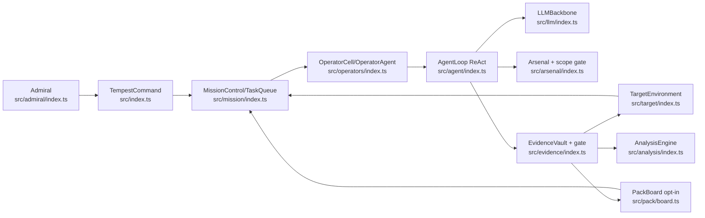
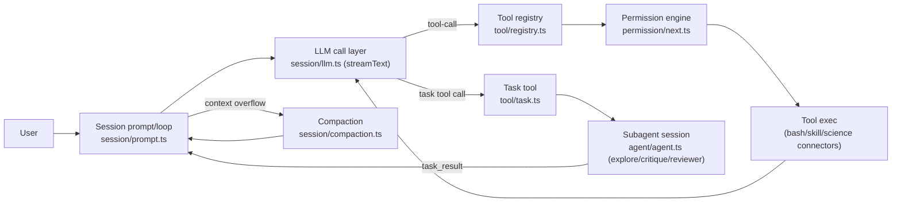
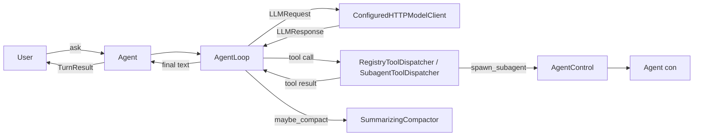
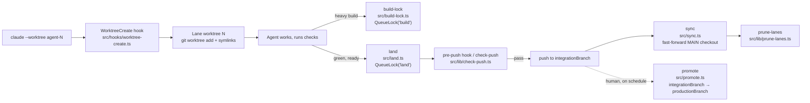

# Weekly Agentic AI Scan — 2026-07-07

**Phạm vi:** repos agentic AI được publish hoặc push mạnh trong 7 ngày qua (2026-06-30 → 2026-07-07), lọc qua GitHub Search API (`created:>2026-06-30`, nhiều biến thể từ khoá: `agentic`, `multi-agent`, `agent orchestration`, `topic:agentic-ai`, `"AI agent"`), sau đó loại awesome-list, tutorial, fork, và repo <500 LOC hoặc không có `/src`, `/docs`.

## Executive Summary

- **Phần lớn "hàng mới" tuần này là skill/config mỏng cho coding agent** (WeChat-markdown skill, token-efficiency skill, game-prototyping blocks...) — không có kiến trúc để đào sâu, đã bị loại khỏi shortlist.
- **4 repo lọt vào deep-dive trải đều 2 trục thú vị**: (1) "agent não" — T3MP3ST (multi-agent offensive-security với kỹ thuật decomposition né refusal) và openscience (research workbench với RSI/provenance DAG nhưng permission model gần như mở toang); (2) "agent hạ tầng" — agent-runtime (runtime core cực tối giản, zero-dependency, có subagent control-plane) và claude-code-merge-queue (giải bài toán concurrency-control cho nhiều Claude Code instance chạy song song bằng OS-level lock thay vì convention).
- **Red flag chung đáng chú ý**: 3/4 repo có khoảng cách rõ giữa tài liệu/marketing và code thật — T3MP3ST có whitepaper mô tả tool đã "RETIRED", openscience tự nhận "not sandboxed" nhưng vẫn default-allow mọi hành động, agent-runtime có ~4500 dòng test nhưng zero CI.

## Table of Contents

1. [elder-plinius/T3MP3ST](#elder-pliniust3mp3st) — multi-agent offensive-security meta-harness
2. [synthetic-sciences/openscience](#synthetic-sciencesopenscience) — AI workbench cho nghiên cứu khoa học
3. [easylink-ai-open/agent-runtime](#easylink-ai-openagent-runtime) — lõi agent runtime zero-dependency
4. [funador/claude-code-merge-queue](#funadorclaude-code-merge-queue) — merge queue cho nhiều Claude Code agent song song

---

## elder-plinius/T3MP3ST

**Repo:** [https://github.com/elder-plinius/T3MP3ST](https://github.com/elder-plinius/T3MP3ST)

### §1 — Quick Context

Multi-agent offensive-security framework biến AI coding agent thành "zero-day hunter" theo Cyber Kill Chain 8-operator. Stack: TypeScript 5.3 (Node 18+), Express API, MCP SDK, EventEmitter3; LLM đa nhà cung cấp (OpenRouter/Anthropic/OpenAI/xAI/Ollama, keyless qua Claude Code/Codex). Repo health: 2.735 stars, 645 forks, 51 commits, contributor count không xác định (GitHub API bị giới hạn), tạo 2026-07-02, push cuối 2026-07-06, có CI (`.github/workflows/ci.yml`) và bộ test Vitest + `verify-claims`.

### §2 — Architecture Deep-dive

**A. Component inventory:**
- `TempestCommand` (`src/index.ts`) — orchestrator trung tâm, EventEmitter, vòng lặp tick 1 giây.
- `Admiral` (`src/admiral/index.ts`) — conversational mission-intake, chỉ lập kế hoạch, không tự thực thi.
- `OpGeneral` (`src/general/index.ts`) — executor nhận Directive từ Admiral.
- `OperatorAgent`/`OperatorCell` (`src/operators/index.ts`) — pool agent, 8 archetype theo MITRE ATT&CK.
- `AgentLoop` (`src/agent/index.ts`) — vòng ReAct nối LLM với Arsenal.
- `LLMBackbone` (`src/llm/index.ts`) — adapter đa provider + fallback ladder.
- `Arsenal` (`src/arsenal/index.ts`) — tool registry + egress-scope gate (`scopeViolation`).
- `MissionControl`/`TaskQueue` (`src/mission/index.ts`) — hàng đợi task, Rules of Engagement, kill-chain phase.
- `TargetEnvironment` (`src/target/index.ts`) — mô hình attack-surface.
- `EvidenceVault` + `gateLiveFinding` (`src/evidence/index.ts`, `src/evidence/gate.ts`) — kho finding + gate xác thực provenance.
- `OpsecController` (`src/opsec/index.ts`) — detection risk, abort threshold.
- `PackBoard` (`src/pack/board.ts`) — blackboard chia sẻ giữa operator (opt-in swarm coordination).
- `DecompositionOrchestrator` (`src/orchestration/orchestrator.ts`) — mô hình "master builder": một model orchestrator giữ mục tiêu tấn công, chia nhỏ thành câu hỏi vô hại gửi cho worker model "mù" không biết ý đồ thật.
- `Benchmark` (`src/benchmark/index.ts`) — chấm điểm findings so ground-truth.

**B. Control flow:** Hierarchical supervisor→workers kết hợp ReAct + tick state machine: (1) Admiral hội thoại rút ra `MissionBrief` → `briefToDirective`; (2) `TempestCommand.start()` tạo mission qua `MissionControl`, tick mỗi giây seed task RECON; (3) tick khớp task idle-operator theo archetype, auto-spawn operator (tối đa 3/archetype); (4) mỗi operator chạy `AgentLoop.run()` — ReAct: LLM chọn tool (`chatWithTools`) → `Arsenal.execute()` → quan sát kết quả → lặp (tối đa 15 vòng/50K token); (5) finding ghi vào `EvidenceVault`, qua `gateLiveFinding`, đồng bộ ngược `TargetEnvironment`; nếu bật `T3MP3ST_SWARM_COORD`, finding tool-verified sinh task follow-up cho phase kế tiếp qua `PackBoard`; (6) hết task trong phase → `MissionControl.advancePhase()` tiến qua RECON→WEAPONIZE→…→ACTIONS, `AnalysisEngine` xuất report cuối.

**C. State & data flow:** Message format nội bộ AgentLoop: `LLMMessage[]` (role/content/toolCalls); state lưu in-memory (Map trong từng subsystem, không có DB bền vững). Quản lý context: cắt output tool (head+tail truncation), dedupe tool-call trùng lặp, "anti-stall nudge" sau 4 vòng không có finding mới.

**D. Tool/capability integration:** Tool đăng ký qua `arsenal.register()` schema có kiểu; gọi bằng native function-calling qua adapter (có fallback `parseTextToolCalls` cho model không hỗ trợ), CLI tool ngoài chạy qua `execFile` với allowlist nhị phân (không shell); mọi lệnh mạng bị chặn ngoài scope bởi `scopeViolation()`; tool nguy hiểm (metasploit/hydra) qua `ApprovalController` fail-safe DENY nếu chưa duyệt.

**E. Memory:** Không có long-term vector memory; chỉ short-term (message array trong 1 lần chạy) và shared board tạm thời per-mission (`PackBoard`, opt-in). README tự nhận "self-improvement loop" mới ở mức ghi log lessons (`scripts/lessons.mjs`), chưa feed lại vào planning.

**F. Model orchestration:** `LLMBackbone` chọn model theo role (opus cho orchestrator, sonnet/haiku khác); ladder fallback khi lỗi cứng hoặc refusal "mềm" (`isLikelyRefusal`) — có cơ chế đặc biệt `reframeWithAuthorizedContext` chèn lại ngữ cảnh ủy quyền trước khi fallback sang model khác.

**G. Observability & eval:** Sự kiện qua EventEmitter, SSE broadcast tới War Room UI; `bench/` chứa JSON verdict cho XBEN/Cybench/CVE-Zero…, `npm run verify-claims` tái tính từ artifact đã commit (transcript thô bị lược bỏ có chủ đích); `ctf/` chạy CTF thật qua Docker + flag verification; `docs/COGNITIVE_ARCHITECTURE.md` ghi lại lịch sử ablation prompt v1→v4.2.

**H. Extension points:** Thêm tool tuỳ biến qua `config.tools`; thêm adapter qua `TOOL_ADAPTERS` (`src/arsenal/catalog.ts`, gate bằng `T3MP3ST_FULL_ARSENAL`); đổi model qua `LLMConfig.provider`/endpoint local OpenAI-compatible; chưa có plugin API chính thức (roadmap).

### §3 — Architecture Diagram

### §4 — Verdict

Điểm đáng chú ý: (1) `DecompositionOrchestrator` — mô hình "master builder" tách mục tiêu tấn công cho một orchestrator model xử lý, còn worker model bị giữ "mù" chỉ thấy câu hỏi phân tích vô hại — một kỹ thuật né refusal đáng lưu ý về mặt kiến trúc; (2) `gateLiveFinding`/egress-scope gate là guardrail thật trong runtime, không chỉ ở tài liệu; (3) README/FEATURES.md rất trung thực khi tự dán nhãn phần lớn kill-chain (Exploiter/Infiltrator/Exfiltrator/Ghost) là "Experimental/scaffolding". Red flag: WHITEPAPER.md (v1.0) mô tả 9 "Pliny Specials" và MCP server ~83K dòng như đang hoạt động, nhưng code thực tế (`src/mcp-server.ts` chỉ 214 dòng) và FEATURES.md xác nhận các tool này đã "RETIRED" 2026-06 — tài liệu whitepaper lỗi thời nghiêm trọng so với code. `docs/AI_REDTEAM_TECHNIQUES.md` hệ thống hoá kỹ thuật jailbreak/prompt-injection cho mục đích red-team AI, có ràng buộc `SCOPE_AND_AUTHORIZATION` rõ ràng — không thấy dấu hiệu thiết kế cho tấn công diện rộng/không phân biệt mục tiêu. Cần đào sâu thêm: cơ chế Approval/OpGeneral thực tế khi chạy live, và độ tin cậy của benchmark khi transcript thô bị ẩn.

---

## synthetic-sciences/openscience

**Repo:** [https://github.com/synthetic-sciences/openscience](https://github.com/synthetic-sciences/openscience)

### §1 — Quick Context

AI workbench "làm nghiên cứu khoa học end-to-end": đọc literature, viết/chạy code, chạy thí nghiệm, viết báo cáo. Stack core: Bun + TypeScript (backend CLI/server dùng Hono + Vercel AI SDK `streamText`), SolidJS (frontend workspace), model-agnostic qua 20+ provider SDK bundled + models.dev catalog (75+ model). 862 sao, 114 commit, contributors: không xác định (GitHub API bị giới hạn), tạo 2026-07-03, push gần nhất 2026-07-07 — CI/CD dày (`ci.yml`, `e2e.yml`, `codeql.yml`, `scorecard.yml`, `gitleaks.yml`).

### §2 — Architecture Deep-dive

**A. Component inventory:**
- `Agent registry` (`backend/cli/src/agent/agent.ts`) — định nghĩa các agent: primary `research` (default), specialist `biology`/`physics`/`ml`, mode `plan` (read-only), subagent ẩn `task`/`explore`/`literature-review`/`critique`/`physics-critique`/`reviewer`/`write`, system agent `compaction`/`title`.
- `Session prompt/loop` (`backend/cli/src/session/prompt.ts`, ~2067 dòng) — vòng lặp message, injection prompt theo agent, loop-exit gate.
- `LLM call layer` (`backend/cli/src/session/llm.ts`) — gọi `streamText` (Vercel AI SDK) với native function-calling.
- `Tool registry` (`backend/cli/src/tool/registry.ts`) — tập hợp tool built-in + plugin + lọc theo agent/model.
- `Task tool` (`backend/cli/src/tool/task.ts`) — spawn subagent trong session con (fresh context).
- `Skill system` (`backend/cli/src/skill/skill.ts`) — resolve skill bundle theo tên, nhiều nguồn.
- `Compaction` (`backend/cli/src/session/compaction.ts`) — tóm tắt + prune context khi overflow.
- `Provenance DAG store` (`backend/cli/src/science/provenance/store.ts`, `review.ts`) — lineage claim/artifact và reviewer findings.
- `RSI (trajectory/critic/distill)` (`backend/cli/src/session/rsi/*.ts`) — học kỹ năng mới từ session cũ.
- `Permission engine` (`backend/cli/src/permission/next.ts`) — ruleset last-match-wins, default `"*": allow` (`agent.ts:55-74`).
- `Provider router` (`backend/cli/src/provider/provider.ts`) — chọn SDK provider theo model.
- `MCP client` (`backend/cli/src/mcp/index.ts`) — kết nối MCP server (local/remote).
- `Science connectors` (`backend/cli/src/science/connectors/*`) — UniProt, PDB, ChEMBL, arXiv, v.v.

**B. Control flow pattern:** ReAct-loop bên trong mỗi agent, kết hợp hierarchical supervisor→worker (pull-based, không ép buộc) qua tool `task`. Happy path: (1) user gửi prompt → chọn agent `research`, ghép prompt 2 lớp (provider-level + agent-level); (2) `llm.ts` gọi `streamText` với tool schema (zod), model trả tool-call; (3) `ToolRegistry`/`permission/next.ts` kiểm tra rule rồi thực thi tool (bash/edit/skill/science connector); (4) agent có thể gọi tool `task` để tạo session con (explore/critique/reviewer) chạy loop riêng, trả về kết quả nén; (5) khi gần vượt context, `SessionCompaction.isOverflow` kích hoạt agent `compaction` tóm tắt hoặc `prune()` xoá output tool cũ; (6) finalize — critique/reviewer subagent chỉ được gọi nếu prompt yêu cầu (advisory, không có code gate bắt buộc), sau đó RSI pipeline chạy nền để chưng cất skill mới.

**C. State & data flow:** Message dạng `MessageV2` (parts: text/tool/...) lưu trên đĩa; provenance DAG lưu node/edge content-addressed cho claim/artifact/review; quản lý context bằng prune (xoá output tool cũ, giữ RLM state) + compaction tóm tắt bằng agent riêng khi token vượt ngưỡng model.

**D. Tool/capability integration:** Native function-calling qua Vercel AI SDK (`streamText`, tool schema zod) — không phải JSON parsing thủ công. Tool nạp từ built-in (`tool/registry.ts`), plugin (`tooling/plugin`), và MCP server (`mcp/index.ts`, cấu hình trong `.openscience/openscience.jsonc`). Không có sandbox: theo `docs/plans/10-agent-sandboxing.md`, bash chạy cùng uid/gid, không timeout mặc định, default permission policy `"*": allow` — permission chỉ là "ask" hiển thị, không phải isolation boundary (README cũng ghi rõ "The agent is not sandboxed").

**E. Memory architecture:** Ngắn hạn = lịch sử message + prune/compaction; dài hạn = RSI — skill học được từ trajectory cũ, chưng cất bằng heuristic quyết định (`rsi/critic.ts`) rồi lưu như skill mới (đường LLM-critic là dead code); ngoài ra provenance DAG đóng vai trò bộ nhớ lineage bền vững cho claim/artifact.

**F. Model orchestration:** Model-agnostic thật sự — 20 provider SDK bundle (Anthropic, OpenAI, Google, Bedrock, Azure, xAI, Mistral, Groq, DeepInfra, Cerebras, Cohere, OpenRouter, TogetherAI, Perplexity, Vercel, GitLab, GitHub Copilot...) + catalog models.dev; routing per-request (`provider.ts`). Subagent mặc định dùng lại model của agent gọi nó ("fresh context, not fresh model"). Không thấy cơ chế fallback/parallel batching rõ ràng ngoài `session/retry.ts`.

**G. Observability & eval:** Event bus (`bus/bus-event.ts`) phát sự kiện (vd `session.compacted`), tool-call streaming qua SSE tới UI; provenance DAG là audit trail cho claim/review; RSI critic chấm điểm trajectory để quyết định distill skill — không thấy replay/eval harness độc lập.

**H. Extension points:** Hệ skill rõ ràng qua `.openscience/` — `agent/*.md` (custom agent prompt), `command/*.md` (slash command), `skill/<name>/SKILL.md` (frontmatter name/description + body), `openscience.jsonc` (provider, mcp, tool toggle, plugin list). Plugin runtime (`tooling/plugin`) cho phép thêm tool/provider/hook (`tool.execute.before/after`, `chat.params`, `experimental.session.compacting`...). SDK TypeScript (`tooling/sdk/js`) sinh từ OpenAPI contract của server.

### §3 — Architecture Diagram

### §4 — Verdict

Điểm đáng chú ý: kiến trúc "actor-critic" khoa học thực thụ (provenance DAG content-addressed + reviewer subagent lần theo claim/citation), RSI tự chưng cất skill từ session cũ, và dual-layer prompt (provider-level + agent-level) tách biệt rõ ràng. Red flag nghiêm trọng: README tự thừa nhận "not sandboxed", nhưng `docs/plans/10` cho thấy default permission policy thực chất là `"*": allow` — mọi bash/edit/write trong project chạy không hỏi, MCP server nhận full `process.env` (leak cả wallet key); "mandatory" critique/reviewer gate chỉ là văn bản prompt, không có code path bắt buộc — model có thể bỏ qua review mà vẫn finalize. Câu hỏi cần đào sâu: mức độ thực thi thật của permission-ask trên UI, liệu Atlas managed platform (closed-source) có kiểm soát gì thêm về an toàn không, và roadmap sandbox (Phase 1-3 trong `docs/plans/10`) đã triển khai tới đâu tính đến 2026-07-07.

---

## easylink-ai-open/agent-runtime

**Repo:** [https://github.com/easylink-ai-open/agent-runtime](https://github.com/easylink-ai-open/agent-runtime)

### §1 — Quick Context

Lõi agent runtime độc lập: agent loop, kiểu LLM trung lập (neutral) và protocol mở rộng, tách biệt hoàn toàn khỏi sản phẩm. Stack: Python 100%, zero third-party dependencies (`pyproject.toml`: `dependencies = []`), tự viết HTTP client bằng `urllib` cho OpenAI và Anthropic. Repo health: 181 sao, 9 commits, contributors không xác định (GitHub API bị giới hạn), tạo và push lần cuối cùng ngày 2026-07-01 (rất mới), có thư mục `tests/` với ~4500 dòng test nhưng **không có CI workflow** (`.github/workflows` không tồn tại).

### §2 — Architecture Deep-dive

**A. Component inventory:**
- `AgentLoop` (`src/agent_runtime/loop.py`) — vòng lặp thuần orchestration: request→tool call→lặp→finalize, xử lý streaming, retry, tool-error containment, HITL pause, interruption.
- `Agent` (`src/agent_runtime/core.py`) — entry point công khai, lắp ráp `AgentLoop` từ các provider được inject; `ask()`/`continue_turn()`.
- Protocols (`src/agent_runtime/protocols.py`) — `ModelClient`, `ToolDispatcher`, `SystemPromptProvider`, `CacheStrategy` cùng default no-op.
- `SummarizingCompactor`/`NoopCompactor` (`src/agent_runtime/context/compaction.py`) — cơ chế compaction.
- `PromptCacheStrategy` (`src/agent_runtime/cache.py`) — định hình request/parse cache usage cho OpenAI & Anthropic.
- `ToolRegistry`/`RegistryToolDispatcher` (`src/agent_runtime/tools.py`) — đăng ký và dispatch tool cục bộ.
- Collaboration mechanism (`src/agent_runtime/collaboration.py`) — kiểm tra quyền tool + inject instruction.
- `AgentControl` (`src/agent_runtime/subagents/control.py`) — control-plane quản lý cây subagent (spawn/run/send_message/wait/close).
- `SubagentToolDispatcher` (`src/agent_runtime/subagents/dispatcher.py`) — expose tool `spawn_subagent`, `run_subagent`, `send_to_subagent`, `send_to_parent`, v.v. cho model.
- `InMemoryMailbox`/`InMemoryAgentStore`/`SynchronousAgentRunner`/`ThreadPoolAgentRunner` (`src/agent_runtime/subagents/{mailbox,stores,runners}.py`) — hạ tầng in-memory mặc định cho messaging, state, thực thi.
- `ConfiguredHTTPModelClient` (`src/agent_runtime/llm/clients.py`) — HTTP client thuần stdlib cho OpenAI/Anthropic, gồm SSE stream collector.
- `LLMConfig` (`src/agent_runtime/llm/config.py`) — config chọn provider API + model.

**B. Control flow pattern:** ReAct-style tool loop, có lớp hierarchical supervisor→workers chồng lên qua subagent. Happy path: (1) `Agent.ask()` thêm user message; (2) `AgentLoop` build `LLMRequest`, kiểm tra compaction; (3) gọi `ModelClient.complete()`; (4) nếu có tool call → dispatch qua `ToolDispatcher` (có thể là `spawn_subagent` tạo agent con qua `AgentControl`), lưu tool result; (5) lặp lại tới khi không còn tool call hoặc hết budget; (6) trả `TurnResult`.

**C. State & data flow:** Message là dataclass `Message` có `parts` (không phải dict thô); state là `list[Message]` giữ trong bộ nhớ `Agent`, không có tầng persistence (thiết kế rõ ràng: `TurnResult` chỉ mang messages+metadata). Compaction: giữ system message đầu + tail theo ngân sách token, tóm tắt phần giữa qua `ModelClient` injected, dọn các tool-result mồ côi.

**D. Tool/capability integration:** Đăng ký qua `ToolRegistry.register` với JSON-schema + phân loại effect (`read_only/cache_write/repo_mutating/external_mutating/agent_control`); model gọi bằng native function-calling (arguments là dict có cấu trúc, không parse JSON thủ công). Không sandbox ở kernel — lỗi tool được bắt và trả về dạng JSON `{"ok": false, ...}`.

**E. Memory architecture:** Chỉ short-term (danh sách message + compaction summarization); không có retrieval/long-term store (được ghi rõ là trách nhiệm sản phẩm, không phải runtime).

**F. Model orchestration:** `LLMConfig` chọn 1 trong 2 API (`openai-chat-completions`, `anthropic-messages`), có alias normalize, xác nhận qua `test_llm_config_clients.py`. Subagent có thể override model theo vai trò (`SubagentConfig.model`); `ThreadPoolAgentRunner` cho phép chạy song song nhiều subagent.

**G. Observability & eval:** Không có module logging/tracing (không tìm thấy `logging`/`trace`/`telemetry`); chỉ có `stream_callback`, `tool_callback`, và `AgentHooks` để sản phẩm tự gắn observability. Không có eval/replay harness — không xác định từ code.

**H. Extension points:** Mọi thứ inject qua constructor `Agent` (llm_config/model_client, tool_dispatcher, hooks, compactor, collaboration_mode...); thêm provider mới = viết `llm/<name>.py`; thêm agent con tuỳ biến = implement `SubagentFactory`.

### §3 — Architecture Diagram

### §4 — Verdict

Điểm đáng chú ý: kỷ luật kiến trúc rất cao cho repo mới (invariant "no product dependency", versioning discipline yêu cầu bump version + git tag khi đổi public surface); HTTP client tự viết bằng stdlib (không phụ thuộc SDK OpenAI/Anthropic) kể cả SSE streaming; control-plane subagent khá tinh vi (mailbox, giới hạn depth/children, history policy riêng cho context con) hiếm gặp ở repo non trẻ. Red flag: hoàn toàn không có CI dù có ~4500 dòng test — chất lượng chỉ được đảm bảo thủ công; không sandbox/validate tool ở kernel; repo chỉ vài ngày tuổi (tạo và push cùng ngày) nên chưa có track record. Câu hỏi mở: mối quan hệ với các dự án liên quan được nhắc trong `AGENTS.md` (vd "agent-cloud") là gì, và 181 sao đến từ đâu khi repo mới tạo — cần theo dõi thêm để loại trừ khả năng star-seeding.

---

## funador/claude-code-merge-queue

**Repo:** [https://github.com/funador/claude-code-merge-queue](https://github.com/funador/claude-code-merge-queue)

### §1 — Quick Context

Local, zero-cost merge queue serialize việc build/land/promote cho nhiều Claude Code agent chạy song song trong các git worktree riêng biệt. Tech stack: TypeScript 5.x thuần (Node ≥18), zero runtime dependencies, chỉ dùng `node:fs`/`node:child_process`/`node:crypto`, không phụ thuộc bất kỳ LLM model nào — đây là công cụ điều phối/concurrency-control, không phải reasoning agent. Repo health: 295 stars, contributors không xác định (GitHub API bị giới hạn), tạo 2026-07-02, push gần nhất 2026-07-06 (rất mới, hoạt động dồn dập), có CI (`ci.yml`, `publish.yml`) và bộ test khá rộng (12 file test, ~1800 dòng, gồm cả test spawn multi-process thật).

### §2 — Architecture Deep-dive

**A. Component inventory:**
- `QueueLock` / `createQueueLock` (`src/lib/queue-lock.ts`) — mutex FIFO cross-process, cross-worktree, nền tảng cho mọi lệnh serialize khác.
- `buildLock` (`src/build-lock.ts`) — bọc một lệnh build tuỳ ý để chạy tuần tự machine-wide qua `QueueLock("build")`.
- `land` (`src/land.ts`) — pipeline duy nhất được phép: fetch → rebase → push lên `integrationBranch`, qua `QueueLock("land")`.
- `sync` (`src/sync.ts`) — fast-forward MAIN checkout sau khi land, tự `npm/pnpm/yarn/bun install` nếu lockfile đổi.
- `promote` (`src/promote.ts`) — fast-forward `productionBranch` từ `integrationBranch`, human-only, không tự động hoá.
- `preview` (`src/preview.ts`) — rsync working tree (kể cả uncommitted) của một lane lên MAIN checkout để xem dev-server preview không cần build.
- `WorktreeCreate hook` (`src/hooks/worktree-create.ts`) — plug vào cơ chế native worktree isolation của Claude Code, gán "lane" số thứ tự thấp nhất còn trống, symlink `node_modules`/`.env`.
- `prune-lanes` (`src/lib/prune-lanes.ts`) — dọn worktree lane đã land xong (ancestor check + `lsof` liveness check), báo cáo lane "orphaned".
- `check-push` (`src/lib/check-push.ts`) + `hooks/pre-push` — pre-push hook chặn push trực tiếp vào integration/production/protected branch, chạy `checkCommand` (lint/test/build) trước khi cho landing qua.
- `ephemeral.ts` / `ClaimRegistry` (`src/lib/ephemeral.ts`) — extension point cho tài nguyên test dùng-một-lần (DB nhánh, bucket tạm) với cùng cơ chế claim-by-PID.
- CLI entrypoint (`src/bin/claude-code-merge-queue.ts`) — dispatch `init/land/sync/promote/preview/prune/build-lock/hook/check-push`.
- `config.ts` (`src/lib/config.ts`) — load/validate `claude-code-merge-queue.config.mjs`, nguồn cấu hình duy nhất cho mọi lệnh.
- `claude-md-snippet.ts` (`src/lib/claude-md-snippet.ts`) — sinh đoạn hướng dẫn CLAUDE.md để agent tự chạy `land` mà không cần hỏi người.

**B. Control flow pattern:** Lane-based worktree isolation (do Claude Code native cung cấp) + serialized FIFO merge queue (do tool này cung cấp). Happy path:
1. `claude --worktree <name>` khởi tạo session → Claude Code gọi `WorktreeCreate` hook → `createLane()` claim lane số thấp nhất còn trống bằng `git worktree add` (atomicity dựa vào chính git từ chối path đã tồn tại), symlink `node_modules`/`.env`.
2. Agent code/test trong lane riêng; nếu cần build nặng, gọi `claude-code-merge-queue build-lock -- <cmd>` để xếp hàng build machine-wide.
3. Khi check xanh, agent tự chạy `claude-code-merge-queue land` (CLAUDE.md ra lệnh làm việc này không cần hỏi) → `land.ts` xin `QueueLock("land")`.
4. Có lock: fetch `origin/integrationBranch`, `git rebase`, nếu conflict thì abort sạch và trả về hàng đợi sau khi fix; nếu thành công thì push với biến môi trường đặc biệt (chìa khoá vượt qua pre-push hook).
5. `land` gọi `sync()` in-process để fast-forward MAIN checkout (dev server thấy code mới ngay), rồi `pruneLandedLanes` dọn các lane sibling đã land xong.
6. Con người chạy `claude-code-merge-queue promote` (không tự động hoá) để fast-forward `productionBranch` khi sẵn sàng ship.

**C. State & data flow:** Toàn bộ state là file-based trong OS temp dir (khoá theo git common-dir hash nên mọi worktree của cùng repo chia sẻ một hàng đợi, còn repo khác nhau không đụng nhau). Lock file dùng hard-link atomic (`linkSync`, fail nếu đã tồn tại) làm cơ chế mutex; ticket FIFO là file riêng theo `timestamp-pid`. Không có in-memory state chia sẻ giữa process — mỗi process con tự đọc/ghi file, sống sót qua crash nhờ kiểm tra liveness của PID (`process.kill(pid, 0)`) thay vì timeout. Vị trí lane mã hoá trực tiếp trong tên thư mục worktree, không cần bookkeeping riêng.

**D. Tool/capability integration:** Tích hợp Claude Code qua đúng một cơ chế chính thức — `WorktreeCreate` hook trong `.claude/settings.json` (`hooks/claude-settings.example.json`) gọi `npx claude-code-merge-queue hook worktree-create`, nhận JSON qua stdin, in absolute path worktree ra stdout và exit 0 (hoặc stderr + exit non-zero để chặn tạo worktree). Ngoài ra, `CLAUDE.md` snippet là kênh tích hợp thứ hai — không phải hook kỹ thuật mà là "standing instructions" Claude Code đọc mỗi session, ra lệnh agent tự chạy `land` khi xanh mà không cần người nhắc.

**E. Memory architecture:** Không áp dụng — không có bộ nhớ hội thoại/embedding nào, chỉ có file-based lock/ticket/manifest tồn tại xuyên process.

**F. Model orchestration:** Không áp dụng — xác nhận từ code: không có lời gọi LLM API nào trong toàn bộ `src/`; toàn bộ logic là git/fs/process operations thuần túy. "Orchestrate" ở đây là điều phối tiến trình OS, không phải điều phối model.

**G. Observability & eval:** Logging qua console với màu ANSI báo trạng thái hàng đợi (`[land-queue]`, `[build-queue]`), báo lane "orphaned" khi không ai land. Có capability dry-run/preview thực sự: `preview` rsync working tree một lane lên MAIN checkout (không build, không deploy) để xem trực tiếp, có manifest ghi lại các path mới tạo để `--restore` gỡ đúng chính xác. Test coverage tốt: `test/queue-lock.test.ts` spawn 4 process thật để chứng minh mutual exclusion không overlap, và test crash-safety bằng `kill -9` một holder rồi xác nhận process kế tiếp vẫn acquire được lock.

**H. Extension points:** Cấu hình tập trung một file `claude-code-merge-queue.config.mjs` với các field: `branchPrefix`, `worktreeSuffix`, `portBase`, `integrationBranch`, `productionBranch` (null = mô hình một tầng), `protectedBranches`, `regenerableFiles`, `symlinks`, `buildOutputDirs`, `checkCommand`/`checksRequired`. Config sai fail loud liệt kê hết lỗi ngay khi load. Extension point thứ hai là `EphemeralResourceProvider<T>` (`src/lib/ephemeral.ts`) — interface `create/destroy/destroyOrphan` để cắm tài nguyên test dùng-chung (DB nhánh, container Docker...) vào cùng pattern claim-by-PID.

### §3 — Architecture Diagram

### §4 — Verdict

Điểm mới đáng chú ý: thay vì "dạy" agent phối hợp bằng convention (dễ vỡ khi agent hoặc người vội vàng bỏ qua), tool này biến "va chạm" thành bất khả thi bằng cơ chế OS-level (hard-link atomic lock, PID-liveness thay timeout) và chặn cứng ở tầng git (pre-push hook từ chối push trực tiếp trừ khi có biến môi trường đặc biệt do chính `land` set). Việc mọi lock/lane/ephemeral-resource đều chia sẻ chung một pattern "claim → tag PID → liveness quyết định stale" là thiết kế nhất quán, hiếm gặp trong các tool merge-queue thông thường. Hạn chế/red flag: chỉ chạy trên một máy (queue nằm ở local temp, README tự thừa nhận "one machine, not a fleet"); không phải security boundary (agent có shell access luôn có thể `git push --no-verify` hoặc xoá hook); FIFO lock giữ trong suốt thời gian `checkCommand` chạy nên checkCommand chậm là trần thông lượng cứng; phụ thuộc `lsof`/`rsync` có sẵn trên PATH; hook `WorktreeCreate` là tính năng rất mới của Claude Code nên bề mặt tích hợp còn non. Câu hỏi cần đào sâu thêm: cơ chế này scale ra sao với >4 lane đồng thời trong thực tế, và liệu polling 200ms trong `queue-lock.ts` có gây overhead đáng kể khi số lane lớn.
