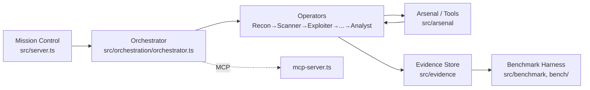
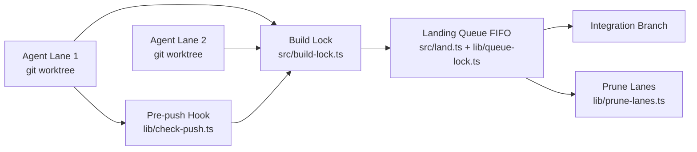
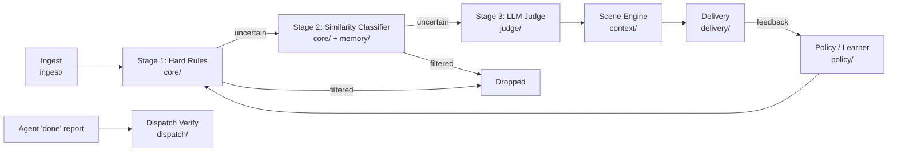
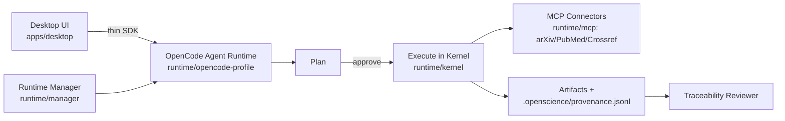

# Weekly Agentic AI Scan — 2026-07-08

**Nguồn dữ liệu:** GitHub search API (`created:>2026-07-01 stars:>200`, mở rộng `>100` cho multi-agent), lọc theo tiêu chí novel architecture / eval methodology / production engineering. Không dùng `gh` CLI (không có quyền) — toàn bộ dữ liệu lấy qua GitHub REST API và trang repo công khai.

## Executive Summary

- Tuần này nổi bật nhất là **T3MP3ST** — multi-agent offensive-security harness với eval methodology hiếm thấy ở tầng repo mới (benchmark tái lập được từ artifact JSON, không tự công bố số liệu).
- Xu hướng rõ: các repo agentic chất lượng cao tuần này thiên về **meta-tooling cho chính coding agents** (merge queue điều phối nhiều Claude Code agent, notification-orchestrator lọc noise từ agent) hơn là "thêm một agent framework mới".
- **open-science** đáng chú ý vì kiến trúc provenance/reproducibility (plan→approve→execute→artifact→review) xây trên OpenCode runtime, khác hẳn pattern chat-wrapper thường thấy.

## Table of Contents
- [T3MP3ST — multi-agent offensive-security meta-harness](#t3mp3st)
- [claude-code-merge-queue — điều phối nhiều Claude Code agent song song](#claude-code-merge-queue)
- [agent-chief — notification worthiness orchestrator](#agent-chief)
- [open-science — reproducible AI research workbench](#open-science)

---

## T3MP3ST
**Repo:** https://github.com/elder-plinius/T3MP3ST

### §1 — Quick Context
Biến AI coding agent thành pipeline săn lỗ hổng tự động theo kill-chain MITRE ATT&CK. Stack: Node.js/TypeScript, MCP server, tích hợp OpenRouter/Anthropic/OpenAI/Ollama/vLLM làm backend LLM, 35–83 tool tấn công (nmap, DNS, HTTP fingerprinting...). Repo health: 3.391 stars, tạo 2026-07-02, push gần nhất 2026-07-07, có CI (`.github/workflows`) nhưng **không có** thư mục test riêng — kiểm chứng dựa vào benchmark script (`npm run verify-claims`) thay vì unit test.

*Lưu ý bối cảnh:* đây là công cụ offensive-security công khai, được phân tích ở đây thuần vì kiến trúc orchestration và eval methodology, không nhằm mục đích khai thác.

### §2 — Architecture Deep-Dive

**A. Component inventory**
- `Orchestrator` (`src/orchestration/orchestrator.ts`) — engine điều phối trung tâm, kết hợp với `context-pack.ts` để đóng gói context truyền giữa các operator.
- `Operators` (`src/operators/`, và các thư mục con chuyên biệt `src/recon`, `src/arsenal`, `src/mission`, `src/opsec`) — 8 "operator" theo kill-chain: Recon, Scanner, Exploiter, Infiltrator, Exfiltrator, Ghost, Coordinator, Analyst (mô tả trong README/WHITEPAPER.md, không thấy 8 file riêng biệt trong operators/ — có thể logic nằm rải trong `mission/` và `arsenal/`, **không xác định chính xác từ cấu trúc thư mục** file-per-operator).
- `Arsenal / Tool registry` (`src/arsenal/`) — kho 35–83 tool bảo mật thực (nmap, scanner...).
- `MCP server` (`src/mcp-server.ts`) — expose framework như MCP tool cho agent ngoài.
- `Mission control / HTTP API` (`src/server.ts`, `src/mission/`) — giao diện điều khiển nhiệm vụ.
- `Comms / Redaction` (`src/comms/`, `src/redact.ts`) — xử lý giao tiếp và che dữ liệu nhạy cảm trước khi log/export.
- `Benchmark harness` (`src/benchmark/`, `bench/`) — chạy và tái lập XBEN/Cybench/CVE-Zero.
- `Evidence store` (`src/evidence/`) — lưu artifact bằng chứng cho từng bước tấn công.

**B. Control flow — ReAct-style, điều phối theo kill-chain tuyến tính**
README mô tả mỗi operator chạy "the same real, tool-backed ReAct loop". Happy path suy ra từ cấu trúc:
1. Mission control nhận target qua `server.ts`/CLI, tạo context ban đầu (`context-pack.ts`).
2. `Orchestrator` giao nhiệm vụ tuần tự cho operator theo pha kill-chain (Recon → Scanner → Exploiter → ... → Analyst).
3. Mỗi operator chạy vòng lặp think→act→observe: gọi LLM để chọn tool trong `arsenal/`, thực thi tool thật, quan sát kết quả.
4. Kết quả/evidence ghi vào `src/evidence/`, redact dữ liệu nhạy cảm qua `redact.ts`.
5. Orchestrator truyền context tích lũy sang operator kế tiếp cho đến khi đến Analyst.
6. Analyst tổng hợp báo cáo cuối; đồng thời `bench/` có thể chạy song song để tái lập điểm benchmark.

**C. State & data flow**
- Context giữa operator được đóng gói bởi `context-pack.ts` — có `types.ts` riêng nên khả năng là typed schema chứ không phải string thô, nhưng schema cụ thể không đọc được từ tên file (không xác định từ code).
- Không thấy state store ngoài (Redis/DB) trong danh sách thư mục — có vẻ state chủ yếu in-memory/file-based (`evidence/`).

**D. Tool integration**
- Tool thật (nmap, scanner...) nằm trong `arsenal/`, gọi qua MCP hoặc trực tiếp — README nhấn mạnh "tool-backed" nghĩa là không stub.
- Có MCP server riêng (`mcp-server.ts`) để expose ra ngoài, đồng thời framework tự nó cũng dùng MCP để nhận lệnh.

**E. Memory** — không xác định từ code (không có thư mục `memory/` riêng).

**F. Model orchestration** — hỗ trợ nhiều backend LLM đồng thời (OpenRouter/Venice/Anthropic/OpenAI/local); không thấy phân vai model theo operator trong cấu trúc thư mục — không xác định rõ role-based model routing.

**G. Observability & eval** — điểm mạnh nhất của repo: `npm run verify-claims` tái tính điểm từ **committed JSON artifacts** thay vì số tự báo cáo. Benchmark cụ thể: XBEN 90.1% pass@1 (104 challenges), Cybench 23/40 CTF không gợi ý, CVE-Zero 8/10 khớp chính xác file/line/CWE trên lỗ hổng sau ngày cutoff của model.

**H. Extension points** — thêm operator/tool mới qua `arsenal/`; MCP server cho phép cắm framework vào agent host khác.

### §3 — Architecture Diagram

### §4 — Verdict
**Novel/đáng học:** eval methodology — verdict tái tính từ artifact JSON commit sẵn, không tin vào self-reported number, đây là pattern hiếm và đáng nhân rộng cho mọi agent benchmark claim. Kill-chain 8-operator là cách chia nhỏ ReAct loop theo domain rất rõ ràng, dễ audit từng pha.
**Red flags:** không có thư mục test riêng (dựa hoàn toàn vào benchmark thay vì unit test); cấu trúc "8 operator" mô tả trong docs nhưng không map 1-1 rõ ràng sang file trong `operators/` (chỉ có `index.ts`) — cần đọc sâu `mission/`/`arsenal/` để xác nhận operator thực sự tách file hay chỉ là logic tham số hóa.
**Open questions:** operator logic có thực sự tách biệt hay chỉ là prompt template khác nhau trong cùng loop? Redaction (`redact.ts`) áp dụng ở tầng nào trước khi gửi lên LLM ngoài?

---

## claude-code-merge-queue
**Repo:** https://github.com/funador/claude-code-merge-queue

### §1 — Quick Context
Merge queue cục bộ giúp nhiều Claude Code agent chạy song song không đụng nhau khi cùng sửa một codebase. Stack: TypeScript 5.x, Node ≥18, **zero runtime dependency**. Repo health: 295 stars, tạo 2026-07-02, push 2026-07-06, có CI + thư mục `test/` riêng, license MIT.

### §2 — Architecture Deep-Dive

**A. Component inventory**
- `Worktree lane` — mỗi agent chạy trong git worktree riêng qua flag `--worktree` gốc của Claude Code (cơ chế của Claude Code, không phải code trong repo này).
- `Build lock` (`src/build-lock.ts`) — khóa build machine-wide theo process ID để serialize build giữa các lane.
- `Landing queue` (`src/land.ts`, `src/lib/queue-lock.ts`, `src/lib/lane-port.ts`) — FIFO queue đảm bảo một lane land tại một thời điểm.
- `Sync/Promote/Preview` (`src/sync.ts`, `src/promote.ts`, `src/preview.ts`) — rebase lane lên integration branch, promote code, preview thay đổi.
- `Pre-push hook` (`src/lib/check-push.ts`, `src/lib/wire-hooks.ts`, thư mục `hooks/`) — chặn push trực tiếp, ép chạy check trước khi land.
- `Ephemeral resource manager` (`src/lib/ephemeral.ts`, `src/lib/prune-lanes.ts`) — cấp DB/resource test cô lập theo lane và tự dọn dẹp.
- `Command validator` (`src/lib/check-command.ts`) — kiểm tra lệnh trước khi thực thi.
- `Config` (`src/lib/config.ts`), `Claude MD snippet generator` (`src/lib/claude-md-snippet.ts`) — sinh hướng dẫn cho CLAUDE.md.

**B. Control flow — State machine / queue, không phải agent-loop**
Đây không phải ReAct hay planner-executor của một agent, mà là **hạ tầng điều phối multi-agent ở tầng git/CI**:
1. Agent khởi tạo lane trong worktree riêng (qua Claude Code `--worktree`).
2. Agent code/test cục bộ; `check-command.ts`/hooks chặn thao tác không hợp lệ.
3. Khi agent muốn land, `build-lock.ts` serialize build machine-wide (một build tại một thời điểm).
4. `land.ts` đẩy lane vào FIFO landing queue (`queue-lock.ts`) — rebase + push lên integration branch, đảm bảo không hai lane push cùng lúc.
5. Sau khi land, `prune-lanes.ts` dọn dẹp resource ephemeral (DB test...) của lane đó.
6. `sync.ts`/`promote.ts` đồng bộ lane khác hoặc promote kết quả lên nhánh chính.

**C. State & data flow**
- State lưu qua **file lock + git ref**, không dùng DB ngoài — phù hợp triết lý zero-dependency.
- Message giữa các thành phần chủ yếu là **git operation + process lock**, không phải message LLM — đây là hạ tầng orchestration thuần túy (không có LLM call nào trong core flow theo cấu trúc thư mục).

**D. Tool/capability integration** — không áp dụng theo nghĩa function-calling; "tool" ở đây là git/build/test command, validate qua `check-command.ts`.

**E. Memory** — không có, không xác định (không cần vì đây không phải conversational agent).

**F. Model orchestration** — không xác định từ code, repo không gọi LLM trực tiếp; nó điều phối các *tiến trình* Claude Code agent (đã có LLM riêng) chứ không tự orchestrate model.

**G. Observability & eval** — README không đề cập tracing/eval framework; đảm bảo đúng qua git/process lock mechanics và `test/` folder (unit test cho lock/queue logic).

**H. Extension points** — cấu hình qua `config.ts`; hỗ trợ npm/pnpm/yarn/bun; hooks tùy biến trong `hooks/`.

### §3 — Architecture Diagram

### §4 — Verdict
**Novel/đáng học:** đây không phải "agent framework" mà là **hạ tầng vận hành cho nhiều agent** — giải quyết đúng bài toán thực tế khi chạy nhiều Claude Code instance song song trên cùng repo (race condition ở build/git level, không phải ở tầng reasoning). Zero-dependency + FIFO landing queue là thiết kế gọn, dễ audit.
**Red flags:** phụ thuộc hoàn toàn vào flag `--worktree` của Claude Code — coupling chặt với một agent CLI cụ thể, khó tái sử dụng cho agent khác. Không có observability/metrics.
**Open questions:** build lock dùng process-ID có an toàn khi machine restart giữa chừng không? Cơ chế `check-command.ts` validate command theo whitelist hay heuristic — cần đọc code thực để biết mức độ sandbox.

---

## agent-chief
**Repo:** https://github.com/SmileLikeYe/agent-chief

### §1 — Quick Context
Bộ lọc/định tuyến thông báo cho agent và hệ thống khác — quyết định cái gì đáng làm phiền người dùng. Stack: Python 3.12+, FastAPI (`/v1/events` webhook), SQLite, LLM pluggable (Ollama/DeepSeek/Anthropic/OpenAI), MCP. Repo health: 241 stars, tạo 2026-07-04, push 2026-07-08 (rất active), có CI + `tests/` folder, MIT license.

### §2 — Architecture Deep-Dive

**A. Component inventory**
- `Core brain loop / 3-stage scorer` (`core/`) — vòng lặp quyết định chính: hard rules → similarity classifier → LLM judge.
- `Judge` (`judge/`) — pluggable LLM backend, template quyết định, cost tracking.
- `Dispatch` (`dispatch/`) — thực thi hành động outbound và **verification layer**: "Agents report 'done'; Chief checks" — fail-closed nếu không verify được.
- `Memory` (`memory/`) — association, curation, expiration của event/fact.
- `Policy` (`policy/`) — chưng cất preference học được thành `POLICY.md` con người đọc/sửa được.
- `Ingest` (`ingest/`) — nhận event từ nguồn ngoài (agent, CI/CD, RSS, heartbeat, Composio webhook).
- `Context` (`context/`) — Scene engine: pluggable provider cho clock/calendar/focus state để đổi ngưỡng interrupt theo ngữ cảnh (sleeping/deep work/meeting/commute).
- `Eval` (`eval/`) — golden dataset, regression test, cohort benchmark.
- `Delivery` (`delivery/`) — kênh gửi thông báo: console, terminal, desktop, Telegram (có feedback button để agen_learner học).
- `CLI` (`cli/`) — bao gồm lệnh `chief trace` replay quyết định.

**B. Control flow — Event-driven cascading filter (không phải ReAct agent loop)**
1. Event vào qua `ingest/` (webhook `/v1/events`, RSS, agent report...).
2. `core/` chạy Stage 1: hard rule (regex/deterministic, µs) — loại event rõ ràng là noise.
3. Nếu qua Stage 1, Stage 2: similarity classifier (ms) so khớp với pattern quen thuộc trong `memory/`.
4. Nếu vẫn chưa chắc, Stage 3: gọi `judge/` (LLM) để suy luận ngữ nghĩa — chỉ khi cần, tiết kiệm cost.
5. `context/` (Scene engine) điều chỉnh ngưỡng interrupt theo trạng thái hiện tại của user trước khi quyết định gửi ngay hay đưa vào digest.
6. Quyết định cuối được gửi qua `delivery/`; feedback (👍/👎) được `policy/`/Learner hấp thụ, EMA-weight cập nhật, tối nightly distill vào `POLICY.md`.
7. Nếu event là "agent report done", `dispatch/` verify trước khi coi là hoàn thành (fail-closed).

**C. State & data flow**
- Persistence: **SQLite** (theo README) cho core state.
- Message format giữa ingest→core→judge: không xác định rõ schema cụ thể (dict/typed) từ tên thư mục — nhiều khả năng typed event object nhưng cần đọc source để xác nhận.
- Context window management: không dùng long-context LLM cho toàn bộ history — thay vào đó dùng similarity-classifier + memory curation để giảm tải trước khi gọi LLM (một dạng "retrieval trước khi reasoning" thay vì nhồi context).

**D. Tool/capability integration** — tích hợp qua MCP (Claude), GitHub, RSS, Composio webhook; "tool" ở đây là nguồn event/kênh delivery hơn là function-calling cổ điển.

**E. Memory architecture** — có, rõ ràng nhất trong 4 repo tuần này:
- Short-term: event mới qua similarity classifier so khớp tức thời.
- Long-term: `memory/` curate fact không khẩn cấp, expire entry cũ.
- Không phải vector DB thuần — kết hợp rule + similarity + LLM, gần với "hybrid" nhưng cụ thể loại similarity (embedding hay keyword) không xác định từ cấu trúc thư mục.

**F. Model orchestration** — LLM chỉ dùng ở Stage 3 (judge), backend pluggable, có **per-decision cost accounting** (phát hiện bug pricing 17× nhờ tracking này) — đây là ví dụ hiếm về FinOps cho agent thực chiến.

**G. Observability & eval** — mạnh nhất trong 4 repo: 326 regression test với routing pin sẵn cho demo 24-event; golden dataset 200 case verified label; benchmark hội tụ học trên 100 user cohort (64% hội tụ, F1 0.10→0.81); lệnh `chief trace` replay toàn bộ decision chain (score component, rule khớp, latency từng stage, token count).

**H. Extension points** — Scene provider pluggable (clock/calendar/focus), Judge backend pluggable, `POLICY.md` cho phép người dùng sửa tay rule đã học.

### §3 — Architecture Diagram

### §4 — Verdict
**Novel/đáng học:** cascading-cost decision pipeline (rules→similarity→LLM) là pattern production-grade thực sự đáng nhân rộng cho bất kỳ hệ thống nào cần lọc output agent — tiết kiệm cost bằng cách chỉ gọi LLM khi hai tầng rẻ hơn không chắc chắn. `chief trace` + golden dataset 200 case là eval hook hiếm gặp ở repo mới 4 ngày tuổi. Phát hiện bug pricing 17× qua cost accounting là bằng chứng cụ thể, không phải marketing claim.
**Red flags:** repo còn rất mới (241 stars/1 fork), 1 người phát triển chính — độ ổn định API/schema chưa kiểm chứng dài hạn; "similarity classifier" chưa rõ implementation (embedding model nào, chi phí ra sao).
**Open questions:** Stage 2 dùng model embedding nào và chạy local hay gọi API? EMA-weight learner có risk bị "poisoning" nếu user bấm nhầm feedback hàng loạt không?

---

## open-science
**Repo:** https://github.com/ai4s-research/open-science

### §1 — Quick Context
Research workbench khoa học local-first, reproducible, thay thế Claude Science — không phải chatbot mà là nền tảng plan→execute→audit. Stack: TypeScript/Rust/Python, Tauri 2 + React + Vite, kernel Jupyter cô lập qua `uv`, build trên **OpenCode agent runtime**. Repo health: 324 stars, 40 forks, 7 release (mới nhất v0.1.6 ngày 2026-07-07), CI có, chưa thấy thư mục test riêng ở top-level.

### §2 — Architecture Deep-Dive

**A. Component inventory**
- `OpenCode agent runtime` (`runtime/opencode-profile/`, mô tả trong README là "single-binary sidecar") — engine agent nền, điều khiển toàn bộ workflow.
- `Runtime Manager` (`runtime/manager/README.md`) — "keeps the desktop installer light and installs the scientific environment on demand"; quản lý dependency, environment, và tiến trình sidecar OpenCode.
- `Harness / self-evolving agent` (`runtime/harness/`, gồm `AGENTS.md`, `KNOWLEDGE.md`, `knowledge/`, `notes/`) — định nghĩa "identity, mission, principles, và self-evolution loop" của agent; agent tự ghi log ngày (`notes/`) và cập nhật rule chi phối (giống pattern của Chief's `POLICY.md` nhưng cho self-improvement thay vì user preference).
- `Kernel` (`runtime/kernel/`) — cô lập Python/Jupyter kernel để chạy code phân tích khoa học.
- `MCP layer` (`runtime/mcp/`) — kết nối MCP server cho connector khoa học (arXiv, PubMed, Crossref, biomedical resources) và skill tùy biến.
- `Skills` (`runtime/skills/`, `.opencode/skills/`) — bundle năng lực: literature review, experiment, figure generation, integrity auditing.
- `Desktop app / UI` (`apps/desktop/`) — Tauri+React, giao tiếp qua "thin SDK" chứ không gọi thẳng LLM.
- `Traceability reviewer` (đề cập trong README, vị trí file cụ thể không xác định từ cấu trúc thư mục cấp cao) — kiểm tra citation, số liệu chưa dẫn nguồn, tính nhất quán figure-code.
- `Packages` (`packages/`) — shared code giữa desktop app và runtime (nội dung con không xác định từ code).

**B. Control flow — Planner-executor với review gate tường minh**
README nêu rõ pipeline: **plan → approve → execute → artifacts → review**. Suy ra happy path:
1. User đặt câu hỏi nghiên cứu qua desktop UI (`apps/desktop/`).
2. Yêu cầu chuyển qua "thin SDK" tới OpenCode agent runtime (không gọi LLM trực tiếp từ UI).
3. Agent (harness) lập plan, cần **approve** từ người dùng trước khi execute — đây là gate rõ ràng khác với auto-run.
4. Sau approve, agent execute trong kernel cô lập (`runtime/kernel/`), dùng skill/MCP connector (literature, experiment, figure) để lấy dữ liệu/chạy phân tích.
5. Kết quả sinh ra artifact, version hoá append vào `.openscience/provenance.jsonl`.
6. Traceability reviewer chạy review pass: flag số liệu chưa có nguồn, kiểm tra consistency figure-code, hiển thị qua History panel.

**C. State & data flow**
- Provenance/state lưu dạng **append-only JSONL** (`.openscience/provenance.jsonl`) — mỗi version artifact có link ngược tới code sinh ra nó, input data, và môi trường chạy — đây là cơ chế reproducibility rõ ràng nhất trong 4 repo tuần này.
- Context window management: không xác định cụ thể từ cấu trúc thư mục cấp cao (không thấy summarizer/RAG module riêng biệt được đặt tên).

**D. Tool/capability integration**
- MCP server (`runtime/mcp/`) là cơ chế chính để plug connector khoa học (arXiv, PubMed, Crossref...).
- Bring-your-own skill qua MCP hoặc skill tự viết (`.opencode/skills/`).
- Execution sandbox: kernel Python/Jupyter cô lập, quản lý bởi Runtime Manager — có sandbox ở mức process/kernel nhưng không xác định chi tiết isolation (container/VM) từ code.

**E. Memory** — không có module memory riêng biệt được đặt tên; provenance log đóng vai trò như "episodic history" nhưng không phải memory theo nghĩa retrieval hội thoại.

**F. Model orchestration** — không xác định model cụ thể nào cho vai trò nào từ cấu trúc thư mục; OpenCode runtime là "model-agnostic" theo mô tả README.

**G. Observability & eval** — traceability reviewer đóng vai trò audit (citation, consistency) hơn là tracing hiệu năng truyền thống; không thấy OpenTelemetry/Langfuse trong cấu trúc. Provenance JSONL là cơ chế replay/audit thay thế.

**H. Extension points** — custom tool qua MCP hoặc skill tự viết; harness tự cập nhật rule qua self-evolution loop (`runtime/harness/AGENTS.md`).

### §3 — Architecture Diagram

### §4 — Verdict
**Novel/đáng học:** approve-gate tường minh giữa plan và execute (không auto-run) cộng với provenance append-only log liên kết artifact→code→data→environment — đây là kiến trúc reproducibility nghiêm túc hiếm thấy ở agent research tool, giải quyết đúng vấn đề "AI tạo số liệu không audit được" trong khoa học. Runtime Manager tách biệt installer nhẹ khỏi môi trường khoa học nặng (on-demand install) là engineering pattern tốt cho desktop app.
**Red flags:** không có thư mục test riêng ở top-level dù đã 7 release — chưa rõ mức độ test coverage. Nhiều thư mục con (`packages/`, phần lớn `runtime/mcp`) chỉ xem được tên, chưa đọc được nội dung thật — nhiều phần kiến trúc ghi "không xác định từ code" cần đọc sâu hơn.
**Open questions:** "traceability reviewer" chạy bằng LLM hay rule tĩnh? Self-evolution loop của harness (`AGENTS.md`) có cơ chế rollback nếu agent tự sửa rule sai không?

---

*Ghi chú phương pháp: do giới hạn công cụ (không có `gh` CLI/API xác thực), dữ liệu lấy qua GitHub public REST API và trang HTML repo — đủ để xác nhận cấu trúc thư mục và nội dung README, nhưng chưa đọc toàn bộ source code từng file. Các dimension ghi "không xác định từ code" là do giới hạn quan sát này, không phải do repo thiếu tài liệu.*
