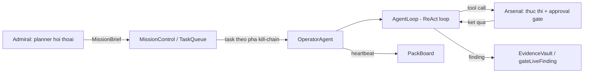
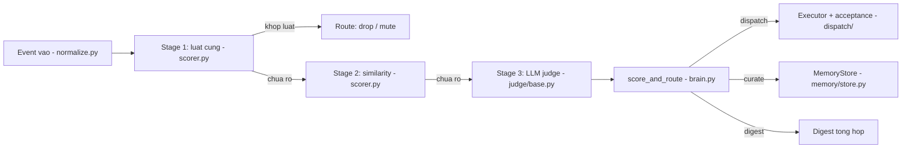
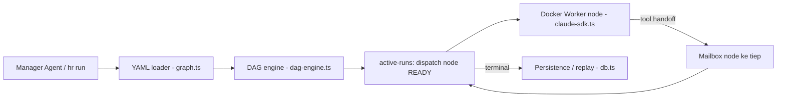
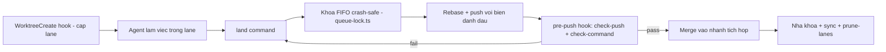

# Agentic AI Weekly Scan — 2026-07-09

**Executive summary:**
- Tuần này nổi bật nhất là hai pattern sản xuất thực tế: cô lập ngữ cảnh triệt để theo node (homerail) và khoá phối hợp crash-safe theo PID-liveness thay vì timeout (claude-code-merge-queue) — cả hai đều là những vấn đề kỹ thuật xương sống của multi-agent, không phải demo prompt.
- `T3MP3ST` (elder-plinius) là repo đáng chú ý nhất về mặt eval methodology — có script `verify-claims` chạy trong CI để tự tái tính mọi con số benchmark từ artifact đã commit, cộng một "Integrity Ledger" tự audit lỗi của chính mình — nhưng lịch sử git ngắn bất thường so với khối lượng code và tốc độ sao/fork cần được nhìn với sự thận trọng.
- `homerail` có một red flag đáng lưu ý: repo public chỉ có **một commit duy nhất** gộp toàn bộ codebase dù message nhắc đến "PR #7", tức lịch sử phát triển đã bị xoá/dọn trước khi public — không thể verify quá trình phát triển thực sự.

**Mục lục:**
1. [T3MP3ST — elder-plinius](#1-t3mp3st)
2. [agent-chief — SmileLikeYe](#2-agent-chief)
3. [homerail — xiaotianfotos](#3-homerail)
4. [claude-code-merge-queue — funador](#4-claude-code-merge-queue)

Repo được cân nhắc nhưng không chọn vào deep-dive tuần này (lý do loại trừ ở cuối file): `eli-labz/Cognitive-Core-Skills`, `simonlin1212/Vibe-Research`, `ai4s-research/open-science`.

---

## 1. T3MP3ST

**github.com/elder-plinius/T3MP3ST** — verify 2026-07-09: HTTP 200, ~3.9k sao, 848 fork.

### §1 — Quick context
Framework đa-agent biến sẵn các coding agent (Claude Code, Codex, Hermes) thành một đội red-team tự động theo kill-chain 8 vai trò. Stack: TypeScript/Node.js, đa nhà cung cấp LLM (OpenRouter/Anthropic/OpenAI/xAI/local), MCP SDK, sandbox qua `execFile`. Repo health: ~3.9k sao, 848 fork, commit gần nhất hôm qua (08/07), CI đầy đủ (lint → typecheck → test → verify-claims → smoke), nhưng lịch sử chỉ có 71 commit trên `main` cho 1.543 file — khá mỏng so với khối lượng.

### §2 — Architecture deep-dive

**A. Component inventory**
- `Orchestrator` (`src/orchestration/orchestrator.ts`) — điều phối kiểu planner/worker riêng cho phân tích mã nguồn white-box.
- `OperatorAgent` (`src/operators/index.ts`) — 8 archetype vận hành (Recon, Scanner, Exploiter, Infiltrator, Exfiltrator, Ghost, Coordinator, Analyst).
- `AgentLoop` (`src/agent/index.ts`) — vòng ReAct thực thi cho từng operator.
- `LLMBackbone` (`src/llm/index.ts`) — lớp trừu tượng đa nhà cung cấp + fallback.
- `Arsenal` (`src/arsenal/index.ts`, `catalog.ts`, `approval.ts`) — đăng ký/thực thi tool + cổng phê duyệt.
- `MissionControl` / `TaskQueue` (`src/mission/index.ts`) — điều phối theo pha kill-chain.
- `Admiral` (`src/admiral/index.ts`) — planner hội thoại, không thực thi.
- `PackBoard` (`src/pack/board.ts`) — bảng trạng thái chia sẻ kiểu blackboard.
- `EvidenceVault` + `gateLiveFinding` (`src/evidence/index.ts`, `gate.ts`) — cổng xác thực finding.
- MCP server (`src/mcp-server.ts`) — expose 1 tool `security_recon`.

**B. Control flow** — kết hợp 3 pattern, không phải một:
1. `Admiral` hội thoại slot-filling với người dùng → tạo `MissionBrief`/`Directive`.
2. `MissionControl` bước qua các pha kill-chain (`RECON→WEAPONIZE→...→C2→ACTIONS`), sinh task cho từng archetype qua `TaskQueue`.
3. Mỗi `OperatorAgent` kéo task, chạy `AgentLoop` (ReAct): gọi LLM → nếu có tool call thì `Arsenal.execute()` → đẩy kết quả về message `role:'tool'` → lặp tới khi có kết luận hoặc chạm `maxIterations`.
4. Finding lấy từ tool được gắn `provenance:'tool'`, từ lời văn model gắn `provenance:'model'` — tách biệt rõ trong `OperatorAgent.executeTask()`.
5. Mọi finding phải qua `gateLiveFinding()` — critical/high severity không có evidence cụ thể (output/command/log/file) bị từ chối thẳng.
6. Operator ghi heartbeat vào `PackBoard`; không tìm thấy cơ chế handoff trực tiếp operator-to-operator — phối hợp chỉ qua blackboard và task queue.

**C. State & data flow** — message nội bộ dùng schema `LLMMessage` typed (`src/types/index.ts`), không phải dict rời. Toàn bộ state chạy **in-memory**, không DB; persistence duy nhất là export JSON tường minh (`EvidenceVault.exportFindings()`) hoặc report benchmark. Quản lý ngữ cảnh có hai cơ chế tách biệt: token-budget cho gói mã nguồn (`context-pack.ts`, 24-30k token) và cắt ký tự cứng (không phải tóm tắt) cho status blurb chia sẻ (`pack/board.ts`, mặc định 4000 ký tự).

**D. Tool/capability integration** — 31 tool thuần Node + 4 tool bọc binary thật (nmap/nuclei/ffuf/curl) qua `execFile` (không dùng shell), cộng 67 adapter chỉ có metadata trong `catalog.ts` (nhiều cái còn `execution:'catalog_only'`, chưa có handler thật). Gọi tool bằng **native function-calling** — không tìm thấy cơ chế parse JSON từ text trong các file đã đọc, dù README claim hỗ trợ "text-driven tool calling". Có cổng phê duyệt theo risk tier (`intrusive/credential/dangerous`) và cổng phạm vi (`scopeViolation()`, fail-closed).

**E. Memory architecture** — không có vector store/embedding retrieval. Chỉ có: message array ngắn hạn trong ReAct loop, blackboard `PackBoard` (append-only event log), và một chuỗi "accumulated knowledge" ghép nối không giới hạn trong orchestrator phân tích mã nguồn (không tóm tắt/nén).

**F. Model orchestration** — hỗ trợ 9 provider bao gồm cả chế độ **"local-agent" không cần API key**: spawn thẳng CLI đã cài (`claude`/`codex`/`hermes`) và đọc stdout làm response — đây là điểm thiết kế khác lạ nhất của repo. Có chuỗi fallback khi lỗi cứng/mềm, và khi gặp refusal thì hop kế tiếp được viết lại prompt theo hướng "trung thực hoá bối cảnh được uỷ quyền" (tài liệu ghi rõ không dùng kỹ thuật jailbreak). Riêng orchestrator phân tích mã nguồn dùng mẫu hai-model: model "orchestrator" giữ mục tiêu tấn công đầy đủ, chia nhỏ thành câu hỏi phân tích mã trung tính gửi cho model "worker" không biết khung tấn công.

**G. Observability & eval** — Không dùng OpenTelemetry/Langfuse; observability tự chế qua `EventEmitter3` + dashboard SSE. Điểm mạnh nhất của repo: script `scripts/verify-claims.mjs` chạy trong CI, tái tính lại mọi con số README từ artifact JSON đã commit trong `bench/` (bao gồm tái chấm điểm hoàn toàn cho CVE-Zero từ ground-truth), tự nhận rõ giới hạn "không tự chạy lại benchmark, chỉ kiểm tra tái lập từ dữ liệu đã có". Ba bộ eval: XBEN (104 challenge web-sec), Cybench (40 challenge, có cơ chế xoá writeup lúc chạy để chống học tủ), CVE-Zero (CVE thật sau cutoff, chấm theo rubric 5 cổng). Có `docs/INTEGRITY_LEDGER.md` ghi lại các lần chính nhóm phát hiện lỗ hổng chấm điểm của chính họ (ví dụ leak flag qua hash tên thư mục) và cách vá.

**H. Extension points** — `CustomTool` trong config (handler tuỳ biến), thêm provider LLM qua `LLMBackbone.createAdapter()`, thêm local-agent CLI qua bảng `LOCAL_AGENT_SPECS`, mở rộng archetype qua `ARCHETYPE_PROFILES` (override runtime không cần rebuild), và bộ hook (`onFindingDiscovered`, `onDetectionEvent`...) để nhúng làm thư viện.

### §3 — Architecture diagram

### §4 — Verdict
**Đáng học:** cơ chế `verify-claims` tái tính benchmark từ artifact commit trong CI, và "Integrity Ledger" tự công khai lỗi chấm điểm của chính mình — mức độ minh bạch hiếm gặp cho một repo mới 1 tuần tuổi. Chế độ "local-agent" (dùng CLI agent đã cài thay vì gọi API) cũng là một lựa chọn kiến trúc thực dụng đáng chú ý.
**Red flag:** lịch sử git chỉ 71 commit cho 1.543 file; tốc độ sao/fork (848 fork trong ~1 tuần) bất thường — nhiều khả năng do lượng follower sẵn có của tác giả hơn là lan truyền hữu cơ, nên không dùng star count làm tín hiệu chất lượng độc lập. Nhiều tool trong catalog vẫn chỉ là metadata (`catalog_only`), chưa có handler thật. Claim "tool-calling hoạt động qua text trên mọi local model" không có bằng chứng trong các file đã đọc.
**Cần đào sâu thêm:** cơ chế handoff trực tiếp operator-to-operator (nếu có) nằm ở đâu ngoài phạm vi đã đọc; lộ trình hoàn thiện các tool `catalog_only`.

---

## 2. agent-chief

**github.com/SmileLikeYe/agent-chief** — verify 2026-07-09: HTTP 200, 319 sao.

### §1 — Quick context
Lớp "attention guard" cục bộ, dùng bộ lọc 3 tầng (heuristic → embedding dedup → LLM judge) để quyết định một sự kiện/agent nên làm phiền người dùng, gom vào digest, hay im lặng lưu trữ. Stack: Python 3.12, Pydantic, `aiosqlite`, Jinja2, MCP server, Typer CLI, judge pluggable (Ollama/DeepSeek/Anthropic/OpenAI). Repo health: 319 sao, MIT, tạo 04/07, push hôm nay (09/07), CI đầy đủ (`uv sync` → `ruff` → `pytest`), có vẻ là dự án một tác giả (blog viết ngôi thứ nhất số ít).

### §2 — Architecture deep-dive

**A. Component inventory**
- `Brain` (`core/brain.py`) — vòng triage → associate → decide.
- Worthiness engine 3 tầng (`core/scorer.py`) — `stage1()`, `SimilarityClassifier`, `score_and_route()`.
- Schema dữ liệu (`core/schema.py`) — `Event`, `Decision`, `DecisionTrace` (Pydantic).
- State/storage (`core/state.py`) — SQLite qua `aiosqlite`, audit log JSONL append-only.
- `SceneEngine` (`context/infer.py`) — suy luận ngữ cảnh theo scene để chỉnh ngưỡng.
- `Judge` interface + factory (`judge/base.py`, `judge/factory.py`) — pluggable LLM judge.
- Cost accounting (`judge/pricing.py`) — bảng giá USD theo từng model.
- `Executor` + acceptance (`dispatch/executor.py`, `dispatch/acceptance.py`) — thực thi và xác minh task.
- `MemoryStore` (`memory/store.py`) — bộ nhớ dài hạn theo embedding.
- Eval harness (`eval/runner.py`, `eval/cohort.py`, `eval/generate_personas.py`).

**B. Control flow** — **pipeline/funnel**, không phải ReAct hay planner-executor. Happy path:
1. Sự kiện vào → chuẩn hoá thành `Event` (`ingest/normalize.py`).
2. Kiểm tra trùng lặp gần trong 10 phút, nếu có thì gộp vào quyết định cũ.
3. Stage 1: luật cứng (topic bị mute, giờ yên tĩnh, regex zero-info) — nếu khớp thì kết thúc ngay ở tầng này.
4. Stage 2: phân loại theo cosine similarity với lịch sử tương tác (ngưỡng 0.88) nếu tầng 1 chưa quyết.
5. Stage 3 (chỉ khi 2 tầng trước chưa rõ): liên kết bộ nhớ liên quan rồi gọi LLM judge chấm 5 chiều, `score_and_route()` so với ngưỡng theo scene.
6. Route ra `interrupt/digest/dispatch/curate/drop`; nếu `dispatch`, một vòng xác minh riêng (`dispatch_and_verify`) không tin ngay "đã xong" mà yêu cầu lệnh chấp nhận hoặc judge xác minh.

**C. State & data flow** — schema Pydantic chặt (`Event`, `Decision` với `route/score/components/stage/trace`), không dùng dict rời. Lưu trữ: SQLite tại `~/.chief/state.db` (8 bảng: events, decisions, tasks, memory, memory_archive, feedback, topic_weights, scene_log) + audit JSONL append-only. Giao thức HTTP `/v1/events` (POST) trả về `Decision` JSON — có tài liệu hoá trong `docs/protocol.md`. `JudgeContext` đóng vai trò "context window" — được dựng lại mỗi sự kiện, không tích luỹ hội thoại.

**D. Tool/capability integration** — không phải framework tool-calling tổng quát mà là lớp lọc/định tuyến hẹp. Judge gọi API qua `HTTPJudge` với prompt Jinja2 3 phần (system/context/user), parse JSON có retry khi lỗi format. Dispatch thật sự đi qua `Executor` protocol: `ClaudeCodeExecutor` shell ra CLI `claude`, `ShellExecutor` giới hạn bằng **whitelist lệnh tham số hoá** (chặn injection). Kết quả dispatch không được tin ngay — `acceptance.py` yêu cầu lệnh xác nhận hoặc judge xác minh trước khi coi "done" là thật. MCP server riêng expose 4 tool (`propose/feedback/digest/policy/stats`) cho agent khác gửi sự kiện vào.

**E. Memory architecture** — hai tầng: ngắn hạn (dedup 10 phút/24h, truy vấn trực tiếp từ SQLite mỗi request) và dài hạn (`MemoryStore`, lưu embedding, top-3 liên quan theo cosine >0.78, hết hạn theo `ttl_days` rồi chuyển sang bảng archive). Có thêm một tầng "preference memory" riêng — `topic_weights` cập nhật theo EMA từng chủ đề, là dữ liệu chính được đo trong benchmark hội tụ.

**F. Model orchestration** — judge backend chọn qua config (`fixtures/ollama/deepseek/anthropic/openai`), đổi model chỉ cần sửa 1 dòng config. Khi judge timeout/lỗi, hệ thống **không crash** mà tự động route về `digest`, đánh dấu `degraded=True` và ghi trạng thái suy giảm vào DB. Cost accounting theo **từng model cụ thể** (không theo provider) — blog tác giả kể lại việc tự phát hiện và sửa lỗi từng tính sai giá khiến bị tính đắt gấp ~17 lần do dùng bảng giá theo provider thay vì theo model.

**G. Observability & eval** — mỗi `Decision` mang `DecisionTrace`/`StageTiming` (thời gian từng tầng, token, cost, rule khớp), truy vấn lại qua `chief trace <event_id>`. README claim 326 test offline — xác nhận có 37 file test thật trong `tests/` và CI chạy `pytest`, nhưng không tự chạy lại được để xác nhận đúng con số 326. Golden dataset xác nhận thật: `eval/golden.jsonl` có ~193 case (gần khớp con số "~200" mà tài liệu tự nêu), mỗi case có route kỳ vọng + lý do. Cohort benchmark 100 "persona" xác nhận thật (`eval/generate_personas.py`, seed cố định nên tái lập được): F1 giữ lại trung bình cải thiện 0.10→0.81; tài liệu còn giải thích bằng công thức toán học lý do 36/100 persona không hội tụ (trần lý thuyết do EMA weight bị cap ở 0.5) — trình bày như giới hạn thiết kế có chủ đích, không phải bug.

**H. Extension points** — đổi judge backend/model/prompt-version qua `config.toml`; sửa `~/.chief/POLICY.md` (heuristic, mute, ngưỡng theo scene) có hiệu lực ngay không cần restart; thêm nguồn ngữ cảnh mới qua `ContextProvider` protocol; thêm executor dispatch mới qua factory; connector framework mở cho tích hợp ngoài Composio.

### §3 — Architecture diagram

### §4 — Verdict
**Đáng học:** kiến trúc funnel leo thang chi phí có chủ đích — 75% sự kiện không bao giờ chạm tới LLM — cộng với việc công khai một bug tính phí sai 17 lần và cách sửa (per-model chứ không per-provider pricing) là case study thực tế hiếm gặp trong repo mới. Benchmark hội tụ có trần lý thuyết được chứng minh bằng công thức, không chỉ báo cáo con số suông.
**Red flag:** dự án mới 5 ngày tuổi, có vẻ một tác giả duy nhất, watcher = star (chưa có cộng đồng độc lập ngoài tác giả); con số "326 test" chưa tự tái lập được để xác nhận.
**Cần đào sâu thêm:** độ trễ/chi phí thực tế của stage 3 khi triển khai ở quy mô lớn hơn 24-event demo; độ chính xác của heuristic suy luận topic khi cache miss.

---

## 3. homerail

**github.com/xiaotianfotos/homerail** — verify 2026-07-09: HTTP 200, 276 sao.

### §1 — Quick context
Runtime điều phối multi-agent dạng DAG, hướng giọng nói, chạy cục bộ (homelab), biến hội thoại một-lần thành workflow có thể audit và replay lại. Stack: **100% TypeScript** (không phải Rust như một số nguồn ban đầu gợi ý), Vue 3 UI, `better-sqlite3`, `dockerode`, `@anthropic-ai/claude-agent-sdk` + adapter cho Codex/Kimi. Repo health: 276 sao, MIT — nhưng **không có CI nào chạy trong repo** (không có thư mục `.github/workflows`) dù có sẵn script `test`/`typecheck`, và lịch sử git **chỉ có một commit duy nhất** gộp toàn bộ codebase dù message nhắc "PR #7" — dấu hiệu lịch sử phát triển đã bị xoá/squash trước khi public.

### §2 — Architecture deep-dive

**A. Component inventory**
- Protocol/schema (`homerail_protocol/src/types.ts`, `schemas.ts`, `codec.ts`) — schema dùng chung, JSON-Schema Draft-07.
- Manager Agent (`homerail_protocol/src/manager-agent.ts`) — planner điều khiển bằng giọng nói.
- DAG engine (`homerail_manager/src/orchestration/dag-engine.ts`) — state machine chuyển trạng thái node thuần hàm.
- Runtime store (`homerail_manager/src/runtime/active-runs.ts`) — lưu run đang chạy, vòng dispatch, hồi phục sau crash.
- YAML loader/validator (`homerail_manager/src/orchestration/graph.ts`, `yaml-loader.ts`).
- Provider policy (`homerail_manager/src/orchestration/provider-policy.ts`) — cấm hardcode model trong YAML.
- Docker provider (`homerail_node/src/providers/docker-api-provider.ts`) — cô lập node bằng container.
- Worker harness adapter (`homerail_worker/src/agent/claude-sdk.ts`, `codex.ts`, `kimi-code.ts`).
- Dag tool `handoff` (`homerail_worker/src/dag-tools/handoff.ts`).
- Persistence (`homerail_manager/src/persistence/db.ts`) — SQLite WAL, 49 bảng.
- CLI (`homerail_cli/src/commands/{eval-run,scorecard,replay}.ts`).

**B. Control flow** — **DAG-graph kết hợp state machine per-node**, không phải ReAct đơn thuần:
1. Yêu cầu vào qua Manager Agent (giọng nói/text) hoặc `hr run <template.yaml>` trực tiếp.
2. YAML được nạp thành `ParsedDAG`; `createActiveRun` khởi tạo mọi node ở trạng thái `PENDING`/`READY` theo phụ thuộc `after:`.
3. `dispatchReadyNodes` tìm **toàn bộ** node đang `READY` trong mỗi tick và dispatch song song từng node độc lập.
4. Mỗi node chạy trong container Docker riêng, model gọi tool `handoff` đúng một lần để đẩy nội dung sang mailbox của node kế tiếp rồi tự đánh dấu `COMPLETED`/`FAILED`.
5. `isRunTerminal` đóng run; mọi handoff/event được ghi bền vững, cho phép replay lại toàn bộ qua `hr replay`.

**C. State & data flow** — protocol là **typed discriminated union** (không phải dict rời, không phải protobuf); `codec.ts` triển khai `stableStringify` để khớp byte với một serializer Python khác cùng hệ. Lưu trữ: SQLite (`better-sqlite3`, WAL mode) tại `~/.homerail`, 49 bảng. **Cô lập ngữ cảnh theo node được xác nhận là thật, không chỉ marketing**: mỗi node chỉ nhận nội dung trong mailbox riêng của nó (theo port), không nhận toàn bộ lịch sử run — khi resume/checkpoint còn tạo session mới thay vì nối tiếp ngữ cảnh cũ.

**D. Tool/capability integration** — native function-calling qua MCP server nội bộ trong Claude Agent SDK (tool `handoff`/`send_message`/`receive_message`/`manager_command` cộng built-in Bash/Read/Write...). Cô lập bằng Docker: có denylist mount cứng (`/etc, /proc, /sys, /dev`), chặn mount `docker.sock` trừ khi cho phép rõ ràng, mọi mount phải nằm trong `$HOMERAIL_HOME`.

**E. Memory architecture** — có bảng `memories` và đồ thị `experience_nodes`/`experience_relationships` tách biệt khỏi state của từng DAG run, cùng UI riêng (`ExperienceGraphExplorer.vue`) — nhưng **không xác định được từ code** đường ghi/đọc chi tiết của tầng bộ nhớ dài hạn này trong phạm vi đã đọc.

**F. Model orchestration** — mẫu "model đắt lên kế hoạch, model rẻ thực thi" được xác nhận thật và **cấu hình được** qua runtime profile (model mặc định rẻ + override theo từng agent), và DAG YAML **bị cấm cứng** khai báo provider/model trực tiếp (`assertNoYamlProviderRuntime` sẽ throw) — buộc phải đi qua runtime profile đã mã hoá trong DB. Song song hoá thật ở mức dispatch (mọi node `READY` được gửi cùng lúc), chỉ giới hạn bởi các cap tổng (`max_dispatches`, `max_handoffs`...), không thấy giới hạn số worker đồng thời rõ ràng.

**G. Observability & eval** — ba lệnh CLI: `hr scorecard` (chấm loạt kiểm tra cấu trúc như node hoàn tất/không lỗi/có handoff, cộng policy-check tuỳ chọn khai báo trong YAML), `hr eval-run` (bọc scorecard + thống kê hành vi worker/số lần con người can thiệp), `hr replay` (phân loại lỗi theo nhóm nguyên nhân: engine/template/tool/harness/prompt và gợi ý bước sửa). Không có OpenTelemetry hay framework observability ngoài — chỉ có event bus nội bộ + WebSocket đẩy tới UI.

**H. Extension points** — đăng ký harness agent mới qua `registerAgentBackend()`; thêm loại node mới qua trường `node_type` trong YAML; worker khai báo `capabilities` để khớp với yêu cầu của node; thư mục `skills/` chứa runbook `SKILL.md` để agent khác tự học cách vận hành hệ thống mà không cần đọc mã nguồn.

### §3 — Architecture diagram

### §4 — Verdict
**Đáng học:** cô lập ngữ cảnh triệt để theo node (mailbox theo port, session mới khi resume) là giải pháp thực chất cho vấn đề "context balloon" chứ không chỉ là câu marketing — đáng tham khảo cho bất kỳ hệ multi-agent nào chạy nhiều bước dài. Việc cấm cứng hardcode model/provider trong DAG YAML, buộc đi qua runtime profile tập trung, là thiết kế production-grade đáng học cho quản trị chi phí/model tập trung.
**Red flag nghiêm trọng:** repo public chỉ có **một commit duy nhất** gộp toàn bộ codebase lớn dù message nhắc "PR #7" — lịch sử phát triển đã bị xoá/dọn trước khi public, không thể verify quá trình phát triển thực. Không có CI nào chạy trong repo dù đã có sẵn script test/typecheck — chất lượng chưa được gác bởi tự động hoá. *Lưu ý phương pháp luận riêng*: trong lúc research, một lần gọi `WebFetch` tới `api.github.com` cho repo này đã trả về nội dung bịa (cây thư mục Rust không tồn tại) trước khi bị phát hiện qua đối chiếu với `git clone` thực tế — không phải lỗi của repo, nhưng là lý do mọi con số/đường dẫn trong mục này đã được xác minh lại qua nguồn thứ cấp trước khi đưa vào báo cáo.
**Cần đào sâu thêm:** cơ chế ghi/đọc của tầng "experience graph" (bộ nhớ dài hạn); giới hạn concurrency thực tế khi có nhiều node `READY` cùng lúc.

---

## 4. claude-code-merge-queue

**github.com/funador/claude-code-merge-queue** — verify 2026-07-09: HTTP 200, 293 sao.

### §1 — Quick context
Lớp điều phối merge/build cho nhiều phiên Claude Code chạy song song trên cùng một codebase — hàng đợi FIFO, khoá crash-safe, tài nguyên test theo lane. Đây là **hạ tầng phối hợp cho agent**, không phải bản thân một agent gọi LLM. Stack: TypeScript/Node.js (18-24), `git worktree`, npm package v0.1.16, Husky pre-push hook. Repo health: 293 sao, MIT, tạo 02/07, push 08/07, CI chạy matrix Node đầy đủ với 12 file test thật — bao gồm test spawn tiến trình con thật để kiểm tra khoá cross-process. Có vẻ một tác giả duy nhất (Jesse Heaslip).

### §2 — Architecture deep-dive

**A. Component inventory**
- CLI (`src/bin/claude-code-merge-queue.ts`) — điều phối các subcommand.
- Khoá FIFO crash-safe (`src/lib/queue-lock.ts`) — nguyên tố mutex dùng chung.
- Land orchestrator (`src/land.ts`) — giữ khoá, rebase, push.
- Build lock (`src/build-lock.ts`) — cùng pattern khoá áp cho lệnh build tuỳ ý.
- Hook `WorktreeCreate` (`src/hooks/worktree-create.ts`) — cấp lane cho phiên agent mới.
- Pre-push enforcement (`src/lib/check-push.ts`) — chặn push trực tiếp vào nhánh bảo vệ.
- Check-command runner (`src/lib/check-command.ts`) — chạy lint/typecheck/test/build trước khi cho merge.
- Stale-lane pruner (`src/lib/prune-lanes.ts`) — dò tiến trình sống qua `lsof`.
- Ephemeral resource framework (`src/lib/ephemeral.ts`) — claim/release tài nguyên test dùng một lần.

**B. Control flow** — **không phải agent loop**, mà là chuỗi lệnh CLI độc lập phối hợp qua file khoá trên đĩa, không có daemon trung tâm. Happy path:
1. Hook `WorktreeCreate` của Claude Code cấp lane mới (`git worktree add`) khi một phiên agent bắt đầu.
2. Agent làm việc trong lane, xong thì chạy `claude-code-merge-queue land`.
3. `land()` xin vé FIFO trên khoá "land", chờ tới khi giữ được vé cũ nhất còn sống.
4. Giữ khoá xong: fetch, rebase lên nhánh tích hợp, push với biến env đánh dấu `CLAUDE_CODE_MERGE_QUEUE_LANDING=1`.
5. Git pre-push hook gọi `check-push`, kiểm tra biến env đánh dấu rồi chạy `check-command` (lint/typecheck/test/build) — fail thì chặn push.
6. Thành công: nhả khoá, đồng bộ checkout chính, dọn lane đã landed như tác vụ nền không chặn luồng chính.

**C. State & data flow** — toàn bộ trạng thái là **file JSON trên đĩa**, không DB, không daemon: thư mục queue định danh theo hash đường dẫn `.git` chung của repo (đảm bảo mọi lane cùng repo chia sẻ một hàng đợi); vé (ticket) và khoá (lock) đều là file JSON `{pid, lane, label, ts}`, khoá được chiếm nguyên tử qua hardlink (`linkSync`, fail `EEXIST` nếu đã bị chiếm). "Message format" giữa các thành phần thực chất là file JSON dùng chung + trạng thái git ref + biến môi trường tín hiệu một lần (`CLAUDE_CODE_MERGE_QUEUE_LANDING`).

**D. Tool/capability integration** — đây là hạ tầng gắn vào vòng đời phiên Claude Code, không phải bề mặt gọi tool kiểu LLM: implement đúng hợp đồng hook `WorktreeCreate` của Claude Code (đọc JSON qua stdin, in đường dẫn worktree qua stdout), gắn vào git pre-push hook (shell script gọi lại CLI), và tự sinh đoạn `CLAUDE.md` để "dạy" agent tuân theo quy trình land.

**E. Memory architecture** — không có bằng chứng, không áp dụng (không phải agent có bộ nhớ hội thoại).

**F. Model orchestration** — không có bằng chứng: repo không gọi LLM API nào, không có dependency Anthropic SDK trong `package.json`. Đây thuần là hạ tầng phối hợp nằm cạnh các phiên agent bên ngoài, không tự điều phối model.

**G. Observability & eval** — log console có màu theo từng bước (vị trí trong hàng đợi, ai đang giữ khoá), không có file log/telemetry backend. Cơ chế crash-safety xác nhận kỹ: theo dõi sự sống bằng `process.kill(pid, 0)`, **không có ngưỡng timeout tuỳ chỉnh** — thiết kế có chủ đích ("kill -9 tiến trình giữ khoá giữa chừng, hàng đợi tự lành ở lần poll kế tiếp"). Test suite thật sự SIGKILL một tiến trình đang giữ khoá để xác nhận tiến trình chờ chiếm lại khoá không bị deadlock — kiểm chứng bằng tiến trình con thật, không mock. CI: GitHub Actions matrix Node 18/20/22/24.

**H. Extension points** — cấu hình qua `claude-code-merge-queue.config.mjs` (tên nhánh lane, port cơ sở, lệnh check bắt buộc, danh sách file được phép bỏ qua khi bẩn, symlink thay vì copy `.env`/`node_modules`); interface `EphemeralResourceProvider` để cắm nguồn tài nguyên test tuỳ biến (DB nhánh, bucket...); tuỳ chọn 2 giai đoạn promote (integration → production, yêu cầu con người); escape hatch `EMERGENCY_PUSH` để bỏ qua bảo vệ nhánh khi cần.

### §3 — Architecture diagram

### §4 — Verdict
**Đáng học:** khoá crash-safe theo PID-liveness (không dùng timeout đoán mò) là pattern tổng quát đáng áp dụng cho bất kỳ hệ multi-agent nào cần mutex chia sẻ trên nhiều tiến trình độc lập; test suite thật sự SIGKILL tiến trình để kiểm chứng tự lành, không chỉ mock giả định.
**Red flag / giới hạn:** đây là hạ tầng phối hợp, **không phải một "agent"** theo nghĩa lập kế hoạch/suy luận — đưa vào digest vì mức độ liên quan trực tiếp tới vận hành multi-agent coding, nhưng cần gắn nhãn khác nhóm với 3 repo còn lại. Dự án một tác giả, chưa có cộng đồng contributor rộng (0 fork).
**Cần đào sâu thêm:** cơ chế này hoạt động ra sao khi lane vượt quá 10, và trên hệ thống file mạng (NFS) nơi hardlink có thể không còn atomic.

---

## Ghi chú loại trừ

- `eli-labz/Cognitive-Core-Skills` (273 sao) — là taxonomy/schema kỹ năng nhận thức cho agent, không phải một framework điều phối chạy được — loại khỏi deep-dive vì không có "control flow" để phân tích theo khung §2.B.
- `simonlin1212/Vibe-Research` (557 sao) — sản phẩm agent đơn (trading research), không phải kiến trúc đa-agent/orchestration — độ phù hợp thấp hơn so với 4 repo đã chọn.
- `ai4s-research/open-science` (405 sao) — ứng dụng desktop dùng agent skills, thiên về sản phẩm hơn là kiến trúc orchestration mới.

## Self-check

- [x] Cả 4 repo verify được qua WebFetch (github.com/*): HTTP 200, số sao khớp với dữ liệu deep-dive.
- [x] Không repo nào là awesome-list hay tutorial dump.
- [x] §2.A mỗi repo: mọi component đều kèm đường dẫn file thực tế.
- [x] §2.B mỗi repo: pattern control flow được gọi tên rõ ràng (ReAct kết hợp hierarchical + planner-worker / pipeline-funnel / DAG-graph state machine / pipeline lệnh CLI phối hợp qua khoá file).
- [x] §3: cú pháp Mermaid `flowchart LR` hợp lệ ở cả 4 diagram, mọi node đều xuất hiện trong §2.A tương ứng.
- [x] §4: điểm "đáng học" cụ thể theo từng repo (verify-claims CI gate, funnel cost-escalation có case study bug thật, cô lập ngữ cảnh theo mailbox, khoá PID-liveness) — không dùng câu chung chung kiểu "uses LLM".
- [x] Đường dẫn file đúng convention `research/weekly/{YYYY-MM-DD}-agentic-scan.md`, markdown render được trên GitHub.
