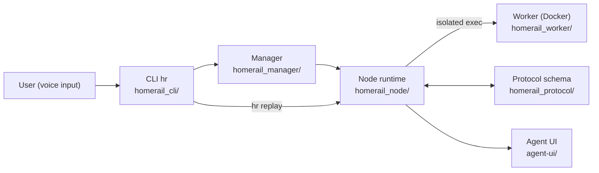
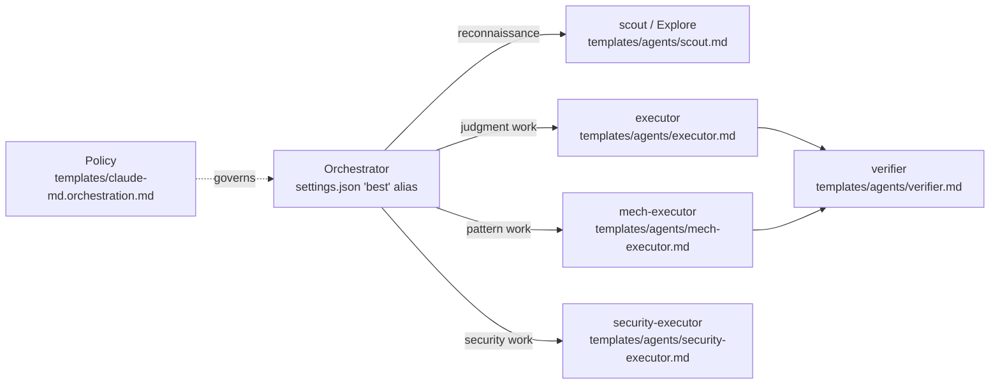
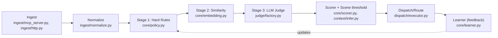
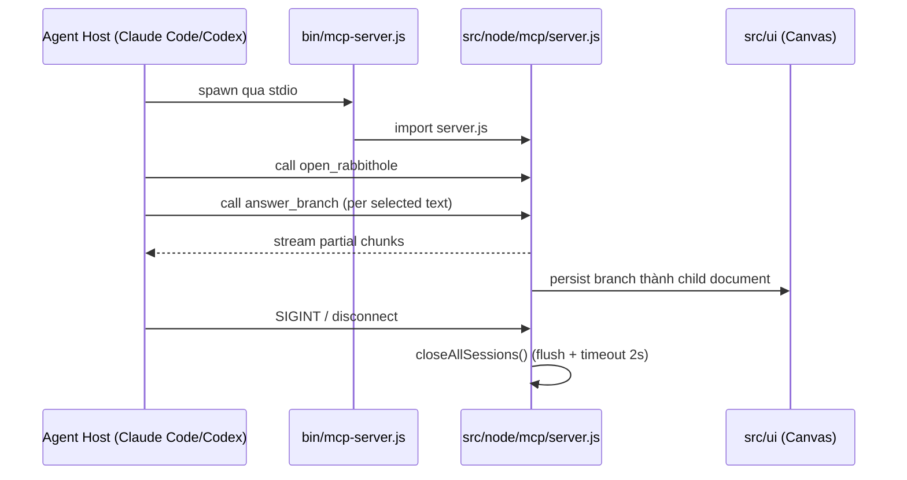

# Weekly Agentic AI Scan — 2026-07-10

**Phạm vi:** repos agentic AI được tạo mới hoặc cập nhật đáng kể trong 7 ngày qua (03/07 – 10/07/2026), lọc từ GitHub search (`created:>2026-07-03 stars:>200`, mở rộng `pushed:>2026-07-03`), loại awesome-list/tutorial/fork/marketing wrapper.

## Executive Summary

- Tuần này nổi bật ba pattern orchestration khác hẳn nhau: **DAG runtime đa agent** (HomeRail), **model-tier routing qua config layer** (pilotfish), và **event-driven triage pipeline chi phí tăng dần** (agent-chief) — không repo nào là wrapper mỏng quanh LangChain/CrewAI.
- **agent-chief** là repo có bằng chứng engineering production-grade rõ nhất tuần này: eval harness với golden dataset 200 case, cohort benchmark 100 user, cost accounting per-decision, và Shadow Mode trước khi go-live.
- **pilotfish** đáng chú ý nhưng cần đọc kỹ trước khi áp dụng: đây là bộ config/template cho Claude Code (không có runtime code riêng), giá trị nằm ở tách lớp machine/role/policy chứ không phải một framework thực thi độc lập.

## Mục lục

1. [HomeRail — xiaotianfotos/homerail](#1-homerail--xiaotianfotoshomerail)
2. [pilotfish — Nanako0129/pilotfish](#2-pilotfish--nanako0129pilotfish)
3. [agent-chief — SmileLikeYe/agent-chief](#3-agent-chief--smilelikeyeagent-chief)
4. [rabbithole — shlokkhemani/rabbithole](#4-rabbithole--shlokkhemanirabbithole)

---

## 1. HomeRail — xiaotianfotos/homerail

**Link:** https://github.com/xiaotianfotos/homerail

### §1 Quick Context

Runtime chuyển hội thoại agent bằng giọng nói thành DAG workflow tái sử dụng, có thể replay và audit. Tech stack core: TypeScript (74.9%) + Vue (24.1%), Node.js 20+, Docker cho worker cách ly, tương thích Claude Agent SDK. Repo health: 371 sao, 81 fork, 2 open issue, MIT license, tạo 07/07 và push gần nhất 10/07/2026 — nhưng không thấy CI badge ở root, dù các submodule (`homerail_node`, `homerail_protocol`, `homerail_manager`) đều có `tests/` + `vitest.config.ts`.

### §2 Architecture Deep-Dive

**A. Component inventory**
- CLI (`homerail_cli/`) — entry point cung cấp lệnh `start`, `config`, `run`, `replay`, `evaluate` (theo README; nội dung `src/` bên trong không đọc được chi tiết).
- Protocol (`homerail_protocol/src/`) — lớp schema giao tiếp giữa các thành phần, có `fixtures/` và `tests/` riêng.
- Node runtime (`homerail_node/src/`) — thực thi logic của từng DAG node.
- Manager (`homerail_manager/src/`) — điều phối chạy DAG (vai trò suy từ tên module + vị trí trong cấu trúc, nội dung cụ thể không xác định từ code).
- Worker (`homerail_worker/`, có `Dockerfile`) — thực thi bước DAG trong container cách ly ("Docker Worker provisioning" theo README).
- Agent UI (`agent-ui/`, Vue) — generative UI hiển thị output có cấu trúc thay vì log thô.
- Skills (`skills/homerail-cli`, `skills/homerail-dag-ops`, `skills/homerail-install-ops`, `skills/homerail-shared`) — gói `SKILL.md` symlink vào `~/.claude/skills` hoặc `${CODEX_HOME}/skills`.

**B. Control flow — DAG-based, không phải ReAct loop.** README mô tả pattern "inverted funnel": voice input → generative UI output, DAG execution ở giữa; đa agent có "explicit handoffs". Happy path suy từ CLI command + cấu trúc module:
1. Voice surface (ASR tiếng Trung) thu thập intent người dùng.
2. `hr run` khởi tạo DAG trong Manager, phân rã task thành các node cho Node runtime thực thi.
3. Node cần cách ly (chạy code/agent) được dispatch sang Worker (container Docker riêng).
4. Kết quả node ghi lại theo schema của Protocol, hỗ trợ "workspace isolation".
5. Agent UI render output dạng structured/generative UI.
6. `hr replay` cho phép tái chạy toàn bộ DAG run phục vụ audit.

**C. State & data flow.** Message format giữa component: không xác định từ code (chỉ biết có schema layer ở `homerail_protocol`, không đọc được định nghĩa type cụ thể). State storage: không xác định từ code — README không nêu DB cụ thể. Context window management: không xác định từ code.

**D. Tool/capability integration.** Cơ chế mở rộng chính là Skills package (`skills/*/SKILL.md`), được **link** (không copy) vào thư mục skill của agent host để giữ đồng bộ khi repo cập nhật — đây là điểm khác biệt so với cách phân phối skill kiểu copy-paste phổ biến. Sandbox: Worker chạy trong Docker container riêng (`homerail_worker/Dockerfile`) là cơ chế cô lập rõ ràng nhất trong repo.

**E. Memory:** không xác định từ code — README không đề cập long-term memory hay retrieval.

**F. Model orchestration:** README chỉ nói "hỗ trợ Claude Agent SDK-compatible endpoints", không xác định model nào gán cho role nào từ evidence có được.

**G. Observability & eval:** `hr replay` cung cấp audit trail dạng replay DAG run — không thấy OpenTelemetry/Langfuse hay tracing framework cụ thể nào trong evidence đã đọc.

**H. Extension points:** Viết `SKILL.md` mới trong `skills/`, symlink vào agent host (Codex hoặc Claude Code).

### §3 Architecture Diagram

### §4 Verdict

Điểm đáng học: DAG runtime với "explicit handoff" đa agent kết hợp voice-first input + generative UI output là combo hiếm gặp; cơ chế phân phối skill qua **symlink** (thay vì copy) giữ đồng bộ giữa nhiều agent host là một chi tiết engineering tinh tế, ít repo nghĩ tới. Red flag: không có CI badge ở root, README dùng từ "auditable" nhưng cơ chế audit/replay bên trong chưa lộ code cụ thể để verify; phần lớn module (Manager, Node, Protocol) chỉ có cấu trúc thư mục, chưa đọc được logic thật. Cần đào sâu thêm: định dạng schema thật của `homerail_protocol`, và giao thức handoff giữa các agent cụ thể là gì.

---

## 2. pilotfish — Nanako0129/pilotfish

**Link:** https://github.com/Nanako0129/pilotfish

### §1 Quick Context

Lớp cấu hình điều phối đa model cho Claude Code: model frontier đóng vai orchestrator lập kế hoạch, model rẻ hơn thực thi các role chuyên biệt. Tech stack core: không phải codebase thực thi độc lập — toàn bộ là Markdown/YAML frontmatter + docs, cài đặt vào `~/.claude/`. Repo health: 271 sao, tạo 08/07, push 09/07/2026, MIT license; không có CI/test vì repo không chứa code thực thi, chỉ template.

### §2 Architecture Deep-Dive

**A. Component inventory**
- Settings/Machine layer (`~/.claude/settings.json`, do `install/AGENT-INSTALL.md` cài) — alias model `"best"` + fallback chain.
- Role templates (`templates/agents/scout.md`, `Explore.md`, `mech-executor.md`, `executor.md`, `verifier.md`, `security-executor.md`) — 6 file định nghĩa role, mỗi file gán model tier + effort qua frontmatter.
- Policy template (`templates/claude-md.orchestration.md`) — quy tắc delegation viết theo tên role, không nêu tên model cụ thể.
- Installer (`install/AGENT-INSTALL.md`) — quy trình cài idempotent, hiển thị merge plan để user duyệt trước khi apply.
- Design docs (`docs/design.md`, `docs/research.md`) — giải thích kiến trúc 3 lớp và trích số liệu benchmark chi phí/hiệu năng.

**B. Control flow — Planner-executor + verification**, nhưng thực thi bởi hạ tầng subagent sẵn có của Claude Code, bản thân repo không chạy loop nào. Happy path theo `docs/design.md` + bảng role:
1. Orchestrator (model alias `"best"`, vd Fable 5) nhận task, lập kế hoạch.
2. Việc trinh sát/tra cứu khối lượng lớn giao cho `scout`/`Explore` (Haiku, effort thấp).
3. Refactor có khuôn mẫu, đã đặc tả đầy đủ giao cho `mech-executor` (Sonnet, effort thấp).
4. Việc cần phán đoán thiết kế giao `executor` (Opus, effort medium).
5. `verifier` (Opus) kiểm tra độc lập theo hướng "refute-first" bằng fresh context, không tự sửa.
6. Việc nhạy cảm bảo mật định tuyến sang `security-executor` (Opus, effort high) để tránh vấn đề safety classifier của model frontier.

**C. State & data flow.** Không có state runtime riêng — toàn bộ nạp vào session state có sẵn của Claude Code. "Message format" ở đây là YAML frontmatter trong các file `.md`. Không xác định thêm vì repo không có code thực thi.

**D. Tool/capability integration.** Không định nghĩa tool registry mới — dựa hoàn toàn vào cơ chế tool-calling có sẵn của Claude Code; "integration" thực chất là gán cặp (model, effort) cho từng role qua frontmatter.

**E. Memory:** không xác định / không phải trọng tâm của repo.

**F. Model orchestration — đây là trọng tâm chính**, đã liệt kê đầy đủ ở mục B. Điểm nhấn: policy layer (`templates/claude-md.orchestration.md`) cố tình "không bao giờ nêu tên model", chỉ dùng tên role — theo `docs/design.md`, mục đích là khi model bị deprecate chỉ cần sửa frontmatter của role, không phải sửa lại toàn bộ policy text. Alias `"best"`/`"opus"`/`"sonnet"`/`"haiku"` có fallback chain khi frontier model không khả dụng.

**G. Observability & eval.** `docs/research.md` trích số liệu benchmark ("Fable 5 orchestrator + Sonnet 5 worker đạt 96% hiệu năng all-Fable với 46% chi phí") nhưng không có eval harness/code benchmark nào trong repo để tái lập — số liệu chỉ tồn tại dưới dạng doc.

**H. Extension points.** Thêm role mới bằng cách tạo file `.md` trong `templates/agents/` với frontmatter model/effort riêng.

### §3 Architecture Diagram

### §4 Verdict

Điểm đáng học: tách 3 lớp machine/role/policy để cô lập tên model khỏi policy text là một ý tưởng resilience-design cụ thể, không generic; số liệu chi phí/hiệu năng (46% cost cho 96% performance) là dữ liệu định lượng hiếm thấy ở repo dạng config. Red flag rõ nhất: đây **không phải framework thực thi độc lập** mà là bộ template/config cho Claude Code — ranh giới giữa "kiến trúc" và "best-practice doc" khá mỏng, và không có test/eval code nào trong repo để verify các con số benchmark được trích dẫn. Cần đào sâu thêm: nguồn gốc và khả năng tái lập của benchmark 96%/46%; cơ chế "bounded escalation: hai lần fail rồi escalate" được enforce bằng prompt hay có kiểm tra nào khác không.

---

## 3. agent-chief — SmileLikeYe/agent-chief

**Link:** https://github.com/SmileLikeYe/agent-chief

### §1 Quick Context

Bộ lọc và ưu tiên hoá thông báo local-first, đóng vai "chief of staff" giữa người dùng và các agent/alert/feed. Tech stack core: Python 3.12+, SQLite, judge LLM pluggable (Anthropic/OpenAI/DeepSeek/Ollama), build bằng uv+pip. Repo health: 320 sao, 2 fork, 78 commit, bản v0.3.1, MIT; có test suite rõ nhất trong nhóm — `make test lint` (pytest + ruff) và 326 test offline deterministic theo README.

### §2 Architecture Deep-Dive

**A. Component inventory**
- Brain/Scorer (`core/brain.py`, `core/scorer.py`) — vòng quyết định chính + tính điểm event.
- Policy engine (`core/policy.py`) — chính sách route, có thể chỉnh sửa qua `POLICY.md`.
- Learner (`core/learner.py`) — distill feedback 👍/👎 của user thành policy mới mỗi đêm.
- State store (`core/state.py`) — quản lý state, lưu SQLite.
- Embedding (`core/embedding.py`) — vector hoá cho similarity/dedup.
- Scene/context engine (`context/infer.py`, `context/providers/`) — suy luận ngữ cảnh (clock, calendar, focus detection).
- Judge layer (`judge/factory.py`, `judge/base.py`, `judge/anthropic.py`, `judge/openai.py`, `judge/deepseek.py`, `judge/ollama.py`, `judge/pricing.py`, `judge/templates/v1/`) — LLM judge pluggable đa provider kèm cost tracking.
- Ingest layer (`ingest/mcp_server.py`, `ingest/http.py`, `ingest/normalize.py`, `ingest/connectors/`, `ingest/sources/`) — nhận event qua webhook/MCP/RSS/GitHub, chuẩn hoá format.
- Dispatch layer (`dispatch/executor.py`, `dispatch/acceptance.py`) — gửi việc cho agent khác kèm bước verify kết quả.
- Eval harness (`eval/runner.py`, `eval/generate_golden.py`, `eval/generate_personas.py`, `eval/cohort.py`, `eval/golden.jsonl`, `eval/personas.jsonl`) — golden dataset 200 case, cohort benchmark 100 user.
- Memory (`memory/`) — curation/association/expiration theo README (chỉ có evidence tên thư mục, chưa đọc nội dung file).

**B. Control flow — Event-driven pipeline 3 giai đoạn chi phí tăng dần** (không phải ReAct hay planner-executor):
1. Event vào qua `ingest/` (MCP server, webhook, RSS/GitHub poller), `ingest/normalize.py` chuẩn hoá + suy luận topic.
2. Stage 1 — Hard Rules (regex/blocklist, cấp độ µs) trong `core/policy.py` lọc thẳng phần lớn event.
3. Stage 2 — Similarity classifier (embedding, cấp độ ms) qua `core/embedding.py`, đối chiếu với associate memory để dedup.
4. Stage 3 — LLM Judge pluggable (`judge/factory.py` chọn provider) chỉ chạy khi hai stage trước chưa đủ quyết định.
5. `core/scorer.py` tính điểm × ngưỡng theo scene hiện tại (`context/infer.py`) để ra quyết định cuối.
6. `dispatch/executor.py` thực thi 1 trong 4 route: Interrupt / Dispatch (kèm `dispatch/acceptance.py` verify kết quả) / Curate vào memory / Drop.

**C. State & data flow.** Message format: event JSON (vd `{"source":..., "topic":..., "summary":...}` theo ví dụ curl trong README). State storage: SQLite (`core/state.py`) + Markdown (`POLICY.md`) dưới `~/.chief` — "local-first: single SQLite file + markdown", không cloud sync. Context management: không xác định RAG rõ ràng cho judge prompt — README chỉ nói "70% judge input token cache-hit trên stable-prefix prompt", gợi ý prompt caching hơn là retrieval.

**D. Tool/capability integration.** agent-chief đóng vai trung gian nhận sự kiện TỪ agent/service khác (qua webhook HTTP hoặc MCP server `ingest/mcp_server.py`), không phải bản thân nó gọi tool theo nghĩa function-calling. `dispatch/acceptance.py` verify kết quả trước khi coi một dispatch là thành công. Sandbox: README khẳng định rõ "no arbitrary shell execution", network call giới hạn tới service đã cấu hình (LLM backend, Telegram).

**E. Memory.** Short-term: dedup similarity ở Stage 2. Long-term: `memory/` (curation, association, expiration, archiving theo README) — có bằng chứng cấu trúc thư mục nhưng chưa đọc được nội dung file cụ thể. Retrieval: hybrid — embedding cho similarity-dedup, không xác định có vector DB tách biệt hay dùng chung SQLite.

**F. Model orchestration.** Chỉ một role "judge" (không phân tầng planner/executor như pilotfish), nhưng pluggable đa provider (`judge/anthropic.py`, `openai.py`, `deepseek.py`, `ollama.py`) chọn qua `judge/factory.py`, kèm cost accounting theo model (`judge/pricing.py`).

**G. Observability & eval — điểm mạnh nhất của repo.** `eval/` chứa golden dataset 200 case, cohort benchmark 100 user (F1 0.81 theo README), lệnh `chief eval --learning` đo hội tụ vòng lặp học (0%→100%), `chief eval --compare v1 v2` so sánh version prompt/policy. `demo/` là fixture offline deterministic để replay không cần API key. Mỗi quyết định log cost USD cache-aware.

**H. Extension points.** Thêm provider judge mới qua `judge/factory.py`; tích hợp OpenClaw agent qua `skills/`; chỉnh sửa `POLICY.md` trực tiếp, có hiệu lực ngay không cần deploy lại.

### §3 Architecture Diagram

### §4 Verdict

Điểm novel cụ thể: pipeline chi phí tăng dần (µs → ms → LLM) chặn 96% event trước khi chạm LLM, kết hợp "Shadow Mode" (7 ngày hoặc 50 sample đầu chỉ annotate, không interrupt thật) như một cơ chế rollout an toàn cho hệ thống ra quyết định tự động — đây là chi tiết engineering cụ thể, không phải "dùng LLM để lọc" chung chung. Eval framework (golden set + cohort + learning convergence + version compare) hiếm thấy ở một repo mới ra mắt trong tuần. Red flag: nhiều thư mục quan trọng (`memory/`, phần lớn `context/providers/`) mới chỉ có evidence tên module, chưa đọc được logic thật bên trong; F1 0.81 đo trên cohort 100 user tự tạo bởi chính repo (`eval/generate_personas.py`), chưa có benchmark độc lập bên ngoài để đối chiếu. Cần đào sâu thêm: cơ chế "associate memory" là graph hay chỉ embedding similarity, và nội dung thật của `judge/templates/v1/`.

---

## 4. rabbithole — shlokkhemani/rabbithole

**Link:** https://github.com/shlokkhemani/rabbithole

### §1 Quick Context

Canvas học tập vô hạn: chọn văn bản, đặt câu hỏi, câu trả lời rẽ nhánh thành tài liệu con; chạy như MCP server cho Claude Code/Codex. Tech stack core: JavaScript (93.4%) + ít TypeScript, Node 18+, `@modelcontextprotocol/sdk`, lưu trữ IndexedDB (browser) hoặc file JSON local, có Cloudflare Worker tuỳ chọn. Repo health: 205 sao, MIT, có thư mục `test/` — không xác định CI badge từ trang đã fetch.

### §2 Architecture Deep-Dive

**A. Component inventory**
- MCP entry point (`bin/mcp-server.js`) — file bootstrap, import `../src/node/mcp/server.js`.
- MCP server core (`src/node/mcp/server.js`) — đăng ký tool qua `server.registerTool()`, dùng `McpServer` + `StdioServerTransport` từ `@modelcontextprotocol/sdk`.
- Canvas UI (`src/ui/`) — hiển thị document rẽ nhánh dạng infinite canvas.
- Core logic (`src/core/`) — tồn tại theo cấu trúc thư mục, nội dung chi tiết không xác định từ evidence đã đọc.
- Web static app (`src/web/`, `website/`) — chế độ dùng trực tiếp trong browser, không cần agent host.
- Fetch proxy worker (`workers/fetch-proxy/`) — Cloudflare Worker tuỳ chọn (mục đích cụ thể không xác định chắc chắn từ evidence).

**B. Control flow — MCP tool-serving, không phải multi-agent orchestration.** rabbithole là một MCP server phục vụ 1 client (Claude Code/Codex) qua stdio, không tự chạy loop suy luận:
1. Agent host (Claude Code/Codex) spawn `bin/mcp-server.js` qua stdio transport.
2. Client gọi tool `open_rabbithole` để khởi tạo/resume session.
3. Khi user (qua agent) chọn text và hỏi, client gọi `answer_branch` → server stream câu trả lời dạng chunk 1-3 câu (`partial=true`) để render mượt (kể cả code fence/HTML/SVG).
4. Nếu có PDF, `ingest_pdf` trích trang + asset vào session.
5. `list_rabbitholes` liệt kê lại các phiên đã lưu.
6. Khi client ngắt kết nối hoặc nhận SIGINT/SIGTERM/stdin EOF, server gọi `closeAllSessions()` với timeout 2 giây để flush lưu trước khi thoát.

**C. State & data flow.** Message format: JSON tool input/output theo schema dựng từ `buildMcpInputSchema(tool.input)`; response stream dạng partial chunk. State storage: IndexedDB (chế độ browser) hoặc file JSON dưới `~/.rabbithole/` (chế độ MCP/local host) theo README. Context window management: không xác định từ code — không có evidence về summarization hay RAG.

**D. Tool/capability integration.** 4 tool đăng ký qua MCP `registerTool()` — dùng đúng cơ chế function-calling native của giao thức MCP, không phải tự parse JSON từ output model. Validation: input được validate theo schema trước khi handler chạy; lỗi trả về `{isError: true}` thay vì throw, giúp agent host xử lý graceful. Sandbox: không có evidence rõ ràng về cô lập thực thi.

**E. Memory:** không xác định kiến trúc retrieval — repo chỉ lưu session/document đã tạo, không phải long-term/vector memory theo nghĩa agent.

**F. Model orchestration:** không xác định từ code — rabbithole không tự gọi LLM provider nào trong evidence đã đọc; nó dựa vào model của chính agent host gọi các tool này để sinh câu trả lời.

**G. Observability & eval:** có thư mục `test/` nhưng loại test và độ phủ không xác định từ evidence đã đọc. Không thấy tracing/eval framework nào khác.

**H. Extension points:** thêm tool mới bằng cách bổ sung vào `toolDefinitions` và gọi `registerTool()` trong `src/node/mcp/server.js`; có thể deploy thêm `workers/fetch-proxy` tuỳ chọn.

### §3 Architecture Diagram

### §4 Verdict

Điểm đáng học: implement MCP đúng tinh thần "tool-serving" tối giản — 4 tool, stdio transport, streaming partial response cho nội dung dài, cộng graceful shutdown xử lý session đàng hoàng (flush + timeout) — một mẫu tốt cho ai muốn build MCP server nhẹ thay vì cả một agent framework. Red flag: đây thực chất không phải "agent" theo nghĩa orchestration mà là một tool/data layer để agent khác gọi vào, nên độ sâu kiến trúc thấp hơn hẳn 3 repo còn lại trong danh sách tuần này; `src/core/` — phần lẽ ra chứa logic rẽ nhánh câu hỏi — chưa đọc được nội dung nên không thể xác nhận cơ chế thật. Cần đào sâu thêm: `answer_branch` có tự gọi LLM nào không hay hoàn toàn dựa vào context của agent host gọi nó, và mục đích chính xác của `workers/fetch-proxy`.

---

## Self-check

- [x] Mỗi repo có link verify được (WebFetch trả nội dung thành công, không 404/403 ở trang repo chính).
- [x] Không repo nào là awesome-list hoặc tutorial dump.
- [x] §2.A: mọi component đều kèm file path evidence; phần không đọc được nội dung ghi rõ "không xác định từ code".
- [x] §2.B: control flow pattern được đặt tên rõ ràng (DAG-based / config-driven planner-executor / event-driven staged pipeline / MCP tool-serving).
- [x] §3: Mermaid syntax hợp lệ (flowchart LR ×3, sequenceDiagram ×1).
- [x] §3: mọi node trong diagram đều xuất hiện trong §2.A tương ứng.
- [x] §4: điểm novel viết cụ thể theo evidence (vd "µs→ms→LLM staged pipeline", "symlink-based skill distribution"), không dùng câu chung chung như "uses LLM".
- [x] File path theo convention `research/weekly/{YYYY-MM-DD}-agentic-scan.md`, Markdown render chuẩn GitHub.
