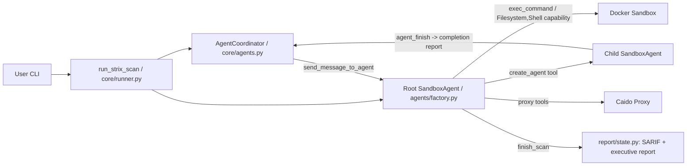
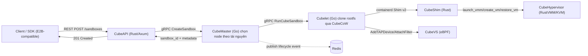
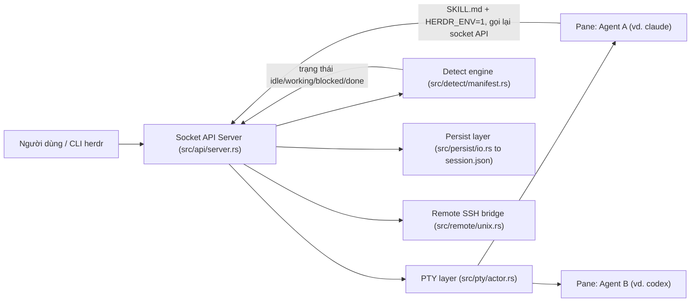
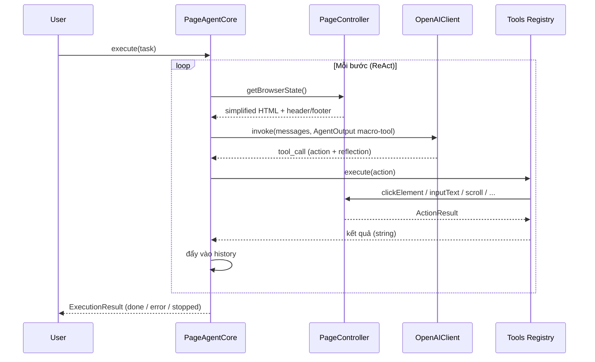

# Weekly Agentic AI Scan — 2026-07-11

**Phạm vi:** repos mới publish hoặc active mạnh trong 7 ngày qua (04/07 – 11/07/2026), lọc theo tiêu chí novel architecture / production engineering / eval nghiêm túc. Nguồn dữ liệu: GitHub Trending (weekly) + xác minh trực tiếp từng repo (README, cấu trúc thư mục, source file qua raw.githubusercontent.com). *Lưu ý: `api.github.com`/`gh` CLI bị chặn trong môi trường chạy scan này nên không dùng được GitHub Search API để lọc theo `created:`/`pushed:` chính xác tuyệt đối — danh sách dưới đây được suy ra từ GitHub Trending (weekly) + kiểm tra thủ công ngày release/số commit của từng repo.*

## Executive Summary

- **Hạ tầng cho agent đang tách khỏi bản thân agent**: 2/4 repo deep-dive tuần này (CubeSandbox, herdr) không phải là "agent" mà là lớp hạ tầng/điều phối cho agent khác chạy — dấu hiệu thị trường agent đang trưởng thành sang tầng infra chuyên biệt (sandbox execution, terminal multiplexing) thay vì thêm framework LLM-loop mới.
- **"Graph of Agents" trên nền SDK có sẵn thắng thế hơn tự viết từ đầu**: Strix xây lớp điều phối multi-agent (coordinator, inbox, resume) *trên* `openai-agents` SDK thay vì tự viết vòng lặp ReAct — pattern đáng học cho ai đang cân nhắc build multi-agent system.
- **DOM-text thay screenshot đang thành xu hướng cho browser agent**: PageAgent (Alibaba) port kiến trúc từ `browser-use`, chứng minh lại giá trị của text-based DOM indexing (rẻ token, không cần vision model) — nhưng đi kèm rủi ro bảo mật rõ ràng (`execute_javascript` chạy `eval()` không sandbox).

## Mục lục

1. [Strix — usestrix/strix](#1-strix--usestrixstrix)
2. [CubeSandbox — TencentCloud/CubeSandbox](#2-cubesandbox--tencentcloudcubesandbox)
3. [herdr — ogulcancelik/herdr](#3-herdr--ogulcancelikherdr)
4. [PageAgent — alibaba/page-agent](#4-pageagent--alibabapage-agent)
5. [Candidates khác đã xét nhưng không deep-dive](#5-candidates-khác-đã-xét-nhưng-không-deep-dive)

---

## 1. Strix — usestrix/strix

Repo: https://github.com/usestrix/strix

### §1 — Bối cảnh nhanh

Strix là công cụ pentest tự động mã nguồn mở: các "AI hacker" tự chủ chạy code thật, khai thác lỗ hổng và xác minh bằng exploit hoạt động được, thay vì chỉ quét tĩnh. Stack chính: Python 3.12+, xây trên `openai-agents` SDK (bản mở rộng có sandbox) kết hợp LiteLLM để đa nhà cung cấp model, Docker để sandbox hoá, Textual cho TUI, Caido SDK cho proxy chặn HTTP. Repo khoẻ: 40.2k sao, license Apache-2.0, release mới nhất v1.0.4 (9/6/2026), có CI qua GitHub Actions, cấu trúc `strix/` module hoá rõ ràng (agents, core, runtime, tools, skills, report, telemetry, interface).

### §2 — Phân tích kiến trúc sâu

#### A. Kiểm kê thành phần
- `AgentCoordinator` (`strix/core/agents.py`) — "chủ sở hữu" duy nhất của trạng thái đồ thị agent: status, quan hệ cha-con, inbox message, snapshot phục hồi (resume).
- `run_strix_scan` / vòng lặp thực thi (`strix/core/runner.py`, `strix/core/execution.py`) — điểm vào scan, dựng root agent, quản lý vòng đời chạy/tạm dừng/khôi phục.
- `build_strix_agent` (`strix/agents/factory.py`) — nhà máy dựng `SandboxAgent` (root và con), gắn bộ công cụ cơ bản (`_BASE_TOOLS`) và capability sandbox (`Filesystem`, `Shell`).
- Bộ công cụ đồ thị đa agent: `create_agent`/`send_message_to_agent`/`wait_for_message`/`agent_finish` (`strix/tools/agents_graph/tools.py`) — cơ chế sinh agent con, nhắn tin liên-agent, chờ tín hiệu.
- `StrixProvider` (`strix/config/models.py`) — router model kế thừa `MultiProvider` của SDK, định tuyến model theo prefix (openai/litellm/ollama/…) qua LiteLLM.
- Skills system (`strix/skills/`, tool `load_skill` tại `strix/tools/load_skill/tool.py`) — các gói kiến thức chuyên biệt nạp động vào system prompt hoặc theo yêu cầu.
- Proxy tool Caido (`strix/tools/proxy/tools.py`, `caido_api.py`) — bọc Caido SDK client thành function-tool để agent xem/replay HTTP request.
- Runtime sandbox (`strix/runtime/docker_client.py`, `session_manager.py`, `backends.py`) — quản lý container Docker cho mỗi scan.
- Report/telemetry (`strix/report/state.py`, `report/sarif.py`, `report/usage.py`, `telemetry/logging.py`) — theo dõi usage/cost SDK-native, xuất SARIF, log có ngữ cảnh scan_id/agent_id.
- `ReportUsageHooks`/`BudgetExceededError` (`strix/core/hooks.py`) — hook vòng đời SDK theo dõi chi phí LLM sau mỗi lượt gọi và dừng scan khi vượt ngân sách.

#### B. Control flow pattern
Mô hình **hierarchical supervisor-worker / "Graph of Agents"** trên nền vòng lặp ReAct do SDK `openai-agents` cung cấp (mỗi agent tự lặp think→tool-call→observe qua `Runner.run_streamed`), với một lớp điều phối multi-agent riêng của Strix nằm bên trên:
1. `run_strix_scan` khởi tạo sandbox Docker, dựng `root_agent` qua `build_strix_agent(is_root=True)`, đăng ký với `AgentCoordinator`.
2. Root agent chạy vòng `_run_cycle` (`Runner.run_streamed`) — model quan sát mục tiêu, gọi tool (recon, proxy, shell...).
3. Khi cần chia việc, root gọi tool `create_agent` để sinh agent con chuyên biệt, chạy song song như một `asyncio.Task` riêng, kế thừa lịch sử hội thoại cha.
4. Agent con làm việc độc lập, có thể tự gọi `create_agent` để sinh cháu (đệ quy đa cấp), báo cáo hoàn thành qua `agent_finish`.
5. Cha có thể `wait_for_message` để tạm dừng đến khi nhận phản hồi; `send_message_to_agent` cho trao đổi bất đồng bộ.
6. Khi root gọi `finish_scan`, vòng scan kết thúc, ghi báo cáo (SARIF, executive report), dọn sandbox.

#### C. State & luồng dữ liệu
Mỗi agent có SDK-native session (`agents.memory.Session`, lưu SQLite `agents.db`) chứa lịch sử hội thoại đầy đủ. `AgentCoordinator` chèn trực tiếp message liên-agent vào session SDK của agent nhận, định dạng text có prefix `[Message from <name> (<id>) | type=... | priority=...]`. Trạng thái đồ thị được snapshot định kỳ ra `agents.json` để hỗ trợ resume. Không có cơ chế cắt tỉa/tóm tắt cửa sổ ngữ cảnh chủ động, chỉ có `strip_all_images_from_session` (xoá ảnh khi provider từ chối input quá lớn) — đây là cơ chế chữa lỗi hơn là quản lý context.

#### D. Tool/capability integration
Tool đăng ký qua decorator `@function_tool` của SDK (native function-calling / Responses API). Với model chỉ hỗ trợ chat-completions JSON schema, Strix bọc lại thành `FunctionTool` với input JSON thô — hai chế độ gọi tool song song. Validate input bằng Pydantic. Shell/filesystem là capability sandbox có sẵn của SDK (`agents.sandbox.capabilities.Filesystem/Shell`), chạy trong container Docker cách ly.

#### E. Kiến trúc bộ nhớ
Không có bộ nhớ dài hạn/vector store riêng — bộ nhớ hội thoại là session SQLite theo từng agent. Có `notes` và `todo` (`strix/tools/notes/`, `strix/tools/todo/`) làm "bộ nhớ làm việc" chia sẻ, tồn tại qua các lượt resume. Không xác định từ code có memory dài hạn giữa các lần scan khác nhau.

#### F. Điều phối model
Một model duy nhất cho mọi vai trò (root và agent con dùng cùng `STRIX_LLM`) — không phân vai model theo tầng. Đa nhà cung cấp qua `StrixProvider(MultiProvider)` + LiteLLM. Retry chuẩn hoá 5 lần, backoff mũ 2–90s. Song song hoá đến từ multi-agent (mỗi agent con một `asyncio.Task`), không phải batching.

#### G. Observability & eval
Logging có ngữ cảnh scan_id/agent_id qua `ContextVar`. Theo dõi usage/cost qua LiteLLM callback và `ReportUsageHooks` để enforce budget. Xuất SARIF chuẩn công nghiệp kèm git provenance. Gửi telemetry ẩn danh qua PostHog/Scarf. Không có framework eval/benchmark tự động — SARIF phục vụ báo cáo/CI, không chấm điểm chất lượng agent.

#### H. Điểm mở rộng
Skills tuỳ biến qua file markdown trong `strix/skills/custom/`. Model đổi qua biến môi trường `STRIX_LLM`/`LLM_API_BASE`. Tool mới cần sửa trực tiếp `_BASE_TOOLS` trong `factory.py` — không có plugin-registry/entry-point động rõ ràng.

### §3 — Sơ đồ Mermaid

### §4 — Nhận định

Điểm đáng chú ý nhất: Strix không tự viết vòng lặp agent hay hạ tầng sandbox từ đầu — nó là **lớp điều phối đa-agent (Graph of Agents) đặt trên bộ khung sandbox chính thức của `openai-agents` SDK**, còn Strix tự viết phần "xã hội hoá" nhiều agent: coordinator, inbox nhắn tin, resume/snapshot, cơ chế "lifecycle tool" ép model phải gọi `finish_scan`/`agent_finish` thay vì kết thúc bằng text tự do. Đây là điểm kỹ thuật đáng học hơn bản thân ý tưởng "AI pentest".

Hạn chế: dùng một model duy nhất cho mọi vai trò (không phân tầng chi phí); không có quản lý context-window chủ động; không có eval/benchmark đo chất lượng phát hiện lỗ hổng so với ground truth; project tự khai `Development Status :: 3 - Alpha` dù đã 40k sao.

Câu hỏi cần đào thêm: cơ chế thực sự tạo/chạy exploit PoC (có thể chỉ là `exec_command` trong sandbox, cần xác nhận); chi tiết nền tảng cloud (app.strix.ai) không nằm trong repo mã nguồn mở nên không đánh giá được.

---

## 2. CubeSandbox — TencentCloud/CubeSandbox

Repo: https://github.com/TencentCloud/CubeSandbox

### §1 — Bối cảnh nhanh

CubeSandbox là hạ tầng sandbox microVM (RustVMM + KVM) cho AI Agent, tương thích E2B SDK, cam kết cold-start dưới 60ms và overhead bộ nhớ dưới 5MB/instance. Stack: Rust (CubeAPI, CubeShim, CubeHypervisor, CubeCoW) + Go (CubeMaster, Cubelet, CubeVS control-plane) + Lua/OpenResty (CubeProxy, CubeEgress). Sức khỏe repo: 9.6k sao, Apache-2.0, release mới nhất v0.5.0 (3/7/2026), 519 commit trên `master`, CI đầy đủ (~23 workflow GitHub Actions).

### §2 — Phân tích kiến trúc sâu

#### A. Kiểm kê thành phần
- `CubeAPI` (`CubeAPI/Cargo.toml`, crate `cube-api`, Rust/Axum) — REST gateway tương thích E2B, dịch request sang gRPC nội bộ.
- `CubeMaster` (`CubeMaster/go.mod`, Go) — bộ điều phối cấp cluster: chọn node theo tài nguyên, dispatch cho Cubelet, publish lifecycle event.
- `CubeProxy` (thư mục `CubeProxy/`, OpenResty/Lua) — reverse proxy định tuyến request tới sandbox theo Host header hoặc path.
- `Cubelet` (`Cubelet/go.mod`, Go) — agent lịch trình cục bộ trên từng node, quản lý vòng đời VM, tích hợp containerd.
- `CubeShim` (`CubeShim/Cargo.toml`) — cài đặt containerd Shim v2 API, cầu nối giữa containerd và MicroVM.
- `CubeHypervisor` (`hypervisor/Cargo.toml`, `authors = "The Cloud Hypervisor Authors"`) — VMM dựa trên **fork trực tiếp của Cloud Hypervisor** (RustVMM+KVM), seccomp-hardened.
- `CubeVS` (`CubeNet/cubevs/`, eBPF C: `mvmtap.bpf.c`, `nodenic.bpf.c`, `localgw.bpf.c` + Go control-plane) — cách ly mạng cấp kernel, SNAT/DNAT, LPM policy.
- `CubeCoW` (`cubecow/Cargo.toml`) — thư viện Rust CoW storage dùng ioctl `FICLONE` trên XFS, snapshot/clone O(1).
- `CubeEgress` (thư mục `CubeEgress/`) — cổng egress L7 (OpenResty+Lua), lọc domain, chèn credential, audit log JSONL.
- `cube-lifecycle-manager` (Go) — theo dõi lifecycle event, tự động pause/resume sandbox nhàn rỗi.
- `sdk/` (`sdk/go`, `sdk/node`, `sdk/python`) — SDK client tương thích E2B, gói `cubesandbox` publish lên PyPI.

#### B. Control flow pattern
Theo sequence diagram trong `docs/architecture/overview.md`:
1. Client/SDK gửi `POST /sandboxes` (REST, tương thích E2B) tới CubeAPI.
2. CubeAPI gọi gRPC `CreateSandbox` tới CubeMaster.
3. CubeMaster chọn node đích theo resource fit, gọi gRPC `RunCubeSandbox` tới Cubelet trên node đó.
4. Cubelet clone rootfs (qua CubeCoW), gọi CubeShim qua containerd Shim v2; CubeShim gọi CubeHypervisor để dựng VM, Cubelet gắn TAP device vào CubeVS.
5. Cubelet báo Sandbox running lên CubeMaster; CubeMaster publish lifecycle event lên Redis.
6. CubeMaster trả sandbox_id/metadata cho CubeAPI, CubeAPI trả 201 cho client.

Mô hình **hierarchical supervisor-worker** (CubeMaster giám sát nhiều Cubelet trên nhiều node), kết hợp **pipeline dịch giao thức** theo chiều dọc (REST→gRPC→containerd Shim v2→KVM API) và yếu tố **event-driven** (publish lifecycle event qua Redis).

#### C. State & luồng dữ liệu
Giao thức: REST (E2B-compat) client↔CubeAPI; gRPC CubeAPI↔CubeMaster↔Cubelet; containerd Shim v2 (ttrpc) Cubelet↔CubeShim. Tài liệu tuyên bố "Stateless Control Plane" — **Redis** là nguồn sự thật cho metadata sandbox, event stream, bảng định tuyến CubeProxy, distributed lock. Tuy nhiên `CubeMaster/go.mod` có dependency MySQL — vai trò chính xác không xác định từ code đã đọc. Storage dùng CoW qua `FICLONE` (reflink XFS): Template → clone O(1) → rootfs → snapshot tiếp theo, không copy dữ liệu.

#### D. Tool/capability integration
Agent framework tích hợp qua REST API tương thích E2B SDK ("swap one URL env var, zero business code changes"). SDK chính thức: Python (PyPI `cubesandbox`), Node, Go. Không tìm thấy bằng chứng hỗ trợ MCP trong repo. Cách ly: KVM MicroVM riêng kernel + seccomp, cách ly mạng eBPF (CubeVS, mặc định chặn IP private/link-local), egress L7 zero-trust qua CubeEgress. Tính năng "Digital Assistant/AgentHub" được đánh dấu rõ **Preview**.

#### E. Kiến trúc bộ nhớ
Không áp dụng — đây là hạ tầng thực thi (execution infra), không phải bản thân agent có bộ nhớ riêng.

#### F. Điều phối model
Không áp dụng/không xác định từ code — repo không chứa logic điều phối LLM.

#### G. Observability & eval
`cubelog/` (Go tự viết) cho service Go; Rust dùng crate `tracing`. Đáng chú ý: `CubeAPI/Cargo.toml` có dòng OpenTelemetry bị **comment out** với ghi chú "stub, wire up later" — distributed tracing chưa được nối dây thật dù logging JSON đã có. CubeEgress ghi audit log JSONL. Có benchmark cụ thể trong `docs/blog/posts/` (cold-start, snapshot, density) và WebUI dashboard (`:12088`). Không tìm thấy tích hợp Prometheus/Grafana.

#### H. Điểm mở rộng
Hệ thống Template (OCI image → Buildkit → rootfs + cold-boot → memory snapshot). CubeProxy hỗ trợ 2 chế độ định tuyến. CubeAPI "supports pluggable auth callbacks". Chính sách mạng per-sandbox cấu hình runtime qua `MVMOptions` không cần reload BPF. Roadmap (chưa triển khai): Kubernetes-native CRD/operator, cross-node pause/resume.

### §3 — Sơ đồ Mermaid

### §4 — Nhận định

Điểm đáng nghiên cứu nhất không phải "sandbox microVM" (đã có Firecracker/E2B/Modal) mà là **CubeCoW** — engine CoW dựa trên `FICLONE`/reflink XFS kết hợp incremental dirty-page tracking, cho phép snapshot/clone/rollback ở độ chính xác trăm-millisecond mà không copy dữ liệu — phục vụ đúng use-case "agent RL training/SWE-bench" (branching hàng loạt state) chứ không chỉ chạy code một lần.

Cờ đỏ: (1) tuyên bố "hàng nghìn sandbox đồng thời/node" nhưng benchmark công khai chỉ đo tới 50 lần tạo đồng thời; (2) OpenTelemetry bị comment "stub, wire up later" dù project quảng bá là hạ tầng production-grade; (3) AgentHub/Digital Assistant đánh dấu rõ Preview; (4) dự án mới open-source từ 20/4/2026 (~3 tháng) nhưng đã 9.6k sao — cần thận trọng khi đánh giá độ chín.

Câu hỏi cần đào sâu: thuật toán "resource fit" chọn node của CubeMaster; vai trò thực của MySQL nếu control plane tuyên bố "stateless" hoàn toàn dựa Redis; roadmap Kubernetes-native sẽ thay đổi kiến trúc control/data-plane đến mức nào.

---

## 3. herdr — ogulcancelik/herdr

Repo: https://github.com/ogulcancelik/herdr

### §1 — Bối cảnh nhanh

Herdr là "agent multiplexer" chạy trong terminal — quản lý nhiều tiến trình AI coding agent (Claude Code, Codex, v.v.) chạy song song trong các pane PTY, có thể detach/reattach và điều khiển qua SSH. Stack: Rust (85%) + ratatui (TUI) + `portable-pty` (vendored) + `interprocess` (Unix socket/Windows named pipe) + tokio + serde_json. Sức khỏe repo: 15.3k sao, 1082 commit trên `master`, phát hành v0.7.3 (7/7/2026), 10 workflow CI, giấy phép kép AGPL-3.0-or-later + thương mại.

### §2 — Phân tích kiến trúc sâu

#### A. Component inventory
- `Socket API Server` (`src/api/server.rs`) — vòng lặp accept trên Unix domain socket/named pipe, phân giải request JSON-RPC-like thành `Method` enum.
- `API Schema` (`src/api/schema.rs`) — định nghĩa `Request`/`Method` (60+ RPC method: `pane.*`, `workspace.*`, `agent.*`, `plugin.*`...), sinh JSON Schema (`herdr-api.schema.json`).
- `Event Subscriptions` (`src/api/subscriptions.rs`) và `Wait helpers` (`src/api/wait.rs`) — cơ chế push event/long-poll qua cùng kết nối socket.
- `PTY layer` (`src/pty/actor.rs`, `src/pty/backend.rs`, dùng `portable-pty` vendor hoá) — spawn tiến trình agent CLI thật trong pseudo-terminal.
- `Detect engine` (`src/detect/manifest.rs` + 19 file `src/detect/manifests/<agent>.toml`) — nhận diện trạng thái agent (idle/working/blocked/done) bằng luật AND/OR trên vùng đáy màn hình terminal.
- `Integration installers` (`src/integration/registry.rs`, `types.rs`) — cài hook/settings/plugin cho 14 agent CLI cụ thể.
- `Persist layer` (`src/persist/io.rs`, `snapshot.rs`, `restore.rs`, `plugin_registry.rs`) — ghi/đọc `session.json`, `session-history.json`, `plugins.json`.
- `Remote SSH bridge` (`src/remote/unix.rs`) — thin-client `herdr --remote` chạy qua stdio SSH.
- `Server handoff` (`src/server/handoff.rs`) — live-handoff giữ pane sống khi nâng cấp server.

#### B. Control flow pattern
Không phải vòng lặp planner/executor LLM — mô hình **server-owned runtime + nhiều client mỏng**, phối hợp qua socket kiểu event/RPC:
1. `herdr` khởi động server nền, bind socket tại `~/.config/herdr/herdr.sock`.
2. Server tạo pane, mỗi pane spawn một tiến trình PTY thực (vd. `claude`, `codex`).
3. Detect engine hoặc hook tích hợp chủ động (`pane.report_agent`) cập nhật trạng thái pane.
4. Agent trong pane (đã cài `SKILL.md`, `HERDR_ENV=1`) gọi CLI `herdr` để `pane split`, `pane run "codex"` sinh pane sibling, rồi `wait agent-status`/`events.subscribe` để biết khi agent kia xong, `pane read` lấy output.
5. Client TUI có thể detach; server headless tiếp tục chạy các pane.
6. Trạng thái workspace/tab/pane ghi ra `session.json` để khôi phục sau restart.

#### C. State & luồng dữ liệu
Giao thức JSON newline-delimited, một object/dòng dạng `{"id","method","params"}` → `{"id","result"}`/`{"id","error"}`. Trạng thái phiên in-memory trong server (`AppState`), đồng thời ghi file JSON (`session.json`, `session-history.json`, `plugins.json`) kiểu ghi an toàn (ghi `.json.tmp` rồi `rename`).

#### D. Tool/capability integration
Agent CLI ngoài không bị bọc — chạy như tiến trình OS bình thường trong PTY (`src/plugin_command.rs`). Nhận diện danh tính agent qua 2 cách: passive (rule TOML) và active self-report (`pane.report_agent`). Không có sandbox thực thi; giới hạn duy nhất là quyền file socket `0o600` và cổng tương thích plugin (`min_herdr_version`) — gate tương thích, không phải sandbox bảo mật.

#### E. Kiến trúc bộ nhớ
Không áp dụng — herdr không quản lý ngữ cảnh/bộ nhớ LLM; chỉ lưu scrollback terminal và layout snapshot.

#### F. Điều phối model
Không áp dụng — herdr agnostic với model, không có dependency SDK LLM nào trong `Cargo.toml`; chỉ khởi chạy binary agent do người dùng chỉ định.

#### G. Observability & eval
`agent.explain`/`herdr agent explain --json` giải thích luật detect đã khớp; `plugin.log.list` liệt kê log action/event gần đây. Dùng `tracing`/`tracing-subscriber`. Không xác định từ code việc có audit trail bền vững dài hạn ngoài các cơ chế trên.

#### H. Điểm mở rộng
Hệ plugin qua manifest `herdr-plugin.toml` (`actions`, `events`, `panes`, `link_handlers`), đăng ký bền vững trong `plugins.json`. Thêm loại agent mới: tạo file luật `src/detect/manifests/<agent>.toml` (declarative) và tuỳ chọn installer trong `src/integration/`.

### §3 — Sơ đồ Mermaid

### §4 — Nhận định

Điểm đáng nghiên cứu nhất: herdr không cố làm "agent" mà xây một **giao thức runtime tường minh** (JSON-RPC qua socket, JSON Schema xuất ra, event subscribe/wait) để chính các agent bên trong pane tự gọi lại API để sinh pane, chờ trạng thái, đọc output của nhau — biến terminal multiplexer thành hạ tầng điều phối multi-agent mà không cần framework agent nào.

Hạn chế: không có sandbox cho tiến trình agent (chạy quyền OS đầy đủ), giới hạn bảo mật socket chỉ dựa quyền file 0600; `src/server/headless.rs` dài bất thường (8670 dòng) — có thể là "god module" cần tách theo chính nguyên tắc mà `AGENTS.md` của repo đề ra.

Câu hỏi cần đào thêm: cơ chế xác thực/mã hoá cho `herdr --remote` ngoài SSH gốc (không xác định từ code); `plugin.action.invoke` có giới hạn tài nguyên/timeout khi chạy lệnh plugin tuỳ ý hay không.

---

## 4. PageAgent — alibaba/page-agent

Repo: https://github.com/alibaba/page-agent

### §1 — Bối cảnh nhanh

PageAgent là tác nhân GUI chạy hoàn toàn bằng JavaScript **bên trong trang web**, điều khiển giao diện bằng ngôn ngữ tự nhiên qua thao tác DOM dạng văn bản thay vì ảnh chụp màn hình. Stack: TypeScript monorepo (npm workspaces, 8 package), Zod v4, MCP SDK, WXT+React cho extension, Vitest. Repo health: 25.9k sao, 2.4k fork, MIT, release v1.12.1 (10/7/2026), có CI và cả unit test lẫn "live test" gọi API LLM thật.

### §2 — Phân tích kiến trúc sâu

#### A. Component inventory
- `PageAgentCore` (`packages/core/src/PageAgentCore.ts`) — lớp lõi chạy vòng lặp agent (ReAct), quản lý `history`, event system (`statuschange`, `historychange`, `activity`, `dispose`).
- `tools` registry (`packages/core/src/tools/index.ts`) — các "action" nguyên thủy: `done`, `wait`, `ask_user`, `click_element_by_index`, `input_text`, `select_dropdown_option`, `scroll`, `execute_javascript`, mỗi tool có schema Zod + hàm `execute`.
- System prompt (`packages/core/src/prompts/system_prompt.md`) — import trực tiếp vào `PageAgentCore.ts`.
- `PageController` (`packages/page-controller/src/PageController.ts`) — quản lý DOM: index hoá cây DOM, sinh "simplified HTML", thực thi click/input/scroll/select/`executeJavascript`.
- DOM-tree builder (`packages/page-controller/src/dom/dom_tree/index.js`) — quét cây DOM, gán `highlightIndex` cho phần tử tương tác; header ghi rõ "port from browser-use".
- `OpenAIClient` (`packages/llms/src/index.ts`, `OpenAIClient.ts`) — client OpenAI-Chat-Completions-compatible duy nhất cho mọi model.
- `modelPatch()` (`packages/llms/src/utils.ts`) — lớp "thích ứng" theo tiền tố tên model (qwen, deepseek, gpt, claude, gemini, glm, hunyuan, grok, kimi, minimax, openrouter).
- MCP server (`packages/mcp/src/index.js`, `hub-bridge.js`) — process Node độc lập dùng `@modelcontextprotocol/sdk`, expose tool `execute_task`/`get_status`/`stop_task`.
- `PageAgent` (`packages/page-agent/src/PageAgent.ts`) — entrypoint public, ghép Core + PageController + UI.

#### B. Control flow pattern
Vòng lặp **ReAct (observe → think → act)**, ghi thẳng trong JSDoc của `PageAgentCore`:
1. Người dùng gọi `agent.execute(task)`.
2. **Observe**: `pageController.getBrowserState()` quét DOM sống, dựng `FlatDomTree`, chuyển thành "simplified HTML".
3. Assemble prompt: `system` + `user` (gồm `<agent_state>`, `<agent_history>`, `<browser_state>` dạng XML-like).
4. **Think**: gọi `LLM.invoke()` → `OpenAIClient` POST `/chat/completions` với `tool_choice` ép cứng vào macro-tool `AgentOutput`.
5. **Act**: macro tool giải mã `action` trả về, dispatch sang tool tương ứng → `PageController` thực thi thao tác thật trên DOM.
6. Kết quả + reflection (`memory`, `next_goal`) đẩy vào `history`, lặp lại từ bước 2 tới khi tool `done` được gọi hoặc vượt `maxSteps` (mặc định 40).

#### C. State & luồng dữ liệu
DOM biểu diễn dưới dạng **"simplified HTML"** (không phải accessibility tree, không phải ảnh chụp) — mỗi phần tử tương tác có `highlightIndex` số nguyên làm "địa chỉ" cho action. Prompt mỗi bước chỉ gồm 2 message (system + user). State lưu **hoàn toàn in-memory** trong instance `PageAgentCore`, reset mỗi lần `execute()` mới — không có `localStorage`/IndexedDB. Quản lý ngữ cảnh cho trang lớn dựa vào `viewportExpansion` và cảnh báo mềm khi còn 5/2 bước cuối; không có cơ chế đếm token/cắt ngữ cảnh cứng.

#### D. Tool/capability integration
Dùng **native function-calling thật**: schema Zod convert sang JSON Schema, gói thành **một macro-tool duy nhất** (`AgentOutput`) là union Zod của toàn bộ action, ép `tool_choice` = named tool này. Response parse `JSON.parse` từ `tool_calls[0].function.arguments`, validate lại bằng `zod.safeParse`. MCP: server stdio riêng, bắc cầu qua `HubBridge` (HTTP + WebSocket) tới trang chạy PageAgent thật trong trình duyệt.

#### E. Kiến trúc bộ nhớ
Tối giản, chỉ tồn tại trong phạm vi một task/session (`history` xoá mỗi lần `execute()` mới). Trường `memory` trong macro-tool là bộ nhớ làm việc ngắn hạn do LLM tự ghi mỗi bước. Không có bộ nhớ dài hạn/liên-phiên.

#### F. Điều phối model
"LLM-agnostic" bằng **một `OpenAIClient` duy nhất** nói chuẩn OpenAI Chat Completions, cộng hàm `modelPatch()` áp heuristic theo tiền tố tên model để chỉnh `tool_choice`/`reasoning_effort`/`temperature`, và hook `transformRequestBody` do người dùng tự cung cấp cho case chưa hỗ trợ.

#### G. Observability & eval
Log console có màu theo từng step; event system UI; usage token (`promptTokens`, `completionTokens`, `cachedTokens`, `reasoningTokens`) trả về mỗi lần invoke. Có unit test (`PageAgentCore.test.ts`, `PageController.test.ts`, `llms/index.test.ts`) và bộ "live test" (`models.live.test.ts`) gọi API LLM thật. Không tìm thấy benchmark GUI chuẩn hoá kiểu WebArena/Mind2Web.

#### H. Điểm mở rộng
Chrome Extension (WXT + React) cho tác vụ đa trang (chưa soi source chi tiết). MCP server là điểm mở rộng điều khiển từ ngoài rõ ràng nhất. `AgentConfig` cho phép tuỳ biến sâu: `customTools`, `customSystemPrompt`, `transformPageContent`, `transformRequestBody`, `getPageInstructions`, `experimentalLlmsTxt`.

### §3 — Sơ đồ Mermaid

### §4 — Nhận định

Điểm đáng nghiên cứu nhất là cách hiện thực hoá "text-based DOM" không chỉ là khẩu hiệu: `dom_tree/index.js` là bản **port trực tiếp** từ `browser-use` (ghi rõ commit hash gốc), quét DOM sống thành cây phẳng với `highlightIndex`, biến mọi action thành lời gọi hàm theo chỉ số phần tử thay vì click theo toạ độ pixel — độ tin cậy cao hơn agent dựa vision/screenshot, chi phí token thấp hơn, nhưng khó xử lý UI dạng canvas/shadow DOM phức tạp (chưa kiểm chứng).

Điểm cần lưu ý: README/LICENSE ghi rõ phần xử lý DOM và prompt kế thừa từ `browser-use`, không phải phát minh gốc. `execute_javascript` cho phép LLM chạy `eval()` tuỳ ý trên trang thật — rủi ro bảo mật đáng chú ý, chỉ giảm nhẹ bằng comment cảnh báo, không có sandbox thực sự. `modelPatch()` là danh sách heuristic tên-model phình to dần — gánh nặng bảo trì khi model mới ra liên tục.

Câu hỏi mở: cơ chế cắt/nén ngữ cảnh khi trang quá lớn; kiến trúc thật của Chrome Extension — chưa kiểm chứng đủ.

---

## 5. Candidates khác đã xét nhưng không deep-dive

Các repo dưới đây xuất hiện trên GitHub Trending (weekly) tuần này, liên quan tới agentic AI và đạt tiêu chí filter cơ bản, nhưng bị deprioritize khỏi deep-dive để tránh trùng lặp kiến trúc với 4 repo trên hoặc vì phạm vi hẹp hơn (tool/gateway thay vì kiến trúc agent/orchestration mới):

- **stablyai/orca** (~16k sao, TypeScript, MIT) — IDE điều phối nhiều agent CLI (Claude Code, Codex, OpenCode) chạy song song trong git worktree riêng biệt, có app mobile companion. Bị loại khỏi deep-dive vì trùng lặp concept với herdr (multiplexer cho nhiều agent CLI).
- **xbtlin/ai-berkshire** (~12.7k sao, Python, MIT) — framework nghiên cứu đầu tư multi-agent mô phỏng phong cách Buffett/Munger/Duan Yongping/Li Lu, kiến trúc 3 lớp Skill/Agent/Tools, có backtesting thật. Đáng chú ý nhưng miền ứng dụng (tài chính) hẹp hơn so với 4 repo chọn.
- **iOfficeAI/OfficeCLI** (~14.6k sao, C#, Apache-2.0) — CLI cho AI agent thao tác Word/Excel/PowerPoint, kiến trúc 3 tầng L1 (semantic view) / L2 (DOM element ops) / L3 (raw XML/XPath). Là "tool" cho agent dùng hơn là bản thân kiến trúc agent.
- **wonderwhy-er/DesktopCommanderMCP** (~7.4k sao, TypeScript, MIT) — MCP server cấp quyền filesystem/terminal cho Claude Desktop. Là ví dụ MCP tool-provider tốt nhưng không có orchestration riêng đáng deep-dive.
- **openai/codex-plugin-cc** (~27.5k sao, JavaScript, Apache-2.0) — plugin Claude Code delegate task sang Codex CLI qua subagent `codex:codex-rescue`. Thú vị cho pattern "agent gọi agent khác qua CLI wrapper" nhưng bề mặt kiến trúc mỏng (chủ yếu là slash-command + process wrapper).
- **diegosouzapw/OmniRoute** (~15.2k sao, TypeScript, MIT) — gateway routing LLM tới 237+ provider, nén token qua 10 engine (LLMLingua-2, Caveman...), hỗ trợ MCP + giao thức A2A. Là hạ tầng routing/gateway cho agent, không phải bản thân kiến trúc agent.

---

*Nguồn: GitHub Trending (weekly, truy cập 11/07/2026) + xác minh trực tiếp README/source từng repo qua `raw.githubusercontent.com`. Ghi chú giới hạn phương pháp: do `api.github.com` bị chặn trong môi trường chạy scan, không thể lọc chính xác theo `created:>date`/`stars:>N` bằng GitHub Search API như quy trình chuẩn — danh sách candidate dựa trên Trending weekly nên có thể bỏ sót repo mới nhưng chưa lên trending.*
